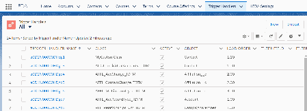
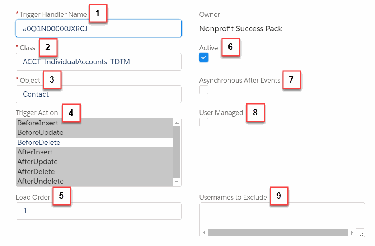
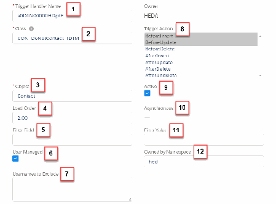
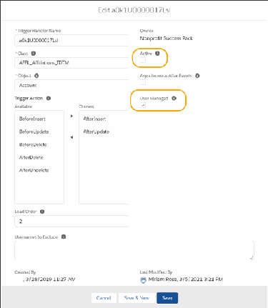
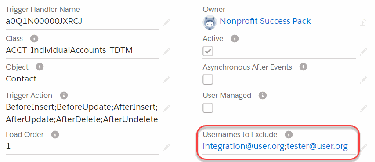
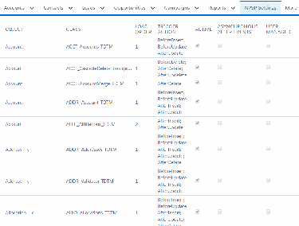

Advanced NPSP Configurations
Manage or disable trigger handlers or deploy custom code in the TDTM framework.
Table-Driven Trigger Management
Learn about what Table-Driven Trigger Management (TDTM) is and how you might want to use it to
customize your NPSP org.
Manage Trigger Handlers for NPSP
Learn about trigger handlers that are used in Table-Driven Trigger Management (TDTM).
Disable Trigger Handlers for NPSP
Learn how to disable trigger handlers for all users, specific users, and with apex code.
Deploy a Custom Apex Class in the TDTM Framework for NPSP
The Nonprofit Success Pack (NPSP) relies heavily on Apex to implement much of its functionality.
Salesforce.org products use one trigger per object and Table-Driven Trigger Management (TDTM) to
control the execution of Apex classes.
Apex Class Descriptions for NPSP
Below is a list of Apex classes managed by Table-Driven Trigger Management (TDTM) along with a
description of each. Some classes appear multiple times because more than one Trigger Handler can
reference the same class.
262

Table-Driven Trigger Management
Learn about what Table-Driven Trigger Management (TDTM) is and how you might want to use it to
customize your NPSP org.
Introduction
Table-Driven Trigger Management (TDTM) is a tool to manage your code in Salesforce and control how
Apex behaves. Apex is the programming language used to build complex automation in Salesforce,
and TDTM is a framework for managing that code.
What Is TDTM?
Table-driven trigger management (TDTM) is a tool for automation—and automation is one of the big
benefits of using Salesforce.
Disable Specific Pieces of Code
Disable code related to your automated processes to control whether and when certain pieces of code
operate.
Create Your Own Custom Code
If you're developing your own custom Apex code or integrating an external system with Salesforce, you
should familiarize yourself with the TDTM architecture. Salesforce and many expert developers
recommend that you have only on one trigger for each object (one for Contacts, one for Accounts,
and so on).
Control the Order in Which Your Code Executes
If your organization has been using Salesforce for a while, it's likely that you'll identify where more
automation could save time. While tools like Process Builder and workflow can do some of these
things, custom Apex code is sometimes more appropriate. As you develop custom code, it becomes
really important to manage the order in which your code fires, which is why TDTM is so helpful.
Summing Up
TDTM allows organizations to grow and more easily add complexity to their databases while still
maintaining control over the scope and sequence of process automation.
Introduction
Table-Driven Trigger Management (TDTM) is a tool to manage your code in Salesforce and control how
Apex behaves. Apex is the programming language used to build complex automation in Salesforce, and
TDTM is a framework for managing that code.
We're here to demystify TDTM—what it is and why it's such a powerful tool for nonprofits and educational
institutions using applications like Nonprofit Success Pack (NPSP) and Education Data Architecture (EDA)
from Salesforce.org.
What Is TDTM?
Table-driven trigger management (TDTM) is a tool for automation—and automation is one of the big
benefits of using Salesforce.
263

For example, when a Contact record in Salesforce is added, updated, or deleted, we often want other
things to happen automatically—update an address or a value on an Account. You may be familiar with
using Process Builder or workflows in Salesforce to automate business processes. Some of the more
complex processes are built with another automation tool called Apex triggers. Apex triggers are simply
another way of handling automation, using code rather than a feature like workflow.
NPSP EDA relies heavily on triggers. For example, a trigger on the Contact object can automatically
update address data when the Contact is updated. Other triggers are used to roll up or summarize data
from related records to a parent record. Triggers come standard with NPSP EDA, and TDTM is the
framework for managing them.
In practice, TDTM has several uses. TDTM lets you:
•
Disable specific pieces of code
•
Build your own custom code that works in conjunction with NPSP EDA
•
Control the order in which the code executes
An important part of using TDTM is understanding the Trigger Handler custom object. Fields on the
object manage the behavior of the triggers built within the TDTM framework. With just a few clicks, you
can change the way your code behaves.
Note Be aware that Trigger Handler records are not copied to Developer, Developer Pro, or Partial
sandboxes when you create one.
Disable Specific Pieces of Code
Disable code related to your automated processes to control whether and when certain pieces of code
operate.
You might need to disable code when you:
•
Import large sets of data (many thousands of records at once)
•
Integrate with external systems
•
Troubleshoot code errors
Create Your Own Custom Code
If you're developing your own custom Apex code or integrating an external system with Salesforce, you
should familiarize yourself with the TDTM architecture. Salesforce and many expert developers
recommend that you have only on one trigger for each object (one for Contacts, one for Accounts, and
so on).
It's easy to mistakenly create new triggers and end up with many triggers for the same object, which is
absolutely not a Salesforce best practice. When you learn how to extend TDTM functionality into your
code, you don't need to create new triggers—you just use the trigger that already exists in TDTM to pass
environment data to your custom Apex classes. By using the existing TDTM infrastructure instead of
264

creating your own, you get the most reliable and efficient behavior as a result.
Control the Order in Which Your Code Executes
If your organization has been using Salesforce for a while, it's likely that you'll identify where more
automation could save time. While tools like Process Builder and workflow can do some of these things,
custom Apex code is sometimes more appropriate. As you develop custom code, it becomes really
important to manage the order in which your code fires, which is why TDTM is so helpful.
TDTM ensures that things happen in the order you expect them to happen. For example, you wouldn't
put on your shoes without putting your socks on first, right? TDTM lets you tell Salesforce to ALWAYS put
the socks on first, then the shoes, and so on. Otherwise, things happen in an indeterminate order, which
is really just a fancy way of saying that potentially you could end up wearing your socks over your shoes
(or have one piece of code firing before another, and not in the order you want). Apex triggers do not
come with a way to control the order of operation but TDTM fills that gap.
Summing Up
TDTM allows organizations to grow and more easily add complexity to their databases while still
maintaining control over the scope and sequence of process automation.
If the examples we've covered don't sound like the sorts of things your organization is doing now, or you
only partially followed what we're talking about, then chances are it's OK for you to leave the default
TDTM behavior as is. However, organizations do change over time and you may find that you need to
engage with TDTM down the road. Just put a pin in it for now and remember its intended use for the
future.
Manage Trigger Handlers for NPSP
Learn about trigger handlers that are used in Table-Driven Trigger Management (TDTM).
Manage Trigger Handlers
Trigger Handler records are a fundamental part of Table-Driven Trigger Management (TDTM). The
Trigger Handler object is a Salesforce object like any other (Accounts, Contacts, etc.). Fields on the
object manage the behavior of the triggers built within the TDTM framework. With just a few clicks,
you can change the way your code behaves.
Prerequisites for Managing Trigger Handlers
Before you can manage Trigger Handlers, make sure they are set up correctly in your org and are ready
to use.
View Trigger Handlers
Trigger Handlers are records just like any other, so you can create list views to filter and sort the
records. Access the Trigger Handler records via the Trigger Handlers tab.
Edit a Trigger Handler
An administrator can edit Trigger Handler records to deactivate them, change their load order, change
265

which users will execute the Apex class, and so on. A common reason to edit a Trigger Handler is to
disable it.
Create a New Trigger Handler
Review the steps to add a custom Apex class to the TDTM architecture.
Monitor TDTM Framework Changes
If you've created custom triggers, stay current with product releases to identify any changes to our
TDTM framework that might require changes to your custom triggers.
Manage Trigger Handlers
Trigger Handler records are a fundamental part of Table-Driven Trigger Management (TDTM). The Trigger
Handler object is a Salesforce object like any other (Accounts, Contacts, etc.). Fields on the object
manage the behavior of the triggers built within the TDTM framework. With just a few clicks, you can
change the way your code behaves.
For example, the Active field specifies if a piece of code, an Apex class, runs when it's called by the
trigger. Load Order controls the sequence in which Apex classes for the same object run. Usernames to
Exclude deactivates an Apex class, but only for the users you specify. These and other settings are
controlled through fields on Trigger Handler records.
Your package includes a Trigger Handler record for each of the package's Apex classes; you don't have to
create them when you install NPSP EDA. For any custom Apex class that you plan to include in the TDTM
framework, create a Trigger Handler record that references it so that you can accurately control the
behavior of your code. We won't go into the details of how to create Apex classes for TDTM here—just
remember that when you do, Trigger Handlers are part of the deployment process.
To prevent duplication of the automation caused by reentrancy, maintain one trigger per object.
For more information, see .
Prerequisites for Managing Trigger Handlers
Before you can manage Trigger Handlers, make sure they are set up correctly in your org and are ready to
use.
•
Enable Administrator Access to Trigger Handler Fields
•
Verify Fields on Trigger Handler Layout
EEnnaabbllee AAddmmiinniissttrraattoorr AAcccceessss ttoo TTrriiggggeerr HHaannddlleerr FFiieellddss
Confirm that the System Administrator profile has Read and Edit access to all Trigger Handler fields. (If
you're not sure how to adjust access to fields, read Set Field Permissions in Permission Sets and Profiles
in the Salesforce Help.)
•
Active
•
Class
266

•
Load Order
•
Object
•
Trigger Action
•
Trigger Handler Name
•
User Managed
•
Usernames to Exclude
VVeerriiffyy FFiieellddss oonn TTrriiggggeerr HHaannddlleerr LLaayyoouutt
Confirm that all the Trigger Handler fields are present on the Trigger Handler Layout. (If you're not sure
how to adjust page layouts, read Page Layouts in the Salesforce Help.)
View Trigger Handlers
Trigger Handlers are records just like any other, so you can create list views to filter and sort the records.
Access the Trigger Handler records via the Trigger Handlers tab.
11.. Click the Trigger Handlers tab.
Note Sometimes the Trigger Handler tab isn't visible by default. If you don't see it, click the More
tab. If you still don't see it, from the App Launcher, find and select Trigger Handlers. (Items are
listed alphabetically.) Only System Administrators should have access to the Trigger Handler tab.
As a best practice, remove access for all other Profiles.
22.. Select the All list view to see the full list of Trigger Handler records.
Edit a Trigger Handler
An administrator can edit Trigger Handler records to deactivate them, change their load order, change
which users will execute the Apex class, and so on. A common reason to edit a Trigger Handler is to
disable it.
For more information, read .
11.. Click the Trigger Handler Tab.
267

22.. Click the name of the Trigger Handler you want to edit.
33.. Click Edit.
You can edit these Trigger Handler details:
268

44.. Remember to Save your changes.
Important Be careful when changing Trigger Handler records. They are designed to work in
conjunction with each other and changing or disabling them can lead to undesirable results. Always
test in a Sandbox environment before changing Trigger Handlers in production!
Create a New Trigger Handler
Review the steps to add a custom Apex class to the TDTM architecture.
•
Coding your custom Apex class.
•
Writing a test Apex class.
•
Creating a Trigger Handler for your custom Apex class.
•
Testing in a sandbox environment.
•
Deploying to production.
Creating custom Apex classes is beyond the scope of this article. For a detailed walk-through, see Deploy
a Custom Apex Class in the TDTM Framework for NPSP.
269

Monitor TDTM Framework Changes
If you've created custom triggers, stay current with product releases to identify any changes to our TDTM
framework that might require changes to your custom triggers.
Disable Trigger Handlers for NPSP
Learn how to disable trigger handlers for all users, specific users, and with apex code.
Disable Trigger Handlers
Review examples of when you can disable trigger handlers for .
Disable Trigger Handlers for All Users
You typically disable a Trigger Handler for all users if you have a custom process or custom code that
replace functionality. You may also disable a Trigger Handler for all users if you have a use case that
requires that the standard behavior of an Apex class not occur for all users.
Disable Trigger Handlers for Specific Users
In cases where you have a custom integration with another system, or need to perform periodic
imports of data where you don't need certain Trigger Handlers to run, you can disable a Trigger
Handler for specific users.
Disable Trigger Handlers with Apex
Sometimes it's necessary to temporarily disable Trigger Handlers only during the execution of Apex
code. NPSP offers two ways to achieve this depending on whether you want to disable specific Trigger
Handlers or all Trigger Handlers at once.
Disable Trigger Handlers
Review examples of when you can disable trigger handlers for .
•
Temporarily disable certain Apex classes when inserting a large volume of records with data that is
already structured in its final format.
•
Disable Address-related Apex code when inserting or updating Contacts through a scheduled ETL job
that always runs as a specific User.
It's helpful to know what each of the Apex classes do, so that you know which Trigger Handlers to
disable. Visit for a description of the Apex classes managed by TDTM (designated by _TDTM extension in
the name.) Note that there are some classes that are not managed by TDTM, such as utility and settings
classes.
Important Be careful when changing Trigger Handler records. They're designed to work in
conjunction, and changing or disabling them can lead to undesirable results. Always test in a
Sandbox environment before changing Trigger Handlers in production!
270

Disable Trigger Handlers for All Users
You typically disable a Trigger Handler for all users if you have a custom process or custom code that
replace functionality. You may also disable a Trigger Handler for all users if you have a use case that
requires that the standard behavior of an Apex class not occur for all users.
To disable a Trigger Handler:
11.. Click the Trigger Handler tab. If you don't see it, find it in the App Launcher .
22.. Click in the row for the Trigger Handler you want to disable, and select Edit.
33.. Deselect the Active checkbox.
44.. For all NPSP EDA-packaged Trigger Handlers, select the User Managed checkbox.
Important You must select User Managed to prevent the Trigger Handler from being reactivated
during the next package update.
271

55.. Click Save.
To re-activate a Trigger Handler:
11.. Select the Active checkbox.
22.. Deselect User Managed.
33.. Click Save.
For more information on editing Trigger Handlers, see .
Disable Trigger Handlers for Specific Users
In cases where you have a custom integration with another system, or need to perform periodic imports
of data where you don't need certain Trigger Handlers to run, you can disable a Trigger Handler for
specific users.
For example, let's say you have an external data source that already supplies an Account for Contacts.
During the integration, you wouldn't want to run the code that creates Accounts (the
ACCT_IndividualAccounts_TDTM class.) To stop that code from executing when the import runs, you
would exclude the integration user from the Trigger Handler record for the
ACCT_IndividualAccounts_TDTM class.
Note As a best practice, dedicate a user account, called an API User, for your integrations. That way,
if an actual user leaves your organization, you'll always have an active user with the correct
permissions available for your integration. Read Create a Secure Salesforce API User in Salesforce
Help for more information.
To disable Trigger Handlers for specific users:
11.. Click the Trigger Handler tab. If you don't see it, find it in the App Launcher.
22.. Click in the row for the Trigger Handler you want to disable, and select Edit.
33.. Enter one or more usernames, separating each with a semicolon, in the Usernames to Exclude field.
For example, integration@user.org;tester@user.org
272

44.. Click Save.
Disable Trigger Handlers with Apex
Sometimes it's necessary to temporarily disable Trigger Handlers only during the execution of Apex code.
NPSP offers two ways to achieve this depending on whether you want to disable specific Trigger Handlers
or all Trigger Handlers at once.
Note This section is intended for developers and advanced admins who are familiar with Apex. The
bottom line is that you can temporarily disable a Trigger Handler with code instead of editing the
Trigger Handler records manually. You can't use SandboxPostCopy Interface to disable trigger
handlers because the code runs before Salesforce creates the trigger handlers in the sandbox. If the
options for disablement discussed earlier in this article don't address your use case, know that you
can manage Trigger Handlers with code, too.
Deploy a Custom Apex Class in the TDTM Framework for NPSP
The Nonprofit Success Pack (NPSP) relies heavily on Apex to implement much of its functionality.
Salesforce.org products use one trigger per object and Table-Driven Trigger Management (TDTM) to
control the execution of Apex classes.
You should familiarize yourself with the TDTM architecture if you’re developing your own custom Apex
code, or integrating an external system with Salesforce. You don’t need to create new triggers for
common standard objects such as Contacts, Accounts, and Opportunities or for NPSP custom objects.
TDTM is extensible. When you write your own code, you only need to write Apex classes within the TDTM
framework.
Note If you need a refresher on the fundamentals of TDTM, read Table-Driven Trigger Management
Overview.
Summary of Steps
Here's an overview of the steps to deploy your custom Apex class in the TDTM framework.
273

Technical Overview
Learn how NPSP triggers work and the logic behind them.
Create an Apex Class
Here's an example of a custom class that follows the TDTM design.
Create a Test Class
By default, test classes can't see data in your org. Information about your Trigger Handler record
resides in the Trigger Handler object and as a result, you must load the cached Trigger Handlers into
memory.
Create a Trigger Handler Record
When you create a custom class of your own, you must also create a Trigger_Handler__c record that
references the class.
Using the TDTM_RunnableMutable Interface
Custom implementations of TDTM can't interact with the TDTM_Runnable.DmlWrapper collection
when it already has records in the objectsToUpdate collection. If you try to include your own DML in
the objectsToUpdate collection, you'll get a Duplicate id in list error. While it's possible to run your
code asynchronously or perform DML separately from theTDTM_TriggerHandler, consider using an
alternative interface called TDTM_RunnableMutable.
Summary of Steps
Here's an overview of the steps to deploy your custom Apex class in the TDTM framework.
11.. Create your Apex class. The class must:
aa.. Extend the npsp.TDTM_Runnable class. Depending on your implementation details, you may also
use the TDTM_RunnableMutable interface.
bb.. Override the TDTM_Runnable run method, which returns a npsp.TDTM_Runnable.DmlWrapper
and takes the following parameters:
aa.. List<SObject> newlist
bb.. List<SObject> oldlist
cc.. npsp.TDTM_Runnable.Action triggerAction
dd.. Schema.DescribeSObjectResult objResult
cc.. Use DMLWrapper for efficient DML operations.
22.. Write your test class.
33.. Add a Trigger Handler record with the appropriate field data NPSP Settings | System Tools | Trigger
Configuration.
Tip As a best practice, use _TDTM as the suffix for your class (example:
OPP_MyAwesomeClass_TDTM.cls )
Technical Overview
Learn how NPSP triggers work and the logic behind them.
274

In TDTM design, our triggers call the TDTM_TriggerHandler class and pass it all the environment
information. The actual business logic that needs to run when an action occurs on a record is stored in
plain old classes. We created a custom object, Trigger_Handler__c , to store which classes should
run for each object, along with the related actions. In this object, we also define whether the class is
active or inactive, what order it should execute in for the same object, and other settings. The Trigger
Handler then calls these classes when appropriate, which provides the advantage of running all the DML
operations at the end of execution through the DmlWrapper class. For more information about the
Trigger Handler object, read Manage Trigger Handlers.
Note Our codebase is open source. Explore the Trigger Handler class and see how our package code
implements this framework in our GitHub repository. NPSP is referred to as Cumulus in Git.
Cumulus is a public repository and you can contribute code if you wish. For information on
contributing code, see our code contributor's guide.
Not every Salesforce object has a TDTM trigger. You can see which objects have a TDTM trigger in Apex
Class Descriptions for NPSP.
To see all Apex triggers present in your org, go to Apex Triggers in Setup.
If you create your own custom objects, or want to run a TDTM class on a standard object that doesn't
have a trigger provided by the package, you can create a trigger within the TDTM framework. Use the
TDTM_Config_API global class and reference the npsp namespace. Here’s an example code snippet:
trigger TDTM_MyCustomObject on MyCustomObject__c (after delete, after insert,
after undelete,after update, before delete, before insert, before update) {
npsp.TDTM_Config_API.run(Trigger.isBefore, Trigger.isAfter, Trigger.isInsert,
Trigger.isUpdate, Trigger.isDelete, Trigger.isUndelete, Trigger.new, Trigger.o
ld, Schema.SObjectType.MyCustomObject__c);
}
Create an Apex Class
Here's an example of a custom class that follows the TDTM design.
global class CM_ContactRecentCampaign_TDTM extends npsp.TDTM_Runnable {
global override npsp.TDTM_Runnable.DmlWrapper run(List<SObject> newlist,
List<SObject> oldlist,
npsp.TDTM_Runnable.Action trigger
Action,
Schema.DescribeSObjectResult objR
esult) {
275

npsp.TDTM_Runnable.dmlWrapper dmlWrapper = new npsp.TDTM_Runnable.DmlW
rapper();
List<Contact> contactsToUpdate = new List<Contact>();
List<CampaignMember> newCMList = (List<CampaignMember>) newlist;
List<CampaignMember> oldCMList = (List<Campaignmember>) oldlist;
if (triggerAction == npsp.TDTM_Runnable.Action.AfterInsert) {
for (CampaignMember cm : newCMList) {
if (cm.Status == 'Responded') {
contactsToUpdate.add(new Contact(Id = cm.ContactId, Most_Recen
t_Responded_Campaign__c = cm.CampaignId));
}
}
}
else if (triggerAction == npsp.TDTM_Runnable.Action.AfterUpdate) {
for (Integer x = 0; x < newCMList.size(); x++) {
if (newCMList[x].Status == 'Responded' && (newCMList[x].Status <>
oldCMList[x].Status) ) {
contactsToUpdate.add(new Contact(Id = newCMList[x].ContactId, Mo
st_Recent_Responded_Campaign__c = newCMList[x].CampaignId));
}
}
}
dmlWrapper.objectsToUpdate.addAll((List<Contact>)contactsToUpdate);
return dmlWrapper;
}
}
Note that because the class is external you need to use the npsp prefix when calling classes inside the
NPSP package. Additionally, if the class you are writing is inside another managed package, include the
package prefix when entering the class name in the Class__c field of the Trigger Handler record. In
our example, if CM_ContactRecentCampaign_TDTM was inside a managed package with prefix foo ,
its name should be entered as foo.CM_ContactRecentCampaign_TDTM .
Create a Test Class
By default, test classes can't see data in your org. Information about your Trigger Handler record resides
in the Trigger Handler object and as a result, you must load the cached Trigger Handlers into memory.
276

11.. Use the global class TDTM_Config_API and its method getCachedRecords .
List<npsp__Trigger_Handler__c> listHandlers = npsp.TDTM_Config_API.getCached
Records();
22.. Add information about your Trigger Handler. For example:
npsp__Trigger_Handler__c th = new npsp__Trigger_Handler__c();
th.Name = 'MyOppAwesomeClass_TDTM';
th.npsp__Class__c = 'OPP_MyAwesomeClass_TDTM';
th.npsp__Object__c = 'Opportunity';
th.npsp__Trigger_Action__c = 'AfterInsert';
th.npsp__Active__c = true;
th.npsp__Load_Order__c = 1;
th.npsp__Asynchronous__c = false;
Important You must declare npsp__Asynchronous__c to be false or true in your test
class. A null value causes the test to fail.
33.. Add your Trigger Handler to the cached records:
listHandlers.add(th);
44.. Insert your data and test your Trigger Handler:
// setup our test data...
test.startTest();
// do some operations...
test.stopTest();
// validate our results...
Here’s an example of a test class that follows TDTM design:
@isTest
private class CM_ContactRecentCampaign_TEST {
static testMethod void test_CM_Responded_TDTM() {
// Retrieve default NPSP Trigger Handlers
List<npsp__Trigger_Handler__c> triggerHandlers = npsp.TDTM_Con
fig_API.getCachedRecords();
// Add our Trigger Handler to cached Trigger Handlers
npsp__Trigger_Handler__c th = new npsp__Trigger_Handler__c();
th.Name = 'MyCMTriggerHandler';
th.npsp__Class__c = 'CM_ContactRecentCampaign_TDTM';
th.npsp__Object__c = 'CampaignMember';
277

th.npsp__Trigger_Action__c = 'AfterInsert;AfterUpdate;';
th.npsp__Active__c = true;
th.npsp__Load_Order__c = 1;
th.npsp__Asynchronous__c = false;
triggerHandlers.add(th);
// set up test data
Contact con1 = new Contact(FirstName = 'Jess', LastName = 'Lop
ez');
insert con1;
List<Campaign> campList = new List<Campaign>();
campList.add(new Campaign(Name = 'Test Campaign 1', IsActive = true));
campList.add(new Campaign(Name = 'Test Campaign 2', IsActive = true));
insert campList;
List<CampaignMember> campMemberList = new List<CampaignMember>();
campMemberList.add(new CampaignMember(ContactId = con1.Id, CampaignId = ca
mpList[0].Id, Status = 'Responded'));
campMemberList.add(new CampaignMember(ContactId = con1.Id, CampaignId = ca
mpList[1].Id, Status = 'Sent'));
insert campMemberList;
test.startTest();
// Test 1: Insert 'Responded' Campaign Member and verify Contact update.
con1 = [SELECT Id, Most_Recent_Responded_Campaign__c FROM Contact WHERE Id =
:con1.Id];
System.assertEquals(con1.Most_Recent_Responded_Campaign__c, campLis
t[0].Id);
// Test 2: Change Status from 'Sent' to 'Responded' and verify Contact
update
campMemberList[1].Status = 'Responded';
update campMemberList[1];
con1 = [SELECT Id, Most_Recent_Responded_Campaign__c FROM Contact WHERE
Id = :con1.Id];
System.assertEquals(con1.Most_Recent_Responded_Campaig
n__c, campList[1].Id);
test.stopTest();
}
}
278

Create a Trigger Handler Record
When you create a custom class of your own, you must also create a Trigger_Handler__c record that
references the class.
Read Manage Trigger Handlers in NPSP for more information.
There must be a Trigger_Handler__c record for each class managed by TDTM. Take a look at the
Trigger Configuration page in NPSP Settings | System Tools | Trigger Configuration to see the list of
Trigger_Handler__c records in your org.
Load Order is important in TDTM. If you want your code to fire after NPSP packaged code, choose a
number after the last number used for the object. For example, you can use 3 for a custom Account
class. Your class can also run in parallel with another class. For example, you can use 2 for a custom
Contact class. However, you won't know for sure if your class or the packaged classes run first. If
execution order precision is needed, it’s best to design your class to run after the packaged classes.
Using the TDTM_RunnableMutable Interface
Custom implementations of TDTM can't interact with the TDTM_Runnable.DmlWrapper collection when
it already has records in the objectsToUpdate collection. If you try to include your own DML in the
objectsToUpdate collection, you'll get a Duplicate id in list error. While it's possible to run your code
asynchronously or perform DML separately from theTDTM_TriggerHandler, consider using an alternative
interface called TDTM_RunnableMutable.
279

SSeettFFiieellddssOOnnAAccccoouunntt AAppeexx CCllaassss
Note Custom implementations of TDTM might break if NPSP updates its TDTM logic to start adding
records into objectsToUpdate where it had not before. Use the TDTM_MutableRunnable
interface in your custom Apex to avoid this possibility.
The code signature for implementing TDTM_RunnableMutable is very similar to TDTM_Runnable .
Let's look at a code example.
In this example, we want the NumberofEmployees field on the Account object to increase by one
every time a Contact is created for a given Account.
global class CON_SetFieldsOnAccount_TDTM_Mutable extends npsp.TDTM_RunnableMut
able {
global override void run(List<SObject> listNew, List<SObject> listOld,
npsp.TDTM_Runnable.Action triggerAction, Schema.DescribeSObjectRes
ult objResult,
npsp.TDTM_Runnable.DmlWrapper dmlWrapper) {
// cast new contacts
List<Contact> newRecords = (List<Contact>) listNew;
if(triggerAction == npsp.TDTM_Runnable.Action.AfterInsert) {
// create collection to hold Account IDs
Set<Id> accountIds = new Set<Id>();
// iterate over new records to collect Account IDs
for(Contact newRecord : newRecords) {
accountIds.add(newRecord.AccountId);
}
// retrieve those accounts
Map<Id, Account> accounts = getAccounts(accountIds);
// create a map version of dmlWrapper's objectsToUpdate
Map<Id, SObject> objectsToUpdateMap = new Map<Id, SObject>(dmlWrapper.ob
jectsToUpdate);
// iterate over contacts to set each Account's NumberOfEmployees
for(Contact newRecord : newRecords) {
if(accounts.containsKey(newRecord.AccountId)) {
/*
check whether this account is already in dmlWrapper
as a record that will receive an update
280

*/
Account account;
if(objectsToUpdateMap.containsKey(newRecord.AccountId)) {
account = (Account) objectsToUpdateMap.get(newRecord.AccountId);
} else {
account = accounts.get(newRecord.AccountId);
}
// if this is null, initialize to 0
if(account.NumberOfEmployees == null) {
account.NumberOfEmployees = 0;
}
// increment by 1, as this contact is part of the account
account.NumberOfEmployees += 1;
// put this account into the collection of records to update
objectsToUpdateMap.put(account.Id, account);
}
}
// update dmlWrapper's objectsToUpdate to reflect this collection
dmlWrapper.objectsToUpdate = objectsToUpdateMap.values();
}
}
public static Map<Id, Account> getAccounts(Set<Id> recordIds) {
return new Map<Id, Account>([SELECT Id, NumberOfEmployees FROM Account WHE
RE Id IN :recordIds]);
}
}
RRuunnnnaabblleeMMuuttaabbllee TTrriiggggeerr HHaannddlleerr
In this code example, we see that the CON_SetFieldsOnAccount_TDTM_Mutable class extends
TDTM_RunnableMutable , not TDTM_Runnable . The class checks to see if the Account record from
the trigger is already in dmlWrapper.objectsToUpdate and updates the record, or places the
Account retrieved into that collection.
Create a Trigger Handler record for each class that implements TDTM_RunnableMutable . Using the
CON_SetFieldsOnAccount_TDTM_Mutable class example, the trigger handler would look like this:
281

npsp__Trigger_Handler__c triggerHandler = new npsp__Trigger_Handler__c();
triggerHandler.Name = 'CON_SetFieldsOnAccount_TDTM_Mutable';
triggerHandler.npsp__Active__c = true;
triggerHandler.npsp__Asynchronous__c = false;
triggerHandler.npsp__Class__c = 'CON_SetFieldsOnAccount_TDTM_Mutable';
triggerHandler.npsp__Load_Order__c = 2;
triggerHandler.npsp__Object__c = 'Contact';
triggerHandler.npsp__Trigger_Action__c = 'AfterInsert';
insert triggerHandler;
Note Special thanks to Roger Mitchell, Nicolas Campbell, and Matthew Poe for their design work
and implementation of the RunnableMutable feature.
Apex Class Descriptions for NPSP
Below is a list of Apex classes managed by Table-Driven Trigger Management (TDTM) along with a
description of each. Some classes appear multiple times because more than one Trigger Handler can
reference the same class.
Important Use these descriptions to help inform your decisions when using TDTM. In order to
answer technical questions about how a class works, refer to our GitHub code repository.
Object Class Name Description
Account ACCT_Accounts_TDTM
For inserted or updated
Accounts, this class checks the
Account Model selected in NPSP
Settings and sets these system
fields:
•
npe01__SYSTEM_AccountTyp
e__c
•
npe01__SYSTEMISINDIVIDUA
L__c
Based on NPSP Household
Naming Settings, the class also
updates Household Names on
any Household Accounts in the
transaction (if necessary).
Account ACCT_AccountMerge_TDTM
This class supports data
282

management during the
Account Merge process. When
Accounts are merged, the class:
•
Updates the Account Name,
and Formal and Informal
Greeting fields
•
Recalculates Household Soft
Credits
•
Recalculates Opportunity
rollups
•
Deletes duplicate Addresses
and propagates the Default
Address to the appropriate
Account and Contacts
Account ACCT_CascadeDeleteLookups_T When you delete an Account,
DTM this class deletes Recurring
Donations, Allocations, and
Relationships that are related to
the Account through various
lookup fields.
Account ADDR_Account_TDTM When you update the values on
Billing Address fields (Billing
Street, Billing City, etc), this class
creates related Address records
for Accounts that have Address
Management enabled (in NPSP
Settings). This class is
suppressed when inserting new
Household Contacts, as
ACCT_IndividualAccounts_TDTM
creates the Address.
Account AFFL_Affiliations_TDTM When you populate or update
the Primary Contact field on an
Organization Account, this class
creates or updates Affiliation
records. The class copies the
Title from the related Primary
Contact and sets the Affiliation
Role field to the same value. The
class also sets the Affiliation
Status to Current.
283

Account_Soft_Credit__c OPP_AccountSoftCredit_TDTM In orgs with Multiple Currencies
enabled, this class syncs Account
Soft Credit CurrencyIsoCode
with its related Opportunity. This
class also blocks manual
CurrencyIsoCode changes made
directly to the Account Soft
Credit.
Address__c ADDR_Addresses_TDTM When you insert or update an
Address record, this class
updates related Account and
Contact records. Specifically, this
class updates the Account Billing
Address fields with the current
Seasonal Address or Default,
clears the Default Address on
non-default Addresses, and
updates the Contact addresses
with the current Seasonal or
Default (if there is no override).
This class is suppressed when
inserting new Household
Contacts, as
ACCT_IndividualAccounts_TDTM
sets the Current Address value
on the new Contact.
Address__c ADDR_Validator_TDTM If automatic Address verification
is enabled, this class sets each
Address's Verification Status to
Pending or Verification Required.
This class then calls the
verification service, sends the
Address to the service, and
updates the Address record
using the returned values.
Affiliation__c AFFL_Affiliations_TDTM This class handles changes to the
Primary Affiliation field on
related Contacts when you
insert, update, delete, or
undelete an Affiliation record.
Allocation__c ALLO_Allocations_TDTM
When you create or update a
284

GAU Allocation record, this class
prevents Allocations from
exceeding the parent Amount,
and calculates Amount for
percentage-based Allocations.
For Recurring Donation
Allocations, the class updates
any open Opportunity's
Allocations. It also replaces any
pre-existing Allocations from a
related Campaign with the
Recurring Donation Allocations.
Allocation__c ALLO_PaymentSync_TDTM In orgs with Payment Allocations
enabled, this class syncs changes
between Opportunities and
Payment Allocations.
AutoNumber__c AN_AutoNumber_TDTM In orgs with Batch Number
enabled, this class adds the
batch number to an NPSP Data
Import Batch record when the
batch is created. See Configure
Batch Numbers for Donations
for information on enabling
Batch Number.
Campaign ALLO_Multicurrency_TDTM
When you update the
CurrencyIsoCode on a
Campaign, this class updates the
CurrencyIsoCode to the same
value on all related child GAU
Allocations.
This class only applies to orgs
using Multiple Currencies.
Advanced Currency
Management is not supported.
Campaign CAM_CascadeDeleteLookups_TD When you delete a Campaign,
TM the class deletes all related GAU
Allocation records.
CampaignMember REL_Relationships_Cm_TDTM When Relationships
Autocreation is configured for
285

the Campaign Member object,
this class creates Relationship
records per the configured
values.
Contact ACCT_IndividualAccounts_TDTM
This class implements the
appropriate Account Model:
Household, One-to-One, or
Individual Bucket. When you
insert a Contact, this class is
called and creates a related
Household Account, One-to-One
Account, or adds the Contact to
the Individual bucket Account. If
address information is provided
on the Contact, this class creates
a related Address record.
This class also updates
Household Account Name,
Primary Contact, and
recalculation of rollups.
Contact ADDR_Contact_TDTM This class implements Address
Management on Contacts in
Household Accounts. When you
insert a Contact with address
information or update a
Contact's address information,
this class creates a new default
Address record (unless Address
Override is set).
Contact AFFL_Affiliations_TDTM
When you populate or update
the Primary Affiliation field on a
Contact, the class:
•
Creates a new primary
Affiliation record
•
Copies the Title from the
related Contact to the Role
field on the Affiliation
•
Sets the Primary field on the
Affiliation to true
286

•
Sets the Primary field to false
for all existing primary
Affiliations
•
Sets the Status, Start Date,
and End Date fields
Contact CON_CascadeDeleteLookups_TD When you delete a Contact, this
TM class deletes all related
Relationships.
Contact CON_ContactMerge_TDTM
This class supports data
management during the Contact
Merge process. When you merge
Contacts, this class:
•
Updates the Account Name,
Formal, and Informal Greeting
fields
•
Reparents Opportunities to
the Account of the merged
Contact
•
Recalculates Household Soft
Credits
•
Recalculates Opportunity
rollups
•
Deletes duplicate Affiliations
•
Deletes duplicate
Relationships
Contact CON_DoNotContact_TDTM
This class updates fields on the
Contact when you check the
Deceased or Do Not Contact
checkboxes.
When you update Deceased to
true on a Contact, this class sets
Do Not Contact to true and
removes the Contact from the
Household Name.
When you update Do Not
Contact to true, this class sets Do
Not Call and Email Opt Out to
287

true.
Contact HH_Households_TDTM
When you insert, update, or
delete a Contact, this class:
•
Creates a Household record
for a newly inserted Contact
(unless excluded by Record
Type)
•
Updates the Household name
to reflect changes to related
Contact records (respects
naming exclusions)
•
Deletes the Household if there
are no Contacts related to it
This class is only relevant if
you're using the One-to-One or
Individual Account model and
are using the custom Household
object (npo02_Household__c).
Contact REL_Relationships_Con_TDTM
This class implements
Relationships Autocreation. If
you configured Contact fields in
Relationships Autocreation, this
class inserts a Relationship
record based on the
configuration settings.
When you delete a Contact, this
class deletes all related
Relationship records.
Additionally, if you change the
Gender field on Contact, the
class updates the Relationship
Type per Relationship
configuration in NPSP Settings.
DataImport__c BDI_DataImportBatchStatus_TD
When you process a batch that
TM
uses the NPSP Data Import
Batches object, this class
288

updates the Batch Status field
based on the Status of all NPSP
Data Import records connected
to the batch.
NPSP Data Import Batches are
used by Gift Entry batches and
NPSP Data Import records that
are connected to an NPSP Data
Import Batch record.
DataImportBatch__c BDI_DataImportBatch_TDTM
This class sets Batch Status on
the NPSP Data Import Batch
object to Open when a new
NPSP Data Import Batch record
is created.
NPSP Data Import Batches are
used by Gift Entry batches and
NPSP Data Import records that
are connected to an NPSP Data
Import Batch record.
Engagement_Plan__c EP_EngagementPlans_TDTM When you insert an Engagement
Plan, this class inserts related
Tasks per the Engagement Plan
Template configuration. The
class also validates that at least
one lookup is populated when
creating an Engagement Plan.
Engagement_Plan_Task__c EP_EngagementPlanTaskValidati This class validates inserted or
on_TDTM updated Engagement Plan Tasks
to prevent recursion on
dependent Tasks. It also ensures
that dependent and parent Tasks
belong to the same template.
Form_Template__c BGE_FormTemplate_TDTM In Gift Entry, this class prevents a
user from deleting a template if
it's used for a batch.
General_Accounting_Unit__c GAU_TDTM This class supports integration
with other Salesforce.org
products.
289

Household__c HH_HHObject_TDTM This class handles changes to the
Household Name, Formal
Greeting, and Informal Greeting
when you update a Household
record. The class is only
important in orgs using the One-
to-One or Individual Bucket
account and the Household
object.
Level__c LVL_Level_TDTM This class validates Level records
to ensure that Levels don't
overlap or have the same name
as other Levels in their hierarchy.
The class also ensures that there
is no invalid data on amount
fields or the Level Field.
Opportunity ALLO_Allocations_TDTM This class creates GAU
Allocations on the Opportunity
by copying from a related
Campaign or Recurring
Donation, and creates a default
GAU (if enabled). This class also
updates existing Allocations if
you change the Opportunity
Amount or Currency.
Opportunity CRLP_Rollup_TDTM When Customizabel Rollups are
enabled, this class implements
hard credit rollups. When you
insert, update, delete or
undelete an Opportunity, the
class determines if rollups to the
parent Account, Contact and/or
General Accounting Unit objects
are necessary (based on your
rollup settings) and performs the
rollup.
Opportunity HH_OppContactRoles_TDTM If Household Contact Roles are
enabled in NPSP Settings, this
class creates Opportunity
Contact Roles for Household
Members upon insert of an
Opportunity. Upon update of an
290

Opportunity's Household
Account, this class updates
Opportunity Contact Roles.
Opportunity MTCH_Opportunity_TDTM When you update an
Opportunity's Stage to a Closed/
Won Stage, this class queries for
Opportunities related through
the Matching Gift field, where
Matching Gift Status is not
Received, and updates their
value to Received.
Opportunity OPP_CampaignMember_TDTM This class creates Campaign
Members on a related Campaign
based on the insert or update of
an Opportunity record. The class
uses Opportunity Contact Roles
marked Primary to determine
which Campaign Member to
create. The Campaign Member
Status is set using Primary
Contact Campaign Member
Status on the Opportunity or
using the NPSP Settings for
Campaign Member Responded
Status (if Opportunity is Closed/
Won) and Campaign Member
Non Responded Status (if
Opportunity is not Closed Won).
Opportunity OPP_CascadeDeleteLookups_TD When you delete an
TM Opportunity, this class deletes all
related GAU Allocation records.
Opportunity OPP_OpportunityContactRoles_T
On Opportunity insert, this class
DTM
creates Opportunity Contact
Role records. It also updates the
Opportunity Name based on
Opportunity Naming
configuration in NPSP Settings.
On Opportunity update, this
class syncs changed Honoree
fields, as well as Opportunity
Contact Role/Primary Contact.
291

Additionally, this class
implements key aspects of
automated soft credits. The class
creates Opportunity Contact
Roles based on related
Relationships, Affiliations, and
the Contact Role for
Organizational Opps setting in
NPSP Settings.
Opportunity PMT_Payment_TDTM This class performs several
operations related to Payments
and Opportunities. If Automatic
Payment Creation is enabled in
NPSP Settings, this class inserts a
Payment record upon insertion
of an Opportunity record. Once
all Payments are marked Paid, it
updates the Opportunity's Stage
to Closed/Won. When an
Opportunity's Stage updates to
Closed/Lost, any unpaid
Payments are written off.
Opportunity PSC_Opportunity_TDTM
This class updates related Partial
Soft Credits' Currency if an
Opportunity's Currency changes.
This class only applies to orgs
using Multiple Currencies.
Opportunity RD_RecurringDonations_Opp_T This class handles updates to a
DTM Recurring Donation when related
Opportunities are inserted or
updated. This class updates
these Recurring Donations fields:
Next Payment Date, Last
Payment Date, Paid Amount,
and Number of Paid
Installments.
Opportunity RD2_RecurringDonationsOpp_T This class implements
DTM automation for installment
Opportunities related to
Enhanced Recurring Donations,
292

including Elevate and multi-
currency support.
Opportunity RLLP_OppRollup_TDTM This class implements Account
and Contact donation rollups
when you insert, update, or
delete an Opportunity.
OppPayment__c ALLO_Allocations_TDTM In orgs with Payment Allocations
enabled, this class creates
Allocations and copies data from
the related Opportunity,
Campaign or Recurring Donation
and creates Allocations when
Default Allocations are enabled.
Also updates existing Allocations
if the Payment amount or
currency is changed.
OppPayment__c CRLP_Rollup_TDTM When Customizable Rollups are
enabled, this class implements
hard credit rollups. When you
insert, update, delete or
undelete a Payment, the class
determines if rollups to the
parent Account, Contact and/or
General Accounting Unit objects
are necessary (based on your
rollup settings) and performs the
rollup.
OppPayment__c PMT_CascadeDeleteLookups_TD When you delete a Payment, this
TM class deletes all related GAU
Allocation records.
OppPayment__c PMT_Payment_TDTM
This class performs validation
that prevents a Payment from
having both Paid and Written Off
selected at the same time.
The class also sets the Currency
of the Payment to the Currency
of the related Opportunity.
Partial_Soft_Credit__c PSC_PartialSoftCredit_TDTM This class handles inserts or
updates to Opportunity Contact
Roles based on the insert or
293

update of Partial Soft Credit
records.
Recurring_Donation__c ALLO_Multicurrency_TDTM
When you update the
CurrencyIsoCode on a Recurring
Donation, this class updates the
CurrencyIsoCode field on all
related child GAU Allocations to
the same value.
This class only applies to orgs
using Multiple Currencies.
Advanced Currency
Management is not supported.
Recurring_Donation__c RD_CascadeDeleteLookups_TDT When you attempt to delete a
M Recurring Donation, this class
checks for any Closed/Won
Opportunities and prevents
deletion if found. Otherwise, the
class deletes the Opportunities,
the Recurring Donation
Allocations, and its
Opportunities' Allocations.
Recurring_Donation__c RD_RecurringDonations_TDTM This class inserts, updates, or
deletes Opportunities when you
insert a Recurring Donation or
when you change field data on
the Recurring Donation.
Recurring_Donation__c RD2_RecurringDonations_TDTM This class implements
automation for Enhanced
Recurring Donations including
schedule modifications,
validation, and various field
updates.
Relationship__c REL_Relationships_TDTM This class implements reciprocal
relationship behavior on
Relationship records when you
insert, update, or delete
Relationship records.
Task EP_TaskDependency_TDTM This class updates Status, Due
Date, and sends email for
dependent Tasks related to an
294

Engagement Plan when a Task's
Status updates to Closed.
Task EP_TaskRollup_TDTM This class updates the Total Tasks
and Total Completed Tasks fields
on Engagement Plan records
when you insert or update the
Status field of related Task
records.
User USER_InActiveUser_TDTM
This class handles the
deactivation of a System
Administrator by performing the
following tasks:
11.. Sets the Error Notification
Recipients to 'All Sys
Admins' when set to the
deactivated System
Administrator.
22.. Logs an Error record to the
Error Log when the
deactivated System
Administrator is the owner
of Scheduled Jobs.
33.. Sends an email to the org's
System Administrators
when the deactivated
System Administrator is the
owner of Scheduled Jobs.
Note Special thanks to Lexa Koenig, Samuel De Rycke, Steven Hugo, David Habib, and Jess Lopez for
their contributions to this document.
