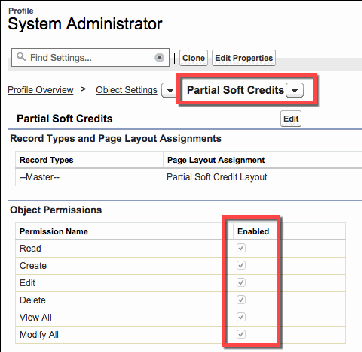
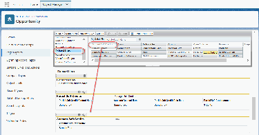
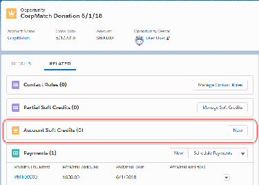

Configure Automated and Manual Soft Credits
Find out more about configuring automated and manual soft credits.
About Soft Credits
Soft credits represent recognition credit for donations. For example, when a company matches an
employee's gift, the employee gets a soft credit for the matching gift.
Add Opportunity Contact Roles
Nonprofit Success Pack comes with many Opportunity Contact Roles. Create additional Opportunity
Contact Roles to meet your organization's need.
Enable Soft Credit Fields
Assign Read and Edit permissions for following fields to your System Administrator and other relevant
profiles and permission sets.
Enable Manage Soft Credits Button
The Manage Soft Credits button allows users to create and edit full or partial soft credits on
Opportunities.
Enable Automated Household Member Soft Credits
NPSP provides a unique type of soft credit for Households—the Household Member soft credit. With
Household Member soft credits, everyone in the Household receives a soft credit for a donation made
by anyone else in the Household.
Enable Contact Role for Organizational Opportunities
For Organizational gifts, you may wish to assign a soft credit to someone who helped you win the gift,
for example, a board member. NPSP can automatically credit the Contact named in the Primary
Contact field on an Organizational Opportunity.
Enable Relationship and Affiliation Soft Credits
NPSP can automatically create soft credits based on Relationship and Affiliation records.
Enable Partial Soft Credits
Make sure the Partial Soft Credit object is accessible to all profiles that also have access to
Opportunities.
Enable Account Soft Credits
Before you can use Account Soft Credits, you need to give users access to the Account Soft Credit
object and fields, and add the Account Soft Credit related list to your page layout. You can also
optionally add more Account Soft Credit roles.
Additional Soft Credits Configuration
These NPSP features use soft credits and may require configuration before use in your org.
About Soft Credits
Soft credits represent recognition credit for donations. For example, when a company matches an
employee's gift, the employee gets a soft credit for the matching gift.
Learn more in Soft Credits Overview.
90

NPSP creates soft credits automatically in a variety of scenarios. Read Automated Soft Credits for more
information. You can also manually Create Account Soft Credits.
FFeeaattuurree RReelleeaassee IInnffoorrmmaattiioonn
This feature was released in NPSP version 3.63 (2/3/2016).
Add Opportunity Contact Roles
Nonprofit Success Pack comes with many Opportunity Contact Roles. Create additional Opportunity
Contact Roles to meet your organization's need.
Nonprofit Success Pack comes with these Opportunity Contact Roles out of the box.
•
Donor
•
Household Member
•
Soft Credit
•
Matched Donor
•
Honoree
•
Notification Recipient
•
Grant Manager
•
Decision Maker
•
Influencer
•
Solicitor
•
Workplace Giving
•
Other
Make sure these roles are present in your org. Create additional roles to meet your organization's needs.
11.. From Setup, enter Contact Roles in the Quick Find box, then select Contact Roles on
Opportunities.
22.. Click New to add Opportunity Contract Roles.
33.. Click Save to finish.
Enable Soft Credit Fields
Assign Read and Edit permissions for following fields to your System Administrator and other relevant
profiles and permission sets.
AAssssiiggnn FFiieelldd--LLeevveell SSeeccuurriittyy
Contact fields:
•
First Soft Credit Amount
•
First Soft Credit Date
•
Largest Soft Credit Amount
91

•
Largest Soft Credit Date
•
Last Soft Credit Amount
•
Last Soft Credit Date
•
Number of Soft Credits
•
Number of Soft Credits Last N Days
•
Number of Soft Credits Last Year
•
Number of Soft Credits This Year
•
Number of Soft Credits Two Years Ago
Relationship fields:
•
Related Opportunity Contact Role
Affiliation fields:
•
Related Opportunity Contact Role
For more information on setting field-level security, see Verify Access for a Particular Field.
.
AAdddd FFiieellddss ttoo PPaaggee LLaayyoouuttss
Add the fields listed above to these page layouts:
•
Add Contact fields to the Contact Layout.
•
Add Relationship fields to the Relationship Layout.
•
Add Affiliation fields to the Affiliation Layout.
For more information on adding fields to page layouts, read Customize Page Layouts with the Enhanced
Page Layout Editor.
Enable Manage Soft Credits Button
The Manage Soft Credits button allows users to create and edit full or partial soft credits on
Opportunities.
AAssssiiggnn PPeerrmmiissssiioonnss ffoorr tthhee MMaannaaggee SSoofftt CCrreeddiittss BBuuttttoonn
To allow users (including admins) to manage soft credits, grant these permissions for the Partial Soft
Credit object and fields:
•
Create and Delete access on the Partial Soft Credit object
•
Read and Edit access on the Amount, Contact Role Id, and Role Name fields
•
Read access on the Contact Name field
92

AAssssiiggnn MMaannaaggee SSoofftt CCrreeddiittss VViissuuaallffoorrccee PPaaggee
11.. From Setup, go to Profiles.
22.. Select the profile you wish to edit.
33.. Click Visualforce Page Access.
44.. Click Edit.
55.. Find and select PSC_ManageSoftCredits in Available Visualforce Pages.
66.. Click Add.
77.. Click Save.
AAdddd MMaannaaggee SSoofftt CCrreeddiittss BBuuttttoonn ttoo OOppppoorrttuunniittyy PPaaggee LLaayyoouutt
11.. From Object Manager, find and select Opportunity.
22.. Click Page Layouts.
33.. Select Donation Layout.
44.. In the palette, click Buttons.
55.. Click and drag Manage Soft Credits to Custom Buttons in the page layout details section.
66.. Click Save.
AAdddd MMaannaaggee SSoofftt CCrreeddiittss BBuuttttoonn ttoo PPaarrttiiaall SSoofftt CCrreeddiittss RReellaatteedd LLiisstt
11.. From Object Manager, find and select Opportunity.
22.. Click Page Layouts.
33.. Select Donation Layout.
44.. In the palette, click Related Lists.
55.. Using the wrench icon, edit the related list properties for Partial Soft Credits.
66.. Click the plus-sign to expand the Buttons section.
77.. In Available Button, click Manage Soft Credits.
88.. Click Add.
99.. Click OK.
1100.. Click Save.
Enable Automated Household Member Soft Credits
NPSP provides a unique type of soft credit for Households—the Household Member soft credit. With
Household Member soft credits, everyone in the Household receives a soft credit for a donation made by
anyone else in the Household.
For more information and examples, see Soft Credits Overview.
To enable Automated Household Member soft credits:
11.. Click , then click NPSP Settings.
22.. Click Donations | Contact Roles.
33.. Click Edit.
44.. If it is not already selected, select Household Contact Roles On.
93

55.. In the Household Member Contact Role field, select the Contact Role you want to use for automatic
soft crediting. We recommend selecting the default, Household Member.
66.. (Optional) In the Household OCR Excluded Record Types picklist, select any Record Types you want
to exclude from automatic Household soft crediting. For example, you might use a different Record
Type for children so that you can exclude children from automatic soft crediting whenever a parent
makes a donation.
Note When you exclude a record type from automatic Household soft crediting, Salesforce still
creates a Household Member Opportunity Contact Role for the Contact, but does not roll up the
donation Amount to the Contact's record.
77.. Click Save.
Enable Contact Role for Organizational Opportunities
For Organizational gifts, you may wish to assign a soft credit to someone who helped you win the gift, for
example, a board member. NPSP can automatically credit the Contact named in the Primary Contact
field on an Organizational Opportunity.
To use this automated soft credit :
11.. Click the NPSP Settings tab. If you don't see the tab, find it in the App Launcher ( ).
22.. Click Donations | Contact Roles , and then click Edit.
33.. In the Contact Role for Organizational Opps field, select the Contact Role to automatically assign the
Contact listed in the Primary Contact field on an Organizational Opportunity.
44.. Click Save.
Enable Relationship and Affiliation Soft Credits
NPSP can automatically create soft credits based on Relationship and Affiliation records.
For more information, see Automated Soft Credits.
CCrreeaattee PPiicckklliisstt VVaalluueess
The Related Opportunity Contact Role field on Relationships and Affiliations has these default values:
•
Soft Credit
•
Solicitor
•
Tribute
Create these values if they aren't already there, and add additional ones if needed.
11.. From Setup, click the Object Manager tab.
22.. In the list of objects, click Relationship.
94

33.. Click Fields & Relationships.
44.. Click Related Opportunity Contact Role.
55.. Click New in the Values section to add picklist values.
66.. Click Save.
Repeat these instructions for the Affiliation object.
CCrreeaattee OOppppoorrttuunniittyy CCoonnttaacctt RRoolleess ffoorr RReellaattiioonnsshhiipp aanndd AAffiffilliiaattiioonn SSoofftt
CCrreeddiittss
It's important that the picklist values in Related Opportunity Contact Role on Relationships and
Affiliations match the available Opportunity Contact Roles.
11.. From Setup, enter Contact Roles in the Quick Find box, then click Contact Roles on Opportunities.
22.. Click New in the Opportunity Contact Role Picklist Values section and add any missing Contact roles.
33.. Click Save.
Enable Partial Soft Credits
Make sure the Partial Soft Credit object is accessible to all profiles that also have access to Opportunities.
Profiles should be granted the same access to the Partial Soft Credit object as they are granted for
Opportunities. For example, this is the System Administrator profile:
95

Enable Account Soft Credits
Before you can use Account Soft Credits, you need to give users access to the Account Soft Credit object
and fields, and add the Account Soft Credit related list to your page layout. You can also optionally add
more Account Soft Credit roles.
Note To get the most value out of Account Soft Credits, you'll want to enable Customizable Rollups
so you can roll up the soft credit values to the Account records. At this time, you can't roll up
Account soft credits to legacy NPSP rollups or User Defined Rollups.
Account Soft Credits are available as of NPSP version 3.137 (August 2018). If you need help figuring out
which version of NPSP you're using, check out Which Version of NPSP Am I Using?.
GGiivvee UUsseerrss AAcccceessss ttoo tthhee AAccccoouunntt SSoofftt CCrreeddiitt OObbjjeecctt aanndd FFiieellddss
11.. Click , then click Setup.
22.. In Setup, enter Profiles in the Quick Find box, then click Profiles.
33.. Edit the profiles of all users who will work with Account soft credits.
96

44.. Click Object Settings, then click Account Soft Credits.
55.. Click Edit and set the object permissions to Read, Create, Edit, and Delete.
66.. In the Field Permissions section, select Read Access and Edit Access for each field.
77.. Click Save.
AAdddd tthhee AAccccoouunntt SSoofftt CCrreeddiitt RReellaatteedd LLiisstt ttoo PPaaggee LLaayyoouuttss
If you started using NPSP from a trial at version 3.137 or later, you can skip this section.
We recommend adding the Account Soft Credit related list to your Opportunity page layouts and the
Organization Account page layout.
11.. Click , then click Setup.
22.. Click the Object Manager tab.
33.. In the list of objects, click Opportunity.
44.. Click Page Layouts.
55.. Click the name of the page layout you want to edit.
66.. In the list on the left of the palette, click Related Lists.
77.. Find the Account Soft Credits related list and drag it to where you want it on the page.
88.. Click Save.
Now, if you go to an Opportunity record, you'll see the Account Soft Credits related list.
97

Repeat these steps for your other Opportunity page layouts and the Organization Account page layout.
AAdddd MMoorree AAccccoouunntt SSoofftt CCrreeddiitt RRoolleess
By default, Account soft credits have three default roles: Donation Source, Influencer, and Match. You
may need to set up additional roles based on your org and business processes. You create new roles by
editing the Role picklist values on the Account Soft Credit object.
11.. Click , then click Setup.
22.. Click the Object Manager tab.
33.. In the list of items, click Account Soft Credit.
44.. Click Fields & Relationships.
55.. In the list of fields, click Role. Then scroll down to the Values related list.
66.. Click New and enter new Role values. Each value should be on its own line.
98

77.. Click Save.
Now you can use these Roles in your Customizable Rollups for Account soft credits. When creating a
Customizable Rollup for Account soft credits, be sure to create a filter group with a filter rule that
includes these values.
Additional Soft Credits Configuration
These NPSP features use soft credits and may require configuration before use in your org.
For detailed information, refer to these resources:
•
Configure Matching Gifts
•
Configure Tribute Gifts
•
Configure Soft Credit and Matching Gift Rollup Settings
