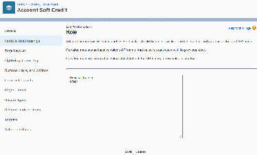
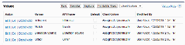
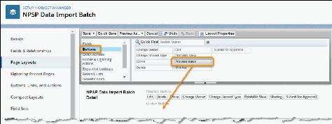
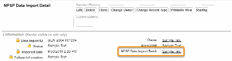
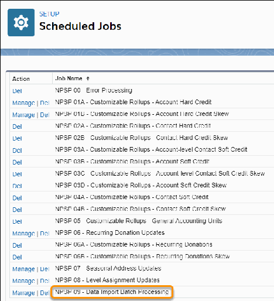

Configure Batch Data Import
Find out more about configuring batch data import.
About Batch Data Import
The NPSP Data Import tool allows you to import your data and translate it into Salesforce objects. The
99

NPSP Batch Data Import feature is an advanced import feature that allows you to import data in
batches. You can have different groups of data import records that you want to process differently,
using their own set of unique configuration options.
Set Permissions For Data Import Objects and Pages
There are two Data Import objects and one Data Import page to set security for: the NPSP Data
Import Batch and NPSP Data Import objects, and the BDI_BatchOverride Visualforce page. Enable the
NPSP Data Import Batches object and field for any profiles that need to create batches.
Edit Page Layouts
Follow these steps to edit page layouts.
Set Button Overrides
On the NPSP Data Import Batch object, set the Clone, Edit, and New buttons to point to the
BDI_BatchOverride page.
Verify Scheduled Jobs
Follow these steps to verify scheduled jobs.
About Batch Data Import
The NPSP Data Import tool allows you to import your data and translate it into Salesforce objects. The
NPSP Batch Data Import feature is an advanced import feature that allows you to import data in batches.
You can have different groups of data import records that you want to process differently, using their own
set of unique configuration options.
If you set up and activated a batch number format, all Opportunities and Payments associated with this
batch will include the batch number in the Batch Number field. Learn more in Configure Batch Numbers
for Donations.
NPSP Batch Data Import uses the following objects:
•
NPSP Data Import Batch (custom object): Holds information about a batch of records to be imported.
•
NPSP Data Import (custom object): Object that records are first imported into. Holds denormalized
data records that can then be imported into the Nonprofit Success Pack.
FFeeaattuurree RReelleeaassee IInnffoorrmmaattiioonn
This feature was released in NPSP version 3.108 (9/14/2017).
Set Permissions For Data Import Objects and Pages
There are two Data Import objects and one Data Import page to set security for: the NPSP Data Import
Batch and NPSP Data Import objects, and the BDI_BatchOverride Visualforce page. Enable the NPSP
Data Import Batches object and field for any profiles that need to create batches.
11.. Click , then click Setup.
22.. From Setup, enter Profiles in the Quick Find box, then select Profiles.
100

33.. Click the name of the Profile you want to set field-level Security for. (For example, click System
Administrator. Do not click the Edit button to the left of the profile name.)
44.. For the NPSP Data Import object:
aa.. In the Tab Settings section, set the NPSP Data Imports tab to Default On.
bb.. In the Object Permissions section, select Read, Create, Edit, and Delete. This gives all users with
this profile full access to use NPSP Data Import. Depending on the profile, you may want to grant
different access.
cc.. In the Field Level Security section, select the Edit Access and Read Access checkboxes for all fields.
55.. For the NPSP Data Import Batch object:
aa.. In the Custom Tab Settings section, set the NPSP Data Import Batch tab setting to Default On to
include it in the list of tabs, or Default Off to make it accessible in App Launcher.
bb.. In the Object Permissions section, select Read, Create, Edit, and Delete. This gives all users with
this profile full access to use Batch Data Import. Depending on the profile, you may want to grant
different access.
cc.. In the Field Level Security section, click View next to NPSP Data Import Batch and select Read
Access and Edit Access for all fields.
dd.. Click Back to Profile.
66.. If you have non-System Admin users who import data, ensure that they have access to the
BDI_BatchOverride Visualforce page.
aa.. In the Enabled Visualforce Pages related list, click Edit.
bb.. Add BDI_BatchOverride to the Enabled Visualforce Pages list.
cc.. Click Save.
Alternatively, you could grant Visualforce page access to multiple profiles at a time. Simply search for and
select Visualforce Pages in Setup, then click Security next to the page name.
Edit Page Layouts
Follow these steps to edit page layouts.
11.. From Setup, click the Object Manager tab.
22.. In the list of objects, click NPSP Data Import Batch.
33.. Click Page Layouts.
44.. Click NPSP Data Import Batch Layout.
55.. Drag all available fields onto the layout.
66.. In the palette, click Buttons.
77.. Drag the Process Batch button to the Custom Buttons section on the layout.
101

88.. Click Save.
Now, edit the NPSP Data Import page layout to include the NPSP Data Import Batch field.
11.. Click the Object Manager tab.
22.. In the list of objects, click NPSP Data Import.
33.. Click Page Layouts.
44.. Click NPSP Data Import Layout.
55.. Drag the NPSP Data Import Batch field onto the page layout.
66.. Click Save.
For more information on adding fields and buttons to page layouts, see Configure Page Layouts.
Set Button Overrides
On the NPSP Data Import Batch object, set the Clone, Edit, and New buttons to point to the
BDI_BatchOverride page.
11.. From Setup, click the Object Manager tab.
22.. In the list of objects, click NPSP Data Import Batch.
33.. Click Buttons, Links, and Actions.
44.. In the Clone row, click , then click Edit.
55.. Choose BDI_BatchOverride Visualforce page.
66.. Click Save.
102

77.. Repeat this process for the Edit and New buttons.
Verify Scheduled Jobs
Follow these steps to verify scheduled jobs.
11.. From Setup, enter Scheduled Jobs in the Quick Find box, then click Scheduled Jobs.
22.. Verify that you see NPSP 09 - Data Import Batch Processing in the list of Scheduled Jobs.
33.. If you don't see the scheduled job, check NPSP Settings.
44.. Click the NPSP Settings tab. If you don't see the tab, find it in the App Launcher ( ).
103

55.. Click Bulk Data Processes | Batch Process Settings (doing this recreates all the default jobs), and
make sure Don't Auto Schedule Default NPSP Jobs is not selected.
For more information on Scheduled Jobs, see Edit or Reschedule NPSP Scheduled Jobs.
Configure Batch Numbers for Donations
For audit purposes, use auto-generated batch numbers to track Opportunity and Payment records
created in batches.
NPSP allows you to set up a custom batch number format and automatically attach the Batch Number
to:
•
Payments, upon creation or when marked as Paid.
•
Opportunities, upon creation.
When a batch number format is active, NPSP adds Batch Numbers to donations associated with NPSP
Data Import Batch records. These auto-generated numbers show up on:
•
Donations created or updated as part of a batch in Gift Entry.
•
Donations tied to an NPSP Data Import Batch and imported using NPSP Data Importer.
Grant Batch Number Permissions
Give users access to the Batch Number feature by adding these permissions to profiles or permission
sets.
Add Batch Number to Page Layouts and List Views
When active, the batch number you configured appears in the Batch Number field on Opportunities
and Payments. Add the field to your page layouts.
Create a Batch Number Format
Create a format for your batch numbering that works best for your org.
Grant Batch Number Permissions
Give users access to the Batch Number feature by adding these permissions to profiles or permission
sets.
To add the permissions through profiles:
11.. Click , then click Setup.
22.. Enter Profiles in the Quick Find box, then click Profiles.
33.. Click the name of the Profile you want to add the permissions to.
44.. In the Enabled Apex Class Access section, click Edit.
55.. Add npsp.BDI_BatchNumberSettingsController to the Enabled Apex Classes list.
104

66.. Save your changes.
77.. In the Field-Level Security section, click View next to Opportunity.
88.. Click Edit, and select Read Access for the Batch Number field.
99.. Save your changes.
1100.. Click Back to Profile.
1111.. In the Field-Level Security section, click View next to Payment.
1122.. Click Edit, and select Read Access for the Batch Number field.
1133.. Save your changes.
1144.. Repeat these steps for all profiles that should have access to the Batch Number fields on
Opportunities and Payments.
Add Batch Number to Page Layouts and List Views
When active, the batch number you configured appears in the Batch Number field on Opportunities and
Payments. Add the field to your page layouts.
11.. Click , then click Setup.
22.. Click the Object Manager tab, then click NPSP Data Import Batch, Opportunity, or Payment.
33.. Click the name of the page layout you want to update.
44.. Drag and drop Batch Number onto the layout.
55.. Click Save.
66.. Repeat these steps for all NPSP Data Import Batch, Opportunity, and Payment page layouts where you
want to see the Batch Number field.
77.. You may also want to add Batch Number to the Batches list views in Gift Entry. Learn more in
Customize Columns on Batches & Templates.
Create a Batch Number Format
Create a format for your batch numbering that works best for your org.
Configure a batch number format in NPSP Settings.
11.. Click the NPSP Settings tab. If you don't see the tab, find it in the App Launcher ( ).
22.. Go to System Tools | Advanced Mapping for Data Import & Gift Entry | Batch Number Settings.
105

33.. Enter a Display Format. Your format can be up to 30 characters, including the optional prefix. It must
be unique and include the number of digits. Here are a few examples:
••
A sequence formatted as {0} with a starting number of 9 displays as 9, 10, 11, etc.
••
A sequence formatted as {00000} with a starting number of 9 displays as 00009, 00010, 00011, etc.
••
A sequence formatted as ABC-{0000} with a starting number of 9 displays as ABC-0009, ABC-0010,
ABC-0011, etc.
44.. Set a Starting Number. If left blank, the number will start at 1.
55.. Enter a Description, if desired.
66.. Click Save or Save & Activate.
If you didn't activate the batch number when you saved it, click next to the format in the Batch
Number Formats table, then click Activate. You can have one active batch number format at a time.
