Configure Customizable Rollups
Configure NPSP versions older than 3.155 for customizable rollups.
Note Watch the Nonprofit Salesforce How-To Series video: Configure Customizable Rollups
About Customizable Rollups
The NPSP Customizable Rollups feature lets you create highly customized rollups that roll up either
data from Opportunities, Payments, or Soft Credits (including Partial Soft Credits). You can create
custom donation rollup fields on Accounts, Contacts, General Allocation Units, or Recurring Donations
and you can also edit the definition of legacy out-of-box rollups.
Grant Access to npsp.CRLP_RollupUI_SVC Apex Class
To ensure that you can access and configure Customizable Rollups, verify that your profile has access
to the Apex Class CRLP_RollupUI_SVC.
About Customizable Rollups
The NPSP Customizable Rollups feature lets you create highly customized rollups that roll up either data
from Opportunities, Payments, or Soft Credits (including Partial Soft Credits). You can create custom
donation rollup fields on Accounts, Contacts, General Allocation Units, or Recurring Donations and you
can also edit the definition of legacy out-of-box rollups.
FFeeaattuurree RReelleeaassee IInnffoorrmmaattiioonn
This feature was released in NPSP version 3.155 (5/15/2019). If you started using NPSP before this date
109

or this feature isn't configured in your Salesforce org. If you started using NPSP before this date, or this
feature isn't configured in your org, complete these steps. (To find your NPSP installation date, see Find
Your Installation Date).
Grant Access to npsp.CRLP_RollupUI_SVC Apex Class
To ensure that you can access and configure Customizable Rollups, verify that your profile has access to
the Apex Class CRLP_RollupUI_SVC.
If you don't have access to this Apex class, you'll see an error when you click the Configure Customizable
Rollups button in NPSP Settings.
Important You must use the Enhanced Profile User Interface in order to access all available Apex
classes.
11.. Click , then click Setup.
22.. In the Quick Find box, enter Profiles, then click Profiles.
33.. Click the name of the profile you want to edit.
44.. Click Apex Class Access.
55.. Click Edit.
66.. Add CRLP_RollupUI_SVC to the Enabled Apex Class list.
77.. Click Save.
Customizable Rollups Overview
Rolling up donor data is an essential part of fundraising with the Nonprofit Success Pack. And, since
every nonprofit is unique, it is especially important that you're able to roll up exactly the data you need,
and to the right records.
Note Watch the Nonprofit Salesforce How-To Series video: Customizable Rollups Overview.
Imagine that you have a call with a major donor, and you want to go into it armed with the knowledge of
their lifetime giving to your organization. Without the right rollups, this would be a tedious, manual
process that could take a tremendous amount of time. Additionally, you might have incorrect
information.
So, what if we told you that you could roll up Payments along with Opportunity data? And what if we told
you that you could create your own custom rollups, where you define the field to roll up to and the filters
to use?
110

With Customizable Rollups, this is all possible. Customizable Rollups are available as part of NPSP with
the Household Account Model. They are enabled by default in new NPSP Trials starting with version
3.155 (May 2019); all other orgs just need to turn the feature on. And when you do, it will convert all of
your existing User Defined Rollups (and the 87 out-of-box NPSP rollups) into Customizable Rollups. You'll
be able to edit the converted rollups or create brand new ones.
And as an added bonus, we support Advanced Currency Management with Dated Exchange Rates for
organizations with Customizable Rollups enabled. Please note that there are a few limitations if using
ACM with NPSP. Read the International Nonprofits FAQ for full details.
A note about types of rollups...
When it comes down to how rollups work, there are really two types of rollups. It's important to
understand what these two types are and how they work.
•
Aggregate Rollups: Summarize data from multiple records and roll it up to a target field. Aggregate
Rollups are used for summing, averaging, or counting. For example, NPSP comes with aggregate
rollups for Total Gifts (summing), Average Gift Amount (averaging), and Total Number of Gifts
(counting).
•
Single Result Operation Rollups: Copy data from a field on a single record to the target field. These
rollups are used for searching through a group of records to find the first or last date, or finding the
smallest or largest number (currency, number, etc) and copying data from that record. Out-of-box in
NPSP, you get single result operations such as Largest Gift Amount, First Gift Date, and Last Gift Date.
But, with Customizable Rollups, you can select any field from the single Opportunity (or Payment)
result and copy it to the target object. A great example that wasn't possible before is that you can
configure a rollup to automatically copy the record ID of that found single record, and add it to a
custom lookup field on the target object (for example, a Contact or Account record). That way you can
easily click through to see the record itself (and find any information you need)! With that lookup, you
can also create cross-object formula fields to pull any data you need from that Opportunity or
Payment to the Contact or Account.
See Also
Customizable Rollups and Soft Credits
Hard Credit vs. Soft Credit Customizable Rollups
Enable Customizable Rollups
Create Customizable Rollups
Customizable Rollups Recipes
Customizable Rollups and Soft Credits
Soft credits are used when a Contact or Account influenced the donation, but isn't responsible for the
payment. Hard credits, on the other hand, are used when a Contact or Account directly makes a
111

donation and is responsible for the payment.
Hard Credit vs. Soft Credit Customizable Rollups
Understanding how NPSP determines what data rolls up to a hard credit or soft credit Customizable
Rollup can be confusing.
Things to Know Before Enabling Customizable Rollups
If you're starting from an NPSP Trial in version 3.155 (May 2019), Customizable Rollups are enabled by
default. All other orgs will need to enable Customizable Rollups.
Test Customizable Rollups in your Sandbox
Before enabling Customizable Rollups in your Production org, we highly recommend testing and
validating the results in a Full or Partial Sandbox. The best way to validate rollup values after enabling
Customizable Rollups is to use field history tracking.
Enable Customizable Rollups
Turn on functionality to define which fields to roll up and the filters to use. If Customizable Rollups
aren't necessary for your organization, disable or reset them.
Create Customizable Rollups
Find out more about customizable rollups.
Create Filter Groups
Find out more about creating filter groups.
Configure Soft Credit Rollups
Find out more about configuring soft credit rollups.
Convert Opportunity Rollups into Payment Rollups
You can easily convert Opportunity rollups into Payment rollups just by changing a few fields.
Batch Job Modes for Customizable Rollups
Cusomizable Rollups are calculated by a series of batch jobs. These batch jobs run in one of three
modes: Non-Skew Mode, Skew Mode, or Incremental Mode.
Customizable Rollups Recipes
Welcome to the Customizable Rollups Recipes cookbook!
Set Fiscal Year Rollups
NPSP supports rollups and reports based on your organization's fiscal year, as long as you configure
your fiscal year according to the instructions below.
Customizable Rollups and Soft Credits
Soft credits are used when a Contact or Account influenced the donation, but isn't responsible for the
payment. Hard credits, on the other hand, are used when a Contact or Account directly makes a
donation and is responsible for the payment.
Soft Credits on Contact
Note With Customizable Rollups, if an Opportunity has duplicate soft credits, only one of those soft
credits is included in rollups. For example, if an Opportunity includes two Partial Soft Credits for Sue
112

Jones, only one of the soft credits is included in the soft credit rollups on Sue's Contact record.
Soft Credits on Contacts
In NPSP, soft credits (including any partial soft credits) and soft credit rollups are tracked on Contacts.
With Customizable Rollups, all of the Contact Soft Credit Rollup fields still exist, but the rollups that
populate them are now defined in Customizable Rollups. Users can edit the existing ones or create new
ones.
If you want to learn more about the differences between soft credit and hard credit Customizable
Rollups and how they work, see Hard Credit vs. Soft Credit Customizable Rollups.
Important Hard credit rollups work differently when you enable Customizable Rollups.
Customizable Rollups created using a Contact (Hard Credit) rollup type are based on the person
listed in the Primary Contact field on an Opportunity (the Contact who actually paid for the
donation). This is different from how hard credit rollups worked before Customizable Rollups came
along. Previously, hard credit rollups were based on the Contact with the Opportunity Contact Role
marked as Primary. For more information, see "How Hard Credit and Soft Credit Customizable
Rollups Work" in Hard Credit vs. Soft Credit Customizable Rollups.
Soft Credits on Accounts
With Customizable Rollups, we also offer the ability to roll up Account soft credits. An Account soft credit
is a credit for a donation that the Account didn't actually make, but may have somehow influenced. For
example, a Donor Advised Fund uses a bank to manage their money. When a donation comes from the
Donor Advised Fund, the check is actually generated by the bank, so the bank gets the hard credit for the
donation. Using Account soft credits, you can ensure that the Donor Advised Fund gets a soft credit for
their donation, and you can roll up those soft credits to the Account.
For information on using Account soft credits, see Enable Account Soft Credits and Create Account Soft
Credits.
Additionally, you can create Customizable Rollups that roll up all Contact level soft credits to the
Household Account. These soft credits are valuable if you want to be able to see the total giving for an
entire Household.
For example, you may have major donors that give on an annual basis, but the money is coming from a
donor advised fund or family foundation (not their personal checkbook) managed by a financial
institution. Thus, all donations come directly from that financial institution. This results in hard credits
and the majority of the rollups pointing to the financial institution (for accounting reasons), which makes
it hard to fully realize the amount of money the Contact or Household has given when you view their
records in NPSP. Thanks to Customizable Rollups custom soft credit rollups, it's easy for organizations to
get a complete picture of major donor giving while still following accounting best practices.
For more information on soft credits, see Soft Credits Overview.
113

Hard Credit vs. Soft Credit Customizable Rollups
Understanding how NPSP determines what data rolls up to a hard credit or soft credit Customizable
Rollup can be confusing.
What makes a Customizable Rollup either a hard credit or soft credit rollup? And how do individual
donations (from Contacts) or organization donations (from Organization Accounts) play into all of this?
We're going to help you figure it all out!
First, let's define what we mean when we say hard credit and soft credit. A hard credit is a credit for a
donation that a Contact or Account made. In other words, the donor “signed the check.” A soft credit is a
credit for a donation that a Contact or Account did not make themselves, but may have somehow
influenced. For example, a Contact's employer sent in a matching gift, or the Contact is a member of the
family that made the donation.
When creating Customizable Rollups, you decide whether the rollup is for soft credits or hard credits
using the Rollup Type field.
Note If you need a refresher on what rollups are, head on over to the Rollups Overview to learn
more.
Here are the Rollup Types for Contact rollups:
Here are the Rollup Types for Account rollups:
114

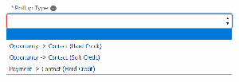

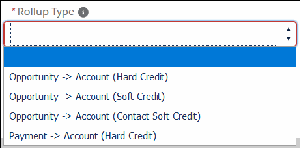

How Hard Credit and Soft Credit Customizable Rollups Work
How hard credit and soft credit rollups work depends on whether the donation came from a Contact, a
Household Account, or an Organization Account.
Contact and Household Account Donations (Opportunities)
Customizable Rollups created using a Contact (Hard Credit) rollup type are based on the person listed in
the Primary Contact field on an Opportunity (the Contact who actually paid for the donation).
Customizable Rollups created using a Contact (Soft Credit) rollup type are based on the soft credit
Contact Role(s) on an Opportunity.
For Household giving, the Primary Contact field on an Opportunity is especially important. When you
create an Opportunity where the Opportunity's Primary Contact is automatically populated, such as from
an Action on the Contact, that person is listed as the Primary Contact on the Opportunity (in the Primary
Contact field) and gets a hard credit. The other Household members get soft credits and are assigned an
Opportunity Contact Role (OCR) that is defined as indicating soft credit status (such as Household
Member, Soft Credit, Influencer, etc). These roles are created and defined automatically when you
started using the NPSP Trial, and were configured in NPSP Settings before Customizable Rollups was
released. You now define which OCRs you want a rollup to consider using filter rules (within a filter
group) that are applied to the rollup itself. For more information on filter rules and filter groups, see
Create Filter Groups.
Important It's important to note that this is different from how hard credit rollups worked before
Customizable Rollups came along. Previously, hard credit rollups were based on the Contact with
the Opportunity Contact Role marked as Primary. In theory, the Contact with the OCR marked as
Primary and the Primary Contact on an Opportunity should be the same, but this isn't always the
case, so it's important to note this distinction.
Important The concept of Primary Contact can be confusing because there is a Primary Contact on
the Account and a Primary Contact on the Opportunity. These are two different fields that affect
how hard credits are assigned. If an admin created an Opportunity (donation) from a Household
record, the Primary Contact on the Account would automatically be assigned as the Primary Contact
on the Opportunity after the record is saved. But, if any of the other Household members make a
donation and the Opportunity is created from their own Contact record, that Contact is assigned as
the Primary Contact on the Opportunity (we'll show this in the example below). And as we
mentioned before, the Primary Contact field on an Opportunity is used for hard credit rollups on
Household giving, so it's important to understand how this field gets populated!
Organization Account Donations (Opportunities)
On an Organization Account Opportunity, the Primary Contact isn't required. If there is a Primary Contact
listed, an Opportunity Contact Role called “Soft Credit” is automatically created for that Contact. That
OCR is also marked Primary. Even though it's marked Primary, since this is an Organization Account
donation, the value of the donation is only reflected in the Contact's soft credit totals. So, by default, for
Organization Account Opportunities, the Account gets the hard credit and the person listed as the
115

Primary Contact gets a soft credit.
For donations that an Account didn't directly make, but may have influenced, you can assign the Account
a soft credit with a specific role. Customizable Rollups created using an Opportunity > Account (Account
Soft Credit) rollup type are based on the Account Soft Credit role(s) assigned on the Opportunity. When
setting up an Account Soft Credit Customizable Rollup, you determine the roles to include within a filter
rule (in a filter group), and then assign that filter group to your rollup.
Example—Household Member Donation
Let's look at an example that illustrates how a donation from a Contact within a Household works with
Customizable Rollups.
The Williams family has three members: Terrance, Josephine, and Dante. Terrance Williams is the Primary
Contact on the Williams Household Account. Josephine makes a donation to a local food pantry in the
amount of $500, and writes the check from her personal bank account. The food pantry receives the
check and pulls up Josephine's Contact record in NPSP. They create the Opportunity in the amount of
$500.
You'll notice on the Opportunity record that Josephine Williams is listed as the Primary Contact (1),
which means that she will get hard credit for this donation. That hard credit will be reflected in hard
credits rollups to the Williams Household Account and in hard credit rollups on Josephine's Contact
record. You'll also notice that three Contact Roles (2) were created on this Opportunity. Josephine gets
the Donor OCR (with the Primary Checkbox checked), and Terrance and Dante are assigned the
Household Members OCR. Terrance and Dante each received soft credit for this donation because they
are part of the Williams Household and the Household Member role is designated as a soft credit role.
So, now let's look at the Contact records and Account record to see how this all rolls up. First, we'll look at
Josephine's Contact record. You see that the Total Gifts field (which is populated by a hard credit rollup)
shows the $500 donation.
116

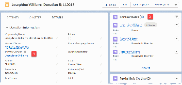

Now, if you look at Terrance or Dante's record, you'll see the $500 donation listed in the Soft Credit Totals
section, because Terrance received a $500 soft credit for Josephine's donation.
And lastly, if you look at the Williams Account record, you'll see (1) the hard credit reflected in the Total
Gifts field (which is populated by a hard credit rollup) and (2) the soft credit reflected in the Total
Household Member Soft Credits field (which is populated by a rollup created using the Account (Contact
Soft Credit) rollup type).
Note The Total Household Member Soft Credit field shows data for a Customizable Rollup we
created using the Account (Contact Soft Credit) rollup type. This rollup type doesn't double count
soft credits, so if Dante and Terrance each received a $500 soft credit, the field will only show $500.
If they each received a partial soft credit for $250, this field will only show $250.
117

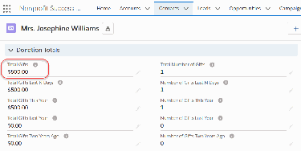

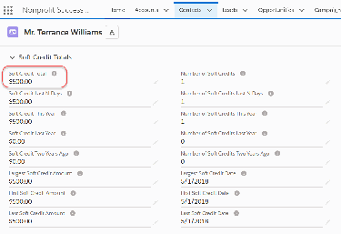

Example—Organization Account Donation
Now, let's look at an example that illustrates how a donation from an Organization Account works with
Customizable Rollups.
Josephine Williams is an employee at ABC Corp., a company that regularly donates to local nonprofits.
Because Josephine is so passionate about the food pantry, she recommends to her employer's
Foundation group that they make a donation. ABC Corp. agrees to make a $5000 donation and sends a
check to the food pantry. The food pantry receives the check and creates an account for ABC Corp. They
then create an opportunity for $5000, and since Josephine influenced the donation, list her as the
Primary Contact on the Opportunity.
Since this is an Organization Account donation, ABC Corp. will get hard credit for the donation. The
$5000 will be reflected in hard credit rollups to the Account. You'll notice on the Opportunity record that
Josephine Williams is listed as the Primary Contact (1). You'll also notice that there is a Contact Role (2)
for Josephine on this Opportunity. Since Josephine is listed as the Primary Contact on the Opportunity,
she was automatically assigned a Contact Role, which means that she will get soft credit. You'll see the
$5000 soft credit reflected in soft credit rollups on Josephine's Contact record.
118

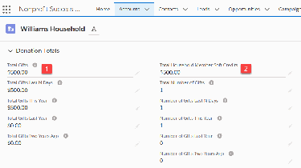

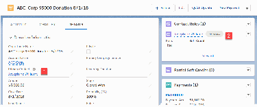

Now, let's look at the Account and Contact records to see how this all rolls up. First, we'll look at ABC
Corp.'s Account record. You'll see the $5000 hard credit in the Total Gifts field (which is populated by a
hard credit rollup).
Note The Contact Role that is automatically assigned to Josephine is determined by the value in the
Contact Role for Organizational Opps field in NPSP Settings under Donations | Contact Roles.
Keep in mind that the Contact Role assigned to Josephine must be included in a filter group applied
to soft credit Customizable Rollups. Otherwise, the donation won't roll up.
Now, if we look at Josephine's Contact record, we see the $5000 in the Soft Credit Total field (which is
populated by a soft credit rollup), because Josephine received a soft credit for the Organization Account
donation.
119

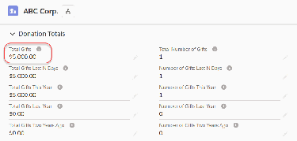

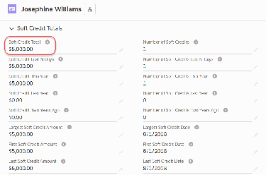

Things to Know Before Enabling Customizable Rollups
If you're starting from an NPSP Trial in version 3.155 (May 2019), Customizable Rollups are enabled by
default. All other orgs will need to enable Customizable Rollups.
Important Customizable Rollups are only available in orgs using NPSP and the Household Account
Model.
If you don't know which version of NPSP you're using, check out Which Version of NPSP Am I Using? to
find out.
Enabling Customizable Rollups automatically makes the following changes in your org:
•
Convert existing NPSP Donor Statistics settings into Customizable Rollups settings
•
Convert existing out-of-box and User Defined Rollups to Customizable Rollups
Note If you have User Defined Rollups for the Household object in your organization, and you
enable Customizable Rollups, those Household User Defined Rollups won't be be converted,
because the Household object is deprecated in the Household Account Model.
•
Remove NPSP Settings page for User Defined Rollups
•
Remove NPSP Settings page for Donor Statistics
•
Remove and modify existing NPSP Settings options for rollups, as follows:
NPSP Setting Location Action Notes
Enable Soft Credits NPSP Settings | Removed Defined in
Donations | Contact Customizable Rollups
Roles
Soft Credit Roles NPSP Settings | Removed Defined in a filter group
Donations | Contact in Customizable
Roles Rollups
Rollup N Day Value NPSP Settings | Removed Defined in
Donations | Donor Customizable Rollups
Statistics
Use Fiscal Year for NPSP Settings | Removed Defined in
Rollups Donations | Donor Customizable Rollups
Statistics
Rollup Batch Size NPSP Settings | Moved NPSP Settings | Bulk
Donations | Donor Data Processes | Batch
Statistics Process Settings
Opp Rec Types NPSP Settings | Removed Defined in a filter group
Excluded for Account Donations | Donor in Customizable
Rollup, Opp Types Statistics Rollups
120

NPSP Setting Location Action Notes
Excluded for Account
Rollup, Opp Rec Types
Excluded for Contact
Rollup, Opp Types
Excluded for Contact
Rollup
Rollup N Day Value NPSP Settings | Removed Defined in
Donations | GAU Customizable Rollups
Allocations
Use Fiscal Year for NPSP Settings | Removed Defined in
Rollups Donations | GAU Customizable Rollups
Allocations
Membership Record NPSP Settings | Removed Defined in a filter group
Type Names Donations | in Customizable
Memberships Rollups
Enabling Customizable Rollups also creates batch jobs that run nightly to calculate rollups. These batch
jobs replace the old rollups batch jobs and are named as follows:
•
NPSP 01A - Customizable Rollups - Account Hard Credit
•
NPSP 01B - Customizable Rollups - Account Hard Credit Skew
•
NPSP 02A - Customizable Rollups - Contact Hard Credit
•
NPSP 02B - Customizable Rollups - Contact Hard Credit Skew
•
NPSP 03A - Customizable Rollups - Account-level Contact Soft Credit
•
NPSP 03B - Customizable Rollups - Account Soft Credit
•
NPSP 03C - Customizable Rollups - Account-level Contact Soft Credit Skew
•
NPSP 03D - Customizable Rollups - Account Soft Credit Skew
•
NPSP 04A - Customizable Rollups - Contact Soft Credit
•
NPSP 04B - Customizable Rollups - Contact Soft Credit Skew
•
NPSP 05 - Customizable Rollups - General Accounting Units
•
NPSP 06A - Customizable Rollups - Recurring Donations
•
NPSP 06B - Customizable Rollups - Recurring Donations Skew
The new jobs are scheduled to start at 11 p.m., by default, and run at staggered times. If you want the
jobs to run at a different time, you'll need to manually reschedule them. For more information, see Edit
or Reschedule NPSP Scheduled Jobs. You can also change the batch size for each job. Go to NPSP
Settings | Batch Process Settings and update the appropriate Batch Job Size fields.
We recommend that you enable and try out Customizable Rollups in a Sandbox org before turning it on
in your Production org. That will allow you to test it out and confirm that you're seeing expected results.
Keep in mind that you can also easily move any new rollups and filter groups you create in your Sandbox
org to your Production org by deploying the Custom Metadata Types that define them. Note that you
121

can't use change sets to deploy NPSP out-of-box rollups into Production.
Test Customizable Rollups in your Sandbox
Before enabling Customizable Rollups in your Production org, we highly recommend testing and
validating the results in a Full or Partial Sandbox. The best way to validate rollup values after enabling
Customizable Rollups is to use field history tracking.
Important Make sure that Customizable Rollups is NOT enabled in your org when you start this
process.
Track Field History
By enabling field history on the rollup target fields on Accounts, Contacts, and General Accounting
Units (GAU), you can easily identify changes to rollup field values after switching to Customizable
Rollups.
Expected Differences
The first time Customizable Rollups jobs are run, there may be changes to a few of the rollup fields.
Track Field History
By enabling field history on the rollup target fields on Accounts, Contacts, and General Accounting Units
(GAU), you can easily identify changes to rollup field values after switching to Customizable Rollups.
11.. Click the NPSP Settings tab. If you don't see the tab, find it in the App Launcher ( ).
22.. Click Bulk Data Processes. Run the Rollup Donations Batch and Rollup Allocations Batch jobs.
33.. After those jobs have successfully completed, enable field history on the rollup target fields on the
Account, Contact, and GAU objects.
44.. Add the Field History related lists (Account History, Contact History and General Accounting Unit
History) to the appropriate page layouts.
55.. In NPSP Settings, go to Donations | Customizable Rollups and enable Customizable Rollups.
66.. In NPSP Settings, go to Bulk Data Processes and run the Rollup Donations Batch and Rollup
Allocations Batch jobs.
77.. Spot check (or use a report) to look at changes to the rollup fields that you enabled field history on.
Expected Differences
The first time Customizable Rollups jobs are run, there may be changes to a few of the rollup fields.
Here are some reasons why the data may be different:
122

•
Average Gift: There may be a rounding difference in how Customizable Rollups calculates and stores
the Average Gift amount on the Contact and Account record. In the image above, the amounts appear
to be the same but behind the scenes there is a difference in the decimal places, causing Salesforce to
think the field values are different.
•
Last and First Gift Amount: With legacy rollups, there isn't consistent logic for determining the very
first or very last gift when there was more than one gift on the same date. When Customizable Rollups
is enabled, the First and Last Gift Amounts are explicitly determined by looking at the CreatedDate
timestamp on the Opportunity record. This ensures that the First Gift Amount is actually from the very
first Opportunity created on the earliest date and the Last Gift Amount is the from the very last
Opportunity created on the latest date.
•
N Day Rollups: If Customizable Rollups jobs are run the day after legacy rollups were run, you may see
a change to Gifts in the Last N Days (since the rollup jobs were run on different days). This is
completely normal. To avoid N Day differences when comparing Legacy Rollup results to Customizable
Rollup results, be sure to run the legacy rollup job before the Customizable Rollups jobs on the same
day.
•
Multicurrency: Legacy rollups convert everything into the corporate currency and then back into the
Contact or Account's currency. This causes some inaccuracies in conversion. Customizable Rollups
calculations for multicurrency are more accurate, and they support Advanced Multicurrency (with
Dated Exchange Rates).
•
Contact Roles: There may be some discrepancies in hard credit rollup calculations for Household gifts,
if the Primary Contact on the Opportunity is different than the Primary Opportunity Contact Role. That
is because Customizable Rollups look at the Primary Contact on the Opportunity, while legacy rollups
look at the Opportunity Contact Role marked as Primary.
Enable Customizable Rollups
Turn on functionality to define which fields to roll up and the filters to use. If Customizable Rollups aren't
necessary for your organization, disable or reset them.
If you're starting from an NPSP Trial in version 3.155 (May 2019) or later, Customizable Rollups are
enabled by default. All other orgs will need to enable Customizable Rollups. If you don't know which
version of NPSP you're using, check out Which Version of NPSP Am I Using? to find out.
Note Customizable Rollups are only available in orgs using NPSP and the Household Account
Model.
Before enabling Customizable Rollups, be sure to review Things to Know Before Enabling Customizable
Rollups. Also, remember that enabling Customizable Rollups disables User Defined Rollup creation in
your org. The User Defined Rollup node will disappear from NPSP Settings, but all UDRs previously
created in your org will be preserved and converted to Customizable Rollups.
Note We recommend that you enable and try out Customizable Rollups in your Sandbox org before
turning it on in your Production org. That will allow you to test it out and confirm that you're seeing
expected results. Keep in mind that you can also easily move any new rollups you create in your
Sandbox org to your Production org using a Change Set. For more information, see Test
123

Customizable Rollups in your Sandbox.
To enable Customizable Rollups:
11.. Click the NPSP Settings tab. If you don't see the tab, find it in the App Launcher ( ).
22.. Click Donations | Customizable Rollups.
33.. Click the button to switch to Enabled.
It may take a few moments for NPSP to convert all of your existing rollups. You can safely leave the page.
When the deployment is finished, you'll see a Configure Customizable Rollups button that you can use to
view the list of Customizable Rollups. Keep in mind that this list will already be populated with all of the
NPSP out-of-box rollups and any User Defined Rollups that already existed in your org. You're now ready
to edit them or create new ones!
Note If you see an error when you click the Configure Customizable Rollups button, your profile may
not have access to the CRLP_RollupUI_SVC Apex class. For more information, see Grant Access to
npsp.CRLP_RollupUI_SVC Apex Class.
Note When you enable Customizable Rollups, new batch jobs are scheduled to run that night. If you
want the new Customizable Rollups to be calculated immediately, you'll need to manually run the
batch job. To do so, go to NPSP Settings | Bulk Data Processes | Rollup Donations Batch and click
Run Batch.
124

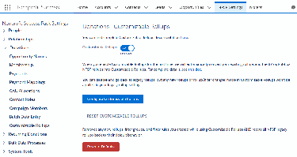

Disable Customizable Rollups
If you decide that Customizable Rollups aren't for you, you can go back to the original rollups
functionality. When you disable, rollups go back to the way they worked before you enabled
Customizable Rollups. Keep in mind that any changes made while Customizable Rollups was enabled will
be retained and visible if Customizable Rollups is enabled again. While the configuration data will
continue to exist, it will have no effect on your org.
11.. In NPSP Settings, go to Donations | Customizable Rollups.
Note If you don't see the NPSP Settings tab in your org, you can find it in the App Launcher.
22.. Click the button to switch to Disabled.
33.. Click Save.
After you disable Customizable Rollups, the old Rollup batch jobs are re-scheduled for that night. If you
want to see the rollups recalculated right away, you'll have to manually run the jobs. To do so, go to NPSP
Settings | Bulk Data Processes | Rollup Donations Batch and click Run Batch.
Reset Customizable Rollups
If needed, you can reset Customizable Rollups back to its original defaults. We recommend you use this
feature with caution and only if you want to completely wipe out any changes you made while using
Customizable Rollups.
Resetting Customizable Rollups makes the following changes:
•
Removes any new rollups, filter groups, and filter rules you created while using Customizable Rollups.
•
Resets all NPSP legacy rollups (including any User Defined Rollups) back to their default behavior. This
means that the legacy NPSP rollups and User Defined Rollups will be reset to how they were
configured when you first enabled Customizable Rollups. You'll lose any customizations you made to
them since then.
If you want to turn off Customizable Rollups, but preserve changes you made while using the feature, we
recommend disabling the feature instead.
To reset Customizable Rollups:
11.. Go to the NPSP Settings tab.
Note If you don't see the NPSP Settings tab in your org, you can find it in the App Launcher.
22.. Click Donations | Customizable Rollups.
33.. Click Reset to Defaults.
44.. Click OK to confirm that you want to wipe out any changes you've made and reset Customizable
Rollups.
125

Create Customizable Rollups
Find out more about customizable rollups.
Note Watch the Nonprofit Salesforce How-To Series video about Customizable Rollups
Configuration.
Create a Customizable Rollup
You can create as many Customizable Rollups as you need. Keep in mind that you can also edit the
out-of-box NPSP rollups and any other User Defined Rollups previously created in your org.
Clone a Customizable Rollup
To quickly create a new rollup that's similar to one that already exists, simply clone it.
Deactivate or Delete a Customizabel Rollup
You can delete or deactivate rollups as needed.
Create a Customizable Rollup
You can create as many Customizable Rollups as you need. Keep in mind that you can also edit the out-
of-box NPSP rollups and any other User Defined Rollups previously created in your org.
For example, say you want to know the total amount of in-kind gifts that a Contact has donated. With
Customizable Rollups, you can easily find that information and put it in a custom field called Total In
Kind Gifts. We illustrate how to create this sample aggregate rollup in the instructions below.
Important Customizable Rollups roll up data to a custom field (that you choose during the creation
process). But that field must exist, so be sure to create the custom field before creating a new rollup!
We recommend that you make these custom fields read only for all users (including Sys Admins).
This example we walk through in the steps below assumes that you have an existing custom field on
Contacts called “Total In Kind Gifts.” If you want to follow along, you'll need to create that custom
field first.
11.. Go to the NPSP Settings tab. If you don't see the tab in your org, you can find it from the App
Launcher.
22.. Click Donations | Customizable Rollups.
33.. Click Configure Customizable Rollups.
Important If you see an error when you click the Configure Customizable Rollups button, your
profile may not have access to the CRLP_RollupUI_SVC Apex class. For more information, see
Grant Access to npsp.CRLP_RollupUI_SVC Apex Class.
Note If you need to go back to a previous screen while using Customizable Rollups, use the
breadcrumbs at the top of the page. The back button will not work; it will always take you back to
the NPSP Settings page.
126

44.. On the Customizable Rollups page, click New Rollup. To edit an existing rollup, in the appropriate row,
click the drop-down arrow and then click Edit.
55.. Choose the Target Object and Field that the data should roll up to. The Target Object can be Account,
Contact, General Allocation Unit, or Recurring Donation. The Target Field is limited to custom,
writeable fields on the Target Object that aren't currently used by another rollup.
Note Be careful if your Target Field can only accept certain values, for example, if the target field
has validation rules or is a restricted picklist. If your source value is not accepted in the Target
object, you will get an error when the nightly batch job runs.
Important When creating a Recurring Donation rollup, ONLY use your own custom fields as the
Target field. Selecting an NPSP field as the Target field will break your Recurring Donations.
To create our example rollup, choose Contact as the Target Object and Total In Kind Gifts as
the Target Field.
Note Remember, this is just an example and it assumes that this custom field already exists. If
you want to follow along, you'll need to create the Total In Kind Gifts field.
66.. Enter a detailed description of this rollup. This is very important because the description is what you
(and others) will use to distinguish this rollup from all of your other rollups. For the example, enter
"Sums up a Contact's total In Kind Gifts from the Opportunity Fair Market Value
field."
77.. Enter the Operation. Your choices are limited based on the Type of the Target field you selected. For
the example, choose Sum.
The type of Operation you choose determines whether your rollup will be an aggregate rollup or a
single result operation rollup. If you want to create an aggregate rollup, you'd choose Sum, Average, or
Count. If you want to create a single result operation rollup, you'd choose First, Last, Largest,
Smallest, Best Year, Best Year Total, Years Donated or Donor Streak.
aa.. Smallest: Selects the minimum value stored in Field to Roll Up across all of the records that meet
the time frame and filter group criteria. Specify the same field in both the Field to Roll Up and
Amount Field settings.
bb.. Largest: Selects the maximum value stored in Field to Roll Up across all of the records that meet the
time frame and filter group criteria. Specify the same field in both the Field to Roll Up and Amount
Field settings.
cc.. First: Selects the value stored in Field to Roll Up from the first record that meets the time frame and
127

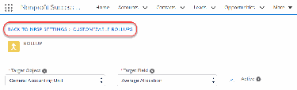

filter group criteria when those records are sorted by Date Field in ascending order.
dd.. Last: Selects the value stored in Field to Roll Up from the last record that meets the time frame and
filter group criteria when those records are sorted by Date Field in ascending order.
ee.. Count: The number of records that meet the time frame and filter group criteria.
ff.. Sum: The total of the values in Amount Field when added together across all records that meet the
time frame and filter group criteria.
gg.. Average: The mean of the values in Amount Field across all records that meet the time frame and
filter group criteria.
hh.. Best Year: Selects the four-digit calendar year (or fiscal year if Use Fiscal Year is enabled) from the
value in Date Field that corresponds to the time frame with the largest sum of amounts in Amount
Field across all records that meet the filter group criteria.
ii.. Best Year Total: Selects the largest sum of amounts from Amount Field after grouping records by
the four-digit calendar year (or fiscal year if Use Fiscal Year is enabled) based on the value in Date
Field across all records that meet the filter group criteria.
jj.. Years Donated: Concatenates a unique set of four digit calendar years (or fiscal years if Use Fiscal
Year is enabled) separated by semi-colons (;) from the values in Date Field across all records that
meet the filter group criteria.
kk.. Donor Streak: The current number of consecutive calendar years (or fiscal years if Use Fiscal Year is
enabled) that records meeting the filter group criteria exist. Current is as-of this year if there's a
record in the current year. Otherwise this is calculated as-of last year.
Note When you choose First or Last as the Operation, the First or Last record is determined
based on the Date Field in the Advanced Customizations section. You can choose any of the
available Date Fields listed in the drop-down. If there is more than one record that matches the
criteria based on the selected Date Field, we use the Created Date as a tie-breaker to determine
which record to use.
88.. Choose the Timeframe for this rollup. For the example, choose All Time.
aa.. To roll up data for all time, choose All Time.
bb.. To roll up data for a certain number of days back, choose Days Back. You will then see a Days Back
field where you can enter the number of days back (from today) that you want to roll up data for. It's
important to note that entering a value of 0 will roll up data for today, while entering a value of 1 will
roll up data for today and yesterday. The maximum number of days back you can enter is 10000.
cc.. To roll up data for a specific year, choose Years Ago. You will then see a Years Ago field where you
can choose the number of years ago that you want to roll up data for. Keep in mind that only the
data for that calendar (or fiscal) year will roll up. So, if the current year is 2018 and you choose 2
years ago, the roll up will include data for 2016. Select the Fiscal Year checkbox to calculate rollups
based on fiscal year settings (instead of calendar year). 20 is the maximum amount of years ago you
can select.
128

99.. Choose the Rollup Type. The Rollup Type is a combination of the object to roll up along with whether it
will be a soft credit or hard credit rollup. For the example, choose Opportunity > Contact (Hard
Credit).
1100.. Choose the filter group to apply to this rollup. The filter group is a collection of filter rules that
determine what records get rolled up. If you want to include all records, use the default No Filter
Group (Include All Records). For the example, choose Opp: Won (HC).
Note You'll see all available filter groups that exist in your org, but be sure to select one that uses
the same object that you selected in the Rollup Type field.
1111.. In the Advanced Customizations section, enter the required information. The fields that appear are
determined by the Operation you selected.
aa.. Field to Roll Up: Choose the field from the result of the rollup operation that you want to copy to
the Target Field. This field is available if the Rollup Type is a single result operation (First, Last,
Largest, or Smallest). Additionally, only fields with field types that are compatible with the selected
Target field appear in the list.
bb.. Date Field: Choose the date field to use when calculating the rollup. The Timeframe depends on
this field.
cc.. Amount Field: Choose the amount field to use when calculating the rollup. For the example,
choose Opportunity: Fair Market Value.
1122.. Click Save. Your rollup will look something like this:
Note If you get a timeout error when trying to save your rollup, you may need to refresh the page.
See Save Timeout Error Customizable Rollups for more information.
Since we already showed you an aggregate rollup above, it's only fair that we also show you how to
create a single result operation rollup. And this one is particularly cool because it provides a lookup to
129

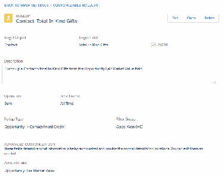

another record. Cue the fireworks! Let's say you want to find the largest gift that a Contact donated and
link to the Campaign that brought in the donation (from the Contact's record). Here's how you do it:
11.. Create a custom field on the Contact object that is related to the Campaign object. Name it Largest
Gift Campaign.
22.. Create a new rollup with the following values:
aa.. Target Object = Contact
bb.. Target Field = Largest Gift Campaign
cc.. Description = A lookup on the Contact record to Campaign associated with their
largest donation, as determined by the Opportunity Amount field.
dd.. Operation = Largest
ee.. Time Frame = All Time
ff.. Rollup Type = Opportunity > Contact (Hard Credit)
gg.. Filter Group = Opportunities: Won (HC)
hh.. Field to Roll Up: Opportunity: Campaign ID
ii.. Amount Field: Opportunity Amount
33.. Click Save.
To see the updated field on the record right away, you'll need to manually recalculate rollups. Here's
how it should look:
130

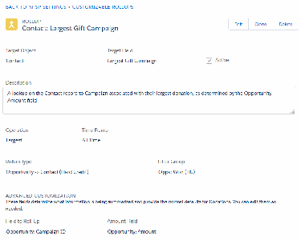

AA nnoottee aabboouutt ccrreeaattiinngg ccuussttoomm fifieellddss ffoorr uussee iinn CCuussttoommiizzaabbllee RRoolllluuppss .. .. ..
As we mentioned in the steps for creating a Customizable Rollup, the field you select as the Target Field
must be a unique, writeable, custom field. And the field must exist before you create the Customizable
Rollup.
It's also important to note that you should limit all users' access to the fields you're using as Target Fields
in your rollups. We recommend that you make these custom fields read only for all users (including Sys
Admins). Rollups will function properly even if the user creating the rollup or viewing the record with the
rollup Target Field doesn't have Edit or View access to the field.
Clone a Customizable Rollup
To quickly create a new rollup that's similar to one that already exists, simply clone it.
Keep in mind that you'll need to choose a unique Target Field for your new rollup before you save it. Use
an existing field, or create a custom field to use as the Target Field. For more information on creating
custom fields, see Create Custom Fields.
11.. Click the NPSP Settings tab. If you don't see the tab, find it in the App Launcher ( ).
22.. Click Donations | Customizable Rollups.
33.. Click Configure Customizable Rollups.
Note If you need to go back to a previous screen while using Customizable Rollups, use the
breadcrumbs at the top of the page. The back button will not work; it will always take you back to
the NPSP Settings page.
44.. On the Customizable Rollups page, click the name of the rollup you want to clone.
55.. Click Clone. NPSP clones the entire rollup, with the exception of the Target Field.
66.. Select the Target Field, and optionally make any other changes.
77.. Save your work.
131

Deactivate or Delete a Customizabel Rollup
You can delete or deactivate rollups as needed.
Deactivating a rollup simply prevents NPSP from calculating the rollup moving forward, but you will still
see it in the list of Customizable Rollups and could activate it again if needed. Deleting a rollup removes
it from the list. Since NPSP no longer calculates deleted or deactivated rollups, you will see stale data in
any deleted or deactivated rollups' Target fields. For any rollup you deactviate or delete, we recommend
that you either clear the value out of the Target field or reuse the Target field in a new rollup.
Important You should never modify, deactivate, or delete the key fields (or the rollups that include
them) used by the Customizable Rollups jobs. Modifying these fields can cause issues in your org,
such as hitting limits because too many records are being processed in a non-skew mode or rollups
not updating.
To deactivate a rollup:
11.. In the list of Customizable Rollups, click the Name of the rollup you want to deactivate.
22.. Unselect the Active checkbox.
33.. Click Save.
To delete a rollup:
11.. In the list of Customizable Rollups, click the Name of the rollup you want to delete.
22.. Click Delete.
33.. Click Delete again to confirm that you want to delete.
Note Special thanks to Evan Ponter for his contributions to this article.
Create Filter Groups
Find out more about creating filter groups.
Create a Filter Group
Customizable Rollups come with a set of default filter groups. These filter groups work like reports. You
132

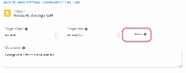

set up criteria (filter rules) within the filter group that determines what data to include in your rollup.
Filter groups make sure you only roll up the data you really need!
Delete a Filter Rule or Filter Group
You can delete a filter rule even if it's used in a filter group with an associated rollup. But, keep in mind
that deleting that filter rule will affect that rollup's calculations.
Clone a Filter Group
To quickly create a new filter group that is similar to one that already exists, simply clone it. The filter
group and all of its filter rules are copied to a new filter group. The new filter group will have the same
name as the original, but the word (Clone) is appended to the end.
Create a Filter Group
Customizable Rollups come with a set of default filter groups. These filter groups work like reports. You
set up criteria (filter rules) within the filter group that determines what data to include in your rollup.
Filter groups make sure you only roll up the data you really need!
You can create new filter groups or modify the defaults if you need to. You can also delete unused filter
groups, but keep in mind that you won't be able to delete any filter group that has been applied to a
rollup. You can see which rollups are using a filter group by visiting the filter group detail page.
A note about filter rules . . .
The filter rules set the criteria that determines what data to include, so that you only get the data you
need. You can include as many as you want, but keep in mind that filter rules use AND criteria only (there
is no OR). So, if there is more than one filter rule within a filter group, data will only be included if it
matches criteria for all of the rules.
However, filter rules only apply if the object used in the filter rule is the same as the object in the rollup's
Rollup Type field. If the filter rule is for an object not listed for a particular rollup type, that rule simply
won't apply, but the rest of the rules in the group will. This lets you use a filter group with a soft credit
filter on a hard credit rollup, and that soft credit rule doesn't apply but the rest do.
133

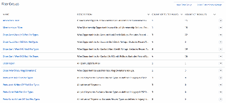

If the Rollup Type is... Filter rules using these objects will apply
Opportunity
Opportunity > Account (Hard Credit)
Opportunity > Contact (Hard Credit)
Opportunity, Contact Soft Credit
Opportunity > Contact (Soft Credit)
Opportunity > Account (Contact Soft Credit)
Opportunity > Account (Account Soft Credit) Opportunity, Account Soft Credit
Payment, Opportunity
Payment > Account (Hard Credit)
Payment > Contact (Hard Credit)
Opportunity > Recurring Donations Opportunity
GAU Allocation > General Accounting Unit Opportunity, GAU Allocation
11.. Click the NPSP Settings tab. If you don't see the tab, find it in the App Launcher ( ).
22.. Click Donations | Customizable Rollups.
33.. Click Configure Customizable Rollups.
Important If you see an error when you click the Configure Customizable Rollups button, your
profile may not have access to the CRLP_RollupUI_SVC Apex class. For more information, see
Grant Access to npsp.CRLP_RollupUI_SVC Apex Class.
Note If you need to go back to a previous screen while using Customizable Rollups, use the
breadcrumbs at the top of the page. The back button will not work; it will always take you back to
the NPSP Settings page.
44.. Click View Filter Groups.
55.. Click New Filter Group. If you want to edit an existing filter group, click the filter group name, then
click Edit.
66.. Enter a name for the filter group.
77.. Enter a detailed description of this filter group. We recommend that you write out exactly how the
filter rules within this filter group work. That way, it will be easy for others in your org to understand if
this filter group is right for their rollup.
88.. Create the filter rules for this group. For each rule:
aa.. Select the Object. The available values are Account Soft Credit, Contact Soft Credit, GAU Allocation,
Opportunity, and Payment.
bb.. Select the specific Field on that object.
cc.. Select the Operator. The available options are determined by the type of the selected Field. You'll
only see operators that are valid for the field type.
Note The In List or Not in List operators can be used for fields other than picklists—even for
134

text fields! If the Operator is In List or Not in List and you don't see a picklist, enter values
separated by semi-colons.
dd.. Enter the value. What you can enter in this field is determined by the Operator you choose.
99.. Click Add to add another filter rule.
1100.. Click Save.
You can now select your filter group when creating or editing a Customizable Rollup.
Delete a Filter Rule or Filter Group
You can delete a filter rule even if it's used in a filter group with an associated rollup. But, keep in mind
that deleting that filter rule will affect that rollup's calculations.
You can delete a filter group only if it's not used by any active or inactive rollups. If the filter group has
associated rollups, they will be listed on the filter group detail page. Before you can delete, you'll need to
remove the filter group from the rollups.
11.. Go to the NPSP Settings tab. If you don't see the tab in your org, you can find it from the App
135

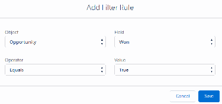

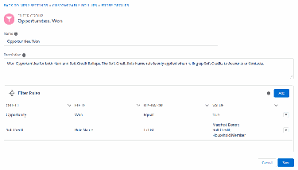

Launcher.
22.. Click Donations | Customizable Rollups .
33.. Click Configure Customizable Rollups .
44.. Click View Filter Groups.
55.. Click the name of the filter group.
66.. To delete a filter rule:
aa.. Click Edit.
bb.. In the row for the rule, click the down arrow, then click Delete.
cc.. Click Delete again to confirm the deletion.
77.. To delete a filter group, click Delete, then click Delete again to confirm.
Clone a Filter Group
To quickly create a new filter group that is similar to one that already exists, simply clone it. The filter
group and all of its filter rules are copied to a new filter group. The new filter group will have the same
name as the original, but the word (Clone) is appended to the end.
11.. Click the NPSP Settings tab. If you don't see the tab, find it in the App Launcher ( ).
22.. Click Donations | Customizable Rollups.
33.. Click Configure Customizable Rollups.
44.. Click View Filter Groups.
55.. Click the name of the filter group you want to clone.
66.. Click Clone.
77.. Edit the filter group name and any other details as needed, then click Save.
Configure Soft Credit Rollups
Find out more about configuring soft credit rollups.
136

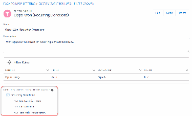

About Soft Credit Rollups
The Soft Credit rollup fields on Contact records roll up as the result of data from these sources.
Configure Contact Roles Settings
Which Opportunity Contact Roles count as soft credits depends on if you're using Customizable
Rollups or legacy out-of-box rollups.
About the Always Roll Up to Primary Contact Role Checkbox
The Always Roll Up to Primary Contact Role checkbox ONLY applies to gifts (Opportunities) from an
Organization Account. When checked, if the Opportunity Account is an Organization Account and the
Primary Contact field is populated, both the Account and the Primary Contact on the Opportunity
receive hard credit.
About Soft Credit Rollups
The Soft Credit rollup fields on Contact records roll up as the result of data from these sources.
•
Opportunity Contact Roles (OCRs) you've assigned to Contacts on Opportunity records
•
Partial Soft Credits
•
Contact Role Configuration
Any Opportunity Contact Role is eligible for soft credit rollups if that value is specified in NPSP Settings.
Note Before you configure soft credit rollups, make sure you have configured soft credits in your org.
Configure Contact Roles Settings
Which Opportunity Contact Roles count as soft credits depends on if you're using Customizable Rollups
or legacy out-of-box rollups.
If you're using Customizable Rollups, Contact Roles are set in filter groups and then applied to the rollups
themselves:
11.. Click the NPSP Settings tab. If you don't see the tab, find it in the App Launcher ( ).
22.. Click Donations | Customizable Rollups.
33.. Click Configure Customizable Rollups.
44.. Click View Filter Groups.
55.. Either click New to create a new filter group with Contact Roles or click Edit to modify an existing filter
group.
66.. Add a filter rule with these values:
aa.. Object = Soft Credit
bb.. Field = Soft Credit: Role Name
cc.. Operator = In List
dd.. Value = Select the Contact Roles you want to include when calculating rollups and move them to
the Selected Value list.
137

77.. Click Save.
88.. Be sure to apply this filter group to the rollup(s) you want to calculate soft credits based on the
Contact Roles you selected.
If you're using out-of-box legacy NPSP rollups or User Defined Rollups:
11.. In NPSP Settings, click Donations | Contact Roles.
22.. Click Edit.
33.. In the Soft Credit Roles field, make sure you've specified all Contact Roles you want treated as soft
credits.
44.. Click Save.
138

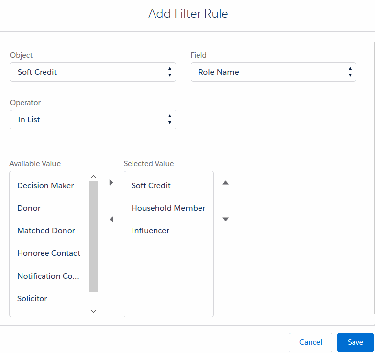

You also need to specify which Contact Role you want NPSP to apply to matched donors. This role
should be one of the roles you selected for the Soft Credit Roles. To set this value:
11.. In NPSP Settings, click Donations | Contact Roles.
22.. Click Edit.
33.. In the Matched Donor Role field, select a value. We recommend using Matched Donor.
44.. Click Save.
For Organizational gifts, you may wish to assign a soft credit to someone who helped you win the gift, for
example, a board member. NPSP can automatically credit the Contact named in the Primary Contact
field on an Organizational Opportunity.
To use this automated soft credit, you’ll need to set the Contact Role for Organizational Opps in NPSP
Settings.
Note Make sure that the value you select for Contact Role for Organizational Opps is also included
in the Soft Credit Roles setting on the same page, otherwise the Contact Role for Organizational
Opps will not trigger soft credit rollups. Alternatively, set the roles in a Filter Group if you're using
Customizable Rollups. Learn more in Create a Filter Group and Customizable Rollups Overview.
139

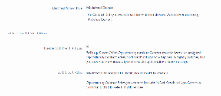

About the Always Roll Up to Primary Contact Role Checkbox
The Always Roll Up to Primary Contact Role checkbox ONLY applies to gifts (Opportunities) from an
Organization Account. When checked, if the Opportunity Account is an Organization Account and the
Primary Contact field is populated, both the Account and the Primary Contact on the Opportunity
receive hard credit.
Therefore, the gift is double counted by rollups. It's important to note that Organizational gift hard
credits to the Contact ARE NOT reflected on their Household Account. Additionally, the Contact doesn't
receive a soft credit.
While some orgs may choose to use this setting because they want to see the hard credit reflected in
Contact rollups, this is not the generally accepted best practice. We recommend that you follow best
practice and not use this checkbox.
The Always Roll Up to Primary Contact Role checkbox is located in NPSP Settings. You can find it under
Donations | Contact Roles.
Convert Opportunity Rollups into Payment Rollups
You can easily convert Opportunity rollups into Payment rollups just by changing a few fields.
Keep in mind that you will need to do this process for each rollup you want to convert to a Payment
rollup.
11.. Go to the NPSP Settings tab. If you don't see the tab in your org, you can find it from the App
Launcher.
22.. Click Donations | Customizable Rollups.
33.. Click Configure Customizable Rollups.
44.. In the row for the Opportunity rollup you want to convert into a Payment rollup, click the down arrow
, then click Edit.
55.. In the Rollup Type field, select Payment > Account (Hard Credit).
66.. In the Filter Group field, select the appropriate Payments filter group.
77.. Click Save.
88.. Repeat these steps for each rollup you want to update.
99.. If you want to see the updated rollup calculations immediately, you can manually recalculate them.
Otherwise, the values will update when the batch runs overnight.
Batch Job Modes for Customizable Rollups
Cusomizable Rollups are calculated by a series of batch jobs. These batch jobs run in one of three
modes: Non-Skew Mode, Skew Mode, or Incremental Mode.
The default is Non-Skew Mode, which is the most efficient mode for orgs without large data volumes or
uneven data distribution (also called data skew). Learn more about data skew on the Salesforce
Developers' Blog.
140

For orgs with data skew, NPSP automatically uses Skew Mode which runs skewed records separately so
that rollup jobs can complete successfully.
In orgs with large data volumes, batch jobs may time out or take more than 24 hours to process. If this is
the case, NPSP automatically uses Incremental Mode. Incremental Mode only evaluates Account and
Contact records with Opportunities that were modified within a certain timeframe. It is currently only
available for Contact Hard Credit and Account Hard Credit Non-Skew batch jobs.
Read on to learn more about Skew Mode, Incremental Mode, and how they work with NPSP batch jobs.
Skew Mode
NPSP uses Skew Mode jobs when a single record has many records (more than 250 by default) related
to it.
Incremental Mode
In an effort to mitigate issues in large data volume orgs, we added Incremental Mode. Incremental
processing helps to reduce overall data within the Customizable Rollups batch jobs and also reduce
the occurrence of a long-running batch job.
Customizable Rollups Jobs
This is a complete list of each Customizable Rollup job along with its related Apex Classes, associated
NPSP Settings, and the fields it evaluates during processing. There's also a high level description of
how each job works behind the scenes.
Skew Mode
NPSP uses Skew Mode jobs when a single record has many records (more than 250 by default) related to
it.
You can also select Customizable Rollups: Force Skew Mode on specific Accounts or Contacts with
more than 250 related records to overcome CPU timeouts or heap size limits.
Without Skew jobs, rollup calculations might fail. Customizable Rollups use Skew jobs to process these
skewed records separately so that rollup jobs can complete successfully. Additionally, to keep processing
within Salesforce Governor Limits, Skew Mode jobs use a Skew Mode Dispatcher that breaks the rollups
into smaller groups of records (the default is 300).
SSkkeeww MMooddee SSeettttiinnggss
You can turn on Skew Mode for individual Accounts or Contacts with the Customizable Rollups: Force
Skew Mode field or find the Skew Mode settings in NPSP Settings, under Bulk Data Processes | Batch
Process Settings.
•
Skew Mode Threshold—Skew mode is used when an Account, Contact, GAU, or Recurring Donation
record has this number of related Opportunities.
•
Contact Skew Mode Batch Size—The number of related records, sorted by ContactId, that the batch
job processes at one time.
•
Account Skew Mode Batch Size—The number of related records, sorted by AccountId, that the batch
141

job processes at one time.
•
Skew Mode Dispatcher Size—The number of Accounts, Contacts, or GAUs that the batch job queries
and rolls up data for at one time.
Incremental Mode
In an effort to mitigate issues in large data volume orgs, we added Incremental Mode. Incremental
processing helps to reduce overall data within the Customizable Rollups batch jobs and also reduce the
occurrence of a long-running batch job.
Note Incremental mode is currently only available for Recurring Donation, Contact Hard Credit, and
Account Hard Credit Non-Skew batch jobs. Incremental mode only affects our nightly scheduled
jobs. The Rollup Donations Batch (in NPSP Settings, under Bulk Data Processes) still calculates
rollups for all records. If you use an override (especially one with a low value), we recommend that
you run the Rollup Donations Batch on a periodic and ongoing basis to ensure your data is accurate.
Incremental Mode only evaluates Account and Contact records with Opportunities that were modified
within a certain timeframe. By default, this timeframe is the value of the largest N-Day rollup. NPSP's
largest N-Day rollup by default is 2 years, but you can change it or create your own N-Day rollups.
Let's look at an example of how this works. The Contact Hard Credit job queries for Contacts listed in the
Primary Contact field of an Opportunity that has been modified within the last two years (or whatever
the largest N-Day timeframe is) and then processes all Contact Hard Credit rollups.
Incremental Mode is useful for:
•
Orgs that have not recently imported Opportunities (Last Modified Date is over 2 years ago, by
default).
•
Orgs with smaller N-Day Rollups (N-Day Rollups = rolling totals — i.e. Total Gifts in Last 90 days, etc.).
Enable Incremental Mode
Incremental mode is enabled and ready for use in orgs created from a Trial starting with NPSP version
3.155 (May 2019). If your org existed before this date and you have large data volumes, you can
enable it.
Override the N-Day Value
You can override the default N-Day values if needed.
EEnnaabbllee IInnccrreemmeennttaall MMooddee
Incremental mode is enabled and ready for use in orgs created from a Trial starting with NPSP version
3.155 (May 2019). If your org existed before this date and you have large data volumes, you can enable
it.
11.. Click , then click Setup.
22.. In the Quick Find box, enter Custom Settings, then click Custom Settings.
33.. In the row for Customizable Rollup Settings, click Manage.
142

44.. Click Edit.
55.. Select these settings:
••
Incremental Contact Hard Credit Non-Skew—When checked, the Contact Hard Credit (Non-Skew)
nightly job limits the number of Contacts selected for recalculation by including only records with at
least one recently updated Opportunity.
••
Incremental Account Hard Credit Non-Skew—When checked, the Account Hard Credit (Non-Skew)
nightly job limits the number of Accounts selected for recalculation by including only records with at
least one recently updated Opportunity.
••
Limit Recalculated Recurring Donations—When checked, the Recurring Donation (Non-Skew)
nightly job limits the number of recurring donations that are recalculated by including only records
with at least one recently updated Opportunity.
66.. Save the settings.
OOvveerrrriiddee tthhee NN--DDaayy VVaalluuee
You can override the default N-Day values if needed.
For example, let's say you want to filter on Opportunities with Close Dates in the last 90 days, you would
enter CloseDate in the Incremental: Last N Days Field Override field and 90 in the Incremental: Last N
Days Value Override field. Or if you were migrating Opportunities from a legacy system and wanted to
include the last modified date of Opportunities from a custom field (called
Legacy_System_Modified_Date__c) in the last 180 days, you would enter
Legacy_System_Modified_Date__c in the Incremental: Last N Days Field Override field and 180 in
the Incremental: Last N Days Value Override field.
Be sure to test thoroughly after making changes, as N-Day rollups may be incorrect if these fields aren't
set properly. For example, if you have a rollup for Total Gifts in Last 45 Days, but you override the defaults
to process Accounts/Contacts with Opportunities modified in the last 30 days, the Total Gifts in Last 45
Days rollup could be incorrect since data may have dropped off.
11.. Click , then click Setup.
22.. In the Quick Find box, enter Custom Settings, then click Custom Settings.
33.. In the row for Customizable Rollup Settings, click Manage.
44.. Click Edit.
55.. To limit the Recurring Donation (non-Skew) nightly scheduled job:
aa.. Select Limit Recalculated Recurring Donations.
bb.. In RD Modified in Last Number of Days, enter the number of days after being modified that an
Opportunity should be included in the Recurring Donation Rollup batch job. For example, only
include Opportunities that have been modified within the last 31 days.
66.. To limit all other nightly scheduled jobs, enter values in these fields:
••
Incremental: Last N Days Field Override—Overrides the field used to filter related Opportunities to
determine which Accounts and Contacts are recalculated during a nightly scheduled job. The value
must be a Date field on the Opportunity object.
143

••
Incremental: Last N Days Value Override—Overrides the calculated number of days used to filter
related Opportunities to determine which Accounts and Contacts are recalculated during a nightly
scheduled job. The value must be a number.
Note If both Incremental: Last N Days Field Override and Incremental: Last N Days Value
Override are populated, the field specified in Incremental: Last N Days Field Override is used
to test the value in that field against the numerical range specified by Incremental: Last N Days
Field Override.
77.. Save the settings.
Customizable Rollups Jobs
This is a complete list of each Customizable Rollup job along with its related Apex Classes, associated
NPSP Settings, and the fields it evaluates during processing. There's also a high level description of how
each job works behind the scenes.
This information is intended for use by Developers and Partners.
Scheduled Job: NPSP 01A - Customizable Rollups - Account Hard Credit
Batch Job Class Key Field Related Settings
CRLP_Account_BATCH On Account: Customizable
Account Hard Credit Batch
Rollups: Force Skew Mode
Size
(Account.npsp__Customizabl
eRollups_UseSkewMode__c)
Skew Mode Threshold
How It Works: Query for all Accounts with Opportunities WHERE
npsp__CustomizableRollups_UseSkewMode__c = false. Process Account rollups 200 records at a
time and query for relevant data.
Scheduled Job: NPSP 01B - Customizable Rollups - Account Hard Credit Skew
Batch Job Class Key Field Related Settings
CRLP_AccountSkew_BATCH On Account: Customizable
Account Skew Mode Batch
CRLP_SkewDispatcher_BATCH Rollups: Force Skew Mode
Size
(Account.npsp__Customizabl
eRollups_UseSkewMode__c)
Skew Mode Threshold
Skew Mode Dispatcher Batch
Size
How it Works: In batches of 300, use the Skew Dispatcher to query for Accounts WHERE
npsp__CustomizeRollups_UseSkewMode__c = true. Query for Opportunities related to those
Accounts, 1,000 at a time, and process rollups until all Opportunities are looped through for
144

those Account Batches. Then, query for the next set of Accounts and their Opportunities, and
repeat.
Scheduled Job: NPSP 02A - Customizable Rollups - Contact Hard Credit
Batch Job Class Key Field Related Settings
CRLP_Contact_BATCH On Contact: Customizable
Contact Hard Credit Batch
Rollups: Force Skew Mode
Size
(Contact.npsp__Customizable
Rollups_UseSkewMode__c)
Skew Mode Threshold
How it Works: Query for all Contacts that are in the Primary Contact field
(npsp__Primary_Contact__c) of an Opportunity WHERE
npsp__CustomizableRollups_UseSkewMode__c = false. Process Contact rollups 200 records at a
time and query for relevant data. If Always Roll Up to Primary Contact is unchecked in NPSP
Settings, additionally filter for Opportunity Account's WHERE npe01__SYSTEMIsIndividual__c =
True.
Scheduled Job: NPSP 02B - Customizable Rollups - Contact Hard Credit Skew
Batch Job Class Key Field Related Settings
On Contact: Customizable
CRLP_ContactSkew_BATCH Contact Skew Mode Batch
Rollups: Force Skew Mode
Size
(Contact.npsp__Customizable
CRLP_SkewDispatcher_BATCH
Rollups_UseSkewMode__c)
Skew Mode Threshold
Skew Mode Dispatcher Batch
Size
How it Works: In batches of 300, use the Skew Dispatcher to query for Contacts WHERE
npsp__CustomizableRollups_UseSkewMode__c = true. Query for Opportunities related to those
Contacts (in the Primary Contact field), 1,000 at a time, and process rollups until all
Opportunities are looped through for those Contact batches. Then query for the next set of
Contacts and their Opportunities, and repeat. Note that if Always Roll Up to Primary Contact
Role is unchecked in NPSP Settings, additionally filter on Opportunities WHERE
npe01__SYSTEMIsIndividual__c = TRUE.
145

Scheduled Job: NPSP 03A - Customizable Rollups - Account-level Contact Soft Credit
Batch Job Class Key Field Related Settings
CRLP_Account_SoftCredit_BA On Account: Customizable
Contact Soft Credit to Acct
TCH Rollups: Force Skew Mode
Batch Size
(Account.npsp__Customizabl
eRollups_UseSkewMode__c)
Skew Mode Threshold
How it Works: Query for all Accounts WHERE npsp__CustomizableRollups_UseSkewMode__c =
false. Process Account rollups 200 records at a time by querying for Opportunity Contact Roles
where the Contact's Account ID is in the batch of Account IDs and IsPrimary = false. If Always
Roll Up to Primary Contact Role is unchecked in NPSP Settings, also add an OR filter for the
Opportunity Account's npe01__SYSTEMIsIndividual__c = false. When querying for OCRs, this
job will also query for relevant Partial Soft Credit records.
Scheduled Job: NPSP 03B - Customizable Rollups - Account Soft Credit
Batch Job Class Key Field Related Settings
CRLP_Account_AccSoftCredit On Account: Customizable
Account Soft Credit Batch Size
_BATCH Rollups: Force Skew Mode
(Account.npsp__Customizabl
Skew Mode Threshold
eRollups_UseSkewMode__c)
How it Works: Query for all Accounts WHERE npsp__CustomizableRollups_UseSkewMode__c =
false. Process Account rollups 200 records at a time by querying for/processing Account Soft
Credit records Where the Account ID is in the batch of Account IDs.
Scheduled Job: NPSP 03C - Customizable Rollups - Account-level Contact Soft Credit Skew
Batch Job Class Key Field Related Settings
On Account: Customizable
CRLP_AccountSkew_SoftCredi Account Skew Mode Batch
Rollups: Force Skew Mode
t_BATCH Size
(Account.npsp__Customizabl
eRollups_UseSkewMode__c)
CRLP_SkewDispatcher_BATCH Skew Mode Threshold
Skew Mode Dispatcher Batch
Size
How it Works: In batches of 300, use the Skew Dispatcher to query for Accounts WHERE
npsp__CustomizableRollups_UseSkewMode__c = true. Query for Opportunity Contact Roles
related to those Contacts' Account IDs, 1,000 at a time, and process rollups until all Opportunity
Contact Roles are looped through for those Account batches. Then query for the next set of
146

Accounts and their Opportunity Contact Roles, and repeat. Note that if Always Roll Up to
Primary Contact Role is unchecked in NPSP Settings, additionally filter on Opportunities WHERE
npe01__SYSTEMIsIndividual__c = false OR IsPrimary = false. (Otherwise, we just filter on
IsPrimary = false). When querying for OCRs, this job will also query for relevant Partial Soft Credit
records.
Scheduled Job: NPSP 03D - Customizable Rollups - Account Soft Credit Skew
Batch Job Class Key Field Related Settings
On Account: Customizable
CRLP_AccountSkew_AccSoftC Account Skew Mode Batch
Rollups: Force Skew Mode
redit_BATCH Size
(Account.npsp__Customizabl
eRollups_UseSkewMode__c)
CRLP_SkewDispatcher_BATCH Skew Mode Threshold
Skew Mode Dispatcher Batch
Size
How it Works: In batches of 300, use the Skew Dispatcher to query for Accounts WHERE
npsp__CustomizableRollups_UseSkewMode__c = true. Query for Account Soft Credits related to
those Account IDs, 1,000 at a time, and process rollups until all Account Soft Credits are looped
through for those Account batches. Then query for the next set of Accounts and their Account
Soft Credits, and repeat.
Scheduled Job: NPSP 04A - Customizable Rollups - Contact Soft Credit
Batch Job Class Key Field Related Settings
CRLP_Contact_SoftCredit_BAT On Contact: Customizable
Contact Soft Credit Batch Size
CH Rollups: Force Skew Mode
(Contact.npsp__Customizable
Skew Mode Threshold
Rollups_UseSkewMode__c)
How it Works: Query for all Contacts WHERE npsp__CustomizableRollups_UseSkewMode__c =
false and that are in the Contact ID of an OCR. Process Contact rollups 200 records at a time by
querying for Opportunity Contact Roles where the Contact ID is in the batch of Contact IDs.
Note that if Always Roll Up to Primary Contact Role is unchecked in NPSP Settings, additionally
filter on Opportunities WHERE npe01__SYSTEMIsIndividual__c = false OR IsPrimary = false.
(Otherwise, we just filter on IsPrimary = false). When querying for OCRs, this job will also query
for relevant Partial Soft Credit records.
147

Scheduled Job: NPSP 04B - Customizable Rollups - Contact Soft Credit Skew
Batch Job Class Key Field Related Settings
On Contact: Customizable
CRLP_ContactSkew_SoftCredit Contact Skew Mode Batch
Rollups: Force Skew Mode
_BATCH Size
(Contact.npsp__Customizable
Rollups_UseSkewMode__c)
CRLP_SkewDispatcher_BATCH Skew Mode Threshold
Skew Mode Dispatcher Batch
Size
How it Works: In batches of 300, use the Skew Dispatcher to query for Contacts WHERE
npsp__CustomizableRollups_UseSkewMode = true. Query for Opportunity Contact Roles related
to those Contacts IDs, 1,000 at a time, and process rollups until all Opportunity Contact Roles
are looped through for those Contact batches. Then query for the next set of Contacts and their
Opportunity Contact Roles, and repeat. Note that if Always Roll Up to Primary Contact Role is
unchecked in NPSP Settings, additionally filter on Opportunities' Accounts WHERE
npe01__SYSTEMIsIndividual__c = false OR IsPrimary = false. (Otherwise, we just filter on
IsPrimary = false). When querying for OCRs, this job will also query for relevant Partial Soft Credit
records.
Scheduled Job: NPSP 05 - Customizable Rollups - General Accounting Units
Batch Job Class Key Field Related Settings
N/A
CRLP_GAU_BATCH GAU Batch Size
CRLP_SkewDispatcher_BATCH Skew Mode Dispatcher Batch
Size
How it Works: In batches of 300, use the Skew Dispatcher to query for General Accounting
Units. Query for GAU Allocations related to those General Accounting Units, 1,000 at a time, and
process rollups until all GAU Allocations are looped through for those General Accounting Unit
batches. Then query for the next set of General Accounting Units and their GAU Allocations, and
repeat.
Scheduled Job: NPSP 06A - Customizable Rollups - Recurring Donations
Batch Job Class Key Field Related Settings
CRLP_RD_BATCH Total Paid Installments
Recurring Donation Batch Size
(npe03__Total_Paid_Installm
ents__c)
148

Batch Job Class Key Field Related Settings
Skew Mode Threshold
Limit Recalculated Recurring
Donations
RD Modified in Last Number
of Days
How it Works: Query for all Recurring Donations that are in the Recurring Donation field of an
Opportunity WHERE (npe03__Total_Paid_Installments__c < 250 OR
npe03__Total_Paid_Installments__c = null) ; Process Recurring Donation rollups 50 records at a
time and query for relevant data. Use the Limit Recalculated Recurring Donations and RD
Modified in Last Number of Days settings to limit the number of recurring donations that are
recalculated based on the recency of the donation.
Scheduled Job: NPSP 06B - Customizable Rollups - Recurring Donations Skew
Batch Job Class Key Field Related Settings
Total Paid Installments
CRLP_RDSkew_BATCH Recurring Donation Batch Size
(npe03__Total_Paid_Installm
ents__c)
CRLP_SkewDispatcher_BATCH Skew Mode Threshold
Skew Mode Dispatcher Batch
Size
How it Works: In batches of 300, use the Skew Dispatcher to query for Recurring Donations
WHERE npe03__Total_Paid_Installments__c >= 250. Query for Opportunities related to those
Recurring Donations, 50 at a time, and process rollups until all Opportunities are looped through
for those Recurring Donation batches. Then query for the next set of Recurring Donations and
their Opportunities, and repeat.
Important You should never modify, deactivate, or delete the key fields (or the rollups that include
them) used by the Customizable Rollups jobs. Modifying these fields can cause issues in your org,
such as hitting limits because too many records are being processed in a Non-Skew mode or rollups
not updating.
Customizable Rollups Recipes
Welcome to the Customizable Rollups Recipes cookbook!
While NPSP provides numerous rollups out of the box, we know that there are many more ideas out
there. This document reflects some of the recipes we've collected from you, the people actually using
149

the product! Please know that this is just a small sampling and we are always looking for more ideas. So,
if you cooked up a great Customizable Rollup in your org, and you want to share, please post to the
Community Contributors group using the topic #Customizable Rollups. We would love to hear from you.
Note In these recipes, we use the out-of-box filter groups (unless otherwise noted). Feel free to
follow along or use custom filter groups that meet your specific needs. Also note that these filter
groups may or may not exclude record types (depending on how your org was set up before you
enabled Customizable Rollups). If your org does exclude record types, some out-of-box filter group
names will be followed by “excl RecTypes.”
This doc provides high level steps for creating these Customizable Rollup recipes. If you need step-by-
step instructions, see Create Customizable Rollups and Create Filter Groups. Also, please keep in mind
that all field names, descriptions and help text, Customizable Rollup descriptions, and filter group names
and descriptions are just suggestions. Feel free to use the naming conventions and descriptions that
work best for your org.
Note Customizable Rollups require you to create custom fields, so that your data has a place to roll
up to. When creating these fields, we recommend that you make them read only for all users
(including System Admins). For more information, see A note about creating custom fields for use in
Customizable Rollups . . ..
Recipe: Last Gift Fund
If you use General Accounting Funds, you may have a need to see the Last Gift Fund on an Account or
Contact record. Using Customizable Rollups and Process Builder, you can make this work!
Recipe: Last Soft Credit Opportunity
When viewing a Contact, you can already see the value of the last soft credit that the Contact received.
It's an out-of-box rollup provided in NPSP (called Contact: Last Soft Credit Amount). But, perhaps you
want to also see the Opportunity on which the Contact was given that soft credit. With Customizable
Rollups, you can provide this info and have it link directly to the Opportunity.
Recipe: Roll up Payment Details to the Recurring Donation
While you can see a summary of the Opportunity Amount info on a Recurring Donation, you may want
a summary of the Payments as well. This is useful if a Contact pays more than the Opportunity amount
on a given schedule OR if a Contact's Payment falls through and they haven't paid as much as they
committed to.
Recipe: Combine Rollups and Levels
You can easily combine the power of Customizable Rollups with Levels to automatically calculate
Levels based on rollup fields.
Recipe: Total Current Year Payments on Prior Year Pledges
Perhaps you want to see the Payments made this year for pledges from the prior year. Or you want to
see last year's Payments on pledges from the year before that. And it's important that these fields are
dynamic, so that they don't reflect a specific, hard-coded year.
Recipe: Track Amount Donated for Matched Gifts Only
Currently the Matching Gift related list shows the full amount of all donations, but not the actual
matched amount (which can be different if the company only matched a portion of the gift). You can
150

easily create a Customizable Rollup that shows the matched amount.
Recipe: First or Last Gift Campaign
Create a first or last gift campaign rollup on a contact record that's missing contact information.
Recipe: Total Gifts Three Years Ago
NPSP provides out-of-box rollups for total giving this year, last year, and two years ago. But perhaps
you want to look back farther, to get a bigger picture of your donors' engagement and donation
patterns. You can easily clone existing rollups and update the Years Ago field to see more of a donor's
giving history.
Recipe: Identifying Peer-to-Peer Fundraising Influencers
If you plan events that include peer-to-peer fundraising, you want to be able to easily identify
constituents who influence others to give. That way you can recognize their contribution by sending a
thank you email or posting a note on your event site.
Recipe: Last Gift Fund
If you use General Accounting Funds, you may have a need to see the Last Gift Fund on an Account or
Contact record. Using Customizable Rollups and Process Builder, you can make this work!
Note Special thanks to community member Dana Belcher for suggesting this recipe.
Note This recipe assumes you're using a single GAU Allocation on each Opportunity, but that may
not be a reality for you. If you set up the recipe as follows and split your Opportunities to two or
more GAU Allocations, NPSP will just pick one and display it on the Target record.
11.. Create a custom field on the Account object.
aa.. Data Type = Lookup Relationship
bb.. Related to = General Accounting Unit
cc.. Field Label = Last Gift Fund
dd.. Description = Displays the General Accounting Unit that this Account's most
recent gift was allocated to. Populated automatically via a Customizable
Rollup.
ee.. Help Text = Displays the General Accounting Unit that this Account's most
recent gift was allocated to. Populated automatically via a Customizable
Rollup.
22.. Create a custom field on the Opportunity object.
aa.. Data Type = Lookup Relationship
bb.. Related to = General Accounting Unit
cc.. Field Label = Related GAU
dd.. Description = Displays the General Accounting Unit from the related Allocation.
Populated via Process Builder, and used in a Customizable Rollup on Account
to display the Account's most recent gift allocation.
ee.. Help Text = Displays the General Accounting Unit from the related Allocation.
Populated via Process Builder, and used in a Customizable Rollup on Account
151

to display the Account's most recent gift allocation.
33.. Use Process Builder, or another tool, to copy the General Accounting Unit from the Allocation to the
Opportunity. Here is how we did it in Process Builder:
aa.. In The process starts when picklist, choose to start the process when A record changes.
bb.. Object = GAU Allocation
cc.. Start the Process = only when a record is created
dd.. Criteria Name = Does it have an opportunity?
ee.. Criteria for Executing Actions = No criteria—just execute the actions!
ff.. Add an Immediate Action.
aa.. Action Type = Update records
bb.. Action Name = Copy GAU
cc.. Record Type = Select a record related to the npsp__Allocation__c , then select Opportunity
dd.. Criteria for Executing Actions = No criteria—just execute the actions!
ee.. Field = Related GAU
ff.. Type = Field Reference
gg.. Value = General Accounting Unit Record ID. In the field you'll see
[npsp__Allocation__c].npsp__General_Accounting_Unit__c.Id
gg.. Be sure to click Activate!
Note Opportunities that existed before the process was created won't be updated. You can
update old Opportunities manually or by performing a mass update via a tool like the
Salesforce Data Loader/Data Import Wizard, or an alternate third party tool.
44.. Depending on what Opportunities you want to roll up, you may want to create a filter group. You could
also use the out-of-box Allocations: Won filter group.
55.. Create a Customizable Rollup with these values:
aa.. Target Object = Account
bb.. Target Field = Last Gift Fund
cc.. Description = Displays the General Accounting Unit from the most recent
152

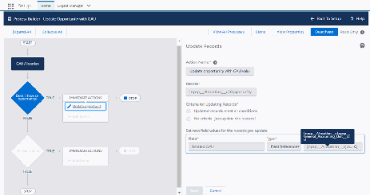

Allocation for this Account.
dd.. Operation = Last
ee.. Time Frame = All Time
ff.. Rollup Type = Opportunity > Account (Hard Credit)
gg.. Filter Group = Allocations: Won (or whichever filter group you want to use)
hh.. Field to Roll Up = Opportunity: Related GAU
ii.. Date Field = Opportunity: Close Date
Your rollup should look similar to this:
Now if you look at an Account's record, you can see the Last Gift Fund field displaying the General
Accounting Unit to which the Account's last gift (Opportunity) was allocated.
Recipe: Last Soft Credit Opportunity
When viewing a Contact, you can already see the value of the last soft credit that the Contact received.
It's an out-of-box rollup provided in NPSP (called Contact: Last Soft Credit Amount). But, perhaps you
want to also see the Opportunity on which the Contact was given that soft credit. With Customizable
Rollups, you can provide this info and have it link directly to the Opportunity.
Note Special thanks for Beth Breisnes for suggesting this recipe!
153

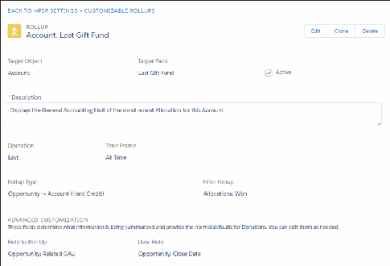

11.. Create a custom field on the Contact object.
aa.. Data Type = Lookup Relationship
bb.. Related To = Opportunity
cc.. Field Label = Last Soft Credit Opportunity
dd.. Description = A lookup to the last Opportunity on which the Contact received a
soft credit. Populated automatically by a Customizable Rollup.
ee.. Help Text = A lookup to the last Opportunity on which the Contact received a
soft credit. Populated automatically by a Customizable Rollup.
22.. Create the Customizable Rollup.
aa.. Target Object = Contact
bb.. Target Field = Last Soft Credit Opportunity
cc.. Description = A link to the most recent Opportunity for which the Contact
received a soft credit.
dd.. Operation = Last
ee.. Time Frame = All Time
ff.. Rollup Type = Opportunity > Contact (Soft Credit)
gg.. Filter Group = Opps: Won (SC)
hh.. Field to Roll Up = Opportunity: Opportunity ID
ii.. Date Field = Opportunity: Close Date
And if you look at a Contact's record, you can see the lookup to the most recent Opportunity from which
the Contact received soft credit. Note that you'll have to manually calculate rollups to see results right
away.
154

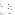

Recipe: Roll up Payment Details to the Recurring Donation
While you can see a summary of the Opportunity Amount info on a Recurring Donation, you may want a
summary of the Payments as well. This is useful if a Contact pays more than the Opportunity amount on
a given schedule OR if a Contact's Payment falls through and they haven't paid as much as they
committed to.
Note Special thanks to community member Sarah Qunito for suggesting this recipe!
11.. Create a custom field on the Recurring Donations object:
aa.. Data Type = Currency
bb.. Field Label = Payments Summary (Just a suggestion. Feel free to name it anything you like!)
cc.. Description = A summary of all Payments for a Recurring Donation. Populated
automatically by a Customizable Rollup.
dd.. Help Text = A summary of all Payments for a Recurring Donation. Populated
automatically by a Customizable Rollup.
22.. Create a Customizable Rollup with these values.
aa.. Target Object = Recurring Donations
bb.. Target Field = Payments Summary
cc.. Operation = Sum
dd.. Time Frame = All Time
ee.. Rollup Type = Opportunity > Recurring Donations
ff.. Filter Group = Opps Won (Recurring Donations) or use your own!
gg.. Amount Field = Opportunity: Payment Amount Received
155

Recipe: Combine Rollups and Levels
You can easily combine the power of Customizable Rollups with Levels to automatically calculate Levels
based on rollup fields.
Let's say you have three Levels (Bronze 500-1499, Silver 1500-2999, Gold 3000+) and you want to
populate them based on donations made in the last 365 days. In our example, we'll use the out-of-box
Total Gifts Last N Days Customizable Rollup, which is set to roll up the last 365 days worth of data by
default. But, you could easily modify the Days Back field in the rollup based on your needs OR clone this
rollup and enter a different number of Days Back.
Note Special thanks to community member Jenny Smithson for suggesting this recipe!
11.. Create your Levels. If you need more info, see Create and Manage Levels.
aa.. Level Name = Bronze
bb.. Minimum Amount = 500.00
cc.. Target = Contact (or Account)
dd.. Maximum Amount = 1499.00
ee.. Source Field = Total Gifts Last N Days (this is where you link this Level to the Customizable
Rollup!)
156

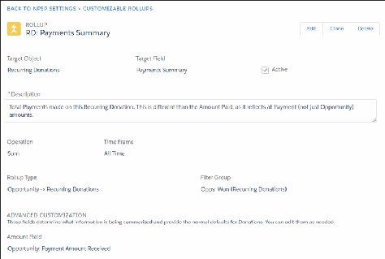

ff.. Level Field = Level
gg.. Previous Level Field = Previous Level
22.. Create your other Level fields using the same values above but giving each one a unique Level Name
and amount.
Now, when the Total Gifts Last N Days field for a Contact includes a value that corresponds with one of
your Levels, the Level field for that Contact will reflect the appropriate value.
Recipe: Total Current Year Payments on Prior Year Pledges
Perhaps you want to see the Payments made this year for pledges from the prior year. Or you want to see
last year's Payments on pledges from the year before that. And it's important that these fields are
dynamic, so that they don't reflect a specific, hard-coded year.
Note Special thanks to community member Janine Rauscher for suggesting this recipe!
157

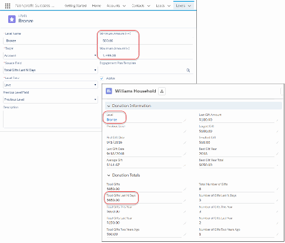

11.. Create a custom field on the Account object:
aa.. Data Type = Currency
bb.. Field Label = This Year Payments on Past Year Pledges (Just a suggestion. Feel free to
name it anything you like!)
cc.. Description = Displays the total amount of Payments made in this calendar year
for pledges (Opportunities) made in past calendar years. Populated
automatically via a Customizable Rollup.
dd.. Help Text = Displays the total amount of Payments made in this calendar year
for pledges (Opportunities) made in past calendar years. Populated
automatically via a Customizable Rollup.
22.. Create a custom field on the Payment object:
aa.. Data Type = Formula
bb.. Field Label = Is Opportunity From Prior Year
cc.. Formula Return Type = Checkbox
dd.. Formula = YEAR( npe01__Opportunity__r.CloseDate ) < YEAR(
npe01__Payment_Date__c )
ee.. Description = Indicates that the Opportunity associated with this Payment is
from a prior calendar year. This field is populated automatically.
ff.. Help Text = Indicates that the Opportunity associated with this Payment is from
a prior calendar year. This field is populated automatically.
33.. Create a Customizable Rollup filter group.
aa.. Name = Old Payments
bb.. Description = Includes payments where the Opportunity Close Date year is older
than the year of the Payment.
cc.. Add a filter rule for Paid Payments:
aa.. Object = Payment
bb.. Field = Paid
cc.. Operator = Equals
dd.. Value = True
dd.. Add a filter rule that indicates that the Opportunity's Close Date year is older than the year the
Payment was Paid.
aa.. Object = Payment
bb.. Field = Is Opportunity From Prior Year (this is the field you created on the Payment
object earlier)
cc.. Operator = Equals
dd.. Value = True
44.. Create the Customizable Rollup.
aa.. Target Object = Account
bb.. Target Field = This Year Payments on Past Year Pledges (or whatever you called the field
you created in step 1)
cc.. Operation = Sum
dd.. Time Frame = Years Ago
158

ee.. Years Ago = This Year
ff.. Rollup Type = Payment > Account (Hard Credit)
gg.. Filter Group = Old Payments (this is the new filter group you created)
hh.. Date Field = Payment: Payment Date
ii.. Amount Field = Payment: Payment Amount
Now, you can look at the Contact and see the list of Payments for the previous year's pledges
(Opportunities).
159

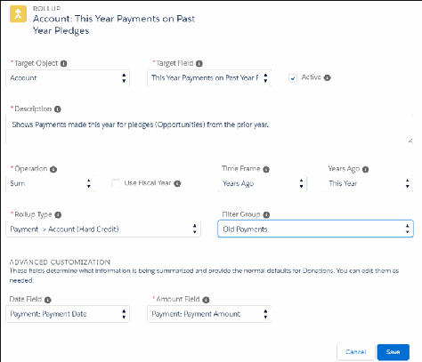

And you can verify that number by viewing the Payments on the Opportunity.
You can easily implement this for last year's payments made on pledges from any prior year. Simply
create another custom field on the Account, but give it a unique name. When creating the Customizable
Rollup, set the Years Ago field = Last Year.
Recipe: Track Amount Donated for Matched Gifts Only
Currently the Matching Gift related list shows the full amount of all donations, but not the actual
matched amount (which can be different if the company only matched a portion of the gift). You can
easily create a Customizable Rollup that shows the matched amount.
160

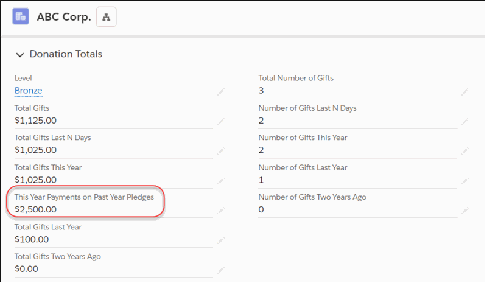

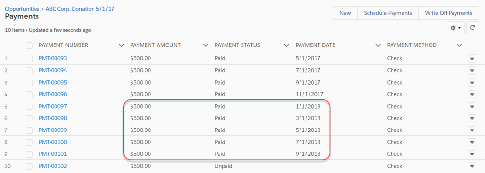

Note Special thanks to the community for suggesting this recipe.
11.. Create a custom field on the Contact.
aa.. Data Type = Currency
bb.. Field Label = Total Matched Amount (or Matched Gift Amount)
cc.. Description = Displays the total amount of matching gifts that have been
received as a result of this Contact's donations. Populated automatically by
a Customizable Rollup.
dd.. Help Text = Displays the total amount of matching gifts that have been received
as a result of this Contact's donations. Populated automatically by a
Customizable Rollup.
22.. Create a filter group that includes two filter rules. The first one should limit the Opportunities to those
that are Closed/Won.
aa.. Object = Opportunity
bb.. Field = Won
cc.. Operator = Equals
dd.. Value = True
33.. Add a second filter rule that limits the Opportunities to only those with the Matching Gift record type.
aa.. Object = Opportunity
bb.. Field = Record Type ID
cc.. Operator = In List
dd.. Value = Matching Gift
44.. Create a Customizable Rollup that sums up the Amount of matched gifts for this Contact.
aa.. Target Object = Contact
bb.. Target Field = Total Matched Amount
cc.. Operation = Sum
dd.. Time Frame = All Time
ee.. Rollup Type = Opportunity > Contact (Soft Credit)
ff.. Filter Group = Matching Gifts (should be the filter group you created earlier)
gg.. Amount Field = Contact Soft Credit: Amount
161

Now, look at the Contact to see the total matched amount. Note that you'll have to manually calculate
rollups to see results right away.
162

And you can verify that the amount is correct by viewing the Contact's list of Opportunities and adding
up those with the Matching Gift record type.
Recipe: First or Last Gift Campaign
Create a first or last gift campaign rollup on a contact record that's missing contact information.
Suppose you have Contacts in your system that don't have email or mailing addresses. Why are they in
your system if you can't contact them? This sounds like a use case that requires some investigation.
You could run a report of Contacts where Email = blank and Mailing Address fields = blank,
then start examining their related Opportunities looking for a pattern. This is a practical but time-
consuming solution. Or, you could save yourself some time and create a Last Gift Campaign rollup on the
Contact. When you add that field to your report, you can instantly see if there is a pattern based on
163

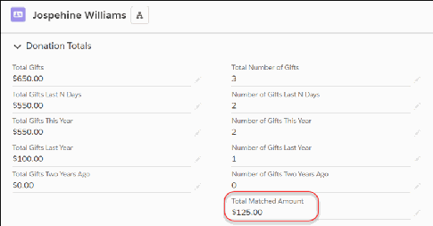

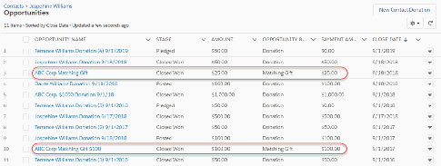

Campaigns.
For example, you might find that the Contacts were mostly credit card donors at the door of a tasting
event where you didn't collect any personal info. But, the swiping process required the auto-creation of a
Contact and an Opportunity with the Campaign field auto-set. These folks were just passing through
town, bought a tasting ticket, and that's the first and last you'll hear from them. Since the Last Gift
Campaign field is filled in with the same Campaign for most records on the report, you can easily group
them together. Mystery solved!
Note Special thanks to community member John Fine for suggesting this recipe and writing this
extremely helpful use case!
11.. Create a custom field for First Gift Campaign on Contact (or Account). Note that you could create a
similar field for Last Gift Campaign.
aa.. Data Type = Lookup Relationship
bb.. Related to = Campaign
cc.. Field Label = Last Gift Campaign
dd.. Help Text = Displays the Campaign that brought in the Contact's most recent
donation. Populated automatically via a Customizable Rollup.
ee.. Description = Displays the Campaign that brought in the Contact's most recent
donation. Populated automatically via a Customizable Rollup.
22.. Create a Customizable Rollup with these values:
aa.. Target Object = Contact (or Account if you want to roll up to Accounts instead)
bb.. Target Field = Last Gift Campaign
cc.. Description = A lookup on the Contact record to Campaign that brought in the
Contact's most recent donation, as determined by the Opportunity Close Date
field.
dd.. Operation = Last
ee.. Time Frame = All Time
ff.. Rollup Type = Opportunity > Contact (Hard Credit)
gg.. Filter Group = Opps: Won (HC)
hh.. Field to Roll Up = Opportunity: Campaign ID
ii.. DateField = Opportunity: Close Date
164

After rollups are recalculated, you can see the updated Last Gift Campaign field on a Contact record.
You could also add it to the report you're using to track donors without contact information.
165

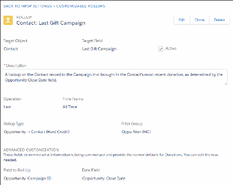

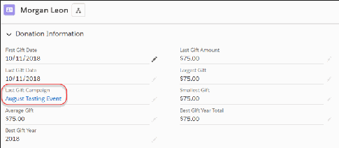

You can easily create another rollup for First Gift Campaign by creating a custom field called First Gift
Campaign, cloning the Last Gift Campaign rollup, and changing a few key fields:
•
Target Field = First Gift Campaign
•
Description = A lookup on the Contact record to Campaign that brought in the
Contact's first donation, as determined by the Opportunity Close Date field.
•
Operation = First
Recipe: Total Gifts Three Years Ago
NPSP provides out-of-box rollups for total giving this year, last year, and two years ago. But perhaps you
want to look back farther, to get a bigger picture of your donors' engagement and donation patterns. You
can easily clone existing rollups and update the Years Ago field to see more of a donor's giving history.
Note Special thanks to Cori O'Brien for suggesting this recipe!
11.. Create a custom field on the Contact object.
aa.. Data Type = Currency
bb.. Field Label = Total Gifts Three Years Ago
166

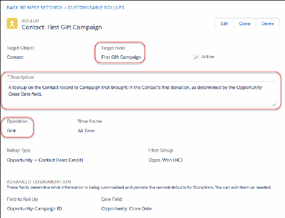

cc.. Help Text = Displays the total amount of gifts three calendar years ago for
which the Contact was listed as the Opportunity Primary Contact. Populated
automatically via a Customizable Rollup.
dd.. Description = Displays the total amount of gifts three calendar years ago for
which the Contact was listed as the Opportunity Primary Contact. Populated
automatically via a Customizable Rollup.
ee.. Default = 0
Note We recommend setting the Default Value so that this field isn't blank if a Contact didn't
donate three years ago.
22.. Either clone the Total Gifts Two Years Ago Customizable Rollup or create a new one with these values.
If you're cloning, be sure to update the Target Field and Years Ago fields!
aa.. Target Object = Contact
bb.. Target Field = Total Gifts Three Years Ago
cc.. Description = The total of all gifts three calendar years ago where the Contact
is the Opportunity Primary Contact
dd.. Operation = Sum
ee.. Time Frame = Years Ago
ff.. Years Ago = 3 Years Ago
gg.. Rollup Type = Opportunity > Contact (Hard Credit)
hh.. Filter Group = Opps: Won (HC)
ii.. Date Field = Opportunity: Close Date
jj.. Amount Field = Opportunity: Amount
As you can see, you can easily create Customizable Rollups for 4, 5, 6, 7, 8, 9, 10 years ago (or whatever
year you need to see), simply by creating a new custom field and then cloning an existing rollup and
changing a couple of fields.
So, now that you have giving information by year, suppose you want to see the total amount a Contact
has given over the past four years (this year + last year + 2 years ago + 3 years ago). You can easily sum
up this information using a formula field.
11.. Create a custom field on the Contact object.
aa.. Data Type = Formula
bb.. Field Label = Total Gifts Last Four Years
cc.. Formula Return Type = Currency
dd.. Formula = npo02__OppAmountThisYear__c + npo02__OppAmountLastYear__c +
npo02__OppAmount2YearsAgo__c + Total_Gifts_Three_Years_Ago__c
ee.. Description = Displays the total amount of gifts in the past four years for
which the Contact was listed as the Opportunity Primary Contact. Populated
automatically using a formula.
ff.. Help Text = Displays the total amount of gifts in the past four years for which
167

the Contact was listed as the Opportunity Primary Contact. This field is
populated automatically.
22.. Be sure to add it to the Contact page layout, then check it out on the Contact record.
Recipe: Identifying Peer-to-Peer Fundraising Influencers
If you plan events that include peer-to-peer fundraising, you want to be able to easily identify
constituents who influence others to give. That way you can recognize their contribution by sending a
thank you email or posting a note on your event site.
Note Special thanks to community member Ginny Foran for suggesting this recipe!
This recipe follows along with Aria Bennett, who is running in the 2018 Race for Literacy. She has been
publicizing her participation in the race to raise money, and thus far has received a number of donations
from friends and coworkers. In Salesforce, the Event Coordinators use Campaigns to track the event as a
whole, as well as each individual fundraiser or team captain. The following setup is required:
11.. Add a new value, Fundraiser, to the Campaign Type field (on the Campaigns object).
22.. Add two new Opportunity Contact Roles: Fundraiser, Team Captain.
33.. Add a custom field on the Contact object.
aa.. Data Type = Currency
bb.. Field label = Total Influenced Gifts
cc.. Description = Displays the total amount of gifts that this Contact has
influenced. Includes all Opportunities where the Contact received a soft
credit with the role of Fundraiser or Team Captain. Populated automatically
via a Customizable Rollup.
168

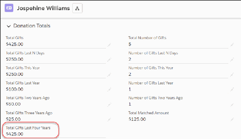

dd.. Help Text = Displays the total amount of gifts that this Contact has
influenced. Includes all Opportunities where the Contact received a soft
credit with the role of Fundraiser or Team Captain. Populated automatically
via a Customizable Rollup.
44.. Create a Campaign for the 2018 Race for Literacy.
55.. Create a Campaign for Aria Bennett 2018 Race for Literacy. Make the 2018 Race for Literacy its Parent
Campaign.
66.. Create the Opportunities for the people supporting Aria with donations. On each donation, make
sure:
aa.. Primary Campaign Source = Aria Bennett 2018 Race for Literacy
bb.. Add Aria Bennett as a Contact Role with the Role = Fundraiser
77.. Create a Customizable Rollup filter group that only shows Opportunities with the appropriate Contact
Roles (Fundraiser, Team Captain).
aa.. Name = Peer to Peer Opps (or whatever you want to call it)
88.. Add a filter rule that includes the Fundraiser and Team Captain Contact Roles. Note: If you only want
to see Won Opportunities, add a second filter rule.
aa.. Object = Contact Soft Credit
bb.. Field = Role Name
cc.. Operator = In List
dd.. Values = Fundraiser, Team Captain
99.. Create a Customizable Rollup with these values.
aa.. Target Object = Contact
bb.. Target Field = Influencer
cc.. Operation = Sum
dd.. Time Frame = All Time
ee.. Rollup Type = Opportunity → Contact (Soft Credit)
ff.. Filter Group = Peer to Peer Opps (the filter group you created in the previous step)
gg.. Amount field = Soft Credit: Amount
169

If you look at Aria Bennett's Contact record, you'll see the Influencer field. Reminder: To see the updated
field on the record right away, you'll need to manually recalculate rollups.
170

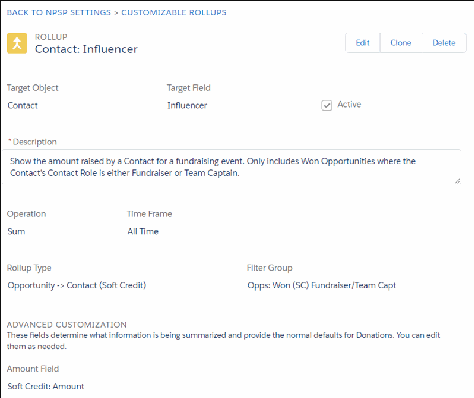

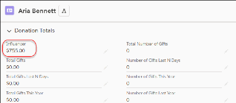

And you can verify the amount that Aria has influenced by looking at and adding up the Opportunities
on her fundraising Campaign.
Aria's off to a great start and will definitely make a big impact on the Run for Literacy!
Set Fiscal Year Rollups
NPSP supports rollups and reports based on your organization's fiscal year, as long as you configure your
fiscal year according to the instructions below.
Configure Your Fiscal Year
Follow these steps to configure your fiscal year.
Set Rollups Based on Fiscal Year
Learn how to configure Customizable Rollups to calculate based on fiscal year.
Configure Your Fiscal Year
Follow these steps to configure your fiscal year.
11.. Click , then click Setup.
22.. From Setup, enter Fiscal Year in the Quick Find box, then select Fiscal Year.
33.. Select the Standard Fiscal Year radio button.
Important NPSP does not support Custom Fiscal Years. You must select Standard Fiscal Year for
NPSP rollups and reports to work properly.
44.. Select the Fiscal Year Start Month based on your organization's fiscal year.
55.. In the Fiscal Year is Based On field, choose The ending month.
Important NPSP requires that your fiscal year setting be based on the ending month so that
rollups calculate correctly.
66.. Click Save.
171

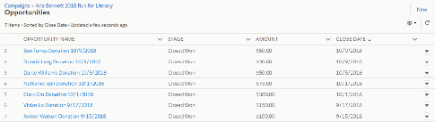

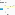

Set Rollups Based on Fiscal Year
Learn how to configure Customizable Rollups to calculate based on fiscal year.
Note Watch the Nonprofit Salesforce How-To Series videos about NPSP Set Fiscal Year Rollups.
11.. Click the NPSP Settings tab. If you don't see the tab, find it in the App Launcher ( ).
22.. Click Donations | Customizable Rollups.
33.. Click Configure Customizable Rollups.
44.. To use fiscal year for an existing rollup, in the row for the rollup, click the down arrow and then click
Edit. To create a new rollup that will use fiscal year, click New.
55.. Select the Use Fiscal Year checkbox.
Note The Use Fiscal Year option only appears if the Operation field is set to Years Donated, Best
Year, Best Year Total OR if the Time Frame field is set to Years Ago.
66.. Click Save.
The rollup values update with the next nightly batch job.
