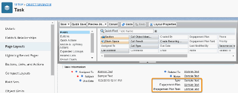

Configure Engagement Plans
Find out more about configuring engagement plans.
About Engagement Plans
NPSP Engagement Plans let you create a set of tasks (literally a "plan") that helps you engage with your
constituents. Use Engagement Plans for major gifts, volunteer management, grant-making, client
management, sponsor management, and more.
Set Tab Visibility
For every profile that should have access to Engagement Plans, set the Engagement Plan Templates
tab settings.
Set Object and Field-Level Security
To use Engagement Plans, you need to set object and field security.
Edit Page Layouts
Follow these steps to edit page layouts.
Override Buttons
You can override the New, Clone, and Edit buttons to point them to the Manage Template page, where
you can edit the Engagement Plan Template and Tasks all in one place.
Allow Activities
If you're planning to use Engagement Plans with a custom object such as Recurring Donations, you
need to select Allow Activities.
181

(Optional) Give Users Access to the EP_ManageEPTemplate Visualforce Page
System Administrators have access to the EP_ManageEPTemplate Visualforce page by default, but
other profiles don't. If you want users with other profiles to manage Engagement Plans, you must give
them access to the Visualforce page.
(Optional) Enable Engagement Plans for Custom Objects
By default, you can associate Engagement Plans with Contact, Account, Cases, Opportunity,
Campaign, and Recurring Donation records. But you can add an Engagement Plan to any object.
Simply add a lookup field on the Engagement Plan object.
(Optional) Create a Tab for the Engagement Plan Object
You can create a custom tab for Engagement Plans to help users easily access them. Be sure to set the
tab to Default On only for profiles that work with Engagement Plans. Users with access to the
Engagement Plan tab will also be able to search for Engagement Plans using the Engagement Plan
Number.
(Optional) Add the Engagement Plan Templates Tab to an App
NPSP comes with a Tab for Engagement Plan Templates. To make it easy for users to manage
Engagement Plan Templates, you can add the Engagement Plan Templates tab to an app, such as
Nonprofit Success Pack.
About Engagement Plans
NPSP Engagement Plans let you create a set of tasks (literally a "plan") that helps you engage with your
constituents. Use Engagement Plans for major gifts, volunteer management, grant-making, client
management, sponsor management, and more.
NPSP Engagement Plans uses the following objects:
•
Engagement Plan Template (custom object): Defines the process and associated set of tasks required
to complete an Engagement Plan.
•
Engagement Plan (custom object): A set of tasks that helps you engage with your constituents.
•
Engagement Plan Task (custom object): Defines the details of each task that is created when applying
an Engagement Plan to a record.
FFeeaattuurree RReelleeaassee IInnffoorrmmaattiioonn
This feature was released in NPSP version 3.81 (9/14/2016).
Set Tab Visibility
For every profile that should have access to Engagement Plans, set the Engagement Plan Templates tab
settings.
11.. Click , then click Setup.
22.. In the Quick Find box, enter Profiles, then click Profiles.
33.. Click the name of the Profile you want to set security for.
182

44.. Click Edit.
55.. In the Custom Tab Settings section next to Engagement Plan Templates, select Default On to include
the tab in your list of tabs or Default Off to make the tab accessible in App Launcher.
66.. Click Save.
Set Object and Field-Level Security
To use Engagement Plans, you need to set object and field security.
On the Engagement Plans, Engagement Plan Tasks, and Engagement Plan Templates objects:
11.. From Setup, enter Profiles in the Quick Find box, then click Profiles.
22.. Click the name of the Profile you want to set security for.
33.. Click Edit.
44.. Edit the profiles for all users who will work with Engagement Plans to include the following object
settings for the Engagement Plans, Engagement Plan Tasks, and Engagement Plan Templates objects,
unless otherwise noted:
••
Set object permissions to Read, Create, Edit, and Delete. This gives all users with this profile full
access to use Engagement Plans. Depending on the profile, you may want to grant different access.
••
For the System Administrator profile only, set object permissions to Modify All Records and View All
Records.
55.. Click Save.
66.. In the Field Level Security section, click View next to Engagement Plans and select Read Access and
Edit Access for each field.
77.. Click Back to Profile.
88.. In the Field Level Security section, click View next to Engagement Plan Tasks and select Read Access
and Edit Access for each field.
99.. Click Back to Profile.
1100.. In the Field Level Security section, click View next to Engagement Plan Templates and select Read
Access and Edit Access for each field.
1111.. Click Back to Profile.
1122.. In the Field Level Security section, click View next to Task and select Read Access and Edit Access for
these fields:
••
Engagement Plan
••
Engagement Plan Task
••
Type
1133.. Click Save.
Edit Page Layouts
Follow these steps to edit page layouts.
Add the following fields to the Task page layout:
•
Engagement Plan
183

•
Engagement Plan Task
•
Type
To edit the Task page layout:
11.. From Setup, click the Object Manager tab.
22.. In the list of objects, click Task.
33.. Click Page Layouts.
44.. Click Task Layout.
55.. Drag that Engagement Plan, Engagement Plan Task, and Type fields onto the page layout.
66.. Click Save.
On Contacts, Cases, Accounts, Campaigns, Opportunities, and Recurring Donations, update the relevant
page layouts to include the Engagement Plans related list. We recommend that you add the following
fields as columns in each related list:
•
Engagement Plan Number
•
Engagement Plan Template
•
Status
•
Total EP Tasks
•
Completed Tasks
•
Created Date
Override Buttons
You can override the New, Clone, and Edit buttons to point them to the Manage Template page, where
you can edit the Engagement Plan Template and Tasks all in one place.
11.. From Setup, click the Object Manager tab.
22.. In the list of objects, click Engagement Plan Template.
33.. Click Buttons, Links, and Actions.
44.. In the row for the Edit button, click , then click Edit.
184

55.. Choose Visualforce Page, then select EP_ManageEPTemplate [npsp__EP_ManageEPTemplate].
66.. Click Save.
77.. Repeat these steps for the New and Clone buttons.
These button overrides replace the Manage Template button, so we recommend removing it from the
page layout. To remove the Manage Template button from the Engagement Plan Template page layout:
11.. Back on the Engagement Plan Template object in the Object Manager, click Page Layouts.
22.. Click Engagement Plan Template Layout.
33.. Drag the Manage Template button from the Custom Buttons area back to the panel at the top of the
page.
44.. Click Save.
Allow Activities
If you're planning to use Engagement Plans with a custom object such as Recurring Donations, you need
to select Allow Activities.
11.. From Setup, click the Object Manager tab.
22.. In the list of objects, click Recurring Donations.
33.. Click Edit.
44.. In the Optional Features section, select Allow Activities.
55.. Click Save.
(Optional) Give Users Access to the EP_ManageEPTemplate Visualforce Page
System Administrators have access to the EP_ManageEPTemplate Visualforce page by default, but other
profiles don't. If you want users with other profiles to manage Engagement Plans, you must give them
access to the Visualforce page.
11.. From Setup, enter Profiles in the Quick Find box, then click Profiles.
22.. Click a Profile to edit.
33.. Click Enabled Visualforce Page Access.
44.. Click Edit.
55.. Move npsp.EP_ManageEPTemplate into the Enabled Visualforce Pages list.
66.. Click Save.
(Optional) Enable Engagement Plans for Custom Objects
By default, you can associate Engagement Plans with Contact, Account, Cases, Opportunity, Campaign,
and Recurring Donation records. But you can add an Engagement Plan to any object. Simply add a
lookup field on the Engagement Plan object.
When you add an Engagement Plan to an object, make sure Allow Activities is selected and available on
the object or you’ll get an error. Engagement Plans aren’t supported on the User object because the User
185

object doesn’t have access to Activities.
11.. From Setup, click the Object Manager tab.
22.. In the list of objects, click Engagement Plan.
33.. Click Fields & Relationships.
44.. Click New.
55.. Select the Lookup Relationship radio button and click Next.
66.. Choose the object you want to associate Engagement Plans with and click Next.
77.. Fill in the required fields.
88.. Click Save.
For more information on creating custom fields, see Create Custom Fields.
(Optional) Create a Tab for the Engagement Plan Object
You can create a custom tab for Engagement Plans to help users easily access them. Be sure to set the
tab to Default On only for profiles that work with Engagement Plans. Users with access to the
Engagement Plan tab will also be able to search for Engagement Plans using the Engagement Plan
Number.
11.. From Setup, enter Tabs in the Quick Find box, then click Tabs.
22.. Under Custom Object Tabs, click New.
33.. Select Engagement Plan for the Object.
44.. Choose a Tab Style.
55.. Click Next.
66.. Choose the appropriate Tab Visibility for each profile, then click Next.
77.. Add the tab to the Nonprofit Success Pack app.
88.. Click Save.
(Optional) Add the Engagement Plan Templates Tab to an App
NPSP comes with a Tab for Engagement Plan Templates. To make it easy for users to manage
Engagement Plan Templates, you can add the Engagement Plan Templates tab to an app, such as
Nonprofit Success Pack.
11.. From Setup, enter App Manager in the Quick Find box, then click App Manager.
22.. In the row for the app you’d like to add the tab to, click , then click Edit.
33.. In the App Settings, click Navigation Items.
44.. Find the Engagement Plan Templates tab and move it to the Selected Items.
55.. Click Save.
