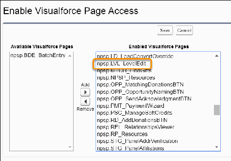
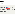
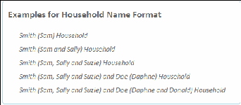
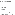
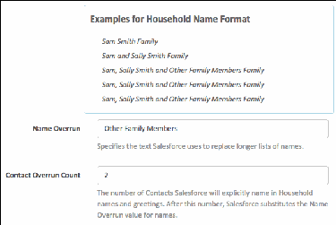
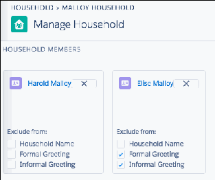
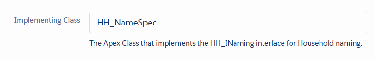

Configure Gift Entry
Prepare your NPSP Salesforce org to add or edit donations and related information in one entry form.
Note Watch the Nonprofit Salesforce How-To Series video, Configure Gift Entry
Gift Entry is a robust set of tools for creating consistent form templates that you can use to enter gifts
into NPSP, either individually or in batches. You can also set defaults at the template or batch level. Gift
Entry replaces the older Batch Gift Entry product.
Enable Gift Entry
The Gift Entry tool is disabled by default in Salesforce orgs. Be warned; there's more to enabling it than
just flipping a switch! You must first enable Advanced Mapping and then Gift Entry. After that's done,
adjust some of your actions and tabs as well as grant your users access to the new functionality.
Enable Enhanced Recurring Donations
Follow these steps to enable enhanced recurring donations.
Customize Columns on Batches & Templates
The Gift Entry tab contains two subtabs: Batches and Templates. The Templates tab shows all gift entry
form templates in your org, and the Batches tab shows all data batches created by your users. You can
190

configure the list columns to show the information you want to see about each item, in the order you
want to see it.
Adjust Gift Entry and Advanced Mapping to Populate Contact Address Fields (Optional)
NPSP Advanced Mapping's default mapping to the NPSP Address object doesn't work with Gift Entry's
feature to automatically populate a Contact's address fields on a form. (For example, if you select a
Contact from a lookup on a Gift Entry form, the Contact's address information won't auto-populate.)
You can work around this limitation by adjusting your Gift Entry templates and Advanced Mapping.
Customize Household Names
Find out more about customizing household names.
Enable Gift Entry
The Gift Entry tool is disabled by default in Salesforce orgs. Be warned; there's more to enabling it than
just flipping a switch! You must first enable Advanced Mapping and then Gift Entry. After that's done,
adjust some of your actions and tabs as well as grant your users access to the new functionality.
To enable Advanced Mapping and Gift Entry:
11.. Confirm you have My Domain enabled. Read more about My Domain in Salesforce documentation.
22.. Click the NPSP Settings tab. If you don't see the tab, find it in the App Launcher ( ).
33.. Click System Tools | Advanced Mapping for Data Import & Gift Entry.
44.. In the first section, enable Advanced Mapping.
Note When you enable Advanced Mapping, NPSP will convert your Help Text mappings to
Advanced Mapping. This may take a little time. See Enable and Convert to Advanced Mapping for
more information.
55.. When the page reloads, in the second section, enable Gift Entry.
66.. If you want to number your batches, follow the instructions in Configure Batch Numbers for
Donations.
AAdddd GGiifftt EEnnttrryy AAccttiioonnss
Gift Entry adds a new action that lets your users create a gift directly from Account and Contact records.
To enter gifts with Gift Entry from the Account or Contact record, you must add these actions to your
page layouts.
Note If you previously created a New Donation action per other NPSP configuration instructions, we
recommend removing it. The New Gift action provides greater functionality and is more accessible!
11.. Click , then click Setup.
22.. Click the Object Manager tab, then click Account.
33.. Click Page Layouts, then click the name of the page layout you want to update.
44.. In the page layout palette, click Mobile & Lightning Actions.
191

55.. Drag the New Gift action into the Salesforce Mobile and Lightning Experience Actions section of the
layout editor.
Note If the actions on this page layout haven't been edited before, you may not be able to drag
the action into this section yet. Click override the predefined actions to enable drag-and-drop.
You can then add, move, or remove actions from this section.
66.. Click Save.
77.. Repeat these steps for all other Account page layouts that need this action.
88.. Return to the Object Manager tab, then click Contact.
99.. Repeat these steps for all Contact page layouts that need this action.
SSeett UUpp GGiifftt EEnnttrryy UUsseerr PPeerrmmiissssiioonnss
We recommend creating a permission set to give users access to the Gift Entry tool. Permission sets are a
great way to grant a group of permissions to specific users.
For more information on creating and assigning permission sets, see Permission Sets in Salesforce Help.
Note You can assign these permissions at the profile level instead of using a permission set. If you're
using a Profile, you first need to enable the Enhanced Profile User Interface setting in Setup | User
Management Settings. The instructions may vary slightly if you set these permissions on the profile.
11.. Click , then click Setup.
22.. Enter Permission Sets in the Quick Find box, then select Permission Sets.
33.. Click New.
44.. Name the permission set Gift Entry Recommended.
55.. Click Save.
66.. Click Apex Class Access.
77.. Click Edit, then add these classes to the Enabled Apex Classes list:
••
npsp.BDI_ManageAdvancedMappingCtrl
••
npsp.BDI_MappingServiceAdvanced
••
npsp.BGE_BatchGiftEntry_UTIL
••
npsp.BGE_ConfigurationWizard_CTRL
••
npsp.BGE_DataImportBatchEntry_CTRL
••
npsp.BGE_FormTemplate_TDTM
••
npsp.GE_GiftEntryController
••
npsp.GE_PaymentServices
••
npsp.UTIL_CustomSettingsFacade
••
npsp.UTIL_CustomSettings_API
88.. Click Save.
99.. Navigate to Visualforce Page Access.
1100.. Click Edit, then add these pages to the Enabled Visualforce Pages list:
••
npsp.BDI_BatchOverride
••
npsp.BDI_DataImport
1111.. Click Save.
192

1122.. Navigate to Custom Setting Definition.
1133.. Click Edit, then add this setting definition to Enabled Custom Setting Definitions list:
••
npsp.Custom Column Header
••
npsp.Data Import Settings
••
npsp.Gift Entry Settings
1144.. Click Save.
1155.. Navigate to Object Settings.
1166.. Give users access to the Gift Entry tab:
aa.. Click Gift Entry.
bb.. Click Edit.
cc.. Select Available and Visible.
dd.. Click Save.
1177.. In Object Settings, grant object and field permissions for the following objects.
aa.. The following objects power Gift Entry.
Object: Read, Create, Edit, Delete Fields: Read & Edit Access
Form Templates All fields
NPSP Data Import Batches All fields
NPSP Data Imports All fields
bb.. The following target objects and fields are mapped by default in Gift Entry.
Note The table below shows standard target objects and fields for Gift Entry. If you've added
custom objects and fields with Advanced Mapping, you must also grant Read, Create, and Edit
access to those objects, and Read and Edit access to those fields. Learn how to add custom
fields to Gift Entry in Customize Advanced Mapping.
Object: Read, Create, Edit Fields: Read & Edit Access
Accounts Account Name, Billing Address, Household
Phone, Phone, Website
Addresses Mailing City, Mailing Country, Mailing Street,
Mailing Street2, Mailing State/Province, Mailing
Zip/Postal Code
Campaigns Campaign Name
Contacts Alternate Email, Birthdate, Home Phone,
Mobile, Name, Other Phone, Personal Email,
Preferred Email, Preferred Phone, Title, Work
Email, Work Phone
GAU Allocations Amount, General Accounting Unit, Opportunity,
193

Object: Read, Create, Edit Fields: Read & Edit Access
Percent
General Accounting Units All fields
Opportunities Account Name, Amount, Close Date,
Description, Honoree Information, Honoree
Name, Member Level, Membership End Date,
Membership Origin, Membership Start Date,
Notification Message, Notification Recipient
Email, Notification Recipient Information,
Notification Recipient Name, Number of
Payments, Opportunity Name, Opportunity
Record Type, Primary Campaign Source, Primary
Contact, Stage, Tribute Type, Type
Payments Check/Reference Number, Elevate Payment API
Status, Paid, Payment Amount, Payment Date,
Payment Method, Scheduled Date, Written Off
Recurring Donations Account, Amount, Campaign, Contact, Day of
Month, Effective Date, End Date, Installment
Frequency, Installment Period, Number of
Planned Installments, Payment Method,
Recurring Type
1188.. Return to the Permission Set Overview.
1199.. Click Manage Assignments.
2200.. Click Add Assignments.
2211.. Select all users who should have access to Gift Entry.
2222.. Click Assign.
2233.. Click Done.
RReemmoovvee BBaattcchh GGiifftt EEnnttrryy TTaabb ffoorr AAllll UUsseerrss
While Gift Entry and Batch Gift Entry are similarly named, they are quite different features. Reduce
confusion by hiding the Batch Gift Entry tab.
Note These steps include modifying the existing Batch Gift Entry permission set. The instructions
may vary slightly if you need to update these permissions at the User Profile level.
11.. Click , then click Setup.
22.. In the Quick Find box, enter permission sets, then click Permission Sets.
33.. Click Batch Gift Entry.
194

44.. Click Object Settings.
55.. Click Batch Gift Entry.
66.. Click Edit.
77.. Deselect Available and Visible.
88.. Click Save.
Enable Enhanced Recurring Donations
Follow these steps to enable enhanced recurring donations.
11.. Enable Enhanced Recurring Donations.
To find out if Enhanced Recurring Donations is enabled in your org, review Which Version of Recurring
Donations Am I Using?
22.. Give users Read and Edit access to the Allow Recurring Donations field on the NPSP Data Import
Batches object.
Customize Columns on Batches & Templates
The Gift Entry tab contains two subtabs: Batches and Templates. The Templates tab shows all gift entry
form templates in your org, and the Batches tab shows all data batches created by your users. You can
configure the list columns to show the information you want to see about each item, in the order you
want to see it.
11.. From the App Launcher, find and select Gift Entry.
22.. From the Templates tab or Batches tab, click to access the list view controls, then select Select
Fields to Display .
33.. Use the left and right arrows to move fields from the Available Fields list to the Visible Fields list.
44.. Use the up and down arrows to change the display order.
55.. Click Save.
Now that you're set up to use Gift Entry, head to Create or Edit a Gift Entry Template to get your
templates ready to use.
Adjust Gift Entry and Advanced Mapping to Populate Contact Address Fields
(Optional)
NPSP Advanced Mapping's default mapping to the NPSP Address object doesn't work with Gift Entry's
feature to automatically populate a Contact's address fields on a form. (For example, if you select a
Contact from a lookup on a Gift Entry form, the Contact's address information won't auto-populate.) You
can work around this limitation by adjusting your Gift Entry templates and Advanced Mapping.
195

Note These changes affect the address mappings for importing data with NPSP Data Importer.
AAddjjuusstt GGiifftt EEnnttrryy TTeemmppllaatteess aanndd AAddvvaanncceedd MMaappppiinngg
Here's how to adjust Gift Entry templates so that related Contact information auto-populates on your
forms.
Important Before proceeding, complete any gift batches that haven't been processed.
You must perform all of these steps in order. When you're done, you should see records created or
updated as outlined in Expected Behaviors.
Remove Address Fields from Templates
Here's how to remove address field from templates.
Important Do this for all of your templates.
11.. In the App Launcher , find and select Gift Entry.
22.. Click the Templates tab.
33.. Click the name of the template you'd like to update.
44.. Go to the Form Fields tab.
55.. Remove these address fields:
••
Mailing City
••
Mailing Country
••
Mailing State/Province
••
Mailing Street
••
Mailing Zip/Postal Code
66.. Click Save & Close.
77.. Repeat these steps for all of your templates.
Adjust Addresses Mapped in Advanced Mapping
Map addresses to the Contact1 object.
11.. Click the NPSP Settings tab. If you don't see the tab, find it in the App Launcher ( ).
22.. Go to System Tools | Advanced Mapping for Data Import & Gift Entry.
33.. Click Configure Advanced Mapping.
196

44.. For the Object Group named Address, click , then click View Field Mappings.
55.. Delete these NPSP Data Import address mappings:
••
Home City
••
Home Country
••
Home State/Province
••
Home Street
••
Home Zip/Postal Code
66.. Click Back to Object Group.
77.. For the Object Group named Contact1, click the selector, and then click View Field Mappings.
88.. Click Create New Field Mapping and map the home address fields on the NPSP Data Import object to
the Contact mailing address fields.
Source (NPSP Data Import Object) Field Target (Contact1 Object) Field
Home City (npsp__Home_City__c) Mailing City (MailingCity)
Home Country (npsp__Home_Country__c) Mailing Country (MailingCountry)
Home State/Province Mailing State/Province (MailingState)
(npsp__Home_State_Province__c)
Home Street (npsp__Home_Street__c) Mailing Street (MailingStreet)
Home Zip/Postal Code Mailing Zip/Postal Code (MailingPostalCode)
(npsp__Home_Zip_Postal_Code__c)
Add New Address Fields to Templates
Here's how to add new address fields to templates.
Note If the new fields don't show up in Template Builder immediately, refresh your browser a time
or two.
11.. In the App Launcher , find and select Gift Entry.
22.. Click the Templates tab.
33.. Click the name of the template you'd like to update.
44.. Go to the Form Fields tab.
55.. Select the section of the template where you'd like to add the fields.
66.. Expand the Address section under Form Fields.
197

77.. Select these address fields to add them to the template:
••
Mailing City
••
Mailing Country
••
Mailing State/Province
••
Mailing Street
••
Mailing Zip/Postal Code
88.. Click Save & Close.
EExxppeecctteedd BBeehhaavviioorrss
After you've adjusted Gift Entry and Advanced Mapping for auto-population of corresponding Contact
address information, what you see is highly dependent on your org's configuration.
The scenarios below describe what you see if 1) the Household Account Addresses Disabled option isn't
selected in NPSP Settings, and 2) the Address Override is not selected on the Contact's record.
After adding a new Contact in Gift Entry and processing the gift, the address information appears in the
Mailing Address fields on the Contact's new record. NPSP automation also updates the address on
related records. Specifically, NPSP:
•
Creates a new Address record with the same address.
•
Links the Current Address field on the Contact to the Address record.
•
Makes the Contact's Household Account and the Billing Address the same.
After finding and selecting an existing Contact in the Existing Donor Contact field on the form, the
Contact address fields on the form are automatically populated. You can update or clear out the address
information on the form.
•
If you change the address on the form and process the gift, the updated address appears in the
Contact's Mailing Address fields. NPSP automation also updates the address on related records.
Specifically, NPSP:
- Updates the Billing Address information on Contact's Household Account.
- Updates Contacts related to the household with the new Mailing Address.
- Creates a new Address record and sets it as the Default Address.
•
If you clear out and remove all of the address information and process the gift, the Contact won't have
any address information in the Mailing Address fields. NPSP Automation also updates related records.
Specifically, NPSP:
- Removes the Billing Address information from the Contact's Household Account.
- Updates Contacts related to the household to remove Mailing Address information.
- Does not set any address as the Default Address in the Address object.
Customize Household Names
Find out more about customizing household names.
198

Note Watch the Nonprofit Salesforce How-To Series video about Automatic Household Naming.
Overview: About Household Naming
Nonprofit Success Pack supports the Household Account model and automatic Household naming.
Customize the Household Name Format
NPSP uses the Household Name Format to determine the Household Account Name.
Customize the Formal Greeting Format
NPSP uses the Formal Greeting Format to determine the Household's Formal Greeting.
Customize the Informal Greeting Format
NPSP uses the Informal Greeting Format field to determine the Household's Informal Greeting.
Customize Name Connector, Name Overrun, and Name Sequence
The name connector, name overrun, and name sequence also affect the appearance of your
Household names and greetings.
Other Custom Format Examples
Choosing "other" from the Household Name Format, Formal Greeting Format, or Informal Greeting
Format lets you design your own custom format. You can create your own format from scratch, or copy
and paste from one of these examples.
Create Your Own Custom Format From Scratch
The key to creating your own custom naming format from scratch is understanding the format
components.
Exclude a Name
You can exclude Contact names from Household Names, Formal Greetings, and Informal Greetings.
Refresh All Household Names
Once you've made changes to Household Name formatting, you can refresh the naming for all existing
Household names and greetings.
Automatic Household Renaming
There are certain actions that trigger an automatic update of the Household name. For example, if you
update the value of a Contact field that's included in the Household Naming formula, NPSP will
automatically update the Household Name.
Disable Automatic Household Naming
If you don't want the NPSP to name your Households automatically for you, you can disable the
automatic Household Naming feature.
Use Your Own Custom Household Naming
Once you've made changes to Household Name formatting, you can refresh the naming for all existing
Household names and greetings.
Household Naming FAQ
Get answers to common questions about household naming. Manually edit the generated name,
include custom fields, understand anonymous households, and more.
199

Overview: About Household Naming
Nonprofit Success Pack supports the Household Account model and automatic Household naming.
This means that when you create a new Contact in Salesforce, NPSP creates a new Household Account
record, and generates its name based on the name of the new Contact. For example, when you create
the Jamal Jones Contact record, NPSP creates the Jones Household.
By default, automatic household naming functionality:
•
Creates the name of the new Household Account based on the last name of the new Contact.
•
Creates formal and informal greetings based on the Contact's name.
•
Updates Household names and greetings when you update Contact names, or add or remove
Contacts from the Household.
The best place to see this in action is in the Account Detail section of the Household Account record:
In this example, NPSP displays the default Household Name, Formal Greeting, and Informal Greeting
based on the two Contacts in the Household: Harold Malloy and Elise Malloy. But what if you wanted
your Formal Greeting to be "Mr. and Mrs. Malloy" instead of the default "Harold and Elise Malloy"? Or
what if you wanted to omit a Contact name from one or both of the Greetings?
The rest of this article describes how you can customize automatic Household naming to fit the needs of
your organization.
Customize the Household Name Format
NPSP uses the Household Name Format to determine the Household Account Name.
To change the Household name setting:
11.. In NPSP Settings, click People | Households.
22.. Click Edit.
33.. Select a format from the Household Name Format field:
••
-none- Does not generate a Household Name, leaving it up to the user to assign one.
••
{!LastName} Household Generates a Household name such as “Smith Household” or “Smith and
Jones Household,” depending on the number of Contacts in the Household.
200

••
{!{!FirstName}} {!LastName} Household Generates a Household name such as “John Smith
Household” or “John and Jane Smith Household”.
••
{!LastName} ({!{!FirstName}}) Household Generates a Household name such as “Smith (John)
Household”, “Smith (John and Jane) Household” or “Smith (John) and Doe (Jane) Household”.
••
{!LastName} Family Generates a Household name such as “Smith Family” or “Smith and Jones
Family”.
••
{!{!FirstName}} {!LastName} Family Generates a Household name such as “John Smith Family” or
“John and Jane Smith Family”.
••
{!LastName} ({!{!FirstName}}) Family Generates a Household name such as “Smith (John) Family”,
“Smith (John and Jane) Family” or “Smith (John) and Doe (Jane) Family”.
••
{!{!Salutation}} {!FirstName} {!LastName} Family Generates a Household name such as "Mr. John
Smith Family" or "Mr. and Mrs. John Smith Family".
••
{!Account.npe01__One2OneContact__r.LastName} Family Generates a Household name such as
"Smith Family".
••
{!LastName} ({!Account.Billing.City}) Family Generates a Household name such as "Smith (Seattle)
Family".
••
other Allows you to specify your own naming convention. See Other Custom Format Examples for
sample formats you can copy and paste. See Create Your Own Custom Format From Scratch for
detailed information on designing your own format.
Note The Examples for Household Name Format field further down on the Households
Settings page shows a preview of Household Names based on your current selection. The
following preview is what's shown when you choose the {!LastName} ({!{!FirstName}})
Household option:
44.. Click Save.
Customize the Formal Greeting Format
NPSP uses the Formal Greeting Format to determine the Household's Formal Greeting.
To change the formal greeting setting:
11.. In NPSP Settings, click People | Households.
22.. Click Edit.
33.. Select an option from the Formal Greeting Format field:
201

Note The Examples for Formal Greeting Format field further down on the Households Settings
page shows a preview of Formal Greetings based on your current selection. The following preview
is what's shown when you choose the {!{!FirstName}} {!LastName} option:
••
-none- Does not generate a Formal Name at all. The field will remain blank.
••
{!{!FirstName}} {!LastName} Generates a formal greeting such as “John Smith” or “John and Jane
Smith”.
••
{!{!Salutation} {!FirstName}} {!LastName} Generates a formal greeting such as “Dr. John Smith”, or
“Dr. John and Mrs. Jane Smith”.
••
{!{!Salutation}} {Firstname} {Lastname} Generates a formal greeting such as "Mr. & Mrs. John Doe".
••
other Allows you to specify your own naming convention. See Other Custom Format Examples for
sample formats you can copy and paste. See Create Your Own Custom Format From Scratch for
detailed information on designing your own format.
44.. Click Save.
Customize the Informal Greeting Format
NPSP uses the Informal Greeting Format field to determine the Household's Informal Greeting.
To change the Informal Greeting setting:
11.. In NPSP Settings, click People | Households.
22.. Click Edit.
33.. Select an option from the Informal Greeting field:
••
-none- Does not generate an Informal Name at all. The field will remain blank.
••
{!{!FirstName}} Generates an informal greeting such as “John” or “John and Jane”.
••
{!{!FirstName}} {!LastName} Generates an informal greeting such as “John Smith” or “John and
Jane Smith”.
••
other Allows you to specify your own naming convention. See Other Custom Format Examples for
sample formats you can copy and paste. See Create Your Own Custom Format From Scratch for
detailed information on designing your own format.
Note The Examples for Informal Greeting Format field further down on the Households Settings
page shows a preview of Informal Greetings based on your current selection. The following
preview is what's shown when you choose the {!{!FirstName}} {!LastName} option:
44.. Click Save.
Customize Name Connector, Name Overrun, and Name Sequence
The name connector, name overrun, and name sequence also affect the appearance of your Household
names and greetings.
11.. Click the NPSP Settings tab. If you don't see the tab, find it in the App Launcher ( ).
22.. Click People | Households.
33.. Click Edit.
202

44.. Use the appropriate editable fields to customize the name connector, name overrun, or name
sequence. See below for specific instructions.
55.. When you're finished, click Save.
Customize the Name Connector
The Name Connector joins multiple contacts together in the Name, Formal Name, and Informal Name
fields.
Customize the Name Overrun
The Name Overrun value is a text value that replaces a long list of names in a Household Name,
Formal Greeting, or Informal Greeting.
Customize the Name Sequence
You can change the order of Contact names in Household Names, Formal Greetings, and Informal
Greetings
CCuussttoommiizzee tthhee NNaammee CCoonnnneeccttoorr
The Name Connector joins multiple contacts together in the Name, Formal Name, and Informal Name
fields.
The default value is “and”, however you can override that value with any value, such as “&” or “y”. (There
are no restrictions as to the value.)
CCuussttoommiizzee tthhee NNaammee OOvveerrrruunn
The Name Overrun value is a text value that replaces a long list of names in a Household Name, Formal
Greeting, or Informal Greeting.
The Contact Overrun Count is the number that indicates the maximum number of names you want to
show. For example, you might have nine members of a Household, but you certainly wouldn't want to list
out all of their names in the Household name or a greetings. By setting the Contact Overrun Count to 2,
and the Name Overrun value to “Other Family Members,” your Household Name Format would look as
follows:
203

CCuussttoommiizzee tthhee NNaammee SSeeqquueennccee
You can change the order of Contact names in Household Names, Formal Greetings, and Informal
Greetings
11.. Navigate to the Household Account or Household object record whose Contact names you want to re-
order.
22.. Click Manage Household.
Note If you don't see the Manage Household button, you likely have an earlier version of NPSP,
and might need to enable the button in Salesforce setup.
33.. On the Manage Household page, drag the Contact cards from left to right to re-order them.
Note If you don't see the Manage Household page, you likely upgraded to Nonprofit Success Pack
or later from a previous version. For more information, see Upgrade to Nonprofit Success Pack
from a Previous Version of NPSP.
44.. Click Save.
Other Custom Format Examples
Choosing "other" from the Household Name Format, Formal Greeting Format, or Informal Greeting
Format lets you design your own custom format. You can create your own format from scratch, or copy
and paste from one of these examples.
For more information on creating your own format, see Create Your Own Custom Format From Scratch.
For the following examples, we're using the Smith Household, with these Household members (listed in
this order on the Household record): Justin Smith (Primary Contact), Laila Smith (Spouse), Makayla
204

Smith, Malik Smith.
If you want the naming convention to look like Use this format:
this:
Mr. & Mrs. Smith
{!{!Salutation}} {!LastName}
(You must also set Contact Overrun Count to 2
AND leave Name Overrun blank.)
Justin, Laila, Makayla and Malik Smith {!{!FirstName}} {!Last Name}
Justin, Laila, Makayla and Malik Smith Family {!{!FirstName}} {!LastName} Family
(Seattle) ({!Account.BillingCity})
Justin Smith, Laila Smith, Makayla Smith and {!{!FirstName} {!LastName}}
Malik Smith
For the following examples, the Pittman Household has these Household members: Angelo Pittman,
Robert Andrews, and Grace Andrews.
If you want the naming convention to look like Use this format:
this:
Mr. Pittman and Mr. Andrews
{!{!Salutation}} {!LastName}
with the Contact Overrun Count set to 2)
Pittman and Andrews Family {!LastName} Family
Pittman and Andrews Family (California) {!LastName} Family
({!Account.BillingState})
Angelo Pittman and Robert and Grace Andrews {!{!FirstName}} {!LastName}
Angelo Pittman, Robert Andrews and Grace {!{!FirstName} {!LastName}}
Andrews
Create Your Own Custom Format From Scratch
The key to creating your own custom naming format from scratch is understanding the format
components.
FFiieelldd RReeffeerreenncceess
To reference a field whose values you want to include in the Household Name, use open and closed
braces, an exclamation mark, and the API field name. Examples:
205

{!firstname}
{!mailingcity}
{!lastname}
{!pet_name__c}
{!npsp__Primary_Affiliation__c}
SSttaattiicc TTeexxtt
You can use static text in your Household Name Format. For example, if you want to append the phrase
"Group" to the end of every household name, simply use the text along with any fields you want to
include. For example, use the format below to yield Smith Group as the Household Name (for a
Household with Contacts Ethan Smith and Jordan Smith).
{!lastname} Group
RReeppeeaattiinngg EElleemmeenntt
If there are fields whose values you want to display from every Contact in the Household, use the
repeating element, which starts with an open brace and an exclamation mark, and ends with a closed
brace (as highlighted below). For example:
{!{!firstname}} {!lastname}
In this example, the first name field is inside the repeating element, so the first name of every Contact in
the Household will be displayed: Ethan and Jordan Smith.
If we include the last name field inside the repeating element, like so:
{!{!firstname} {!lastname}}
Our Household Name will be Ethan Smith and Jordan Smith.
You can include as many fields as you want inside the repeating element. But you can only use the
repeating element once in your formula:
This works (one repeating element): {!{!salutation} {!firstname} {!lastname}
({!MailingCity}) }
This doesn't work (more than one repeating element): {!{!firstname}} {!{!mailingcity}}
206

Any field that's outside of the repeating element has its value pulled from the Primary Contact. For
example:
{!{!firstname}} ({!mailingcity})
In this example, Mailing City is outside of the repeating element, so its value will be pulled from the
Primary Contact's mailing city.
Notice the static text parentheses around the mailing city field in the above example. This will result in
parentheses around the mailing city in the Household Name: Ethan and Jordan (Shoreline).
LLaasstt NNaammee GGrroouuppiinngg
NPSP uses the Last Name field to group repeating values.
For example, you have a Household with Contacts Yididya Moore, Hannah Johnson, Diamond Johnson.
And your Household Name Format is this:
{!{!FirstName}} {!LastName} Household
In this case, First Name is the repeating value. Since Hannah and Diamond have the same last name,
NPSP groups them together. So your Household Name will be Yididya Moore and Hannah and
Diamond Johnson Household.
Exclude a Name
You can exclude Contact names from Household Names, Formal Greetings, and Informal Greetings.
11.. Navigate to the Household Account or Household object record whose Contact you want to exclude
from a Household Name or greeting.
22.. Click Manage Household.
Note If you don't see the Manage Household button, you likely have an earlier version of the
NPSP, and might need to enable the button in Salesforce setup.
33.. On the Manage Household page, choose your exclusions from the Contact cards.
207

Note If you don't see the Manage Household page, you likely upgraded to NPSP 3.0 or later from
a previous version. For more information, see Upgrade to Nonprofit Success Pack from a Previous
Version of NPSP.
44.. Click Save.
Refresh All Household Names
Once you've made changes to Household Name formatting, you can refresh the naming for all existing
Household names and greetings.
However, name refreshing is an irreversible process, and should not be done without careful
consideration.
Tip Before running this process, create a backup of your data by exporting a full report of all
Household Accounts or Household object records that contain these four fields: ID, Name, Formal
Greeting, Informal Greeting.
11.. In NPSP Settings, click Bulk Data Processes | Refresh Household Names.
22.. Carefully review the WARNING section before refreshing Household names.
33.. If you haven't already, disable all custom validation rules. (See below for more information.)
44.. Click the Refresh All Household Names button to start the process.
Disabling Custom Validation Rules.
Custom validation rules can prevent the automatic Household naming process from properly
completing. You should disable all custom validation rules on the Account object (Household Account
model) or on the Household object (One-to-One and Individual “Bucket” models) before you begin the
208

refresh process. Once the refresh process is complete, you can re-enable your custom validation rules.
11.. Click , then click Setup.
22.. Click the Object Manager tab.
33.. Disable custom validation rules in one of the following places:
••
Click Account, then click Validation Rules (Household Account model)
••
Click Households, then click Validation Rules (One-to-One or Individual models)
Automatic Household Renaming
There are certain actions that trigger an automatic update of the Household name. For example, if you
update the value of a Contact field that's included in the Household Naming formula, NPSP will
automatically update the Household Name.
Here's a list of actions that will trigger NPSP to update the Household Name:
•
Update to any Contact field that's included in the naming formula
•
Adding or removing a Contact from a Household.
•
Updates to the npo02__SYSTEM_CUSTOM_NAMING__c field on Household
•
Updates to any of the naming fields directly on the Household record
•
Removing or deleting the last Contact in a Household and making the Primary Contact field blank.
(With these two actions, NPSP will rename the Household “Anonymous”.)
Disable Automatic Household Naming
If you don't want the NPSP to name your Households automatically for you, you can disable the
automatic Household Naming feature.
11.. Click the NPSP Settings tab. If you don't see the tab, find it in the App Launcher ( ).
22.. Click People | Households.
33.. Click the Edit button at the top of the page.
44.. Deselect the Automatic Household Naming checkbox and click Save.
Use Your Own Custom Household Naming
Once you've made changes to Household Name formatting, you can refresh the naming for all existing
Household names and greetings.
The new Apex Class must implement all methods specified in the interface, including methods to
construct a Household's Name, Formal Greeting, and Informal Greeting.
Important This field should be used with caution and only by a Developer, as modifying the default
value will overwrite the standard Household Naming functionality included with the NPSP.
209

You can find the Implementing Class field in NPSP Settings, under People | Households.
Household Naming FAQ
Get answers to common questions about household naming. Manually edit the generated name, include
custom fields, understand anonymous households, and more.
What happens if I manually edit the Household Name or the Formal/Informal Greetings?
Salesforce will detect that you have manually overridden one of these three fields on the Household
Account or (older) Household object, and will exclude that field from future naming.
How do I reset one of the 3 Name fields back to automatic naming?
Enter 'REPLACE' (all-caps, no quotes) in the fields you want to revert to automatic naming and save the
Account record. The field will be recalculated immediately, and will be automatically named going
forward.
How do I build my own naming format?
You can create your own naming format.
How do I include custom fields in the Household Name?
You can create your own naming format.
How do I prevent validation rules from blocking changes to the Household Name fields?
If your organization has custom validation rules that prevent saving records with missing or invalid
data, those rules could block automatic Household Naming.
Why is my Household suddenly named "Anonymous"?
If you remove or delete the last Contact in a Household, and make the Primary Contact field blank,
NPSP will rename that Household "Anonymous".
WWhhaatt hhaappppeennss iiff II mmaannuuaallllyy eeddiitt tthhee HHoouusseehhoolldd NNaammee oorr tthhee FFoorrmmaall//
IInnffoorrmmaall GGrreeeettiinnggss??
Salesforce will detect that you have manually overridden one of these three fields on the Household
Account or (older) Household object, and will exclude that field from future naming.
HHooww ddoo II rreesseett oonnee ooff tthhee 33 NNaammee fifieellddss bbaacckk ttoo aauuttoommaattiicc nnaammiinngg??
Enter 'REPLACE' (all-caps, no quotes) in the fields you want to revert to automatic naming and save the
Account record. The field will be recalculated immediately, and will be automatically named going
forward.
210

HHooww ddoo II bbuuiilldd mmyy oowwnn nnaammiinngg ffoorrmmaatt??
You can create your own naming format.
See Create Your Own Custom Format From Scratch for detailed information on how to build your own
naming format.
HHooww ddoo II iinncclluuddee ccuussttoomm fifieellddss iinn tthhee HHoouusseehhoolldd NNaammee??
You can create your own naming format.
See Create Your Own Custom Format From Scratch for detailed information on how to build your own
naming format, including custom fields.
HHooww ddoo II pprreevveenntt vvaalliiddaattiioonn rruulleess ffrroomm bblloocckkiinngg cchhaannggeess ttoo tthhee HHoouusseehhoolldd
NNaammee fifieellddss??
If your organization has custom validation rules that prevent saving records with missing or invalid data,
those rules could block automatic Household Naming.
To prevent blocking of automatic Household Naming, add this logic to the validation rules:
&& NOT(OR(ISCHANGED(Name), ISCHANGED(np02_Formal_Greeting__c), ISCHANGED(np0
2_Informal_Greeting__c)))
Adding the above conditions to your Account or Household validation rules forces those validation rules
to ignore any modifications you make to Name , Informal_Greeting__c or Formal_Greeting__c .
WWhhyy iiss mmyy HHoouusseehhoolldd ssuuddddeennllyy nnaammeedd ""AAnnoonnyymmoouuss""??
If you remove or delete the last Contact in a Household, and make the Primary Contact field blank, NPSP
will rename that Household "Anonymous".
