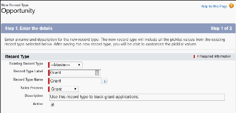

Configure Grants
Find out more about configuring grants.
About Grants
The NPSP Grants feature lets you manage incoming grant deadlines, applications, deliverables,
reporting, and more.
Set Field-Level Security
Make sure that the following grant-related fields on Accounts, Opportunities, and Deliverables are set
to Read Access for profiles that need to view these fields, and Edit Access for profiles that need to edit
them.
Set Object-Level Security
211

Make sure that all profiles that need access to Grants have the appropriate level of access to the
Deliverables object.
Edit the Organization Account Page Layout
Add the Account fields Funding Focus and Grantmaker to the page layout used for Organizations. We
recommend creating a separate section in your page layout for Grantmaking Information, as shown.
Create Grant Stages
NPSP includes five out-of-the-box grant stages. If you installed NPSP directly from the installer on top
of an existing NPSP org, you may need to configure these Stage values yourself. You can also create
new values to best match your organization's grant process.
Create a Grant Sales Process
Here's how to create a grants sales process.
Create a Grant Record Type on Opportunity
Here's how to create a grant record type on Opportunity.
Create a Tab for Deliverables
It can be helpful to see all of your upcoming grant deadlines in one place. Create a new custom object
tab for the Deliverables object so you can see at a glance what's coming down the pike.
Populate Grant Fields on Organization Accounts
Select the Grantmaker field on Organization Account records for businesses or foundations that can
provide Grants to your organization.
About Grants
The NPSP Grants feature lets you manage incoming grant deadlines, applications, deliverables, reporting,
and more.
NPSP Grants uses the following objects:
•
Opportunity (standard object): Track Grant applications and awards.
•
Deliverable (custom object): Manage deadlines and next steps.
FFeeaattuurree RReelleeaassee IInnffoorrmmaattiioonn
This feature was released in NPSP version 3.41 (6/9/2015).
Set Field-Level Security
Make sure that the following grant-related fields on Accounts, Opportunities, and Deliverables are set to
Read Access for profiles that need to view these fields, and Edit Access for profiles that need to edit
them.
Account fields:
•
Funding Focus
•
Grantmaker
212

Opportunity fields:
•
Grant Contract Date
•
Grant Period End Date
•
Grant Period Start Date
•
Grant Requirements Website
•
Is Grant Renewal
•
Next Deliverable Date
•
Previous Grant/Gift Opportunity
•
Program Area(s)
•
Requested Amount
Deliverable fields:
•
Close Date
•
Due Date
•
Opportunity
•
Requirements
To set field access:
11.. Click , then click Setup.
22.. From Setup, enter Profiles in the Quick Find box, then click Profiles.
33.. Click the name of the Profile you want to edit.
44.. In the Field-Level Security section, click View next to the appropriate object.
55.. Make sure Read Access or Edit Access is checked for the listed fields. If not, click Edit and select the
checkbox, then click Save.
Set Object-Level Security
Make sure that all profiles that need access to Grants have the appropriate level of access to the
Deliverables object.
To set object-level security:
11.. From Setup, enter Profiles in the Quick Find box, then click Profiles.
22.. Click the name of the Profile you want to set object-level security for.
33.. Click Edit.
44.. In the Custom Object Permissions section, in the row for Deliverables, click Read (for profiles that
need to view Deliverables) or Edit and Create (for profiles that need to create and edit Deliverables).
55.. Click Save.
Edit the Organization Account Page Layout
Add the Account fields Funding Focus and Grantmaker to the page layout used for Organizations. We
recommend creating a separate section in your page layout for Grantmaking Information, as shown.
213

To edit page layouts:
11.. From Setup, click the Object Manager tab.
22.. In the list of objects, click Account.
33.. Click Page Layouts.
44.. Click Organization Lightning Layout (or whichever layout you use for Organizations).
55.. If the Grantmaking section doesn’t exist, create one by dragging the Section element from the palette
onto the page layout.
••
Name the section Grantmaking Information.
••
Change any other section details as needed and click Save.
66.. Drag the Funding Focus and Grantmaker fields into the Grantmaking Information section on the
layout.
77.. Click Save.
Create Grant Stages
NPSP includes five out-of-the-box grant stages. If you installed NPSP directly from the installer on top of
an existing NPSP org, you may need to configure these Stage values yourself. You can also create new
values to best match your organization's grant process.
The five out-of-the-box grant stages are:
Stage Name API Name Type Probability Forecast Category
Prospecting Prospecting Open 10% Pipeline
LOI Submitted LOI Submitted Open 20% Pipeline
Application Application Open 30% Pipeline
Submitted Submitted
Awarded Awarded Closed/Won 100% Closed
Withdrawn Withdrawn Closed/Lost 0% Omitted
Declined Declined Closed/Lost 0% Omitted
To create new values to match your organization’s grant process:
11.. From Setup, click the Object Manager tab.
22.. In the list of objects, click Opportunity.
33.. Click Fields & Relationships.
44.. Click the Stage field and verify that the configured values match the table above.
55.. Make any adjustments necessary to the Type, Probability, or Forecast Category to match how your
organization handles grants.
Note If your organization uses different stage names, you’ll need to create new picklist values, as
214

managed package picklist value names can’t be edited.
For more information on working with Opportunity stages, see Understand and Customize Sales
Processes and Paths.
Create a Grant Sales Process
Here's how to create a grants sales process.
11.. From Setup, enter Sales Process in the Quick Find box, then select Sales Processes.
22.. Click New and create a Sales Process called Grant that includes the Stage values you configured for
your organization’s Grants process.
For instructions on how to create Sales Processes, see Understand and Customize Sales Processes and
Paths.
Create a Grant Record Type on Opportunity
Here's how to create a grant record type on Opportunity.
11.. From Setup, click the Object Manager tab.
22.. In the list of objects, click Opportunity.
33.. Click Record Types.
44.. If you don’t see a Grant record type, create a new record type with these details:
••
Existing Record Type: Master
••
Record Type Label: Grant
••
Sales Process: Grant
••
Description: Use this record type to track grant applications.
••
Active: selected
••
Enable for Profile: select for any profile that needs access to grants
215

55.. Click Next.
66.. Choose Apply one layout to all profiles, then select Grant Layout.
77.. Click Save.
Create a Tab for Deliverables
It can be helpful to see all of your upcoming grant deadlines in one place. Create a new custom object
tab for the Deliverables object so you can see at a glance what's coming down the pike.
11.. From Setup, enter Tabs in the Quick Find box, then click Tabs.
22.. Under Custom Object Tabs, click New.
33.. Select Deliverable as the object, then select the Tab Style of your choice.
44.. Click Next.
55.. Select the Tab Visibility for each Profile, then click Next.
66.. Deselect Include Tab for all custom apps.
77.. In the row for Nonprofit Success Pack, select Include Tab.
88.. Click Save.
You can now see your Deliverables by clicking the Deliverables tab and choosing the All list view.
Populate Grant Fields on Organization Accounts
Select the Grantmaker field on Organization Account records for businesses or foundations that can
provide Grants to your organization.
Indicate the Grantor's Funding Focus. Ctrl + click to select more than one.
You can edit the picklist values for the Funding Focus field on the Account record to best match your
216

organization's processes.
