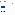
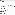
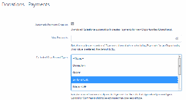

Configure In-Kind Gifts
Find out more about configuring in-kind gifts.
About In-Kind Gifts
The NPSP In-Kind Gifts feature lets you track non-monetary gifts to your organization such as
computers, food, clothing, equipment or professional expertise. Keep In-Kind Gifts separate from cash
donations for accurate reporting.
Create In-Kind Opportunity Stages
Create Opportunity stages for In-Kind Gifts. (If you already have these stages configured, you don't
need to recreate them.)
Create an In-Kind Sales Process
Follow the steps to create a sales process for in-kind gifts.
Create In-Kind Record Type
Follow the steps to create a record type for in-kind gifts.
Choose Picklist Values for In-Kind Record Type
Follow the steps to add picklist values to the in-kind record type.
Set Field-Level Security
Follow the steps to set access to Opportunity fields.
Assign Page Layout to Record Type
If you selected the In-Kind Gift Layout when you created the In-Kind Record Type, you can skip this
step. Otherwise, assign the In-Kind Gift page layout to the In-Kind Gift Record Type.
Add a Lightning Action to Contacts
Add a Lightning Action to Contacts to easily create a new In-Kind Gift from a Contact record.
Configure In-Kind Gift Settings
There are in-kind gift settings related to payments and rollups that you may want to configure.
(Optional) Activate In-Kind Workflow Rule
NPSP provides a Fair Market Value field on the In-Kind Gift Layout. You may want the Fair Market Value
amount reflected as the "Amount" of the In-Kind Gift. This is useful if you want to see the Fair Market
Value of an In-Kind Gift included in the automatic rollup statistics on the Contact or Account.
About In-Kind Gifts
The NPSP In-Kind Gifts feature lets you track non-monetary gifts to your organization such as computers,
food, clothing, equipment or professional expertise. Keep In-Kind Gifts separate from cash donations for
accurate reporting.
NPSP In-Kind Gifts uses the following object:
217

•
Opportunity (standard object): Use an In-Kind Gift record type on Opportunity, and In-Kind sales
process, to track In-Kind Gifts.
FFeeaattuurree RReelleeaassee IInnffoorrmmaattiioonn
This feature was released in NPSP version 3.66 (3/2/2016).
Create In-Kind Opportunity Stages
Create Opportunity stages for In-Kind Gifts. (If you already have these stages configured, you don't need
to recreate them.)
Note Forecast Category is always set to Omitted since the declared value of In-Kind Gifts should not
be reflected in Forecast reporting.
Stage Name API Name Type Probability Forecast Category
In-Kind Not Yet In-Kind Not Yet Open 50% Omitted
Received Received
In-Kind Received In-Kind Received Closed/Won 100% Omitted
Prospecting Prospecting Open 10% Pipeline
Withdrawn Withdrawn Closed/Lost 0% Omitted
To add Opportunity stages:
11.. Click , then click Setup.
22.. Click the Object Manager tab.
33.. In the list of objects, click Opportunity.
44.. Click Fields & Relationships.
55.. Click the Stage field.
66.. In the Opportunity Stages Picklist Values related list, click New.
77.. Enter the Stage Name, API Name, Type, Probability, a Forecast Category as shown in the table.
88.. Click Save.
For more information on how to create Opportunity stages, see Understand and Customize Sales
Processes and Paths.
Create an In-Kind Sales Process
Follow the steps to create a sales process for in-kind gifts.
11.. From Setup, enter Sales Processes in the Quick Find box, then click Sales Processes.
22.. Click New to create an In-Kind Gift sales process.
••
Sales Process Name: In-Kind Gift
218

••
Selected Values: Prospecting, In-Kind Not Yet Received, In-Kind Received, Withdrawn
33.. Click Save.
For more information on configuring Sales Processes, see Understand and Customize Sales Processes
and Paths.
Create In-Kind Record Type
Follow the steps to create a record type for in-kind gifts.
11.. From Setup, click the Object Manager tab.
22.. In the list of objects, click Opportunity.
33.. Click Record Types.
44.. If the In-Kind Gift record type does not already exist, create one with the following details:
••
Existing Record Type: Master
••
Record Type Label: In-Kind Gift
••
Sales Process: In-Kind Gift
••
Description: Use this record type to track In-Kind Gifts such as office
supplies, etc.
••
Active: selected
55.. Next to each profile that can select this Record Type, check the Enable for Profile box.
66.. Click Next.
77.. Select Apply one layout to all profiles, then select the In-Kind Gift Layout.
88.. Click Save.
For more information on creating record types, see Create Record Types.
Choose Picklist Values for In-Kind Record Type
Follow the steps to add picklist values to the in-kind record type.
Once you’ve created the new record type, verify that the In-Kind Type picklist field has the two values,
Goods and Services, selected for the In-Kind record type. Also verify that the Matching Gift Status field
has Potential, Received, and Submitted selected.
To edit picklists for record types:
11.. From Setup, click the Object Manager tab.
22.. In the list of objects, click Opportunity.
33.. Click Record Types.
44.. Click In-Kind Gift.
55.. In the Picklists Available for Editing section, click Edit next to In-Kind Type.
66.. Make sure that Goods and Services are listed as Selected Values.
77.. Click Save.
219

88.. Click Edit next to Matching Gift Status.
99.. Make sure that Potential, Received, and Submitted are listed as Selected Values.
1100.. Click Save.
Set Field-Level Security
Follow the steps to set access to Opportunity fields.
Check that the relevant profiles and permission sets have access to the following Opportunity fields:
•
Fair Market Value
•
In-Kind Description
•
In-Kind Donor Declared Value
•
In-Kind Type
To set field access:
11.. From Setup, enter Profiles in the Quick Find box, then click Profiles.
22.. Click the name of the Profile you want to set field-level security for.
33.. In the Field-Level Security section, click View next to Opportunity.
44.. Make sure the profile has the correct level of access to each of the In-Kind Gift fields. If not, click Edit
and select the checkbox, then click Save.
For more information on setting field-level security, see Verify Access for a Particular Field.
Assign Page Layout to Record Type
If you selected the In-Kind Gift Layout when you created the In-Kind Record Type, you can skip this step.
Otherwise, assign the In-Kind Gift page layout to the In-Kind Gift Record Type.
11.. From Setup, click the Object Manager tab.
22.. In the list of objects, click Opportunity.
33.. Click Record Types.
44.. Click Page Layout Assignment.
55.. Click Edit Assignment.
66.. In the In-Kind Gift column, make sure the In-Kind Gift Layout is selected for the appropriate profiles.
77.. Click Save.
Add a Lightning Action to Contacts
Add a Lightning Action to Contacts to easily create a new In-Kind Gift from a Contact record.
11.. From Setup, click the Object Manager tab.
22.. In the list of objects, click Contact.
33.. Click Buttons, Links, and Actions.
44.. Click New Action.
220

55.. Fill in the following details:
••
Action Type: Create a Record
••
Target Object: Opportunity
••
Relationship Field: Primary Contact
••
Record Type: In-Kind Gift
••
Standard Label Type: New [Record Type]
••
Name: NewInKind
66.. Deselect Create Feed Item (unless you want a Chatter post each time a user creates an In-Kind Gift
with this Action).
77.. Click Save.
88.. In the Page Layout editor, add the following fields to the New In-Kind Gift quick action layout:
••
Opportunity Name
••
Close Date
••
Stage
••
In-Kind Type
••
In-Kind Description
••
Optionally, remove the Next Step field
99.. Click Save. Next, set default values for the Close Date, Opportunity Name, and Stage fields.
1100.. In the Predefined Field Values list, click New, and enter these values:
••
Field: Close Date
••
Value: Today()
1111.. Click Save.
1122.. In the Predefined Field Values list, click New, and enter these values:
••
Field: Opportunity Name
••
Value: Contact.FirstName & " " & Contact.LastName & " In-Kind " &
TEXT(MONTH(TODAY())) & "/" & TEXT(DAY(TODAY())) & "/" & TEXT(YEAR(TODAY()))
1133.. Click Save.
1144.. In the Predefined Field Values list, click New, and enter these values:
••
Field: Stage
••
Specific Value: In-Kind Received
1155.. Click Save.
Finally, add the Lightning Action to the Contact Lightning page layout:
11.. From Setup, click the Object Manager tab.
22.. In the list of objects, click Contact.
33.. Click Page Layouts.
44.. Click the Contact Lightning Layout.
55.. In the palette, click Mobile & Lightning Actions.
66.. Drag the New In-Kind Gift Lightning Action to the Salesforce Mobile and Lightning Experience Actions
section of the page layout.
77.. Click Save.
221

Configure In-Kind Gift Settings
There are in-kind gift settings related to payments and rollups that you may want to configure.
DDiissaabbllee PPaayymmeennttss ffoorr IInn--KKiinndd GGiiffttss
Since there is no payment of actual funds for an In-Kind Gift, we recommend enabling a setting that
prevents the automatic creation of Payment records for In-Kind Gifts. If you started with an NPSP Trial
after August 25, 2020, this is already done for you.
11.. Click the NPSP Settings tab. If you don't see the tab, find it in the App Launcher ( ).
22.. Click Donations | Payments.
33.. Click Edit.
44.. Select In-Kind Gift in the Excluded Opp Record Types section.
55.. Click Save.
IInn--KKiinndd GGiiffttss iinn AAccccoouunntt aanndd CCoonnttaacctt RRoolllluuppss
If needed, you can set up your rollups to exclude In-Kind Gifts.
If you're using Customizable Rollups and don't want In-Kind giving reflected in rollups:
11.. Click the NPSP Settings tab. If you don't see the tab, find it in the App Launcher ( ).
22.. Click Donations | Customizable Rollups.
33.. Click Configure Customizable Rollups.
44.. Click View Filter Groups.
55.. Either click New Filter Group or click then click Edit to modify an existing filter group.
66.. Add a filter rule with these values:
••
Object = Opportunity
••
Field = Record Type ID
222

••
Operator = Not In List
••
Value = In-Kind Gift
77.. Click Save, then Save the filter group. You can now apply this filter group to Customizable Rollups that
shouldn't include In-Kind Gift Opportunities.
If you're not using Customizable Rollups and don't want In-Kind giving reflected in Contact and Account
rollups:
11.. Click the NPSP Settings tab. If you don't see the tab, find it in the App Launcher ( ).
22.. Click Donations | Donor Statistics.
33.. Click Edit.
44.. Select In-Kind Gift in the Opp RecTypes Excluded for Account Rollup and/or Opp RecTypes
Excluded for Contact Rollup sections.
55.. Click Save.
If you do want In-Kind giving reflected in Contact and Account rollups, check the out-of-box filter groups
that mention record types and make sure that they don't include filter rules that exclude In-Kind Gifts.
Additionally, make sure the Amount and Fair Market Value fields are populated on In-Kind opportunities.
Activate the Opportunity Copy FMV to Amount workflow rule to automatically copy the Fair Market Value
to the Amount field.
(Optional) Activate In-Kind Workflow Rule
NPSP provides a Fair Market Value field on the In-Kind Gift Layout. You may want the Fair Market Value
amount reflected as the "Amount" of the In-Kind Gift. This is useful if you want to see the Fair Market
Value of an In-Kind Gift included in the automatic rollup statistics on the Contact or Account.
You can activate a workflow rule that automatically copies the Fair Market Value to the Amount field if
the Amount field is left blank.
To activate this workflow rule:
11.. From Setup, enter Workflow Rules in the Quick Find box, then click Workflow Rules.
22.. Click Activate next to the Opportunity Copy FMV to Amount workflow rule.
