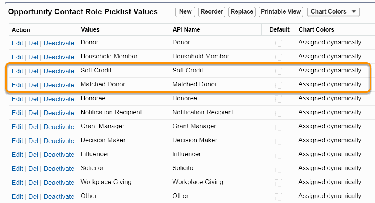
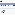
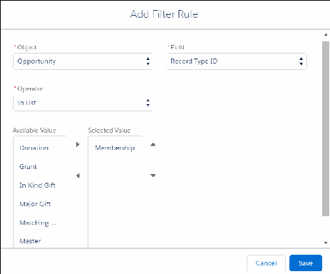
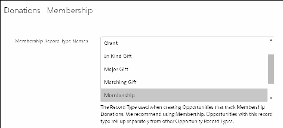
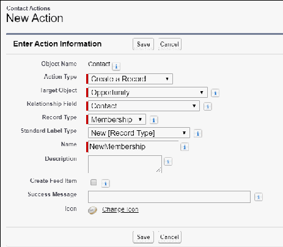
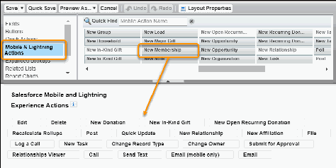

Configure Memberships
Learn how to manage memberships in NPSP.
About Memberships
NPSP Memberships represent an individual or household giving a donation to join a group or
organization, much like a subscription. It's up to the organization to decide the length and level of
membership based on the donation amount.
Create Membership Opportunity Stages
Create these Opportunity stages for Memberships. (If you already have these stages configured, you
don't need to recreate them.)
Create an Opportunity Membership Record Type
Steps for creating a record type on Opportunities to manage your memberships.
Assign Page Layout to Record Type
Edit the page layout assignments so that the Membership Record Type is using the Membership Page
Layout for all appropriate profiles.
Configure Membership Record Type For Rollups
Where you select the Membership record type for rollups depends on if you're using Customizable
Rollups, legacy out-of-box NPSP rollups, or User Defined Rollups.
Add a Lightning Action to Contacts
Add a Lightning Action to Contacts to easily create a new Membership from a Contact record.
(Optional) Set a Grace Period
After a Membership expires, the Membership Status is set to Grace Period. This is the period of time
(in days) before the Membership Status is set to Expired. You can choose how long you want the grace
period to last. The default is 30 days.
(Optional) Customize Member Levels
NPSP includes these member levels: Gold, Silver, and Bronze. You may want to customize these names
or add more values. You can do so by editing the picklist values for the Member Level field on
229

Opportunities.
About Memberships
NPSP Memberships represent an individual or household giving a donation to join a group or
organization, much like a subscription. It's up to the organization to decide the length and level of
membership based on the donation amount.
NPSP Memberships uses the following object:
•
Opportunity (standard object): Use a custom Membership record type on Opportunity to track
memberships.
FFeeaattuurree RReelleeaassee IInnffoorrmmaattiioonn
This feature was released prior to NPSP version 3.0. If this feature isn't configured in your org, complete
these steps. To find your installation date, see Find Your Installation Date.
Create Membership Opportunity Stages
Create these Opportunity stages for Memberships. (If you already have these stages configured, you
don't need to recreate them.)
Stage Name API Name Type Probability Forecast Category
Prospecting Prospecting Open 10% Pipeline
Pledged Pledged Open 10% Pipeline
Closed/Lost Closed/Lost Closed/Lost 0% Omitted
Closed/Won Closed/Won Closed/Won 100% Closed
Withdrawn Withdrawn Closed/Lost 0% Omitted
Posted Posted Closed/Won 100% Closed
To add Opportunity stages:
11.. Click , then click Setup.
22.. Click the Object Manager tab.
33.. In the list of objects, click Opportunity.
44.. Click Fields & Relationships.
55.. Click the Stage field.
66.. In the Opportunity Stages Picklist Values related list, click New.
77.. Enter the Stage Name, API Name, Type, Probability, a Forecast Category as shown in the table.
88.. Click Save.
230

For more information on how to create Opportunity stages, see Understand and Customize Sales
Processes and Paths.
Create an Opportunity Membership Record Type
Steps for creating a record type on Opportunities to manage your memberships.
11.. From Setup, click the Object Manager tab.
22.. In the list of objects, click Opportunity.
33.. Click Record Types.
44.. Click New and create a new record type with these details:
••
Record Type Label: Membership
••
Record Type Name: Membership
••
Sales Process: Donation
••
Description: Use this record type to record memberships
••
Active: selected
••
Enable for Profile: Select for any profile that needs access to memberships
••
Page Layout: Membership Layout
55.. Click Save.
For more information on creating record types, see Create Record Types.
Assign Page Layout to Record Type
Edit the page layout assignments so that the Membership Record Type is using the Membership Page
Layout for all appropriate profiles.
11.. From Setup, click the Object Manager tab.
22.. In the list of objects, click Opportunity.
33.. Click Record Types.
44.. Click Page Layout Assignment.
55.. Click Edit Assignment.
66.. In the Membership column, make sure the Membership Layout is selected for the appropriate
profiles.
77.. Click Save.
Configure Membership Record Type For Rollups
Where you select the Membership record type for rollups depends on if you're using Customizable
Rollups, legacy out-of-box NPSP rollups, or User Defined Rollups.
If you're using Customizable Rollups, set the Membership Record Type in a filter group and then apply it
231

to the rollups themselves.
11.. Click the NPSP Settings tab. If you don't see the tab, find it in the App Launcher ( ).
22.. Click Donations | Customizable Rollups.
33.. Click Configure Customizable Rollups.
44.. Click View Filter Groups.
55.. Depending on how NPSP was installed, your org may already have a filter group called Memberships:
Won. If so, click Edit on the Memberships:Won filter group. Otherwise, click New to create a new filter
group.
66.. Depending on how NPSP was installed, the Memberships:Won filter group may already have a rule to
filter on record type. If not, or if you've created a new filter group, add a rule with these values:
••
Object = Opportunity
••
Field = Record Type ID
••
Operator = In List
••
Value = Membership (or whichever Record Type you use for Memberships)
Now you can use the Membership filter group in any Customizable Rollup for Memberships.
If you're using legacy out-of-box NPSP rollups or User Defined Rollups, set the Membership record type
232

in NPSP Settings:
11.. In the NPSP app, click the NPSP Settings tab.
Note If you don't see the NPSP Settings tab in your org, you can find it in the App Launcher.
22.. Click Donations | Membership.
33.. Click Edit.
44.. In the Membership Record Type Names menu, select Membership.
55.. Click Save.
Add a Lightning Action to Contacts
Add a Lightning Action to Contacts to easily create a new Membership from a Contact record.
11.. From Setup, click the Object Manager tab.
22.. In the list of objects, click Contact.
33.. Click Buttons, Links, and Actions.
44.. Click New Action.
55.. Fill in the following details:
••
Action Type: Create a Record
••
Target Object: Opportunity
••
Relationship Field: Primary Contact
••
Record Type: Membership
••
Standard Label Type: New [Record Type]
••
Name: NewMembership
233

66.. Deselect Create Feed Item (unless you want a Chatter post each time a user creates a Membership
with this Action).
77.. Click Save.
88.. In the Page Layout editor, add the following fields to the New Membership Quick Action layout:
••
Opportunity Name
••
Close Date
••
Stage
••
Amount
••
Member Level
••
Membership Start Date
••
Membership End Date
••
Membership Origin
••
Optionally, remove the Next Step field
99.. Click Save. Next you’ll set default values for the Close Date and Opportunity Name fields.
1100.. In the Predefined Field Values list, click New, then enter the following values:
••
Field: Close Date
••
Value: Today()
1111.. Click Save.
234

1122.. In the Predefined Field Values list, click New, then enter the following values:
••
Field Name: Opportunity Name
••
Formula Value: Contact.FirstName & " " & Contact.LastName & " Membership " &
TEXT(MONTH(TODAY())) & "/" & TEXT(DAY(TODAY())) & "/" & TEXT(YEAR(TODAY()))
1133.. Click Save.
Finally, add the Lightning Action to the Contact Lightning page layout:
11.. From Setup, click the Object Manager tab.
22.. In the list of objects, click Contact.
33.. Click Page Layouts.
44.. Click Contact Layout.
55.. In the palette, click Mobile & Lightning Actions.
66.. Drag the New Membership Lightning Action to the Salesforce Mobile and Lightning Experience
Actions section of the Page Layout.
77.. Click Save.
(Optional) Set a Grace Period
After a Membership expires, the Membership Status is set to Grace Period. This is the period of time (in
days) before the Membership Status is set to Expired. You can choose how long you want the grace
period to last. The default is 30 days.
11.. Click the NPSP Settings tab. If you don't see the tab, find it in the App Launcher ( ).
22.. Click Donations | Membership.
33.. Click Edit, and enter a value in the Membership Grace Period field.
44.. Click Save.
235

(Optional) Customize Member Levels
NPSP includes these member levels: Gold, Silver, and Bronze. You may want to customize these names or
add more values. You can do so by editing the picklist values for the Member Level field on
Opportunities.
