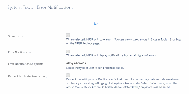
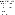
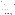

Configure NPSP Features
Articles for Salesforce admins about how to configure all of the NPSP features.
Feature Configuration Overview
NPSP introduces many new features over time. If you aren't starting from a new Trial, you have to
enable or configure those features before you can use them. And as an admin, you have control over
what to implement in your org (and when).
Find Your NPSP Installation Date and Version
With Nonprofit Success Pack, updates are automatically pushed to your org, but many new features
require additional setup. If you installed NPSP prior to the most recent release, you may need to
configure the latest features.
Configure Acknowledge Donations by Email
66

Configure Salesforce to send donation acknowledgment emails automatically when you enter gifts in
NPSP.
Configure Duplicate Detection and NPSP Contact Merge
Set up duplicate detection and contact merge to keep your contacts organized and up-to-date.
Configure Address Management
Learn how to configure address management features including address verification, seasonal
addresses, and bad address management.
Configure Automated and Manual Soft Credits
Find out more about configuring automated and manual soft credits.
Configure Batch Data Import
Find out more about configuring batch data import.
Configure Batch Numbers for Donations
For audit purposes, use auto-generated batch numbers to track Opportunity and Payment records
created in batches.
Configure Campaigns
Configure campaigns so that they combine data from different sources and determine the success of
the call to action.
Configure Customizable Rollups
Configure NPSP versions older than 3.155 for customizable rollups.
Customizable Rollups Overview
Rolling up donor data is an essential part of fundraising with the Nonprofit Success Pack. And, since
every nonprofit is unique, it is especially important that you're able to roll up exactly the data you
need, and to the right records.
Configure NPSP Data Importer
Prepare your organization for importing data from spreadsheets by following these NPSP Data
Importer set up instructions.
Configure Donation Allocations
Find out more about donation allocations.
Configure Engagement Plans
Find out more about configuring engagement plans.
Configure Levels
Learn about NPSP Levels, how to create new level fields, how to secure and provide access to the Level
object and fields, and how to add value to target picklists.
Configure Gift Entry
Prepare your NPSP Salesforce org to add or edit donations and related information in one entry form.
Configure Grants
Find out more about configuring grants.
Configure In-Kind Gifts
Find out more about configuring in-kind gifts.
Configure Leads
Configure leads by mapping custom lead fields and setting the default action for creating
67

opportunities from leads.
Configure Matching Gifts
Find out more about configuring matching gifts.
Configure Memberships
Learn how to manage memberships in NPSP.
Configure Tribute Gifts
Make customizations to page layouts and picklists so that NPSP tributes work properly.
Customize Opportunity (Donation) Names
Create your own custom Opportunity Names using any fields from the Opportunity itself or fields from
related records.
Configure Opportunity Payments in NPSP
Set up and manage Opportunities, Payments, and Refunds in Nonprofit Success Pack.
Configure Recurring Donations
Learn how to set security permissions, deploy components, and configure settings to use Recurring
Donations in your org.
Manage Relationships Settings
This administrator-level document explains Relationships settings and how they affect Relationship
behavior.
Configure the Reports & Dashboards Package
After you download the NPSP Reports package, configure it to meet your needs.
Feature Configuration Overview
NPSP introduces many new features over time. If you aren't starting from a new Trial, you have to enable
or configure those features before you can use them. And as an admin, you have control over what to
implement in your org (and when).
Note Watch the Nonprofit Salesforce How-To Series video: Enable new NPSP Features.
Alphabetical List of Features
Review a list of the NPSP features in alphabetical order and learn when each were added. If your org
was created before the feature's release data, you need to configure the feature before using it.
Features by Release Date
Review a list of the NPSP features and learn when each were added. If your org was created before the
feature's release data, you need to configure the feature before using it.
Alphabetical List of Features
Review a list of the NPSP features in alphabetical order and learn when each were added. If your org was
created before the feature's release data, you need to configure the feature before using it.
Important This article lists NPSP features that require configuration by a system administrator. It is
68

not a comprehensive list of all features available in NPSP.
Feature Name Description Version Release Date
Email acknowledgment 3.46 7/9/2015
Acknowledge Donations
letters to donors, either
by Email
in a batch, or as one-
offs for individual gifts.
Address Management Record and keep a Prior to 3.0 NA
history of different types
of addresses for
Accounts, such as
home, work, and
seasonal addresses.
Advanced Mapping Import to fields on 3.161 9/4/2019
standard objects,
Nonprofit Success Pack
objects, your own
custom objects, or even
objects from a managed
package as long as
they're directly related
to Accounts, Contacts,
or Opportunities.
Automated and Manual Configure NPSP to 3.63 2/3/2016
Soft Credits automatically assign
soft credit Opportunity
Contact Roles based on
Relationships,
Affiliations, and
Opportunity fields.
Batch Data Import Use advanced import 3.108 9/14/2017
strategies to import
data in batches.
Customizable Rollups Create highly 3.155 5/15/2019
customized rollups that
roll up either data from
Opportunities,
Payments, or Soft
Credits (including
Partial Soft Credits).
69

Feature Name Description Version Release Date
Data Importer Import your data into 3-1.20 10/1/2014
NPSP.
Donation Allocations Define as many General 3.24 11/17/2014
Accounting Units
(GAUs) as you need to
match your chart of
accounts. Enter and
track donations as parts
of a GAU — either as a
percentage of the
donation amount, or as
a specific dollar
amount.
Engagement Plans Create a set of tasks 3.81 9/14/2016
(literally a “plan”) that
helps you engage with
your constituents. Use
Engagement Plans for
major gifts, volunteer
management, grant-
making, client
management, and
sponsor management.
Gift Entry Create consistent form 3.171 3/4/2020
templates that you can
use to enter gifts into
NPSP, either individually
or in batches.
Grants Manage incoming grant 3.41 6/9/2015
deadlines, applications,
deliverables, reporting,
and more.
Household Naming When you create a new Prior to 3.0 NA
Contact in Salesforce,
NPSP creates a new
Household Account
record and
automatically names it
based on the naming
convention you choose.
70

Feature Name Description Version Release Date
In-Kind Gifts Track In-Kind Gifts to 3.66 3/2/2016
your organization such
as computers, food,
clothing, equipment, or
professional expertise.
Keep In-Kind Gifts
separate from cash
donations for accurate
reporting.
Levels Track your constituents' 3.81 9/14/2016
level of commitment
and engagement based
on criteria such as total
gifts or number of hours
volunteered.
Matching Gifts Track a donation that a 3.63 2/3/2016
corporation made as a
match for a donation
from one of their
employees.
Memberships Memberships in NPSP Prior to 3.0 NA
represent an individual
or household giving a
donation to join a group
or organization, much
like a subscription.
Decide the length and
level of membership
based on the donation
amount.
Recurring Donations Tracks gifts that donors 3.175 4/29/2020
(Enhanced) have pledged over a
period of time.
Recurring Donations Track gifts that donors Prior to 3.0 NA
(Legacy) have pledged over a
period of time.
Reports & Dashboards Community-contributed 3.90 2/14/2017
Package reports and dashboards
covering donors and
their giving history,
71

Feature Name Description Version Release Date
grants, memberships,
campaign ROI, and
more. Includes 67
reports and 4
dashboards.
Relationships Control how Prior to 3.0 NA
Relationships behave in
the Nonprofit Success
Pack. Relationships
connect one Contact to
another.
Tribute Opportunities Note the honorees for a 3.61 1/6/2016
donation, and the
constituents who
should be notified when
a donation is received.
If you're looking for additional features that aren't included in NPSP, check out the AppExchange.
Features by Release Date
Review a list of the NPSP features and learn when each were added. If your org was created before the
feature's release data, you need to configure the feature before using it.
Feature Name Description Version Release Date
Address Management Record and keep a Prior to 3.0 NA
history of different types
of addresses for
Accounts, such as
home, work, and
seasonal addresses.
Household Naming When you create a new Prior to 3.0 NA
Contact in Salesforce,
NPSP creates a new
Household Account
record and
automatically names it
based on the naming
convention you choose.
Memberships Memberships in NPSP Prior to 3.0 NA
72

Feature Name Description Version Release Date
represent an individual
or household giving a
donation to join a group
or organization, much
like a subscription.
Decide the length and
level of membership
based on the donation
amount.
Recurring Donations Track gifts that donors Prior to 3.0 NA
(Legacy) have pledged over a
period of time.
Relationships Control how Prior to 3.0 NA
Relationships behave in
the Nonprofit Success
Pack. Relationships
connect one Contact to
another.
Data Importer Import your data into 3-1.20 10/1/2014
NPSP.
Donation Allocations Define as many General 3.24 11/17/2014
Accounting Units
(GAUs) as you need to
match your chart of
accounts. Enter and
track donations as parts
of a GAU — either as a
percentage of the
donation amount, or as
a specific dollar
amount.
Grants Manage incoming grant 3.41 6/9/2015
deadlines, applications,
deliverables, reporting,
and more.
Email acknowledgment 3.46 7/9/2015
Acknowledge Donations
letters to donors, either
by Email
in a batch, or as one-
offs for individual gifts.
73

Feature Name Description Version Release Date
Tribute Opportunities Note the honorees for a 3.61 1/6/2016
donation, and the
constituents who
should be notified when
a donation is received.
Automated and Manual Configure NPSP to 3.63 2/3/2016
Soft Credits automatically assign
soft credit Opportunity
Contact Roles based on
Relationships,
Affiliations, and
Opportunity fields.
Matching Gifts Track a donation that a 3.63 2/3/2016
corporation made as a
match for a donation
from one of their
employees.
In-Kind Gifts Track In-Kind Gifts to 3.66 3/2/2016
your organization such
as computers, food,
clothing, equipment, or
professional expertise.
Keep In-Kind Gifts
separate from cash
donations for accurate
reporting.
Engagement Plans Create a set of tasks 3.81 9/14/2016
(literally a “plan”) that
helps you engage with
your constituents. Use
Engagement Plans for
major gifts, volunteer
management, grant-
making, client
management, and
sponsor management.
Levels Track your constituents' 3.81 9/14/2016
level of commitment
and engagement based
on criteria such as total
74

Feature Name Description Version Release Date
gifts or number of hours
volunteered.
Reports & Dashboards Community-contributed 3.90 2/14/2017
Package reports and dashboards
covering donors and
their giving history,
grants, memberships,
campaign ROI, and
more. Includes 67
reports and 4
dashboards.
Batch Data Import Use advanced import 3.108 9/14/2017
strategies to import
data in batches.
Customizable Rollups Create highly 3.155 5/15/2019
customized rollups that
roll up either data from
Opportunities,
Payments, or Soft
Credits (including
Partial Soft Credits).
Advanced Mapping Import to fields on 3.161 9/4/2019
standard objects,
Nonprofit Success Pack
objects, your own
custom objects, or even
objects from a managed
package as long as
they're directly related
to Accounts, Contacts,
or Opportunities.
Gift Entry Create consistent form 3.171 3/4/2020
templates that you can
use to enter gifts into
NPSP, either individually
or in batches.
Recurring Donations Tracks gifts that donors 3.175 4/29/2020
(Enhanced) have pledged over a
period of time.
75

Find Your NPSP Installation Date and Version
With Nonprofit Success Pack, updates are automatically pushed to your org, but many new features
require additional setup. If you installed NPSP prior to the most recent release, you may need to
configure the latest features.
Find Your NPSP Installation Date
11.. From Setup, enter Installed Packages in the Quick Find box, then click Installed Packages.
22.. Click Nonprofit Success Pack.
Note If you don't see Nonprofit Success Pack in your list of Installed Packages, you're either using
an earlier version of NPSP, or no version has been installed. For more information see Which
Version of NPSP Am I Using.
33.. On the package details page, find the Installed By field. The date listed is your original installation
date.
Find Your Original Installation Version
11.. Follow the steps in Find Your NPSP Installation Date above.
22.. Make a note of the installation date in the Installed By field. In the example above, it's 3/18/2019.
Note The version listed in the First Installed Version Number field may not be accurate. Use the
date in the Installed By field to find your original installation version, as explained in the following
steps.
33.. Navigate to the NPSP Release Announcements page.
44.. Select Latest Posts in the Sort By picklist:
55.. Scroll through the messages to find the version that was pushed to production orgs closest to (but not
after) your installation date. This will be the version that was originally installed in your org. In this
example, it's version 3.149:
Note For a list of NPSP features with the version and date they were released, see Feature
Configuration Overview.
Note See the latest NPSP release version number and date in the NPSP GitHub repository.
76

