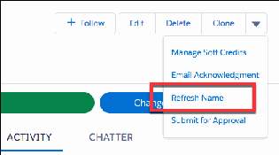
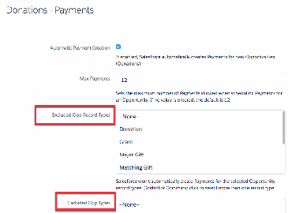

Configure Opportunity Payments in NPSP
Set up and manage Opportunities, Payments, and Refunds in Nonprofit Success Pack.
Opportunities Automatically Create Payment Records
In Nonprofit Success Pack, when you save a new Opportunity, related Payment records are created.
This is true even for single-payment donations (that is, donations paid in a "lump sum"). When you
create a new Opportunity and set the Stage field to Posted, NPSP creates a Payment for the full
242

donation amount and records the donation as "paid in full".
Map Opportunity Fields to Payment Fields
Use Payment Mappings to automatically copy values from Opportunity record fields to Payments,
whenever you create a new Payment or update an open Opportunity. You may want to do this so that
details from the Opportunity record also appear in the Payment record for easy reference or billing.
Salesforce executes the mapping for automatically added Payments, as well as Payments created
through the Payment scheduler. Manually created single Payments will not use the mappings defined
here.
Disable Payments
Disable creating Payments for all Opportunities or limit creating Payments for specific Opportunity
type or record type.
Create Missing Payments
If you disable and re-enable Payments, some of your Opportunities may be missing Payment records.
You can run a batch process to create the Payment records.
Set Opportunity Stage for When Fully Paid
Tell Salesforce what Stage you want an Opportunity to be when all the payments are paid. NPSP Data
Importer and related features like Gift Entry and Elevate connector also use this Stage when you don't
otherwise specify an Opportunity's stage.
Set Up Refunds
Sometimes mistakes happen. Fix a donation entry error or help a donor in need with a refund. To be
able to refund donations, first set up NPSP to issue refunds.
Opportunities Automatically Create Payment Records
In Nonprofit Success Pack, when you save a new Opportunity, related Payment records are created. This
is true even for single-payment donations (that is, donations paid in a "lump sum"). When you create a
new Opportunity and set the Stage field to Posted, NPSP creates a Payment for the full donation amount
and records the donation as "paid in full".
You can override this behavior on an individual Opportunity by selecting the Do Not Automatically
Create Payment checkbox when you create the Opportunity. You can also exclude specific Opportunity
record types from automatic Payments in NPSP Settings.
You can turn off automatic Payment behavior entirely, or for specific Opportunity record types or
Opportunity types. For more information, see Disable Payments.
Map Opportunity Fields to Payment Fields
Use Payment Mappings to automatically copy values from Opportunity record fields to Payments,
whenever you create a new Payment or update an open Opportunity. You may want to do this so that
details from the Opportunity record also appear in the Payment record for easy reference or billing.
Salesforce executes the mapping for automatically added Payments, as well as Payments created
through the Payment scheduler. Manually created single Payments will not use the mappings defined
here.
243

Payment mapping requires that you have two fields (one on Opportunity, one on Payment) of a
matching type in order to create a mapping between them. When you create a mapping, information
from an Opportunity field displays in the mapped Payment field, but not vice versa. In other words,
information from Opportunity fields can appear in Payments but not the other way around.
11.. Click the NPSP Settings tab. If you don't see the tab, find it in the App Launcher ( ).
22.. Click Donations | Payment Mappings.
33.. Click New Payment Field Mapping.
44.. In the Opportunity Field list, select the Opportunity object field you want to map from. Once selected,
all the fields of the matching data type on the Payments object are shown in the Payment Field list.
Note You can't map an Opportunity field that has the same name as the Payment object
(payment__c).
55.. From the Payment Field list, select the Payment field you want to map to.
In the example below, the administrator has created a new field in the Opportunity object called
Payment Type. When you select Payment Type from the Opportunity Field list, you can choose any
field on the Payment object that uses the same data type.
66.. Click the Create Custom Mapping button to complete your mapping.
The next time a payment is created in this organization, the Payment Type from the Opportunity is saved
in the Payment Method field in the Payment details.
Disable Payments
Disable creating Payments for all Opportunities or limit creating Payments for specific Opportunity type
or record type.
DDiissaabbllee PPaayymmeenntt CCrreeaattiioonn ffoorr AAllll OOppppoorrttuunniittiieess
To disable automatic Payment creation for all Opportunities:
11.. Click the NPSP Settings tab. If you don't see the tab, find it in the App Launcher ( ).
22.. Click Donations | Payments.
33.. Click Edit.
44.. Deselect Automatic Payment Creation.
55.. Save your work.
DDiissaabbllee PPaayymmeennttss ffoorr SSppeecciifificc OOppppoorrttuunniittyy TTyyppeess aanndd RReeccoorrdd TTyyppeess
You can exclude specific Opportunity record types from automatic Payment creation. You can also
exclude specific Opportunity types (as specified by the Type picklist.)
244

11.. Click the NPSP Settings tab. If you don't see the tab, find it in the App Launcher ( ).
22.. Click Donations | Payments.
33.. Click Edit.
44.. To disable automatic Payment creation for specific record types, select the record types in the Exclude
Opp Record Types field. To disable automatic Payment creation for specific Opportunity types, select
the types in the Excluded Opp Types field.
55.. Save your work
Create Missing Payments
If you disable and re-enable Payments, some of your Opportunities may be missing Payment records.
You can run a batch process to create the Payment records.
For more information, see Create Missing Payments.
Set Opportunity Stage for When Fully Paid
Tell Salesforce what Stage you want an Opportunity to be when all the payments are paid. NPSP Data
Importer and related features like Gift Entry and Elevate connector also use this Stage when you don't
otherwise specify an Opportunity's stage.
11.. Click the NPSP Settings tab. If you don't see the tab, find it in the App Launcher ( ).
22.. Click Donations | Payments.
245

33.. Edit the setting, and set the value in Opportunity Stage for When Fully Paid.
44.. Save your work.
Set Up Refunds
Sometimes mistakes happen. Fix a donation entry error or help a donor in need with a refund. To be able
to refund donations, first set up NPSP to issue refunds.
11.. Grant your users Read and Edit access to these fields on the custom Payment object:
••
Debit Type
••
Original Payment
••
Payment Amount
22.. Give your users access to the npsp.PMT_RefundController Apex class.
aa.. From Setup, in the Quick Find box, enter Profiles, then click Profiles.
bb.. Click the name of the profile you want to edit.
cc.. Click Apex Class Access.
dd.. Click Edit.
ee.. Add npsp.PMT_RefundController to the Enabled Apex Classes list.
ff.. Save your changes.
33.. Add the refund option to your Payment pages.
aa.. From the object management settings for the Payment Custom Object, go to Page Layouts.
bb.. Click Payment Layout.
cc.. Find Mobile & Lightning Actions in the palette and drag the Refund action to the Salesforce Mobile
and Lightning Experience Actions panel.
dd.. Save your layout.
