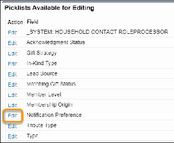

Configure Tribute Gifts
Make customizations to page layouts and picklists so that NPSP tributes work properly.
About Tribute Gifts
NPSP Tribute Gifts feature allows you to track data about a donation given in honor of or in memory of
someone, such as who the honoree is, and the constituents who should be notified about the
donation.
Set Field-Level Security
Make sure you have access to the tribute-related fields on Opportunity.
Configure Picklist Values
Add values to the Notification Preference and Tribute Type picklists on the Donation record type.
Set up Automatic Opportunity Contact Roles
You can have the Nonprofit Success Pack automatically create contact roles when you fill in the
Honoree Contact or Notification Contact fields. Be aware of how the contact role logic works when a
contact is eligible for more than one role (such as Household Member, or other soft credit).
About Tribute Gifts
NPSP Tribute Gifts feature allows you to track data about a donation given in honor of or in memory of
someone, such as who the honoree is, and the constituents who should be notified about the donation.
FFeeaattuurree RReelleeaassee IInnffoorrmmaattiioonn
This feature was released in NPSP version 3.61 (1/6/2016).
Note Tribute Gifts uses soft credits in NPSP. Before you configure Tribute Gifts, make sure you have
configured soft credits in your org. Learn more in Configure Automated and Manual Soft Credits.
Set Field-Level Security
Make sure you have access to the tribute-related fields on Opportunity.
Verify access for the following Opportunity fields for each profile:
•
Honoree Contact
•
Honoree Information
236

•
Honoree Name
•
Notification Message
•
Notification Preference
•
Notification Recipient Contact
•
Notification Recipient Email
•
Notification Recipient Information
•
Notification Recipient Name
•
Tribute Notification Date
•
Tribute Notification Status
•
Tribute Type
To check field access:
11.. From Setup, enter Profiles in the Quick Find box, then click Profiles.
22.. Click the name of the Profile you want to set field-level security for.
33.. In the Field-Level Security section, click View next to Opportunity.
44.. Make sure the profile has the correct level of access to the Tribute fields. If not, click Edit and select
the checkbox, then click Save.
For more information on setting field-level security, see Verify Access for a Particular Field.
Configure Picklist Values
Add values to the Notification Preference and Tribute Type picklists on the Donation record type.
11.. From Setup, click the Object Manager tab.
22.. In the list of objects, click Opportunity.
33.. Click Record Types.
44.. Click Donation.
55.. Click Edit next to Notification Preferences under Picklists Available for Editing.
237

66.. Add all values from the Available Values to the Selected Values.
77.. Click Save.
88.. Repeat the above steps for the Tribute Type picklist.
For more information on how to add picklist values to record types, see Create Record Types.
Set up Automatic Opportunity Contact Roles
You can have the Nonprofit Success Pack automatically create contact roles when you fill in the Honoree
Contact or Notification Contact fields. Be aware of how the contact role logic works when a contact is
eligible for more than one role (such as Household Member, or other soft credit).
Learn more in NPSP Logic for Creating Opportunity Contact Roles.
11.. Go to the NPSP Settings tab, click Donations | Contact Roles.
22.. Enter Honoree for Honoree Opportunity Contact Role and Notification Recipient for
Notification Recipient Opp Contact Role. Leaving these settings blank disables automatic contact role
creation for these fields.
Note If you don't see the NPSP Settings tab in your org, you can find it in the App Launcher.
238

For these roles to apply as soft credits, there is some setup required. If you're using Customizable
Rollups, you set the Contact Roles in a filter group and apply them to the rollups themselves. Learn more
in Customizable Rollups Overview and Configure Soft Credit Rollups.
Customize Opportunity (Donation) Names
Create your own custom Opportunity Names using any fields from the Opportunity itself or fields from
related records.
Note Watch the Nonprofit Salesforce How-To Series video about Custom Opportunity Naming.
Create a Custom Opportunity Name
To use a custom Opportunity name or a a different naming format from default naming convention,
create a custom name.
Opportunity Name Examples
When creating your own Opportunity Names, simply add any Opportunity field to the list of field
names.
Edit a Custom Opportunity Name
Change a custom Opportunity Name by editing it in NPSP Settings.
Refresh a Single Opportunity Name
Refresh the name of an Opportunity to share the custom formatting of a matching custom
Opportunity name.
Refresh all Opportunity Names
Share naming formatting with preexisting, matching Opportunities by refreshing them.
Create a Custom Opportunity Name
To use a custom Opportunity name or a a different naming format from default naming convention,
create a custom name.
When you create a new Opportunity from a Quick Action on a Contact or Account record, NPSP names
the Opportunity for you. The default naming convention is [Account or Contact Name] [record type
name] [date]. For example, "Barnaby Jones Donation 12/12/21."
239

Set a different naming format by choosing from several options provided by NPSP, or create your own
format from scratch. NPSP also provides the ability to specify different formats by Opportunity record
type.
To choose from a list of pre-configured name formats, or create your own format:
11.. Click the NPSP Settings tab. If you don't see the tab, find it in the App Launcher ( ).
22.. On the Opportunity Names page, click New Opportunity Name.
33.. On the Opportunity Name Settings page, specify the settings for your custom Opportunity Name:
Attribution
Specifies whether you want to apply the custom naming convention to Contact donations
(that is, Opportunities associated with Household, 1-to-1, or Individual "Bucket" accounts),
Organization donations, or both Contact and Organization donations. NPSP treats any
donation that is not a Contact donation as an Organization donation.
Opportunity Record Types
Specifies the Opportunity record types to which you want to apply this Opportunity Name.
Control or Command click to select more than one record type. "None" applies the new
naming to all record types.
Opportunity Name Format
Specifies the Opportunity Name format. Select from a number of out-of-the-box naming
conventions, or choose "other" to create your own. (See Opportunity Name Examples for
more information.)
Date Format
The format for any Date or DateTime fields you've included in the Opportunity Name. Choose
"other" to create your own format, following the Java SimpleDateFormat specification.
44.. Click Save.
NPSP will use the new custom naming convention for all Opportunities of matching record types going
forward. To apply the new naming convention to previously created Opportunities, see Refresh a Single
Opportunity Name and Refresh all Opportunity Names.
Opportunity Name Examples
When creating your own Opportunity Names, simply add any Opportunity field to the list of field names.
For example:
{!Amount} {!CloseDate}
You can also add static text to the custom name:
240

Received {!Amount} on {!CloseDate}
As well as fields from related records:
Received {!Amount} on {!CloseDate} thanks to {!Campaign.Name}
And if you really want to get fancy, you can even add fields from the Primary Contact associated with the
donation:
{!Contact.Name} from {!Contact.MailingCity} gave {!Amount} on {!CloseDate}
thanks to {!Campaign.Name}
Note that if a field does not contain a value, its place in the custom name will be left blank. For example,
if the mailing city field for the Primary Contact were empty, the above would read: "Nicolas from gave $8
on April 29, 2015 thanks to Save the Whales."
Edit a Custom Opportunity Name
Change a custom Opportunity Name by editing it in NPSP Settings.
11.. Click the NPSP Settings tab. If you don't see the tab, find it in the App Launcher ( ).
22.. On the Opportunity Names page, find the Opportunity Name you want to edit, click the Edit link,
make your changes, and click Save.
Refresh a Single Opportunity Name
Refresh the name of an Opportunity to share the custom formatting of a matching custom Opportunity
name.
When you create a custom Opportunity Name, Salesforce only uses that naming convention for
matching Opportunities you create after that. But you can refresh the name of a preexisting, matching
Opportunity, once you've specified your settings.
11.. Navigate to the Opportunity whose name you want to refresh.
22.. Click , then click Refresh Name.
241

Note If you don't see this button, you'll need to add it to your page layout.
Refresh all Opportunity Names
Share naming formatting with preexisting, matching Opportunities by refreshing them.
When you create a custom Opportunity Name, Salesforce only uses that naming convention for
matching Opportunities you create after that. But you can refresh the names of all preexisting, matching
Opportunities, once you've specified your settings.
Important Refreshing all Opportunity Names activates a batch process, and renames every
matching Opportunity in your organization except those Opportunities whose Opportunity Name
Formats you've marked as "Do Not Rename." The process is irreversible. Exercise caution when
refreshing all Opportunity Names!
11.. In the Nonprofit Success Pack, click the NPSP Settings tab, and then click Bulk Data Processes |
Refresh Opportunity Names.
Note If you don't see the NPSP Settings tab in your org, you can find it in the App Launcher.
22.. Click Refresh All Opportunity Names.
You can also set up this batch job to automatically run (you determine how often and when) by
scheduling the OPP_OpportunityNaming_BATCH Apex Class. For more information, see Edit or
Reschedule NPSP Scheduled Jobs.
