Configure Your NPSP Organization
Learn about the required permissions, configuration, and post-install steps for setting up your NPSP
organization.
Set Required Admin Permissions to Manage NPSP Settings
Almost all Nonprofit Success Pack (NPSP) configuration is managed from the NPSP Settings tab. In
NPSP Settings, you can change key NPSP behaviors, turn on NPSP features, run a system health check,
and view error logs. System admins and users with a profile containing the necessary permissions can
access the NPSP settings.
Get Ready to Configure NPSP
Welcome to the Nonprofit Success Pack configuration articles! These articles contain the configuration
instructions you need to complete after you install Nonprofit Success Pack (NPSP). There are also
articles that teach you how to configure specific NPSP features, such as Engagement Plans, In-Kind
Gifts, or Batch Data Import.
35

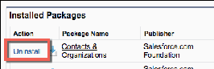

Post Installation Configuration
Start here if you installed Nonprofit Success Pack (NPSP) on top of your existing Salesforce org.
Required Configuration
If you installed Nonprofit Success Pack (NPSP) from the installer, perform these configuration steps to
make NPSP function as intended.
Recommended Configuration
Once you have the NPSP basics set up, we recommend adding these configurations to help your users
find information and create records more quickly and easily.
Configure Accounts
Find out more about configuring accounts.
Configure Contacts
Find out more about configuring contacts.
Configure Error Handling
In Nonprofit Success Pack, when you enable error handling, errors are centrally trapped, collected, and
stored in a single location based on your preferences.
Set Required Admin Permissions to Manage NPSP Settings
Almost all Nonprofit Success Pack (NPSP) configuration is managed from the NPSP Settings tab. In NPSP
Settings, you can change key NPSP behaviors, turn on NPSP features, run a system health check, and
view error logs. System admins and users with a profile containing the necessary permissions can access
the NPSP settings.
To grant a profile access to manage NPSP Settings, add these system permissions to the appropriate user
profile.
•
Author Apex
•
Customize Application
•
Modify All Data
These permissions also grant access to many areas of Setup as well as edit access to all records in your
Salesforce org. Don't grant these permissions lightly! If you're not an experienced Salesforce admin, ask
for help before making any of these changes.
Troubleshoot NPSP Settings Access
If you can’t access NPSP Settings in your sandbox or production environments, try these troubleshooting
tips.
•
Make sure that NPSP is installed correctly.
•
Make sure that the required Apex class permission is assigned to the user.
See Also:
•
Troubleshoot the Nonprofit Success Pack
36

Get Ready to Configure NPSP
Welcome to the Nonprofit Success Pack configuration articles! These articles contain the configuration
instructions you need to complete after you install Nonprofit Success Pack (NPSP). There are also articles
that teach you how to configure specific NPSP features, such as Engagement Plans, In-Kind Gifts, or
Batch Data Import.
Do I Need To Complete These Configurations?
Figure out if you need to make these customizations in your NPSP org.
Installer vs. Trial
Learn about the two primary ways to get NPSP.
Security Model Considerations
Prerequisites for configuring NPSP.
A Note of Encouragement
This is a massive undertaking, no doubt about it. There are a lot of steps to follow, some of which may
be new to you.
Do I Need To Complete These Configurations?
Figure out if you need to make these customizations in your NPSP org.
These articles are for you if:
•
You installed NPSP 3 on top of your existing Developer or Production org from the managed
package installer on the Salesforce.org install page, and you’re ready to tackle the post-installation
configuration steps. Start with Post Installation Configuration .
- OR -
•
You installed NPSP 3 from the Trial signup form on the Salesforce.org trials page, but your package
version doesn't contain new features you want to configure. Start with Feature Configuration
Overview and follow the steps for the specific feature(s) you want to configure.
If your organization is using a version of NPSP prior to NPSP 3, you should upgrade before configuring
NPSP. For more information, read Upgrade to Nonprofit Success Pack from a Previous Version of NPSP.
Tip If you’re not sure which version of NPSP you’re using , explore how your org is configured and
compare it with the instructions in Post-Installation Configuration Steps . If you already have the
Sales Processes, Opportunity stages, and record types outlined in the post-installation configuration
section, you can move on to Feature Configuration Overview.
Installer vs. Trial
Learn about the two primary ways to get NPSP.
There are two primary ways you can install NPSP in your Salesforce org:
37

11.. Through the managed package installer.
22.. Through NPSP Trial signup.
Nonprofit organizations that are new Salesforce customers often get NPSP by signing up for the NPSP
Trial. Organizations that are already Salesforce customers often get NPSP through the managed package
installer.
The NPSP Trial includes many of the latest features enabled by default and is the most "complete"
configuration in terms of how Salesforce intends NPSP to be used.
The managed package installer does not include all the same components in the same configuration as
the Trial. Therefore, if you got NPSP through the installer you'll want to follow the Post Installation
Configuration to enable all the features that are automatically included in the Trial.
Security Model Considerations
Prerequisites for configuring NPSP.
We've written these configurations assuming that the following elements of your security model have
already been deployed:
•
Users
•
Sharing Settings
•
Profiles
•
Permission Sets
•
Roles
•
Public Groups
Many tasks require you to configure object and field level security, as well as assignment of record types
and page layouts. It's much more efficient to perform that configuration with the key elements such as
users and profiles already available in your org.
If you're unfamiliar with data security configuration, here are some resources:
•
Data Security Trailhead module
•
Salesforce Security Guide
•
Who Sees What video series
A Note of Encouragement
This is a massive undertaking, no doubt about it. There are a lot of steps to follow, some of which may be
new to you.
But you don’t have to go it alone.
The Nonprofit Hub community is here to help answer questions and provide moral support. So please,
don’t hesitate to reach out, ask questions, and connect with other NPSP users.
38

So grab a cup of coffee, crank up the music, and dive in!
Post Installation Configuration
Start here if you installed Nonprofit Success Pack (NPSP) on top of your existing Salesforce org.
If you installed NPSP from the Trial, the required and recommended configuration steps have been done
for you. You can skip ahead to Feature Configuration.
11.. Required Configuration—Outlines the configuration needed to make NPSP function as intended, like
the Trial.
22.. Recommended Configuration—We highly recommend performing these steps as they will help your
users find information and work more efficiently.
Note Always install products and test configuration in a Sandbox environment before doing so in
your Production organization. Use the Sandbox to verify that you don’t unintentionally overwrite any
of your own custom page layouts, record types, or other customizations.
Required Configuration
If you installed Nonprofit Success Pack (NPSP) from the installer, perform these configuration steps to
make NPSP function as intended.
Update Opportunity Stages, Sales Processes, and Record Types
You can use Salesforce to track your organization's fundraising processes such as donations, matching
gifts, grants, and membership management. To take full advantage of this functionality, configure
Opportunity stages and record types. You also need to create additional sales processes.
Assign the Organization Record Type to Profiles
NPSP installs two Account record types: Household Account and Organization. Household accounts
are for individuals and families. Organization Accounts are for foundations that fund your work, other
nonprofits that you partner with, corporations that sponsor your work, or companies that employ your
donors and constituents.
Assign Page Layouts
Maybe you already carefully tailored your page layouts to the way your users work, making sure the
right fields are visible and grouped in a way that makes sense, and that all related information is easily
accessible on each record. If so, congratulations! If not, take advantage of the NPSP custom page
layouts. We designed them with typical nonprofit users in mind. You can customize them to meet your
users' needs.
Restore the Standard New Button on the Opportunity Related List
The New Account Donation button on the Opportunity related list of an Account record doesn't work
correctly in Lightning Experience. We recommend that you remove this button and restore the
standard New button on the related list.
Override Lead Convert Button
39

Even if your org isn't using Leads at this point, it's worth a few minutes to get the Lead Conversion page
set up, so that you'll be ready to go if you decide to use Leads sometime down the road.
Add or Edit a New Opportunity Button on Contacts
You can add new Quick Actions on Contacts that let you create Opportunities directly from the
Contact record. If you started using NPSP from a trial instance after November 15, 2016, you should
have these buttons on Contacts.
Override Contact Delete Button
The NPSP Contact Delete page alerts you if the Contact you're trying to delete is the only member of
their Household. If so, you get the option of deleting that Household Account record along with the
Contact, so that you don't have orphaned Households cluttering up your org.
Enable the Manage Household Button
If you don't see the Manage Household button on your Household Account page, enable the button in
Salesforce Setup.
Create Opportunity Contact Roles
Opportunity Contact Role records link a person (Contact) to a donation (Opportunity), and show what
role the person played in getting you the donation. Some typical roles are Donor, Soft Credit,
Household Member, and Solicitor, but you can create whatever roles make sense for your organization.
Configure Relationship Reciprocal Settings
With NPSP, you can create Relationship records that show a connection between any two people. For
example, you can track parent/child relationships, sibling relationships, mentor/mentee relationships,
and more.
Activate Workflow Rules
NPSP comes with a handful of useful workflow rules to manage emails and phone numbers, and to
automatically send acknowledgment emails. The workflow rules are inactive by default.
Update Opportunity Stages, Sales Processes, and Record Types
You can use Salesforce to track your organization's fundraising processes such as donations, matching
gifts, grants, and membership management. To take full advantage of this functionality, configure
Opportunity stages and record types. You also need to create additional sales processes.
Note Watch the Nonprofit Salesforce How-To Series video about Opportunity Sales Processes.
If you’re not familiar with these terms, don’t worry, we’ll walk you through it all! To get started, here’s a
brief explanation:
•
Stage: A picklist field on Opportunity records. The stage indicates which step of the sales process an
Opportunity is in. Typical stages for a donation might include Prospecting, Pledged, Closed Won, or
Closed Lost.
•
Sales Processes: A collection of stages that a business process moves through.
•
Record Type: The kind of Opportunity you’re tracking, for example, Donation, Grant, or Membership.
Each record type is assigned a sales process.
40

CCrreeaattee OOppppoorrttuunniittyy SSttaaggee VVaalluueess
We'll walk you through an example to get you started. Let's create a stage called "Application Received."
(We'll use this stage in a later step for the Grant Sales Process.)From Setup, click the Object Manager
11.. From Setup, click the Object Manager
11.. From Setup, click the Object Manager tab.
22.. In the list of objects, click Opportunity.
33.. Click Fields & Relationships.
44.. Click the Stage field.
55.. Under the Opportunity Stages Picklist Values, click New.
66.. Enter the following details:
••
Stage Name: Application Received
••
Type: Open
••
Probability: 30%
••
Forecast Category: Pipeline
••
Description: Our organization has been notified that the grant application was
received.
77.. Save your changes.
Now create the rest of the stages you need for your organization.
Configure each of these stage values (if they don't already exist in your org).
Note The values in this table appear in the NPSP Trial and are only suggestions. Your organization
can customize them to meet your needs or leave them as is.
Stage Name API Name Type Probability Forecast Category
Application Application Open 30% Pipeline
Submitted Submitted
Awarded Awarded Closed/Won 100% Closed
Cultivation Cultivation Open 30% Pipeline
Declined Declined Closed/Lost 0% Omitted
Identification Identification Open 10% Pipeline
In-Kind Not Yet In-Kind Not Yet Open 50% Omitted
Received Received
In-Kind Received In-Kind Received Closed/Won 100% Omitted
LOI Submitted LOI Submitted Open 20% Pipeline
Pledged Pledged Open 50% Pipeline
41

Stage Name API Name Type Probability Forecast Category
Proposal/Review Proposal/Review Open 60% Best Case
Solicitation Solicitation Open 40% Pipeline
Verbal Verbal Open 80% Commit
Commitment Commitment
Withdrawn Withdrawn Closed/Lost 0% Omitted
CCrreeaattee SSaalleess PPrroocceesssseess ttoo MMaattcchh YYoouurr BBuussiinneessss PPrroocceesssseess
A sales process in Salesforce is a collection of stages that an Opportunity could potentially move through.
For example, a Donation sales process might include the stages Pledged, Closed Won, Closed Lost, and
Declined.
Create and configure a Donation sales process:
11.. From Setup, in the Quick Find box, enter Sales Processes and select Sales Processes.
22.. Click New.
33.. In the Existing Sales Process field, choose Master.
44.. In the Sales Process name field, enter Donation.
55.. Click Save.
66.. Move the following values to the Selected Value list:
••
Pledged
••
Closed Won
••
Declined
••
Closed Lost
77.. If there are values other than those listed in step 6 in the Selected Values list, move them to the
Available Values list.
88.. Save your changes.
99.. Now create and configure sales processes for Grants, In-Kind Gifts, and Major Gifts as described in
steps 2—7 with the values listed in this table.
The NPSP Trial comes with these sales processes:
Note If you don't see some of the selected values in your org, you need to add them to the
Opportunity Stage field first. Learn more in Create Opportunity Stage Values.
Sales Process Selected Values
Donation Pledged, Closed/Lost, Closed/Won, Declined
Grant Prospecting, LOI Submitted, Application
42

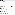

Sales Process Selected Values
Submitted, Withdrawn, Awarded, Declined
In-Kind Gift Prospecting, In-Kind Not Yet Received, In-Kind
Received, Withdrawn
Major Gift Identification, Qualification, Cultivation,
Solicitation, Proposal/Review, Verbal
Commitment, Awarded, Closed/Won, Withdrawn,
Declined
CCrreeaattee OOppppoorrttuunniittyy RReeccoorrdd TTyyppeess
Create these Opportunity record types to track different kinds of Opportunities in NPSP.
•
Donation
•
Grant
•
In-Kind Gift
•
Major Gift
•
Matching Gift
•
Membership
Record types let you offer different business processes, picklist values, and page layouts to different
users. We’ll walk you through how to create the Donation record type.
11.. From Setup, click the Object Manager tab.
22.. In the list of objects, click Opportunity.
33.. Click Record Types.
44.. Click New.
55.. Enter the following information:
••
Existing Record Type: Master (the default value)
••
Record Type Label: Donation
••
Record Type Name: Donation
••
Sales Process: Donation
••
Description: Donation being prospected or already received
66.. Select the Active checkbox.
77.. Select Make Available for profiles that should have access to the Donation record type.
88.. For enabled profiles, select Make Default to make it the default record type for users of that profile.
99.. Click Next.
43

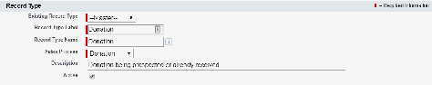

1100.. To apply one layout to all profiles, select Donation Layout.
1111.. Save your changes.
1122.. Repeat these steps for each of the other five record types. Use these values:
Record Type Enter these values
••
Grant Record Type label: Grant
••
Record Type Name: Grant
••
Sales Process: Grant
••
Page Layout: Grant Layout
••
In-Kind Gift Record Type label: In-Kind Gift
••
Record Type Name: InKindGift
••
Sales Process: In-Kind Gift
••
Page Layout: In-Kind Gift Layout
••
Major Gift Record Type label: Major Gift
••
Record Type Name: MajorGift
••
Sales Process: Major Gift
••
Page Layout: Major Gift Layout
••
Matching Gift Record Type label: Matching Gift
••
Record Type Name: MatchingGift
••
Sales Process: Donation
••
Page Layout: Matching Gift Layout
••
Membership Record Type label: Membership
••
Record Type Name: Membership
••
Sales Process: Donation
44

Record Type Enter these values
••
Page Layout: Membership Layout
Assign the Organization Record Type to Profiles
NPSP installs two Account record types: Household Account and Organization. Household accounts are
for individuals and families. Organization Accounts are for foundations that fund your work, other
nonprofits that you partner with, corporations that sponsor your work, or companies that employ your
donors and constituents.
Note The instructions in this section apply only to the Household Account model, which is the
recommended Account model for NPSP. For information on other Account models, see Legacy
Account Models.
NPSP automatically uses the Household Account record type to create Accounts when a Contact is
created (and the Account Name is left blank). Because NPSP creates Household Accounts automatically,
we recommend that you don't include the Household Account record type assignment for all your
profiles. That way, users won't accidentally create an empty Household Account when intending to add
an Organization Account.
Assign the Organization record type and set it as the default:
11.. From Setup, in the Quick Find box, enter Profiles, then click Profiles.
22.. Click the Profile that you want to edit so that it can create Organization accounts.
33.. Scroll to the Record Type Settings section, and next to Accounts, click Edit.
44.. Move Organization to Selected Record Types.
55.. Select Organization as the Default Record Type.
66.. Save your changes.
Repeat the above steps for every profile that you want to create Organization Accounts.
Note If your Profiles pages look different from the above example, it's because you're using the
Enhanced Profile User Instance.
Assign Page Layouts
Maybe you already carefully tailored your page layouts to the way your users work, making sure the right
fields are visible and grouped in a way that makes sense, and that all related information is easily
45

accessible on each record. If so, congratulations! If not, take advantage of the NPSP custom page layouts.
We designed them with typical nonprofit users in mind. You can customize them to meet your users'
needs.
You can assign different page layouts for different profiles. For example, you could assign a Contact
layout with fields related to giving totals for your Fund Development team, but a different layout without
those fields for the rest of your staff.
You can also assign page layouts by record type. For example, you can assign a layout that includes the
Number of Household Members field for the Household Account record type, but a different layout for
the Organization Account record type.
In this example, we’ll assign the Household Layout to the Household Account record type for all Profiles.
11.. From Setup, click the Object Manager tab.
22.. In the list of objects, click Account.
33.. Click Page Layouts.
44.. Click Page Layout Assignment.
55.. Click Edit Assignment.
66.. Click the Household Account record type column header to select all profiles under it.
77.. In the Page Layout to Use field, select Household Lightning Layout or Household Layout (depending
on how you installed NPSP).
88.. Save your changes.
Change the Page Layout Assignment for each object as described below:
Account:
Opportunity:
Record Type Page Layout
Master Organization Layout
Household Household Lightning Layout or Household Layout
Organization Organization Lightning Layout or Household
Layout
Campaign:
Record Type Page Layout
Master NPSP Campaign Layout
Default NPSP Campaign Layout
46

Record Type Page Layout
Master Donation Layout
Donation Donation Layout
Grant Grant Layout
In-Kind Gift In-Kind Gift Layout
Major Gift Major Gift Layout
Matching Gift Matching Gift Layout
Membership Membership Layout
Note Even if you’re happy with the page layouts you’ve already customized, it would be worth a look
at the NPSP layouts to see what fields, buttons, related lists, and other features may be useful. For
example, many orgs appreciate the Household Mailing List button on the Campaign layout, and the
Edit button on the Household Account layout. Spin up a Sandbox and see what the NPSP layouts
have to offer.
Restore the Standard New Button on the Opportunity Related List
The New Account Donation button on the Opportunity related list of an Account record doesn't work
correctly in Lightning Experience. We recommend that you remove this button and restore the standard
New button on the related list.
Note You only need to complete this configuration task if your org uses the Lightning Experience
user interface.
11.. From Setup, click the Object Manager tab.
22.. In the list of objects, click Account.
33.. Click Page Layouts.
44.. Click Organization Layout.
55.. Scroll to the Opportunities related list and click .
66.. In the Buttons section, click to expand the section.
77.. Under Standard Buttons, select New.
88.. Under Custom Buttons, move New Account Donation from Selected Buttons to Available Buttons.
99.. Save your changes.
Override Lead Convert Button
Even if your org isn't using Leads at this point, it's worth a few minutes to get the Lead Conversion page
47

set up, so that you'll be ready to go if you decide to use Leads sometime down the road.
If you’re not familiar with Leads, see Why and How to Use Leads.
The NPSP Lead conversion page lets you define how to map certain fields, and handles properly creating
a Household Account under the right circumstances. For more information on how NPSP Lead
Conversion works, see Convert a Lead to a Contact.
Before you convert leads, override the Lead Conversion button so that it appears on the Lead conversion
page.
11.. From Setup, click the Object Manager tab.
22.. In the list of objects, click Lead.
33.. Click Buttons, Links and Actions.
44.. In the Convert row, click , then click Edit.
55.. Select Visualforce page, and choose LD_LeadConvertOverride
[npsp__LD_LeadConvertOverride].
66.. Save your changes.
Add or Edit a New Opportunity Button on Contacts
You can add new Quick Actions on Contacts that let you create Opportunities directly from the Contact
record. If you started using NPSP from a trial instance after November 15, 2016, you should have these
buttons on Contacts.
•
New Donation
•
New In-Kind Gift
•
New Major Gift
•
New Membership
If you don't have these buttons, we recommend that you create Quick Actions for each Opportunity
record type and add them to your Contact page layout.
48

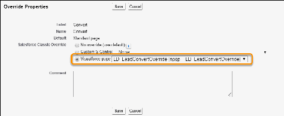

CCrreeaattee aann OOppppoorrttuunniittyy AAccttiioonn BBuuttttoonn
Based on how you set up your Contact Opportunity Action buttons, all the data, such as the Opportunity
Name and Close Date, is correctly populated for you. We'll show you how to create a New Donation
action, similar to the one in the NPSP trial.
To learn more about Quick Actions, see Create Global Quick Actions.
11.. From Setup, click the Object Manager tab.
22.. In the list of objects, click Contact.
33.. Click Buttons, Links, and Actions.
44.. Click New Action.
55.. Complete the record:
aa.. For Action Type, select Create a Record.
bb.. For Target Object, select Opportunity.
cc.. For the Relationship Field, select the Primary Contact field.
dd.. Select the Record Type that will be automatically assigned for the Opportunity. In this case, we're
creating an Action for the Donation record type.
ee.. The Standard Label Type determines how the Action will appear on a record. We recommend
selecting New [Record Type]. For example, since we chose the Donation record type, the Contact
record will have an action called New Donation.
ff.. Give the Action a name. This name isn't visible to users.
gg.. We recommend leaving Create Feed Item deselected. This setting creates a Chatter post for every
new Opportunity created with the action.
hh.. Save your changes.
66.. Next, choose the fields that will appear in the pop up when the button is pushed. Drag any field to the
preview area to include it; click to remove a field. Fields marked with a * are required. Hover over
the field and select the wrench icon, to set a field as Read-only or Required.
77.. Save your work.
88.. Next, set up predefined values that automatically populate fields on the new Opportunity record that
is created from the action. For each new Opportunity, we want to set the Close Date to today, the
Stage to Closed Won, and the Opportunity Name to autopopulate using this format: "Jasmine Klein
Donation 1/24/2020." This makes creating Opportunities so much faster.
49

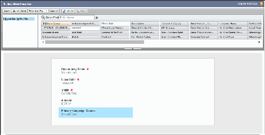

aa.. In the Predefined Field Values section, click New.
Note You can choose to automatically populate fields, even if they don't appear on the above
layout. For example, automatically populate default values for required fields, so users don't
have to enter values each time.
bb.. From the Field Name list, select the Opportunity Name field.
This is the field you want to populate automatically.
cc.. In the Formula Value field, enter: Contact.FirstName & " " & Contact.LastName & "
Donation " & TEXT(MONTH(TODAY())) & "/" & TEXT(DAY(TODAY())) & "/" &
TEXT(YEAR(TODAY()))
dd.. Save your changes.
99.. Next, create the predefined value for the Close Date field.
aa.. In the Predefined Field Values section, click New.
bb.. From the Field Name list, select Close Date.
cc.. In Formula Value, enter TODAY().
dd.. Save your changes.
1100.. Last, we'll create the predefined value for the Stage field.
aa.. In the Predefined Field Values section, click New.
bb.. From the Field Name list, select Stage.
cc.. In the Specific Value field, select Closed Won.
dd.. Save your changes.
Now that you created the new Action, make sure it appears by adding it to your Contact page layout.
11.. In the Object Manager, make sure you're still viewing the Contact object, then click Page Layouts.
22.. Click the name of your Contact layout.
33.. In the left pane of the top panel, click Mobile & Lightning Actions.
44.. On the right side, you'll see the new Action(s) you created. Drag the Action(s) into the Salesforce
Mobile and Lightning Experience Actions section. Be sure to put the actions in the order you want to
see them in the UI.
55.. Save your change.
Don't forget to create an Action for each of the Opportunity record types (and add them to the page
layout).
Important If you added the new Action to the page layout, but still can't see it on a Contact record,
check to make sure that your profile (and any other profile that needs to see the Action) has access
to the Primary Contact field. You can view field access using the Object Manager in Setup.
50

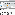

EEddiitt aann OOppppoorrttuunniittyy AAccttiioonn BBuuttttoonn
NPSP comes with a number of ready-to-go Actions on Contact and Account that let you quickly create
Opportunities, such as Donations and Memberships, for each Opportunity record type. Edit these
Actions to meet your organization's needs.
11.. From Setup, click the Object Manager tab.
22.. In the list of objects, click Contact or Account
33.. Click Buttons, Links, and Actions.
44.. Click the label for the Action you wish to edit.
55.. Click Edit Layout.
66.. Add or remove fields in the layout editor.
77.. Save your changes.
88.. Back on the Action layout, scroll to the Predefined Field Values list. Click Edit to edit any existing
predefined value. Click New to create a new predefined field.
99.. Save your changes.
Override Contact Delete Button
The NPSP Contact Delete page alerts you if the Contact you're trying to delete is the only member of
their Household. If so, you get the option of deleting that Household Account record along with the
Contact, so that you don't have orphaned Households cluttering up your org.
Override the Contact Delete button, so that the alert and options described above are available.
11.. From Setup, click the Object Manager tab.
22.. In the list of objects, click Contact.
33.. Click Buttons, Links and Actions.
51

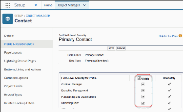

44.. In the Delete row, click , then click Edit.
55.. Select Visualforce page and choose CON_DeleteContactOverride
[npsp__CON_DeleteContactOverride].
66.. Save your changes.
Enable the Manage Household Button
If you don't see the Manage Household button on your Household Account page, enable the button in
Salesforce Setup.
Note The Manage Household button is available only if you're using the Household Account model.
If you're not sure which Account model is configured in your org, see Which Account Model Am I
Using?
To enable the button in Lightning Experience:
11.. Click , then click Setup.
22.. Click the Object Managertab and click Account from the list of objects.
33.. Click Page Layouts .
44.. Click Household Layout.
55.. Select Mobile & Lightning Actions from the palette.
66.. Drag the Manage Household button from the palette to the “Mobile and Lightning Experience
Actions” area of the Account Detail section.
Note The buttons you see in your org's Mobile and Lightning Experience Actions area may vary
from what's shown here.
52

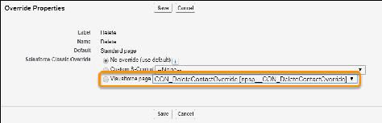

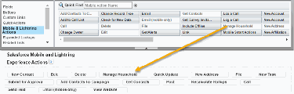

77.. Click Save.
To enable the Manage Households button for Salesforce Classic:
11.. On the Manage Household page layout for Account, select Buttons from the palette.
22.. Drag the Manage Household button from the list of buttons to the Custom Buttons area.
33.. Click Save.
Create Opportunity Contact Roles
Opportunity Contact Role records link a person (Contact) to a donation (Opportunity), and show what
role the person played in getting you the donation. Some typical roles are Donor, Soft Credit, Household
Member, and Solicitor, but you can create whatever roles make sense for your organization.
11.. From Setup, in the Quick Find box, enter Contact Roles, then click Contact Roles on
Opportunities.
Note Double check the Inactive Values list to ensure that these values don’t already exist in your
org. If you find one, simply click Activate.
22.. Click New.
33.. Enter the following Roles if they aren't already listed:
••
Donor
••
Household Member
••
Soft Credit
••
Matched Donor
••
Honoree
••
Notification Recipient
••
Grant Manager
••
Decision Maker
••
Influencer
••
Solicitor
••
Workplace Giving
••
Other
44.. Save your changes.
Configure Relationship Reciprocal Settings
With NPSP, you can create Relationship records that show a connection between any two people. For
example, you can track parent/child relationships, sibling relationships, mentor/mentee relationships,
and more.
For a detailed explanation of all the Relationship Settings, read Manage Relationship Settings.
53

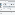

CCoonnfifigguurree SSeettttiinnggss
Here's where you create those Relationship Reciprocal records—the ones that tell NPSP what kind of
reciprocal record to auto create whenever you create a relationship record.
11.. Click the NPSP Settings tab. If you don't see the tab, find it in the App Launcher ( ).
22.. Click Relationships, then click Relationship Reciprocal Settings.
33.. Click New Reciprocal Relationship.
44.. Enter values for Name and Neutral, for example, Parent and Child. If you’re tracking your
constituents' genders, either through a custom field on Contact or with salutations, include values for
Male (like Son), Female (like Daughter), and Neutral (like Child).
55.. Click Create Reciprocal Relationship.
Create any additional relationship types that would be useful for your organization.
To get you started, here are the Reciprocal Relationship records that come with the NPSP trial. Choose
from these or create your own.
NAME MALE FEMALE NEUTRAL
Aunt Nephew Niece Sibling's Child
Child Father Mother Parent
Cousin Cousin Cousin Cousin
Daughter Father Mother Parent
Employee Employer Employer Employer
Employer Employee Employee Employee
Father Son Daughter Child
54

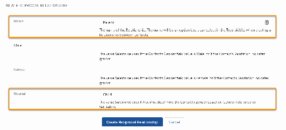

NAME MALE FEMALE NEUTRAL
Grandchild Grandfather Grandmother Grandparent
Granddaughter Grandfather Grandmother Grandparent
Grandfather Grandson Granddaughter Grandchild
Grandmother Grandson Granddaughter Grandchild
Grandparent Grandson Granddaughter Grandchild
Grandson Grandfather Grandmother Grandparent
Husband Husband Wife Spouse
Mother Son Daughter Child
Parent Son Daughter Child
Partner Partner Partner Partner
Son Father Mother Parent
Spouse Spouse Spouse Spouse
Uncle Nephew Niece Sibling's Child
Wife Husband Wife Spouse
((OOppttiioonnaall)) CCrreeaattee aa CCuussttoomm GGeennddeerr FFiieelldd oonn CCoonnttaacctt
If you have a valid reason to track your constituent's gender, create a custom picklist field on the Contact
object.
Recommended picklist values:
•
Male
•
Female
•
Non-Binary
•
Prefer Not To Say
To create your custom field:
11.. Click the Object Manager tab.
22.. In the list of objects, click Contact.
33.. Click Fields & Relationships.
44.. Click New.
55.. Under Data Type, select Picklist, then click Next.
66.. Enter Gender as the Field Label.
77.. Select Enter values, with each value separated by a new line.
88.. For values, enter Male, Female, Non-Binary, Prefer Not To Say.
55

99.. Click Next.
1100.. Select field-level security for each profile, then click Next.
1111.. Select the Contact page layouts that should include the new field, then click Save.
1122.. Now that the custom gender field is created, use the steps in the Configure Relationship Reciprocal
Settings section to configure the reciprocal relationship for it, so that it can be applied when you
create relationships. For more information on gender and reciprocal relationship settings, read General
Relationships Settings.
Activate Workflow Rules
NPSP comes with a handful of useful workflow rules to manage emails and phone numbers, and to
automatically send acknowledgment emails. The workflow rules are inactive by default.
Note Before you activate the Opportunity Email Acknowledgment rule, it's a good idea to configure
your email template and follow the other steps in Set Up Email Acknowledgments. This will ensure
you have a chance to craft personal content and add your organization's logo before those emails
get sent out!
11.. From Setup, in the Quick Find box, enter Workflow Rules, then click Workflow Rules.
22.. Click Activate next to each rule.
We recommend activating all except Contact.Preferred_Phone__c WithHousehold
.
Recommended Configuration
Once you have the NPSP basics set up, we recommend adding these configurations to help your users
find information and create records more quickly and easily.
These recommended steps aren't essential for NPSP to function—but they will help your users find
information and create records more quickly and easily.
Add the NPSP Lightning App
Create a new Lightning App for Nonprofit Success Pack.
Configure Compact Layouts
Compact layouts determine what fields you see on the highlights panel of a record, and when you
hover over a lookup field. They also determine the fields you see in the highlights area of a record on
the Salesforce mobile app.
Add “Mx.” to Salutation Field on Contact
It's important to use the right salutation for each constituent in mailings and other communications.
Add the value of Mx. to the Salutation field on Contact to include people who prefer it.
Enable the Get Started with NPSP Page
NPSP includes a Get Started page designed for new users who are at the beginning of their journeys
56

with Nonprofit Success Pack. We very intentionally selected the content, links, and videos on the pages
to help new users learn about different aspects of the Nonprofit Success Pack in a logical order so that
they can quickly get up and running and on their way to being power users.
Add the NPSP Lightning App
Create a new Lightning App for Nonprofit Success Pack.
11.. Click , then click Setup.
22.. Enter App in the Quick Find box, then click App Manager. You should see the Lightning Experience
App Manager.
33.. Click New Lightning App.
44.. Enter the following information:
••
App Name: Nonprofit Success Pack
••
Developer Name (gets filled in automatically): Nonprofit_Success_Pack
••
Description: (Lightning Experience) Manage your nonprofit processes.
••
Choose a logo: Upload a graphic.
••
Primary Color Hex Value: #00A1E0
55.. Click Next.
66.. On the App Options tab, select Standard Navigation and for the Setup Experience select Setup (full
set of Setup options).
77.. Click Next.
88.. On the Utility Items (Desktop Only) tab, click Next.
99.. On the Navigation Items tab, add the following tabs to the Selected Items (in this order):
••
Getting Started
••
Home
••
Accounts
••
Contacts
••
Opportunities
••
Recurring Donations
••
Campaigns
••
Reports
••
Dashboards
••
NPSP Settings
1100.. Click Next.
1111.. On the User Profiles tab, choose the appropriate profiles. In the Trial, we assigned the app to all
standard profiles.
1122.. Click Save & Finish. You should now see the new Lightning app in the Lightning App Manager list. And
see the new tile in the App Launcher. When you click on the tile in the app launcher, you see the
Getting Started tab in NPSP.
CCrreeaattee aann NNPPSSPP AAddmmiinniissttrraattoorr LLiigghhttnniinngg AApppp
The NPSP Lightning app that is included in the trial doesn't include some important admin-specific tabs
(that existing NPSP orgs are accustomed to seeing by default). So, we recommend that you also create
57

an Administrator Lightning app. Call it "NPSP Admin" (or something that you'll easily recognize in the
App Launcher) and include any tabs that are relevant for admins in your org. Here are some suggestions:
•
Accounts
•
Contacts
•
Contact Merge
•
Dashboards
•
Engagement Plan Templates
•
NPSP Data Import
•
NPSP Data Import Batches
•
NPSP Settings
•
Reports
Create List Views
A list view is a filtered list based on one kind of record, such as Accounts or Contacts, that you access
from the record tab. We recommend that you create list views for Accounts and Opportunities.
Account List Views
List View Name Filters Fields
Organization Accounts Account Record Type = Account Name, Account Site,
Organization Billing State/Province, Phone,
Type, Account Owner Alias
All Accounts N/A Account Name, Billing State/
Province, Phone, Total Gifts,
Total Gifts Last N Days, Average
Gift, Type, Account Record Type
Household Accounts Account Record Type = Account Name, Formal Greeting,
Household Informal Greeting. Total Gifts,
Average Gift, Best Gift Year,
Household Phone
Opportunity List Views
List View Name Filters Fields
All Donations Opportunity Record Type = Opportunity Name, Account
Donation Name, Amount, Close Date,
Stage, Opportunity Owner Alias
We’ll create the first one together—a list view of Organization Accounts that displays a list of Accounts
filtered by Record Type=Organization, and display fields Account Name, Account Site, Billing State/
Province, Phone, Type, Account Owner Alias.
58

Keep in mind that there are three parts to configuring a list view:
11.. Create the List View.
22.. Update the Display Fields.
33.. Add Filters.
CCrreeaattee tthhee LLiisstt VViieeww
Create a list view for NPSP.
11.. Click the Accounts tab.
22.. Click .
33.. Click New.
44.. In the Name field, enter Organization Accounts.
55.. NPSP automatically generates a List API Name.
66.. Select All users can see this list view.
77.. Click Save.
UUppddaattee tthhee DDiissppllaayy FFiieellddss
Add fields on your NPSP list view.
11.. Select Organization Accounts from the list view dropdown.
22.. Click , then click Select Fields to Display.
33.. Move the default fields from Visible Fields to Available Fields.
44.. Move the following fields to the Visible Fields list: Account Name, Account Site, Billing State/
Province, Phone, Type, Account Owner Alias.
55.. Click Save.
AAdddd FFiilltteerrss
Add filters to list views to easily find or edit different types of records in NPSP.
11.. Select Organization Accounts from the list view dropdown.
22.. Click .
33.. Click Add Filter.
44.. Select Account Record Type for the Field.
55.. Select equals for the Operator.
66.. Select Organization for the Value.
77.. Click Done.
88.. Click Save.
99.. Now create the rest of the list views shown in Create List Views.
Configure Compact Layouts
Compact layouts determine what fields you see on the highlights panel of a record, and when you hover
59

over a lookup field. They also determine the fields you see in the highlights area of a record on the
Salesforce mobile app.
Set up your compact layouts so that the fields your users need to view at a glance are front and center. It
may not seem like a big deal, but small changes like this can make a big difference in user acceptance
and overall happiness with NPSP.
NPSP installs these compact layouts:
•
Contact: NPSP Contact Compact Layout
•
Account: NPSP Household Account, NPSP Organization Account
•
Opportunity: NPSP Donation Compact Layout
•
Campaign: NPSP Compact Layout
Use these compact layouts as is, or use them as a starting point for your additional customizations.
CClloonnee CCoommppaacctt LLaayyoouuttss TToo PPrreesseerrvvee YYoouurr CChhaannggeess
Have you ever customized a Compact Layout, tested it, deployed it … and then discovered a few weeks
later that it had reverted to the default layout?
If so, you're not alone. And no, you're not going crazy.
The issue is that packaged Compact Layouts, unlike regular page layouts, get push upgraded whether
you like it or not. This means that with any upgrades to NPSP, Compact Layouts for Accounts, Contacts,
and other objects get pushed to your organization, overwriting any customizations you may have made.
Which can lead to a lot of confusion, not to mention downright aggravation.
Here's a quick, three-step process to avoid this frustration:
11.. Clone the packaged Compact Layout.
22.. Make changes to the cloned layout.
33.. Set the cloned version as the primary Compact Layout.
Let's walk through an example:
The staff at Colorado Community Bakery know that it's important to respect how their customers want to
be addressed. They want to add a custom field, Preferred Pronouns, to their Compact Layout for
Contacts, so that this information is front and center.
1. They start by cloning a packaged Compact Layout.
2. Next, they add their custom field to the cloned Compact Layout and click Save:
3. Finally, they set the new cloned Compact Layout as the primary Compact Layout:
60

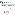

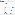

Since they're using a cloned Compact Layout rather than a packaged Compact Layout, they can now be
confident that their customizations will remain in place throughout any product upgrades.
Add “Mx.” to Salutation Field on Contact
It's important to use the right salutation for each constituent in mailings and other communications. Add
the value of Mx. to the Salutation field on Contact to include people who prefer it.
The Contact Salutation field is not exposed in the Lightning setup UI. To edit this field, switch to the
Salesforce Classic interface:
11.. Click the View Profile icon.
22.. Click Switch to Salesforce Classic.
33.. Click Setup.
44.. In the Quick Find box, enter Contacts, then click Fields under Contacts.
55.. In the Contact Standard Fields section, click Edit next to the Salutation field.
66.. Click New.
77.. Enter Mx., then click Save.
Note Your organization can add more custom salutations as needed.
Once you’ve made your changes, switch back to Lightning Experience by clicking the Switch to Lightning
Experience link.
Customize Gender Picklist Values for Relationships
How the Gender Picklist values work and use translation workbench to customize values.
Important This article describes advanced options for customizing NPSP Relationships. Be careful
when using these options, as improper configuration can cause unexpected side effects in your
Relationships records.
GGeennddeerr PPiicckklliisstt VVaalluueess OOvveerrvviieeww
If you want to use gender values other than Male and Female or add additional values, you can use
Translation Workbench to edit these values.
61

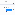

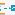

By default, NPSP Relationships use the Male and Female gender values to determine Reciprocal
Relationships according to your Manage Relationships Settings.
Simply editing the Gender picklist field is not sufficient if you want to change the default values and still
have NPSP use gendered reciprocal relationships. For example, if you wanted to change the default
gender values from Male to Male-Identifying and Female to Female-Identifying, just editing the picklist
values in the Gender field without following the rest of the steps outlined in this document would cause
NPSP to generate gender-neutral reciprocal Relationships, such as Sibling rather than Brother or Sister, or
Sibling's Child rather than Niece or Nephew.
The rest of this document shows you how you can both change NPSP's default gender values and still
maintain gendered reciprocal relationships.
EEnnaabbllee TTrraannssllaattiioonn WWoorrkkbbeenncchh
Translation Workbench is a tool that lets you translate text in Salesforce into other languages. The tool
also lets you change and customize text within the same language in managed packages such as NPSP.
11.. Click , then click Setup.
22.. From Setup, enter Translation Workbench in the Quick Find box, then select Translation
Language Settings.
33.. Click Enable.
You should see English in the list of Supported Languages, and it should be Active. If it's not Active, click
Edit, select the Active checkbox, and add yourself as a Translator (see below). If you don't see English
listed at all, you'll need to do this:
11.. Click Add.
22.. Select English as the Language.
33.. Make sure Active is selected.
44.. Under Identify Translators for This Language, select your name and click Add to move your name to
the Selected List.
55.. Click Save when you're finished.
TTrraannssllaattee tthhee DDeeffaauulltt GGeennddeerr CCuussttoomm LLaabbeellss
Update the options in the Gender field.
Now customize the labels:
11.. From Setup, enter Custom Labels in the Quick Find box, then select Custom Labels under the
User Interface menu.
22.. Click the letter M to narrow down the list of Custom Labels.
33.. Click Male.
44.. Click New Local Translations/Overrides.
55.. Select English as the language.
66.. In the Translation Text box, enter the terms you want to use for the Male category. You can also
62

provide a comma-delimited list. For example, Male-identifying, Transgender, or Nonbinary.
77.. Click Save when complete.
88.. Repeat this process for the Female Custom Label if necessary.
Lastly, make sure that the Gender picklist field on the Contact object also includes the values you added
via Translation. (See Add or Edit Picklist Values in Salesforce Help and Training.) Once that's done, the
NPSP can use your custom Gender values to auto-create reciprocal Relationships as defined in the Male/
Female/Neutral table in Relationship Reciprocal Settings.
Enable the Get Started with NPSP Page
NPSP includes a Get Started page designed for new users who are at the beginning of their journeys with
Nonprofit Success Pack. We very intentionally selected the content, links, and videos on the pages to
help new users learn about different aspects of the Nonprofit Success Pack in a logical order so that they
can quickly get up and running and on their way to being power users.
EExxppoossee TTaabb
11.. From Setup, enter Profile in the Quick Find box, then click Profiles.
22.. Click the profile that needs access to the tab.
33.. Click Object Settings.
44.. Click Get Started with NPSP.
55.. Click Edit and change the tab setting to Default On.
66.. Click Save.
77.. Repeat these steps for any profile that needs access.
GGrraanntt AAcccceessss ttoo tthhee GGeett SSttaarrtteedd CCoommpplleettiioonn CChheecckklliisstt SSttaatteess
11.. While still in Object Settings, click Get Started Completion Checklist States.
22.. Click Edit.
33.. In the Object Permissions section, select Read, Create, Edit, and Delete.
44.. In the Field Permissions section, select Read Access for all fields, and Edit Access for these fields:
••
Item Id
••
Owner
••
User
55.. Click Save.
GGrraanntt AAcccceessss ttoo GS_ChecklistSetup aanndd
GS_ApplicationStatusController AAppeexx CCllaasssseess
11.. While still in the profile editor, click next to Object Settings and select Apex Class Access.
22.. Click Edit.
33.. Move GS_ChecklistSetup and GS_ApplicationStatusController to the Selected list.
44.. Click Save.
55.. Repeat these steps for any profile that needs access to the Get Started page.
63

GGrraanntt AAcccceessss ttoo tthhee GGeett SSttaarrtteedd CCuussttoomm MMeettaaddaattaa TTyyppeess
11.. While still in the Profile Editor, click next to Apex Class Access and select Custom Metadata Types.
22.. Click Edit.
33.. Add NPSP Get Started Checklist Item and NPSP Get Started Checklist Section to the Enabled Custom
Metadata Types list.
44.. Click Save.
AAdddd TTaabb ttoo tthhee LLiigghhttnniinngg AApppp
Add the Get Started with NPSP tab to the Nonprofit Success Pack Lightning App:
11.. From Setup, enter App Manager in the Quick Find box, then click App Manager.
22.. In the row for the Nonprofit Success Pack Lightning App, click , then click Edit.
33.. Under App Settings, click Navigation Items.
44.. To add the tab for users:
aa.. Move Get Started with NPSP to the Selected Items list.
bb.. Click Save.
cc.. Under App Settings, click User Profiles.
dd.. Move any profiles that should have access to the Get Started with NPSP tab to the Selected Profiles
list.
55.. Click Save.
Configure Accounts
Find out more about configuring accounts.
Add the Primary Contact Field to the Manage Households Page
To add or remove fields on the Manage Households page, modify the Manage Household Custom field
set.
Add the Primary Contact Field to the Manage Households Page
To add or remove fields on the Manage Households page, modify the Manage Household Custom field
set.
To add the Primary Contact field to the Manage Households page:
11.. Click , then click Setup.
22.. Click the Object Manager tab.
33.. In the list of objects, click Account.
44.. Click Field Sets.
55.. Click Manage Household Custom.
66.. In the Manage Household Custom section at the top of the page, click the Primary Contact field and
drag it into the In the Field Set box below.
64

77.. Click Save.
Configure Contacts
Find out more about configuring contacts.
Enable Contact Delete Override
When you enable Contact Delete Override, you're overriding standard Contact Delete functionality
with a custom Visualforce page. This override prevents orphaned Household Account records and
provides the desired deletion behavior for Contacts in NPSP.
Add the Relationships Viewer to the Contact Page Layout
The Relationships Viewer provides a visual representation of how your Contacts are connected.
Enable Contact Delete Override
When you enable Contact Delete Override, you're overriding standard Contact Delete functionality with a
custom Visualforce page. This override prevents orphaned Household Account records and provides the
desired deletion behavior for Contacts in NPSP.
To figure out if you have Contact Delete Override enabled or to enable it:
11.. Click , then click Setup.
22.. Click the Object Manager tab.
33.. In the list of objects, click Contact.
44.. Click Buttons, Links, and Actions.
55.. In the row for Delete, look at the Content Source and Overridden columns. If the override is enabled,
you'll see a checkmark in the Overridden column and the Visualforce page name in the Content
Source column.
66.. If the Content Source says Standard Salesforce Page, you need to enable the override. Click , then
Edit.
77.. Select Override With, then choose the CON_DeleteContactOverride
[npsp__CON_DeleteContactOverride] Visualforce page.
88.. Click Save.
Add the Relationships Viewer to the Contact Page Layout
The Relationships Viewer provides a visual representation of how your Contacts are connected.
To add the Relationships Viewer to the Contact layout:
11.. Click , then click Setup.
22.. Click the Object Manager tab.
33.. From the list of objects, select Contact.
44.. Click Page Layouts.
55.. Click the name of the Contact layout you want to edit.
65

66.. Select Mobile & Lightning Actions from the left column, drag the Relationships Viewer item to the
Salesforce Mobile and Lightning Experience Actions section, and click Save.
Configure Error Handling
In Nonprofit Success Pack, when you enable error handling, errors are centrally trapped, collected, and
stored in a single location based on your preferences.
To configure error handling:
11.. From the NPSP Settings tab, click System Tools | Error Notifications.
22.. Click Edit.
33.. If you'd like to enable error handling, select Store Errors.
44.. Make other selections as appropriate for your org.
55.. Click Save.
