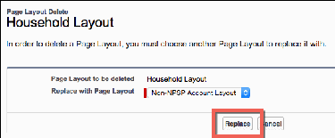
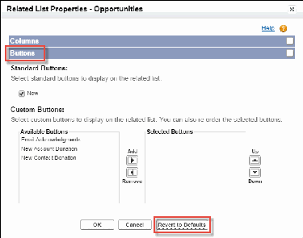
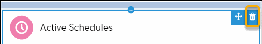
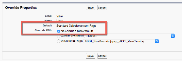

For information about your privacy and how feature management works, read:
•
Salesforce.Org Privacy Policy
•
Salesforce Feature Management
NPSP Packaged Rollups
A reference spreadsheet listing all packaged NPSP rollups with their operation description, target field,
and calculation timing.
The NPSP packaged rollups spreadsheet contains reference information about all the packaged NPSP
rollups. This resource is intended for administrators and developers. Your org's custom rollups aren't
listed in this spreadsheet.
NPSP Packaged Rollups (Quip spreadsheet)
NPSP Workflow Diagrams
This guide is intended for database administrators, implementation partners, and third-party software
developers, interested in the technical aspects of NPSP. This reference guide provides workflow diagrams
and text descriptions for several automated NPSP processes.
NPSP Workflow Diagrams (in PDF format)
NPSP Entity Relationship Diagram
This diagram shows the relationship between NPSP custom objects and Salesforce standard objects for
the Household Account Model.
NPSP Entity Relationship Diagram
Configure NPSP Installation
Learn how to install or upgrade NPSP, and configure your NPSP organization and features. Learn about
advanced NPSP configurations and optional customizations.
Install or Upgrade NPSP
Learn the ins and outs of installing or upgrading NPSP in your Salesforce org.
17

Install or Upgrade NPSP
Learn the ins and outs of installing or upgrading NPSP in your Salesforce org.
Install NPSP
Learn how to install or upgrade NPSP and how to resolve common installation errors.
Which Version of NPSP Am I Using?
This article will help you figure out which NPSP product you have installed.
Upgrade to Nonprofit Success Pack from a Previous Version of NPSP
This guide is for users considering the upgrade from a previous version of NPSP to the latest version.
Convert to the Nonprofit Success Pack Household Account Model
This guide is for users who upgraded to NPSP from a previous version and want to convert to the
Household Account Model.
Uninstall NPSP
This article provides instructions for uninstalling a default version of NPSP from your Salesforce
organization.
Configure Your NPSP Organization
Learn about the required permissions, configuration, and post-install steps for setting up your NPSP
organization.
Configure NPSP Features
Articles for Salesforce admins about how to configure all of the NPSP features.
Advanced NPSP Configurations
Manage or disable trigger handlers or deploy custom code in the TDTM framework.
Optional NPSP Customizations
Learn about optional customizations you can do in NPSP including categorizing Contacts, adding
badges to Contacts, handling anonymous donors, and adding components to your Experience Cloud
donor portal.
Install NPSP
Learn how to install or upgrade NPSP and how to resolve common installation errors.
If you're new to Salesforce and NPSP
Get an NPSP trial and explore what's included.
If you already have NPSP and want to upgrade
Review the Nonprofit Success Pack upgrade guide for instructions on upgrading NPSP
If you already have Salesforce, but don't have NPSP
You can install NPSP on any version of Salesforce Enterprise Edition. However, this process is only
recommended for experienced Salesforce admins. If at all possible, sign up for a new trial version of
NPSP instead.
Common Installation Errors
Learn about possible errors when installing NPSP and how to fix them.
18

Frequently Asked Questions
Common questions about NPSP versions.
The Fine Print
The Nonprofit Success Pack is an open-source, BSD-licensed package. Salesforce hosts all packages
and source code on GitHub using git.
If you're new to Salesforce and NPSP
Get an NPSP trial and explore what's included.
11.. Visit the Salesforce.org trials page.
22.. Fill out the form and click Submit.
If you already have NPSP and want to upgrade
Review the Nonprofit Success Pack upgrade guide for instructions on upgrading NPSP
Follow the step-by-step upgrade instructions (complete with screenshots) in the Nonprofit Success Pack
Upgrade Guide.
Note If you're installing the latest version of NPSP, you don't need to uninstall any previous versions.
If you already have Salesforce, but don't have NPSP
You can install NPSP on any version of Salesforce Enterprise Edition. However, this process is only
recommended for experienced Salesforce admins. If at all possible, sign up for a new trial version of
NPSP instead.
See If you're new to Salesforce and NPSP.
Important Considerations
•
If you start with a new trial version of NPSP as recommended (instead of installing on top of your
existing org), you'll need to transfer any data or configuration over from the old org to the new one.
Additionally, you'll need to transfer your licenses to the new trial org by emailing one of the following:
- powerofus@salesforce.com (AMER customers)
- EMEApowerofus@salesforce.com (EMEA customers)
- APACpowerofus@salesforce.com (APAC customers)
•
NPSP is not supported in Professional or Group Edition. Before attempting to install the Nonprofit
Success Pack, check your edition. In Salesforce Setup, enter Company Information in the Quick
Find box, then click Company Information. Look for the Organization Edition field.
•
Salesforce does not recommend installing upgrades directly in production organizations. Instead,
install your NPSP upgrade in one of your free sandbox environments, or a developer organization first.
See Create a Sandbox in Salesforce Help for more information.
•
My Domain must be enabled in your org before you install NPSP. To find out if My Domain is enabled
19

in your org, go to Setup and search for My Domain. For information on setting up My Domain, see My
Domain.
To install NPSP on an existing Salesforce organization:
11.. Visit the NPSP Installer page.
22.. Log in to your Salesforce organization by clicking Log In, choosing Production or Developer Edition
org or Sandbox org, and entering your login credentials.
33.. Review the installation list and click Install.
44.. Once you've completed your install, see Post Installation Configuration.
Common Installation Errors
Learn about possible errors when installing NPSP and how to fix them.
MMyy NNPPSSPP iinnssttaallllaattiioonn ffaaiilleedd wwiitthh tthhee eerrrroorr ""OOppppoorrttuunniittyy RReeccoorrdd TTyyppeess -- ppiicckk
lliisstt vvaalluuee,, PPrroossppeeccttiinngg nnoott ffoouunndd..""
You are missing one or more of the default Opportunity Stages. You can fix this issue by creating them
and re-running the installer.
11.. Click , then click Setup.
22.. Click the Object Manager tab.
33.. Click Opportunity.
44.. Click Fields & Relationships, then enter Stage in the Quick Find box.
55.. Click the Stage field.
You should have the following values in the Opportunity Stages Picklist Values list:
•
Prospecting
•
Qualification
•
Needs Analysis
•
Value Proposition
•
Id. Decision Makers
•
Perception Analysis
•
Proposal/Price Quote
•
Negotiation/Review
•
Closed Won
•
Closed Lost
MMyy NNPPSSPP iinnssttaallllaattiioonn ffaaiilleedd wwiitthh tthhee eerrrroorr ""UUnnmmaannaaggeedd ccuussttoomm oobbjjeecctt ttaabb
aallrreeaaddyy eexxiissttss..""
This is a common error that is easily fixed. From Setup, enter Tabs in the Quick Find box, then select Tabs
under the User Interface menu. Look for the name of the tab mentioned in the error message. Click Del
20

next to the tab name. Note that this only removes the tab, but not the related data. Then run the installer
again.
Frequently Asked Questions
Common questions about NPSP versions.
IIff II aallrreeaaddyy hhaavvee aann eeaarrlliieerr vveerrssiioonn ooff NNPPSSPP,, wwiillll II hhaavvee ttoo mmiiggrraattee ddaattaa ttoo
NNoonnpprroofifitt SSuucccceessss PPaacckk??
No. We designed NPSP so that you wouldn't need to export or modify any of your existing data. However,
as with any other major change to your organization, we strongly advise that you test your upgrade in a
sandbox (i.e. test) organization first. If you've customized or modified your org, those customizations may
interfere with NPSP. These issues are usually easy to overcome, but they will be easier to address before
upgrading your production org.
WWhhaatt wwiillll hhaappppeenn ttoo mmyy eexxiissttiinngg NNPPSSPP ppaacckkaaggeess??
Nonprofit Success Pack will require you to upgrade your existing NPSP packages to new, code-free
versions that won't work as "standalone." We'll continue to make the last stable versions of the
Relationships, Recurring Donations and Affiliations packages available to those who would like to
continue using them.
OOuurr SSaalleessffoorrccee oorrggaanniizzaattiioonn wwaass ssttaarrtteedd bbeeffoorree 22000088 aanndd uusseess tthhee
NNoonnpprroofifitt TTeemmppllaattee.. CCaann II uuppggrraaddee ttoo NNoonnpprroofifitt SSuucccceessss PPaacckk??
While the Nonprofit Template and similar early configurations implemented by consulting firms were
standard before 2008, they are not actually the NPSP. Moving to the NPSP from the Nonprofit Template
would be considered an install, not an upgrade. Careful consideration will be needed when migrating
data and removing the older code. Reach out to a partner for an assessment if you aren't comfortable
doing this work on your own.
HHooww ddoo II kknnooww wwhhiicchh vveerrssiioonn ooff NNPPSSPP II''mm oonn??
You can easily figure that out by looking in your org. See Which Version of NPSP Am I Using? for more
details.
The Fine Print
The Nonprofit Success Pack is an open-source, BSD-licensed package. Salesforce hosts all packages and
source code on GitHub using git.
You can find all code as well as tags, issues lists, and release notes in the code repository. You can find
contributor instructions on the Salesforce.org GitHub wiki.
21

Which Version of NPSP Am I Using?
This article will help you figure out which NPSP product you have installed.
Note Watch the Nonprofit Salesforce How-To Series video about Lookup Installed Packages.
Overview
Learn about the difference between version 2 and 3 of Nonprofit Success Pack.
Determine Your NPSP Product
Steps for understanding how to determine which version of NPSP is installed.
Overview
Learn about the difference between version 2 and 3 of Nonprofit Success Pack.
NPSP starting with version number 3 is the current version of the NPSP product. If you have version 3.x
installed, you automatically receive NPSP updates.
Note Even though you automatically receive updates, some new features require additional
installation. See Feature Configuration Overview for more information.
The previous version of NPSP, known as Nonprofit Starter Pack, requires a manual upgrade process to
move to Nonprofit Success Pack.
Read on to see how to determine which version of the product you have installed.
Determine Your NPSP Product
Steps for understanding how to determine which version of NPSP is installed.
11.. From Setup, enter Installed Packages in the Quick Find box, then click Installed Packages.
22.. Review the list of installed packages.
If you see Nonprofit Success Pack in the list of installed packages, you have the most up-to-date version
of the NPSP Product.
If you don't have Nonprofit Success Pack installed, but see packages from Salesforce.org or
Salesforce.com Foundation with Version Numbers starting with 1 or 2, you have the older product
Nonprofit Starter Pack.
See If You Already Have NPSP and Want to Upgrade for information on upgrading from Starter Pack to
22

Nonprofit Success Pack.
Upgrade to Nonprofit Success Pack from a Previous Version of NPSP
This guide is for users considering the upgrade from a previous version of NPSP to the latest version.
Upgrade to Nonprofit Success Pack from a Previous Version of NPSP (in PDF format)
This guide provides information on the upgrade process, including prerequisites and how long the
process will take. It walks you step-by-step through the upgrade process, from testing in your Sandbox
org to installing in your Production org. It also provides detailed post upgrade steps and troubleshooting
tips.
Audience and Prerequisites
To use this guide to successfully upgrade, you must be a System Administrator for your Salesforce
organization with a reasonable amount of experience. You should be comfortable with basic admin
tasks, such as creating fields and tabs, managing user profiles, and managing record types. You should
also have fairly in-depth knowledge of your Salesforce organization setup.
Convert to the Nonprofit Success Pack Household Account Model
This guide is for users who upgraded to NPSP from a previous version and want to convert to the
Household Account Model.
Convert to the Nonprofit Success Pack Household Account Model (in PDF format)
This guide provides information on converting to the Household Account Model, including prerequisites
and how long the process will take. It also walks you at a high-level through the conversion process, from
pre-conversion audits to running the Conversion Utility to post-conversion testing and verification.
Audience
To use this guide to successfully convert to the Household Account Model, you must have:
•
Strong Salesforce Administrator skills, such as the skills necessary to pass the Salesforce Certified
Administrator credential.
•
Extreme familiarity with your org's customizations and data.
•
Plenty of experience using data manipulation tools such as Excel, Data Loader, Apsona, or
DemandTools to import, export, and update records.
•
The ability to evaluate and troubleshoot issues with profiles, record types, page layouts, workflows,
validation rules, and any third-party applications that push data into your Salesforce org.
•
Full understanding of your legacy data model (whether that is One-to-One or Bucket Individual) and
how it differs from the new Household Account Model.
23

Uninstall NPSP
This article provides instructions for uninstalling a default version of NPSP from your Salesforce
organization.
Important If you're installing the latest version of NPSP, you do not need to uninstall any previous
versions. Additionally, you should only uninstall NPSP if you no longer need to use it. Uninstalling
will not help troubleshoot issues, and may result in data loss.
Overview
To uninstall the Nonprofit Success Pack (NPSP) you must uninstall all of its related packages. NPSP
version 3.0 or later includes these packages.
Back Up Your Data
When you uninstall a package, all of its components, custom fields and data are deleted from your
Salesforce organization. Be sure you understand the impact uninstalling NPSP will have on your org!
Remove Profile Access to the NPSP App
For the System Administrator profile and each custom profile, make sure that NPSP isn't the default
app.
Delete NPSP Page Layouts for Standard Objects
Delete the NPSP page layouts before you can uninstall. In some cases you need to assign or create a
non-NPSP page layout so that your standard objects still have an active page layout.
Remove NPSP Elements from Non-NPSP Custom Page Layouts
If you included any NPSP page elements (such as buttons or related lists) on non-NPSP page layouts,
you must remove them. Note that these are just some of the most common customizations that are
possible.
Remove NPSP Lightning Record Pages as Defaults
Remove the Lightning record pages as the org default.
Revert Button Overrides to Default
NPSP changes the behavior of these standard Salesforce buttons.
Delete NPSP Custom Metadata
Delete NPSP custom metadata types before you uninstall NPSP.
Remove NPSP Home Visualforce Page
The NPSP Home Visualforce page was included in some versions of the NPSP trial. If you find you have
this page, you should remove it.
Remove Level Components
Remove NPSP picklist values from the Target field and replace with non-NPSP value.
Uninstall NPSP Packages in the Correct Order
Now you should be able to uninstall the six NPSP Packages. You must uninstall the NPSP Packages in
this exact order.
24

Overview
To uninstall the Nonprofit Success Pack (NPSP) you must uninstall all of its related packages. NPSP
version 3.0 or later includes these packages.
•
Affiliations
•
Contacts & Organizations
•
Households
•
Nonprofit Success Pack
•
Recurring Donations
•
Relationships
Only a system administrator or implementation partner should uninstall NPSP. The uninstall process can
take several hours or even longer to complete. Your users should not access Salesforce while you're
uninstalling NPSP.
Important If you want to remove NPSP, you must uninstall all six packages following the step-by-
step instructions below. When you uninstall a package, wait until you receive an email confirmation
that the package has uninstalled before proceeding with the next one. Failure to follow the steps in
the correct order prevents packages from being removed successfully. If you uninstall only the
Nonprofit Success Pack package without removing the others, your org may be left in an unstable
state, as there is code and functionality in the Nonprofit Success Pack packages that the other
packages rely on.
AAlltteerrnnaattiivveess ttoo UUnniinnssttaalllliinngg
Because NPSP contains so many components, it can be difficult to uninstall especially if your
organization has been using NPSP for a while or you've extended NPSP with your own customizations.
Instead of uninstalling, you might consider moving to a new Salesforce org. In this scenario, you're
starting over with a new Salesforce implementation, so you'll be re-building from the ground up. Contact
your Account Executive or implementation partner to discuss options.
Back Up Your Data
When you uninstall a package, all of its components, custom fields and data are deleted from your
Salesforce organization. Be sure you understand the impact uninstalling NPSP will have on your org!
Learn how to back up your data in Export Backup Data from Salesforce.
Remove Profile Access to the NPSP App
For the System Administrator profile and each custom profile, make sure that NPSP isn't the default app.
11.. Click , then click Setup.
22.. From Setup, enter Profiles in the Quick Find box, then select Profiles.
25

33.. Click System Administrator, then click Assigned Apps.
44.. For the Nonprofit Success Pack rows, make sure that Default is not selected. If it is, click Edit and
select a different default app. You can leave the Nonprofit Success Pack rows Visible.
55.. Click Save.
66.. Repeat these steps for all custom profiles, even profiles that you aren't actively using.
Delete NPSP Page Layouts for Standard Objects
Delete the NPSP page layouts before you can uninstall. In some cases you need to assign or create a
non-NPSP page layout so that your standard objects still have an active page layout.
Delete and replace these NPSP page layouts:
Object Name Page Layout to Delete
Account Household Layout
Account Organization Layout
Account Household Lightning Layout
Account Organization Lightning Layout
Campaign NPSP Campaign Layout
Contact Contact Layout
Contact Contact Lightning Layout
Opportunity Donation Layout
Opportunity In-Kind Layout
Opportunity Grant Layout
Opportunity Major Gift Layout
Opportunity Matching Gift Layout
Opportunity Membership Layout
11.. From Setup, click the Object Manager tab.
22.. In the list of objects, click the name of one of the objects listed above.
26

33.. Click Page Layouts.
44.. In the row for the page layout you want to delete, click , then click Delete.
55.. To replace the layout you're deleting, select a non-NPSP Page Layout. If there isn't another page layout
listed in the Replace with Page Layout menu, you may need to create one. If you need to create a new
layout, don't copy the layout from an existing NPSP layout. In some cases you may need to create a
page layout from scratch.
66.. Click Replace.
77.. Repeat these steps for each page layout listed above.
Remove NPSP Elements from Non-NPSP Custom Page Layouts
If you included any NPSP page elements (such as buttons or related lists) on non-NPSP page layouts, you
must remove them. Note that these are just some of the most common customizations that are possible.
AAccccoouunntt
Remove the New Account Donation button.
11.. In Setup, click the Object Manager tab.
22.. In the list of objects, click Account.
33.. Click Page Layouts.
44.. Click the page layout name.
55.. On the Opportunities related list, click the wrench icon.
66.. In the Buttons section, click Revert to Defaults to remove the custom New Account Donation button
and enable the standard New button.
27

77.. Click OK.
88.. Click Save.
CCaammppaaiiggnn
Remove the Household Mailing List button and the GAU Allocations related list.
11.. In Setup, click the Object Manager tab.
22.. In the list of objects, click Campaign.
33.. Click Page Layouts.
44.. Click the page layout name.
55.. Drag the Household Mailing List button from the Custom Button section to the field section at the
top of the page.
66.. Remove the GAU Allocations related list by clicking on its title bar.
77.. Click Save.
CCoonnttaacctt
Remove the Relationships Viewer, Recalculate Rollups and New Contact Donation buttons.
11.. In Setup, click the Object Manager tab.
22.. In the list of objects, click Contact.
33.. Click Page Layouts.
44.. Click the page layout name.
55.. Drag the Relationships Viewer button from the Custom Button section to the field section at the top
of the page.
28

66.. Drag the Recalculate Rollups button from the Custom Button section to the field section at the top of
the page.
77.. Drag the Recalculate Rollups button from the Salesforce Mobile and Lightning Experience Actions
section to the field section at the top of the page.
88.. On the Opportunities related list, click the wrench icon.
99.. In the Buttons section, click Revert to Defaults to remove the New Contact Donation button and
enable the standard New button.
1100.. Click OK.
1111.. Click Save.
Delete the New Donation, New Membership, New Major Gift, and New In-Kind Gift actions:
11.. In Setup, click the Object Manager tab.
22.. In the list of objects, click Contact.
33.. In the row for New Donation, click arrow, then click Delete.
44.. Repeat these steps for New Membership, New Major Gift, and New In-Kind Gift.
OOppppoorrttuunniittiieess
Remove the Matching Donation, Email Acknowledgment, Manage Soft Credits, and Refresh Name
buttons and GAU Allocations, Partial Soft Credits, and Payments related lists.
11.. In Setup, click the Object Manager tab.
22.. In the list of objects, click Opportunity.
33.. Click Page Layouts.
44.. Click the page layout name.
55.. Drag the Matching Donation, Email Acknowledgment, Manage Soft Credits, and Refresh Name
buttons from the Custom Button section to the field section at the top of the page.
66.. Drag the Manage Soft Credits button from the Salesforce Mobile and Lightning Experience Actions
section to the field section at the top of the page.
77.. Remove the GAU Allocations, Partial Soft Credits, and Payments related lists by clicking on their
title bars.
88.. Click Save.
Remove the Email Acknowledgment button from the Opportunities Search layouts.
11.. In Setup, click the Object Manager tab.
22.. In the list of objects, click Opportunity.
33.. Click Search Layouts.
44.. In the row for the Default Layout, click , then click Edit.
55.. Click the left arrow to remove Email Acknowledgments from the Selected Buttons.
66.. Click Save.
29

Remove the Email Acknowledgment button from Search Layouts for Salesforce Classic:
11.. In Setup, click the Object Manager tab.
22.. In the list of objects, click Opportunity.
33.. Click Search Layouts for Salesforce Classic.
44.. In the row for List view, click the arrow, then click Edit.
55.. Click the left arrow to remove Email Acknowledgments from the Selected Buttons.
66.. Click Save.
Remove the Partial Soft Credits related list from Opportunity page layouts:
11.. In Setup, click the Object Manager tab.
22.. In the list of objects, click Opportunity.
33.. Click Page Layouts, then click Donation Layout.
44.. Scroll down to the Related Lists section.
55.. Click Remove Related List in the Partial Soft Credits related list.
66.. Click Save.
77.. Repeat these steps for all other Opportunity page layouts.
Delete the New Deliverable action:
11.. In Setup, click the Object Manager tab.
22.. In the list of objects, click Opportunity.
33.. In the row for New Deliverable, click the arrow, then click Delete.
RReeccuurrrriinngg DDoonnaattiioonnss
Remove the Recalculate Rollups, and Refresh Opportunities buttons and the GAU Allocations related
list:
11.. In Setup, click the Object Manager tab.
22.. In the list of objects, click Recurring Donation.
33.. Click Page Layouts.
44.. Click the page layout name.
55.. Drag the Recalculate Rollups, and Refresh Opportunities buttons from the Custom Button section to
the field section at the top of the page.
66.. Remove the GAU Allocations related list by clicking on its title bar.
77.. Click Save.
30

Remove the Active Schedules and Upcoming Installments Lightning components from Lightning record
pages.
11.. In Setup, click the Object Manager tab.
22.. In the list of objects, click Recurring Donation.
33.. Click Lightning Record Pages.
44.. Click the page layout name.
55.. Click Edit.
66.. Find the Active Schedules component on the layout and click remove.
77.. Find the Upcoming Installment component on the layout and click remove.
88.. Click Save.
Remove NPSP Lightning Record Pages as Defaults
Remove the Lightning record pages as the org default.
•
NPSP Account Record Page
•
NPSP Contact Record Page
•
NPSP Campaign Record Page
•
NPSP Lead Record Page
•
NPSP Opportunity Record Page
•
NPSP GAU Allocation
•
NPSP General Accounting Unit
To remove a Lightning record page as the org default:
11.. From Setup, enter Lightning App Builder in the Quick Find box, then click Lightning App Builder.
22.. Click Edit next to the record page name.
33.. Click Activation.
44.. Click Remove as Org Default.
55.. Click Next. Select System Default (or any non-NPSP Lightning record page).
66.. Click Save.
31

77.. Repeat these steps for all NPSP Lightning record pages listed above.
Note You may also need to remove the record pages as the app default. After clicking Activation,
click App Default and follow the rest of the steps outlined above.
Revert Button Overrides to Default
NPSP changes the behavior of these standard Salesforce buttons.
Object Name Button Name
Contact Delete
Lead Convert
Before uninstalling NPSP, you must restore the behavior to use default Salesforce pages.
11.. In Setup, click the Object Manager tab.
22.. In the list of objects, click the name of one of the objects listed above.
33.. Click Buttons, Links, and Actions.
44.. In the row with the button to be deleted, click , then click Edit.
55.. Select No Override (use default).
66.. Click Save.
77.. Repeat these steps for each button listed above.
Delete NPSP Custom Metadata
Delete NPSP custom metadata types before you uninstall NPSP.
Delete records for these NPSP Custom Metadata Types:
•
Data Import Field Mapping
•
Data Import Field Mapping Sets
•
Data Import Object Mapping
•
Data Import Object Mapping Set
•
Filter Group
•
Filter Rule
32

•
Opportunity Stage to State Mapping
•
Recurring Donation Status Mapping
•
Rollup
To delete Custom Metadata Type records:
11.. In NPSP Settings, click Donations | Customizable Rollups. Click the toggle to disable Customizable
Rollups.
22.. Click System Tools | Advanced Mapping for Data Import & Gift Entry. Click the toggle to disable
Advanced Mapping.
33.. In Setup, enter Custom Metadata Types in the Quick Find and click Custom Metadata Types.
44.. Click Manage Records next to Data Import Field Mapping.
55.. Click Del next to each record until you've deleted all records.
66.. Repeat steps 3 - 5 for the remaining Custom Metadata Types listed above.
Remove NPSP Home Visualforce Page
The NPSP Home Visualforce page was included in some versions of the NPSP trial. If you find you have
this page, you should remove it.
11.. In Setup, search for Visualforce.
22.. Click on Visualforce Pages.
33.. Click N on the alphabet bar to navigate to pages that begin with N.
44.. Click Del to the left of the NPSP_Home page.
Remove Level Components
Remove NPSP picklist values from the Target field and replace with non-NPSP value.
11.. In Setup, click Object Manager.
22.. Click Level.
33.. Click Fields & Relationships.
44.. Click Target.
55.. In the Values section, click New.
66.. Enter Placeholder, then click Save. This step is necessary because a picklist must have at least one
active value.
33

77.. In the Values section, click Del next to Account. Click Ok in the pop-up window.
88.. Select Replace value on records with blank value.
99.. Click Save.
1100.. Repeat steps 7 - 9 for the Contact picklist value.
Delete and erase the Level and Previous Level fields on the Account object.
11.. In Setup, click Object Manager.
22.. Click Account.
33.. Click Fields & Relationships.
44.. In the row for Level, click the arrow and click Delete.
55.. Click Delete in the pop-up window.
66.. In the row for Previous Level, click the arrow and click Delete.
77.. Click Delete in the pop-up window.
88.. Click your profile picture and click Switch to Salesforce Classic.
99.. Click Setup.
1100.. Enter Accounts in the Quick Find box.
1111.. Click Fields.
1122.. Scroll to the bottom of the Account Custom Fields & Relationships section.
1133.. Click Deleted Fields.
1144.. In the row for Level, click Erase.
1155.. Select Yes, I want to permanently delete the custom field, and click Delete.
1166.. In the row for Previous Level, click Erase.
1177.. Select Yes, I want to permanently delete the custom field, and click Delete.
1188.. Click Switch to Lightning Experience.
Uninstall NPSP Packages in the Correct Order
Now you should be able to uninstall the six NPSP Packages. You must uninstall the NPSP Packages in this
exact order.
34

11.. Nonprofit Starter Pack/Nonprofit Success Pack
22.. Affiliations
33.. Relationships
44.. Recurring Donations
55.. Households
66.. Contacts & Organizations
To uninstall a package:
11.. From Setup, enter Installed Packages in the Quick Find box, then click Installed Packages.
22.. Click Uninstall next to the package name.
33.. Check the box next to Yes, I want to uninstall this package and permanently delete all associated
components. You can also select the option to save object data for 48 hours.
44.. Click Uninstall.
55.. Wait for an email that confirms that the uninstall was successful before moving on to the next
package.
Note The uninstall might not succeed the first time you try it. There may be additional NPSP
components that you need to remove. You'll be presented with a list of remaining components for
each package as you try the uninstall. Remove the additional components and try the uninstall
again until you can uninstall all the packages.
Congratulations! You survived the uninstall experience.
