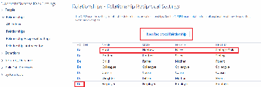
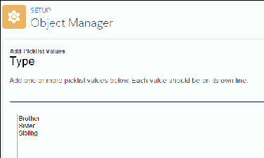
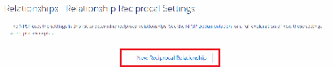
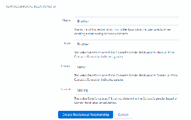
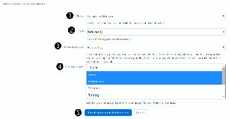

Manage Relationships Settings
This administrator-level document explains Relationships settings and how they affect Relationship
behavior.
Note Watch the Nonprofit Salesforce How-To Series video: Add New Relationship Types.
Overview
Your Relationships Settings control how Relationships behave in the Nonprofit Success Pack.
General Relationships Settings
There are three General Settings for Relationships.
Reciprocal Relationships Settings
The Reciprocal Relationships list is what the List Setting uses to determine reciprocal relationships. You
don't use Reciprocal Relationships settings if you are using the Value Inversion relationship method.
Add a New Reciprocal Relationship to the List Setting
Add a new relationship on the Relationship object and in NPSP Settings.
List Setting Scenarios
The NPSP comes with predefined list settings for some common relationships. Here are some ideas for
other common relationships you might want to add.
Relationships Autocreation Settings
Auto-created Relationships allow a custom Contact lookup field on the Contact or Campaign Member
objects to automatically trigger the creation of a new Relationship type of your choice. For example,
you might have a "Referred by" lookup field on the Campaign Member object to represent when a
person new to your organization was brought to an event by an existing constituent. Use the
Relationships Autocreation setting to have a new relationship automatically established between these
two contacts.
Enable Tabular View for Relationships Viewer
Relationships Viewer contains an optional tabular view that provides a version of Relationships Viewer
for people using screen readers.
Overview
Your Relationships Settings control how Relationships behave in the Nonprofit Success Pack.
There are three main areas to the settings:
•
General Relationships Settings
•
Reciprocal Relationships Settings
251

•
Relationships Autocreation Settings
This document walks you through each of the major areas.
You can find Relationship Settings in the Nonprofit Success Pack.
Click the NPSP Settings tab. If you don't see the tab, find it in the App Launcher ( ).
General Relationships Settings
There are three General Settings for Relationships.
•
Reciprocal Method
•
Gender Field
•
Allow Auto-Created Duplicate Relations
•
Enable Custom Field Sync
•
Fields to Exclude from Sync
Reciprocal Method
This setting is perhaps the most important of your Relationships settings, because it determines how
the Nonprofit Success Pack generates your reciprocal relationships.
Gender Field
This field specifies the gender of a Contact for the purposes of creating a reciprocal relationship. The
value in the Gender field interacts with the values in the Reciprocal Method field (described above) to
determine the correct reciprocal relationship.
Allow Auto-Created Duplicate Relations
By default, when an auto-created Relationship is triggered, and a Relationship between those Contacts
of the same Type already exists, NPSP doesn't create a new, duplicate Relationship. Override this
behavior and Salesforce will create a new Relationship each time the auto-create is triggered,
regardless of any existing Relationships.
Enable Custom Field Sync
Select Enable Custom Field Sync to sync the Relationship fields between the two Contacts in a
relationship pair.
Fields to Exclude from Sync
252

Select the Relationship fields you don't want synchronized between the two Contacts in a Relationship
pair. This setting only applies when Enable Custom Field Sync is selected.
RReecciipprrooccaall MMeetthhoodd
This setting is perhaps the most important of your Relationships settings, because it determines how the
Nonprofit Success Pack generates your reciprocal relationships.
The options are:
•
List Setting (the default) works in conjunction with gender and other predefined settings from your
Reciprocal Relationships Settings “list” (see below) to set the appropriate Type on the reciprocal
relationship. For example, if you create a relationship from a male's Contact record with Type “Son,”
the NPSP automatically creates a reciprocal relationship of “Father” on the son's record. Most people
leave the List Setting as the default and don't change it.
•
Value Inversion works to reverse the relationship where it can. The key is to enter a Type with a
delimiter around which the system will swap the words. So a Relationship with a type of "Mother-
Daughter" would receive a reciprocal Type of "Daughter-Mother.” Value Inversion does not use any of
the values in Relationship Reciprocal Settings. Instead, you only need to create picklist values on the
Relationship object's Type field for both “Mother-Daughter” and “Daughter-Mother,” as in the above
example.
With the List Setting method, Salesforce determines the appropriate gender-specific type based on one
of two methods:
•
Pre-defined Gender field: The Reciprocal Relationships setting looks for Female or Male values in a
custom field on Contact records specifically for the purpose of tracking gender (see Gender Field). This
field is not standard in Salesforce and must be created by a system administrator.
•
Salutations: In the case where Salesforce cannot identify a gender on the contact, Salesforce
evaluates the Salutation field to determine gender, if possible. (Ms. or Mrs. = Female and Mr. = Male.)
GGeennddeerr FFiieelldd
This field specifies the gender of a Contact for the purposes of creating a reciprocal relationship. The
value in the Gender field interacts with the values in the Reciprocal Method field (described above) to
determine the correct reciprocal relationship.
For example, if you create a Relationship from a "Mother" Contact record to a female Contact record, the
NPSP creates a reciprocal relationship of "Daughter," as opposed to "Son."
The Gender field can be any custom picklist or text field on the Contact record with the required values
being Male and Female. You can add other values to the picklist as well without affecting the reciprocal
relationship feature.
AAllllooww AAuuttoo--CCrreeaatteedd DDuupplliiccaattee RReellaattiioonnss
By default, when an auto-created Relationship is triggered, and a Relationship between those Contacts of
253

the same Type already exists, NPSP doesn't create a new, duplicate Relationship. Override this behavior
and Salesforce will create a new Relationship each time the auto-create is triggered, regardless of any
existing Relationships.
This setting is specific to the feature that auto-creates relationships based on a custom lookup field. (See
Relationships Autocreation Settings for more information.)
EEnnaabbllee CCuussttoomm FFiieelldd SSyynncc
Select Enable Custom Field Sync to sync the Relationship fields between the two Contacts in a
relationship pair.
This setting includes all fields on the Relationship object, except for fields that you identify in Fields to
Exclude from Sync.
FFiieellddss ttoo EExxcclluuddee ffrroomm SSyynncc
Select the Relationship fields you don't want synchronized between the two Contacts in a Relationship
pair. This setting only applies when Enable Custom Field Sync is selected.
This setting only applies when Enable Custom Field Sync is selected.
Reciprocal Relationships Settings
The Reciprocal Relationships list is what the List Setting uses to determine reciprocal relationships. You
don't use Reciprocal Relationships settings if you are using the Value Inversion relationship method.
Here's how it works: If Salesforce can determine the contact's gender (based on the user-defined gender
field or the salutation), then the reciprocal relationship is created using the value that matches the
gender. If no Gender is specified, then Salesforce uses the Neutral value.
For example, in the following image, line 1 shows that if you create a Relationship from a male Contact
record to a Contact whose type is Aunt, the automatic reciprocal relationship will show the male contact
as her Nephew. Similarly, if you create the Relationship from a female Contact record to an “Aunt,”
Salesforce creates the reciprocal relationship showing the female contact as a Niece. If no Gender is
specified on the male or female contact's record, then Salesforce uses the Neutral value, in this case,
“Sibling's Child.”
254

You can add new reciprocal relationships by clicking New Reciprocal Relationship. (See Add a New
Reciprocal Relationship to the List Setting for details.)
To delete relationships, click Del; doing this does not affect any existing Relationships.
Note If you delete a Relationship from Reciprocal Relationship Settings, you'll also need to delete
the picklist value from the Type field on the Relationship object. Otherwise, users will still be able to
select the Relationship Type on a record.
Add a New Reciprocal Relationship to the List Setting
Add a new relationship on the Relationship object and in NPSP Settings.
To add a new Relationship option, follow these steps:
•
Update the Relationship Type Picklist field
•
Create the Reciprocal Relationship in Reciprocal Relationships Settings
Update the Relationship Type Picklist field
Before you can create a new Relationship Type, you must first add the value(s) to the Relationship
object's picklist field.
Create the Reciprocal Relationship in Reciprocal Relationships Settings
Set up reciprocal relationships in NPSP Settings.
UUppddaattee tthhee RReellaattiioonnsshhiipp TTyyppee PPiicckklliisstt fifieelldd
Before you can create a new Relationship Type, you must first add the value(s) to the Relationship
object's picklist field.
11.. Click , then click Setup.
22.. Click the Object Manager tab.
33.. From the list of objects, select Relationship.
44.. Click Fields & Relationships.
55.. In the list of fields, click Type. You may have to click View All to find the field.
66.. Under Picklist Values, click New.
77.. Type the new values into the text box, placing each on separate line.
255

88.. Click Save.
CCrreeaattee tthhee RReecciipprrooccaall RReellaattiioonnsshhiipp iinn RReecciipprrooccaall RReellaattiioonnsshhiippss SSeettttiinnggss
Set up reciprocal relationships in NPSP Settings.
11.. Back at the Relationship Settings tab, under Reciprocal Relationship Settings, click New Reciprocal
Relationship.
22.. Fill out the text boxes and click Create Reciprocal Relationship.
256

In this example we are saying that, whenever someone saves a relationship with a Type (Name) of
“Brother”:
•
If the reciprocal contact is male, create a reciprocal relationship of Brother.
•
If the reciprocal contact is female, create a reciprocal relationship of Sister.
•
If the reciprocal contact's gender is undefined, create a reciprocal relationship of Sibling.
Note In this use case, we would normally define two more Reciprocal Relationship Types – one for
Sister and one for Sibling – so that Salesforce would know what to do with all new types we've
added.
List Setting Scenarios
The NPSP comes with predefined list settings for some common relationships. Here are some ideas for
other common relationships you might want to add.
Siblings
For tracking siblings we suggest that you add these List Setting entries:
Name Male Female Neutral
Brother Brother Sister Sibling
Sister Brother Sister Sibling
Sibling Brother Sister Sibling
Deceased Spouses
For tracking deceased spouses we suggest that you add these List Setting entries:
Name Male Female Neutral
Widow Deceased Spouse Deceased Spouse Deceased Spouse
Widower Deceased Spouse Deceased Spouse Deceased Spouse
Deceased Spouse Widower Widow Surviving Spouse
Divorces and Former Spouses
For tracking divorces and former spouses we suggest that you add these List Setting entries:
Name Male Female Neutral
Ex-Husband Ex-Husband Ex-Wife Former Spouse
Ex-Wife Ex-Husband Ex-Wife Former Spouse
257

Name Male Female Neutral
Former Spouse Ex-Husband Ex-Wife Former Spouse
Relationships Autocreation Settings
Auto-created Relationships allow a custom Contact lookup field on the Contact or Campaign Member
objects to automatically trigger the creation of a new Relationship type of your choice. For example, you
might have a "Referred by" lookup field on the Campaign Member object to represent when a person
new to your organization was brought to an event by an existing constituent. Use the Relationships
Autocreation setting to have a new relationship automatically established between these two contacts.
Note Watch the Nonprofit Salesforce How-To Series video about Relationship Autocreation.
Before adding a new Auto-Created Relationship, an administrator must do the following:
11.. Create a custom contact lookup field on either the Contact or Campaign Member.
22.. Update the picklist values on the Relationship object's Type field (if they don't already exist – see the
previous sections).
33.. Add new Reciprocal Relationships in NPSP Settings (if they don't already exist – see the previous
sections).
Note If you don't see the NPSP Settings tab in your org, you can find it in the App Launcher.
Add a New Auto-Created Relationship
Add your custom relationship to Relationship Autocreation in NPSP Settings.
AAdddd aa NNeeww AAuuttoo--CCrreeaatteedd RReellaattiioonnsshhiipp
Add your custom relationship to Relationship Autocreation in NPSP Settings.
Navigate back to the NPSP Settings tab, select Relationships | Relationships Autocreation, and click
New Automatic Relationship. Then:
11.. Select the Object with which you want to make the association.
22.. Select the Object Field. The example below shows a “Referred By” custom Contact lookup field,
created on the Campaign Member Object.
33.. Choose the Type of the Relationship. The reciprocal Type will automatically be created as well.
44.. Select the Campaign Types on which this auto-create should fire.
55.. Click Create Automatic Relationship.
66.. (Optional) Create a new Automatic Relationship for each field that should trigger an auto-creation.
258

Note Special thanks to Brian Pickett, who also contributed to this documentation.
Enable Tabular View for Relationships Viewer
Relationships Viewer contains an optional tabular view that provides a version of Relationships Viewer for
people using screen readers.
11.. Click , then click Setup.
22.. Enter Profiles in Quick Find and select Profiles.
33.. Find the profile you wish to edit and click its name.
44.. Click Apex Class Access.
55.. Click Edit.
66.. Select and add the RelationshipsTreeGridController Apex class to Enabled Apex Classes.
77.. Save the profile.
88.. Repeat these steps for all other profiles you wish to enable tabular view for.
Optionally, add the tabular view to a Contact Lightning Record Page:
11.. In Setup, click Object Manager.
22.. Find and click Contact.
33.. Click Lightning Record Pages.
44.. Click the Lightning Page you wish to edit.
259

55.. Click Edit.
66.. Click and drag Relationships Navigator onto the page layout.
77.. Save your update.
