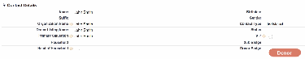
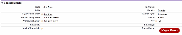
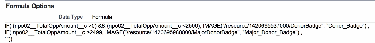
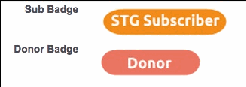
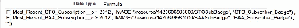
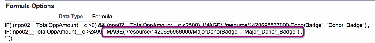
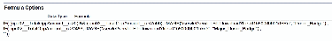

Optional NPSP Customizations
Learn about optional customizations you can do in NPSP including categorizing Contacts, adding badges
to Contacts, handling anonymous donors, and adding components to your Experience Cloud donor
portal.
An Introduction to Categorizing Contacts in Salesforce for Nonprofits
Most organizations have a need to group Contacts together based on common interests, activities, or
role. If you want to quickly and easily be able to see which people in your database are volunteers,
clients, or major donors, for instance, you have to set up Salesforce to make it easy to group those
295

Contacts for viewing, segmenting lists for campaigns, and reporting.
Adding Badges to Contact Records
Having badges auto-generated by a formula ensures data quality.
Handling Anonymous Donors With Salesforce
Do you have donors who have asked that a particular gift or all gifts from them remain anonymous?
Most nonprofits get this request from time to time, but how this is managed in their database varies
greatly. The great thing with Salesforce is you have options to how you ensure the donor's request for
anonymity is recognized while maintaining key data for your reporting and record keeping needs.
Add Experience Cloud Components to Your Donor Portal
If you have an Experience Cloud site, you can add components built for the Nonprofit Success Pack
right to your pages.
An Introduction to Categorizing Contacts in Salesforce for Nonprofits
Most organizations have a need to group Contacts together based on common interests, activities, or
role. If you want to quickly and easily be able to see which people in your database are volunteers,
clients, or major donors, for instance, you have to set up Salesforce to make it easy to group those
Contacts for viewing, segmenting lists for campaigns, and reporting.
This article was authored by Pierre Kaluzny, CEO/Founder at Sputnik Moment and Tal Frankfurt, CEO/
Founder at Cloud for Good.
Why Categorize Contacts?
Most organizations have a need to group Contacts together based on common interests, activities, or
role. If you want to quickly and easily be able to see which people in your database are volunteers,
clients, or major donors, for instance, you have to set up Salesforce to make it easy to group those
Contacts for viewing, segmenting lists for campaigns, and reporting.
Define your Categories
Each organization will have to determine what roles you want to note on your Contact records. Some
common roles include: donor, volunteer, board members, and staff. Others might be based on your
specific mission: parents, members, grantees, mentors, active clients, program alumni, etc.
Ways to Categorize Contacts
A contact can be part of multiple categories at once. For example, contacts can be both a donor and
volunteer, or a client and a volunteer.
Why Categorize Contacts?
Most organizations have a need to group Contacts together based on common interests, activities, or
role. If you want to quickly and easily be able to see which people in your database are volunteers,
clients, or major donors, for instance, you have to set up Salesforce to make it easy to group those
Contacts for viewing, segmenting lists for campaigns, and reporting.
It’s a simple concept, but there are a lot of ways to go about “categorizing” your Contacts in Salesforce.
This article walks you through some of the most basic and popular methods.
296

Define your Categories
Each organization will have to determine what roles you want to note on your Contact records. Some
common roles include: donor, volunteer, board members, and staff. Others might be based on your
specific mission: parents, members, grantees, mentors, active clients, program alumni, etc.
You should sit down with the appropriate people at your organization and determine what categories
would be useful for people to be able to use in list views, reporting, and campaigns (email, direct mail,
etc.).
Some Contacts can be assigned to a category because of their activities (donations, applications
submitted, cases logged, etc). For example, a contact who makes a donation becomes a “donor” or a
contact who has submitted an application becomes a “client.”
Other categories might be determined manually. For example you might categorize a contact based on
their role (Board Member, vendor, staff) or interest in your organization (volunteer, advocate, etc.).
Ways to Categorize Contacts
A contact can be part of multiple categories at once. For example, contacts can be both a donor and
volunteer, or a client and a volunteer.
Here are several ways of categorizing or grouping contacts in Salesforce.
Custom Fields
Custom Fields allow you to tailor your database to your unique business needs. While you can create
up to 500 custom fields on an object, don't fall into the trap of creating custom fields just because you
can. Custom fields are best used when the information is static and tracking change over time might
not be necessary.
Contact Record Types
Record types allow you to offer different organizational processes, picklist values, and page layouts to
different users. While there are no specific limits around how many record types you can have per
object, best practice is to have as few as you absolutely need. Keep it simple.
Salesforce Campaigns
In addition to the common use of Campaigns as a place to manage marketing tactics or a tool to
measure financial or social return on investment (ROI), Campaigns are also another strategy for
managing types of people and grouping or segmenting your Contacts or Leads.
Topics
Topics are words or phrases that you can associate with contact records to organize them around
common themes.
Salesforce Report Bucket Fields
Bucketing lets you quickly categorize report records without creating a formula or a custom field. It is a
very useful and fast way to sort the information into levels and nested categories. When you create a
bucket field, you define multiple categories (buckets) used to group report values.
297

Tags
Tags can sometimes be useful for individual or groups of users at your organization depending on your
needs. However, tags are very limited and we do not normally recommend activating them because
they are not reportable and they lack the ability to standardize the classification across the
organization.
CCuussttoomm FFiieellddss
Custom Fields allow you to tailor your database to your unique business needs. While you can create up
to 500 custom fields on an object, don't fall into the trap of creating custom fields just because you can.
Custom fields are best used when the information is static and tracking change over time might not be
necessary.
Examples could include classifying a contact as a "vendor" or tracking demographic information such as
ethnicity, gender, or country of origin.
Custom fields on the Contact object should not include information that you collect over time or
multiple times during your engagement with the Contact such as the change in their annual household
income, donation amounts, or volunteer hours.
If your contact record has roll-up summary fields such as Total Giving Amount or Total Volunteer Hours,
you do not need to add a custom Donor or Volunteer field on the record. You can use those fields to
create custom list views, filter reports, and do everything else you might need.
Your most important categories should be front and center on your Contact record. If you want your end
users to be able to quickly see a Contact's status without using the roll-up summary fields, you can create
“badges” for Contact categories that appear on your Contact records using formula fields. Check out
Adding Badges to Contact Records to learn how to implement badges.
CCoonnttaacctt RReeccoorrdd TTyyppeess
Record types allow you to offer different organizational processes, picklist values, and page layouts to
different users. While there are no specific limits around how many record types you can have per object,
best practice is to have as few as you absolutely need. Keep it simple.
Record types can be used in various ways, the most common of which is to assign different page layouts
for different kinds of records within the same object. For example, you might need to track different
information about mentors and mentees. For the mentee, you might want to track their grade, class, or
last transcript from school. For the mentor, their employer, availability, and mentor application would be
useful to store in Salesforce.
In order to reduce the clutter on the contact page layout, you can create “Mentor” and “Mentee” record
types and assign different page layouts to each. These record types can also have their own picklist values
available, even for the same picklist field. This is really where the different business process comes into
play and are really useful. For more record types tips and tricks, click here.
298

SSaalleessffoorrccee CCaammppaaiiggnnss
In addition to the common use of Campaigns as a place to manage marketing tactics or a tool to
measure financial or social return on investment (ROI), Campaigns are also another strategy for
managing types of people and grouping or segmenting your Contacts or Leads.
You can use Campaigns to manage mailing lists or to group people such as committee members, event
attendees, or a donor circle or level of giving. Furthermore, you can customize the Campaign member
status of each Campaign to be able to track the Contacts’ status. Campaign responses are shown on a
related list on the Contact and are easily reportable or shown in list views.
For example:
Board Members Campaign: Campaign Member Status: Prospective, Current, and Past Board Committees
Campaign: Campaign Member Status: Chair, Secretary, Treasurer Event Attendance: Campaign Member
Status: Invited, Registered, Paid, Attended, No Show Special Event Planning Campaign: Campaign
Member Status: Planning Committee, Chair, Volunteer, Staff Lead, Vendor Newsletter Campaign:
Campaign Member Status: Received, Opened, Clicked Learn about customizing Campaigns and
customizing the Campaign Member Status in Salesforce Knowledge.
TTooppiiccss
Topics are words or phrases that you can associate with contact records to organize them around
common themes.
Topic can be used to filter your Contact list views. And if you are using Chatter, topics added to records
become links to topic detail pages, where associated records appear on the Records tab for easy access.
For example, you can add a Board Members topic to a number of contacts. You could then use that topic
to filter a Contact list view, or (with Chatter) view the contacts together on the Records tab of the Board
Members topic page. Using Topics requires some end-user training and commitment to consistent
adoption and use.
SSaalleessffoorrccee RReeppoorrtt BBuucckkeett FFiieellddss
Bucketing lets you quickly categorize report records without creating a formula or a custom field. It is a
very useful and fast way to sort the information into levels and nested categories. When you create a
bucket field, you define multiple categories (buckets) used to group report values.
For example, create a bucket field named Donor Level Based on the Total Gifts Field (NPSP). Then, create
buckets that group records into “Large,” “Medium,” or “Small” ranges that you define.
TTaaggss
Tags can sometimes be useful for individual or groups of users at your organization depending on your
needs. However, tags are very limited and we do not normally recommend activating them because they
are not reportable and they lack the ability to standardize the classification across the organization.
299

With that covered, tags are words or short phrases that you can associate with most Salesforce records to
describe and organize their type of data in a personalized way. Use tags to group records from various
objects by a common theme or use and then use those tags in search to make finding information fast
and intuitive.
For example, if you met a number of contacts and leads at a conference, you might tag them all with the
phrase 2015 Gala. You could then search for the 2015 Gala tag and click that tag in search results to
retrieve those records.
Salesforce supports two types of tags.
•
Personal tags are private. Only you can view any personal tags that you add to a record.
•
Public tags are shared among all users in an organization. Any user with access to the record can view
the public tags that you add.
Tags need to be activated by your administrator and are not available out of the box.
There are many ways to group Contacts in Salesforce. The key is to determine the best methods for your
organization and then ensure consistent use of those strategies by all your users. And don’t be afraid to
apply these principles outside of the Contact object. Creating groups or categorization can also apply to
organizations or what Salesforce calls Accounts.
Adding Badges to Contact Records
Having badges auto-generated by a formula ensures data quality.
thank_you Special thanks to the team at Patron Technology as well as Francis Pindar and Greg
Malpass for their help and contributions with this article.
Nonprofits often request a “Type" picklist that includes values like “Donor” and “Volunteer." The trouble
with that approach is that the list never gets updated after the initial setup - no-one remembers to go
back and update the picklist if a Contact's status changes. Generally, it is better to have these values
generated by a formula so that they can update automatically and even better to have the formula
display an image, or a “badge” that indicates someone’s status at-a-glance.
Creating the fields on the Contact Record
See some examples of creating fields on the Contact Record.
Add Your Images as Static Resources
The most time-consuming part of setting up these badges for me was creating the graphics! I used
Google Drawings, but a marketing colleague could probably whip them up for you in a few minutes.
Creating the fields on the Contact Record
See some examples of creating fields on the Contact Record.
Here are some examples of Contact donor badges we created at Seattle Theatre Group:
300

And here’s the formula that allocates a badge to a Contact, based on their giving levels (using the "Total
Gifts" field from the Nonprofit Success Pack ):
So for anyone where the value of Total Gifts is greater than 0 and less than $2500, the Donor badge will
be displayed. For anyone who has given more than $2,499, the Major Donor badge will be displayed.
And for non-donors, the field will be left blank.
If you’ve tried a formula like this before, I’m sure you’ll see how you could add a date range to limit to
more recent gifts as well.
We also have a badge for our subscribers (some people have two badges because they both donate and
subscribe):
Subscription records are in a custom object that rolls up to Contact, so we have a “Most Recent
Subscription” field just like with gifts, and that drives the formula here:
You could easily adapt this technique for volunteers (Total Volunteer Hours greater than 0) or for
memberships (using a count of membership records or the most recent membership start date) or really
any kind of related record that you can summarize on the Contact record.
301

Add Your Images as Static Resources
The most time-consuming part of setting up these badges for me was creating the graphics! I used
Google Drawings, but a marketing colleague could probably whip them up for you in a few minutes.
My badges are around 35 pixels high and between 115 and 150 wide depending on the label, and they
are saved as .PNG files so they are very compact (around 5KB each). There are two ways to include
images in your formulas in NPSP. I used to upload them as Documents, but now I add them as Static
Resources instead. (The formula reference is simpler and the images will still be available to you in a
sandbox.)
Search for Static Resources (under Setup → Build → Develop) and click on [New].
You need to give your badge a name with no spaces (like a Field Name). Choose your graphics file and
set the Cache Control to “Public”. Click [Save].
Then click on the View file link. The badge will open in a new window. Select the URL from "/resource"
onwards and copy it - you will need this for your formula.
Here’s the syntax for the formula again - note that you need to add IMAGE (“ before your reference and “,
“title”) after it.
If you’d rather use the Documents folder for your badge graphics (it works too!), start by creating a new
Documents folder for your badges and then upload them as Externally Available Images.
This time you just need the Salesforce ID for the document. Copy the URL reference after ".com/"
302

and then your syntax formula looks like this:
Handling Anonymous Donors With Salesforce
Do you have donors who have asked that a particular gift or all gifts from them remain anonymous? Most
nonprofits get this request from time to time, but how this is managed in their database varies greatly.
The great thing with Salesforce is you have options to how you ensure the donor's request for anonymity
is recognized while maintaining key data for your reporting and record keeping needs.
Note Special thanks to Paige Van Riper, Director of Services at Cloud for Good.
Donation Level Anonymity
Some donors just wish to have the occasional gift be anonymous for recognition purposes.
Donor Level Anonymity
If the donor wishes to always be anonymous there are several ways you can structure that in Salesforce
depending on the level of anonymity that is needed.
Invisible Donors
In the circumstance that the anonymous donor should not be visible to all users, things get more
complicated.
Donation Level Anonymity
Some donors just wish to have the occasional gift be anonymous for recognition purposes.
In this instance, I recommend creating a custom checkbox field on the Opportunity object and checking
that box for those gifts the donor has requested be anonymous. When it comes time to pull lists for your
annual report, website, newsletter, donor wall or other form of recognition, make sure you include a filter
to exclude those gifts.
Donor Level Anonymity
If the donor wishes to always be anonymous there are several ways you can structure that in Salesforce
depending on the level of anonymity that is needed.
303

If it is okay for your staff users to know who the donor is and you simply need to ensure that their gifts
are not publicly recognized, you can create a custom field on the Account and Contact objects such as a
checkbox called Anonymous and in the help text clarify that checking the box means the donor wishes
for all of their gifts to remain anonymous. You would then make sure that any time you run lists or
reports for recognition purposes you exclude these folks or, if you include anonymous gifts in your
recognition lists, make sure the name is Anonymous on those.
If you have a combination of anonymous donors and anonymous gifts you could create a workflow rule
that would automatically check the Anonymous box on the opportunity if the Anonymous box was
checked on the Account. If the anonymity is indicated at the Contact level and not the Account level
you’d need to create a trigger to automatically check the box on all Opportunities from that Contact.
You could also add a custom text field on Opportunities for recognition name. You could either manually
complete that with the name the donor wishes to have used for recognition or you could create a
workflow rule that fills that text field with Anonymous if the Anonymous checkbox is checked or the
account name from the Opportunity if it is not marked anonymous.
Invisible Donors
In the circumstance that the anonymous donor should not be visible to all users, things get more
complicated.
With profiles and field level security, you could prevent most users from being able to see a certain field.
You wouldn’t want to do this with the standard name fields as obviously your users need to be able to
see most donors’ names. What you could do is create a custom field on the Contact (and Account if
needed) object for the person’s real name and limit access to this field to only those who should see it.
Then you could assign a pseudonym to be used in the standard name fields – you’ll want to have a
protocol for how those pseudonyms are created such as Anonymous DonorI, Anonymous DonorII,
Anonymous DonorIII, etc.
Another approach would be to hide all donation data for anonymous donations from all but a select
group of users. To do that you would need to change the Organization Wide Default share settings to
Private for Opportunities. Then you can create a sharing rule that shares all donations which are not
marked Anonymous will all users. Then create another sharing rule that shares anonymous donations
with the select group of users you wish to have access. Keep in mind when users who do not have access
to anonymous donations run a report, it will not include anonymous donations in the totals. If your
organization shows giving roll-up summaries on the Contact, you may need to adjust the visibility on
those fields as well.
Note Watch the Nonprofit Salesforce How-To Series video: share settings
Add Experience Cloud Components to Your Donor Portal
If you have an Experience Cloud site, you can add components built for the Nonprofit Success Pack right
to your pages.
304

New to Experience Cloud? Check out this documentation and this trail for information and guidance.
Note You must have an Experience Cloud license to use these components.
Set Up Permissions for Donor Portal Components
Give your donor portal users access to the Donor Portal components by setting them up with the Partner
license and necessary permissions. To grant the permissions, edit or create a profile, adjust a couple
things in your Experience Cloud site, and then edit or create a Sharing Set. Let’s go through it step by
step.
After installing the NPSP package, customize an existing profile or create a new one for your donor portal
users.
11.. In Setup, enter Profiles in the Quick Find box, then click Profiles.
22.. Click the name of an existing donor portal profile to edit it. Alternatively, click New Profile, choose a
profile to clone, and save.
33.. Click Apex Class Access, then click Edit, enable these Apex classes, and save:
••
npsp.DonationHistoryController
••
npsp.DonationHistorySelector
••
npsp.DonationHistoryService
••
npsp.PS_GatewayManagement
••
npsp.RD2_ETableController
••
npsp.RD2_ElevateInformation_CTRL
••
npsp.RD2_EntryFormController
••
npsp.RD2_QueryService
••
npsp.UTIL_AuraEnabledCommon
44.. In the profile, switch to Object Settings, and assign Read access to the following objects and fields:
Objects Fields
Account Primary Contact
Campaign N/A
Contacts Email, Total Gifts, Total Gifts Last Year, Total Gifts
This Year
Opportunities Amount, Primary Contact
Payments Paid, Payment Method
Recurring Donations ACH Last 4, Card Expiration Month, Card
Expiration Year, Card Last 4, Number of Paid
305

Objects Fields
Installments, Last Donation Date, Next Donation
Date, Elevate Recurring Id
55.. Assign Read and Edit access to the following object and fields:
Object Field
Recurring Donations Account, Amount, Campaign, Status Reason,
Contact, Date Established, Day of Month,
Effective Date, Installment Frequency,
Installment Period, Number of Planned
Installments, Payment Method, Recurring Type,
Status
Next, adjust your Experience Cloud site settings.
11.. In Setup, enter Digital Experiences in the Quick Find box, then click All Sites.
22.. Click Workspaces next to your site name.
33.. Click Administration.
44.. Click Members.
55.. In the Select Profiles section of the Members tab, select the profile you use for donor portal users.
66.. Save your work.
Last, edit an existing or create a new sharing set.
11.. In Setup, enter Digital Experiences in the Quick Find box, then click Settings.
22.. Under Sharing Sets, click Edit next to an existing sharing set or New.
33.. If you create a new sharing set, name it. For example, name it something like Donor Portal
Sharing Set.
44.. Under Select Profiles, select the profile you use for donor portal users.
55.. Under Select Objects, select the Opportunity object.
aa.. To add the Donor History and Giving Summary components, select the Opportunity object.
bb.. To add the Recurring Donation object, select Recurring Donation.
66.. Under Configure Access, add the following settings to your Sharing Set:
306

aa.. Select npsp__Primary_contact__c as the Target Opportunity.
bb.. Opportunity object:
aa.. Select Contact as the User.
bb.. Select Primary_contact_c as the Target Opportunity.
cc.. Select Read Only as the access level.
dd.. Save your work.
cc.. Recurring Donations object:
aa.. Select Contact as the User.
bb.. Select npe3__Contact__c as the Target Recurring Donation.
cc.. Select Read/Write as the access level.
dd.. Save your work.
And you’re done! Nice job. To check your work, log in as a donor portal user and view the components
you added.
Donation History Component
The Donation History component gives your donors one place to view details about when and how
much they’ve donated, saving them the effort of having to dig through emails for receipts.
Note Only hard credits are included.
Giving Summary Component
The Giving Summary component lets donors see how much they’ve donated over time. The component
includes three totals: lifetime donations, this year’s donations, and last year’s donations.
Note Only hard credits are included.
Recurring Donation Component
Allow donors to view and update their Recurring Donations. Donors can change the amount or
frequency, stop their Recurring Donations, and if the donation was initiated through Elevate, update their
payment method.
If you're using Elevate, customize the component table headers to show all Recurring Donations or limit
307

