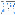

Tableau with NPSP

Tableau Dashboards for Nonprofit Fundraising combine the power of NPSP and Tableau, providing three

ready-made dashboards for insights on your revenue, donors, campaigns, and more.

Your dashboards and reports can be connected to your org and running in minutes. After opening the

dashboards in Tableau, you can fully customize them to fit your preferences. After opening the

dashboards in Tableau, you can fully customize them to fit your preferences.

Alternatively, you can quickly turn your user data into actionable insights with Tableau while you

familiarize yourself with the robust reporting capabilities in NPSP. Learn more in the NPSP Reports

Workbook.

Here is an example of a Tableau Dashboard Starter screen:

Try Out Tableau Dashboard Starters with NPSP

Download and install the Salesforce Nonprofit Fundraising accelerator for Tableau.

Try Out Tableau Dashboard Starters with NPSP

Download and install the Salesforce Nonprofit Fundraising accelerator for Tableau.

To get started, visit the Tableau website to find and download the Salesforce Nonprofit Fundraising

accelerator. See the Tableau Dashboards for Nonprofit Fundraising Quickstart Guide for additional

details.

Additional Resources

Tableau Dashboards for Nonprofit Fundraising Trailhead

Tableau Support - Knowledge Base

Tableau Desktop and Web Authoring Help

GDPR for NPSP

Find out more about GDPR for NPSP.

Note Watch the Nonprofit Salesforce How-To Series video about GDPR for NPSP.

628

