Legacy NPSP Documentation

Documentation for legacy NPSP features.

NPSP Donation Rollups

Learn about legacy NPSP donation rollup summaries and how to add single-payment donations.

Legacy NPSP Recurring Donations

Create, managed, and delete legacy recurring donations. Learn about standard field mappings with

Opportunities and other features for legacy recurring donations.

General Legacy NPSP Information

Documentation for old NPSP setup and features like legacy account models and NPSP Data Loader

help text mapping.

Legacy NP Starter Pack

Legacy documentation for Nonprofit Starter Pack.

NPSP Donation Rollups

Learn about legacy NPSP donation rollup summaries and how to add single-payment donations.

Add a Single-Payment Donation

Enter one-off donations for individuals or organizations into NPSP.

NPSP Out-of-Box Donation Rollups (Legacy)

In the Nonprofit Success Pack, rollups are tallies of donations from different Opportunity records.

User Defined Rollups (Legacy)

Review the basics of legacy user defined rollups. Create a user defined rollup and use formula fields to

include or exclude fields in your rollups calculations.

Add a Single-Payment Donation

Enter one-off donations for individuals or organizations into NPSP.

Tip See Manage Donations in Salesforce if you're just starting out and need more info about how

Opportunities and donations work in Salesforce.

Note This article describes the process of manually recording a donation in NPSP, which is typically

done when you receive a check or cash donation. This article doesn't cover payment processing. For

information on an end-to-end online fundraising solution which includes payment processing, see

the Elevate product documentation.

Individual Donations versus Organizational Donations

Nonprofit Success Pack lets you enter donations from individuals, as well as donations from

companies or organizations.

629

Add a Single-Payment Donation for an Individual

Start from a contact record to create a simple donation record for an individual gift. The New Donation

button helps you create a new opportunity.

Add a Single-Payment Donation for an Organization

Start from an account record to track a simple gift made by a company, foundation, or other

organization. The New Donation button helps you create an opportunity.

Individual Donations versus Organizational Donations

Nonprofit Success Pack lets you enter donations from individuals, as well as donations from companies

or organizations.

You enter donations from individuals on the Contact record, and donations from organizations on the

Account record.

Add a Single-Payment Donation for an Individual

Start from a contact record to create a simple donation record for an individual gift. The New Donation

button helps you create a new opportunity.

11.. Search for the Contact associated with the donation.

22.. Click New Donation. This will create an Opportunity with the Donation record type. This is typically the

best record type for one-time, received gifts. If you don't see this button on your record, see Add or

Edit a New Opportunity Button on Contacts.

33.. Fill in the donation fields.

••

Close Date: The date you expect to receive the funds. The default is today's date.

••

Stage: In the sales world, opportunities are “closed,” so we're also using that lingo for our donation.

The default "Closed Won" stage has internal meaning to Salesforce overall because it triggers

rollups. You can change to different default Stage if you prefer.

••

Amount: This should be the Amount that your donor will be credited for the gift.

••

Primary Campaign Source: Donations are typically attached to Campaigns. Select an existing Active

Campaign or select + New Campaigns to create a new one.

••

Opportunity Name (not shown): If you have NPSP Opportunity Naming enabled, when you save

the record it will be updated to the value as you've defined there.

630

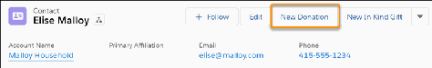

44.. Save the record. Salesforce creates a Payment record for the new donation, and that Payment appears

in the Payments related list of the Opportunity record you just created. You can see the Donation

(Opportunity) you just created if you look at the Opportunity related list on the Contact record.

55.. Edit this Opportunity to fill in additional fields.

631

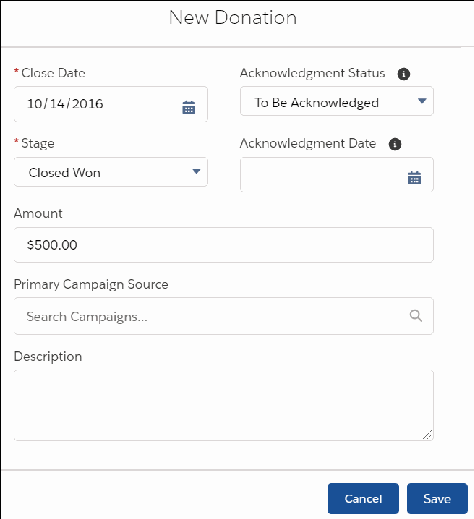

Add a Single-Payment Donation for an Organization

Start from an account record to track a simple gift made by a company, foundation, or other

organization. The New Donation button helps you create an opportunity.

11.. Search for or create the Organization Account record associated with the donation.

22.. On the Account record, click New Donation.

33.. Fill in the donation fields:

••

Close Date: The date you expect to receive the funds. The default is today's date.

••

Stage: Defaults to Closed Won.

••

Amount: This should be the Amount that the donor will be credited for the gift.

••

Primary Campaign Source: Donations are typically attached to Campaigns. Select an existing Active

Campaign or select + New Campaigns to create a new one.

Your administrator may have created other required fields for your organization, so you may need to fill

those in too.

632

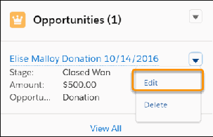

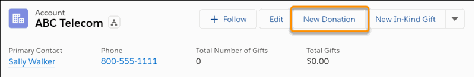

44.. Click Save.

Salesforce creates a Payment record for the new donation, and that Payment appears in the Payments

related list of the Opportunity record you just created.

A bit about Household donations . . .

The Nonprofit Success Pack also lets you enter donations from a Household (i.e. from the Household

Account record), in the same way that you would enter a donation from an organization. When you do

so, the Primary Contact for the Household receives the hard credit for the donation, with the rest of the

members in the household receiving soft credits. You get the same result when you enter Household-

wide donations as individual donations from the Household's Primary Contact—most organizations enter

gifts this way.

Note NPSP automatically sets the Primary Contact to the first Contact associated with the

633

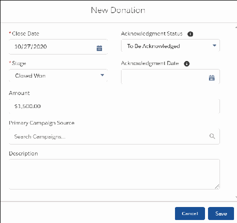

Household. If you want to change it, use Manage Household on the Household Account record.

NPSP Out-of-Box Donation Rollups (Legacy)

In the Nonprofit Success Pack, rollups are tallies of donations from different Opportunity records.

What Are NPSP Out-of-Box Rollups and How Do They Work?

NPSP includes approximately 87 out-of-box rollups. These rollups are all based on the Opportunity

Amount and Opportunity Close Date, and calculate Opportunities with a Closed/Won stage.

Rollup Fields on Accounts and Contacts

The following sections on the Account and Contact objects contain information from their related

Opportunities.

When Are Opportunity Rollups Updated?

Rollup values on a specific Account or Contact are re-tallied when key fields are updated on related

Opportunities such as Amount, Stage, and Close Date. In addition, rollup values are recalculated

nightly to ensure accuracy.

What Are NPSP Out-of-Box Rollups and How Do They Work?

NPSP includes approximately 87 out-of-box rollups. These rollups are all based on the Opportunity

Amount and Opportunity Close Date, and calculate Opportunities with a Closed/Won stage.

Note This topic is specific to the NPSP out-of-box rollups and provides information on how they

work. To find out more about Customizable Rollups and User Defined Rollups (the other rollup

options available in NPSP), see the Rollups Overview.

These rollup fields appear on Accounts, Contacts, Households, Recurring Donations, and General

Accounting Units, and display aggregated totals based on their related Opportunities.

634

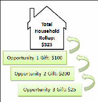

In the Nonprofit Success Pack, Account and Contact records include several rollup fields that display

totals based on their related Opportunities:

•

Membership Information

•

Total Gifts

•

Soft Credits

•

Household Donations

•

Donation Statistics

This image shows the Opportunity Rollups for an Organization Account. Most fields with totaled values

are rollup fields that show us aggregated values from related Opportunity records.

Notice the Donation Totals section includes a Total Number of Gifts (eight Opportunities) and a Total

Gifts amount of $2700. To determine the exact Opportunities and their details for this rollup, you would

need to examine this Account and look at all the related Opportunities for the details. The rollup,

however, gives you very useful aggregate information about all Opportunities.

Rollup Fields on Accounts and Contacts

The following sections on the Account and Contact objects contain information from their related

Opportunities.

Donation Information

This section shows useful statistics and gives you a quick, high-level overview about donations

635

(Opportunities) associated with a particular Account.

Donation Totals

This section gives you running totals of donations received from this Account over different periods of

time. For example, you can see the Donation totals from this year, the previous year, and from two

years ago. You can also configure a custom period.

Membership Information

This section contains the rollup information if your organization uses memberships.

Additional Rollup Information on Contacts

In addition to these sections, Contact records also include rollup information about soft credits as well

as Household donation information, which is a rollup of the total donations made by everyone else in

the household. Soft credits, and the contact roles responsible for creating them, are a major though

complicated feature in Nonprofit Success Pack.

DDoonnaattiioonn IInnffoorrmmaattiioonn

This section shows useful statistics and gives you a quick, high-level overview about donations

(Opportunities) associated with a particular Account.

You'll find information about donation dates, the average, largest, and smallest donation amounts, and

so on.

DDoonnaattiioonn TToottaallss

This section gives you running totals of donations received from this Account over different periods of

time. For example, you can see the Donation totals from this year, the previous year, and from two years

ago. You can also configure a custom period.

In Total Gifts Last N Days, N can be set to a period of your choice; the default setting is 365 days.

Where you set the value of N depends on whether you're using Customizable Rollups, or one of the

older, legacy types of rollups. See the instructions below for the type of rollups configured in your org.

Customizable Rollups:

11.. Click the NPSP Settings tab in the Nonprofit Success Pack. If you don't see NPSP Settings, you can find

it from the App Launcher.

22.. Select Donations | Customizable Rollups.

33.. Click Configure Customizable Rollups .

44.. Find the rollup whose N day value you want to edit, and click , then click Edit.

55.. Edit the value in the Days Back field.

636

66.. Click Save.

Legacy Rollups (User Defined Rollups, out-of-the-box rollups):

11.. Click the NPSP Settings tab in the Nonprofit Success Pack. If you don't see NPSP Settings, you can find

it from the App Launcher.

22.. Select Donations | Donor Statistics.

Note This option will not be available if you're using Customizable Rollups.

33.. Click Edit.

44.. Specify a different number of days for the Rollup N Day Value.

55.. Click Save.

MMeemmbbeerrsshhiipp IInnffoorrmmaattiioonn

This section contains the rollup information if your organization uses memberships.

For more information, see Create and Manage Memberships.

AAddddiittiioonnaall RRoolllluupp IInnffoorrmmaattiioonn oonn CCoonnttaaccttss

In addition to these sections, Contact records also include rollup information about soft credits as well as

Household donation information, which is a rollup of the total donations made by everyone else in the

household. Soft credits, and the contact roles responsible for creating them, are a major though

complicated feature in Nonprofit Success Pack.

637

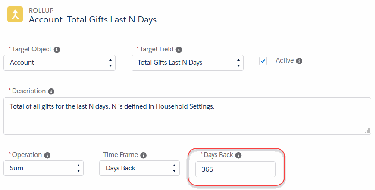

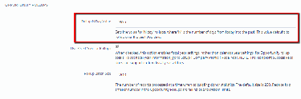

To learn more, see Soft Credits Overview.

Important Consider rollup fields read only (and if you are the administrator for your organization,

we recommend setting them as read only on page layouts). Salesforce administrators can still edit

rollup fields in place, but any edits you make to these fields are overwritten when rollups are

recalculated.

When Are Opportunity Rollups Updated?

Rollup values on a specific Account or Contact are re-tallied when key fields are updated on related

Opportunities such as Amount, Stage, and Close Date. In addition, rollup values are recalculated nightly

to ensure accuracy.

You can also choose to run the rollup nightly operation (called a “batch operation” because it tallies

fields for multiple records at once) at any time. For more information, see Run Rollup Donations Batch.

User Defined Rollups (Legacy)

Review the basics of legacy user defined rollups. Create a user defined rollup and use formula fields to

include or exclude fields in your rollups calculations.

Note This article was written at the 2017 NPSP Sprint in Baltimore by these amazing community

members: Steve Backman, Tricia Booser, Ben Chastain, Jason Cook, Tim Forbes, Dean Graham,

Megan Himan, Ben Mozenter, Loren Serfass, Michael Smith, Emily Wilson, and Jenna Zelenetz.

Overview

User Defined Rollups (UDR) let users that work with custom fields on Opportunities summarize that

information on Accounts or Contacts. Organizations can create a User Defined Rollup to summarize

information based on an Opportunity record, and push that summary information to a field on the

Account or Contact record (or Households, for those still using the One-to-One or Individual Bucket

model).

Create a User Defined Rollup

Create a User Defined Rollup and display the result on the Contact, Account, or Household object. This

is an example of creating a rollup for Total Remaining Payment Balance for a Contact.

Use Formula Fields with User Defined Rollups

Although there is no way to directly add filters to User Defined Rollups (UDR), you can create formula

fields on the Opportunity object with logic to include or exclude records based on criteria you specify.

You then use these formula fields as the source Opportunity Field in your User Defined Rollup.

Overview

User Defined Rollups (UDR) let users that work with custom fields on Opportunities summarize that

information on Accounts or Contacts. Organizations can create a User Defined Rollup to summarize

638

information based on an Opportunity record, and push that summary information to a field on the

Account or Contact record (or Households, for those still using the One-to-One or Individual Bucket

model).

UDRs are calculated based on Closed/Won Opportunities just like out-of-box NPSP rollups, but you

define the Opportunity field to roll up, how it will roll up, and in what custom field the rollup data should

appear. Most powerfully, organizations can extend UDRs using formula filters to summarize only certain

subsets of Opportunities.

Tip In May 2018 (version 3.129), we introduced Customizable Rollups . With Customizable Rollups,

you can roll up Payments (in addition to Opportunities), create filters to include or exclude data,

and easily roll up data from more than two years ago. And when you enable Customizable Rollups ,

we'll convert all out-of-box NPSP rollups and any UDRs you've created into Customizable Rollups so

that you can update them as needed. To learn more about all of the different types of rollups

available in the Nonprofit Success Pack, see the Rollups Overview.

Create a User Defined Rollup

Create a User Defined Rollup and display the result on the Contact, Account, or Household object. This is

an example of creating a rollup for Total Remaining Payment Balance for a Contact.

11.. In Setup, create the custom field that will contain your rollup information. The field must be of the

same data type as the field you will be rolling up (the Opportunity Field). For our example, you'd create

a field with the Type = Currency and name it Total Remaining Payment Balance.

22.. Go to NPSP Settings. If you don't see the NPSP Settings tab, you can find it using the App Launcher.

33.. Click Donations | User Defined Rollups.

44.. Click New User Defined Rollup.

55.. Fill in the required fields. To follow along with the example, enter these values:

aa.. Opportunity Field = Remaining Balance

bb.. Rollup Operation = SUM

cc.. Target Object = Contact

dd.. Target Field = Total Remaining Payment Balance (Remember, this is the custom field we asked you

to create in step 1.)

639

66.. Click Create Rollup.

User Defined Rollups are calculated nightly as part of a batch. You can also manually recalculate them.

Tip To build more filtering functionality into your UDRs, you can also use formula fields as the

source Opportunity Field.

Use Formula Fields with User Defined Rollups

Although there is no way to directly add filters to User Defined Rollups (UDR), you can create formula

fields on the Opportunity object with logic to include or exclude records based on criteria you specify.

You then use these formula fields as the source Opportunity Field in your User Defined Rollup.

For example, you may want to prioritize sustaining donor engagement by displaying recurring donation

data on Contacts. To do this, you could create UDRs that aggregate current recurring giving and lifetime

recurring giving data. To filter Opportunities to only include those associated with Recurring Donations,

you could create formula fields and use them in your UDRs.

640

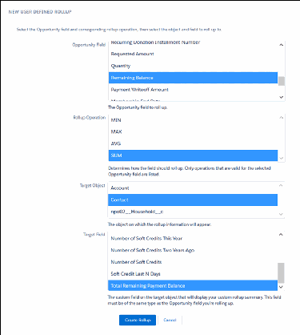

Tip With Customizable Rollups, you can easily create groups of filter rules and apply them directly to

your rollups. To learn more, check out the Customizable Rollups article on creating filter groups.

To use a formula field to filter your User Defined Rollup, follow these high level steps:

11.. Create the formula field on the Opportunity object. This will be the Opportunity Field you select for

your UDR.

22.. Create a custom field on either the Account, Contact, or Household object. This will be the Target Field

that will contain your rollup data.

33.. Create the User Defined Rollup.

Below are some example User Defined Rollups that use formula fields.

EExxaammppllee 11:: FFiirrsstt AAccttiivvee RReeccuurrrriinngg DDaattee && LLaasstt AAccttiivvee RReeccuurrrriinngg DDaattee

This example creates a UDR that finds and displays the Close Date of the earliest Opportunity associated

with a current, active Recurring Donation. You can use the same formula field to create a UDR that

displays the Close Date of the most recent Opportunity associated with a current, active Recurring

Donation.

11.. Create a formula field on the Opportunity object (to use as the Opportunity Field).

aa.. Data Type = Formula

bb.. Field Label = Recurring Date: Active

cc.. Formula Return Type = Date

dd.. Formula = IF ( ISPICKVAL (

npe03__Recurring_Donation__r.npe03__Open_Ended_Status__c, "Open" ), CloseDate

, NULL)

22.. Create a custom field on the Contact object (to use as the Target Field).

aa.. Data Type = Date

bb.. Field Label = First Active Recurring Date

cc.. Description = A date field displaying the Close Date of the earliest Opportunity associated with a

current, active Recurring Donation.

33.. Create a User Defined Rollup with these values:

aa.. Opportunity Field = Recurring Date: Active

bb.. Rollup Operation = MIN

cc.. Target Object = Contact

dd.. Target Field = First Active Recurring Date

To create a User Defined Rollup for the Last Active Recurring Date:

11.. Create a custom field on the Contact object (to use as the Target Field).

aa.. Data Type = Date

bb.. Field Label = Last Active Recurring Date

cc.. Description = A date field displaying the Close Date of the most recent Opportunity associated with

a current, active Recurring Donation.

22.. Create a User Defined Rollup with these values:

641

aa.. Opportunity Field = Recurring Date: Active

bb.. Rollup Operation = MAX

cc.. Target Object = Contact

dd.. Target Field = Last Active Recurring Date

EExxaammppllee 22:: FFiirrsstt EEvveerr RReeccuurrrriinngg DDaattee && LLaasstt EEvveerr RReeccuurrrriinngg DDaattee

This example creates a UDR that finds and displays the Close Date of the earliest Opportunity associated

with any Recurring Donation. You can use the same formula field to create a UDR that displays the most

recent Opportunity associated with any Recurring Donation.

11.. Create a formula field on the Opportunity object (to use as the Opportunity Field).

aa.. Data Type = Formula field

bb.. Field Label = Recurring Date: Ever

cc.. Formula Return Type = Date

dd.. Formula = IF ( NOT ( ISBLANK(npe03__Recurring_Donation__c)), CloseDate , NULL)

22.. Create a custom field on the Contact object (to use as the Target Field).

aa.. Data Type = Date

bb.. Name = First Ever Recurring Date

cc.. Description = A date field displaying the Close Date of the earliest Opportunity associated with any

Recurring Donation.

33.. Create a User Defined Rollup with these values:

aa.. Opportunity Field = Recurring Date: Ever

bb.. Rollup Operation = MIN

cc.. Target Object = Contact

dd.. Target Field = First Ever Recurring Date

To create a UDR for Last Ever Recurring Date:

11.. Create a custom field on the Contact object (to use as the Target Field).

aa.. Data Type = Date

bb.. Field Label = Last Ever Recurring Date

cc.. Description = A date field displaying the Close Date of the most recent Opportunity associated with

any Recurring Donation.

22.. Create a User Defined Rollup with these vales:

aa.. Opportunity Field = Recurring Date: Ever

bb.. Rollup Operation = MAX

cc.. Target Object = Contact

dd.. Target Field = Last Ever Recurring Date

EExxaammppllee 33:: RReeccuurrrriinngg DDoonnaattiioonn AAmmoouunntt

This example creates a UDR that finds and displays the Recurring Donation Amount value, if the

Opportunity is associated with a Recurring Donation record whose Open Ended Status is set to Open.

11.. Create a formula field on the Opportunity object (to use as the Opportunity Field).

642

aa.. Data Type = Formula field

bb.. Field Label = Recurring Donation Amount

cc.. Formula Return Type = Currency

dd.. Decimal Places = 2

ee.. Formula = IF ( ISPICKVAL ( npe03__Recurring_Donation__r.npe03__Open_Ended_Status__c,

"Open" ), npe03__Recurring_Donation__r.npe03__Amount__c , NULL)

22.. Create a field on the Contact object (to use as the Target Field).

aa.. Data Type = Currency

bb.. Field Label = Recurring Donation Amount

cc.. Description = A currency field displaying the Donation Amount value of a current, active Recurring

Donation.

33.. Create a User Defined Rollup with these values:

aa.. Opportunity Field = Recurring Donation Amount

bb.. Rollup Operation = MAX

cc.. Target Object = Contact

dd.. Target Field = Recurring Donation Amount

Legacy NPSP Recurring Donations

Create, managed, and delete legacy recurring donations. Learn about standard field mappings with

Opportunities and other features for legacy recurring donations.

Create Legacy Recurring Donations

Create either open-ended or fixed-length recurring donations to track a donor's intent to give regularly

into the future. These records are named automatically.

Change, Close, or Delete a Legacy Recurring Donation

When a donor wants to modify how much or how often they give—or if they want to end a recurring

donation—you need to modify or delete their recurring donation record. When you delete a recurring

donation, NPSP deletes all related opportunity records.

Standard Field Mapping for Legacy Recurring Donations

When NPSP creates child Opportunity records for a Recurring Donation, it copies the value of several

fields from the Recurring Donation onto the Opportunity records. This is a big time saver, as it means

you don't have to manually enter values for all those fields on each Opportunity record.

Create Custom Installment Periods for Legacy Recurring Donations

NPSP Legacy Recurring Donations includes five commonly used installment periods, but you can add

and remove custom installment periods as needed. For example, create an installment period for gifts

643

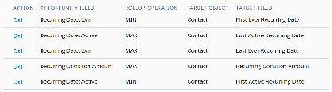

made three times a year.

Legacy Recurring Donations versus Opportunity Payments

The term "Recurring Donations" in the nonprofit world often brings to mind a donor who has

committed to giving a financial gift to your organization multiple times. In the Nonprofit Success Pack,

you can track this type of donation in different ways.

Configure Legacy Recurring Donations

Find out more about configuring legacy recurring donations.

Create Legacy Recurring Donations

Create either open-ended or fixed-length recurring donations to track a donor's intent to give regularly

into the future. These records are named automatically.

Note As of April 29th, 2020, Nonprofit Success Pack offers a new version of Recurring Donations.

For instructions on using this new version, see the Enhanced Recurring Donations Upgrade Guide. If

you're unsure which version of Recurring Donations you're using, see Which Version of Recurring

Donations Am I Using?

Overview

Nonprofit Success Pack's Recurring Donations feature helps you track gifts that donors have pledged

over a period of time. NPSP supports two types of recurring donations: open-ended and fixed-length

recurring donations.

Create an Open-Ended Recurring Donation

Open-ended recurring donations have no defined end date. Specify the gift amount and recurrence

schedule.

Create a Fixed-Length Recurring Donation

Fixed-length recurring donations have a defined end date. Specify the amount of each gift, a

recurrence schedule, and a last gift date.

Create an Open-Ended Recurring Donation from a Contact Action

If you're creating a new Open Ended Recurring Donation, you might find it easier to create it directly

from the Contact record using the provided Quick Action.

Automatic Recurring Donations Naming

By default, NPSP names your Recurring Donations automatically. Here's how it works.

Overview

Nonprofit Success Pack's Recurring Donations feature helps you track gifts that donors have pledged over

a period of time. NPSP supports two types of recurring donations: open-ended and fixed-length recurring

donations.

Open-Ended Recurring Donations are single donation amounts given over and over again, with no

ending date defined. For example, John Smith gives your organization $100/month through his work

place giving campaign, and has not specified an end date for the donation. The donation will continue

644

until you close the Recurring Donation.

Fixed-Length Recurring Donations are single donation amounts given over and over again, but for a

defined period of time. For example John Smith has pledged to give $50 a month for 3 years. Thus, the

donation continues for three years, and ends at that point. (This type of donation is similar to a standard

Salesforce Opportunity with multiple Payments attached to it. See Legacy Recurring Donations versus

Opportunity Payments for more discussion on when to use each of these methods.)

When creating a recurring donation, determine the type by setting the Open Ended Status.

Status Description

None (or blank) This value is used for Fixed-Length recurring

donations. It creates the correct number of

installments based on Installment Period and

Schedule Type. There are no new installments

added unless the number of Installments or

Schedule Type are updated.

Open This value is used to create Open-Ended recurring

donations. It creates opportunities based on the

Installment Period, but instead of creating

installments it bases the number of opportunities

on the Forecast Month setting in NPSP Settings.

Closed This value stops an open-ended recurring

donation from creating additional opportunities.

Existing Open opportunities are handled based on

the behavior specified in NPSP Settings.

Note Adding custom values to the Open Ended Status field may result in errors. Only use the values

included with NPSP.

Create an Open-Ended Recurring Donation

Open-ended recurring donations have no defined end date. Specify the gift amount and recurrence

schedule.

11.. In the Nonprofit Success Pack, click the Recurring Donations tab. If you don't see the Recurring

Donations tab, click the App Launcher ( ), then click All Items.

22.. Click New.

33.. In the Recurring Donation Name field, enter a name for the recurring donation.

44.. Enter either the Contact name or the Organization name, but not both. You can use the lookup field to

645

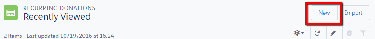

locate existing contacts and organizations in Salesforce.

55.. Enter the Recurring Donation's details:

••

Amount – The amount for each child donation.

••

Open Ended Status – Select Open. Salesforce creates opportunities based on the Installment

Period but instead of doing installments it bases the number of Opportunities on the Forecast

Month setting in NPSP Settings.

••

Date Established – Date you opened the recurring donation.

••

Next Donation Date – The date on which you want the next donation to occur. This date also

determines the date of all future donations. For example, if you enter 4/21/18 for the Next

Donation Date, and the donation is a monthly installment, then Salesforce creates the first donation

for 4/21/18, then 5/21/18 and so on.

••

Always use last day of month – When you select this checkbox, NPSP creates monthly and

quarterly installment Opportunities with the Close Date set to the last day of the month. When this

checkbox is NOT selected and the Next Payment date is the 28th, 29th, or 30th day of the month,

NPSP creates new Installment Opportunities with the Close Date set to that specific day. If the Next

Payment date is the 31st, the behavior is the same as if this checkbox was selected. This checkbox

applies only to Recurring Donations where the Installment Period is Quarterly or Monthly, or any

custom Installment Periods where the Time Period Type is Monthly.

••

Day of Month – When you set a value, NPSP creates monthly and quarterly installment

Opportunities with the Close Date set to your selected day of the month. This picklist applies only to

Recurring Donations where the Installment Period is Quarterly or Monthly, or any custom

Installment Periods where the Time Period Type is Monthly. If the Day of Month value is before Date

Established, the first donation appears in the following month.

Note If you select Always use last day of month, it takes precedence over any value you choose

in the Day of Month picklist. If you want to set the Close Date to a day that is not the last day of

the month, make sure that Always use last day of month is not selected.

••

Last Donation Date – Do Not Enter. NPSP calculates this value automatically based on the last time

a child donation was marked as Posted (for example, it records the date of your most recent child

donation).

••

Installment Period – How often you'll receive the donations.

Note Changing the installment period for an existing Open-Ended Recurring Donation may

result in the loss and re-creation of open opportunities. Any data associated with those

opportunities may be lost.

••

Installments – Do Not Enter. This option is for Fixed-Length Recurring Donations only. For Open-

Ended Recurring Donations, NPSP automatically calculates the installment number based on the

Opportunity Forecast Months setting in NPSP Settings.

••

Schedule Type – Do Not Enter. For Open-Ended donations, the value is always Multiply.

••

Campaign – If you want to attach the Recurring Donation to a campaign, use the lookup field to

select the campaign here. For more information on Salesforce Campaigns, see Campaigns in

Salesforce Help and Training.

••

Paid Amount – Do Not Enter. NPSP calculates this value automatically as the donations are made

and marked Posted.

••

Total Paid Installments – Do Not Enter. NPSP calculates this value automatically as donations are

made and marked Posted.

646

66.. Click Save.

NPSP creates the appropriate number of child donations, and marks each donation with a Pledged

staged.

As you change child donation stages from Pledged to Posted, NPSP recalculates some of the fields

described above.

647

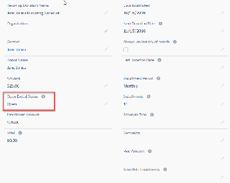

Create a Fixed-Length Recurring Donation

Fixed-length recurring donations have a defined end date. Specify the amount of each gift, a recurrence

schedule, and a last gift date.

11.. In the Nonprofit Success Pack, click the Recurring Donations tab. If you don't see the Recurring

Donations tab, click the App Launcher ( ), then click All Items.

22.. Click New.

33.. In the Recurring Donation Name field, enter a name for the recurring donation.

44.. Enter either the Contact name or the Organization name, but not both. You can use the lookup field to

locate existing contacts and organizations in Salesforce.

55.. Enter the details of the recurring donation.

••

Amount – Enter the amount for each child donation, or a total amount if you want NPSP to divide

installments up for you accordingly.

••

Open Ended Status – Select None. Salesforce creates the correct number of installments based on

the Installment Period and Schedule Type you choose. New installments aren't added unless the

Installments and/or Schedule Type are updated. The same behavior happens when you leave this

field blank.

••

Date Established – Date you opened the recurring donation.

648

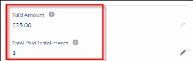

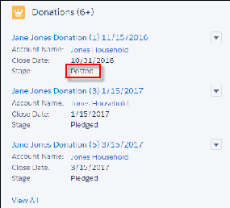

••

Next Donation Date – The date on which you want the next donation to occur. This date also

determines the date of all future donations. For example, if you enter 4/21/18 for the Next

Donation Date, and the donation is a monthly installment, then Salesforce creates the first donation

for 4/21/18, then 5/21/18 and so on.

••

Always use last day of month – When you select this checkbox, NPSP creates monthly and

quarterly installment Opportunities with the Close Date set to the last day of the month. When this

checkbox is NOT selected and the Next Payment date is the 28th, 29th, or 30th day of the month,

NPSP creates new Installment Opportunities with the Close Date set to that specific day. If the Next

Payment date is the 31st, the behavior is the same as if this checkbox was selected. This checkbox

applies only to Recurring Donations where the Installment Period is Quarterly or Monthly, or any

custom Installment Periods where the Time Period Type is Monthly.

••

Day of Month – When you set a value, NPSP creates monthly and quarterly installment

Opportunities with the Close Date set to your selected day of the month. This picklist applies only to

Recurring Donations where the Installment Period is Quarterly or Monthly, or any custom

Installment Periods where the Time Period Type is Monthly. If the Day of Month value is before Date

Established, the first donation appears in the following month.

Note If you select Always use last day of month, it takes precedence over any value you choose

in the Day of Month picklist. If you want to set the Close Date to a day that is not the last day of

the month, make sure that Always use last day of month is not selected.

••

Last Donation Date – Do not enter. NPSP calculates this value automatically based on the last time

a child donation was marked Posted (for example, it records the date of your most recent child

donation).

••

Installment Period – How often you'll receive the donations.

Note Changing the installment period for an existing Open-Ended Recurring Donation may

result in the loss and re-creation of open opportunities. Any data associated with those

opportunities may be lost.

••

Installments – Enter the number of installments (donations) you expect to receive. You can specify

the maximum number of installments in NPSP Settings.

••

Schedule Type – Select either Multiply or Divide. The option you choose tells Salesforce how to

compute the amount for each child opportunity. Let's say your donor has pledged $100 a month for

12 months. If the number in the Amount field is $100, select Multiply. If the number in the Amount

field is $1200, select Divide. NPSP will calculate the donations evenly, taking into account the

necessary pennies to meet the total donation amount.

••

Campaign – If you want to attach the Recurring Donation to a campaign, use the lookup field to

select the campaign here.

••

Paid Amount – Do not enter. NPSP calculates this value automatically as the donations are made

and marked Posted.

••

Total Paid Installments – Do not enter. NPSP calculates this value automatically as donations are

made and marked Posted.

66.. Click Save.

NPSP creates the number of child donation records (installments) and all are marked with a Pledged

stage.

649

As you change child donation stages from Pledged to Posted, NPSP recalculates some of the fields

described above.

650

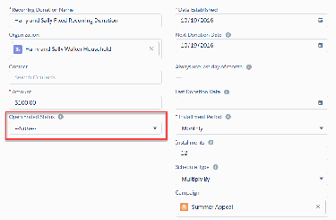

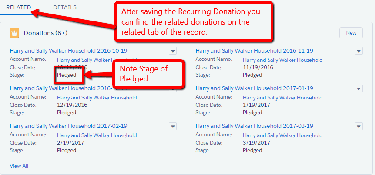

Create an Open-Ended Recurring Donation from a Contact Action

If you're creating a new Open Ended Recurring Donation, you might find it easier to create it directly

from the Contact record using the provided Quick Action.

If you don't see the button on your Contact record, see Add or Edit a New Opportunity Button on

Contacts.

11.. On the Contact record, click New Open Recurring Donation.

22.. You only need to populate these fields: Recurring Donation Name, Amount, Installment Period, and

Next Donation Date.

651

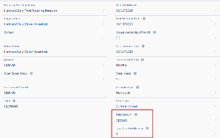

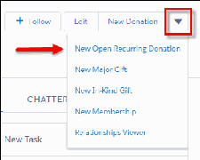

33.. The necessary Open Ended Status and Schedule Type fields are automatically populated with the

correct values when you save the record. Click Edit if you need to change any other fields.

Automatic Recurring Donations Naming

By default, NPSP names your Recurring Donations automatically. Here's how it works.

11.. Create a new Recurring Donation.

22.. Enter placeholder text in Recurring Donation Name such as "New Donation".

33.. Fill out the rest of the fields.

44.. Click Save.

Once you save the record, NPSP updates the Recurring Donation Name using this format:

[DonorName] [Amount] - Recurring

For example, if you enter a new $100 Recurring Donation for Barbara Levy, the name becomes:

652

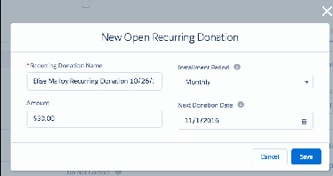

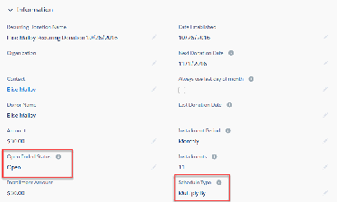

"Barbara Levy $100 - Recurring".

If you have your own naming convention that you'd rather use, you can ask your administrator to disable

Automatic Recurring Donation Naming.

Note When you update a Legacy Recurring Donation field used in the name format (such as

Amount), NPSP doesn't update the Recurring Donation Name. For example, if the Recurring

Donation Name is "Barbara Levy $100 - Recurring" and you update the Amount to $200, the record

name remains unchanged. You can update the name manually if you wish.

Change, Close, or Delete a Legacy Recurring Donation

When a donor wants to modify how much or how often they give—or if they want to end a recurring

donation—you need to modify or delete their recurring donation record. When you delete a recurring

donation, NPSP deletes all related opportunity records.

Note As of April 29th, 2020, Nonprofit Success Pack offers a new version of Recurring Donations.

For instructions on using this new version, see the Enhanced Recurring Donations Upgrade Guide. If

you're unsure which version of Recurring Donations you're using, see Which Version of Recurring

Donations Am I Using?

Change a Recurring Donation

Sometimes you may need to change a Recurring Donation based on new information from your

donor. They may decide to shorten or lengthen the time frame of giving or perhaps increase or

decrease the amount of each installment.

Close a Recurring Donation

When a donor wants to end a recurring gift, you can close the recurring donation record. Related open

opportunity records are marked as Closed Lost by default, while Post opportunities are unchanged.

Delete a Recurring Donation

When you delete a Recurring Donation, NPSP deletes associated Opportunities.

Change a Recurring Donation

Sometimes you may need to change a Recurring Donation based on new information from your donor.

They may decide to shorten or lengthen the time frame of giving or perhaps increase or decrease the

amount of each installment.

In this situation, you can edit the Recurring Donation record but be aware that NPSP deletes and re-

inserts any related open stage Opportunity records, which can result in lost data. For this reason we

recommend that you close the Recurring Donation and create a new one.

You can also click Refresh Opportunities to schedule future Opportunities for the Recurring Donation

and recalculate rollups.

653

Close a Recurring Donation

When a donor wants to end a recurring gift, you can close the recurring donation record. Related open

opportunity records are marked as Closed Lost by default, while Post opportunities are unchanged.

11.. Navigate to the Recurring Donation you want to close.

22.. Click Edit.

33.. Select Closed in the Open Ended Status field.

44.. (Optional) Select a Closed Reason.

55.. Click Save.

All open child donations will be changed to a Closed Lost stage by default, or whatever you've specified

in your Recurring Donations settings. Donations marked Posted remain unchanged.

On the Donations related list:

654

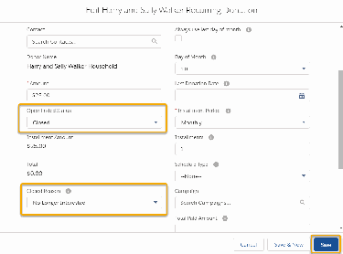

Delete a Recurring Donation

When you delete a Recurring Donation, NPSP deletes associated Opportunities.

If there are any associated Closed/Won Opportunities, you won't be able to delete the Recurring

Donation. You must first delete these records manually before you can delete the Recurring Donation.

Standard Field Mapping for Legacy Recurring Donations

When NPSP creates child Opportunity records for a Recurring Donation, it copies the value of several

fields from the Recurring Donation onto the Opportunity records. This is a big time saver, as it means you

don't have to manually enter values for all those fields on each Opportunity record.

Note As of April 29th, 2020, Nonprofit Success Pack offers a new version of Recurring Donations.

For instructions on using this new version, see the Enhanced Recurring Donations Upgrade Guide. If

you're unsure which version of Recurring Donations you're using, see Which Version of Recurring

Donations Am I Using?

Standard Field Mapping

This table describes how NPSP maps fields from the Recurring Donation to its child Opportunity

records when the Recurring Donation is first created.

Custom Field Mapping

It's great that NPSP automatically copies key information from standard Recurring Donation fields to

Opportunity fields. But what if you want to map custom fields as well? You're in luck because NPSP lets

you do just that!

Standard Field Mapping

This table describes how NPSP maps fields from the Recurring Donation to its child Opportunity records

when the Recurring Donation is first created.

655

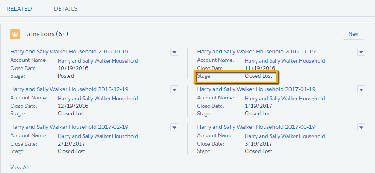

If you edit the Recurring Donation record, NPSP deletes and re-inserts any related open stage

Opportunity records, which can result in lost data.

Note For a refresher on what Open Ended and Fixed Length Recurring Donations are, refer to

Recurring Donations: Overview and Setup.

Recurring Donation Opportunity Field Explanation Open Ended/ Fixed

Field Length

Created By Created By NPSP copies the value of the Both

Created By field from the

Recurring Donation to the

Opportunity records.

Owner Owner NPSP copies the value of the Both

Owner field from the Recurring

Donation to the Opportunity

records.

Organization Account Name Both

NPSP copies the Organization

name from the Recurring

Donation to the Account Name

field on the Opportunity records.

Note If the Recurring

Donation Organization field

is blank and the Contact

field is populated, NPSP

copies that Contact's

Account to each

Opportunity's Account

Name.

Contact Primary Contact Both

NPSP copies the value of the

Contact field on the Recurring

Donation to the Primary Contact

field on the Opportunity records.

Note If the Recurring

Donation Organization field

is blank and the Contact

field is populated, NPSP

copies that Contact's

Account to each

656

Recurring Donation Opportunity Field Explanation Open Ended/ Fixed

Field Length

Opportunity's Account

Name.

Date Established Close Date Both

NPSP copies the value of the

Date Established field on the

Recurring Donation to the first

Opportunity's Close Date field.

Note If the Next Donation

Date on the Recurring

Donation record is

populated, NPSP copies the

Next Donation Date instead

of Date Established to the

first Opportunity's Close

Date field.

Next Donation Date Close Date NPSP copies the Next Donation Both

Date from the Recurring

Donation to the first

Opportunity's Close Date field.

Installment Period Close Date NPSP uses the Installment Both

Period on the Recurring

Donation to calculate Close

Dates for all Opportunities after

the first one. For example, if the

Installment Period is monthly,

and the Next Donation Date is

2/1/18, the first Opportunity's

Close Date will be 2/1/18 and

the next Opportunity's Close

Date will be 3/1/18.

Amount Amount For Open-Ended Recurring Open Ended

Donations, the value in the

Amount field is copied to each

Opportunity record.

Amount Amount Fixed Length

For Fixed-Length Recurring

Donations, the Opportunity

657

Recurring Donation Opportunity Field Explanation Open Ended/ Fixed

Field Length

Amount depends on the value of

both the Schedule Type and

Installments fields.

If Schedule Type is set to

Multiply By, then all related

Opportunities inherit the same

value as the Recurring Donation

Amount.

If Schedule Type is set to Divide

By, then all related

Opportunities inherit an equal

fraction of the Recurring

Donation Amount. For example,

if a Recurring Donation Amount

is $2400, and the Installments

field is set to 12, NPSP sets the

amount of each Opportunity to

$200.

Campaign Primary Campaign Both

NPSP copies the value of the

Source

Campaign field on the Recurring

Donation to the Primary

Campaign Source field on the

Opportunities.

Note If the Add Campaign

to All Opportunities option

is selected in NPSP Settings

| Recurring Donations,

NPSP populates the

Campaign field on all

related Opportunities.

Otherwise NPSP populates

the Campaign field on only

the first Opportunity record

CurrencyISOCode CurrencyISOCode Both

NPSP copies the

CurrencyISOCode value from

658

Recurring Donation Opportunity Field Explanation Open Ended/ Fixed

Field Length

the Recurring Donation to the

CurrencyISOCode on each

Opportunity.

Note This applies only to

organizations using Multiple

Currencies.

Recurring Donation Stage The default Stage for all Both

Stage Name Custom Opportunities in a Recurring

Label Donation is Pledged. This default

can be changed by altering the

Recurring Donation Stage Name

Custom Label. For more

information, see Customize

Labels.

GAU Allocations GAU Allocations Both

You can add related Allocations

to the Recurring Donation record

itself. NPSP then clones the

Recurring Donation GAU

Allocation records to each

Opportunity. Allocation Amounts

created as percentage based are

set using the Opportunity

Amount, not the Recurring

Donation amount.

Note If you update the

Recurring Donation

Allocations, NPSP updates

any open Opportunity's

Allocations. Also, NPSP will

replace any pre-existing

Allocations from a related

Campaign with the

Recurring Donation

Allocations

659

Custom Field Mapping

It's great that NPSP automatically copies key information from standard Recurring Donation fields to

Opportunity fields. But what if you want to map custom fields as well? You're in luck because NPSP lets

you do just that!

For more information, see Map Recurring Donation Fields to Custom Opportunity Fields.

Create Custom Installment Periods for Legacy Recurring Donations

NPSP Legacy Recurring Donations includes five commonly used installment periods, but you can add

and remove custom installment periods as needed. For example, create an installment period for gifts

made three times a year.

Note As of April 29th, 2020, Nonprofit Success Pack offers a new version of Recurring Donations.

For instructions on using this new version, see the Enhanced Recurring Donations Upgrade Guide. If

you're unsure which version of Recurring Donations you're using, see Which Version of Recurring

Donations Am I Using?

Overview

NPSP includes five default installment periods, but you can add or remove installment periods as

needed.

Create a Custom Installment Period

Create a new installment period in NPSP Settings then add it to Installment Period picklist field on the

Recurring Donations object to make it available to users.

Delete Custom Installment Periods

When you delete an installment period, Salesforce removes it from the installment period drop down

list for new Recurring Donations going forward. Installments on all pre-existing Recurring Donations

will remain intact.

Overview

NPSP includes five default installment periods, but you can add or remove installment periods as

needed.

Recurring Donations comes with these installment periods by default:

•

Monthly

•

Quarterly

•

Yearly

•

Weekly

•

1st and 15th

If you need additional periods, you can create them. Creating custom installment periods is a two-step

660

process. You need to create the custom installment period in NPSP Settings, and then add the custom

installment period to the actual picklist field.

You can also delete installment periods from the list of options, but Salesforce will not delete installment

periods for Recurring Donations you've already created.

Create a Custom Installment Period

Create a new installment period in NPSP Settings then add it to Installment Period picklist field on the

Recurring Donations object to make it available to users.

11.. In the Nonprofit Success Pack, click the NPSP Settings tab.

Note If you don't see the NPSP Settings tab in your org, you can find it in the App Launcher.

22.. Click Recurring Donations | Recurring Donations Custom Installment Periods.

33.. Click New Custom Installment Period.

44.. In the Name box, enter the picklist name for the custom installment period (for example, “Tri-Yearly”).

55.. Enter a Time Period Frequency and select a Time Period Type. For example, if you are creating a Tri-

Yearly custom installment period, you would enter 4 and select Months.

66.. When you're finished, click Create Custom Installment Period.

The installment period is created . . . but you're not finished. You must next add the custom installment

period to your picklist field.

11.. Click , then click Setup.

22.. Click the ObjectManager tab.

33.. From the list of objects, click Recurring Donations.

44.. Click Fields and Relationships.

55.. Click the Installment Period field.

66.. In the Values list, click New.

77.. Add one or more installment periods. Each value must be on its own line.

88.. Click Save.

99.. (Optional) To have the installment periods appear in a different order, click the Reorder button and

reorder the list.

Delete Custom Installment Periods

When you delete an installment period, Salesforce removes it from the installment period drop down list

for new Recurring Donations going forward. Installments on all pre-existing Recurring Donations will

remain intact.

11.. In Setup, click the Object Manager tab.

22.. From the list of objects, click Recurring Donations.

33.. Click Fields and Relationships.

44.. Click the Installment Period field.

55.. In the Values list, click Del next to the Installment period you want to delete. (You'll be prompted to

661

confirm the deletion.)

Legacy Recurring Donations versus Opportunity Payments

The term "Recurring Donations" in the nonprofit world often brings to mind a donor who has committed

to giving a financial gift to your organization multiple times. In the Nonprofit Success Pack, you can track

this type of donation in different ways.

Note As of April 29th, 2020, Nonprofit Success Pack offers a new version of Recurring Donations.

For instructions on using this new version, see the Enhanced Recurring Donations Upgrade Guide. If

you're unsure which version of Recurring Donations you're using, see Which Version of Recurring

Donations Am I Using?

Should you use an NPSP Recurring Donation to track a recurring gift over time, or a standard Salesforce

Opportunity with multiple payments? By asking a few questions the decision can be simple:

•

Is the donation open-ended?

If the donation is open-ended, you can't use a standard Salesforce Opportunity with multiple

payments, because the number of payments on an Opportunity in the NPSP is fixed. You must use the

Recurring Donation process.

While standard Salesforce Opportunity Payments have a fixed end date, Open-Ended Recurring

Donations, through the use of the Opportunity Forecast Months setting, do not. The Opportunity

Forecast Months setting uses the number you specify to continuously generate new donation records.

•

Is the donation fixed-length?

If the donation is a fixed length, then does your nonprofit organization use cash or accrual

accounting?

- Cash accounting – All income and expenses are recorded when the income is received or the

expenses are paid.

- Accrual accounting – All income and expenses are recorded when they are incurred, not when they

are received or paid. For example, you would report your income when the money is pledged—not

when it's received. Likewise, you would report your expenses according to the date of the bill, not

the day you pay the bill.

For cash accounting, use a Fixed-Length Recurring Donation, which has multiple close dates

corresponding to each “child” donation received. Tracking recurring donations in this way gives you a

record date for each donation.

For accrual accounting, use a standard Salesforce Opportunity, which lets you have multiple "child"

payments, but which has one close date for the entire opportunity. The single close date gives you the

single accounting record date you need when using accrual accounting. (See Manage Pledges for more

information.)

Configure Legacy Recurring Donations

Find out more about configuring legacy recurring donations.

662

Note As of April 29th, 2020, Nonprofit Success Pack offers a new version of Recurring Donations.

For instructions on using this new version, see the Enhanced Recurring Donations Upgrade Guide. If

you're unsure which version of Recurring Donations you're using, see Which Version of Recurring

Donations Am I Using?

About Legacy Recurring Donations

The NPSP Legacy Recurring Donations feature allows you to track gifts that donors have pledged over a

period of time. This feature accommodates both Open-Ended Recurring Donations (no end date set)

and Fixed-Length Recurring Donations (end date set).

Review Legacy Recurring Donation Settings

Before you begin using NPSP's Recurring Donations feature, you should review, confirm, and optionally

edit your Recurring Donations settings. NPSP provides a set of default values, but you can change

these values at any time.

Set Up Additional Recurring Donation Fields

Use the Always use last day of month checkbox and Day of Month picklist fields to further define the

Close Date for Recurring Donation Opportunities. These options apply only to Recurring Donations

that have Monthly, Quarterly, or custom installment periods using months.

Create Opportunity Stage Picklist Values

NPSP's Recurring Donations feature uses two Opportunity stages in particular to keep track of

donations: Pledged and Closed Lost. The Pledged stage is unique to NPSP .

Add a Lightning Action to Contacts

Add a Lightning Action to Contacts to easily create a new Open Recurring Donation from a Contact

record.

Automatic Recurring Donations Naming

By default, NPSP names your Recurring Donations automatically.

About Legacy Recurring Donations

The NPSP Legacy Recurring Donations feature allows you to track gifts that donors have pledged over a

period of time. This feature accommodates both Open-Ended Recurring Donations (no end date set) and

Fixed-Length Recurring Donations (end date set).

NPSP Recurring Donations uses these objects:

•

Recurring Donation (custom object): Use Recurring Donation records to track each individual donation

that’s part of an ongoing pledge.

•

Opportunity (standard object): Used to track future pledged and paid installments.

Review Legacy Recurring Donation Settings

Before you begin using NPSP's Recurring Donations feature, you should review, confirm, and optionally

edit your Recurring Donations settings. NPSP provides a set of default values, but you can change these

values at any time.

663

11.. Click , then click NPSP Settings.

11.. Click , then click NPSP Settings.

22.. Click Recurring Donations | Recurring Donations.

33.. Click Edit.

44.. Make changes as necessary, then click Save.

Setting Description

Opportunity Forecast Months Number of months' worth of open Opportunities

that NPSP maintains on Open-Ended Recurring

Donations. NPSP makes sure there are always this

many months' worth of Opportunities by creating

the appropriate number of new Opportunities

every month. The default is 12.

Recurring Donation Batch Size The number of records to process at a time when

running the Recurring Donations batch job. The

default is 50. Reduce to a smaller number if the

batch job is failing due to system limits.

Open Opportunity Behavior on RD Close Tells NPSP what to do with any remaining open

Opportunities when you mark the status of an

Open-Ended Recurring Donation as Closed. The

options are: Delete open Opportunities, Mark

open Opportunities as Closed Lost, No action.

Maximum Donations Restricts the total number of Donations

(installments) for Fixed-Length Recurring

Donations. The default is 50.

Add Campaign to All Opportunities When selected, NPSP copies the Campaign you

specified on the Recurring Donation record to all

of its child Opportunities. If not selected, NPSP

copies the Campaign to the first child Opportunity

only.

Opportunity Record Type The Opportunity record type assigned to the

Recurring Donation's child Opportunities.

Set Up Additional Recurring Donation Fields

Use the Always use last day of month checkbox and Day of Month picklist fields to further define the

Close Date for Recurring Donation Opportunities. These options apply only to Recurring Donations that

have Monthly, Quarterly, or custom installment periods using months.

When you select Always use last day of month, NPSP creates Recurring Donation Opportunities with the

664

Close Date set to the last day of the month. When you select a value in the Day of Month picklist, NPSP

creates Recurring Donation Opportunities with the Close Date set to your selected day of the month.

Note If you select Always use last day of month, it takes precedence over any value you choose in

the Day of Month picklist. If you want to set the Close Date to a day that is not the last day of the

month, make sure that Always use last day of month is not selected.

To make the Always use last day of month and Day of Month fields available:

11.. From Setup, enter Profiles in the Quick Find box, then click Profiles.

22.. Click the name of the Profile you want to set field-level security for.

33.. In the Field-Level Security section, click View next to Recurring Donations.

44.. Make sure Edit Access is checked for the Always use last day of month and Day of Month fields. If

not, click Edit and select the checkbox, then click Save.

Now, make sure the fields show up on Recurring Donations by adding them to the page layout:

11.. From Setup, click the Object Manager tab.

22.. In the list of objects, click Recurring Donations.

33.. Click Page Layouts.

44.. Click Recurring Donation Layout.

55.. Drag the fields onto the page layout.

66.. Click Save.

For more information on setting field-level security, see Configure Access to Fields, Objects, Tabs, and

Visualforce Pages. For more information on editing page layouts, see Configure Page Layouts.

Create Opportunity Stage Picklist Values

NPSP's Recurring Donations feature uses two Opportunity stages in particular to keep track of donations:

Pledged and Closed Lost. The Pledged stage is unique to NPSP .

If you installed NPSP from the Trial, you will already have these picklist values in place.

If you manually installed NPSP on top of Salesforce Enterprise Edition, you may not have one or both of

these picklist values in place. If that's the case, you'll need to manually add them to your picklist values in

order for Recurring Donations to work.

Add a Lightning Action to Contacts

Add a Lightning Action to Contacts to easily create a new Open Recurring Donation from a Contact

record.

11.. From Setup, click the Object Manager tab.

22.. In the list of objects, click Contact.

33.. Click Buttons, Links, and Actions.

665

44.. Click New Action.

55.. Fill in the following details:

••

Action Type: Create a Record

••

Target Object: Recurring Donations

••

Standard Label Type: -None-

••

Label: New Open Recurring Donation

••

Name: New_Open_Recurring_Donation

••

Description: Open Ended Recurring Donation with necessary fields.

66.. Optionally select Create Feed Item and enter a Success Message.

77.. Click Save.

88.. In the Page Layout editor, add the following fields to the New Open Recurring Donation Quick Action

layout:

••

Amount

••

Installment Period

••

Next Donation Date

99.. Click Quick Save.

1100.. Add any additional fields you’d like to the page layout.

1111.. When you’re done adding fields, click Save.

666

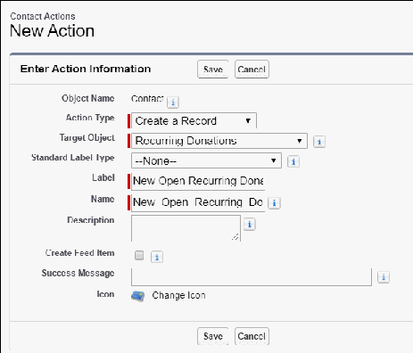

1122.. To automatically populate fields on the new Recurring Donation that’s created from the action, select

New in the Predefined Field Values.

1133.. Enter the following values:

••

Field: Recurring Donation Name

••

Formula Value: Contact.FirstName & " " & Contact.LastName & " Recurring Donation

" & TEXT(MONTH(TODAY())) & "/" & TEXT(DAY(TODAY())) & "/" &

TEXT(YEAR(TODAY()))

1144.. Click Save.

1155.. In the Predefined Field Values list, click New.

1166.. Enter the following values:

••

Field: Open Ended Status

••

Specific Value: Open

1177.. Click Save.

1188.. In the Predefined Field Values list, click New.

1199.. Enter the following values:

••

Field: Schedule Type

••

Specific Value: Multiply By

2200.. Click Save.

Finally, add the Lightning Action to the Contact Lightning page layout:

11.. From Setup, click the Object Manager tab.

22.. In the list of objects, click Contact.

667

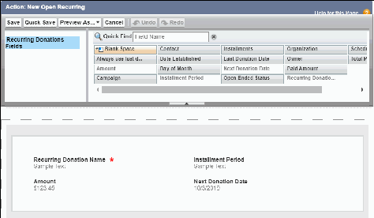

33.. Click Page Layouts.

44.. Click Contact Layout.

55.. In the palette, click Mobile & Lightning Actions.

66.. Drag the New Open Recurring Donation Lightning Action to the Salesforce Mobile and Lightning

Experience Actions section of the Page Layout.

77.. Click Save.

Automatic Recurring Donations Naming

By default, NPSP names your Recurring Donations automatically.

Here's how it works:

11.. Go to the Recurring Donations tab and click New.

22.. Fill out the required fields (Amount, Donor Type, Recurring Period, etc.).

33.. Click Save.

Once you save the record, NPSP updates the Recurring Donation Name using this format:

[DonorName] [Amount] - Recurring

[DonorName] is Contact Name when the Donor Type is Contact, or the Account Name when the Donor

Type is Account and the Account is an Organizational Account. Let's look at some examples.

•

If you enter a new $100 Recurring Donation for Barbara Levy, the name becomes:

- Barbara Levy $100 - Recurring

•

If you enter a new $500 Recurring Donation for Universal Containers, the name becomes:

- Universal Containers $500 - Recurring

668

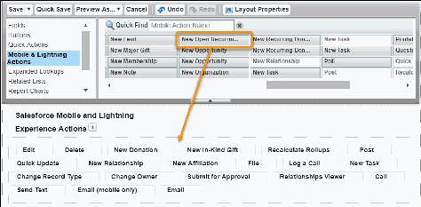

If you have your own naming convention that you'd rather use, you can disable Automatic Recurring

Donation Naming. When you disable naming, users will see the Recurring Donation Name field in the

record entry and edit screens.

11.. Go to NPSP Settings | Recurring Donations | Recurring Donations.

22.. Find Recurring Donation Name Format and select Disable Auto Naming.

33.. Click Save.

General Legacy NPSP Information

Documentation for old NPSP setup and features like legacy account models and NPSP Data Loader help

text mapping.

Legacy Account Models

An account model describes the relationship between Accounts, Contacts, and Opportunities. The

Household Account Model is the default account model for Nonprofit Success Pack, and the one we

strongly recommend. This article contains information about two legacy account models: The 1-to-1

Account Model, and the Individual Account Model.

Map Custom Fields Using Help Text (Legacy)

NPSP legacy Help Text mapping allows you to reference additional fields on a small number of

Salesforce objects through Help Text on the NPSP Data Import fields.

Troubleshoot Invalid NPSP Data Import Help Text Mappings (Legacy)

The legacy NPSP method to connect NPSP Data Import fields to the target fields is through the NPSP

Data Import field's Help Text.

Legacy Account Models

An account model describes the relationship between Accounts, Contacts, and Opportunities. The

Household Account Model is the default account model for Nonprofit Success Pack, and the one we

strongly recommend. This article contains information about two legacy account models: The 1-to-1

Account Model, and the Individual Account Model.

Note For more information about the recommended Household Account Model, see What is the

Household Account Model. For more information about changing your account model, see Change

My Account Model.

1-to-1 Account Model

The 1-to-1 account model works by creating an Account object for each Contact you create (that is,

"One Contact, one Account"). The Account is automatically created when you create a Contact, and

the name of the new Account is identical to the name of the new Contact.

Individual ("Bucket") Account Model

In the Individual account model, all Contacts are associated with a single Account, as if all of your

669

Contacts have been dumped into one "bucket." The name of this gigantic Account is "Individual." In

other words, you have one great big Account that holds all of your Contacts.

1-to-1 Account Model

The 1-to-1 account model works by creating an Account object for each Contact you create (that is, "One

Contact, one Account"). The Account is automatically created when you create a Contact, and the name

of the new Account is identical to the name of the new Contact.

The Account object itself, however, acts "invisibly" behind the scenes, and exists for the sole purpose of

conforming to the standard Salesforce Account model (which requires all Contacts to be associated with

an Account).

In the Contact Details section of your Contact record, it looks like this:

In the 1-to-1 account model, you must create Households by joining contacts together through a

separate custom Household object (provided with NPSP.) Opportunities (donations) look like they are

simply associated with Households and Contacts, but they are also "traveling through" the 1-to-1

Account.

670

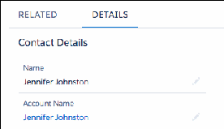

The 1-to-1 account model is a legacy account model, and is no longer recommended.

Individual ("Bucket") Account Model

In the Individual account model, all Contacts are associated with a single Account, as if all of your

Contacts have been dumped into one "bucket." The name of this gigantic Account is "Individual." In

other words, you have one great big Account that holds all of your Contacts.

In the Contact Details section of your Contact record, it looks like this:

As with the 1-to-1 account model, you create Households in the Individual account model by joining

Contacts together through a separate Household object.

671

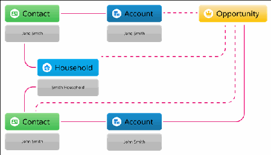

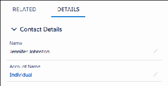

This model was developed to conform to the standard Salesforce Account model, which requires all

Contacts to be associated with an Account. The Individual account model is a legacy account model, and

is no longer recommended.

Map Custom Fields Using Help Text (Legacy)

NPSP legacy Help Text mapping allows you to reference additional fields on a small number of Salesforce

objects through Help Text on the NPSP Data Import fields.

Let's walk through an example of this process. Save the World would like to have a custom field for the

Contact's preferred name, and include that information in their spreadsheet and import process. As the

Salesforce Administrator, you'll need to complete the steps outlined in this article in order to add the

custom field to the process.

Note There are two methods for mapping fields for the NPSP Data Importer: Advanced Mapping or

via Help Text. We recommend using Advanced Mapping, as you can map to any Salesforce object

and field—standard or custom—that is related to Contacts, Accounts, and Opportunities. With Help

Text mapping, you can only reference additional fields on certain objects.

Important For every additional field you want to add to the NPSP Data Import object, you must

specify a value for the field's Help Text and you must follow a specific naming convention for the

Help Text value. The NPSP Data Importer will import the field only if Help Text has the correct value.

Read Troubleshoot Invalid NPSP Data Import Help Text Mappings (Legacy) for more information.

Create or Find the Field You Want to Map with Help Text

Pay close attention to the API name of the field you want to map to.

Create Field on the NPSP Data Import Object and Map with Help Text

Now we create a corresponding custom field on the NPSP Data Import object for our primary

672

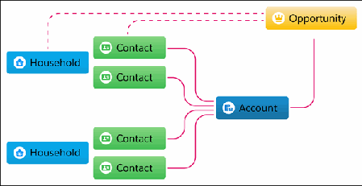

Contact's Preferred Name. The field must exist in both places because we need to map one to the

other.

Update Your CSV with the New Field

Add your new field to your data import template CSV to ensure automatic mapping with Data Import

Wizard.

Create or Find the Field You Want to Map with Help Text

Pay close attention to the API name of the field you want to map to.

CCrreeaattee aa NNeeww CCuussttoomm FFiieelldd

For our example, let's create a custom text field to capture the Contact's preferred name.

11.. Click , then click Setup.

22.. Click the Object Manager tab.

33.. In the list of objects, click Contact.

44.. Click Fields & Relationships..

55.. Click New.

66.. Select Text.

77.. Click Next.

88.. Complete this information:

aa.. Field Label: Preferred Name

bb.. Length: 255

cc.. Field Name: Preferred_Name

dd.. Fill in Description and Help Text if needed; they're not required here.

99.. Click Next.

1100.. Click Next again to accept default security.

1111.. Click Save.

The custom field now exists within Salesforce and you see it in the Contact Fields & Relationships list.

Take note of the text in the API Name column. Copy the text from the API Name column to your

clipboard or a separate note as you'll need it shortly. In this case, it's Preferred_Name__c.

For more detail on creating custom fields, see Salesforce Help & Training.

673

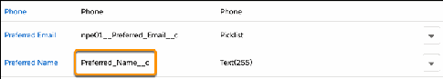

FFiinndd tthhee AAPPII NNaammee ooff aann EExxiissttiinngg FFiieelldd

If you want to map to an existing field instead of a new custom field, you just need to find the API Name

and copy it to your clipboard.

11.. Click , then click Setup.

22.. Click the Object Manager tab.

33.. In the list of objects, click Contact.

44.. Click Fields & Relationships.

55.. Find the field you want to map.

66.. Copy the API Name to your clipboard. For example, if you want to import the Work Email field, you

would copy npe01__WorkEmail__c to your clipboard.

Note that fields from the Nonprofit Success Pack packages begin with namespace prefixes such as

npe01__ or npsp__ while custom fields you create do not have a prefix. The complete API name

includes both the namespace prefix (if one exists) and the trailing __c (double underscore 'c').

Create Field on the NPSP Data Import Object and Map with Help Text

Now we create a corresponding custom field on the NPSP Data Import object for our primary Contact's

Preferred Name. The field must exist in both places because we need to map one to the other.

11.. Click , then click Setup.

22.. Click the Object Manager tab.

33.. In the list of objects, click NPSP Data Import.

44.. Click Fields & Relationships.

55.. Click New.

66.. Select Text.

Note You can only map to editable fields. You can't map to formula fields and you shouldn't map

to rollup fields because the information will be overwritten. You must select the same field type

as the custom field you're mapping to, except when the field you're matching is a relationship

field (lookup or master/detail) or checkbox field. For example, if the field on the Contact record

was a Date field, you'd select Date here. Read more about mapping Relationship Fields or

Checkbox Fields in the sections below.

77.. Complete this information:

••

Field Label: Contact1 Preferred Name

It doesn't matter what you name this field (unless it's a Unique ID field) but pick a label that makes

674

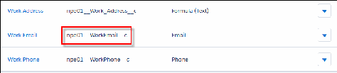

it clear which record this maps to. We're picking something really obvious here—words that map

exactly to the custom field we created in the previous section.

Note If the field is a marked as a Unique ID field, then the naming does matter. If the field isn't

named correctly, it won't show up in the Data Import Configuration Options. For more

information and an example, see Important Information about Unique ID Fields below.

••

Length: 255

••

Field Name: Contact1_Preferred_Name

••

Help Text: Contact1.Preferred_Name__c

This help text is critical and it's what will allow for the mapping to the Contact object. The Help Text

field specifies the object instance and field name that you want to copy the data to, using the

format ObjectGroup.Fieldname. (That last part is the API Name you copied to your clipboard, after

creating the custom field in the previous section.) Read Troubleshoot Invalid NPSP Data Import

Help Text Mappings (Legacy) for additional help formatting the Help Text.

ObjectGroup must be one of the following:

•• - Contact1

•• - Contact2

•• - Account1

•• - Account2

•• - Household

•• - Opportunity (the donation fields)

•• - Address (for the home address fields)

•• - Payment

Fieldname must be the full API Name, including a namespace and/or the trailing __c, if needed.

88.. Click Next.

99.. Click Next again to accept default security.

1100.. Click Save.

RReellaattiioonnsshhiipp FFiieellddss

Relationship fields—lookup or master/detail—must be mapped as Salesforce IDs. This includes the

standard Owner field, which is related to the User object.

For a relationship field, create the corresponding NPSP Data Import field as either a Lookup

Relationship field or a Text field of 18 characters to accommodate the 15 or 18 digit Salesforce ID (not

the Name) of the related record.

CChheecckkbbooxx FFiieellddss

Checkbox fields get a little tricky when you're trying to process them in a data import tool. In order to

allow you more flexibility around checkbox fields in NPSP Data Import, the corresponding field should

be a picklist.

This picklist translates what you want to see in the checkbox field (the checkbox as checked or

675

unchecked) to their Boolean equivalents (True for checked and False for unchecked). Through NPSP

Data Import, you're able to uncheck a previously checked checkbox field or even leave a checkbox field

completely unchanged by leaving that cell empty.

We'll walk through this for the Private checkbox on the Opportunity object, but remember, you can do

this with any custom or standard checkbox field. To map the Private checkbox field to the NPSP Data

Import object:

11.. Click , then click Setup.

22.. Click the Object Manager tab.

33.. In the list of objects, click NPSP Data Import.

44.. Click Fields & Relationships.

55.. Click New.

66.. Select Picklist.

77.. Complete this information:

••

Field Label: Donation is Private

You can choose a different name here, but pick a label that makes the mapping clear.

••

Select Enter values, with each value separated by a new line and enter the following values:

•• - True

•• - False

••

Field Name: Donation_is_Private

••

Help Text: Opportunity.IsPrivate

This must match the object and field name, using the format ObjectGroup.Fieldname. The

information you enter into this field links the field in NPSP Data Import to the appropriate field on

your chosen object. Read Troubleshoot Invalid NPSP Data Import Help Text Mappings (Legacy) for

additional help formatting the Help Text.

88.. Click Next.

99.. Click Next again to accept default security.

1100.. Click Save.

IImmppoorrttaanntt IInnffoorrmmaattiioonn aabboouutt UUnniiqquuee IIDD FFiieellddss

Naming is important when you're creating corresponding Unique ID fields. In order to see any values in

the Contact Custom Unique ID or Account Custom Unique ID fields in the Data Importer Configuration

options, the field you want to map must be marked as Unique and External ID.

Additionally, for Unique ID fields, you must create two corresponding fields, one for Contact1 and one

for Contact2 (or Account1 and Account2) and they must be named properly. The corresponding fields

should NOT be marked as Unique and External ID.

For example, say you created a custom Unique ID field on Contacts called Reference ID with an API

name of Reference_ID__c that you want to use for matching Contacts during data import. You'll need

to create two corresponding NPSP Data Import fields using the exact format listed below:

676

Field 1

Field Label: Contact1 <Fieldname> (Example: Contact1 Reference ID)

Field Name: Contact1_<Fieldname> (Example: Contact1_Reference_ID)

API Name: Contact1_<FieldName>__c (Example: Contact1_Reference_ID__c)

Help Text: Contact1.<FieldName>__c (Example: Contact1.Reference_ID__c)

Field 2

Field Label: Contact2 <Fieldname> (Example: Contact2 Reference ID)

Field Name: Contact2_<Fieldname> (Example: Contact2_Reference_ID)

API Name: Contact2_<FieldName>__c (Example: Contact2_Reference_ID__c)

Help Text: Contact2.<FieldName>__c (Example: Contact2.Reference_ID__c)

Here is an image showing the custom Contact field Reference ID and the corresponding NPSP Data

Import field Contact1 Reference ID with correct naming. The image also shows that the Contact field

Reference ID is marked as an External ID field.

Note Creating only one corresponding field (instead of two) will result in an error.

677

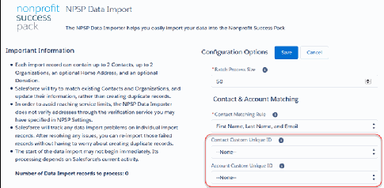

Again, only when your custom Contact or Account field is a Unique ID field AND both the fields needed

on the NPSP Data Import object have been mapped and named correctly will you see the custom

Contact or Account field in the drop down menu. Additionally, keep in mind that Last Name is required

when trying to match Contacts using an External ID, as the Last Name is used when the External ID field

isn't found. Account Name is required when trying to match Accounts using an External ID, as the

Account Name is used when the External ID field isn't found.

Update Your CSV with the New Field

Add your new field to your data import template CSV to ensure automatic mapping with Data Import

Wizard.

If you haven't already, download the NPSP Date Import Templates. Your import spreadsheet needs to

include a new column for the field you created on the NPSP Data Import object, not the original

custom field.

If you're using the Data Import Wizard, the column should use the Field Label. If you're using the Data

Loader or other API tool, the column should use the API Name. So in our example, you would add a

column with the Header text as:

678

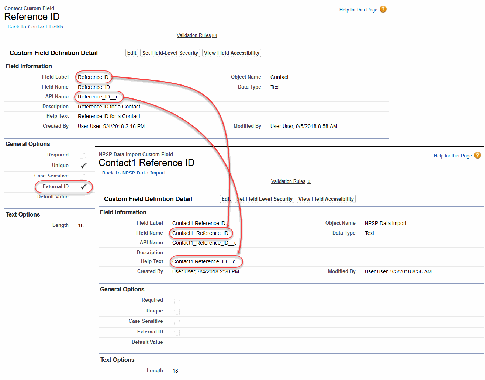

•

Contact1 Preferred Name (if using Data Import Wizard)

•

Contact1_Preferred_Name__c (if using Data Loader)

You've successfully prepared Salesforce for your new field! Now head to Using NPSP Data Import

Templates to start preparing your data for import.

Troubleshoot Invalid NPSP Data Import Help Text Mappings (Legacy)

The legacy NPSP method to connect NPSP Data Import fields to the target fields is through the NPSP

Data Import field's Help Text.

The most common challenge with the Help Text method is it requires very specific syntax following the

format ObjectGroup.FieldName. For example, a valid Help Text mapping to the Personal Email field

for Contact1 in your import file is Contact1.npe01__HomeEmail__c.

Unfortunately, there isn't a way to validate Help Text to make sure the mappings are set up correctly. You

likely won't know there is a problem until you try importing and either your import fails or particular

target fields don't receive the information you thought they would. No doubt this has led to many

exasperated admins.

Read on to determine what may have gone awry with your field mappings.

Invalid Object Group API Name

First, it's important to understand Object Groups. Object Groups are slightly different than objects.

Object Groups are collections of field mappings that tell the NPSP Data Importer tool what types of

records (e.g. Contacts, Opportunities, Payments, etc.) to create or update. NPSP is able to link records

within a single row of your import to one another because fields mappings are bundled in Object

Groups in this way.

Invalid Field API Name

The Field API Name needs to match the target field exactly.

Incompatible Data Types

For the most part, when you set up the field on the NPSP Data Importer object, you must select the

same field type as the custom field you're mapping to. For example, if the field on the Contact record

was a Date field, you'd select Date.

Improperly Named Unique ID Field

The name of the NPSP field is important when you're creating a field that corresponds to a Unique ID

field. In order to see any values in the Contact Custom Unique ID or Account Custom Unique ID fields

in the Data Importer Configuration options, the field you want to map must be marked as Unique and

External ID.

Two NPSP Data Import Fields Mapped to Same Target Field

Each NPSP Data Import field should only be mapped to a single target field. If you map two NPSP

Data Import fields to the same target field and you have information in both NPSP Data Import fields,

the field that processes last will be the value that is imported into the target field.

679

Invalid Object Group API Name

First, it's important to understand Object Groups. Object Groups are slightly different than objects.

Object Groups are collections of field mappings that tell the NPSP Data Importer tool what types of

records (e.g. Contacts, Opportunities, Payments, etc.) to create or update. NPSP is able to link records

within a single row of your import to one another because fields mappings are bundled in Object Groups

in this way.

Let's look at the two Contact1 and Contact2 Object Groups as an example. These are linked directly to

their Household Accounts. At times, you may want to include two Contacts in a single household. To

achieve this, in your import file enter the first Contact in the Contact1 columns and the second Contact

in the Contact2 columns. When Contact1 is created, NPSP creates a Household Account for Contact1.

Because of the Contact1 and Contact2 Object Mappings, Contact2 is added to Contact1’s Household

Account when you import the file.

Help Text mapping only supports the following Object Groups:

•

Account1 - Not the Household Account; an Organization Account affiliated with Contact1.

•

Account2 - Not the Household Account; an Organization Account affiliated with Contact2.

•

Household - The Household Account.

•

Contact1 - The primary Contact.

•

Contact2 - The other Contact or Contacts in a household.

•

Address - The household address.

•

Opportunity - Donation fields.

•

Payment - Payments related to the Opportunity.

The Object Group component of the Help Text mapping must conform to one of the Object Groups

above. Some examples of invalid Object Group mappings:

•

Account.Name: Doesn't include which Organization Account the field is on. Specify either Account1

or Account2.

•

Acccount1.Name: Account1 is misspelled.

•

Account_1.Name: There shouldn't be a space—represented by the underscore—between Account and

1.

•

Account3.Name: Help Text mapping only supports Account1 and Account2 Object Groups.

In addition, you can't map to an Object Group that isn’t listed above. Examples of these invalid mappings

are:

•

npe5__Affiliation__c.Name: You can’t map directly to the NPSP Affiliation object, but if you

complete the information for Account1 or Account2 in the import file, NPSP will automatically create

an Affiliation between Contact1 and Account1 or Contact2 and Account2.

•

Allocation__c.Name: Help Text mapping doesn't support mapping to GAU Allocations on

Opportunities. If you convert to Advanced Mapping, GAU Allocation mapping will be set up for you.

See Enable and Convert to Advanced Mapping for more information.

•

npe03__Recurring_Donation__c.Name: You can’t map to the NPSP Recurring Donation object with

680

Help Text mapping, but if you convert to Advanced Mapping, you can set up this custom mapping.

Read more in Customize Advanced Mapping.

Invalid Field API Name

The Field API Name needs to match the target field exactly.

This includes the number of underscores, that pesky __c at the end of custom fields, and capitalization.

Some specific examples of invalid field API name mappings are:

•

Account1.name: Name must be capitalized. This mapping should be Account1.Name.

•

Account1.npsp__Matching_Gift_Company: This is almost the full API name, but it’s missing __c

on the end that is on every custom field. It should be

Account1.npsp__Matching_Gift_Company__c.

•

Account1.npsp__MatchingGiftCompany__c: The API name for Matching Gift Company has

underscores between the words.

•

Account1.MailingCity: This is a tricky one! MailingCity is a valid API name for a field, but

Mailing City isn’t a field that exists on the Account object; it’s on the Contact object. The mapping for a

city field on the Account object should be either Account1.BillingCity or

Account1.ShippingCity.

•

Account1.[a field that doesn't exist]: If you’ve not created a field on the target object, you

don’t have its API name.

The foolproof way to make sure you’re using the correct API name is to go to the target object, copy the

whole API name of the field, and paste it in the FieldName piece of the mapping. Pro tip: open the

target object field list in a separate browser window and the create the corresponding NPSP Data Import

fields in another window.

Incompatible Data Types

For the most part, when you set up the field on the NPSP Data Importer object, you must select the

same field type as the custom field you're mapping to. For example, if the field on the Contact record

was a Date field, you'd select Date.

There are two notable exceptions:

•

When the target field is a relationship field (lookup or master/detail).

•

When the target field is a checkbox.

Relationship fields—lookup or master/detail—must be mapped as Salesforce IDs. This includes the

standard Owner field, which is related to the User object. For a relationship field, the NPSP Data Import

field should be a Text field of 18 characters to accommodate the 15 or 18 digit Salesforce ID (not the

Name) of the related record.

In order to allow more flexibility around checkbox fields, the NPSP Data Import field that will send

information to a target checkbox field should be a picklist. This picklist translates what you want to see in

681

the checkbox field (the checkbox as checked or unchecked) to their Boolean equivalents (True for

checked and False for unchecked). Through NPSP Data Import, you'll be able to uncheck a previously

checked checkbox field or even leave a checkbox field completely unchanged by leaving that cell empty.

Read more about mapping Checkbox Fields.

Improperly Named Unique ID Field

The name of the NPSP field is important when you're creating a field that corresponds to a Unique ID

field. In order to see any values in the Contact Custom Unique ID or Account Custom Unique ID fields in

the Data Importer Configuration options, the field you want to map must be marked as Unique and

External ID.

Additionally, for Unique ID fields, you must create two corresponding fields, one for Contact1 and one

for Contact2 (or Account1 and Account2) and they must be named properly. The corresponding fields

should NOT be marked as Unique and External ID. Read more in Important Information about Unique

ID Fields.

Two NPSP Data Import Fields Mapped to Same Target Field

Each NPSP Data Import field should only be mapped to a single target field. If you map two NPSP Data

Import fields to the same target field and you have information in both NPSP Data Import fields, the

field that processes last will be the value that is imported into the target field.

Probably the most common way this happens is where two different NPSP Data Import fields are created

by different users at different times. Let's say you have a field on the Contact object named Preferred

Name. Years ago, one of your admins created an NPSP Data Import field named Contact1 Casual Name

and used Help Text mapping to send information from Contact1 Casual Name to Preferred Name for

Contact1. More recently, a new admin didn't notice the Contact1 Casual Name field and created a new

NPSP Data Import field named Contact1 Nickname and also mapped it to Preferred Name.

Here's how this setup goes sideways. Another admin prepping data for an upcoming import sees both

Contact1 Casual Name and Contact1 Nickname in the CSV template, and for a supporter named

Robert 'The Bobster' Miller, the admin enters Bob in the Contact1 Casual Name column and The

Bobster in Contact1 Nickname. When the import is processed, the NPSP Data Import field processed

second—let's say Contact1 Nickname, The Bobster—overwrites the Contact1 Casual Name value and the

Preferred Name field ends up with The Bobster.

Before you know it, your major gifts officer calls Mr. Miller The Bobster. And that might be ok if Bob's not

into the whole brevity thing, but more likely it's a nickname only his closest friends use. So be sure to

check your field mappings carefully and completely.

Legacy NP Starter Pack

Legacy documentation for Nonprofit Starter Pack.

682

Nonprofit Starter Pack (NPSP) - Legacy Documentation

This page provides documentation for previous versions of the Nonprofit Starter Pack. Please be aware

that Salesforce no longer supports these versions. The information in these documents may be

incomplete or inaccurate.

Nonprofit Starter Pack (NPSP) Documentation - Salesforce Classic Archive

Organizations created from Trial starting November 9, 2016 and later use the Lightning user interface

by default. This page provides an archive of documentation, written for the Salesforce Classic user

interface, for NPSP versions 3.0 - 3.83. Please be aware that Salesforce.org does not maintain these

versions of the docs, so the information may be incomplete or inaccurate.

Nonprofit Starter Pack (NPSP) - Legacy Documentation

This page provides documentation for previous versions of the Nonprofit Starter Pack. Please be aware

that Salesforce no longer supports these versions. The information in these documents may be

incomplete or inaccurate.

For information and documentation about the latest version of the Nonprofit Success Pack, visit the

Nonprofit Success Pack.

Households

Download the legacy NPSP 2.0 households documentation.

Contacts & Organizations

Download the legacy NPSP 2.0 contact and organizations documentation.

Payments

Download the legacy NPSP 2.0 payments documentation.

Rollups

Download the legacy NPSP 2.0 rollups documentation.

Recurring Donations

Download the legacy NPSP 2.0 Recurring Donations documentation.

Relationships

Download the legacy NPSP 2.0 relationships documentation.

Affiliations

Download the legacy NPSP 2.0 affiliations overview.

Data Management / General Administration

Download the legacy NPSP 2.0 data management and general administration documentation.

Households

Download the legacy NPSP 2.0 households documentation.

Download zip archive

The archive contains these topics:

683

•

Households Interface

•

Household Naming

•

Controlling Who Gets a Household

•

Creating Households for Contacts without Households

•

Installing Households v2.4

Contacts & Organizations

Download the legacy NPSP 2.0 contact and organizations documentation.

Download zip archive

The archive contains these topics:

•

What is an Account Model?

•

NPSP and Person Accounts

•

Lead Conversion

•

Working with Memberships

•

Merging Contacts

•

Changing Contacts & Organizations Settings

•

Updating to Contacts & Organizations Version 2.1

•

Soft Credits

•

Controlling Household Member Opportunity Contact Roles

Payments

Download the legacy NPSP 2.0 payments documentation.

Download zip archive

The archive contains these topics:

•

Working With Payments

•

Adding Payments to Existing Opportunities

•

Mapping Opportunity Fields to Payments

Rollups

Download the legacy NPSP 2.0 rollups documentation.

Download zip archive

The archive contains these topics:

•

How do Rollups Work?

•

Fiscal Year Rollups

684

•

Controlling Opportunity Rollups

•

Recalculating Opportunity Rollups

•

Troubleshooting Rollups

•

Understanding Rollup Errors

•

User Defined Rollups

Recurring Donations

Download the legacy NPSP 2.0 Recurring Donations documentation.

Download zip archive

The archive contains these topics:

•

Creating New Recurring Donations

•

Editing Existing Recurring Donations

•

Deleting Existing Recurring Donations

•

Configuring & Understanding Recurring Donations General Settings

•

Working with Custom Labels in Recurring Donations

•

Configuring & Understanding Custom Field Mappings

•

Configuring & Understanding Custom Installment Periods

•

Recurring Donations 2.0 Features

•

Updating or Installing Recurring Donations 2.0

•

Understanding the Batch Process & Updating Donations

Relationships

Download the legacy NPSP 2.0 relationships documentation.

Download zip archive

The archive contains these topics:

•

Relationships General Settings

•

Creating New Relationships

•

Auto-Created Relationships

•

Editing Existing Relationships

•

Relationships 2.0 Features

•

Installing or Updating to Relationships 2.0

•

Relationships Advanced Configuration & Settings

•

Reciprocal Relationships & Gender Configuration

•

Using the Relationships Viewer

Affiliations

Download the legacy NPSP 2.0 affiliations overview.

685

Download zip archive

The archive contains these topics:

•

Affiliations Overview

Data Management / General Administration

Download the legacy NPSP 2.0 data management and general administration documentation.

Download zip archive

The archive contains these topics:

•

Uploading Opportunities

•

Finding Your Package Versions

•

Current Package Versions

•

Editing Custom Labels

•

Installing the NPSP from the Appexchange

•

Uninstalling the NPSP

•

Nonprofit Starter Pack Conversion

Nonprofit Starter Pack (NPSP) Documentation - Salesforce Classic Archive

Organizations created from Trial starting November 9, 2016 and later use the Lightning user interface by

default. This page provides an archive of documentation, written for the Salesforce Classic user interface,

for NPSP versions 3.0 - 3.83. Please be aware that Salesforce.org does not maintain these versions of the

docs, so the information may be incomplete or inaccurate.

For information and documentation about the latest version of the Nonprofit Success Pack, visit the

current Nonprofit Success Pack.

General Information

Download the archive of legacy NPSP documentation for understanding what version of NPSP you're

using and troubleshooting NPSP in the Classic interface.

Getting Started Resources

Download the archive of legacy NPSP documentation for importing donor data in the Classic interface.

Install and Upgrade

Download the archive of legacy NPSP documentation for installing and upgrading NPSP in the Classic

interface.

Manage Households, Organizations, Contacts, and Addresses

Download the archive of legacy NPSP documentation for managing households, organizations,

contacts, and addresses in the Classic interface.

Manage Opportunity Donations

Download legacy NPSP documentation for managing donation opportunities in the Classic interface.

686

Constituent Engagement

Download the archive of legacy NPSP documentation for managing engagement plans and levels in

the Classic interface.

Manage Campaigns

Download the archive of legacy NPSP documentation for managing campaigns in the Classic interface.

Integration and General Administration

Download the archive of legacy NPSP documentation for customizing labels and exporting data in the

Classic interface.

General Information

Download the archive of legacy NPSP documentation for understanding what version of NPSP you're

using and troubleshooting NPSP in the Classic interface.

Download zip archive

This archive contains these topics:

•

Which Version of NPSP Am I Using?

•

Troubleshooting the Nonprofit Success Pack

Getting Started Resources

Download the archive of legacy NPSP documentation for importing donor data in the Classic interface.

Download archive

This archive contains these topics:

•

NPSP Administrator's Guide to Importing Donor Data

Install and Upgrade

Download the archive of legacy NPSP documentation for installing and upgrading NPSP in the Classic

interface.

Download zip archive

This archive contains these topics:

•

Post-Install Checklist (for "Clean slate" organizations)

•

Enable New Features

•

Uninstall NPSP

687

Manage Households, Organizations, Contacts, and Addresses

Download the archive of legacy NPSP documentation for managing households, organizations, contacts,

and addresses in the Classic interface.

Manage Household and Organization Accounts

Download the archive of legacy NPSP documentation for managing household and organization

accounts in the Classic interface.

Manage Contacts

Download the archive of legacy NPSP documentation for managing contacts in the Classic interface.

Manage Relationships Between Contacts

Download the archive of legacy NPSP documentation for managing relationships between contacts in

the Classic interface.

Manage Addresses

Download the archive of legacy NPSP documentation for managing addresses in the Classic interface.

MMaannaaggee HHoouusseehhoolldd aanndd OOrrggaanniizzaattiioonn AAccccoouunnttss

Download the archive of legacy NPSP documentation for managing household and organization

accounts in the Classic interface.

Download zip archive

This archive contains these topics:

•

What is an Account Model?

•

Which Account Model Am I Using?

•

Customize Household Names

•

Merge or Split Households

•

Enable the Manage Household Button

•

Add and Manage Organization Accounts

MMaannaaggee CCoonnttaaccttss

Download the archive of legacy NPSP documentation for managing contacts in the Classic interface.

Download zip archive

This archive contains these topics:

•

Add or Remove a Contact

•

Change the Primary Contact for a Household

•

Mark a Contact as Do Not Contact or Deceased

•

Merge Contacts

•

Specify a Preferred Phone Number and Email Address for a Contact

•

Phone and Email Workflow Rules

688

•

Convert a Lead to a Contact

•

Primary Contact vs. Primary Affiliation

MMaannaaggee RReellaattiioonnsshhiippss BBeettwweeeenn CCoonnttaaccttss

Download the archive of legacy NPSP documentation for managing relationships between contacts in

the Classic interface.

Download zip archive

This archive contains these topics:

•

Create, Edit, and View Relationships

•

Manage Relationships Settings

•

Customize Gender Picklist Values for Relationships

•

Populate Contacts Automatically for New Relationships Viewer Contacts

MMaannaaggee AAddddrreesssseess

Download the archive of legacy NPSP documentation for managing addresses in the Classic interface.

Download zip archive

This archive contains these topics:

•

Add or Update Addresses for a Household or Organization

•

Specify a Default Mailing Address for a Household or Organization

•

Override the Default Address for a Contact

•

Specify a Seasonal Address

•

Choose the Correct Address for Your Mailing Label Report

Manage Opportunity Donations

Download legacy NPSP documentation for managing donation opportunities in the Classic interface.

Add and Manage Donations and Payments

Download the archive of legacy NPSP documentation for managing donations, payments, GAU

allocations, and acknowledgments in the Classic interface.

Create and Manage Recurring Donations

Download the archive of legacy NPSP documentation for managing recurring donations in the Classic

interface.

Manage Opportunity (Donation) Rollups

Download the archive of legacy NPSP documentation for managing donation rollups in the Classic

interface.

Manage Soft Credits and Matching Gifts

Download the archive of legacy NPSP documentation for managing soft credits and matching gifts in

689

the Classic interface.

Add and Manage Special Gift Types

Download the archive of legacy NPSP documentation for managing grants, memberships, tribute gifts,

in-kind gifts, and major gifts in the Classic interface.

AAdddd aanndd MMaannaaggee DDoonnaattiioonnss aanndd PPaayymmeennttss

Download the archive of legacy NPSP documentation for managing donations, payments, GAU

allocations, and acknowledgments in the Classic interface.

Download zip archive

This archive contains these topics:

•

Donation Management Overview

•

Add a Single-Payment Donation

•

Manage Multiple-Payment Donations

•

Create and Manage Donation Allocations

•

Customize Opportunity (Donation) Names

•

Acknowledge Donations by Email

CCrreeaattee aanndd MMaannaaggee RReeccuurrrriinngg DDoonnaattiioonnss

Download the archive of legacy NPSP documentation for managing recurring donations in the Classic

interface.

Download zip archive

This archive contains these topics:

•

Recurring Donations: Overview and Setup

•

Create a Recurring Donation

•

Change, Close, or Delete a Recurring Donation

•

Map Recurring Donation Fields to Custom Opportunity Fields

•

Create Custom Installment Periods for Recurring Donations

MMaannaaggee OOppppoorrttuunniittyy ((DDoonnaattiioonn)) RRoolllluuppss

Download the archive of legacy NPSP documentation for managing donation rollups in the Classic

interface.

Download zip archive

This archive contains these topics:

•

Opportunity (Donation) Rollups Overview

•

Set Fiscal Year Rollups

•

Troubleshoot Rollups

690

MMaannaaggee SSoofftt CCrreeddiittss aanndd MMaattcchhiinngg GGiiffttss

Download the archive of legacy NPSP documentation for managing soft credits and matching gifts in the

Classic interface.

Download zip archive

This archive contains these topics:

•

Soft Credits Overview

•

Soft Credit and Matching Gift Setup

•

Configure Soft Credit and Matching Gift Rollup Settings

•

Create Soft Credits

•

Work with Matching Gifts

AAdddd aanndd MMaannaaggee SSppeecciiaall GGiifftt TTyyppeess

Download the archive of legacy NPSP documentation for managing grants, memberships, tribute gifts,

in-kind gifts, and major gifts in the Classic interface.

Download zip archive

This archive contains these topics:

•

Create and Manage Grants

•

Create and Manage Memberships

•

Create Tribute Opportunities (Honor and Memorial Donations)

•

Create and Manage In-Kind Gifts

•

Major Gift Enhancements

Constituent Engagement

Download the archive of legacy NPSP documentation for managing engagement plans and levels in the

Classic interface.

Download zip archive

This archive contains these topics:

•

Create and Manage Engagement Plans

•

Create and Manage Levels

Manage Campaigns

Download the archive of legacy NPSP documentation for managing campaigns in the Classic interface.

Download zip archive

691

This archive contains these topics:

•

Create and Update Campaign Members Through an Opportunity

Integration and General Administration

Download the archive of legacy NPSP documentation for customizing labels and exporting data in the

Classic interface.

Download zip archive

This archive contains these topics:

•

Customizing Labels

•

Exporting Data with the Apex Data Loader

692