Be sure that the Account or Contact where you'd like to specify a Seasonal Address also has a default

address. If you create a Seasonal Address with no other default address, you'll get an error when NPSP

tries to switch to or from the Seasonal Address.

Seasonal Address Updates

Salesforce runs the Seasonal Address Updates scheduled job that sets seasonal addresses as the mailing

address once per night. If you set up a new Seasonal Address that should be in effect on January 1st, for

example, you won't see it copied to the Mailing Addresses until the next day (January 2nd), after the

nightly scheduled job has run. The exception to this is when you set the start date for the Seasonal

Address to today's date—in this case, the change will take effect immediately.

Manage Donations and Other Gift Types

Learn how to manage donation payments, gifts, and pledges.

Manage Donation Payments

Manage gifts, donors,and pledges in the Nonprofit Success Pack.

Manage Recurring Donations

511

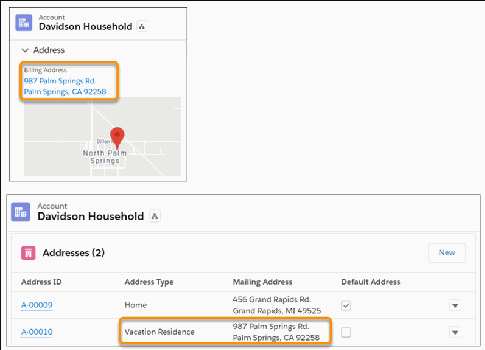

Recurring giving is a dependable source of revenue for nonprofits. Donors who give regularly tend to

continue giving for many years, and sometimes increase the amounts they donate. When donors want

to adjust how and when they give in response to changes in their lives, your organization must be able

to respond efficiently. You'll find the ability to do this and more with Recurring Donations in NPSP.

Manage Rollups

Rollup fields are custom fields that display information from other related records, including aggregate

totals. Learn about customizable rollups and legacy rollup solutions.

Manage Soft Credits

Manage Soft Credits with the Nonprofit Success Pack.

Manage Special Gift Types

Work with matching gifts, In-Kind Gifts, Grants, Memberships, and Tribute Gifts in the Nonprofit

Success Pack.

Manage Donation Payments

Manage gifts, donors,and pledges in the Nonprofit Success Pack.

Manage Donations in Salesforce

Learn fundamentals of gift entry and donor management in the Nonprofit Success Pack.

Create and Edit Gift Entry Batches

Specify details about a batch in Gift Entry, including number of gifts and default values for fields.

Enter Gifts in Gift Entry

Enter donations, donors, and their related records in one form as a batch or one at a time.

Process a Collection of Gifts

Test processing your Gift Entry batch and then process the batch to add the gifts to NPSP.

Manage Pledges

Track and manage pledges for gifts with multiple payments.

Allocations Overview

Allocate donations into General Accounting Units (GAUs) if you want to set funds aside for specific

purposes.

Acknowledge Donations by Email

Nonprofit Success Pack lets you send an acknowledgment email to a donor from a specific

Opportunity record, or send multiple email acknowledgments simultaneously from the Opportunities

tab.

Donations Glossary

Common fundraising terms and how these concepts relate to records in NPSP.

Working with Opportunity Sales Processes

Learn how to update Opportunity stages and sales processes in NPSP.

Manage Donations in Salesforce

Learn fundamentals of gift entry and donor management in the Nonprofit Success Pack.

512

About Donation Management

Chances are you've managed donations in another database, accounting system, or with

spreadsheets. The same concepts you're familiar with apply to Salesforce and the Nonprofit Success

Pack (NPSP). You just need to know what things are called and where to click.

How to Get Donations Into Salesforce

NPSP is designed to handle all the different kinds of donations you receive, such as single donations,

matching gifts, recurring donations, tributes, and more. Learn the most efficient way to enter different

kinds of donations.

Credit Where Credit is Due

Soft credits let you track people who contributed to getting a donation in the door. For example, you

might attribute a soft credit to a board member who influenced their friend to donate to your

organization.

Nonprofit Financial Accounting

Use General Accounting Units to designate a donation to specific funds, and Accounting Subledger to

bridge the gap between accounting and other departments.

About Donation Management

Chances are you've managed donations in another database, accounting system, or with spreadsheets.

The same concepts you're familiar with apply to Salesforce and the Nonprofit Success Pack (NPSP). You

just need to know what things are called and where to click.

Donations are called Opportunities in Salesforce. An Opportunity is a specially-designed Salesforce

record for recording revenue by the amount, date, and person or organization that revenue is from.

Businesses use Opportunities to track sales deals–nonprofits use Opportunities to track donations. We

use the terms Donation and Opportunity interchangeably throughout the product documentation.

For help with Salesforce terms you aren't familiar with, check out the Donations Glossary.

How to Get Donations Into Salesforce

NPSP is designed to handle all the different kinds of donations you receive, such as single donations,

matching gifts, recurring donations, tributes, and more. Learn the most efficient way to enter different

kinds of donations.

EEnntteerr SSiinnggllee DDoonnaattiioonnss oorr aa CCoolllleeccttiioonn ooff DDoonnaattiioonnss

Use the NPSP Gift Entry tool to enter one-off single donations, or a collection of donations in a batch. To

learn about Gift Entry, see Enter Gifts in Gift Entry.

EEnntteerr PPlleeddggeess

NPSP uses Opportunity and Payment records to manage pledges–a donor’s agreement to donate a set

amount of money in installments. For example, to track a pledge of $400 paid in $100 installments every

513

quarter for one year, NPSP creates one Opportunity of $400 and four related Payment records of $100

each.

To learn more about Pledges, check out Manage Pledges.

IIssssuuee RReeffuunnddss

Refund donations on an Opportunity’s Payment record. To learn more about refunds, see Refund

Donation Payments.

EEnntteerr RReeccuurrrriinngg DDoonnaattiioonnss

NPSP handles recurring donations by creating Opportunity records based on the installment schedule.

You can specify a monthly, quarterly, yearly, or custom installment schedule.

To learn how to enter recurring donations in NPSP, see Create a Recurring Donation.

CCoolllleecctt DDoonnaattiioonnss OOnnlliinnee

Salesforce.org Elevate is a powerful app that accepts and processes donations online, and automatically

sends the donation data to NPSP.

To learn more about Elevate, see the Elevate Product Documentation.

IImmppoorrtt YYoouurr DDaattaa

Import your contacts, accounts, and donations into Salesforce with the Salesforce Data Import Wizard or

another import tool of your choice.

For more information about importing your data, see How the Import Process Works.

Credit Where Credit is Due

Soft credits let you track people who contributed to getting a donation in the door. For example, you

might attribute a soft credit to a board member who influenced their friend to donate to your

organization.

Soft credits let you track people who contributed to getting a donation in the door. For example, you

might attribute a soft credit to a board member who influenced their friend to donate to your

organization.

You can assign soft credits manually, or configure NPSP to assign soft credits automatically based on

criteria you choose.

To learn more about soft credits, see the Soft Credits Overview.

514

Nonprofit Financial Accounting

Use General Accounting Units to designate a donation to specific funds, and Accounting Subledger to

bridge the gap between accounting and other departments.

DDeessiiggnnaattee SSppeecciifificc FFuunnddss ffoorr aa DDoonnaattiioonn

To designate a donation (or portions of a donation) to specific funds or programs, NPSP uses General

Accounting Units (GAUs). GAUs often map to an organization's chart of accounts or accounting classes.

To learn more about GAUs, see Allocations Overview.

BBrriiddggee tthhee AAccccoouunnttiinngg GGaapp

Accounting Subledger is a Salesforce app that helps bridge the gap between accounting and other

departments. Accounting Subledger generates debits and credits from Salesforce records—automatically

formatted for export to your accounting systems.

To learn more, see the Accounting Subledger Documentation.

Create and Edit Gift Entry Batches

Specify details about a batch in Gift Entry, including number of gifts and default values for fields.

Note Watch the Nonprofit Salesforce How-To Series video: Create Gift Entry Batches.

View Batches of Gifts

View batches created with either Gift Entry or the legacy Batch Gift Entry in Gift Entry.

Create a Batch

Before you start entering gifts, set up your batch header details and determine what information users

are required to enter. You can edit this information later, if necessary.

Edit Batch Options

After creating a batch, you can make changes. For example, after you create the batch and enter a gift,

you want to update the Expected Count of Gifts field or set a default value for Donation Date. Edit the

batch and make these changes.

View Batches of Gifts

View batches created with either Gift Entry or the legacy Batch Gift Entry in Gift Entry.

To view gift batches:

11.. From the App Launcher, find and select Gift Entry.

22.. Click the Batches subtab.

515

33.. Identify which tool created a batch by looking at the Form Template column.

If Form Template is blank, the batch was created with the legacy Batch Gift Entry tool.

44.. Open the batch in the tool where it was created by clicking the Batch Name.

Create a Batch

Before you start entering gifts, set up your batch header details and determine what information users

are required to enter. You can edit this information later, if necessary.

11.. From the App Launcher, find and select Gift Entry.

22.. Click New Batch.

33.. Select the template to use for the batch.

44.. Click Next.

55.. Enter a Batch Name.

We recommend using a unique name for each batch.

66.. Enter other necessary information—such as a Description, the Expected Count of Gifts, and the

Expected Total Batch Amount.

77.. If you want to ensure that the count of gifts or the total amount of gifts saved to the batch matches

the values you enter, select Require Expected Totals Match.

88.. If you selected Require Expected Totals Match, then enter a value for at least one expected totals field:

Expected Count of Gifts or Expected Total Batch Amount.

99.. To enter recurring gifts in the batch, select Allow Recurring Donations.

1100.. Click Next.

1111.. Set default values for fields.

If the template already has defaults, they appear here. If necessary, you can override the template

default values for this batch.

1122.. Save your changes.

If you set up and activated a batch number format, all Opportunities and Payments associated with this

batch will include the batch number in the Batch Number field. Learn more in Configure Batch Numbers

for Donations.

Now you're ready to Enter a Collection of Gifts. If your batch includes Recurring Donations, click Make

Recurring when entering the gift.

Edit Batch Options

After creating a batch, you can make changes. For example, after you create the batch and enter a gift,

you want to update the Expected Count of Gifts field or set a default value for Donation Date. Edit the

516

batch and make these changes.

Note You can't update the template you selected for this batch.

Any changes you make don't affect records that you already saved to the batch. If you update default

values, the updated values aren't copied to records already saved to the batch. You need to manually

update the field values for existing records.

11.. From the App Launcher, find and select Gift Entry.

22.. Go to the Batches subtab.

33.. Select the name of the batch you want to update.

44.. In the batch, click Edit Batch Info.

55.. Make your changes.

66.. Save your changes.

Enter Gifts in Gift Entry

Enter donations, donors, and their related records in one form as a batch or one at a time.

Note Watch the Nonprofit Salesforce How-To Series videos about Gift Entry: NPSP Single Gift Entry

and Enter Gifts Into Gift Entry Batches.

Overview of Entering Gifts in Gift Entry

Gift Entry gives you the ability to enter gifts one at a time or as a collection. With Gift Entry, users can

enter batch and single gifts in a way that's accurate, fast, and flexible.

Enter Single Gifts

How you enter a single gift depends on whether the donor already exists in Salesforce or whether you

create a donor.

Enter a Collection of Gifts

Use Gift Entry to enter a collection of gifts.

Customize Batch Table Columns

When you have many fields on your form, the table at the bottom of the screen that lists the gifts can

become cramped and difficult to read. Customize the form fields in the gift table.

Edit or Delete Gifts in an Unprocessed Batch

Edit or remove gifts in an unprocessed batch.

Overview of Entering Gifts in Gift Entry

Gift Entry gives you the ability to enter gifts one at a time or as a collection. With Gift Entry, users can

enter batch and single gifts in a way that's accurate, fast, and flexible.

With Gift Entry, users can enter batch and single gifts in a way that's accurate, fast, and flexible. Gift Entry

uses the NPSP Data Importer and Advanced Mapping to add constituent and donation data in the

517

appropriate NPSP and standard Salesforce objects.

Gift Entry gives you the ability to enter gifts one at a time or as a collection. When you're on the Gift Entry

form, the process is similar for either operation. How you get to the form or what you do when you save

the gift varies slightly.

Note Gift Entry uses the record-matching features in NPSP Data Importer. Learn more in Configure

NPSP Data Importer Options.

Enter Single Gifts

How you enter a single gift depends on whether the donor already exists in Salesforce or whether you

create a donor.

How you enter a single gift depends on whether the donor already exists in Salesforce or whether you

create a donor.

To enter a single donation for an existing donor:

11.. Find and select the Organization Account or individual Contact for this donation.

22.. Click New Gift.

33.. Add any Organization Account or Contact information that may not have auto populated in the Single

Gift Entry form.

Information updated in the form, like address or phone number, is reflected on the donor's record

when the gift is processed.

44.. Ensure the gift is associated with the appropriate Opportunity or Payment record, so that you don't

duplicate existing data.

If the donor has any existing open Payments, access those records from the message about pending

donations. If you don't see the message, skip this step and go to step 5.

aa.. In the pending donations message, click Review Donations.

bb.. Review the list of Payments that haven't been paid and their related Opportunities.

cc.. From the potential options, choose one of the following:

••

Add or update Payments on an existing open Opportunity by clicking Add new Payment or

Update this Payment. (For more information about Opportunities with multiple Payments, see

Manage Pledges.)

••

For an open Opportunity without any Payments, click Add new Payment (or Update this

Opportunity if you don't use Payments).

518

••

If none of the existing donations match, click Alternatively, create a new Opportunity.

As an example, let's assume you're entering a $50 donation that Antonio Gomez made on 3/31.

When you click Review Donations, you see these existing open donations for Antonio. The open

$50 Opportunity with a close date of 3/31 looks like a good match for this donation, so you might

choose to add a Payment to that one.

dd.. On the Gift Entry form, verify the name of the Payment and the automatically filled in donation

information.

If you change your mind about the selected donation, click Select a different donation. You'll then

have the ability to select another.

55.. At the end of the Single Gift Entry form, enter the donation information.

Note You can adjust your templates and Advanced Mapping to allow Contact Address fields to

auto-populate. To learn more, see Adjust Gift Entry and Advanced Mapping to Populate Contact

Address Fields (Optional).

66.. In the form, enter the Donation Date and the Donation Amount.

77.. If your admin has set up campaigns, in the Primary Campaign Source field, search for and select the

allocation.

88.. From the Payment Method list, select how the donation was made.

99.. Save the gift.

To enter a single gift for a new donor:

11.. From the App Launcher, find and select Gift Entry.

22.. Click New Single Gift.

33.. In the Single Gift Entry form, enter or confirm the details for the donor.

Use your mouse or Tab key to navigate between cells.

44.. For Donor Type, select either Account1 (an Organization Account donor) or Contact1 (an individual

Contact donor).

55.. Double-check that the donor doesn't already exist in Salesforce by searching for the donor in the

corresponding Account or Contact fields.

If you have several people or organizations with similar names, start typing the name and click Show

All Results for... to see additional information about the records that are found.

519

Note Enhanced search works for any lookup field on the form. You can even use it to search for

information, like external IDs, in other fields on the object. Customize the fields in the expanded

search results by updating the object's Search Layout. Read more in Customize Search Layouts.

66.. In the Add or Edit Contact or the Add or Edit Organization account section, enter information for the

new contact.

For example, here we've entered information for the new Contact, Danny Mayo.

77.. Enter the Donation Date and Donation Amount.

88.. If your Admin has set up campaigns, in the Primary Campaign Sources field, choose an allocation.

99.. In the Payment Method field, select how the donation was made.

Note If your template includes any default values, they'll appear here. In this example, we set the

Primary Campaign Source to Annual Appeal and the Payment Method to Check.

1100.. Save the gift.

When you save a gift with a new Payment, the new Payment is related to the Opportunity record and

marked as Paid. Additionally, if the new Payment makes the sum of all Paid Payments equal to or

greater than the Opportunity amount, the Opportunity is automatically closed. The Stage is changed

to the setting found on the NPSP Settings page (Donations | Payments | Opportunity Stage for When

Fully Paid).

NPSP deduplicates Soft Credits you enter through Gift Entry. For example, if you enter two Influencer

Soft Credits for the same person, NPSP only records one Soft Credit.

Checkbox fields show as a picklist instead of a checkbox. You can select the checkbox field by

selecting True, deselect the checkbox by selecting False, or retain the existing value by leaving the field

blank.

Enter a Collection of Gifts

Use Gift Entry to enter a collection of gifts.

Note A batch can contain up to 10,000 gifts.

After you Create a Batch, enter gifts.

If you're not continuing from the batch that you created earlier, use the App Launcher to find and select

520

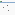

Gift Entry | Batches, and select the batch to add gifts.

11.. Enter the gift, and if your batch includes recurring donations, click Make Recurring when entering the

gift.

22.. Click Save & Enter New Gift.

Dry run is initiated against the gift that you entered to:

••

Look for potential issues with your entry. Rows with issues have a Status of Dry Run - Error. Resolve

the issues so that you can process the batch when you finish entering the gifts.

••

Match the donation based on Donation Matching, and then match the donor based on the Contact

& Account Matching.

33.. To enter more gifts, repeat these steps.

Notice the Total Count and Total Amount update as you enter and save gifts.

You can edit gifts you saved to the form before processing (see Edit or Delete Gifts in an Unprocessed

Batch). After entering all gifts in your batch, you're ready to Test Your Batch with Dry Run and Process a

Batch.

Here's an example of some gift entries. Notice these details:

•

Antonio has a link to the Opportunity record related to the Payment we chose in the Review Donations

step.

•

Ana has a link to the Opportunity record we updated during the Review Donations step.

•

Danny didn't already exist as a Contact, so, we added him in the Add or Edit Contact section. His

information shows up in those Contact fields instead of the Donor and Donation columns. After the

batch is processed, the Donor column contains a link to his Contact record and the Donation column

has a link to the new Opportunity.

Customize Batch Table Columns

When you have many fields on your form, the table at the bottom of the screen that lists the gifts can

become cramped and difficult to read. Customize the form fields in the gift table.

Note You can also customize the columns at the template level in Template Builder. Read more

about batch settings for templates in Create or Edit a Gift Entry Template.

11.. In a Batch, go to the gift table.

22.. Click , and then Select Batch Table Columns.

33.. To add fields to the table, move them from Available Fields to Visible Fields. To remove fields from

the table, move them from Visible Fields to Available Fields.

521

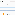

44.. Save your changes.

Edit or Delete Gifts in an Unprocessed Batch

Edit or remove gifts in an unprocessed batch.

To edit a gift after the gift is saved in a batch that hasn't been processed yet, reopen the gift in the form

from the list of gifts in the batch.

11.. In the table of gifts, find the row that you want to change.

22.. In the donation row that you want to change, click , and then click Open.

33.. Update fields as needed.

Note You can't update a processed gift in Gift Entry. Clicking View opens a gift in the form, but

the gift isn't editable.

44.. To save your changes, click Update.

To remove a gift from the batch:

11.. Click in that row.

22.. Click Delete.

The Delete action removes the gift row only from the batch. Deleting the gift in the batch doesn't

affect the related donor or donations (if it matched against an existing donation).

If you're done entering and editing gifts and have resolved errors, you're ready to Process a Collection of

Gifts.

Process a Collection of Gifts

Test processing your Gift Entry batch and then process the batch to add the gifts to NPSP.

Note Watch the Nonprofit Salesforce How-To Series Video NPSP Gift Entry: Process a Batch.

Test Your Batch with Dry Run

To catch and resolve errors before you process your batch, use the Batch Dry Run.

Process a Batch

After you enter all gifts, process the batch to commit the records into NPSP. Keep in mind that you

must resolve all errors first. You may see an error when trying to process the batch if you selected the

Required Expected Totals Match checkbox, but either the Total Amount or Total Count fields don't

match the expected totals you entered when creating the batch.

A Word About Batch Status

522

In addition to viewing the status of each record within a batch, you can view the status of the entire

batch in the Batch Status field.

Delete Gift Entry Records

Since the Gift Entry records provide a link between the batch in which the gift was entered and the

Payment or Opportunity record, we recommend that you do not delete them. Deleting Gift Entry

records erases the entry history, which is sometimes needed for accounting or audit purposes.

Test Your Batch with Dry Run

To catch and resolve errors before you process your batch, use the Batch Dry Run.

As you enter gifts, NPSP performs a dry run to make sure they will process correctly. That's great if you

enter everything in one sitting and process the batch right away, but often the workday of people

entering gifts isn't quite that streamlined. Instead, you might enter some of the gifts today, and return

days later to finish entering and processing the whole batch.

And in that time, other Opportunities or Payments may have been entered or modified in NPSP. As a

result, when you go to process your batch, some of the older donations might not match up correctly

anymore. To catch and resolve pesky errors before you process your batch, click Batch Dry Run.

While Batch Dry Run is working, you can't enter or edit gifts. When it's done, you'll be able to add, edit, or

process gifts. Any problematic donation line items are flagged with a Dry Run - Error status. You can

expand the Error column to see details.

After you've identified the issue, scroll to the right end of the batch list and click . Select Open to edit

the gift in the Gift Entry form or click Delete to remove the gift from the batch.

523

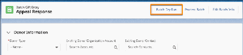

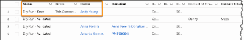

Now that you've resolved errors, you’re ready to process your batch.

Process a Batch

After you enter all gifts, process the batch to commit the records into NPSP. Keep in mind that you must

resolve all errors first. You may see an error when trying to process the batch if you selected the Required

Expected Totals Match checkbox, but either the Total Amount or Total Count fields don't match the

expected totals you entered when creating the batch.

11.. Click Process Batch.

22.. When the batch finishes processing, verify the updated Status for each record.

If you set up and activated a batch number format, all Opportunities and Payments associated with this

batch will include the batch number in the Batch Number field. Learn more in Configure Batch Numbers

for Donations.

A Word About Batch Status

In addition to viewing the status of each record within a batch, you can view the status of the entire

batch in the Batch Status field.

The Batch Status is based on the Import Status of the records within the batch. The values in Batch

Status are:

Open

NPSP Data Importer hasn't processed the records and sent the information to the target objects.

524

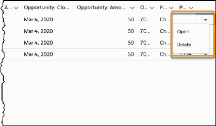

Completed

NPSP Data Importer has processed all of the records in the batch.

Failed - Needs Review

One or more records in the batch failed to process.

You can add your own values to the Batch Status picklist. For example, if batches need to be reviewed

before processing, you may want values like Ready for Review or Ready to Process. NPSP will overwrite

any custom values to Completed or Failed - Needs Review when the batch is processed.

Delete Gift Entry Records

Since the Gift Entry records provide a link between the batch in which the gift was entered and the

Payment or Opportunity record, we recommend that you do not delete them. Deleting Gift Entry records

erases the entry history, which is sometimes needed for accounting or audit purposes.

If you absolutely must delete Gift Entry records, these are the two objects where you'll find Gift Entry

batch information.

NPSP Data Import Batches

These records include Batch Name, Batch Description, or the Form Template used for the batch.

NPSP Data Imports

The Gift Entry records for the donations entered within a batch. The NPSP Data Import records

are related to NPSP Data Import Batch records through a lookup field.

If you have a lot of Gift Entry records to delete, use Salesforce Data Loader. For details, see Data Loader

and Insert, Update, or Delete Data Using Data Loader. After you delete all of the Gift Entry records in a

batch and want to delete the batch itself, go to the NPSP Data Import Batches tab.

Manage Pledges

Track and manage pledges for gifts with multiple payments.

Note Watch the Nonprofit Salesforce How-To Series video: Manage Multiple Payments.

What is a Pledge?

In the nonprofit world, a pledge is a promise to donate a set amount of money in installments over a

period of time. This article explains how to track your pledges with Opportunities and Payments.

Enter a Pledge and Expected Payments

Let's see how you can use Opportunities and Payments to set up that $400 pledge from your donor,

with a total of four $100 payments scheduled every three months.

Write Off One or More Scheduled Payments

525

When donors pledge a certain amount and cannot keep the payment schedule, or are unable to send

in one or more payments, you can write off (i.e. "cancel") the payments you're expecting so that you

can keep accurate donation records.

What is a Pledge?

In the nonprofit world, a pledge is a promise to donate a set amount of money in installments over a

period of time. This article explains how to track your pledges with Opportunities and Payments.

In the nonprofit world, a pledge is a promise to donate a set amount of money in installments over a

period of time. With a pledge, you know the total amount of the gift from your donor, along with their

payment schedule. For example, a donor agrees to pledge a total of $400 to your organization, paid in

$100 installments every 3 months.

This article explains how to track your pledges with Opportunities and Payments. This is the way to go if

your organization uses accrual accounting, where all income is recorded when it's pledged rather than

when it's received.

For information on tracking pledges based on other accounting methods, see Recurring Donations

versus Opportunity Payments (Legacy).

Enter a Pledge and Expected Payments

Let's see how you can use Opportunities and Payments to set up that $400 pledge from your donor, with

a total of four $100 payments scheduled every three months.

11.. Create an Opportunity for the total amount that the donor has pledged. In this example, $400. You

can create a new Opportunity from the Opportunities tab or from a button on the Contact or Account

record (recommended). When you do the latter, Salesforce automatically pre-populates the new

Opportunity with related information.

22.. Set the Stage field to Pledged (or any appropriate open stage).

33.. Set the Close Date depending on your standard practices. For example, in our quarterly example, if

the first donation comes in on 4/15/2019, we set the Close Date to 4/15/2019—the start of the

pledge.

44.. Save the Opportunity record.

55.. On the new Opportunity record, click the Related tab, then scroll to the Payments section and click

Schedule Payments.

66.. In the Create a Payment Schedule section:

••

Set the # of Payments fields to 4 (quarterly). By default, you can schedule up to 12 payments for a

single donation.

526

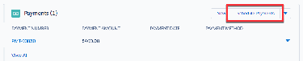

Note Depending on the needs of your organization, you can change the maximum number of

payments from the NPSP Settings page (Donations | Payments | Maximum Payments).

••

Set the Date of First Payment to the starting date for your quarterly payments (the date when the

first payment comes in).

••

Set the payment Interval Number to the amount of time between scheduled payments and the

Period to the unit of time you want to use. For quarterly payments, the Number is 3 and the Period

is Month.

••

Select Credit Card, Checks, or Cash as the default Payment Method depending on the mode of

donation.

77.. Click Calculate Payments.

Salesforce creates an editable list of scheduled payments. For our quarterly donation example, the

payment calculator will create 4 payments with the first payment scheduled on 4/15/2019, the

second one scheduled three months later (the payment interval) on 7/15/2019, and so on. At this

point, you can adjust the payment amounts and dates on the payment schedule. This is helpful, for

example, when you know that the final payment will be a different amount, or if the one of the

payments will come in on different date.

88.. Click Create Payments. On the Opportunity Related tab, the Payments related list shows the payment

schedule.

527

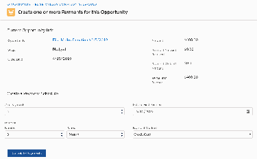

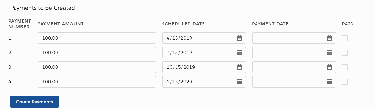

99.. When a payment comes in, click Edit from the drop-down to the right of the Payment in the list, select

Paid, and then save your changes.

1100.. When the final payment comes in and the full donation amount has been paid, the Opportunity is

automatically closed. Its Stage is set to the value selected in the Opportunity Stage for When Fully

Paid field in NPSP Settings, under Donations | Payments.

Note Occasionally, you may receive a Payment whose amount is more than what was originally

scheduled. If a Payment is marked as paid, and it pushes the total amount of Payments over the

Opportunity Amount, the Opportunity will automatically be closed. According to the example

above, Elise Malloy made a $400 donation that was scheduled to be paid out in four Payments.

She paid the first and second as planned, and was scheduled to make her third Payment of $100

on 10/15/19 and her fourth Payment of $100 on 1/15/20. Let's say that instead, Elise pays $250

on 10/15/19. The 10/15/19 Payment will be marked as Paid and, since this Payment pushes the

Opportunity Amount over the original $400 donation, the Opportunity will automatically be

closed.

Write Off One or More Scheduled Payments

When donors pledge a certain amount and cannot keep the payment schedule, or are unable to send in

one or more payments, you can write off (i.e. "cancel") the payments you're expecting so that you can

keep accurate donation records.

11.. Search for the Opportunity that contains the payment you want to write off.

22.. On the Opportunity record, click the Related tab, then click Edit to the right of the payment.

33.. Select Written Off.

44.. Click Save.

If, unfortunately, a donor discontinues their payments entirely, write off all of their scheduled future

payments to keep your donation records accurate.

11.. Search for the Opportunity that contains the payments you want to write off.

22.. On the Related tab, scroll to the Payments related list.

33.. Click , then click Write Off Payments.

44.. On the Write Off Remaining Balance page, look at the date in the Write Off Payments section. By

528

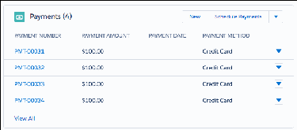

default Salesforce shows you the current date, and will write off all remaining payments. If you want to

choose a later date after which you want to write off payments, you can enter it.

55.. Click Write Off Payments. Back on the Opportunity record, you'll see that Salesforce has automatically

summed up the remaining unpaid payments and displayed them as a single unpaid write off.

66.. Change the Opportunity Stage to Posted to close out the donation.

Allocations Overview

Allocate donations into General Accounting Units (GAUs) if you want to set funds aside for specific

purposes.

Donation Allocations Overview

Use General Accounting Units (GAUs) to designate donations (or portions of a donation) to specific

funding purposes. For example, an Arts Education GAU is a fund allocated specifically for arts

education programs at a nonprofit. GAUs often map to an organization's chart of accounts or

accounting classes.

Create or Modify Allocations

Create or modify GAU Allocations for a donation using the Manage Allocations page. First create the

Opportunity and enter the donation amount before you allocate the contribution into the appropriate

General Accounting Unit (GAU).

Create Allocations Automatically from a Campaign or Recurring Donation

When you define GAU Allocations on a Campaign or Recurring Donation, NPSP creates the same GAU

Allocations for each related Opportunity.

Work with Allocation Rollups

GAU Allocations comes with a series of rollups that help you track the allocations you assign to your

GAUs. You can find these GAU rollups by clicking the General Accounting Unit tab in NPSP, then

selecting the GAU name.

Allocations FAQ

Get answers to common questions about Allocations.

Donation Allocations Overview

Use General Accounting Units (GAUs) to designate donations (or portions of a donation) to specific

funding purposes. For example, an Arts Education GAU is a fund allocated specifically for arts education

programs at a nonprofit. GAUs often map to an organization's chart of accounts or accounting classes.

Note Watch the Nonprofit Salesforce How-To Series video: Create or Modify GAU Allocations.

Note Administrators: If this feature isn't configured in your org, or something seems to be missing,

see the Feature Configuration Overview for a list of major features in NPSP and how to configure

them.

Many nonprofits offer a fund designation choice on their online donation pages so that donors can direct

their support to the program areas that mean the most to them. When properly configured, the

529

Nonprofit Success Pack (NPSP) creates the selected GAUs along with the Opportunity donation record.

Learn more about online donations and fund allocations with Salesforce.org Elevate.

GAUs are as diverse in their uses and names as the nonprofits that use Salesforce. That's why NPSP

allows you to define as many GAUs as you need. You can choose to allocate to a GAU as a percentage of

the donation amount, or as a specific dollar amount.

Use Campaigns or Recurring Donations to manage a group of donations so that when you enter

Opportunities as part of that Campaign or Recurring Donation, NPSP allocates them to the defined

GAUs.

Create or Modify Allocations

Create or modify GAU Allocations for a donation using the Manage Allocations page. First create the

Opportunity and enter the donation amount before you allocate the contribution into the appropriate

General Accounting Unit (GAU).

To create a GAU Allocation for a donation:

11.. Find the Opportunity you want to allocate.

22.. Click the Related tab.

33.. On the GAU Allocations related list, click and Manage Allocations.

If your administrator enabled default allocations, you'll see the full amount of the donation already in

your default GAU.

44.. The total amount of the Opportunity appears at the top of the page. Enter the name of the GAU.

55.. Enter either the amount or the percent of the donation you want to place in that GAU.

66.. To allocate the donation into additional GAUs, click Add Row.

77.. To delete a GAU Allocation, click Delete.

88.. Save your work.

To modify a GAU Allocation:

530

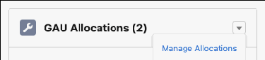

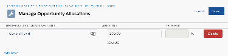

11.. Open the Opportunity that contains the GAU Allocation.

22.. Click the Related tab.

33.. In the GAU Allocations related list, click and click Manage Allocations.

44.. Change the allocation as necessary. You can change the name of the GAU, change the amount being

allocated, change from a dollar amount to a percentage of the donation, add additional allocations, or

delete allocations.

55.. Save your work.

For more information about working with Opportunity donations in NPSP, see Manage Donations in

Salesforce.

Create Allocations Automatically from a Campaign or Recurring Donation

When you define GAU Allocations on a Campaign or Recurring Donation, NPSP creates the same GAU

Allocations for each related Opportunity.

Let's say you have an fundraising appeal where you'd like the gifts that are part of that appeal to share the

same GAU Allocations. When you define GAU Allocations on a Campaign or Recurring Donation, NPSP

creates the same GAU Allocations for each related Opportunity.

To add GAU Allocations for Campaigns or Recurring Donations:

11.. Find the Campaign or Recurring Donation record you want to allocate.

22.. Click the Related tab.

33.. On the GAU Allocations related list, click and click Manage Allocations.

44.. Enter the name of the GAU.

55.. Enter either the amount or the percent you want to place in that GAU.

66.. To allocate additional GAUs, click Add Row.

77.. Save your work.

Now, when you add Opportunity donations to the Campaign or Recurring Donations, those

Opportunities receive the GAU Allocations you defined.

If you refund a Recurring Donation installment, the Recurring Donation's fixed-amount GAU Allocations

are adjusted to percentages that reflect the proportion of the original allocation amounts. For example: if

a Recurring Donation of $50 has two fixed-amount allocations for $25 each, and then you refund an

installment by $25, the allocations adjust to a 50% split.

Work with Allocation Rollups

GAU Allocations comes with a series of rollups that help you track the allocations you assign to your

531

GAUs. You can find these GAU rollups by clicking the General Accounting Unit tab in NPSP, then selecting

the GAU name.

The rollups come with pre-defined settings that an admin can update as needed. For more information,

see Customize Allocation Rollups.

Allocations FAQ

Get answers to common questions about Allocations.

What happens when I modify the Opportunity amount?

When you modify the Opportunity amount, NPSP recalculates the GAU Allocation amounts for that

Opportunity.

If the new Opportunity amount is below the total amount of your allocations, you will receive an error

and the Opportunity will not be updated. In that case, you should reduce the amount of the allocations

before reducing the Opportunity amount.

What order of precedence does NPSP use when you define Allocations in multiple places?

NPSP automatically creates GAU Allocations for Opportunities when default GAUs are enabled in NPSP

Settings and when you set a GAU Allocation on a Recurring Donation or a Campaign. You can also

manually create Allocations through NPSP Data Import, Gift Entry, and Salesforce.org Elevate.

So when you define GAU Allocations using two or more of these methods, which one "wins"?

Here's the order of precedence NPSP uses to create GAU Allocations:

11.. Manually created GAU Allocations

22.. GAU Allocations defined on NPSP Data Import records (during data import, Gift Entry, or Elevate

Giving Pages)

33.. GAU Allocations defined on Recurring Donations

44.. GAU Allocations defined on Campaigns

55.. The default GAU Allocation defined in NPSP Settings

How do General Accounting Unit rollups work?

General Accounting Units records aggregate rollup information from Allocations assigned to Closed Won

Opportunities.

NPSP automatically updates these rollups nightly, but you can also update them for a General

Accounting Unit by clicking the Recalculate Rollups action. To update Allocation rollup data for all

General Accounting Units, see Run Rollup Allocations Batch.

Does the Allocations feature support multiple currencies?

Yes, the GAU Allocations feature supports multiple currencies. Allocations inherit the currency of the

532

Opportunity, Campaign, or Recurring Donation with which they are associated. Changing the currency of

an Opportunity, Campaign, or Recurring Donation automatically changes each Allocation's currency. You

can't change an Allocation's currency individually.

General Accounting Unit rollup fields respect the currency conversion of the aggregated Allocations.

Acknowledge Donations by Email

Nonprofit Success Pack lets you send an acknowledgment email to a donor from a specific Opportunity

record, or send multiple email acknowledgments simultaneously from the Opportunities tab.

Note Watch the Nonprofit Salesforce How-To Series video about Donation Acknowledgments.

When donations come through and you mark the Opportunities as Closed/Won, it's cause for

celebration! After you're done throwing confetti, it's time to thank your donors. Nonprofit Success Pack

lets you quickly and easily email your donors a custom thank you message, tracks who has been

acknowledged, and the date the acknowledgment was sent.

Note Administrators: If this feature isn't configured in your org, or something seems to be missing,

see Configure Acknowledge Donations by Email for more information.

Email an Acknowledgment for a Single Opportunity Record

Nonprofit Success Pack makes it easy for you to email an acknowledgment for a single donation

(Opportunity record).

Email Acknowledgments for Multiple Opportunity Records

Nonprofit Success Pack also supports sending acknowledgment emails for multiple Opportunity

records at once.

Email an Acknowledgment for a Single Opportunity Record

Nonprofit Success Pack makes it easy for you to email an acknowledgment for a single donation

(Opportunity record).

11.. Navigate to the Opportunity detail page.

22.. Verify that the Primary Contact field lists the Contact you want to thank.

33.. Click , then select Email Acknowledgment.

When you select Email Acknowledgment, NPSP takes the following actions:

•

Sets the Acknowledgment Status field to Email Acknowledgment Now.

•

Triggers the email workflow rule that emails the Primary Contact on Opportunities whose

533

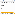

Acknowledgment Status is Email Acknowledgment Now.

•

If the email is successfully sent, sets the Acknowledgment Status to Acknowledged and the

Acknowledgment Date to the current date.

•

If the email send fails, sets the Acknowledgment Status to Email Acknowledgment Not Sent.

•

Displays the Email Acknowledgment Results page:

Email Acknowledgments for Multiple Opportunity Records

Nonprofit Success Pack also supports sending acknowledgment emails for multiple Opportunity records

at once.

11.. Click the Opportunities tab.

22.. Select the To Be Acknowledged list view. NPSP displays all Opportunities whose Acknowledgment

Status is To Be Acknowledged.

33.. From the list view, select the Opportunities you'd like to acknowledge. You can select all by selecting

the checkbox on the column header.

Note If you're not able to select any Opportunities, add a list view filter: Opportunity Record Type

= Donation. See Edit List View Filters in Lightning Experience for more information.

44.. Click Email Acknowledgments.

When you click Email Acknowledgments, NPSP takes the following actions:

•

Sets the Acknowledgment Status Field to Email Acknowledgment Now for the selected

Opportunities.

•

Triggers the workflow rule that emails the Primary Contact on Opportunities whose Acknowledgment

Status is Email Acknowledgment Now.

•

Sets the Acknowledgment Status to Acknowledged and the Acknowledgment Date to the current date

for successful acknowledgments.

•

Sets the Acknowledgment Status to Email Acknowledgment Not Sent for any failed

acknowledgments.

•

Displays the Email Acknowledgments Results page:

Donations Glossary

Common fundraising terms and how these concepts relate to records in NPSP.

Donation

A gift of either goods or money to a nonprofit organization. In NPSP, we track donations using

534

the Opportunity object.

Donor Rollup

Donor Rollup fields contain accumulated totals of donor history information for example,

donations over a period of time. Some examples include Total Number of Gifts, Total Household

Gifts, Soft Credits This Year, and so on. You'll see rollups in the Donation Information sections of

the Salesforce Account and Contact objects, though they are not explicitly referred to as such.

Total Gifts, for example, is a total of all the gifts over a period of time, "rolled up" into one. There

are multiple kinds of rollups available in NPSP. Check out the Rollups Overview to learn more

and figure out which rollups are right for your organization.

GAU Allocation

A designation of part or all of a donation to a specific fund or General Accounting Unit (GAU). For

example, a scholarship GAU is a fund allocated specifically for scholarships. Donors can

designate part or all of their donation for the scholarship fund, knowing that their money will go

specifically toward that purpose.

Gift Entry

An NPSP feature that gives users an accurate, fast, and flexible way to enter batch and single

gifts. It's designed to help users enter large volumes of gifts in a consistent way and ensure that

complex gifts have the right attributes .

Household or Organization Donation

A donation attributed to a Household or Organization. When you receive a donation from a

Household or Organization Account, the entire Household (or Organization) is credited with the

donation in NPSP.

Individual Donation

A donation given by an individual donor or constituent. The donation is a gift from a single

person (Contact), rather than from an entire Household or Organization. Depending on your

NPSP configuration, the value of this gift will be reflected on the Contact's Household Account as

well as other Contacts in the same household.

Opportunity

In Salesforce, we track all donation and grant information on the standard Salesforce

Opportunity object. So any time we refer to an Opportunity, we are usually referring to a

donation or grant.

Generally a donation, but there are other Opportunity record types as well. Here are the types

you can choose from in the Nonprofit Success Pack:

•

Donation

•

Grant

535

•

In-Kind

•

Major Gift

•

Matching Donation

•

Membership

You designate a type for an Opportunity when you create the Opportunity, and a description of

each type is available in the user interface. You can also create your own Opportunity record

types or remove types, depending on your needs.

Partial Soft Credit

A soft credit for an amount that is only a portion of the larger donation. For example,

organizations like Network for Good and United Way collect donations on behalf of an

organization's constituents, and typically share them with nonprofits on a regular basis (monthly

or quarterly). The nonprofit creates a single Opportunity record for the larger check received, but

needs to soft credit its individual constituents accordingly.

Payment

In NPSP, this is a separate record that is associated with an Opportunity to track money that is

actually paid. A single opportunity can have one Payment or multiple Payments.

Recurring Donation

A donation that occurs more than once, over a period of time. Recurring donations can be open-

ended and continue in perpetuity, or they can be fixed-length donations (such as monthly,

yearly, and so on), with a start and end date.

Soft Credit

A soft credit is a credit for a donation that someone did not actually make themselves, and

credits that someone as an "influencer" of the donation, rather than as the direct donor. Soft

credits can take many forms. A classic example is the employer donation matching scenario,

where an employer sends a matching gift of $100 to nonprofit A on behalf of employee B. A soft

credit on employee B's Contact record in Salesforce shows that they were responsible for the

employer's donation of $100, but that the employee did not make the donation directly. If you

enable Customizable Rollups, you can also create soft credit rollups that aggregate the soft

credits for all Contacts in a Household Account, and rolls them up to that Household Account.

Working with Opportunity Sales Processes

Learn how to update Opportunity stages and sales processes in NPSP.

For information on Opportunity stages and sales processes, see Update Opportunity Stages, Sales

Processes, and Record Types.

536

Manage Recurring Donations

Recurring giving is a dependable source of revenue for nonprofits. Donors who give regularly tend to

continue giving for many years, and sometimes increase the amounts they donate. When donors want to

adjust how and when they give in response to changes in their lives, your organization must be able to

respond efficiently. You'll find the ability to do this and more with Recurring Donations in NPSP.

Recurring Donations Overview

Learn about managing sustainer donations with Recurring Donations in NPSP.

Create a Recurring Donation

Learn how to create open-ended and fixed-length Recurring Donations. Choose monthly, quarterly,

yearly, or a custom installment schedule.

Process Installment Opportunities

Close installment Opportunities when you receive donation payments for Recurring Donations.

Closing an installment Opportunity generates the next installment Opportunity.

Change, Close, or Delete a Recurring Donation

Learn how to update a Recurring Donation when a donor asks to change their donation amount, or

their donation schedule. Also learn how to close (cancel), or delete a Recurring Donation.

Enter Additional Donations for an Existing Recurring Donation

Learn how to enter an installment Opportunity when your donor asks to make an additional donation

along with their regular Recurring Donation.

Update the Schedule of an Annual Recurring Donation

Learn how to update the schedule of an annual Recurring Donation when your donor asks to change

their donation date.

Pause a Recurring Donation

Learn how to temporarily suspend donations, and restart them, when your donor wants to stop giving

for a period of time.

Create Allocations for Recurring Donations

Use the Manage Allocations button on a Recurring Donation's GAU Allocations related list to create

and manage Allocations for your Recurring Donations.

Track Upgrades, Downgrades, and Other Recurring Giving Changes

Track and report on monthly and other recurring giving changes including upgrades, downgrades,

payment method updates, schedule changes, and status changes.

Which Version of Recurring Donations Am I Using?

A Salesforce system administrator can determine the version of recurring donations installed in your

org.

Enhanced Recurring Donations Upgrade Guide

This guide is for system administrators to plan and perform the upgrade from Legacy to Enhanced

Recurring Donations in NPSP. Also includes information about using the Enhanced Recurring

Donations features.

537

Recurring Donations Overview

Learn about managing sustainer donations with Recurring Donations in NPSP.

Note Watch the Nonprofit Salesforce How-To Series video about Recurring Donations.

Recurring giving is a dependable source of revenue for nonprofits. Donors who give regularly tend to

continue giving for many years, and sometimes increase the amounts they donate. When donors want to

adjust how and when they give in response to changes in their lives, your organization must be able to

respond efficiently. You'll find the ability to do this and more with Recurring Donations in NPSP.

In spring of 2020, the Salesforce.org fundraising team, in partnership with the nonprofit user community,

rebuilt Recurring Donations for NPSP. This next generation of Recurring Donations offers an improved

workflow for entering donation records, and updating schedule details such as amount or payment date.

Recurring Donations also integrates with the Salesforce.org Elevate online donation platform.

When we need to differentiate between the new and the old versions in our product documentation, we

refer to the old Recurring Donations feature as "Legacy Recurring Donations" and the new feature as

"Enhanced Recurring Donations."

If you installed Nonprofit Success Pack before March 2021, your org might be configured to use Legacy

Recurring Donations. Consider upgrading to Enhanced Recurring Donations. For instructions on using

this new version, see the Enhanced Recurring Donations Upgrade Guide. If you're unsure which version

of Recurring Donations you're using, see Which Version of Recurring Donations Am I Using?

Create a Recurring Donation

Learn how to create open-ended and fixed-length Recurring Donations. Choose monthly, quarterly,

yearly, or a custom installment schedule.

Note Watch the Nonprofit Salesforce How-To Series video about Managing Recurring Donations

Create an Open-Ended Recurring Donation

Open Recurring Donations are when a donor agrees to donate for an indefinite amount of time.

Create a Fixed-Length Recurring Donation

Fixed Recurring Donations are Recurring Donations where the donor agrees to donate for a specific

number of installments.

Track Recurring Donor Status

Using the Sustainer field on Accounts and Contacts, NPSP helps you keep track of who is a current,

lapsed, or former recurring donor.

Create an Open-Ended Recurring Donation

Open Recurring Donations are when a donor agrees to donate for an indefinite amount of time.

538

In this example, a new monthly donor, Vera Reinhold, wants to donate $50 each month by check. She

responded to a fundraising solicitation on April 5th, 2020, and will send a check by the 10th of each

month.

You can create a Vera Reinhold Contact, or use any existing Contact you'd like for this exercise.

11.. Click the Recurring Donations tab.

22.. Click New.

33.. Enter this information:

aa.. Donor Type = Contact

bb.. Contact = Vera Reinhold

cc.. Date Established = 4/5/2020

dd.. Amount = $50

ee.. Recurring Type = Open

ff.. Day of Month = 15

gg.. Payment Method = Check

hh.. Recurring Period = Monthly

ii.. Effective Date = 4/5/2020

44.. Leave all other fields blank or with their default value.

55.. Click Save.

The new Recurring Donation is now ready to track each monthly donation. NPSP auto-generates one

open installment Opportunity for you at a time. If Vera's your donor, when you receive her check, simply

close the open Opportunity. When you close the Opportunity, NPSP generates the next open

Opportunity.

Note Your administrator can change the Opportunity auto-creation behavior by going to NPSP

Settings | Recurring Donations | Recurring Donations and changing the Installment Opportunity

Auto-Creation setting. The default behavior is to always create new installment Opportunities.

Create a Fixed-Length Recurring Donation

Fixed Recurring Donations are Recurring Donations where the donor agrees to donate for a specific

number of installments.

In this example, a new donor, Ron Morimura, wants to donate $1250 each quarter (every 3 months) for

539

one year starting on 4/15/2020. He signed up for this Recurring Donation at a fundraising gala on

December 10th 2019 and wants to pay using bank transfers.

You can create a Ron Morimura Contact, or use any existing Contact you'd like for this exercise.

11.. Click the Recurring Donations tab.

22.. Click New.

33.. Enter this information.

aa.. Donor Type = Contact

bb.. Contact = Ron Morimura

cc.. Date Established = 12/10/2019

dd.. Amount = $1250

ee.. Recurring Type = Fixed

ff.. Number of Planned Installments = 4

gg.. Recurring Period = Advanced

hh.. Every = 3

ii.. Installment Period = Months

jj.. Day of Month = 15

kk.. Effective Date = 4/15/2020

ll.. Payment Method = ACH

44.. Leave all other fields blank or with their default value.

55.. Click Save.

The new Recurring Donation is now ready to track each quarterly donation. NPSP auto-generates one

open installment Opportunity for you at a time. If Ron was your donor, you would wait until you receive

his bank transfer, and then close the open Opportunity. When you close the Opportunity, NPSP

generates the next open Opportunity. When all of the Opportunities are paid, NPSP closes the fixed

recurring donation.

Track Recurring Donor Status

Using the Sustainer field on Accounts and Contacts, NPSP helps you keep track of who is a current,

lapsed, or former recurring donor.

540

Using the Sustainer field on Accounts and Contacts, NPSP helps you keep track of who is a current,

lapsed, or former recurring donor. NPSP updates the Account and Contact Sustainer field based on the

Status of the related Recurring Donations.

The Sustainer fields have these values:

•

Active—The constituent has one or more Active Recurring Donations.

•

Lapsed—The constituent has one or more Lapsed Recurring Donations.

•

Former—The constituent has only Closed Recurring Donations.

Use the Sustainer fields in reports and as a quick way to check the recurring donor status of a given

constituent.

Process Installment Opportunities

Close installment Opportunities when you receive donation payments for Recurring Donations. Closing

an installment Opportunity generates the next installment Opportunity.

Close an Installment Opportunity

Process installment payments with NPSP.

Close an Installment Opportunity Before or After the Next Donation Date

Sometimes a donor pays their monthly installment early or late. Learn how NPSP handles these

scenarios.

Close an Installment Opportunity

Process installment payments with NPSP.

Vera Reinhold is a new monthly donor and she just sent in her first check. Let's process the installment

Opportunity.

11.. On Vera's Recurring Donations, click the Related tab and find the Opportunities related list.

22.. Click the Opportunity record Vera Reinhold (1) 1/10/2020.

33.. Click the Closed stage in the path bar, then click Select Closed Stage.

541

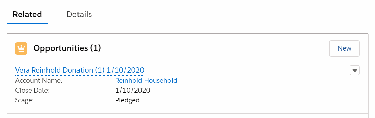

44.. Select Closed Won. Your Closed Won stage might be labeled something else (such as Posted).

55.. Click Save.

With this Opportunity closed, Vera's payment is recorded. On the Recurring Donation record, Total Paid

Amount and Number of Paid Installments show that the first installment of $50 has been paid.

When Vera closes the open Opportunity, NPSP generates the next open Opportunity for 2/10/2020. To

the right of the Recurring Donations details, you can see a list of the next twelve installments.

Upcoming Installments is a calculated display of installment Opportunities based on the field data on

the Recurring Donation. If you change field data on an installment Opportunity, those changes aren't

reflected in the Upcoming Installments visualization.

Close an Installment Opportunity Before or After the Next Donation Date

Sometimes a donor pays their monthly installment early or late. Learn how NPSP handles these

scenarios.

Sometimes a donor might pay their monthly installment a little early or a little late. That's perfectly fine,

of course, but there are a couple of things to consider:

542

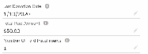

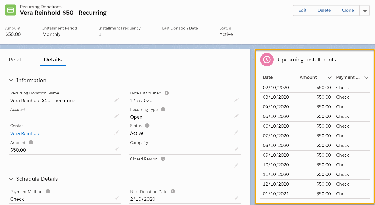

•

If the Close Date is within three days of the Next Donation Date, NPSP doesn't create an installment

for the same month.

•

If those dates are more than three days apart, NPSP generates a new installment for the same month.

This functionality exists to prevent duplicate installments.

Let's look at an example scenario.

11.. Your donor's Recurring Donation has a Next Donation Date of 4/15/2020, but they send their

payment on 4/12/2020.

22.. When you update the installment Opportunity's Stage to Closed Won, the Close Date updates to 4/

12/2020.

33.. In this case, NPSP doesn't generate the next installment for 4/15/2020 because 4/12/2020 falls

within three days of the Next Donation Date. Instead, the next installment is generated for 5/15/

2020.

Here's another example.

11.. Your donor's Recurring Donation has a Next Donation Date of 6/15/2020, but they send their

payment on 6/1/2020.

22.. When you update the installment Opportunity's Stage to Closed Won, the Close Date updates to 6/1/

2020.

33.. In this case, NPSP generates the next installment for 6/15/2020 because 6/1/2020 is more than

three days from the Next Donation Date. This produces two installment Opportunities for the month

of June.

Note Your administrator can adjust the range of days that NPSP considers when an Opportunity

matches the intended schedule using the Next Donation Date Match Range in NPSP Settings |

Recurring Donations. We do not recommend setting a value higher than 20 days. The default value

is three days.

Change, Close, or Delete a Recurring Donation

Learn how to update a Recurring Donation when a donor asks to change their donation amount, or their

donation schedule. Also learn how to close (cancel), or delete a Recurring Donation.

Note Watch the Nonprofit Salesforce How-To Series video about Managing Recurring Donations.

Change an Open-Ended Recurring Donation

Sometimes a donor asks that you change the amount, the day of the month the donation is

processed, or perhaps the frequency of their Recurring Donation.

Change a Fixed-Length Recurring Donation

543

Often a donor chooses to set up a fixed-length donation because they have a target amount or

duration that they want to donate for. Sometimes, though, your donor might ask that you change the

amount, date, or length of their donation.

Close a Recurring Donation

Sometimes a donor requests that you end their Recurring Donation. Other times, you might lose

contact with a donor and can't get current payment information. Here's how to close a Recurring

Donation.

Delete a Recurring Donation

When you delete a Recurring Donation, NPSP deletes the associated Opportunities. If there are any

associated Closed Won Opportunities, first delete the associated Closed Won Opportunities, then

delete the Recurring Donation.

Change an Open-Ended Recurring Donation

Sometimes a donor asks that you change the amount, the day of the month the donation is processed,

or perhaps the frequency of their Recurring Donation.

Let's look at an example of changing a Recurring Donation using another monthly donor, Alan Hale.

Alan is a longtime donor who recently started earning more money and is ready to donate more to his

favorite charitable causes. Alan asks to increase his monthly giving from $50 to $100, starting on 6/1/

2020.

Let's walk through how to make that update.

11.. Locate or create a Recurring Donation that you'd like to update. In this example we're going to use

Alan's Recurring Donation record.

22.. Click Edit.

33.. Update these fields:

aa.. Amount = $100

bb.. Effective Date = 6/1/2020

44.. Click Save.

Take a look at the sidebar components on the Recurring Donation detail page.

544

Active Schedules provides details about the current and future schedules. You can see that the Current

Schedule is set to end on 5/31/2020, and the Future Schedule starts on 6/1/2020.

Upcoming Installments displays a list of planned installments. Notice that the current schedule of $50

per month runs until 6/1/2020, when the amount increases to $100 per month.

545

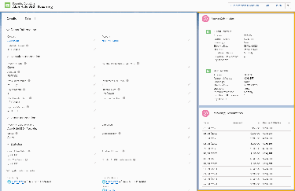

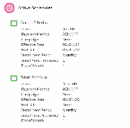

Change a Fixed-Length Recurring Donation

Often a donor chooses to set up a fixed-length donation because they have a target amount or duration

that they want to donate for. Sometimes, though, your donor might ask that you change the amount,

date, or length of their donation.

Let's look at an example. Ron Morimura signed up to donate $1250 per quarter for one year (totaling

$5000 for the year). However, soon after he initially signed up to donate, he called and asked to extend

his giving for a second year.

Let's walk through how to make that update.

11.. Locate a Recurring Donation that you'd like to update. In this example we're going to use Ron's

Recurring Donation record.

22.. Click Edit.

33.. Update these fields:

aa.. Number of Planned Installments = 8 (previously it was 4)

bb.. Effective Date = 7/1/2020 (or whatever the current date is)

44.. Click Save.

Before the update, Ron's Recurring Donation showed four Upcoming Installments.

546

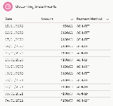

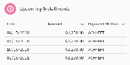

After the update, Ron's Recurring Donation now shows eight Upcoming Installments.

Close a Recurring Donation

Sometimes a donor requests that you end their Recurring Donation. Other times, you might lose contact

with a donor and can't get current payment information. Here's how to close a Recurring Donation.

11.. Locate the Recurring Donation you wish to close.

22.. Click Close Recurring Donation.

33.. Select a Status Reason and an End Date.

44.. Click Save.

Note Administrators: NPSP updates the Stage for open installment Opportunities according to the

behavior defined in NPSP Settings | Recurring Donations | Open Opportunity Behavior on RD

Close.

Delete a Recurring Donation

When you delete a Recurring Donation, NPSP deletes the associated Opportunities. If there are any

associated Closed Won Opportunities, first delete the associated Closed Won Opportunities, then delete

the Recurring Donation.

To delete a Recurring Donation, find the record to delete and click Delete.

When you delete a Recurring Donation, NPSP deletes the associated Opportunities. If there are any

associated Closed Won Opportunities, you won't be able to delete the Recurring Donation. You must

delete the Closed Won Opportunities before you can delete the Recurring Donation.

547

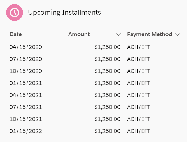

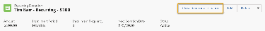

Enter Additional Donations for an Existing Recurring Donation

Learn how to enter an installment Opportunity when your donor asks to make an additional donation

along with their regular Recurring Donation.

NPSP creates installment Opportunities according to the schedule information on the Recurring

Donation record. Sometimes though, a donor might make another donation in addition to their regular

donation. That's great! Here's all you need to do:

11.. Create an Opportunity for the additional donation.

22.. Enter the Primary Contact, Amount, Close Date, and Stage, plus any additional information.

33.. In the Recurring Donation field, add your donor's existing Recurring Donation record.

44.. Save the record.

Update the Schedule of an Annual Recurring Donation

Learn how to update the schedule of an annual Recurring Donation when your donor asks to change

their donation date.

The workflow for changing the schedule of an annual Recurring Donation is slightly different than for

monthly Recurring Donations.

11.. Change the Effective Date to the date of the following year.

22.. Remove the extra installment by pausing it. NPSP removes the extra installment from the schedule,

updates the open Opportunity to the new donation date, and updates the Next Donation Date field.

Let's look at an example.

It's the year 2020 and you have have a Recurring Donation that recurs every October 26th. After your

donor makes their annual donation, they request that you change the recurring date to November 26th

for the following year.

To change the date of an annual Recurring Donation:

548

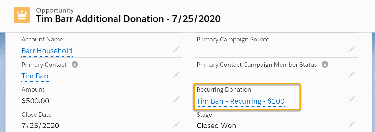

11.. Locate the Recurring Donation you wish to update.

22.. Click Edit.

33.. Change the Effective Date to Nov 26, 2021.

44.. Click Save.

Now look at the Upcoming Installments. Notice that there's two installments in 2021.

This happens because the new schedule doesn't take effect until Nov 2021, so there's still an Oct 2021

installment from the old schedule. Also notice that the Next Installment Date is 10/26/2021 and there

are two schedules in the Active Schedules component.

Your donor probably doesn't want to pay an annual installment in October and then again in November

of the same year, so you need to remove the extra installment by pausing it.

To pause the extra installment:When you pause the extra installment, NPSP does the following:

11.. Locate the Recurring Donation you wish to update.

22.. Click Pause.

33.. Select the extra installment, in this case, the 10/26/2021 installment.

44.. Select a Paused Reason.

55.. Click Save.

•

Removes the extra installment from the schedule

•

Updates the Close Date on the open installment Opportunity to 11/26/2021

•

Updates the Next Installment Date to 11/26/2021

Pause a Recurring Donation

Learn how to temporarily suspend donations, and restart them, when your donor wants to stop giving for

a period of time.

Note Watch the Nonprofit Salesforce How-To Series video about Managing Recurring Donations.

With their recurring giving, your loyal donors provide your organization with a consistent source of

funding. But life happens and a donor sometimes asks to temporarily suspend their giving due to travel,

job loss, or unexpected expenses. To fulfill this kind of request, NPSP provides you with the ability to

pause up to 12 consecutive installments in a Recurring Donation. If you need to pause a Recurring

Donation for more than 12 installments, it's probably best to Close a Recurring Donation.

549

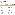

Note If you're asked to pause a Recurring Donation for more than 12 installments, it's probably best

to close the Recurring Donation.

Here's an example scenario: Alex is a college student who donates $75 monthly to your organization.

During an accident, Alex twists his knee and tears a ligament. He doesn't have insurance so treatment is

likely to be expensive, and he still needs to buy books for school. Alex realizes that he has to reduce his

spending and asks you to pause his monthly donations until the beginning of the new year.

To pause a Recurring Donation:

11.. Locate the Recurring Donation record.

22.. Click Pause.

33.. Select a Paused Reason. In our example, choose Financial Difficulty.

44.. Select up to 12 consecutive installments from the list of future installments. In our example, select the

September through December installments.

55.. Save your changes.

550

Note Your administrator can adjust the Paused Reason values by editing the values in the Status

Reason picklist field. Paused Reason uses the same values that are defined in Status Reason. Your

administrator can also enable field history tracking for Status and Status Reason, so you can track

how these fields change over time.

Now look at the Upcoming Installments for the Recurring Donation. Notice that each installment you

selected is marked Paused.

551

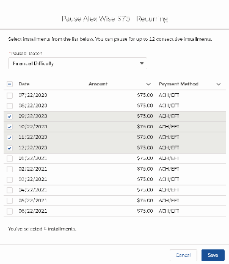

Paused installments appear in the Upcoming Installments component, but NPSP won't create

Opportunities for those installments marked paused. In our example, when you close the 8/22/2020

Opportunity, the next Opportunity NPSP creates is for the 1/22/2021 installment.

Note NPSP reactivates paused installments if you change the Recurring Donation schedule details

such as Amount, Day of Month, or Installment Frequency. Essentially, the new schedule you've

defined replaces the old one.

Edit or Remove a Pause

As we've seen, things can quickly change in the life of a donor. Just as financial difficulty prompts donors

to pause their donations, donors could also ask to resume their donations earlier than expected. When

that happens, you can edit their paused Recurring Donation.

Alex has had a fast recovery from his injury, and he received financial support from a crowdfunding

campaign his friends set up for him. Now, Alex is ready to resume his $75 monthly donations.

To edit a paused Recurring Donation:

11.. Locate the Recurring Donation record.

22.. Click Pause.

33.. Deselect one or more installments. In our example, deselect all paused installments.

552

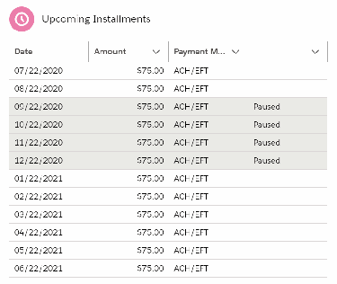

44.. Save your changes.

.

Pause a Fixed-Length Recurring Donation

When you pause a fixed-length Recurring Donation (Recurring Type = Fixed), your donor suspends their

giving but still intends to fulfill the original amount for the Recurring Donation after the pause is over.

For example, let's say you have a fixed-length Recurring Donation where a donor signs up to give $100

per month for six months. The total expected amount is $600. Your donor pays the first installment, then

asks to pause their giving for three months.

In this example, the original installment schedule would look like this, with six consecutive installments:

When you pause the Recurring Donation, the adjusted installment schedule would look like this:

In both cases, your donor fulfills the entire $600. When a donor asks to pause their Recurring Donation,

it takes them longer to fulfill the original planned amount.

553

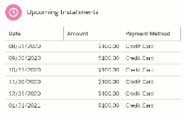

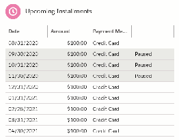

Note If the intention is to skip a certain number of installments entirely, adjust the Number of

Installments instead of pausing the Recurring Donation. Using the previous example, change

Number of Planned Installments from 6 to 3. The result is that the donor would give a total of $300,

instead of the original $600.

Create Allocations for Recurring Donations

Use the Manage Allocations button on a Recurring Donation's GAU Allocations related list to create and

manage Allocations for your Recurring Donations.

When you specify Allocations for a Recurring Donation, Salesforce automatically allocates the donation

accordingly for every open Opportunity assigned to the Recurring Donation.

Note If you're unfamiliar with General Accounting Units (GAUs) and Allocations in NPSP, learn more

at Allocations Overview.

Create Allocations

Assign a GAU Allocation to a donation to designate a specific fund or program for that donation.

Modify Allocations for Recurring Donations

Follow these steps to modify allocations for recurring donations.

Important Considerations

Consider these facts when working with GAU Allocations and Recurring Donations.

Create Allocations

Assign a GAU Allocation to a donation to designate a specific fund or program for that donation.

11.. Open the Recurring Donation for which you want to create GAU Allocations.

22.. Click the Related tab.

33.. In the GAU Allocations related list, click Manage Allocations.

44.. Enter the name of the General Accounting Unit (GAU) to which you want to assign the donation.

55.. Enter either the amount or the percent of the donation you want to allocate.

66.. To allocate the donation into additional General Accounting Units, click Add Row.

77.. To delete an Allocation, click Delete.

88.. Click Save.

554

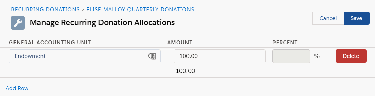

Modify Allocations for Recurring Donations

Follow these steps to modify allocations for recurring donations.

On an Allocation, you can:

•

Update General Accounting Unit.

•

Update the amount being allocated

•

Change from a dollar amount to a percentage

•

Add or delete Allocations

To modify an Allocation:

11.. Open the Recurring Donation that contains the Allocation you want to change.

22.. Click the Related tab.

33.. In the GAU Allocations related list, click Manage Allocations.

44.. Update the Allocation as necessary.

55.. Click Save.

Important Considerations

Consider these facts when working with GAU Allocations and Recurring Donations.

There are a few important things to know about GAU Allocations and Recurring Donations:

•

When you add new Opportunities to an existing Recurring Donation, they automatically receive the

Recurring Donation's allocations.

•

If you add a new Allocation, or modify or delete an existing Allocation of a Recurring Donation,

Salesforce applies the new Allocation to all open Opportunities in the schedule of that Recurring

Donation. Salesforce doesn't modify Allocations for closed Opportunities in the schedule.

•

Recurring donations are NOT automatically allocated to the default General Accounting Unit. If you

enable default Allocations and run the Batch Create Default Allocations process, then all unallocated

amounts in all Recurring Donations Opportunities are assigned to the default GAU.

•

When the amount on an Opportunity with an associated Recurring Donation is updated from null to a

value, Allocations are created based on the Recurring Donation's GAU, instead of the Default

Allocation GAU.

•

If Recurring Donation Allocations exceed the amount of the Opportunity, Salesforce only creates

percent-based Allocations. For example, if a Recurring Donation has two Allocations, one for $10 and

one for 50% of the donation amount, and a new $5 Opportunity is added, Salesforce only creates the

50% Allocation, and doesn't create the $10 allocation, as creating both would exceed the amount of

the Opportunity.

•

If you enter more than one GAU Allocation on a Recurring Donation with the same General

Accounting Unit and with the same amount or percent, only one Allocation populates down to the

installment Opportunities.

•

If you refund a Recurring Donation installment, the Recurring Donation's fixed-amount GAU

Allocations are adjusted to percentages that reflect the proportion of the original allocation amounts.

555

For example: if a Recurring Donation of $50 has two fixed-amount allocations for $25 each, and then

you refund an installment by $25, the allocations adjust to a 50% split.

Track Upgrades, Downgrades, and Other Recurring Giving Changes

Track and report on monthly and other recurring giving changes including upgrades, downgrades,

payment method updates, schedule changes, and status changes.

Overview

Recurring giving rarely stays the same. Donors increase or decrease their giving, pause their giving, and

change forms of payment. By monitoring those changes over time, you gain valuable insights about

your sustaining donors.

Change Log In Action: Upgrade a Recurring Donation

See how the Recurring Donation Change Log works by walking through a typical donation change

scenario.

Report on Recurring Donation Change Logs

Viewing all changes to your Recurring Donations together in a report is a powerful way to analyze the

performance of your sustainer program.

Overview

Recurring giving rarely stays the same. Donors increase or decrease their giving, pause their giving, and

change forms of payment. By monitoring those changes over time, you gain valuable insights about your

sustaining donors.

Recurring giving rarely stays the same. Donors increase or decrease their giving, pause their giving,

change forms of payment, and other changes. By monitoring those changes over time, you gain valuable

insights about your sustaining donors. Standard Salesforce tools only get you part of the way. The

Recurring Donation Change Log helps complete the picture.

The Recurring Donation Change Log helps answers questions like:

•

How well are the monthly giving upgrade appeals working

•

Are lapsed donors rejoining

•

How many donors converted from credit cards to ACH direct deposits?

When you update a Recurring Donation, the Recurring Donation Change Log automatically records those

changes. View the change details directly on Recurring Donation records and in reports.

Note Administrators: Learn how to configure the Recurring Donation Change Log in Configure

Recurring Donations.

556

Change Log In Action: Upgrade a Recurring Donation

See how the Recurring Donation Change Log works by walking through a typical donation change

scenario.

Upgrading the amount of a monthly donation is a great way to illustrate how the Recurring Donation

Change Log works. Let's walk through an example scenario.

Andrea Millman has been a monthly donor for almost a year now. As part of your organization's

fundraising strategy, you send out an upgrade appeal around a recurring donor's one-year anniversary.

Your organization uses Campaigns in Salesforce to track fundraising appeals. Andrea originally became a

monthly donor during your New Member Acquisition 2020 Campaign. Now your organization has sent

out an upgrade appeal through the Monthly Donor Upgrade 2021 Campaign.

In response to your solicitation, Andrea upgrades her donation from $50 per month to $75 per month.

To enter the upgrade:

11.. Locate the Recurring Donation to upgrade.

22.. Edit and change the Amount as requested by the donor. In our example, enter $75. Notice that

Change Type automatically updates to Upgrade.

33.. Update the Campaign. In our example, use the Monthly Donor Upgrade 2021 Campaign.

44.. Save the Recurring Donation.

Find the Change Log component on the Recurring Donation page layout and notice the changes tracked

there.

Andrea continues to increase her giving for the following year, but then asks to pause her giving for a few

months before resuming again. Once she resumes, she changes her payment method from Credit Card

to ACH.

The Change Log component only shows the most recent changes. To see the entire timeline of changes

to a Recurring Donation, click View All in the Change Log component.

The Recurring Donation Change Log automatically assigns a Change Type of Upgrade or Downgrade,

when the Amount or Annual Value changes. NPSP also creates a Change Log when the Status,

Campaign, or Payment Method change, but doesn’t assign a Change Type. Talk to your administrator

about configuring additional Change Types for these scenarios.

557

Report on Recurring Donation Change Logs

Viewing all changes to your Recurring Donations together in a report is a powerful way to analyze the

performance of your sustainer program.

To create a Recurring Donation Change Log report:

11.. Go to Reports.

22.. Create a new report with the Recurring Donations with Recurring Donation Change Logs report type.

33.. Adjust the Show me filter as needed and add or remove columns to suit your needs. These columns

are a good start:

aa.. Recurring Donation Name

bb.. Previous Amount

cc.. New Amount

dd.. Change Type (from Recurring Donation Change Log: Info)

ee.. Status (from Recurring Donation: Info)

ff.. Previous Status

gg.. New Status

hh.. Effective Date (from Recurring Donation Change Log: Info)

ii.. Recurring Donation Change Log Num. Set this column to Sort Ascending.

44.. Save and run the report.

Our example includes a formula that shows the Amount Change for each Recurring Donation Change

Log. Add a row-level formula field to calculate the amount change. Learn how to use formulas in reports,

in Write a Row-Level Formula.

Which Version of Recurring Donations Am I Using?

A Salesforce system administrator can determine the version of recurring donations installed in your org.

To determine which version of Recurring Donations is active in your org, a system administrator should:

11.. Click the NPSP Settings tab. If you don't see the tab, find it in the App Launcher ( ).

22.. Click Recurring Donations | Recurring Donations.

558

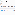

33.. Click Upgrade to Enhanced Recurring Donations.

aa.. If you DO NOT see Upgrade to Enhanced Recurring Donations, then your org is already using

Enhanced Recurring Donations. No further action is needed.

bb.. If you DO see Upgrade to Enhanced Recurring Donations, evaluate the status of your org.

Note If you see a blank page after clicking Upgrade to Enhanced Recurring Donations, you're

missing the required permissions for that page. Assign the apex classes listed in Configure

Recurring Donations to your profile.

Evaluate the Status of Your Org

11.. If all upgrade steps show a green checkmark, your org is using Enhanced Recurring Donations and the

upgrade process is complete. No further action is needed.

22.. If step 2 is checked, but subsequent steps aren't checked, your org is using Enhanced Recurring

Donations, but your data might still be in the Legacy Recurring Donations format. This is highly

problematic! Complete the upgrade process as soon as you can.

559

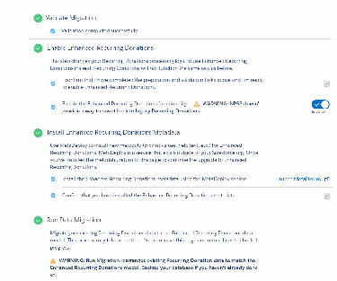

33.. If step 2 is set to Disabled, you're using Legacy Recurring Donations. If you're ready to upgrade, follow

the instructions in the Enhanced Recurring Donations Upgrade Guide.

Enhanced Recurring Donations Upgrade Guide

This guide is for system administrators to plan and perform the upgrade from Legacy to Enhanced

Recurring Donations in NPSP. Also includes information about using the Enhanced Recurring Donations

features.

Enhanced Recurring Donations Upgrade Guide (in PDF format)

This guide provides information on the Enhanced Recurring Donations upgrade process, including

prerequisites, considerations, and error handling. Included are step-by-step instructions for the upgrade

process from testing in a Sandbox, to installing in your production org, plus detailed post-upgrade and

troubleshooting tips.

560

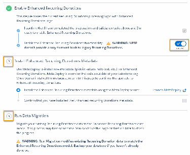

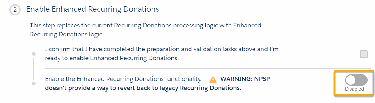

Audience and Prerequisites

To use this guide successfully, you must be a System Administrator with detailed knowledge of both

NPSP and the customizations present in your org. You should be comfortable with a wide variety of

admin tasks, such as managing workflows, running batch processes, managing user profiles, and

troubleshooting errors.

Manage Rollups

Rollup fields are custom fields that display information from other related records, including aggregate

totals. Learn about customizable rollups and legacy rollup solutions.

Rollups Overview

Rollup fields are custom fields that display information from other related records, including aggregate

totals. To think of this another way, rollup fields allow information from Opportunities or Payments to

automatically "roll up" and appear on a related Account, Contact, General Accounting Unit, or

Recurring Donation records.

Manually Recalculate Rollups

Rollups are calculated in batch jobs as part of the nightly build.

Rollups Overview

Rollup fields are custom fields that display information from other related records, including aggregate

totals. To think of this another way, rollup fields allow information from Opportunities or Payments to

automatically "roll up" and appear on a related Account, Contact, General Accounting Unit, or Recurring

Donation records.

For example, the Total Gifts field on an Organization Account displays the total value of all the donations

from that organization—it's the total value from across all the associated Opportunity records “rolled up”

into one.

There are multiple types of rollups available to Nonprofit Success Pack users. This can be confusing if

you're trying to figure out what you're already using, what you can (or should) use, and how they all

compare. But, before we get into what each one does, let's look at the history.

Original Salesforce standard roll-up summary fields were created to work with master-detail

relationships, and therefore when rolling up Opportunity records, only work with Accounts. But that

doesn't make sense for nonprofits, who need to track donors and donations, and need their rollups to be

based on Contact information.

Seeking to solve this problem for NPSP users, the NPSP team created a collection of out-of-box rollups.

There are approximately 87 out-of-box rollups that appear on the Account, Contact, Recurring Donation,

and General Accounting Units objects and roll up data related to Opportunity Amount and Close Date.

NPSP users loved these rollups, but also wanted to be able to see more rollup information.

561

So, the NPSP team thought “Why not let users define their own rollups?” Enter User Defined Rollups

(UDR), a feature that allowed users to create rollups that work with custom fields. That solved everything,

right? Well, as many of you know, the story doesn't end there! User Defined Rollups, which filled some of

the users' needs that out-of-box rollups could not, left users wanting more. Users didn't want to be so

limited in choosing what to roll up and what rollup types were available, and while many clever admins

found ways to use UDR in combination with formula fields to cover more use cases than we had ever

envisioned, they found the process time consuming and complicated.

The NPSP team went back to the drawing board once more. After many long months of reviewing

Community feature requests, strategizing, prototyping, revising, and coding... Customizable Rollups was

born. Customizable Rollups provides the flexibility and functionality that users have long been asking for

(and you can roll up Payments!). Read on to find out more.

Customizable Rollups

With Customizable Rollups, you have complete control and flexibility over the donor statistics your

organization needs. You can create highly customized rollups that roll up either data from Opportunities,

Payments, or Soft Credits (including Partial Soft Credits). (Yes, you read that right!) You can create custom

donation rollup fields on Accounts, Contacts, General Allocation Units, or Recurring Donations and you

can also edit the definition of legacy out-of-box rollups. We also provide the ability to edit which records

are filtered out, just like in reports! You can even create your own filters and apply them to individual

rollups. And with Customizable Rollups enabled, NPSP is compatible with Advanced Currency

Management, which means your donor statistics can reflect changes in currency value over time.

With legacy User Defined Rollups, you could take the largest gift and only copy that amount to your

Target field. But, with Customizable Rollups, you can select the largest gift, and copy any field from that

gift to your Target field. So for example, let's say you want to know what Campaign brought in the largest

gift for an Account or Contact. You can create a rollup that finds the largest gift, and copies the

Campaign from that Opportunity to your Target field. You can even create a lookup field directly to that

gift or that Campaign!

Customizable Rollups are available as part of NPSP when using the Household Account Model. They are

enabled by default for all new NPSP Trials starting with version 3.155 (May 2019); all other orgs have to

turn the feature on. And when you do, all existing out-of-box and User Defined Rollups are converted

into Customizable Rollups so that you can edit and enhance them as needed. Note that if you have User

Defined Rollups for the Household object in your organization, and you enable Customizable Rollups,

those Household UDRs won't be be converted. For more information on Customizable Rollups, see the

Customizable Rollups Overview.

NPSP Legacy Rollups

NPSP includes approximately 87 out-of-box rollups. With these "donor statistic" rollups you can get a big

picture view of a donor's history just by looking at their Contact record (instead of having to peruse

actual donation history that is spread out over many related objects). For more information on legacy

out-of-box rollups, see NPSP Out-of-Box Donation Rollups (Legacy).

562

NPSP Legacy User Defined Rollups

With User Defined Rollups, you can create new rollups on Accounts, Contacts, or Households (for those

still using the One-to-One or Individual Bucket model). For more information, see User Defined Rollups.

Manually Recalculate Rollups

Rollups are calculated in batch jobs as part of the nightly build.

For information on the jobs, see Default Batch Job Names and Classes.

But, if you need them updated sooner, you can manually recalculate the batches or recalculate an

individual Account, Contact, Recurring Donation, or GAU's rollups.

To manually recalculate an individual Account, Contact, Recurring Donation, or GAU's rollups:

11.. Go to the detail page for the record.

22.. In the list of available buttons, click Recalculate Rollups.

Note If you don't see this button, your administrator may need to add it to the appropriate page

layouts.

33.. The recalculation process will run in the background and you may need to refresh the page after a few

minutes to see the new rollup values.

For information on manually recalculating rollup batches, see Run Rollup Donations Batch.

Manage Soft Credits

Manage Soft Credits with the Nonprofit Success Pack.

Soft Credits Overview

Soft credits are a fundraising concept that represent recognition of credit for donations. Soft credits

help you to better understand a donor's history and their level of influence.

Automated Soft Credits

Configure NPSP to create soft credits automatically.

Manually Create Soft Credits

Use the Nonprofit Success Pack to manage full and partial soft credits.

NPSP Logic for Creating Opportunity Contact Roles

Learn what NPSP automation for creating soft credits takes precedence when multiple automated

processes are involved.

Soft Credits Overview

Soft credits are a fundraising concept that represent recognition of credit for donations. Soft credits help

563

you to better understand a donor's history and their level of influence.

What is a Soft Credit?

Soft credits are a fundraising concept that represent recognition of credit for donations. Soft credits

help you to better understand a donor's history and their level of influence.

Soft Credits and Opportunity Contact Roles

Most soft credits use an Opportunity Contact Role (OCR). OCRs connect a Contact to an Opportunity

and define a role for each Contact.

Types of Soft Credits

NPSP includes both automated and manual soft credits.

Soft Credit Rollups

NPSP aggregates soft credit totals using rollup fields. You can find soft credit rollup fields in the Soft

Credit Total section of a Contact record.

A Word About the Nightly Batch

Nonprofit Success Pack calculates soft credit rollups in its nightly batch, so you won't see an

immediate change to a Contact's soft credit rollup fields right after you assign them a soft credit

Contact Role. If you want to see updates immediately, your administrator can manually recalculate

rollups.

What is a Soft Credit?

Soft credits are a fundraising concept that represent recognition of credit for donations. Soft credits help

you to better understand a donor's history and their level of influence.

In Nonprofit Success Pack (NPSP), many soft credits are assigned automatically, and you can assign soft

credits manually. NPSP summarizes soft credit history using roll up fields.

A common example of a soft credit is a matching gift: Jane Smith gives $100 to your organization, and

her company matches the $100, resulting in a $200 donation. In NPSP, you track the first $100 as a hard

credit (the actual money that came from Jane), and the matched $100 as a soft credit because Jane

influenced, but didn't donate, the money.

Soft credits come in many types and apply to both people (Contacts) and organizations (Accounts).

Soft Credits and Opportunity Contact Roles

Most soft credits use an Opportunity Contact Role (OCR). OCRs connect a Contact to an Opportunity

and define a role for each Contact.

For example, Jane might be the Donor on an Opportunity, while John might be an Influencer. You track

both Contacts, and their respective roles, with Opportunity Contact Roles because both people helped

bring in the donation.

Nonprofit Success Pack comes with the following Opportunity Contact Roles out-of-the-box:

564

•

Donor

•

Household Member

•

Soft Credit

•

Matched Donor

•

Honoree

•

Notification Recipient

•

Grant Manager

•

Decision Maker

•

Influencer

•

Solicitor

•

Workplace Giving

•

Other

Note OCRs are completely customizable by your database administrator. The admin can edit the

out-of-box roles, create new roles, and control which roles count as a soft credit. Learn more in

Configure Automated and Manual Soft Credits.

Not all Opportunity Contact Roles count as soft credits.

If your admin designates that an OCR should count as a soft credit, then any Contact assigned that

OCR receives a soft credit. Your administrator can help you understand which OCRs are configured to

count as soft credits in your org.

So, how do you assign soft credits when entering gift information? Most of the time it happens

automatically. Read on to learn more.

Types of Soft Credits

NPSP includes both automated and manual soft credits.

AAuuttoommaatteedd SSoofftt CCrreeddiittss

Automated soft credits are tracked in NPSP using Opportunity Contact Roles (OCRs) and include these

types:

Household Member Soft Credits

Everyone in a Household receives credit for a donation made by any other Household member.

The donor receives a hard credit for the gift and everyone else receives the Household Member

soft credit.

Matching Gift Soft Credits

Matching Gifts track a donation that a corporation made as a match for a donation from one of

their employees. The employee gets automatically assigned a Matched Donor soft credit.

565

Tribute Gift Soft Credits

Tribute Gifts track donations given in honor of or in memory of someone. Depending on the type

of Tribute Gift, NPSP assigns either the Honoree or Notification Recipient soft credit.

Relationship Soft Credits

NPSP assigns soft credits to Contacts associated with Relationship records. For example, your

organization wants to recognize gifts that board members help to bring in by assigning a soft

credit each time donors with whom they have a Relationship record in NPSP make donations.

Affiliation Soft Credits

NPSP assigns soft credits to Contacts for Organizational donations based on Affiliation records.

For example, the members of a family foundation want to receive a soft credit for every donation

made by their family foundation.

Primary Contact Soft Credits on an Organizational Gift

NPSP assigns soft credits to Contacts that are the Primary Contact on Organizational gifts. For

example, the owner of a small business wants to receive soft credit each time their company

makes a donation.

MMaannuuaall SSoofftt CCrreeddiittss

Create manual soft credits when you need to assign partial soft credits, assign soft credits to

organizations, or for any special soft credit scenarios that arise.

Manually Assigned Soft Credits

Create an Opportunity Contact Role manually to assign a single soft credit. This is useful for

unique scenarios that aren't covered by automated soft credits.

Partial Soft Credits

Create Partial Soft Credit records to assign portions of a soft credit to one or more Contacts. For

example, let's say your board of directors assist with fundraising. If two board members work

together to win a large contribution from a major donor, you could use Partial Soft Credits to

assign 50% of the soft credit for the major gift to each board member.

Account Soft Credits

Create Account Soft Credit records to assign soft credit to a company or organization. Sometimes

one company might use another company to manage its corporate philanthropy and giving

programs. For example, Universal Containers (UC) owns a philanthropic subsidiary company,

called GivePlenty, that disburses corporate grants to nonprofits. When GivePlenty awards grants

to nonprofit organizations, the check is written by GivePlenty, so they get the hard credit. In this

scenario, you could assign Account Soft Credits to Universal Containers to recognize the

involvement of the parent company.

566

Account Contact Soft Credit Rollups

Account Contact Soft Credit rollups aggregate all Household members' soft credits and roll them

up to the Household. Your administrator can enable these rollups using Customizable Rollups.

Learn more in Create Account Contact Soft Credits.

Soft Credit Rollups

NPSP aggregates soft credit totals using rollup fields. You can find soft credit rollup fields in the Soft

Credit Total section of a Contact record.

NPSP aggregates soft credit totals using rollup fields. There are many soft credit rollups for Contacts that

come out-of-box in NPSP. If you're using Customizable Rollups, your administrator can add more soft

credit rollups, including rollups that aggregate soft credits for all Contacts in a Household and roll them

up to the Household Account. Learn more in Customizable Rollups Overview.

You can find soft credit rollup fields in the Soft Credit Total section of a Contact record.

A Word About the Nightly Batch

Nonprofit Success Pack calculates soft credit rollups in its nightly batch, so you won't see an immediate

change to a Contact's soft credit rollup fields right after you assign them a soft credit Contact Role. If you

want to see updates immediately, your administrator can manually recalculate rollups.

Learn more in Manually Recalculate Rollups.

567

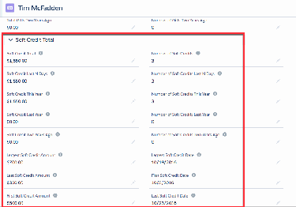

Automated Soft Credits

Configure NPSP to create soft credits automatically.

You can assign a soft credit manually, which is great for the occasional one-off situation. But what if you

routinely need to assign soft credits for certain types of donations?

Fortunately, you can configure NPSP to create soft credits automatically. The most common example is

the Household soft credit. When one member of a household makes a donation, all other members of

that household automatically get a soft credit. This gives you a well-rounded picture of each person's

contributions to your organization.

Many organizations get by just fine with only Household soft credits. But some organizations have

scenarios that require a little more attention. Depending on the kind of organization you work for, you

might have to accommodate donor advised funds, memorial gifts, planned giving, board members,

major donor portfolios, giving circles, crowdfunding, peer-to-peer fundraising, and much more. In many

of these cases, you need to assign soft credits to one or more people, such as a board member,

members of a family foundation, or simply relatives who don't live in the same household. Let's look at a

few examples.

11.. Gabriela is a board member with Universal Containers, a large shipping company. She is a vocal

proponent of corporate philanthropy and environmental stewardship. She contacts Friends of Buena

Vista Bay and makes a commitment that Universal Containers will reduce their non-recycleable waste

by 15%. She also pledges a $50,000 corporate sponsorship for Buena Vista Bay's restoration and

cleanup projects. The database administrator at Buena Vista Bay enters the sponsorship information,

and includes Gabriela as the Primary Contact. This automatically generates a soft credit for Gabriela to

recognize her role in coordinating the sponsorship.

22.. Crystal is a fund development officer with Paws Animal Shelter and is assigned to 10 people to solicit

for a new shelter facility. She solicits Rashaad who volunteers at the shelter a couple of times a month.

The database administrator at the animal shelter sets up an automated soft credit on a Relationship

record so that when a donation from Rashaad comes in, Crystal receives a Solicitor soft credit. The

development director can also run a report of all fundraisers who have a Solicitor credit to see who has

met their goals.

33.. Rose, Andy, and Lauren are part of the Murray Family Foundation. The family foundation makes

periodic donations to the Conservation Land Trust throughout the year, and the Land Trust wants to

make sure that each member of the family foundation is recognized for the contributions. The

database administrator at the land trust sets up automated soft credits on an Affiliation record for

each family foundation member so that when a donation from the family foundation comes in, each

member receives a soft credit.

Getting all of this right is important. Donors with complex needs expect that you represent their family,

businesses, associates, and financial institutions correctly, and that your organization credits the right

people for the donations they've helped to bring in.

NPSP lets you configure soft credit contact roles in multiple ways to accommodate these different

scenarios. And since NPSP creates the soft credits automatically, you can scale your fundraising efforts

568

while continuing to honor the wishes of your donors.

NPSP can create automated soft credits for a Contact when the Contact is a:

•

Member of a donor's Household

•

Primary Contact on an Organizational Opportunity

•

Honoree or Notification Contact on an Opportunity

•

Related Contact on a Relationship record with an Individual donor

•

Contact on an Affiliation record with an Organizational donor

Matching Gifts is an additional way that NPSP automatically assigns soft credits. Learn more in Work with

Matching Gifts.

Since there are many ways to automatically create Opportunity Contact Roles and soft credits in NPSP,

you may have situations where more than one automated soft credit rule applies. Fortunately, NPSP

applies an order of precedence to avoid creating duplicate Contact Roles. Learn more in NPSP Logic for

Creating Opportunity Contact Roles.

Create Automated Soft Credits for Household Members

Automatically assign soft credits to all members of a Household when one member makes a donation.

Create Automated Soft Credits for the Primary Contact on an Organizational Gift

Sometimes you may need to assign a soft credit to the Primary Contact of an Organizational gift. While

you can create an Opportunity Contact Role manually, NPSP can automatically create one for you.

Create Automated Soft Credits for Relationships

NPSP can automatically create soft credits for Individual donations based on Relationship records.

Create Automated Soft Credits for Affiliations

NPSP can automatically create soft credits for Organizational donations based on Affiliation records.

Calculate Soft Credit Totals

The Soft Credit Totals update when the nightly batch jobs run. If you need to recalculate soft credits

outside of the nightly batch, your administrator can manually recalculate the entire batch or for a

single Account or Contact.

Create Automated Soft Credits for Household Members

Automatically assign soft credits to all members of a Household when one member makes a donation.

With Household soft credits, everyone in the Household receives a soft credit for a donation made by

anyone else in the Household. However, soft credits for existing Opportunities aren’t given to new

Household Account members unless you merge their existing Household account with the new

Household account while adding the new contacts to the household. There are two ways to do perform

the merge:

•

Merge two or more Contacts, which merge their Household accounts

•

Use Manage Household to add an existing contact and merge both households

For more information and examples, see Soft Credits Overview.

569

Tip When creating a new donation, assign the Primary Contact to the individual in the Household

who “signed the check,” and then let the NPSP assign Household Member Contact Roles to

everyone else in the Household.

Let's try out an example. We'll use example data data values, but feel free to enter your own.

11.. Find or or create a Contact whose Household contains more than one member.

22.. Click New Donation.

33.. Enter these values:

aa.. Close Date = Today's date

bb.. Stage = Closed Won

cc.. Amount = $100

dd.. Leave the remaining fields blank or with their default value.

44.. Click Save.

55.. Click the newly created Opportunity record.

66.. Find the Contact Roles related list. It may be in the sidebar, or click Related to find it.

77.. Notice that the donor and every household member has a Contact Role. NPSP assigns the Donor role

to the original donor, and the Household Member role to every other household member. The

Household Member role represents soft credits.

Create Automated Soft Credits for the Primary Contact on an Organizational

Gift

Sometimes you may need to assign a soft credit to the Primary Contact of an Organizational gift. While

you can create an Opportunity Contact Role manually, NPSP can automatically create one for you.

Sometimes you may need to assign a soft credit to the Primary Contact of an Organizational gift. While

you can create an Opportunity Contact Role manually, NPSP can automatically create one for you. Before

you begin, make sure you configured your Contact Roles settings. If you need a refresher, see Configure

Soft Credit Rollups.

Let's try out an example. Some data values are from the examples above, but feel free to enter your own.

11.. Find or create an Organization Account.

22.. Click the Related tab.

33.. Find the Opportunities related list and click New.

570

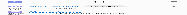

44.. Choose the Donation record type.

55.. Enter these values:

aa.. Amount = $50,000.

bb.. Close Date = Today.

cc.. Stage = Posted (or any Closed/Won stage). NOTE: Our example uses a Closed/Won Opportunity

Stage, but NPSP will create a soft credit role for any Opportunity Stage.

dd.. Primary Contact = Any Contact in your system.

66.. Click Save.

77.. You may need to click the new Opportunity's name in the confirmation message to view the record.

The resulting Opportunity should look something like this:

Notice that the Contact you selected for Primary Contact is listed in the Contact Roles section of the

Opportunity record with the Influencer role.

Now, navigate to the Contact record and look at the Related section. You should see the new

Opportunity listed there.

571

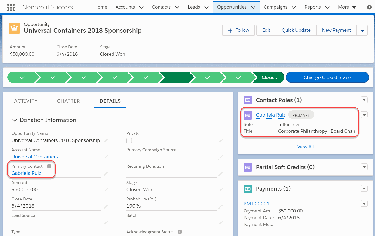

Create Automated Soft Credits for Relationships

NPSP can automatically create soft credits for Individual donations based on Relationship records.

Note Watch the Nonprofit Salesforce How-To Series video about Relationship Automated Soft

Credits.

NPSP can automatically create soft credits for Individual donations based on Relationship records. For

example, a donor may request that for each gift they give, you create a soft credit for a relative who lives

in a separate household. Or, you can use Relationship records to track who the solicitor is for a donor,

and NPSP soft credits the solicitor when gifts are made.

Use the Related Opportunity Contact Role field to indicate which Contact Role to assign to the Related

Contact in the Relationship record.

Let's try out an example. Some data values are from the examples above, but feel free to enter your own.

11.. Find or create a Relationship record.

22.. On the Relationship record, choose a value for Related Opportunity Contact Role. Let's use "Solicitor"

for our example.

33.. We're also using "Solicitor" in the Type field, but you can use whatever value is appropriate (Friend,

Family, Employer, etc). Type is only used to describe the nature of the relationship between the two

people, and has no bearing on how automated soft credits work.

44.. Click Save.

Tip Set only one Related Opportunity Contact Role on a Relationship for two Contacts. If you have

more than one Relationship record for the same Contacts, NPSP will use the most recently

created Relationship record.

572

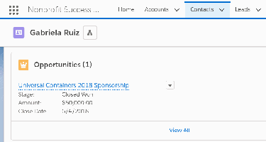

55.. Click the Contact on the Relationship, in this example, Rashaad Davis.

66.. Click the New Donation button.

77.. Enter these values:

aa.. Amount = $100.

bb.. Close Date = Today.

cc.. Stage = Posted (Closed/Won).

88.. Click Save.

99.. You may need to click the new Opportunity's name in the confirmation message to view the record.

On the Opportunity record, you should see Contact Roles for both the Primary Donor and the Related

Contact. You may also see Household Member credits if there are other Contacts in the donor's

Household.

573

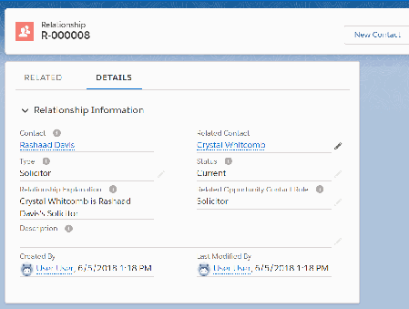

Let's review how automated soft credits for Relationships work. When you create an Opportunity for the

Contact (1), NPSP creates a soft credit role for the Related Contact (2).

If you create an Opportunity for the person in the Related Contact field of the Relationship record, NPSP

will not create a soft credit role for the person in the Contact field. If you want it to work that way, set a

Related Opportunity Contact Role for the reciprocal relationship.

If you want NPSP to stop generating automated soft credits for a Relationship, remove the value in the

Related Opportunity Contact Role field on the Relationship record and leave it blank. The Status field

574

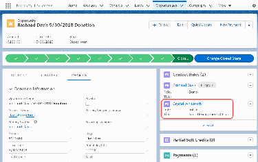

does not affect automated soft credits; they continue to function regardless of Status field value. Use

Process Builder if you want to update the Related Opportunity Contact Role field based on the value of

other fields, such as Status or other custom fields.

Create Automated Soft Credits for Affiliations

NPSP can automatically create soft credits for Organizational donations based on Affiliation records.

NPSP can automatically create soft credits for Organizational donations based on Affiliation records. For

example, perhaps the members of a family foundation want to receive a soft credit for every donation

made by their family foundation.

Use the Related Opportunity Contact Role field to indicate which Contact Role to assign to the Contact

on the Affiliation record.

Note NPSP includes only active Opportunity Contact Roles for Affiliation-based automated soft

credits.

Let's try out an example. Some data values are from the examples above, but feel free to enter your own.

11.. Find or create an Affiliation.

22.. On the Affiliation record, choose a value for Related Opportunity Contact Role. Let's use "Soft Credit"

for our example.

33.. Click Save.

44.. Optional: Find or create a few more Affiliations with the same Organization and choose "Soft Credit"

for each Related Opportunity Contact Role field.

Tip Set only one Related Opportunity Contact Role on an Affiliation for a given Account and

Contact. If you have more than one Affiliation record for the same Account and Contact, NPSP

will use the most recently created Affiliation record.

575

55.. Click the Organization on the Affiliation, in this example, Murray Family Foundation.

66.. Click the New Donation button.

77.. Enter these values:

aa.. Amount = $1000.

bb.. Close Date = Today.

cc.. Stage = Posted (Closed/Won). Note: Our example used a Closed/Won Opportunity Stage, but NPSP

will create a soft credit role for any Opportunity Stage.

88.. Click Save.

99.. You may need to click the new Opportunity's name in the confirmation message to view the record.

On the Opportunity record, you should see a soft credit Contact Role for each Contact from the

Affiliation record or records you set a Related Opportunity Contact Role for.

576

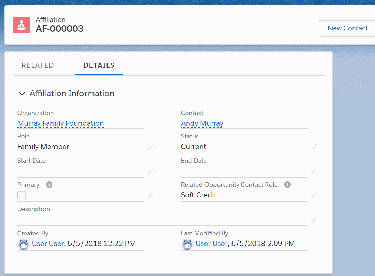

If you want NPSP to stop generating automated soft credits for an Affiliation, remove the value in the

Related Opportunity Contact Role field on the Affiliation record and leave it blank. The Status field does

not affect automated soft credits; they continue to function regardless of Status field value. Use Process

Builder if you want to update the Related Opportunity Contact Role field based on the value of other

fields, such as Status or other custom fields.

Calculate Soft Credit Totals

The Soft Credit Totals update when the nightly batch jobs run. If you need to recalculate soft credits

outside of the nightly batch, your administrator can manually recalculate the entire batch or for a single

Account or Contact.

Recalculating rollups updates the Opportunity rollup fields (including the soft credit rollups) on your

Contact, Account, and Household records. Learn more in Manually Recalculate Rollups.

Manually Create Soft Credits

Use the Nonprofit Success Pack to manage full and partial soft credits.

Full Soft Credits Versus Partial Soft Credits

There are two kinds of soft credits in the Nonprofit Success Pack. A full soft credit is a soft credit for the

entire amount of the donation. A partial soft credit is a soft credit for an amount that is only a portion

of the larger donation.

Assign Full Soft Credits

Nonprofit Success Pack creates soft credits based on Opportunity Contact Roles, and the settings

you've specified.

Assign Partial Soft Credits

Manually assign partial soft credits to Contacts who have a role in donations you receive.

Create Account Soft Credits

Create soft credits for Accounts to track their role in donations you receive.

Create Account Contact Soft Credits

577

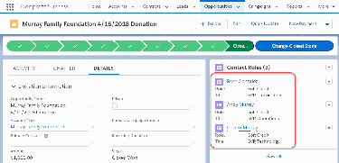

Account Contact Soft Credit rollups aggregate all Household members' soft credits and roll them up to

the Household.

Full Soft Credits Versus Partial Soft Credits

There are two kinds of soft credits in the Nonprofit Success Pack. A full soft credit is a soft credit for the

entire amount of the donation. A partial soft credit is a soft credit for an amount that is only a portion of

the larger donation.

There are two kinds of soft credits in the Nonprofit Success Pack:

A full soft credit is a soft credit for the entire amount of the donation. For example, Mary gives $100,

Company Awesome matches $100, Mary gets soft credit for Company Awesome's $100 donation. You

can create full soft credits manually, or enable automated soft credits.

A partial soft credit is a soft credit for an amount that is only a portion of the larger donation. For

example, organizations like Network for Good and United Way collect donations on behalf of an

organization's constituents, and typically share them with nonprofits on a regular basis (monthly or

quarterly). The nonprofit creates a single Opportunity record for the larger check received, but needs to

soft credit its individual constituents accordingly.

Note Partial soft credits are also important for matching gifts, but we'll talk about that in another

section.

All Soft Credit attributions appear in the Contact Roles related list on an Opportunity. However, if the

Opportunity includes partial soft credits, then the Soft Credit attribution also appears in the

Opportunity's Partial Soft Credits related list.

578

In the above example, we're using the "Soft Credit” Contact Role to track Partial Soft Credits on

Opportunities. The screen shot shows a single $1000 donation that's come in from Network for

Passthrough, with Soft Credit Contact Roles assigned to the four donors responsible for the aggregate

donation. In the Partial Soft Credits related list, you can also see the amount that each individual gave,

and thus the amount that will be rolled up to the Soft Credits section of each donor's Contact record.

It's perfectly fine and expected to see the same soft credit listed in both the Contact Role and Partial Soft

Credits related lists. Every Partial Soft Credit record should have a corresponding Contact Role record.

Not every Contact Role record will have a corresponding Partial Soft Credit record.

Assign Full Soft Credits

Nonprofit Success Pack creates soft credits based on Opportunity Contact Roles, and the settings you've

specified.

If you haven't read the Soft Credits Overview, Configure Soft Credit Rollups, and Automated Soft Credits,

you should do so before proceeding.

Note Watch the Nonprofit Salesforce How-To Series video about Full Soft Credits.

Important For soft credits to roll up from the Opportunity to the Contact's record, the Opportunity

must be of a type that rolls up. In general you should not need to worry about this, unless you've

excluded specific Opportunity types or record types from rolling up.

11.. Navigate to an Opportunity record.

22.. On the Contact Roles related list, click Edit Contact Roles.

579

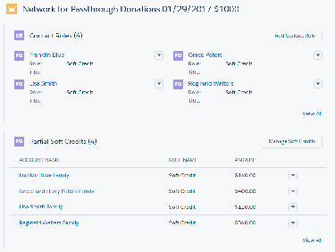

33.. Enter the Contact to whom you want to assign the soft credit.

44.. Set the Role to the correct value. It should be a role that's been configured to receive soft credits.

55.. Click Add Row to add another Contact Role. Once you've selected all Contacts and assigned roles,

click Save.

Assign Partial Soft Credits

Manually assign partial soft credits to Contacts who have a role in donations you receive.

Note Watch the Nonprofit Salesforce How-To Series video about Partial Soft Credits.

The Nonprofit Success Pack creates soft credits based on Opportunity Contact Roles, and the settings

you've specified. If you haven't read the Soft Credits Overview and Configure Automated and Manual

Soft Credits, you should do so before proceeding.

Note NPSP How-To Series: Partial Soft Credits

Important For soft credits to roll up from the Opportunity to the Contact's record, the Opportunity

must be of a type that rolls up. In general you should not need to worry about this, unless you've

excluded specific Opportunity types or record types from rolling up.

11.. Navigate to an Opportunity record.

22.. In the top right corner of the page, click Manage Soft Credits. You should see all of the Contacts who

have Contact Roles already assigned on this Opportunity. You may also see no Contacts listed if no

Contact Roles have been assigned.

33.. Assign Partial Soft Credits by clicking the Partial radio button for the appropriate Contact, and entering

the amount for their partial soft credit.

Note You MUST have the Partial radio button selected to enter soft credit amounts. Selecting the

Full radio button populates the Amount field with 100% of the Opportunity. This amount will not

be editable.

44.. Additionally, you can click Add another soft credit, browse to more Contacts, and assign them partial

soft credits as well.

Note When adding new Partial Soft Credits, you'll only be able to select Contact Roles that are

eligible for soft credit rollups. However, if Customizable Rollups is enabled in your org, you'll see

all Contact Roles (all the values listed in Setup | Contact Roles on Opportunities). Be sure to

select one that you know is included in a Soft Credit Filter Rule. Ask your admin if you are unsure.

55.. (Optional) Select Allow Soft Credit Amount more than Total Amount if you need to credit Contacts

for more than the Opportunity Amount. For example, if you have 2 Contacts who should receive

Influencer soft credit for the entire $1000 Amount of the Opportunity, and a third Contact who is only

credited for $100, that would bring the total soft credit amount to $2100 on a $1000 gift.

66.. When you're finished, click Save.

580

Create Account Soft Credits

Create soft credits for Accounts to track their role in donations you receive.

Note Watch the Nonprofit Salesforce How-To Series video about Account Soft Credit.

Three Contacts from ABC Corp indicate that they each want a $100 donation taken out of their paycheck

and given to a local food pantry. ABC Corp matches those donations. So, CorpMatch sends a check to a

local food pantry in the amount of $600. Make sure that ABC Corp gets soft credit for the $300 match

using an Account soft credit.

11.. Enter the Opportunity from CorpMatch in the amount of $600.

22.. On the Opportunity, go to the Account Soft Credits related list and click New.

33.. Select the Account to soft credit. For our example, choose ABC Corp.

44.. Enter the Amount of the soft credit. It can be a partial amount. Since ABC Corp. matched $300 worth

of donations, we will enter that amount.

Note Enter a soft credit that's less than or equal to the original donation amount. Entering a larger

soft credit causes your rollups to show inaccurate amounts.

55.. Select the Role. Be sure to select a Role that is included in a filter rule applies to your Account Soft

Credit rollup(s)!

66.. Click Save.

77.. If you have Account Soft Credit rollups configured, you should now see that $300 reflected in Account

soft credit rollups on ABC Corp.'s Account.

581

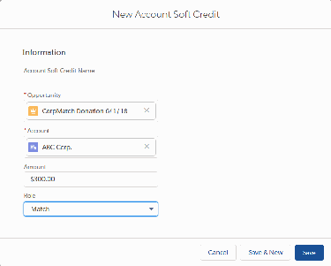

Create Account Contact Soft Credits

Account Contact Soft Credit rollups aggregate all Household members' soft credits and roll them up to

the Household.

If you enable Customizable Rollups, you can create Account Contact Soft Credits. Account Contact Soft

Credit rollups aggregate all Household members' soft credits and roll them up to the Household. To take

advantage of Account Contact Soft Credits, create a rollup as follows:

11.. Go to the NPSP Settings tab. If you don't see the tab in your org, you can find it from the App

Launcher.

22.. Click Donations | Customizable Rollups.

33.. Click Configure Customizable Rollups .

44.. Click New.

55.. Enter the rollup details. We'll provide example values for a Total Soft Credits rollup.

aa.. In the Target Object field, select Account.

bb.. Select a Target Field. For example, you might have a custom field called Total Soft Credits.

cc.. Enter a Description. For example, The total amount of soft credits received by

Contacts in this Account.

dd.. Enter an Operation. For example, select Sum.

ee.. Enter a Time Frame. For example, All Time.

ff.. In the Rollup Type field, select Opportunity > Account (Contact Soft Credit).

gg.. (Optional) Select a Filter Group. For example, select Opps: Won (SC).

hh.. In the Amount Field, under Advanced Customizations, select a value. For example, Soft Credit:

Amount.

582

66.. Click Save.

NPSP Logic for Creating Opportunity Contact Roles

Learn what NPSP automation for creating soft credits takes precedence when multiple automated

processes are involved.

Note Watch the Nonprofit Salesforce How-To Series video about Opportunity Contact Roles Logic.

Since there are many ways to automatically create Opportunity Contact Roles and soft credits in NPSP,

you may have situations where more than one automated soft credit rule applies. For example, John and

Sally may be Household members, and may also have a Relationship record to track that they're siblings.

If Sally makes a donation, depending on how you've configured soft credits in NPSP Settings and fields

on the Relationship record, John may be eligible for both a Household member soft credit and a soft

credit based on his Relationship record with Sally.

It would get confusing to have multiple contact roles for the same Contact on the same Opportunity. So

NPSP cleverly creates just one.

But how does it determine which one to create? For example, if the same Contact is listed as both the

Honoree and Notification Recipient, how does NPSP decide which role to go with and which to ignore?

The answer, dear friends, lies in this prioritized list:

583

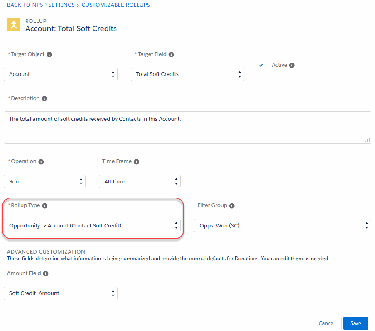

Order of Precedence for Contact Roles

11.. Primary Contact

22.. Honoree Contact

33.. Notification Recipient

44.. Affiliated Contact (organizational gift) or Related Contact (individual gift)

55.. Household Member (individual gifts only)

Note Individual gift means Opportunities related to a Household, One-to-One, or Individual

Account. Organizational gifts means Opportunities related to an Account that is not a Household,

One-to-One, or Individual Account.

What the above list means is that if Bob Blackman is listed as both the Honoree Contact and the

Notification Recipient on an Opportunity, NPSP will create only an Honoree Contact Role for Bob, since

Honoree is higher up the chain than Notification Recipient.

On a different Opportunity, if Bob is listed as the Notification Recipient and is also an Affiliated Contact,

NPSP creates a Notification Recipient contact role for Bob.

Or, if there's an Opportunity where Bob is the related Contact on a Relationship record with the Primary

Contact, and Bob is also the Primary Contact's Household Member, NPSP creates the Contact Role based

on the Relationship.

Where does the Role value come from?

For most of the Opportunity Contact Roles, NPSP gets the role value from NPSP Settings. For affiliated

contact and related contact Opportunity Contact Roles, NPSP gets the role value from fields on the

Affiliation or Relationship record, as shown:

Role Creation Based Where Role Value is NPSP Setting or Field Individual or

On Configured Name Organizational Opp

Primary Contact NPSP Settings Contact Role for Organizational

Organizational Opps

Primary Contact NPSP Settings Contact Role for Individual

Individual Opps

Honoree Contact NPSP Settings Honoree Opportunity both

Contact Role

Notification Recipient NPSP Settings Notification Recipient both

Contact Role

Affiliated Contact Affiliation record Related Opportunity Organizational

Contact Role

584

Role Creation Based Where Role Value is NPSP Setting or Field Individual or

On Configured Name Organizational Opp

Related Contact Relationship record Related Opportunity Individual

Contact Role

Household Member NPSP Settings Household Member Individual

Contact Role

Putting It All Together

Let's look at some specific scenarios to see how all of this works.

Scenario Overview

NPSP Settings configuration:

•

Contact Role for Organizational Opps = "Influencer"

•

Contact Role for Individual Opps = "Donor"

•

Honoree Opportunity Contact Role = "Honoree"

•

Notification Recipient Contact Role = "Notification Contact"

•

Household Member Contact Role = "Household Member"

Relationships and Affiliations:

•

Rufus is Trayvon's brother. They live in the same Household. The Relationship record's Related

Opportunity Contact Role field has a value of "Soft Credit."

•

Trayvon has an Affiliation record with the Paws Animal Shelter Account. The Related Opportunity

Contact Role field on the Affiliation record has a value of "Solicitor."

Scenario NPSP Creates This Explanation

Opportunity Contact

Role

Rufus makes a donation to your This is an Individual Opportunity

Contact = Rufus

organization. On the Opportunity, he (donation came from an individual,

is also listed as the Honoree Contact. Rufus), and the Primary Contact role

Role = Donor

takes precedence over Honoree

Contact.

Paws Animal Shelter makes a gift to This is an Organizational Opportunity

Contact = Trayvon

your organization. Trayvon is listed as (gift is from an organization). The

the Primary Contact on the Primary Contact role takes

Role = Influencer

Opportunity. He is also listed as the precedence over the Notification

Notification Recipient. Recipient.

585

Scenario NPSP Creates This Explanation

Opportunity Contact

Role

Paws Animal Shelter makes a gift to This is an Organizational Opportunity

Contact = Trayvon

your organization. There is no (gift is from an organization). Since

Primary Contact listed on the Trayvon has an Affiliation record with

Role = Solicitor

Opportunity. the organization, NPSP creates the

OCR based on the Affiliation record.

Trayvon makes a gift to your Trayvon gets the Primary Contact role

Contact = Trayvon

organization. since he made an individual gift, and

Rufus is Trayvon's Household

Role = Donor

Member and brother, but Roles

configured on the Relationship take

and

precedence over Household Member

Contact = Rufus roles.

Role = Soft Credit

Manage Special Gift Types

Work with matching gifts, In-Kind Gifts, Grants, Memberships, and Tribute Gifts in the Nonprofit Success

Pack.

Work with Matching Gifts

Tracking Matching Gifts in Salesforce is a three-step process.

Create and Manage In-Kind Gifts

An In-Kind Gift is a donation of goods or services, rather than a cash donation, to a nonprofit

organization. Learn how to manage these kinds of gifts with Nonprofit Success Pack.

Create Tribute Opportunities (Honor and Memorial Donations)

Nonprofit Success Pack enables you to capture important details about donations made in honor or in

memory of someone. You can track who the donation was made in honor of, as well as who should be

notified about the donation and how best to notify them.

Build a Flow to Notify Tribute Recipients

Create a quick way for users to email people about honor or memorial donations.

Manage Grantseeking Opportunities

Track Grants your organization has applied for and Payments received for a Grant, and manage the

deliverables to meet the funding organization's application and reporting requirements.

Create and Manage Memberships

Memberships in Nonprofit Success Pack represent an individual or household giving a donation to join

a group or organization, much like a subscription. Learn how to create and manage memberships with

Nonprofit Success Pack.

586

Work with Matching Gifts

Tracking Matching Gifts in Salesforce is a three-step process.

We love matching gifts! They usually mean double the money for your organization. But to track them in

Salesforce, you'll need to do three important things (in this order):

Note Watch the Nonprofit Salesforce How-To Series video about Matching Gifts.

Identify and Track Matching Organizations

Start by tracking organizations that provide matching gifts (we'll show you how in a second), as that will

make the process of selecting the correct Account a bit easier later on. You'll also want to track other

information about the organization so that you'll know what to expect from particular organizations.

For example, here's a section from the Account record page for Orange Company—an organization that

matches employee donations. To track Orange Company as a matching company, we simply check the

Matching Gift Company option in the Matching Gift Information section of the Account record.

We've also entered some other information—the company's matching gift percentage, the gift

administrator contact information, deadline information, and so on. None of these fields are required for

using matching gifts, but selecting Matching Gift Company at the very least makes identifying these

companies much easier in list views and reports.

Create the Matching-Eligible Gift

Now let's step through the process. Elise Malloy is an employee of Orange Company. She donates $50

and tells you that her company will match. This is important, because accurately tracking a matching gift

in Salesforce actually begins with the donor's gift—the gift that will be matched.

11.. Enter Elise Malloy's gift like any other donation, however, in the Matching Gift section:

aa.. Indicate that the Matching Gift Account is Orange Company . (You can use the lookup field to find

Orange Company in Salesforce.)

bb.. Mark the Matching Gift Status as Potential or Submitted. (You may need to review the Company's

matching gift policies to see if there is additional work you need to do to solicit the gift.)

22.. Save Elise Malloy's new donation, just like any other record.

AA ssiiddee nnoottee .. .. ..

Often, donations will come in from web forms that you might have integrated with your Salesforce

organization. You'll want to keep track of those to make sure the information your donors enter matches

your information in Salesforce.

587

For example, Mariann Smith also works for Orange Company and wants to have her donation matched.

But she's submitted her $25 donation through a web form, and the Matching Gift Employer text field

contains the name she manually provided:

You'll want to edit Mariann's Opportunity record to connect the correct Matching Gift Account (Orange

Company) to her donation.

Create the Matching Gift from the Organization

Weeks later, a check for $75 arrives from Orange Company, indicating it's a matching gift for Elise and

Mariann's donations. (We're providing this use case because it's a very common one, but you could just

as easily receive a matching check for a single donation.)

11.. Navigate to the Orange Company Account record.

22.. Click New on the Opportunities related list to create a new Opportunity.

33.. Select Matching Gift as the record type.

44.. Complete the details in the gift as you typically would for an Organization donation. You are not

entering any matching details quite yet.

55.. Save the record.

66.. On the Opportunities related list, click the name of the new Opportunity you just created.

77.. Click , then click Find Matched Gifts.

The Nonprofit Success Pack lists any unmatched Closed/Won Opportunities that specify Orange

Company as the Matching Account.

Note The Find Matched Gifts feature returns a maximum of 1000 Opportunities.

88.. Select the Opportunities that should be matched to this donation, and make sure the total matches

what you expect.

99.. If you don't find the gift you are expecting, click Find More Gifts and enter as much as you know

about the gift in the dialog box and click Search to find the right ones.

Note Salesforce calculates the Total Matching Gift amount automatically, based on the Matching

Gift Percent field you've specified on the Account record. If you leave that field blank, Salesforce

automatically uses the Opportunity amount instead. For example, if the Company matches at

200%, a donor would be credited $100 for an original gift of $50. You can adjust this amount

later if you don't want to use the default value.

1100.. Click Save.

BBuutt wwhhaatt hhaappppeennss wwhheenn .. .. ..

...the donor doesn't indicate that their company will match their gift? You can still find those donations,

and connect them to a company's matching gift.

Let's say that the Orange Company has sent you a $75 check—a match for Elise Malloy's $50 donation

and Mario Hernandez's (not Mariann Smith's) $25 donation. Mario, however, didn't mention that he

worked for Orange Company when he made the gift.

588

11.. Select Elise's gift, and then click Find More Gifts.

22.. In the Find More Gifts dialog box, enter as much as you know about the gift and click Search. (Enter

search criteria that will return as few results as possible. Don't search for all gifts in 2014 to match

against, for example.)

Salesforce adds potential Opportunities to the list so you can select the ones that apply.

33.. Select the matching gifts you're interested in and then click Save.

Back on the company donation's related lists, you'll see some new information:

11.. Contact Roles are automatically created for the matched donors, with the Role that's specified for

Matching Gift Donors in NPSP Settings | Donations | Contact Roles.

Note Existing Contact Roles will not be overwritten by a Matching Gift Role, if the matched donor

already has a Contact Role.

22.. Partial Soft Credits are created for the amount of each donor's original gift. If the company did not

match the entire amount of the original donation, you can edit the amount through the Manage Soft

Credits button.

33.. The individual original gifts are listed in the Matched Gifts related list.

Back on the original donor gift record, you can see that Salesforce has updated the Matching Gift Status

to Received, and linked the Matching Gift field to the company's matching gift.

On the donor's Contact record, you can see that Elise has received hard credit for her $50 gift, and just

$50 soft credit for the $75 matching gift!

589

Note Remember that you won't see soft credits reflected on the Contact record immediately. You

either need to wait overnight for the calculations to happen automatically, or you can manually run

a rollup batch update in NPSP Settings | Bulk Data Processes | Rollup Donations Batch.

Create and Manage In-Kind Gifts

An In-Kind Gift is a donation of goods or services, rather than a cash donation, to a nonprofit

organization. Learn how to manage these kinds of gifts with Nonprofit Success Pack.

Note Administrators: If this feature isn't configured in your org, or something seems to be missing,

see the Feature Configuration Overview for a list of major features in NPSP and how to configure

them.

Overview

An In-Kind Gift is a donation of goods or services, rather than a cash donation, to a nonprofit

organization. Examples of In-Kind Gifts include computers, food, clothing, equipment or professional

expertise. In Salesforce, In-Kind Gifts should be kept separate from cash donations, as the value of the

gift is not reported in the same manner as cash contributions.

Create In-Kind Gifts

Create in-kind gift records with details such as contact or account, close date, in-kind gift type, and fair

market value.

Overview

An In-Kind Gift is a donation of goods or services, rather than a cash donation, to a nonprofit

organization. Examples of In-Kind Gifts include computers, food, clothing, equipment or professional

expertise. In Salesforce, In-Kind Gifts should be kept separate from cash donations, as the value of the

gift is not reported in the same manner as cash contributions.

Before you even think about Salesforce, you should understand how your organization views and uses In-

Kind Gifts. Do you consider In-Kind Gifts a component of your development program? Do you want to

honor the donor's gift in your annual report at the same level as a cash donation? Do you need to track

the gift item itself, such as donations of computer equipment that your organization refurbishes and

donates to clients?

The answers to these questions will guide you in configuring your setup in Salesforce. Make sure you

understand how your organization wants to treat In-Kind Gifts before you start configuring your solution.

Also, when it comes to In-Kind Gifts, it's important to distinguish between a thank-you and a receipt.

Check the applicable laws for your country or municipality to be sure you're in compliance with how non-

monetary gifts should be recorded and acknowledged.

590

Create In-Kind Gifts

Create in-kind gift records with details such as contact or account, close date, in-kind gift type, and fair

market value.

11.. Search for the Contact or Account for this gift.

22.. On a Contact, click New In-Kind Gift.

Note Depending on how your org is set up, you may need to click the More Actions drop-down (

) to find the New In-Kind Gift action.

On an Account, click New in the Opportunity related list, and select the In-Kind Gift record type.

33.. Fill in the information as needed.

••

Close Date: The date that you received the gift.

••

In-Kind Type: Select Goods or Services.

••

Stage: Indicate whether the gift has been Received, Not Yet Received, or Prospecting (the

organization is attempting to collect the goods or services). You can also indicate Withdrawn if the

donor has decided not to donate the gift after all.

••

In-Kind Donor Declared Value: If the Fair Market Value was dictated by the donor, check this box. If

unchecked, it's assumed the organization will enter the Fair Market Value based on their own

research.

••

Fair Market Value: The value of the In-Kind Gift if it were sold by the organization, or it's the fair

market value of the service provided by the donor to your organization at the time of donation.

••

In-Kind Description: Enter a description of the gift. You can also insert pictures or links.

591

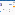

44.. Click Save.

Note Thanks to Laura Maker from Cloud for Good for her contributions to this article.

Create Tribute Opportunities (Honor and Memorial Donations)

Nonprofit Success Pack enables you to capture important details about donations made in honor or in

memory of someone. You can track who the donation was made in honor of, as well as who should be

notified about the donation and how best to notify them.

Note Watch the Nonprofit Salesforce How-To Series video about Tribute Opportunities.

592

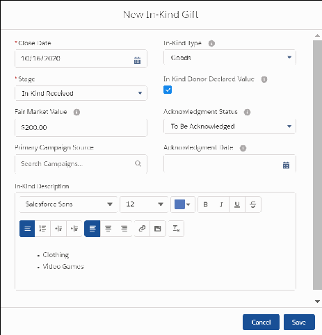

For example, let's say Rafael Costas made a donation in honor of his niece, Sara Costas, who is a

volunteer at your organization. Rafael would like you to email Sara's mom, Fiamma Costas, about the

donation.

When you create the Opportunity record to track the donation, use the Tribute Information section to

capture the details:

11.. Select the Tribute Type. For this example, you'd select Honor .

22.. Use the Honoree Contact field if the honoree is already a Contact in Salesforce or you want to track

them as a Contact going forward. Otherwise, leave this field blank. In this example, since Sara is a

volunteer for the organization, she already has a Contact record, so you'd find and select her Contact

record here.

33.. If you selected an Honoree Contact, leave the Honoree Name field blank, as Salesforce fills it in with

the name of the Honoree Contact when you save the record. Otherwise, enter the Honoree Name. For

this example, you'd leave the field blank.

44.. If you selected an Honoree Contact, leave Honoree Information blank. Otherwise, use this field to

capture details about the honoree such as address, phone, and email. For this example, you'd leave

the field blank.

55.. Select the Notification Preference. In this example, Rafael has asked us to email his niece's mother

about his donation, so you'd select Email.

66.. In the Notification Recipient Contact field, select the Contact who should be notified of the donation.

If that person doesn't have a Contact record and you don't want to track them as a Contact, leave this

field blank. For this example, since Fiamma Costas hasn't expressed interest in interacting with your

organization, you'd leave the field blank. (You can always create a Contact record for Fiamma later.)

77.. If you selected a Notification Recipient, leave the Notification Recipient Name blank, as Salesforce fills

it in with the name from the Notification Recipient field when you save the record. Otherwise, enter

the Notification Recipient Name. For this example, you'd enter Fiamma Costas.

88.. In the Notification Recipient Information and Notification Recipient Email fields, enter any contact

information you have about the notification recipient, such as address, phone number, and email.

These fields are primarily used when there isn't a Contact record for the Notification Recipient. For this

example, you'd enter Fiamma's email address in Notification Recipient Email and leave Notification

Recipient Information blank.

99.. In the Notification Message field, enter any message from the donor to the notification recipient

about the donation.

1100.. If you'd like to track when you sent the notification, enter details into Tribute Notification Date and

Tribute Notification Status.

Note Create a way for users to email tribute recipients directly from the Opportunity in Salesforce.

593

Learn more in Build a Flow to Notify Tribute Recipients.

By default, NPSP creates Opportunity Contact Roles for the Honoree Contact and Notification Recipient

Contact (along with the donor and any Contact receiving soft credit). In this example, we've populated

the Honoree Contact field:

Note If you don't see these Opportunity Contact Roles, your admin may need to configure this

feature. See Add Opportunity Contact Roles for more information.

Build a Flow to Notify Tribute Recipients

Create a quick way for users to email people about honor or memorial donations.

11.. Refer to the step-by-step instructions in Build a Donor Email Flow for Nonprofit Success Pack (NPSP)

on Trailhead.

22.. Key information you need to adapt the acknowledgment flow for emailing tribute recipients:

Variable Needed Opportunity Field

Indication to notify via email Notification Preference

Recipient's name Notification Recipient Name

Recipient email address Notification Recipient Email

Message to include in notification Notification Message

Name of the person being honored or Honoree Name

memorialized

Indicate if notification was sent Tribute Notification Status

Set the date the notification was sent Tribute Notification Date

Want to learn more about Salesforce Flows? Head over to Trailhead and explore Build Flows with Flow

Builder.

Manage Grantseeking Opportunities

Track Grants your organization has applied for and Payments received for a Grant, and manage the

deliverables to meet the funding organization's application and reporting requirements.

Note Watch the Nonprofit Salesforce How-To Series video: Manage Grants.

594

Note Administrators: If this feature isn't configured in your org, or something seems to be missing,

see the Feature Configuration Overview for a list of major features in NPSP and how to configure

them.

Grants Overview

Grants are donations that typically come from philanthropic organizations and are usually paid out

separately from when they are awarded. Grants are often tied to specific programs and deliverables

with important reporting and documentation deadlines that require thoughtful management.

Create a Grant Opportunity

Salesforce stores Grants as Opportunity records, just like donations. Grants are usually given by

institutions, and not families. However, you can associate a Grant record with a Household Account, if

appropriate.

Manage Deliverables

As you communicate with the funding organization and your Grant moves along in its process from

Prospecting to Awarded, you'll want to keep key data on the Grant record up to date. In Nonprofit

Success Pack, you keep track of these deadlines by creating separate Deliverable records.

Update a Grant Record When a Grant is Awarded

You have received word that your grant has been Awarded. Congratulations! Now you need to update

your work-in-progress Grant record to indicate that you expect payment and when. There may be

additional reporting requirements that you need to keep track of as well.

Schedule the Grant Payments

Often, grants are disbursed as partial payments over a fixed schedule. Once you've marked the Grant

record with the Awarded stage (or a stage where the Type is Closed/Won), Nonprofit Success Pack

may assume that the record contains only Paid payments. When the Grant record is in this state, you

can't schedule additional Payments, so you'll need to edit the record slightly before you can schedule

the Grant Payments.

Receive or Write Off Grant Payments

Record details of grant payments and handle grant schedule changes.

Associate a New Grant record with a Previous Grant

As great relationships are maintained with funders, Grants are often renewed year after year. Each year

or funding period, create a new Grant Opportunity to take advantage of those great relationships. To

keep your Grant records related to each other, update the Previous Grant/Gift Opportunity and Is

Grant Renewal fields for easy access to historic records.

Track Grant Communications

It's not all about deliverables and deadlines. Your relationship with your grant maker is also critically

important to manage. For example, what did your colleague discuss in yesterday's conversation with

the Program Officer? What follow up is needed? In general, how is that relationship going?

Grants Overview

Grants are donations that typically come from philanthropic organizations and are usually paid out

separately from when they are awarded. Grants are often tied to specific programs and deliverables with

important reporting and documentation deadlines that require thoughtful management.

595

In Nonprofit Success Pack, nonprofits use the Opportunity object to track their grant seeking activities.

Foundations, philanthropies, and other grant makers should explore Grants Management from

Salesforce.org. Grants Management helps foundations provide a portal where grantseekers can find

funding opportunities, apply for funding, view their application status, and submit ongoing progress

reports for awarded grants all in one place.

Create a Grant Opportunity

Salesforce stores Grants as Opportunity records, just like donations. Grants are usually given by

institutions, and not families. However, you can associate a Grant record with a Household Account, if

appropriate.

11.. In the navigation bar, click Accounts.

22.. Find the Account with which you want to associate the Grant. If you haven't yet created an Account for

the organization, create a new one.

33.. On the Opportunities related list, click New.

44.. From the list of Record Types, select Grant and click Next.

55.. Salesforce fills in the Opportunity Name and Account Name by default. Enter the following

information for your Grant record:

••

Requested Amount—The amount you are requesting for the Grant. Because the ultimate amount of

the Grant may differ from the requested amount, you might want to leave the Amount field blank

for now.

••

Stage—Select Prospecting. As long as you don't select a Closed/Won stage such as Awarded,

you'll be able to schedule payments for this Grant record.

••

Close Date—Select a date that indicates when you expect to receive the grant. Don't worry if you

don't know the exact date right now. For example, you might want to enter a date that you think is

somewhere within the same fiscal quarter. That way your quarterly forecast reporting can include

this grant. You can always edit the date later and the changes are tracked in history.

••

Campaign, Grant Requirements Website, Program Area(s)—Enter if appropriate.

66.. Click Save.

The new Grant Opportunity is now associated with the Account.

Note Consider exploring the free, open-source Grants Content Kit to manage the text you use in

your grant applications.

Manage Deliverables

As you communicate with the funding organization and your Grant moves along in its process from

Prospecting to Awarded, you'll want to keep key data on the Grant record up to date. In Nonprofit

Success Pack, you keep track of these deadlines by creating separate Deliverable records.

Let's say your organization needs to have a Letter of Intent (LOI) for this ABC Telecom grant issued by

November 1st. If the LOI is approved, you'll then need to apply for the grant by December 1st, for a

596

decision on January 30th. Here is what you'll need to do to make sure everything is completed on time.

11.. Open a Grant record that's been set to Prospecting.

22.. In the Deliverables related list, click New.

33.. Give the deliverable a Name and add additional detail. Be sure to indicate the Due Date.

44.. Click Save.

55.. Enter additional Deliverable records. You can enter as many as is appropriate.

Notice that Salesforce automatically updates the Next Deliverable Date field on the main Grant

Opportunity record to reflect the next deadline date.

BBeesstt PPrraaccttiicceess ffoorr GGrraanntt RReeccoorrddss

Be sure to update Deliverable records as deadlines are met. For example, in this case even though the

deadline was 11/1/2016, we note that it was in fact submitted successfully on 10/21/2016.

Feel free to use this record to assign tasks to other staff members or attach relevant files. For more

information, see Tasks or Attach Files to Records in Salesforce Help.

Also, keep in mind that when you populate a Close Date and save a Deliverable record, Salesforce

automatically updates the main Grant Opportunity record to show the date of the next deadline. Be sure

to also keep the Opportunity Stage updated. For example, when a Letter of Intent is submitted, update

the Stage to LOI Submitted. You can use Salesforce workflow rules or Process Builder to automate this

functionality.

Update a Grant Record When a Grant is Awarded

You have received word that your grant has been Awarded. Congratulations! Now you need to update

your work-in-progress Grant record to indicate that you expect payment and when. There may be

additional reporting requirements that you need to keep track of as well.

11.. Navigate to the Opportunity record for the Grant that's been awarded, and then click Edit.

22.. Enter the amount of the final, total grant amount in Amount field. This number does not necessarily

have to be the same as the Requested Amount previously entered.

33.. Change the Stage of the Grant Opportunity to Awarded. Doing this will tell Salesforce to assign the

Opportunity a Closed/Won state. The total amount will then roll up to the grantor's Account record.

44.. Schedule the Grant Payments.

55.. If you've enabled GAU Allocations in NPSP Settings, you should double-check the GAU Allocations

related list to see that your allocations are correct. You can also add allocations at this point to indicate

how funds should be distributed within your organization. See Allocations Overview for more

information.

66.. Update the Grant record's Grant Contract Number, Grant Contract Date, Grant Period Start Date,

Grant Period End Date as appropriate.

77.. Add additional Deliverable records to track post-award requirements such as when interim reports are

due.

597

Schedule the Grant Payments

Often, grants are disbursed as partial payments over a fixed schedule. Once you've marked the Grant

record with the Awarded stage (or a stage where the Type is Closed/Won), Nonprofit Success Pack may

assume that the record contains only Paid payments. When the Grant record is in this state, you can't

schedule additional Payments, so you'll need to edit the record slightly before you can schedule the

Grant Payments.

11.. On the Grant record, go to the Payments related list and edit any existing Payment record to uncheck

the Paid field.

22.. Return to the Grant record and schedule payments. On the Payments related list,

click Schedule Payments. The Schedule Payments screen appears.

33.. To create a quarterly payment schedule over a single year, enter the following information:

••

For # of Payments, select 4.

••

For Date of First Payment, enter the date you expect the first payment.

••

For Interval, select 3 and Month.

••

For Payment Method, select how you anticipate the payments will be made. Leave blank if unsure.

44.. Click Calculate Payments. The Payments to be Created appear at the bottom of the page.

55.. Accept the default calculations or modify them as you see fit to match the grant payment dates.

In the example above, we entered the date and checked the Paid checkbox for the first quarterly

installment of this grant.

66.. Click Create Payments to create the four Payment records associated with the grant.

The Grant record has been updated to show the total completed payments and remaining balance.

Receive or Write Off Grant Payments

Record details of grant payments and handle grant schedule changes.

•

As you receive payments, to record the details (such as payment date): In the Payments related list

next to a payment, click , then Edit.

•

If the grant schedule changes or you won't receive the rest of the grant for some reason, you can write

off an individual payment: In the Payments related list next to the payment, click , then Edit.

•

To write off (that is, cancel) all of the remaining payments in the Payments related list: Click , then

Write Off Payments.

For more information, see Write Off One or More Scheduled Payments.

Associate a New Grant record with a Previous Grant

As great relationships are maintained with funders, Grants are often renewed year after year. Each year or

funding period, create a new Grant Opportunity to take advantage of those great relationships. To keep

your Grant records related to each other, update the Previous Grant/Gift Opportunity and Is Grant

598

Renewal fields for easy access to historic records.

Note Special thanks to Dennis Jeske and Sam Knox for their great contributions to this

documentation.

Track Grant Communications

It's not all about deliverables and deadlines. Your relationship with your grant maker is also critically

important to manage. For example, what did your colleague discuss in yesterday's conversation with the

Program Officer? What follow up is needed? In general, how is that relationship going?

Salesforce offers several ways to track and provide visibility into this kind of information. We'll look at

three ways here:

•

Tasks and Activities

•

Notes

•

Chatter

TTaasskkss aanndd AAccttiivviittiieess

Salesforce Tasks and Activities helps you track phone calls, emails, and other interactions. You can use

Tasks and Activities to record details of a conversation that already took place—or set a reminder to make

a call in a week.

Let's say you want a reminder about an important, upcoming call with your Program Officer, Darnesha

Goodman, at Starbucks Corporation.

To create the Task:

11.. Navigate to the Grant record.

22.. In the Activity tab, click Add.

33.. Fill out the Task details:

••

Subject: A short phrase describing the Task.

••

Due Date: The date by which the Task should be completed.

••

Name: Optional link to a Contact record. Populating this field will make the Task available from the

Contact record.

••

Related To: The record this Task is related to. In this example, the Grant record.

••

Assigned To: The person responsible for the Task. You can assign the Task to yourself or anyone else

in your organization.

••

Status: Tracks the progress of the Task, for example, not started, in progress, or complete.

44.. Click Save.

Once you've completed the call, mark the Task as complete:

599

11.. Navigate to the Grant record where you created the Task.

Note You can also access all of your Tasks in one place from the Tasks tab. This can be a handy

way to view your Tasks, especially if you have open Tasks across different Grant records.

22.. On the Activities tab, in the list of Upcoming and Overdue, select the checkbox next to your Task.

When you do so, Salesforce updates the Task status to completed.

To learn more about Tasks and Activities, see Tasks in Salesforce Help and Training.

NNootteess

Notes (formerly Enhanced Notes) is a versatile, rich text editor. Think of Notes as a handy "scratch pad"

where you can record information about the conversation you just had with your Program Officer. You

can create a Note independent of any record, or attach a Note to one or more records such as Accounts,

Contacts, and Opportunities.

Note To use Notes, your admin must enable Notes for your organization, and configure page layouts

to include Notes. For more information, see Set Up Notes in Salesforce Help.

To create a Note:

11.. Click the Global Actions menu in the Lightning Experience header and choose New Note.

22.. Enter a subject in the subject area, and the information you want to record in the Notes area. Use the

rich text editor to format your Note, and optionally add images.

33.. Optionally, click Add to Records to attach the Note to any record. Repeat to attach to multiple records.

44.. Click Done.

For more information on how to use Notes, see Pro Tip: Boost Note-Taking With Enhanced Notes in

Lightning Experience.

CChhaatttteerr

Chatter is Salesforce's tool for internal communication at your organization. Use Chatter to let your

colleagues know you just had a productive conversation with your Program Officer, or to remind them of

an upcoming event. Unlike Tasks and Activities, Chatter has no required fields, making it a lightweight

way to quickly post information.

Chatter works like popular social media tools—you can at mention people in your organization,

colleagues can respond to your posts, and you can include images in your post. You can also include

links to any Salesforce records.

To add a Chatter post to a Grant record:

600

11.. From the Grant record, click on the Chatter tab.

22.. Enter your post.

Note To mention someone in your organization, type "@" followed by the person's name. To

create a link to a record, type "/" followed by the record name.

33.. Click Share.

To learn more about Chatter, see Get Started with Chatter.

Create and Manage Memberships

Memberships in Nonprofit Success Pack represent an individual or household giving a donation to join a

group or organization, much like a subscription. Learn how to create and manage memberships with

Nonprofit Success Pack.

Note Administrators: If this feature isn't configured in your org, or something seems to be missing,

see the Feature Configuration Overview for a list of major features in NPSP and how to configure

them.

Overview

Memberships in Nonprofit Success Pack represent an individual or household giving a donation to join

a group or organization, much like a subscription. It is up to the organization to decide the length and

level of membership based on the donation amount.

Create a Membership

Creating a Membership for an Account or Contact is just like creating any other type of donation.

Simply use the New Membership option on a Contact or the New button on an Account.

Membership Fields

Keep in mind that Membership fields are calculated nightly by an automated process. Any manual

update to the Membership fields on a Contact or Account will be overwritten by the nightly automated

process.

When do Membership Values Roll Up?

The value of membership opportunity records rolls up to the related account or contact when certain

criteria are met.

Overview

Memberships in Nonprofit Success Pack represent an individual or household giving a donation to join a

group or organization, much like a subscription. It is up to the organization to decide the length and level

of membership based on the donation amount.

In NPSP, memberships are tracked through the Opportunity object. Memberships can't exist on an

Account or Contact without an Opportunity, as any membership-related data on the Account or Contact

601

is driven by that Opportunity. Any manual update to the Membership fields on a Contact or Account are

overwritten by the nightly automated process.

Some info about Membership Rollups

In addition to standard functionality on the Membership Opportunity that you might expect, such as

Membership start and end dates and Membership Level (Gold, Silver and Bronze), NPSP Memberships

provide an additional rollup capability. The rollup collects donation information from related

Membership Opportunities and aggregates it on a Household Account or Contact.

SSoommee iinnffoo aabboouutt MMeemmbbeerrsshhiipp RRoolllluuppss

In addition to standard functionality on the Membership Opportunity that you might expect, such as

Membership start and end dates and Membership Level (Gold, Silver and Bronze), NPSP Memberships

provide an additional rollup capability. The rollup collects donation information from related

Membership Opportunities and aggregates it on a Household Account or Contact.

For example, if a Contact has two Memberships with two different groups, the Contact would have two

Opportunities showing the amount donated to become a member (let's say $100 each). Those two

amounts would be added together and appear in the Membership Information section on the Contact

record.

Create a Membership

Creating a Membership for an Account or Contact is just like creating any other type of donation. Simply

use the New Membership option on a Contact or the New button on an Account.

11.. Search for the Contact or Account for this Membership.

22.. On a Contact, click at the top right corner of the record, then click New Membership.

On an Account, click New in the Opportunity related list, and select the Membership record type.

33.. Fill in the required fields:

••

Opportunity Name: Filled in by default, but you can change it if you like.

••

Close Date: The date you want to recognize the donation amount.

••

Stage: Set to Closed Won if you want to recognize the money on the first day of the membership.

This will also generate a Payment for the amount entered.

44.. Enter a donation Amount, Membership Start Date, Membership End Date, Member Level, and

Membership Origin. Entering this information ensures that the Contact record will show complete

rollup information.

In this example, since the close date of the Opportunity is 10/2/2020 and the Stage is Closed Won, a

Payment was generated.

Membership Fields

Keep in mind that Membership fields are calculated nightly by an automated process. Any manual

602

update to the Membership fields on a Contact or Account will be overwritten by the nightly automated

process.

Contact Membership Fields

The values of the membership and Opportunity fields are rolled up to the Contact and Household

Account records.

Account Membership Fields

Accounts include the same fields as the Contact, as well as two additional fields. The primary

difference between the Contact and Account fields is that for Household Accounts, the fields show

membership information in aggregate for all Household members.

CCoonnttaacctt MMeemmbbeerrsshhiipp FFiieellddss

The values of the membership and Opportunity fields are rolled up to the Contact and Household

Account records.

These membership fields show up on the Contact:

•

Membership End Date: The most recent Membership End Date value from a Closed and Won

Opportunity (Donation) defined as a membership type.

•

Last Membership Level: The most recent Membership Level from a Closed and Won Opportunity

(Donation) that is defined as a membership type

•

Total Membership Amount: The aggregate sum total of the Amount from Closed and Won

Opportunities (Donation) defined as a membership type.

•

Last Membership Date: The most recent Close Date from a Closed and Won Opportunity (Donation)

that is defined as a membership type

•

Last Membership Origin: The most recent value from the Membership Origin field from a Closed and

Won Opportunity (Donation) defined as a membership type.

•

Membership Join Date:The oldest Membership Start Date value from a Closed and Won Opportunity

(Donation) defined as a membership type.

•

Last Membership Amount: The most recent Amount from a Closed and Won Opportunity (Donation)

that is defined as a membership type

•

Number of Memberships: The total count of the number of Closed and Won Opportunities

(Donations) defined as a membership record type.

AAccccoouunntt MMeemmbbeerrsshhiipp FFiieellddss

Accounts include the same fields as the Contact, as well as two additional fields. The primary difference

between the Contact and Account fields is that for Household Accounts, the fields show membership

information in aggregate for all Household members.

The additional fields on the Account are:

•

Membership Span: A formula field that takes the value of the year of the Membership End Date field

and subtracts the year of the Membership Join Date field. (In the screenshot above, this is 2021-2019

= 2)

603