Troubleshoot Account Model Fields

When you change the account model in NPSP Settings, you determine the Account Model for new

Accounts going forward. Existing Accounts created using a different Account Model aren't automatically

updated. If your org updated the Account Model but did not convert the existing Accounts, troubleshoot

and update the Account Record Type, _SYSTEM:AccountType, and _SYSTEM:IsIndividual fields on

individual Account records

Note If you don't see these fields on your Account record page, add them to the Account page

layout. After you finish troubleshooting, we recommend removing them from the page layout. For

more information on adjusting page layouts, see Configure Page Layouts.

AAccccoouunntt RReeccoorrdd TTyyppee

If your Account Model is set to Household Account, the Household Account Record Type tells NPSP

which record type to use when automatically creating Household Accounts:

In this example, when you're troubleshooting any Household Account, you should see "Household

Account" listed as the record type. If you see a different record type, update the record type accordingly.

__SSYYSSTTEEMM::AAccccoouunnttTTyyppee

_SYSTEM:AccountType should match your organization's Account model:

If the value of the _SYSTEM:AccountType field doesn't match the Account Model for your organization,

update the field accordingly.

For this Account Model: _SYSTEM:AccountType should be:

Household Account Model Household Account

One-to-One Individual Model One-to-One Individual

Individual Bucket Model Individual Bucket

__SSYYSSTTEEMM:: IIssIInnddiivviidduuaall

This field should be selected on all Household Account records, regardless of your Account model. If you

have a Household Account where this field is not selected, edit the record to select the field.

Manage NPSP Constituents

Manage constituents in NPSP with Household and Organization Accounts, Contacts, and Addresses.

467

Manage NPSP Household and Organization Accounts

Manage Contacts, Households, Organization Accounts, and Affiliations in the Household Account

Model.

Manage NPSP Contacts

Add and remove Contacts, change the primary Contact for a Household, merge Contacts, and perform

other Contact management tasks.

Manage NPSP Addresses

Learn about address changes, how to manage the default address, use a seasonal address, and mark

an address as undeliverable in NPSP.

Manage NPSP Household and Organization Accounts

Manage Contacts, Households, Organization Accounts, and Affiliations in the Household Account Model.

What is the Household Account Model?

The Household Account model is the default account model for Nonprofit Success Pack, and the

account model we strongly recommend.

Add a Household Account

Add a Household Account automatically by creating a new Contact.

Merge or Split Households

Merge two different household accounts into one, and split one household into different accounts.

Add and Manage Organization Accounts

Organization Accounts allow your nonprofit to keep track of entities that are not individual

constituents or households. Learn how to add and manage Organization Accounts.

Create an Affiliation with an Organization

Use Affiliations in NPSP to track constituent relationships with organizations, including board

memberships, employment, and foundation relationships.

What Happens When I Delete an Account?

When you delete an Account, NPSP deletes associated Recurring Donations, Allocations, and

Relationships in addition to standard Salesforce detail records.

What is the Household Account Model?

The Household Account model is the default account model for Nonprofit Success Pack, and the account

model we strongly recommend.

Salesforce was originally designed as a "Business-to-Business" (B2B) application. In the traditional B2B

scenario, companies track other companies they sell to (Accounts). Each Account has people associated

with it (Contacts), as well as "deals" (Opportunities). How all of these things relate to and interact with

each other in Salesforce is known as an account model.

468

For the typical nonprofit, the B2B scenario doesn't apply. Rather than companies and deals, nonprofits

generally care about people, relationships, and donations. Enter the Household Account model. In the

Household Account model, people (Contact records) are grouped together into households (Account

records). And donations (Opportunity records) are associated with people and households.

The Household Account model supports many sophisticated features, including Contact management

for Household members, and address management.

The Household Account model is the default account model for Nonprofit Success Pack, and the account

model we strongly recommend.

Note The Household Account model also supports organization Accounts (for example, other

businesses, nonprofits, and religious organizations.) We recommend that you include all of your

Contacts as members of a Household Account, and show relationships to organization accounts

using Affiliations. For more information, see Add and Manage Organization Accounts.

Nonprofit Success Pack supports two legacy account models. For more information, see Legacy Account

Models.

Add a Household Account

Add a Household Account automatically by creating a new Contact.

NPSP handles Household Account creation for you automatically, so there's no need for you to create

Household Accounts yourself. When you create a new Contact, NPSP automatically creates a new

Household Account for that Contact, as long as you leave the Account Name field blank.

469

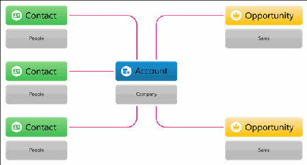

See Add or Remove a Contact for more details on creating Contacts and Household Accounts.

Merge or Split Households

Merge two different household accounts into one, and split one household into different accounts.

Note Watch the Nonprofit Salesforce How-To Series video: Merge or Split Households

Note These steps will only work with the Household Account Model in the Nonprofit Success Pack.

For more information, see What is the Household Account Model?

Merge Households

Have you ever found yourself with two different Household Account records, both of which have the

same mailing address? This often occurs during an online form integration where two of your Contacts

registered with your organization separately. It can also occur as a result of a data import.

Split a Household

You may also find that you need to separate members of a Household. For example, if a child moves

away, or if Household members go through a divorce.

Merge Households

Have you ever found yourself with two different Household Account records, both of which have the

same mailing address? This often occurs during an online form integration where two of your Contacts

registered with your organization separately. It can also occur as a result of a data import.

In addition to the above scenario, you might find that two of your Contacts who were previously in

separate households are now living together.

Luckily, the Nonprofit Success Pack lets you easily merge Household Account records together without

losing any data.

Note Use Merge Households to put two different Contacts into a single Household Account. If you

have duplicate Contacts use Merge Contacts. Learn more in Merge Duplicate Contacts.

To merge two Households:

11.. Search for the Contact that should be the Primary Contact on the final, merged Household. You can

do this by typing the Contact's name in the search box at the top of Salesforce.

22.. Once you're on the Contact record, click the Household Name. The Household Name is the same as

the Account Name:

33.. On the Household record, click Manage Household.

Note If you don't see the Manage Household button, your admin may need to add it to the page.

470

See Enable the Manage Household Button for more information.

In the Find a Contact or Add a New Contact to the Household search box, enter the name of the

Contact to merge into the Household. Give it a moment to find the right record, and then click

Note The Contact that’s merged into the Household will adopt the Household’s address. Learn

more in Override the Default Household Address for a Contact.

44.. If the Contact you're merging into the existing Household is part of a Household with more than one

Contact, you have the option of adding just that one Contact, or adding all Household members:

Add Individual Contact

This option relocates the Contact to the new Household, but does not copy over any fields

from the other Household, and leaves the other Household, as well as the members and

Opportunity history of the Household, intact. The option does move over any Opportunities

for which the Contact is the primary donor.

Add All Members

This option updates the existing Household to include the new members, and deletes the old

Household.

55.. Click Save.

471

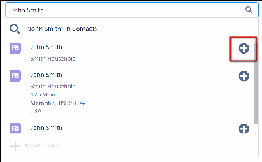

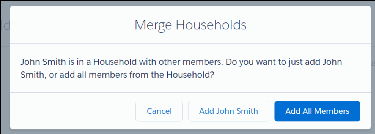

Note All related records affiliated with the former Household will merge to the new Household

record.

Split a Household

You may also find that you need to separate members of a Household. For example, if a child moves

away, or if Household members go through a divorce.

11.. Navigate to the Household record that currently contains all Household members. (If you're using the

Household Account model, this is the Household Account record.)

22.. Click Manage Household.

33.. On the Manage Household page, hover over the Contact card of the Contact you want to remove, and

click the Remove (x) icon. When you click the Remove icon, Salesforce moves the Contact to their own

separate Household.

Note When removing the Primary Contact, select a new Primary Contact or Salesforce will select

a new Primary contact by default.

44.. Click Save.

Depending on Household settings and how you log related records (for example, donations, Cases,

Activities), the Contact leaving the Household may no longer be associated with the historical data you're

expecting to see.

After splitting a Household, we recommend:

•

Recalculate rollups

•

Review Account and Contact rollups for both Households

•

Review all related records in both Households to ensure records are associated correctly

472

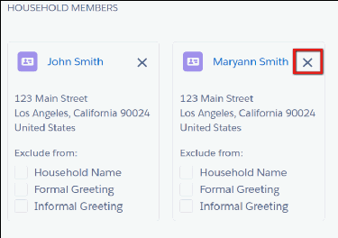

Add and Manage Organization Accounts

Organization Accounts allow your nonprofit to keep track of entities that are not individual constituents

or households. Learn how to add and manage Organization Accounts.

Organization Account Overview

Organization Accounts allow your nonprofit to keep track of entities that are not individual

constituents or households. These entities might be foundations that fund your work, other nonprofits

that you partner with, corporations that sponsor your work, or companies that employ your donors

and constituents. Organization Accounts can help you better track the companies and foundations

that you and your constituents interact with.

Create an Organization Account

Create a record to track a foundation, company, or other organization.

Modify an Organization Account

Change details on an organization account record.

Relate a Contact to an Organization Account

NPSP uses Affiliations to relate Contacts to Organization Accounts.

Organization Account Overview

Organization Accounts allow your nonprofit to keep track of entities that are not individual constituents

or households. These entities might be foundations that fund your work, other nonprofits that you

partner with, corporations that sponsor your work, or companies that employ your donors and

constituents. Organization Accounts can help you better track the companies and foundations that you

and your constituents interact with.

NPSP allows you to create and manage Organization Accounts, as well as the Affiliations that your

contacts have with those organizations.

Create an Organization Account

Create a record to track a foundation, company, or other organization.

11.. Click the Accounts tab in the navigation bar.

22.. Click New.

33.. Enter the Account Name and other details.

44.. Click Save.

Modify an Organization Account

Change details on an organization account record.

11.. Navigate to the Organization Account record you would like to update.

22.. Click Edit at the top right hand side of the screen.

473

33.. Change the Organization as needed and click Save when you're finished.

Relate a Contact to an Organization Account

NPSP uses Affiliations to relate Contacts to Organization Accounts.

In the Household Account model, Contacts are related directly to Household Accounts, not Organization

Accounts. NPSP uses Affiliations to relate Contacts to Organization Accounts. Affiliations are great

because they allow you to track a Contact's current and former Affiliations, so you can see your

constituents' involvement in multiple organizations over time (as they move on to new jobs or join

boards at different organizations, for example). In the Affiliations related list on a Contact record, you can

see all the Organizations with which that Contact was or is involved.

Learn more about how to Create an Affiliation with an Organization.

Create an Affiliation with an Organization

Use Affiliations in NPSP to track constituent relationships with organizations, including board

memberships, employment, and foundation relationships.

Note Watch the Nonprofit Salesforce How-To Series video: Add Organizational Affiliations.

Affiliations Overview

Your biggest champions are constituents who donate money or volunteer their time. As you identify

the people who are deeply dedicated to your mission, you'll likely want to know more about them. In

NPSP, track this information using Affiliations.

Create an Affiliation

Use affiliations to track a constituent's connections to multiple organizations.

Modify an Affiliation

When a constituent attains a new position, steps down, or joins a new organization, modify their

Affiliations to track these changes.

Manage Multiple Affiliations

Manage and track a constituent's affiliations with multiple organizations.

Change a Contact's Primary Affiliation

Primary Affiliations indicate which organizations are most important for a Contact. Change a Contact's

Primary Affiliation by editing the existing Affiliation record, or change the Primary Affiliation field on

the Contact.

Manage Affiliations From the Account Object

Just like on a Contact record, you can find Affiliation information when looking at the Account record.

Affiliations Overview

Your biggest champions are constituents who donate money or volunteer their time. As you identify the

474

people who are deeply dedicated to your mission, you'll likely want to know more about them. In NPSP,

track this information using Affiliations.

Your biggest champions are constituents who donate money or volunteer their time. As you identify the

people who are deeply dedicated to your mission, you'll likely want to know more about them, including

their:

•

Current or former board membership

•

Volunteer experience

•

Donor-Advised Funds (DAF) participation

•

Family foundation involvement

•

Work history

In NPSP, track this information using Affiliations.

Affiliations link individuals (Contacts) with Organization Accounts. Organization accounts are broadly

used for any organization or business, such as grant makers, corporations, vendors, government

institutions, and more.

With Affiliations, you can track a Contact's current and former involvement with organizations over time

as people move to new jobs or join boards at different organizations.

Affiliations are used in other areas of NPSP as well. Use the Primary Affiliation Contact field to track

which organization is the most important for that person. Configure Affiliations to automatically create

soft credits for the donor when you receive donations from their donor-advised fund or family

foundation.

Create an Affiliation

Use affiliations to track a constituent's connections to multiple organizations.

Let's look at an example of Affiliations in action. Hamilton Partners is a new nonprofit, focused on

tackling sustainable business practices in the private sector. Its founder, Riley Hamilton, has deep

connections in the nonprofit world—including important board memberships. We want to make sure

Riley's robust background is reflected in the database.

Let's create an Affiliation to connect Riley Hamilton to Hamilton Partners:

11.. Find the Contact record you want to work with.

22.. Click Related, then find the Organization Affiliations related list.

33.. Click New.

44.. Enter and select Hamilton Partners in the Organization field.

55.. Enter any other information you have for the Affiliation record:

475

aa.. Role = Describe the person's organizational role. For example, Founder.

bb.. Status = Indicates whether the Affiliation is current or former.

cc.. Start Date and End Date = Timeframe for this Affiliation.

dd.. Related Opportunity Contact Role = Automatically creates a soft credit for the affiliated Contact

when you enter a donation from this Organization Account. Learn more in Create Automated Soft

Credits for Affiliations.

ee.. Primary = Indicates that this is the most important Affiliation for this Contact.

ff.. Description = Enter any additional notes about this Affiliation.

66.. Save the Affiliation record. The new Affiliation appears in the Related list for Riley's Contact record and

on the Hamilton Partner's Organization Account record.

Now, we can see Riley's current role at Hamilton Partners, along with the rest of their Affiliations. Here's

how this information can help in our relationship building:

•

We know Riley's work experience.

•

We can easily check and identify potential conflicts of interest.

•

We can see if listed affiliated organizations have special arrangements, like matching gift policies.

Note Report on all Affiliations for your Contacts with a custom report. Learn more in Create a

Custom Report Type for Contacts and Affiliated Accounts in the NPSP Reports Workbook.

Modify an Affiliation

When a constituent attains a new position, steps down, or joins a new organization, modify their

Affiliations to track these changes.

Affiliations can change over time. Whether a constituent attains a new position, steps down, or joins a

new organization, modify their Affiliations to track these changes.

To edit an existing Affiliation:

11.. Find the Contact record you want to work with.

22.. Click Related, find the Affiliation to wish to modify, then click Edit.

33.. Update the Affiliation information as needed.

44.. Save the Affiliation record

Manage Multiple Affiliations

Manage and track a constituent's affiliations with multiple organizations.

476

Riley has joined the Sustainable Schools Consortium as a board member and is involved in several

committees. He'll still continue working with Hamilton Partners, but now will spend more time at

Sustainable Schools going forward.

To reflect this change in NPSP, let's create a new Affiliation for Sustainable Schools, and make it Riley's

Primary Affiliation:

11.. Find the Contact record you want to work with.

22.. Click Related, then find the Organization Affiliations related list.

33.. Click New.

44.. In the Organization field, click New Account.

aa.. Populate the Organization Account information.

bb.. Save the record.

55.. Enter the relevant information for the new Affiliation.

66.. Select the Primary checkbox.

77.. Save the Affiliation record.

Now both Affiliations are shown in the Organization Affiliations related list on Riley's record.

Change a Contact's Primary Affiliation

Primary Affiliations indicate which organizations are most important for a Contact. Change a Contact's

Primary Affiliation by editing the existing Affiliation record, or change the Primary Affiliation field on the

Contact.

Primary Affiliations indicate what organizations are most important for a Contact. If you set an Affiliation

to Primary and there's an existing Primary Affiliation for that Contact record, NPSP automatically switches

the existing Primary Affiliation Status to Former and deselects the Primary checkbox.

Change a Contact's Primary Affiliation by editing the existing Affiliation record, or change the Primary

Affiliation field on the Contact. Here's how:

11.. Find the Contact record you want to work with.

22.. Click Edit.

33.. Clear the existing Primary Affiliation (if there is one).

44.. Search for and select an Organization Account in the Primary Affiliation field.

477

55.. Save the Contact record.

A Contact can only have one Primary Affiliation record at a time, though a single Organization Account

may be designated as the Primary Affiliation for multiple Contacts.

Note There are a few places you'll see the word “primary” in NPSP. To summarize, Primary Affiliation

on a Contact record is the main organization connection for that person, whereas, Primary Contact

on an Account record is the main point of contact for that organization. For more information, see

Primary Contact vs. Primary Affiliation.

Manage Affiliations From the Account Object

Just like on a Contact record, you can find Affiliation information when looking at the Account record.

Just like on a Contact record, you can find Affiliation information when looking at the Account record.

Interested in reaching out to the Account's primary point-of-contact? Want to see if you have any

matching gift information on file for a specific organization? A quick look at the Account record's Related

tab has the information you need.

Affiliations help with constituent engagement. For example, if Riley goes on a long vacation and is

difficult to reach, check the Sustainable Schools Account to find other Affiliated Contacts that you can

reach out to.

To view the Affiliated Contacts for an Organization Account:

11.. Find the Organization Account record you wish to view.

22.. Hover over or click Affiliated Contacts in Related List Quick Links.

What Happens When I Delete an Account?

When you delete an Account, NPSP deletes associated Recurring Donations, Allocations, and

Relationships in addition to standard Salesforce detail records.

If there are associated Closed/Won Opportunities or Cases (with any status), you won't be able to delete

the Account. You must first delete these records manually before you can delete the Account.

Manage NPSP Contacts

Add and remove Contacts, change the primary Contact for a Household, merge Contacts, and perform

other Contact management tasks.

Add or Remove a Contact

478

Learn how to add or remove constituent records from a household account record.

Change the Primary Contact for a Household

The Primary Contact field specifies the primary point of contact for Household Accounts.

Mark a Contact as Do Not Contact or Deceased

At some point, you will have a contact who is deceased or a contact who has asked to be removed

from your lists and not contacted again. In both of these situations, you want to remove the person

from your mailing lists. For a deceased contact, you also want to make sure that the contact's name

doesn't appear in the Household naming fields.

Find and Merge Duplicate Contacts

Use Contact Merge to find and merge duplicate constituent records.

Address Potential Duplicate Contacts from the Contact Page

The NPSP Potential Duplicates component directs users to the NPSP Contact Merge page where they

can review, select, and merge potential duplicate contacts.

Create, Edit, and View Contact Relationships

Relationships in Nonprofit Success Pack connect one Contact to another. When you create these

connections, you can also define the type of relationship (Friend, Family, Mother, Daughter, and so

on), and the relationship status (Current, Former).

Specify a Preferred Phone Number and Email Address for a Contact

Salesforce comes out-of-box with one email and one phone field. This is a great start, but often people

have more than one phone and email. NPSP adds several custom phone and email fields, so that you

can track a Contact's business and personal emails, as well as mobile, office, and home phones. NPSP

also lets you specify a Preferred Email and Preferred Phone.

Why and How to Use Leads

Leads are more temporary than Contacts. Use Leads to record that someone may be interested in

interacting with your organization. Once you're confident the person is going to donate, volunteer, or

engage with your organization in some way, convert that Lead to a Contact or Account.

Convert a Lead to a Contact

The Nonprofit Success Pack includes a Lead conversion utility that provides specialized functionality to

convert a Lead to a Contact.

Primary Contact vs. Primary Affiliation

The Primary Contact is the one go-to contact for all communication with an Organization or

Household. A Primary Affiliation is the Account that the Contact is associated with more than any

other Account, such as their employer.

Deleting Contacts

This article describes how deletion works in a new Trial org with NPSP.

Add or Remove a Contact

Learn how to add or remove constituent records from a household account record.

Note This documentation is specific to organizations using the Household Account model. For more

information, see What is the Household Account Model?

479

Household Account Model: Contacts Overview

Nonprofit, Education, and Membership organizations rely on constituents to create strong and vibrant

communities. These individuals might support or subscribe to an organization on their own or

collectively, with a spouse and other family members. NPSP refers to these collectives as Household

Accounts.

Add a New Contact and Household

Adding a new Contact in Nonprofit Success Pack effectively creates a new Household. Here is the basic

workflow for creating a new Contact and Household.

Add a Contact to an Existing Household

Sometimes you need to add a spouse or a child as a new Contact for Households that already exist in

your Salesforce org. These Contacts may or may not already exist in Salesforce.

Remove a Contact from a Household

Occasionally you might want to remove a Contact from a Household.

Household Account Model: Contacts Overview

Nonprofit, Education, and Membership organizations rely on constituents to create strong and vibrant

communities. These individuals might support or subscribe to an organization on their own or

collectively, with a spouse and other family members. NPSP refers to these collectives as Household

Accounts.

NPSP automatically connects every constituent Contact record to a Household Account, even if that

Household only contains a single member. You can add additional Contacts to existing Households, or

remove Contacts as necessary.

Add a New Contact and Household

Adding a new Contact in Nonprofit Success Pack effectively creates a new Household. Here is the basic

workflow for creating a new Contact and Household.

Note Watch the Salesforce for Nonprofits How-To Series video: Add a Contact and a Household.

11.. Click the down arrow on the Contacts tab, then click New Contact.

22.. Enter all relevant Contact details for your new Contact (including phone numbers, emails, and

addresses), but leave the Account Name field blank (1). Leaving the Account Name field blank is the

key step to creating a new Household.

480

33.. When you're finished, click Save. Salesforce automatically creates a new Household, and derives the

name of the new Household from the name of the new Contact. Salesforce formats the Household

name according to the specifications in your Household Name Settings ( NPSP Settings | People |

Households).

Add a Contact to an Existing Household

Sometimes you need to add a spouse or a child as a new Contact for Households that already exist in

your Salesforce org. These Contacts may or may not already exist in Salesforce.

Note Watch the Nonprofit Salesforce How-To Series video: Add a Contact to an Existing Household.

11.. Search for the Household you're interested in (for example, “Davidson Household”), or click the

Accounts tab to see a list of recently viewed Accounts.

22.. Click the Account Name of the Household Account you want to add the Contact to.

33.. On the Account page, click Related.

481

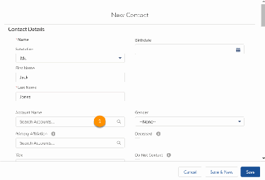

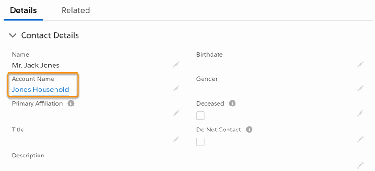

44.. Find the Contacts related list and click New.

55.. Fill out the Contact information.

66.. Save the Contact record.

When a household has more than one Contact, NPSP doesn't automatically update the Household

Account owner when you update the owner of one of the Contacts.

Remove a Contact from a Household

Occasionally you might want to remove a Contact from a Household.

11.. In NPSP, search for the Household you're interested in (for example, “Jones Household”), or click the

Accounts tab to see a list of recent Accounts.

22.. Click the Account Name.

33.. On the Account detail page, click Manage Household.

44.. Click the Delete icon on the Contact card.

55.. Click Save.

The Contact is no longer a member of this Household, but still exists in Salesforce. In fact, Salesforce

automatically creates a new Household for this Contact. To delete a contact from Salesforce entirely

(rarely recommended), navigate to the Contact record and click the Delete button. If the Contact is the

last remaining member of their Household, Salesforce automatically deletes the Household.

Change the Primary Contact for a Household

The Primary Contact field specifies the primary point of contact for Household Accounts.

With NPSP 3.0, we introduced the Primary Contact field on Account. The Contact designated as the

Primary Contact on a Household Account becomes the primary Contact on Opportunities created for

that Household. For example, let's say you have a Household with Contacts Keisha Smith and James

Smith, and Keisha is designated as the Household's Primary Contact. When you create an Opportunity

record for the Smith family's donation, Keisha is automatically set as the primary donor on the

482

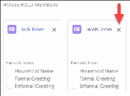

Opportunity record.

By default, NPSP sets the Primary Contact on an Account to be the first Contact that was created for that

Account. You can change the Primary Contact by editing the Account record:

11.. Navigate to the Household Account whose Primary Contact you want to change.

22.. Click Edit.

33.. In the Primary Contact field, click the X next to the Primary Contact name, then select the name of the

Contact you wish to make Primary.

44.. Click Save.

Note If you don't see the Primary Contact field on the Household Account page, your admin may

need to add it to your page layout. If you don't see the Primary Contact field on the Manage

Households page, your admin may need to add the field to a custom field set. See Add the Primary

Contact Field to the Manage Households Page for more information.

Mark a Contact as Do Not Contact or Deceased

At some point, you will have a contact who is deceased or a contact who has asked to be removed from

your lists and not contacted again. In both of these situations, you want to remove the person from your

mailing lists. For a deceased contact, you also want to make sure that the contact's name doesn't appear

in the Household naming fields.

Note Watch the Nonprofit Salesforce How-To Series video: Mark Do Not Contact or Deceased.

Mark a Contact as Do Not Contact

Remove a contact from your mailing, phone, and email lists. Use Do Not Contact to automatically

select Do Not Call and Email Opt Out on a contact.

Mark a Contact as Deceased

When you mark a contact as deceased, the Do Not Contact, Do Not Call, and Email Opt Out fields are

automatically selected. The deceased individual's name is removed from their Household name.

Remove Contacts Marked Do Not Contact from Reports

You will want to update your reports used for communications or mailings to filter out the contacts

you've marked Do Not Contact.

What if I don't see these fields?

If you don't see the Do Not Contact or Deceased fields, your admin may need to adjust the field-level

security or add the fields to your page layouts.

Mark a Contact as Do Not Contact

Remove a contact from your mailing, phone, and email lists. Use Do Not Contact to automatically select

Do Not Call and Email Opt Out on a contact.

483

11.. In Nonprofit Success Pack, navigate to the Contact record of the person you want to mark as Do Not

Contact.

22.. Click Edit.

33.. Select Do Not Contact.

44.. Click Save.

When you save the record, Salesforce automatically selects the Do Not Call and Email Opt Out standard

fields.

Mark a Contact as Deceased

When you mark a contact as deceased, the Do Not Contact, Do Not Call, and Email Opt Out fields are

automatically selected. The deceased individual's name is removed from their Household name.

11.. In the Nonprofit Success Pack, go to the Contact record of the person that you want to mark as

deceased.

22.. Click Edit.

33.. Select Deceased.

44.. Save your changes.

When you save the record, Salesforce automatically selects the Do Not Contact, Do Not Call, and Email

Opt Out fields.

In addition, Salesforce makes changes to the Contact's Household Account.

•

Salesforce removes the deceased Contact from Household Account Name, Formal Greeting, and

Informal Greeting fields. For example, in the Sanchez and Smith Household Account, if you mark

Maria Sanchez as deceased, Household Name changes to Smith Household and Formal Greeting

changes from Maria Sanchez and John Smith to John Smith.

•

If you mark the Primary Contact in a Household as deceased, Salesforce automatically assigns the

Household member with the earliest creation date as the Primary Contact.

•

If you mark the last living Contact in a Household as deceased, Salesforce automatically selects All

Household Members Deceased on the Household Account.

If you accidentally mark a Contact as deceased, you must deselect Deceased on the Contact and

manually update the value of the automatically changed fields.

Remove Contacts Marked Do Not Contact from Reports

You will want to update your reports used for communications or mailings to filter out the contacts

you've marked Do Not Contact.

11.. In the Nonprofit Success Pack, navigate to the Report that you want to use.

22.. Click Edit to customize the Report.

33.. Next to Filters, click the Add dropdown menu, and then select Field Filter.

44.. Add Do Not Contact equals False to the filter.

484

55.. Click Save.

What if I don't see these fields?

If you don't see the Do Not Contact or Deceased fields, your admin may need to adjust the field-level

security or add the fields to your page layouts.

Find and Merge Duplicate Contacts

Use Contact Merge to find and merge duplicate constituent records.

Note Watch the Nonprofit Salesforce How-To Series video: Merge Duplicate Contacts

About Contact Merge

Use Contact Merge in NPSP to easily merge duplicate Contacts into a single record. With Contact

Merge, you choose which Contact to keep and what data to preserve from each duplicate.

Merge Duplicate Contacts

Merging Contacts is an irreversible process that combines up to three records into one. One of the

merged contacts is the master record and the other records are deleted. We recommend that only

System Administrators merge Contacts.

About Contact Merge

Use Contact Merge in NPSP to easily merge duplicate Contacts into a single record. With Contact Merge,

you choose which Contact to keep and what data to preserve from each duplicate.

Unlike standard Salesforce merge, NPSP Contact Merge merges Accounts in certain circumstances. For

example, if your merge leaves an Account with no Contacts, NPSP Contact Merge merges the two

Accounts, re-parents all the related records from the empty Account to the main Contact’s Account, and

deletes the empty Account.

From the Contact Merge tab, click Search Contacts to search by Contact name. You can also click See

Duplicate Contacts to see a list of duplicate record sets, but you'll need to set up duplicate detection

first. For both options, you merge duplicate Contacts manually.

Note Contact Merge only supports merging Contacts with Contacts, not Contacts with Leads.

In addition to Contact Merge, we recommend the following best practices for duplicate management

and prevention:

•

Train users to search for Contacts before entering new ones. Consider customizing search layouts to

give users more information about Contacts, so they can easily see if the Contact already exists.

•

Formulate a plan to identify duplicate Contacts, including which fields to use to determine if a Contact

is a duplicate. For example, you may require entering a middle initial for common names, or you may

485

identify a secondary field to determine a duplicate, like an address or email field.

Important Merging Contacts is irreversible. We recommend backing up your data before

merging. See Export Backup Data in Salesforce Help.

Merge Duplicate Contacts

Merging Contacts is an irreversible process that combines up to three records into one. One of the

merged contacts is the master record and the other records are deleted. We recommend that only

System Administrators merge Contacts.

BBeeffoorree YYoouu MMeerrggee

We recommend that only the System Administrator merge Contacts, because the merge process is

irreversible. To successfully merge Contacts using NPSP Contact Merge, you must have Create, Edit, and

Delete permissions on the Contact object. Additionally, at least one of the following must be true:

•

You are the owner of the Accounts and Contacts being merged.

•

You are above the owners of the Contacts being merged in the role hierarchy.

•

You have the Modify All Records permission on Accounts and Contacts.

Review the following before merging Contacts.

•

Examine the Accounts associated with each of the Contacts to merge and determine which one

should be the master Account after the merge.

•

Review child records from custom objects for duplicates. When you merge Contacts, all related items

from each Contact, such as Opportunities and Payments, are moved to the newly-merged Contact so

that no data is lost.

•

If you delete a Contact who is the last member of a Household Account, the process merges that

Contact's Household Account with the winning Contact's Household Account.

RRuunn DDuupplliiccaattee JJoobbss

If you have Unlimited Edition or Salesforce.org Insights Platform Data Integrity, run a Duplicate Job to

find duplicate Contacts based on your Matching Rule.

For more information, see Run Duplicate Jobs in Salesforce Help.

11.. Click , then click Setup.

22.. From Setup, enter Duplicate Jobs in the Quick Find box, then click Duplicate Jobs.

33.. Click New Job.

44.. Select the Contact object.

55.. Select the Matching Rule you created.

66.. Optionally change the job name.

77.. Click Run

486

MMeerrggee DDuupplliiccaattee CCoonnttaaccttss

11.. Click the Contact Merge tab.

22.. Choose a method to find duplicate Contacts:

••

To search for individual Contacts, click Search Contacts and enter the name of a Contact. You can

use an asterisk (*) as a wildcard, for example, L* Jones finds both Larry Jones and Lawrence Jones.

Contact merge will look at all searchable fields including custom ones.

••

If you set up Matching Rules and Duplicate Rules or Duplicate Jobs, click See Duplicate Contacts.

Select the Duplicate Record Set you want to merge.

33.. Select up to three Contacts to merge.

44.. Click Next.

55.. Select one Contact as the Master Record. The Master Record determines which Account record the

Contact will be associated with after the merge. Contact(s) you don't select will be deleted.

66.. Select the field values from any record to preserve in the final merged Contact. Unselected fields will

be overwritten. For example, if two records have different phone numbers, select the phone number

you want to keep.

77.. Click Merge, then click Merge.

Address Potential Duplicate Contacts from the Contact Page

The NPSP Potential Duplicates component directs users to the NPSP Contact Merge page where they can

review, select, and merge potential duplicate contacts.

The standard Potential Duplicates component leaves anonymous households behind when used in an

org with NPSP. The NPSP Potential Duplicates component fixes this problem by providing an easy way to

avoid an unnecessary maintenance burden. It takes the user directly to the Contact Merge page where

the potential duplicates are shown and can be resolved. To add this component to the Contact page

layout, see Set Up NPSP Potential Duplicates Pane on Contacts Page.

11.. From the NPSP Potential Duplicates pane or the potential duplicate toast message on the Contact

page, click View Duplicates.

The Merge Duplicate Contact Records page opens with the potential duplicates listed in the table.

22.. Follow the steps in Merge Duplicate Contacts.

Create, Edit, and View Contact Relationships

Relationships in Nonprofit Success Pack connect one Contact to another. When you create these

487

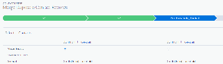

connections, you can also define the type of relationship (Friend, Family, Mother, Daughter, and so on),

and the relationship status (Current, Former).

Note Watch the Nonprofit Salesforce How-To Series video: Manage Relationships.

Overview

Relationships in Nonprofit Success Pack connect one Contact to another. (This is different from

Affiliations, which connect Contacts with Organizations.) When you create these connections, you can

also define the type of relationship (Friend, Family, Mother, Daughter, and so on), and the relationship

status (Current, Former).

Create a New Relationship Record

Create a Relationship to track how two contacts are related, such as the relationship between a parent

and child. The Relationship record determines the Opportunity Contact Role when you create an

Opportunity.

Edit an Existing Relationship

Update a Relationship, such as changing its status from Current to Former. When you modify a

Relationship, NPSP automatically updates the Reciprocal Relationship so that both records are

accurate.

View Relationships with the Relationships Viewer

The Relationships Viewer provides a visual representation of how your Contacts are connected. By

default the Relationships Viewer shows connections for a single Contact, but you can show second-

and third-level relationships as well.

Overview

Relationships in Nonprofit Success Pack connect one Contact to another. (This is different from

Affiliations, which connect Contacts with Organizations.) When you create these connections, you can

also define the type of relationship (Friend, Family, Mother, Daughter, and so on), and the relationship

status (Current, Former).

When you create a Relationship in the Nonprofit Success Pack, it automatically creates a “reciprocal

relationship,” which reflects this same relationship in the other direction. For example, if you create a

relationship from Roberto's Contact record, and specify Valentina as his wife, Valentina's Contact record

will also reflect that she has a husband, Roberto. Reciprocal Relationships ensure that relationship types

are accurate, no matter where you're viewing them from.

Relationship behavior in Nonprofit Success Pack is controlled by your Relationships Settings. To learn

more about these settings and the adjustments you can make, see Manage Relationships Settings.

Create a New Relationship Record

Create a Relationship to track how two contacts are related, such as the relationship between a parent

and child. The Relationship record determines the Opportunity Contact Role when you create an

Opportunity.

488

11.. Navigate to the Contact you want to create the Relationship for.

22.. Click the Related tab, then scroll to the Relationships related list.

33.. Click New.

44.. Enter the new Relationship information.

Contact—NPSP auto-populates this field with the name of the Contact the Relationship record is

connected to.

Related Contact— Specifies the Contact who's related to the person in the Contact field.

Type—Specifies how the Related Contact is connected to the Contact. In this example, Kailyn Jones is

Jasmine Jones' parent.

Status—Specifies whether this is a current or former relationship.

Related Opportunity Contact Role—The Opportunity Contact Role assigned to the Related Contact

when you create an Opportunity for the Contact in this Relationship. To learn more about how this

feature works, see Automated Soft Credits.

Description—A place to add additional information about the relationship.

Important The Relationship Type describes the Related Contact's relationship to the Main

Contact, not the Main Contact's relationship to the Related Contact.

55.. Click Save.

Once the Relationship record is saved, NPSP automatically creates a reciprocal Relationship attached to

the Related Contact's record, and populates the Relationship Explanation field.

Edit an Existing Relationship

Update a Relationship, such as changing its status from Current to Former. When you modify a

Relationship, NPSP automatically updates the Reciprocal Relationship so that both records are accurate.

To modify an existing Relationship:

11.. Navigate to the Contact record whose Relationship you want to edit.

22.. Click the Related tab, and scroll to the Relationships related list.

33.. In the row for the Relationship you want to update, click , then select Edit.

44.. When you're finished editing, click Save.

489

Note When you update a Relationship record, NPSP automatically updates the Reciprocal

Relationship to keep the two records in sync. For example, if you change the status of the

Relationship record from Current to Former, NPSP updates the status to Former on the Reciprocal

Relationship record.

View Relationships with the Relationships Viewer

The Relationships Viewer provides a visual representation of how your Contacts are connected. By

default the Relationships Viewer shows connections for a single Contact, but you can show second- and

third-level relationships as well.

To launch the Relationships Viewer:

11.. Navigate to the Contact whose relationships you want to see.

22.. On the Lightning Actions menu, click ( ), then select Relationships Viewer.

Note If you don't see the Relationships Viewer option, add it to the Contact page layout. See Add

the Relationships Viewer to the Contact Page Layout for more information.

The Relationships Viewer displays the Contact you started from (the "base Contact", shown in purple),

along with that Contact's connections.

To see additional relationships, click any of the related Contacts. In this example, clicking Valencia

Robledo displays her two additional connections:

Your Salesforce admin can enable Tabular View for Relationships Viewer. Tabular View shows relationship

information in a nested table and is better for users of assistive technology like screen readers.

Additionally, some users simply prefer the tabular view to the graphical one.

Click each Contact name to expand the list of relationships for that Contact.

Note Special thanks to Brian Pickett, who contributed to this documentation.

Specify a Preferred Phone Number and Email Address for a Contact

Salesforce comes out-of-box with one email and one phone field. This is a great start, but often people

490

have more than one phone and email. NPSP adds several custom phone and email fields, so that you

can track a Contact's business and personal emails, as well as mobile, office, and home phones. NPSP

also lets you specify a Preferred Email and Preferred Phone.

Note Watch the Nonprofit Salesforce How-To Series video: Specify Primary Email & Phone

When you specify a Preferred Phone or Preferred Email, NPSP automatically copies your selection into

the standard Salesforce Phone or Email field. For example, if you select "Mobile" as the Preferred Phone,

NPSP copies the value from the Mobile Phone field into the standard Phone field.

Benefits of setting a Preferred Phone and Preferred Email include:

•

The ability to display a Contact's preferred contact information in reports, list views, and related lists.

•

The ability to use Mass Email and Request Updates features.

To update a Contact's Preferred Phone or Preferred Email:

11.. In Nonprofit Success Pack, search for the Contact whose information you want to edit, or click the

Contacts tab and select the Contact from the list of recent Contacts.

22.. On the Contact record, click Edit.

33.. Under Contact Information, select a Preferred Phone or Preferred Email.

44.. Click Save.

Why and How to Use Leads

Leads are more temporary than Contacts. Use Leads to record that someone may be interested in

interacting with your organization. Once you're confident the person is going to donate, volunteer, or

engage with your organization in some way, convert that Lead to a Contact or Account.

Note Watch the Nonprofit Salesforce How-To Series video: Why and How to Use Leads

Note This article was written at the 2017 NPSP Sprint in Baltimore by these amazing community

members: Justin Barss, Billy Daly, Lynda En, Maggie Epps, Cori O'Brien Paluck, Beth Saunders,

Samantha Shain, Tim Weeks. A special thank you to Cori O'Brien Paluck for leading the group effort.

What is a Lead and How Does it Work?

Nonprofits can use Leads to document an expression of interest for any number of interactions,

especially when there is a clear goal to qualify the interest before creating other records like a Contact.

Defining a clear Lead process can help you collect data and convert the data into other records at the

click of a button.

Leads vs. Contacts

We mentioned that Leads are typically used to qualify interest before creating a Contact, but you

might still be wondering when to use one over the other. Think of it this way: Leads are more

temporary than Contacts. Use Leads to record that someone may be interested in interacting with your

491

organization in some way.

When to Use Leads (Examples)

Here are some common examples of how an org might use Leads. We also outlined at a high level

what you'll need to set up in Salesforce if you'd like to use Leads in a similar way.

What is a Lead and How Does it Work?

Nonprofits can use Leads to document an expression of interest for any number of interactions,

especially when there is a clear goal to qualify the interest before creating other records like a Contact.

Defining a clear Lead process can help you collect data and convert the data into other records at the

click of a button.

Traditionally, a Lead represents a sales prospect (a person or organization) that expresses interest in the

goods or services a company offers.

From a standard Salesforce point of view, a Lead is a record that collects data about a prospect before

you're sure that the person will have a lasting relationship with your organization. Leads in Salesforce

have loads of built in functionality including field mapping, ownership auto-assignment, and the ability

to convert to a Contact, Account, and Opportunity once you want to fully integrate them with the rest of

your data. Also, the native Lead conversion process can be extended to trigger the creation of a custom

object using Salesforce automation.

You don't have to be a money-making company to find Leads useful! Read on to discover some common

use cases that can help you decide if Leads are right for your organization.

Leads vs. Contacts

We mentioned that Leads are typically used to qualify interest before creating a Contact, but you might

still be wondering when to use one over the other. Think of it this way: Leads are more temporary than

Contacts. Use Leads to record that someone may be interested in interacting with your organization in

some way.

In addition, Leads are also a safe way to capture interest from your website while making sure you're not

getting duplicate or spam records.

Once you feel confident the person is going to donate, volunteer, or engage with your organization in

some way. convert that Lead to a Contact (or Account).

When to Use Leads (Examples)

Here are some common examples of how an org might use Leads. We also outlined at a high level what

you'll need to set up in Salesforce if you'd like to use Leads in a similar way.

Tip Web-to-Lead forms are your friend. They are a simple form that can be embedded right on your

website and they don't require any custom field mapping. You can also use third-party form tools for

492

your more complex forms, which handle duplicates and multiple object touches a bit better.

Tip On Web-to-Lead forms, the "Company" field is required. When you're collecting data for

individuals, you can include instructions to enter "Self" in the company field. Code in the Lead

Conversion Visualforce page handles creating a Household Account for the new Contact if the

Company is "Self", "Individual" or an exact match of the Lead's First/Last Name.

Example 1: Organization Selling a Product

An organization working for racial justice is selling Black Lives Matter t-shirts to the community. A

neighbor who wants to put in a large order fills out a general Contact Us Form on the organization's

website, requesting information about bulk discounts. This request is recorded as a Lead. Once the

organization confirms that the neighbor's interest is genuine, they convert the Lead to a Contact,

Account, and Opportunity, and get that order out!

Example 2: Organization Recruiting Volunteers

An organization has strict guidelines for volunteers to participate in certain programs. The volunteer

roles may require specific skills, certifications, or other prerequisites (such as background checks or

security clearance). The org needs to understand how many applicants do not pass these tests, and

who is currently in the qualification process.

Example 3: Organization Researching Potential Donors

An organization is collecting wealth data for prospective major donors who are identified through

Board member referrals, demographic-based search, or other external means. Before adding these

prospects to existing donor (Contact) records, the org wants to ensure they meet the engagement

level criteria.

Example 4: Determining if People are Qualified to use an Organization's Services

People may call in, email, fill out a web form, or walk into a center looking for more information.

Perhaps the organization can't provide services to the individual (for qualification reasons) or they lack

resources that the person needs, but the organization is able to track the area of the constituent's

need and refer them to another organization. Board members need to know where the unmet needs

are to help with budgeting and strategy, and to communicate referrals to partner organizations.

EExxaammppllee 11:: OOrrggaanniizzaattiioonn SSeelllliinngg aa PPrroodduucctt

An organization working for racial justice is selling Black Lives Matter t-shirts to the community. A

neighbor who wants to put in a large order fills out a general Contact Us Form on the organization's

website, requesting information about bulk discounts. This request is recorded as a Lead. Once the

organization confirms that the neighbor's interest is genuine, they convert the Lead to a Contact,

Account, and Opportunity, and get that order out!

With this process, the organization can report on number of t-shirt inquiries, as well as how many of

those inquiries turn into actual sales.

To set up a similar process in your org:

11.. Create a Web-to-Lead form and embed it on your website as a Contact Us form. This is a great way to

capture interest about your product or service.

493

22.. Create and map custom fields:

••

Create custom fields to track information particular to your products or services, such as t-shirt size.

••

Map custom and standard Lead fields to corresponding fields on Contact, Account, and

Opportunity. .

33.. Report on Lead conversion. Use standard Salesforce reports to report on how many inquiries turn into

actual sales.

EExxaammppllee 22:: OOrrggaanniizzaattiioonn RReeccrruuiittiinngg VVoolluunntteeeerrss

An organization has strict guidelines for volunteers to participate in certain programs. The volunteer roles

may require specific skills, certifications, or other prerequisites (such as background checks or security

clearance). The org needs to understand how many applicants do not pass these tests, and who is

currently in the qualification process.

The org can use Leads to track the applicant through the qualification process. Once the applicant is

qualified, they can convert the Lead into a Contact.

To set this up in your org:

11.. Create a Web-to-Lead form and embed it on your website. This is the form that applicants can fill out

to express interest in volunteering with your company.

22.. Set up your Lead statuses. Web-to-Lead forms are a great way to capture volunteer interest, but they

also introduce a bunch of new Leads. You can use Lead Statuses to organize these new Leads.

33.. Create a Lead Dashboard to monitor applicants through the different stages of qualification.

EExxaammppllee 33:: OOrrggaanniizzaattiioonn RReesseeaarrcchhiinngg PPootteennttiiaall DDoonnoorrss

An organization is collecting wealth data for prospective major donors who are identified through Board

member referrals, demographic-based search, or other external means. Before adding these prospects to

existing donor (Contact) records, the org wants to ensure they meet the engagement level criteria.

If they meet the criteria, the Lead is converted to a Contact or Account, and the information is handed

off to the org's Development Officer.

To set this up in your org:

11.. Create custom fields that your NPO uses to qualify prospects. Once the Lead is converted, you can

map these Lead fields to the fields on the subsequently created Contact, Account, or Opportunity

record.

22.. Create Assignment Rules to automatically assign new Leads to users in your company, and notify them

when a new Lead is created and assigned to them.

33.. Create Queues of multiple users in your org who can manage Leads. That way when staff are going on

vacation, you can assign Leads to the Queue.

44.. Create an Engagement Plan and assign it to your Leads. Engagement Plans are predetermined sets of

tasks that you can use to follow up on and engage with a Lead.

494

EExxaammppllee 44:: DDeetteerrmmiinniinngg iiff PPeeooppllee aarree QQuuaalliififieedd ttoo uussee aann OOrrggaanniizzaattiioonn''ss

SSeerrvviicceess

People may call in, email, fill out a web form, or walk into a center looking for more information. Perhaps

the organization can't provide services to the individual (for qualification reasons) or they lack resources

that the person needs, but the organization is able to track the area of the constituent's need and refer

them to another organization. Board members need to know where the unmet needs are to help with

budgeting and strategy, and to communicate referrals to partner organizations.

To set this up in your org:

11.. Create a Web-to-Lead form and embed it on your website. People who come to your website can use

this form to inquire about resources or services.

22.. Create custom fields to track the areas/services/resources that people are inquiring about. You can

also create a lookup field so that you can track the Account(s) you're referring people to.

33.. Create reports to track inquiries that have and have not been converted (grouped by area).

Convert a Lead to a Contact

The Nonprofit Success Pack includes a Lead conversion utility that provides specialized functionality to

convert a Lead to a Contact.

Note Watch the Nonprofit Salesforce How-To Series video: Convert a Lead

The Nonprofit Success Pack includes a Lead conversion utility that provides specialized functionality.

Note Before you convert Leads, you may need to review or update field mappings. For details, see

Configure Leads.

To convert a Lead to a Contact:

11.. In the Nonprofit Success Pack, navigate to the page for the Lead you want to convert, and then click

Convert. You'll find this button in the right-hand corner of your screen.

22.. Enter the field values on the page as necessary to convert your Lead into a Contact.

Note that when Company is specified ("PB&J Inc."), the Account and Affiliated Account options are

displayed.

495

Whereas when Company is an "Individual," Account and Affiliated Account aren't displayed:

••

Record Owner (1): Select the owner of the new or merged Contact and Household Account.

••

Send Email to the Owner (2): Sends an email to the new owner with a link to the new Contact.

••

Contact (3): Includes these options:

•• - Create New: Creates a new Contact. If you create a new Contact from this Lead, Salesforce also

496

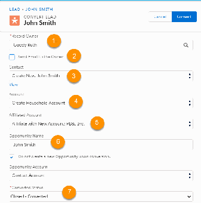

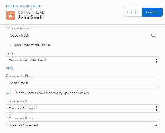

creates a new Household Account for the Contact, or allows you to specify an Organizational

Account.

•• - Merge with Existing: The NPSP Lead Conversion utility also attempts to find an exact-match (not

case-sensitive) Contact in the system, searching for either the email address or the Lead's full

name (both First Name and Last Name). If the utility finds potential matches, you'll see them

listed in the Contact picklist. Select Merge with Existing to merge the Lead into an existing

Contact record.

••

Account (4): Includes these options:

•• - Create Household Account: Creates a new Household Account for the new Contact.

•• - Attach to Existing: Select if the Lead's Company matches an existing Organizational Account, and

you want the Contact to use that for their Account.

•• - Create New Account: Creates a new Organizational Account using the Lead's Company, and to

have the Contact use that for their Account.

Note

•• - If you choose to merge the Lead into an existing Contact, these choices are not displayed,

since the Contact's Account will not be changed.

•• - If the Company name value on the Lead is "self", the full name of the Lead, or “Individual”,

the Account and Affiliated Account options are not displayed on the Lead Convert page.

••

Affiliated Account (5): Includes these options:

•• - None: NPSP should not create an Affiliation between the Contact and Account.

•• - Affiliate with Existing: Select if the Lead's Company matches an existing Organizational Account,

and you want to create an Affiliation between the Contact and Account.

•• - Affiliate with New Account: Select to create an Affiliation between the Contact and a new

Organizational Account, created from the Lead's Company.

••

Opportunity Name / Do not create a new opportunity (6): If you want to create a new

Opportunity (Donation) for the Contact after converting the Lead, deselect the Do not create a new

Opportunity upon conversion checkbox, and enter a name for the Opportunity. The new Donation

record will use the default Record Type for the user who converts the Lead.

••

Converted Status (7): If you're utilizing multiple Lead Status values in your organization, select the

appropriate value based on your business process.

33.. Click Convert to start the Lead convert process.

When completed, the page displays the newly converted or merged Contact. If you elected to create a

new Opportunity as well, you can find the new record by scrolling down to the Donations related list

on the Contact page.

Primary Contact vs. Primary Affiliation

The Primary Contact is the one go-to contact for all communication with an Organization or Household.

A Primary Affiliation is the Account that the Contact is associated with more than any other Account,

such as their employer.

Note Watch the Nonprofit Salesforce How-To Series video about Organization Primary Contact.

497

What is a Primary Contact?

From the perspective of an Account, the Primary Contact is the one go-to contact for all

communication with that Organization or Household. On a Household, the Household's first Contact

(likely the Contact you used to create the Household) is automatically assigned as the Primary Contact.

On an Organization, the Primary Contact is manually assigned. An Organization or Household may

have one and only one Primary Contact.

What is a Primary Affiliation?

A Primary Affiliation is the Account that the Contact is associated with more than any other Account,

such as their employer. While the Primary Affiliation is typically used for representing the employer/

employee connection between an Organization Account and a Contact, it could also be used to

represent a donor who's a board member for a specific foundation.

So, What's Causing the Confusion?

The Primary Contact for a Household is a relatively clear concept. Each Household has one contact

that's designated as the "Head of Household." When you start looking at Organization Accounts,

however, the concept gets a bit more confusing.

What is a Primary Contact?

From the perspective of an Account, the Primary Contact is the one go-to contact for all communication

with that Organization or Household. On a Household, the Household's first Contact (likely the Contact

you used to create the Household) is automatically assigned as the Primary Contact. On an Organization,

the Primary Contact is manually assigned. An Organization or Household may have one and only one

Primary Contact.

For information on changing the Primary Contact for a Household, see Change the Primary Contact for a

Household. To change the Primary Contact for an Organization, simply edit the Account record's Details

section to select a different Primary Contact.

What is a Primary Affiliation?

A Primary Affiliation is the Account that the Contact is associated with more than any other Account,

such as their employer. While the Primary Affiliation is typically used for representing the employer/

employee connection between an Organization Account and a Contact, it could also be used to

represent a donor who's a board member for a specific foundation.

A Contact may have one and only one Primary Affiliation, though a single Organization Account may be

designated as the Primary Affiliation for multiple Contacts.

For information on creating or modifying Affiliations, see Add and Manage Organization Accounts.

So, What's Causing the Confusion?

The Primary Contact for a Household is a relatively clear concept. Each Household has one contact that's

designated as the "Head of Household." When you start looking at Organization Accounts, however, the

498

concept gets a bit more confusing.

The use of the word “Primary” for both Primary Contact and Primary Affiliation, as they relate to

Organization Accounts, has caused the confusion. Let's look at an example of how these two things work

within the context of an Organization Account.

John, Sally, and Veronica all work for Test Foundation. John and Sally are employees, and Veronica is the

CEO. They each have Affiliations with other Organizations (for example, the ABC Foundation), and have

an Affiliation record in Salesforce for each of those Affiliations. But since the Test Foundation is John,

Sally, and Veronica's employer, it's listed as the Primary Affiliation for all of them.

On John's Contact record, you can see his list of Affiliations to other Organizations:

And in the Details section of his Contact record you can see the designation that Test Foundation is his

Primary Affiliation:

Now, if you look directly at John's Test Foundation Affiliation record, you'll see that the Primary checkbox

499

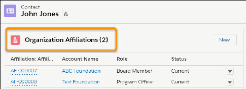

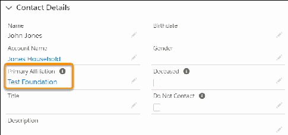

is checked. That checkbox indicates that Test Foundation is John's Primary Affiliation, however, it does

not necessarily mean that John is the Primary Contact at Test Foundation.

Over on the Test Foundation Account record, we see something different with respect to "Primary." There

can only be one Primary Contact for the organization—and it's Veronica, since she's the CEO and the

point-of-contact at the Test Foundation.

500

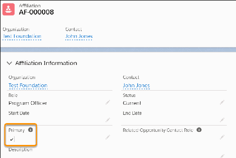

As for Sally and John, while they work at Test Foundation and it's their Primary Affiliation, they aren't the

main points-of-contact for that organization. They're listed as Affiliated Contacts for Test Foundation,

rather than as Primary Contacts.

Deleting Contacts

This article describes how deletion works in a new Trial org with NPSP.

Important This article outlines the NPSP deletion behavior starting with release 3.89 (February

501

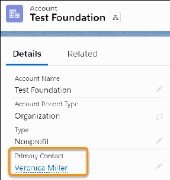

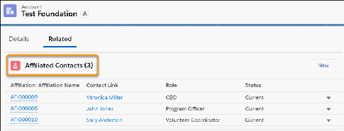

2017). It describes how deletion works in a new Trial org with NPSP, and does not account for any

additional customizations (including apps, fields, and so on).

What Happens When I Delete a Contact (with Contact Delete Override Enabled)?

When you delete a Contact with Contact Delete Override enabled, NPSP deletes Opportunities (if the

Contact is the Primary Contact), Recurring Donations, and Relationships in addition to standard

Salesforce detail records.

What Happens When I Delete a Contact (with Contact Delete Override

Enabled)?

When you delete a Contact with Contact Delete Override enabled, NPSP deletes Opportunities (if the

Contact is the Primary Contact), Recurring Donations, and Relationships in addition to standard

Salesforce detail records.

If the Contact is not the last in the Household, and they have Closed/Won Opportunities or Organization

Opportunities (where the Account is set to something other than the Contact's Household or One-to-

One Account), then you can't delete the Contact. Additionally, if the Contact is the last in the Household,

and they have Closed/Won Opportunities or Organization Opportunities, you can't delete the Contact

and leave the Account empty. You must manually delete the Opportunities before deleting the Contact.

If the Contact is the last Contact in the Household or One-to-One Account, NPSP prompts the user to

either delete the Contact and leave the Account empty OR delete the Contact and the Account.

Note Contact Delete Override doesn't apply when deleting records through the API or bulk

deletion.

Note If you're not sure if you have Contact Delete Override enabled, or you want to learn how to

enable it, see Enable Contact Delete Override.

Manage NPSP Addresses

Learn about address changes, how to manage the default address, use a seasonal address, and mark an

address as undeliverable in NPSP.

Address Management Overview

Learn how NPSP can help you classify, track, update, and verify addresses for your constituents.

Add or Update an Address

Add or update an address for Contacts, Households, or Organizations in NPSP.

502

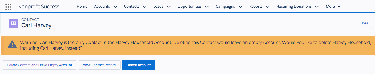

Specify a Default Mailing Address for a Household or Organization

Indicate when a mailing address is the default for the household and contact.Learn how to specify a

default address in NPSP.

Override the Default Household Address for a Contact

If you have a Contact who prefers to receive their individual mailings at a different address than the

default Household address, you can accommodate them by setting an Address Override.

Mark an Address as Undeliverable

To remove bad addresses from your mailing lists, mark them as undeliverable.

Specify a Seasonal Address

Learn how to set up a Seasonal Address.

Address Management Overview

Learn how NPSP can help you classify, track, update, and verify addresses for your constituents.

Introduction

Your team puts a great deal of care, time, and effort into crafting solicitation letters, event invites, and

other communications. After working so hard on your mailings, you want to make sure your donors

receive them and you're not wasting resources sending duplicate mailings or mailing to bad addresses.

Summary of Address Management Features

NPSP is designed to help nonprofits perform common address management tasks.

See Also

Read these additional articles for step-by-step instructions for specific Address Management tasks.

Introduction

Your team puts a great deal of care, time, and effort into crafting solicitation letters, event invites, and

other communications. After working so hard on your mailings, you want to make sure your donors

receive them and you're not wasting resources sending duplicate mailings or mailing to bad addresses.

Fortunately, the Nonprofit Success Pack (NPSP) comes with robust address management tools to help

you track and easily update your constituents’ addresses.

NPSP makes address updates easy. Simply update the address on a Contact record, and the change is

automatically applied to the other Contacts in the household and the Household Account itself. That way

all records within a household share the same address.

Note Want help keeping up with address changes when your constituents move? Check out Insights

Platform Data Integrity from Salesforce.org.

Summary of Address Management Features

NPSP is designed to help nonprofits perform common address management tasks.

503

With address management you can:

•

Update address information with one edit. When you update the address for one record in a

household, all related records get the same update too.

•

Track all past addresses and address updates.

•

Classify addresses as home, work, or other address type.

•

Mark an address as undeliverable, so you don't include it in your mailings.

•

Verify addresses as deliverable and update address format to match postal service standards. See

Configure Address Verification for more information.

See Also

Read these additional articles for step-by-step instructions for specific Address Management tasks.

Add or Update an Address

Add or update an address for Contacts, Households, or Organizations in NPSP.

Add or Update a Constituent Address

When you add or update a constituent address, NPSP automatically syncs address information for all

Contacts in the Household Account. That way you never have to worry that you're using two different

addresses for people in the same household.

Add or Update an Organization Account Address

Organization Accounts represent businesses. When you add or edit an Organization Account's address,

the change applies to the Organization Account only and not to any related Contact records.

Add or Update a Constituent Address

When you add or update a constituent address, NPSP automatically syncs address information for all

Contacts in the Household Account. That way you never have to worry that you're using two different

addresses for people in the same household.

To add or update an address for a constituent and their related household members:

11.. Find the Contact record you want to edit.

22.. Click Edit.

33.. Enter the Mailing Address information.

44.. Save the Contact.

Note To enter an address for a Contact that’s different from what’s used for the rest of the

household, select Address Override on the Contact.

You can also change the address for a constituent and their related household members by editing the

Household Account and updating the Billing Address fields. The Billing Address is the primary address for

a Household Account.

504

Add or Update an Organization Account Address

Organization Accounts represent businesses. When you add or edit an Organization Account's address,

the change applies to the Organization Account only and not to any related Contact records.

To update an Organization Account address:

11.. Find the Organization Account record you want to edit.

22.. Click Edit.

33.. Enter Billing Address information. Optionally, enter Shipping Address information.

44.. Save the Account.

Specify a Default Mailing Address for a Household or Organization

Indicate when a mailing address is the default for the household and contact.Learn how to specify a

default address in NPSP.

Note Watch the Nonprofit Salesforce How-To Series video: Mark a Default Address.

Mark an Address as Default

Marking an Address as the default specifies that it is the Address to send mailings to.

Mark a New Address as Default if the Household Moves

Create a new address and mark it as the household's default address. The previous default address

and all contacts related to the household are updated.

Mark an Address as Default

Marking an Address as the default specifies that it is the Address to send mailings to.

Note This functionality is available only if you're using the Household Account model. For more

information, see What is the Household Account Model?

When you mark an Address as default, NPSP:

•

Copies that Address to the related Household or Organization Account's Billing Address fields.

•

Copies that Address to the Mailing Address fields of each Contact who's connected to the Household

(Household Accounts only).

Note Default Mailing Addresses aren't copied to Contacts who have an Address Override. See

Override the Default Household Address for a Contact.

To mark an Address as default:

11.. In the Nonprofit Success Pack, search for the Household or Organization (for example, “Smith

Household”), or click the Accounts tab to see a list of recent Accounts.

505

22.. Click the Account Name of the Household or Organization Account whose addresses you want to edit.

33.. Scroll down to the Addresses related list, find the Address record you'd like to set as the default, and

click Edit.

44.. Select the Default Address checkbox, and click Save.

You now see the default Address in the Mailing Address and Household Mailing Address fields on the

Contact record.

Mark a New Address as Default if the Household Moves

Create a new address and mark it as the household's default address. The previous default address and

all contacts related to the household are updated.

506

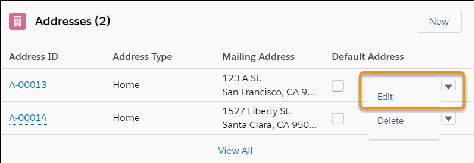

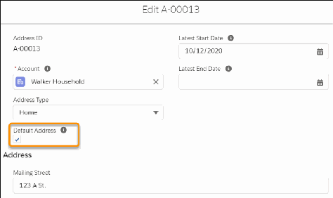

11.. Create the new address for the Household Account.

22.. Mark the new address as the Default Address (procedure above), and click Save.

Behind the scenes:

•

On the previous default Address, the Default Address checkbox is unchecked.

•

On the previous default Address, the Latest End Date field is populated with today's date.

•

The Household Account and related Contacts are updated with the new default Address.

Override the Default Household Address for a Contact

If you have a Contact who prefers to receive their individual mailings at a different address than the

default Household address, you can accommodate them by setting an Address Override.

Note Watch the Nonprofit Salesforce How-To Series video: Override a Default Contact Address

Many organizations send general solicitations and newsletters to Households, while sending other

targeted mailings, such as Board communications, to individual Contacts. If you have a Contact who

prefers to receive their individual mailings at a different address than the default Household address, you

can accommodate them by setting an Address Override.

Note This functionality is available only if you're using the Household Account model. For more

information, see What is the Household Account Model?

11.. On the Contact where you want to specify a different mailing address, click Edit. (The Contact must

already be in the Household.)

22.. In the Address Information section, select Address Override. The Contact's mailing address will no

longer sync up with the Default Address for the Household.

33.. In the Current Address lookup field, select the new Address for this Contact. You can also manually

enter a new Address in the Mailing Address fields.

44.. Click Save.

507

Mark an Address as Undeliverable

To remove bad addresses from your mailing lists, mark them as undeliverable.

Overview

When you're notified of a bad address, mark it as undeliverable in NPSP.

508

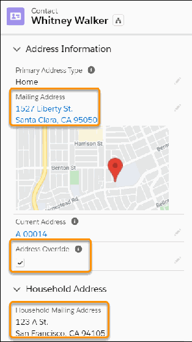

Mark an Address as Undeliverable

With address management, NPSP ensures that an edit to one record in a Household, including the

Contacts, Address records, and Household Account, is copied to all the related records. So to update

the Undeliverable address fields for all records in a Household, edit just one of the records.

Filter Undeliverable Addresses in Reports

To exclude records that have an undeliverable address from your mailing lists, use a report filter.

Overview

When you're notified of a bad address, mark it as undeliverable in NPSP.

Postal mail is an important channel for donor and constituent management. After sending out your

appeals, gift acknowledgments, event invitations, and other written communications, sometimes some

of them come back as undeliverable. Perhaps the address was incorrect, the donor's information was

incomplete information, or the postal service simply can't deliver to the address that you gave.

When you're notified of a bad address, mark it as undeliverable in NPSP.

Note Want help keeping up with address changes when your constituents move? Explore Insights

Platform Data Integrity from Salesforce.org.

Mark an Address as Undeliverable

With address management, NPSP ensures that an edit to one record in a Household, including the

Contacts, Address records, and Household Account, is copied to all the related records. So to update the

Undeliverable address fields for all records in a Household, edit just one of the records.

NPSP tracks undeliverable addresses using these fields:

•

Undeliverable Mailing Address on the Contact object.

•

Undeliverable Billing Address on the Account object.

•

Undeliverable on the Address object.

If these fields aren't visible in your org, have your system administrator follow the instructions in

Configure Address Management.

With address management, NPSP ensures that an edit to one record in a Household, including the

Contacts, Address records, and Household Account, is copied to all the related records. So to update the

Undeliverable address fields for all records in a Household, edit just one of the records.

To mark an address as undeliverable using a Contact record:

11.. Locate the Contact record that you want to update.

22.. Click Edit.

509

33.. In Address Information, select Undeliverable Mailing Address.

44.. Save the Contact.

Note If a Contact record has the Address Override field selected, NPSP doesn’t change the

Undeliverable Mailing Address field for that Contact. Learn more in Override the Default Household

Address for a Contact.

Filter Undeliverable Addresses in Reports

To exclude records that have an undeliverable address from your mailing lists, use a report filter.

11.. Locate a report that you want to update.

22.. Click Edit.

33.. Click Filters.

44.. In Add Filter, find and select Undeliverable Mailing Address.

55.. Select False.

66.. Click Apply.

77.. Save the report.

Specify a Seasonal Address

Learn how to set up a Seasonal Address.

Note Watch the Nonprofit Salesforce How-To Series video about Seasonal Address.

You can set up a Seasonal Address with start and end dates for a Household or Organization Account, so

that the Seasonal Address is automatically set as the Mailing Address at the specified start date. When

the end date is reached, Salesforce copies the original Address back to the Address fields.

To set up a Seasonal Address:

11.. Create a new Address for the Household or Organization Account.

22.. On the Address Edit page, enter the Seasonal Information: Seasonal Start Month, Seasonal Start Day,

Seasonal End Month, and Seasonal End Day. Don't select a year, because we don't want this

particular date range to expire until you change or delete it.

33.. Click Save.

When the Seasonal Address start date is reached, Salesforce automatically copies the Address to the

Account's Billing Address fields. If it's a Household Account, Salesforce also copies the seasonal address

to the Mailing Address for all related Contacts who do not have an Address Override.

510

