it to only show Recurring Donations connected or not connected to Elevate.

NPSP Import Data

Learn how to prepare your data for import, use the NPSP Data Importer template to import your data,

and finalize the import.

NPSP Data Loader Introduction

Assess if you're ready to import your data using NPSP Data Loader. Learn how the import process

works and how NPSP Data Importer processes data.

NPSP Import DI Object

The steps for getting data into the NPSP Data Import object. After this, you'll have NPSP Data Loader

process the import to your target objects.

Finalize NPSP Import

Use Dry Run to verify the records you want to import, process the import, troubleshoot common

import errors, and delete import records after you're done with them.

NPSP Advanced Options

Advanced NPSP Data Import options including scheduling import batches or using code to customize

the import.

NPSP Data Loader Introduction

Assess if you're ready to import your data using NPSP Data Loader. Learn how the import process works

and how NPSP Data Importer processes data.

Are You Ready to Import Data into NPSP?

Learn what it takes to import data from a spreadsheet into the Nonprofit Success Pack.

How the Import Process Works

Find out more about the import process.

How NPSP Data Importer Processes Data

Use NPSP Data Importer for regular data import and custom integrations. It's also the engine that

powers Gift Entry and Elevate.

Are You Ready to Import Data into NPSP?

Learn what it takes to import data from a spreadsheet into the Nonprofit Success Pack.

Data Import Overview

If you're used to working in Excel, think of Salesforce as many, many spreadsheets, all related to each

other in specific ways, and all stored on the internet.

308

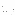

Find More Help

Visit Salesforce's vibrant, online community, where your fellow nonprofits discuss all questions great

and small.

Data Import Overview

If you're used to working in Excel, think of Salesforce as many, many spreadsheets, all related to each

other in specific ways, and all stored on the internet.

Salesforce is like a gigantic database in the cloud, and we commonly refer to the various "parts" of

Salesforce as objects (Contacts, Household Accounts, Opportunities, and so on). You can see these as

the tabs across the top of your Salesforce org.

We can't lie: if you have thousands of data rows in existing spreadsheets or in-house databases,

importing your data into the right Salesforce objects takes a lot of work. The good news? The Nonprofit

Success Pack provides tools so you don't have to tackle this complex, time-consuming project without

some help.

To get started, head over to How the Import Process Works.

Important You need to budget enough time to go through the data import process properly.

Complex donor data is not something that can normally be imported in an hour or two—it could

take much longer to go through all of the required steps, depending on the quality and quantity of

your data. Please prepare accordingly.

Find More Help

Visit Salesforce's vibrant, online community, where your fellow nonprofits discuss all questions great and

small.

You'll find:

•

Questions and answers on virtually everything related to Salesforce and nonprofits.

•

Specialized Chatter groups dedicated to the types of nonprofits you're interested in.

•

Product documentation, workbooks, and helpful tips.

•

The most knowledgeable experts on Salesforce and nonprofits, anywhere in the world.

Access the online community. Use your Salesforce username and password to log in—no other

credentials required!

How the Import Process Works

Find out more about the import process.

A Step-by-Step Look at the Import Process

309

Follow these steps to get donor data into Salesforce.

Why is It so Complicated?

You may be thinking that this process seems awfully complicated. You may also be wondering why we

need an intermediate step of uploading data to the NPSP Data Import custom object. What's its

purpose?

A Step-by-Step Look at the Import Process

Follow these steps to get donor data into Salesforce.

11.. Prepare Salesforce for Import: Get your Salesforce org set up and ready to receive your data set.

22.. Prepare Your Data for Import: Clean your data and put it in the NPSP Data Importer Templates,

which mirrors the fields in the NPSP Data Import custom object.

33.. Import to NPSP Data Import Custom Object: You can use the application of your choice to import

your CSV data into the NPSP Data Import object. The instructions we provide in these docs highlight

using the Salesforce Data Import Wizard. But you can instead use an external data import

application—such as Salesforce Data Loader, DemandTools, Apsona, Jitterbit, and Informatica—to

upload your data to Salesforce. (This is the first part of the two-part import process.)

44.. Set Up Matching and Do a Dry Run: If you already have records in your org and want to check to see if

the records you're about to upload match any of those existing records, you can do a dry run. The Dry

Run works like the import process, but doesn't actually import the records. This helps to prevent

duplicates in your org and helps you avoid updating an existing record with incorrect data. If you'd like

to save any of these NPSP Data Import configuration options, see Batch Import Overview.

55.. Process Your Import: Start the NPSP Data Import tool, which takes the organized data from the

custom object's records and imports them into the Nonprofit Success Pack as multiple objects,

including Contacts, Accounts, and donations (Opportunities). (This is the second part of the two-part

import process.)

66.. Delete Imported Records: After you've successfully imported your records, you can optionally reduce

data storage by deleting the intermediate data in the NPSP Data Import object.

After you complete this process, your data will reside in the following Salesforce objects created from the

import process:

•

Contacts (donors, volunteers, advocates, and other constituents in NPSP)

•

Accounts (households or organizations in NPSP)

•

Opportunities (donations, grants, and the like in NPSP)

•

NPSP Payments

•

Campaigns

•

Additional objects you add to the NPSP Data Importer

310

Why is It so Complicated?

You may be thinking that this process seems awfully complicated. You may also be wondering why we

need an intermediate step of uploading data to the NPSP Data Import custom object. What's its

purpose?

Without this custom object, you'd need to transfer your existing data into multiple spreadsheets—each

one representing a table of Contacts, Accounts, donations (Opportunities), and so on. Then you'd need

to import each spreadsheet into Salesforce, individually and in the correct sequence. First create

Accounts, then Contacts, and so on. After each import, you'd need to export the data from Salesforce,

get unique IDs for records, and create relationships between these records and the records in your other

spreadsheets. The NPSP Data Importer not only creates exactly the objects you need from the single

NPSP Data Import custom object, but it also avoids creating duplicates of existing Contacts and

Accounts.

We won't go into more detail here, but believe us when we say that the NPSP Data Import object can

save you hours of work!

How NPSP Data Importer Processes Data

Use NPSP Data Importer for regular data import and custom integrations. It's also the engine that

powers Gift Entry and Elevate.

The NPSP Data Importer, along with Advanced Mapping, provides the automation and logic that allows

admins, developers, and Salesforce products to import constituent and donation data into the

appropriate NPSP and standard Salesforce objects. Use NPSP Data Importer for regular data import and

custom integrations. It's also the engine that powers Gift Entry and Elevate.

Here's a high-level summary of the process:

11.. Admins, developers, or Salesforce products create NPSP Data Import records that contain constituent

and donation data.

22.. Admins, developers, or Salesforce products, process the NPSP Data Import records using NPSP Data

Importer. The Advanced Mapping configuration determines how fields from the NPSP Data Import

records map to the appropriate NPSP and standard Salesforce fields.

33.. The NPSP Data Importer updates the NPSP Data Import records to show which records succeeded

and which failed to generate the expected NPSP and standard Salesforce records.

44.. Admins fix the errors on failed NPSP Data Import records and reprocess them with NPSP Data

Importer.

Learn more about NPSP Data Importer in How the Import Process Works and Advanced Mapping in

Advanced Mapping Overview.

311

Let's look at an example of the NPSP Data Importer in action.

New Careers, a nonprofit organization, hosts free webinars to promote their job coaching program. New

Careers wants to track attendance to measure the connection between webinar attendees and program

enrollment.

New Careers uses Campaigns to track webinar details such as event title and date. They use the Attended

Status on the Campaign Member object to track attendance.

An admin imports a spreadsheet with the following data into NPSP:

•

Contact First Name

•

Contact Last Name

•

Contact Email

•

Campaign Name (Winter 2021 Career Coaching Webinar)

•

Campaign Member Status (Attended)

NPSP creates one NPSP Data Import record for each spreadsheet row. The admin processes these

records using the NPSP Data Importer. During import, NPSP uses data from each NPSP Data Import

record to create one Contact and one Campaign Member associated with the webinar Campaign. The

Household Account model in NPSP also automatically creates a Household Account for each Contact.

Additional NPSP logic prevents the creation of any duplicate records present in the import spreadsheet.

Note To prevent duplicates, the NPSP Data Importer attempts to match incoming data with existing

records. Learn more about matching settings and how to adjust them in Configure NPSP Data

Importer Options.

And just like that, the nonprofit admin is all done importing webinar attendees!

The NPSP Data Importer can do this and much more. If the webinar was a paid event, include ticket

revenue information and fund allocations. You can even map NPSP Data Import records to your own

custom objects with Advanced Mapping.

NPSP Import DI Object

The steps for getting data into the NPSP Data Import object. After this, you'll have NPSP Data Loader

process the import to your target objects.

Do a Trial Run

By running a test import, you can ensure that you resolve all your data integrity issues before importing

your entire set of records. A trial run of 15-20 records (rows in your template) is a good test size.

Upload Data from the Template

Learn how to upload data from a spreadsheet to the NPSP Data Importer.

Verify Data Upload

Make sure the data from your template uploaded successfully to the NPSP Data Import custom object.

312

Do a Trial Run

By running a test import, you can ensure that you resolve all your data integrity issues before importing

your entire set of records. A trial run of 15-20 records (rows in your template) is a good test size.

To build your test import, look for records in your template with many cells populated, that will create

many different types of records (i.e. two or more Contacts in a Household Account, organization

Affiliations for different Contacts, multiple Opportunities, etc.). In other words, be sure you’re testing the

hard cases, not the easy ones. Once you run the test import, spend some time in Salesforce checking out

where your imported data landed. Make sure NPSP created the right types of records and the

information in the individual CSV cells went to the right Salesforce fields.

If you see unintended results, re-examine your data for integrity, validity, format in the template, as well

as mappings. After you clean that up, re-run your test (or another batch of test records). Once you have

this smaller group of records importing the way you should, repeat the now refined import process on

your full import file.

Have your test file ready to go? Upload Data from the Template!

Upload Data from the Template

Learn how to upload data from a spreadsheet to the NPSP Data Importer.

Now, let's use the Data Import Wizard to upload the template into the NPSP Data Import custom object.

Note If you don't see the NPSP Data Imports tab see Configure NPSP Data Importer.

11.. Click the App Launcher ( ).

22.. In the All Items section, click NPSP Data Imports.

33.. Click Import.

44.. In the "What kind of data are you importing?" section, make sure the Custom objects tab is selected,

and then click NPSP Data Imports.

55.. In the "What do you want to do?" section, select Add new records.

••

If you're importing your data for the first time, or know that you will be matching to existing data

based only on Name, Email or Phone, then leave all the options in this section set to --None--

(unless you are mapping one of the ID fields). Be sure to leave Match by as --None-- regardless.

313

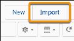

••

If your spreadsheet has Salesforce IDs for GAU Allocations or you'd like the NPSP Data Importer to

match against existing Contact, Account, Donation or Payment records later in the process, select

the appropriate value from the What do you want to do? section in the Import Wizard. Be sure to

leave Match by set to --None--. Note that you'll need to populate the corresponding Imported

field (e.g. Contact1 Imported, Contact2 Imported, Account1 Imported, Account2 Imported,

Household Account Imported) with the 15- or 18-character Salesforce ID in the template file you're

importing. For example, we populated the Contact1 Imported field (in the template) with

Contact1's Salesforce ID. So, under Which Contact field in your file do you want to match against

to set the Contact1 Imported Lookup field?, we select Salesforce.com ID.

66.. In the Where is your data located? section, either drag your completed template file to the drop zone

or browse for the file to upload it.

77.. Click Next.

88.. Verify that the field mappings are correct and make any changes if necessary. Because you're using the

template, the column headers should exactly match the field names or field labels in the NPSP Data

Import object you're uploading to. If one of your fields is unexpectedly unmapped or isn't available for

mapping, look for these common issues:

••

If you're matching by ID and the Imported field is unmapped, you likely selected the wrong field or

value in the What do you want to do? section of the Data Import Wizard.

314

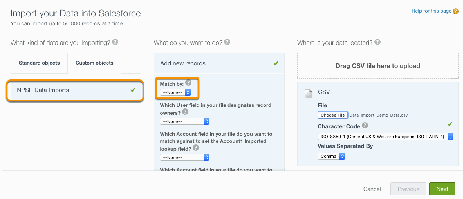

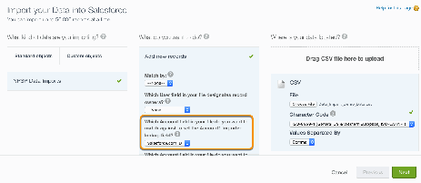

••

The Salesforce Data Import Wizard automatically maps your columns to fields when the column

name matches the field name. If your column header doesn't match and the field is unmapped, you

can manually map template fields to object fields right here in the wizard.

••

You must have Advanced Mapping enabled to map to some fields in NPSP. For more information,

see Enable and Convert to Advanced Mapping.

99.. Click Next.

1100.. Review the import summary.

1111.. Click Start Import. Your import starts and displays a confirmation message that lets you click through

to the Bulk Data Load Jobs page, where you can monitor the status of the data upload.

The first part of the import process is done! You're ready to Verify Data Upload.

Verify Data Upload

Make sure the data from your template uploaded successfully to the NPSP Data Import custom object.

11.. In Salesforce, click the NPSP Data Imports tab. If you don't see NPSP Data Imports, you can find it in

the App Launcher.

22.. Choose the To Be Imported list view to see records uploaded to the object. Keep in mind that while

your data has been uploaded into Salesforce, it hasn't been added to (that is, "imported" into) any

NPSP objects yet.

33.. Spot-check some records to make sure all were uploaded correctly. Make sure the information in the

CSV went to the correct fields on the NPSP Data Import object. If you mapped a Salesforce ID with the

data wizard and it's not appropriate for the type of record, the Imported field for that Object Group

will be blank.

Note If your CSV data didn't populate all of the fields you expected in the NPSP Data Import

records, you may have run into a Data Import Wizard limitation. Please see this Data Import

Wizard Known Issue for more information. Delete any columns you aren't using in your import to

get around this limitation. If you'd like to import more than 65 columns, use an API-based import

tool such as Salesforce Data Loader.

If for some reason your data did not upload correctly, or there were errors during the import process, you

might want to delete all of the import records and start over again. (See Delete Imported Records.)

Before re-doing your import, go back and review your CSV import file carefully. Simple things like leaving

315

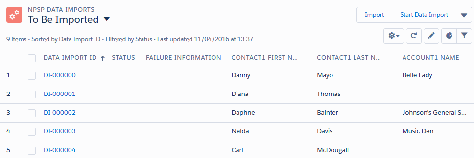

a "$" in the donation field, leaving a leading space like " Smith," or leaving out an "@" in an email address

will cause import errors. Make sure that every single row in your spreadsheet is cleaned and ready for

import.

Look good to go? Do a Dry Run to make sure your data will import successfully. See Verify Your Upload

with Dry Run for more information.

Finalize NPSP Import

Use Dry Run to verify the records you want to import, process the import, troubleshoot common import

errors, and delete import records after you're done with them.

Verify Your Upload with Dry Run

Once you import records into NPSP, you can't hit the undo button. And that can be problematic if you

accidentally import records that you had previously imported, resulting in duplicate records in your

org. It can also be problematic if the wrong record is matched and you've updated it with data from a

different record. Doing a dry run allows you to see if there are any potential matches before you

import.

Process Your Import

Use NPSP Data Importer to send your data in the NPSP Data Import staging object to target objects

such as Account, Contact, and Opportunity.

Delete Imported Records

After you've successfully imported your records, you can optionally reduce data storage by deleting the

intermediate data in the NPSP Data Import object. Deleting the intermediate data in the NPSP Data

Import object does not delete your new Account, Contact, or Opportunity donation records.

Troubleshoot NPSP Data Importer Errors

Learn how to find and fix NPSP Data Import errors.

Verify Your Upload with Dry Run

Once you import records into NPSP, you can't hit the undo button. And that can be problematic if you

accidentally import records that you had previously imported, resulting in duplicate records in your org. It

can also be problematic if the wrong record is matched and you've updated it with data from a different

record. Doing a dry run allows you to see if there are any potential matches before you import.

Do a Dry Run

A dry run goes through the Contact1, Account1, Contact2, Account2, Home Address, and Donations

and identifies potential matches, but doesn't actually process the records into your org.

Resolve Dry Run Errors

After the dry run completes, the summary page lists how many records were processed and any errors

encountered.

316

Do a Dry Run

A dry run goes through the Contact1, Account1, Contact2, Account2, Home Address, and Donations and

identifies potential matches, but doesn't actually process the records into your org.

Note A dry run only looks at Donations that are open Opportunities and unpaid Payments; it

doesn't include Closed/Won Opportunities.

You can do a dry run on all uploaded records that haven't been successfully imported yet or on a specific

batch.

Note Dry runs look for and attempt to identify matches in existing records, so you should only do a

dry run if you already have records in your org. Read more about configuring batch size and

matching options in Configure NPSP Data Importer Options. If you'd like to save these configuration

options for future imports, see Batch Import Overview.

11.. To do a dry run on all uploaded records that haven't been successfully imported yet:

aa.. In the NPSP Data Imports tab, go to the To Be Imported list view.

bb.. Click Start Data Import.

22.. To do a dry run on a specific batch (see Batch Import Overview for more information):

aa.. From the App Launcher, click NPSP Data Import Batches.

bb.. Find the batch you want to put through a dry run and click the Batch Name.

cc.. Click Process Batch.

33.. On the summary page, click Begin Dry Run.

317

You can monitor progress on the status page as the dry run proceeds; it may take a few minutes for

the import to start.

Important Leave this tab open until the dry run finishes so you can see the detailed results.

44.. Wait for the status page to show a status of Completed and a summary of the results.

If the status page shows a green Completed status, you're ready to Process Your Import. An orange Error

318

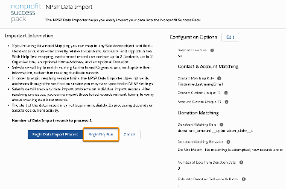

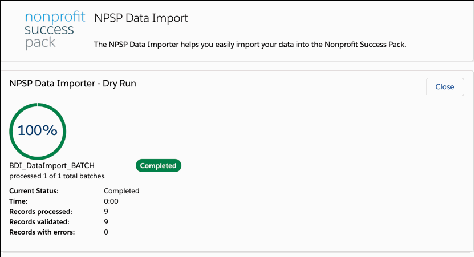

status means you need to Resolve Dry Run Errors.

Resolve Dry Run Errors

After the dry run completes, the summary page lists how many records were processed and any errors

encountered.

To review and resolve these errors:

11.. Click Close to return to either the NPSP Data Imports tab (if you started the dry run from the To Be

Imported list view) or the batch record.

22.. Dry run records have two possible statuses: Dry Run - Validated or Dry Run - Error. Use the list views

with these names to review the records that were part of the dry run. From there, you can drill down

into a record to see more information.

319

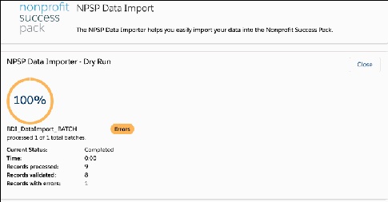

Within a record, you'll see the overall status and the different Import Statuses for each item the dry

run tried to match against.

••

Dry Run - Matched

••

Dry Run - Matched None

••

Dry Run - Best Matched Used (used for Donations only)

••

Dry Run - Matched by Id (used for Donations only)

••

Ignored (used only for Addresses)

If your dry run had errors, you'll also see them in the Import Status fields.

For example, in this record the overall status is Dry Run - Error because even though the Contact1 was

matched, there was an error with the Donation Opportunity.

320

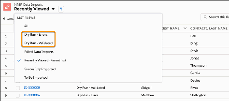

If you scroll down to the Opportunity and Payment sections, you also see the specific errors in the

Import Status fields.

321

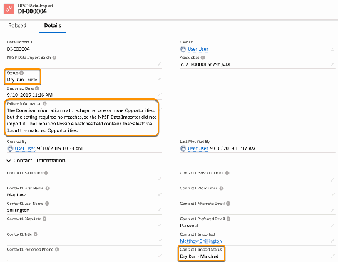

After you've resolved all of your errors, do another Dry Run. If the status page shows a green Completed

status, you're ready to process your import!

Process Your Import

Use NPSP Data Importer to send your data in the NPSP Data Import staging object to target objects such

as Account, Contact, and Opportunity.

Run the NPSP Data Importer tool to bring data from the NPSP Data Import custom object into your

Salesforce objects.

Note For Opportunities that don't include a Stage, the field will use the value set in Opportunity

Stage When Fully Paid. Learn more about this NPSP setting in Set Opportunity Stage for When Fully

Paid.

11.. On the NPSP Data Imports tab, make sure that you select the To Be Imported List View.

22.. Click Import All Data Import Records or Import Selected Data Import Records.

33.. Review the summary page.

322

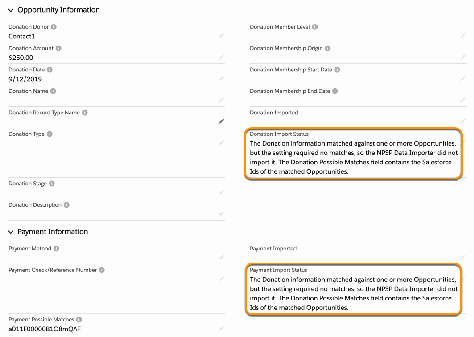

aa.. Look at the number of records that Salesforce will process.The importer always attempts to process

all NPSP Data Import records that don't have an "Imported" status, including all records that have a

"Failed" status. (Import isn't limited to the records displayed in the To Be Imported view.)

bb.. If you want to change the batch process size or rules used to match duplicate records, click Edit,

change the default configuration options, then click Save. See Configure NPSP Data Importer

Options for details. (Is this an import you'll do often? Save these configuration options for future

imports. Check out Batch Import Overview to learn more.)

Note If you included a Salesforce ID in a Contact Imported field, the ID will be used for

matching regardless of your selection in the Contact Matching Rule field.

44.. Click Begin Data Import Process.

You can monitor progress on the status page as the import proceeds; it may take a few minutes for the

import to start.

Important We recommend you leave this tab open until the import finishes so that you can see

the detailed results.

55.. Wait for the status page to show a status of Completed and a summary of the results.

323

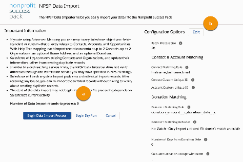

66.. Click Close to return to the NPSP Data Imports tab.

77.. If import failed for a record, check that record's Failure Information field to see the error. It may have

failed because of the order in which the objects where processed, and you may be able to correct the

issue by processing the failed records again. For more help with errors, post a question to our online

community.

Important If you set the Donation Matching Behavior (see Donation Matching Options for more

info) to either No Match, Single Match, or Best Match and the Data Importer can't match

against an existing Opportunity or Payment, the status of the Data Import will show "Failed."

However, any associated Account or Contact from the Data Import will still be created. You can

evaluate the Opportunity or Payment that failed and rerun the Data Importer.

88.. Spend some time in Salesforce checking where your imported data landed. Make sure NPSP created

the right types of records and the information in the individual CSV cells went to the right Salesforce

fields.

Note If your CSV data didn't populate all of the fields you expected in the NPSP Data Import

records, you may have run into a Data Import Wizard limitation. Please see this Data Import

Wizard Known Issue for more information. Delete any columns you aren't using in your import to

get around this limitation. If you'd like to import more than 65 columns, use an API-based import

tool such as Salesforce Data Loader.

Once your users start working with your new records, you may not need to keep the NPSP Data Import

records. See Delete Imported Records for more information.

Delete Imported Records

After you've successfully imported your records, you can optionally reduce data storage by deleting the

324

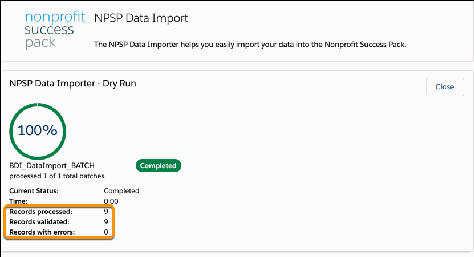

intermediate data in the NPSP Data Import object. Deleting the intermediate data in the NPSP Data

Import object does not delete your new Account, Contact, or Opportunity donation records.

If you're entering batches of gifts using Gift Entry, we DO NOT recommend using the Delete All Data

Import Records or Delete All Imported Records actions. Learn more in Delete Gift Entry Records.

Make sure your data was imported successfully before you delete data in the NPSP Data Import object.

11.. Click the App Launcher ( ).

22.. In the All Items section, click NPSP Data Imports.

33.. Select a view of your imports.

44.. Click one of the following:

••

Delete All Data Import Records to delete all data in the NPSP Data Import object, regardless of its

import success status.

••

Delete Imported Data Import Records to delete data in the NPSP Data Import object that was

successfully imported.

Note Depending on how Actions are organized in your page layout, you may need to click in

order to see the Delete options.

Note If you see an Insufficient Privileges error when trying to delete, you Admin needs to:

••

Add your profile to the Enabled profiles for the BDI_DataImportDeleteBTN Visualforce

page. Access the list of Enabled Profiles in Setup by searching for Visualforce Pages. Next

to BDI_DataImportDeleteBTN , click Security.

••

Grant your profile Delete access for the NPSP Data Imports object.

55.. You see a count of the records you're about to delete. If you're ready to delete them, click Mass

Delete.

Deleted records are sent to the Recycle Bin.

Note If you see this error message: npsp:Too many DML rows: 10001 , it means you have more

than 10,000 records to delete. If this is the case, use the Salesforce Data Loader to delete the

records. Learn more in Perform Mass Deletes.

325

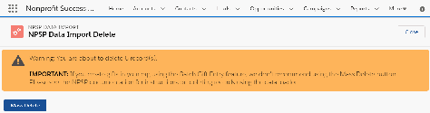

Troubleshoot NPSP Data Importer Errors

Learn how to find and fix NPSP Data Import errors.

Overview

Understand why errors can occur when you use NPSP Data Importer.

Error Examples

There are many reasons why failures occur.

View Data Import Wizard Errors

When using the Data Import Wizard to import your data into NPSP, errors are captured in Bulk Data

Load Jobs results files and error notification emails from Salesforce.

View Failed NPSP Data Import Records

You can find details about errors that occur during NPSP Data Importer processing on failed NPSP

Data Import records. These errors aren't logged in the NPSP Error Log.

Still Need Help?

Learn how to contact Salesforce Support.

Overview

Understand why errors can occur when you use NPSP Data Importer.

Note Learn more about the NPSP Data Importer and Advanced Mapping in How NPSP Data

Importer Processes Data.

errors occur when:

•

can't create NPSP Data Import records.

•

NPSP Data Importer can't create or update the target records (Accounts, Contacts, etc.). NPSP

captures these errors in the Status and Failure Reason fields on as NPSP Data Import records. The

NPSP Data Importer process can also partially fail, meaning that it creates some, but not all, NPSP

records. Learn more in View Failed NPSP Data Import Records.

Error Examples

There are many reasons why failures occur.

Let's look at some example errors and their causes:

Cause Error Result Error Location Example

Error

Message

Before Insert trigger on the Salesforce couldn't create NPSP Data Import record npsp.TDTM_

Opportunity object the Opportunity and Opportunity:

326

Cause Error Result Error Location Example

Error

Message

Payment record execution of

AfterInsert

caused by:

System.DmlE

xception:

Insert failed.

First

exception on

row 0; first

error:

CANNOT_IN

SERT_UPDAT

E_ACTIVATE

_ENTITY,

oppProcesse

s: execution

of

AfterUpdate

caused by:

System.Final

Exception:

Record is

read-only ():

[] (npsp)

Required custom field on Salesforce couldn't create NPSP Data Import record Required

the Payment object the Payment record (or on screen when using fields are

Gift Entry) missing:cust

om_phone

View Data Import Wizard Errors

When using the Data Import Wizard to import your data into NPSP, errors are captured in Bulk Data Load

Jobs results files and error notification emails from Salesforce.

Learn more in View Bulk Data Load Job Details and Open the result file from Bulk Data Load Job page.

View Failed NPSP Data Import Records

You can find details about errors that occur during NPSP Data Importer processing on failed NPSP Data

Import records. These errors aren't logged in the NPSP Error Log.

327

Failed NPSP Data Import records have a Status value of Failed. This status means that the NPSP Data

Importer either completely or partially failed to process the record. Learn more about why the record

failed in the record's Failure Information field.

CCrreeaattee aanndd SSuubbssccrriibbee ttoo aa FFaaiilleedd NNPPSSPP DDaattaa IImmppoorrtt RReeccoorrddss RReeppoorrtt

While you can view NPSP Data Import records individually and with list views, there's no built-in method

for receiving notifications from NPSP when there are failed NPSP Data Import records. To receive

notifications, create and subscribe to a custom report.

11.. Click the Reports tab.

22.. Click New Report.

33.. Search for and select NPSP Data Imports.

44.. Click Continue.

55.. Click Filters.

66.. Click Show me, select All npsp data imports, then click Apply.

77.. In Add filter, search for and select Status.

88.. Select Failed and click Apply.

99.. Click Outline.

1100.. In Add column, search for and select Failure Information.

1111.. Add additional columns to include in the report.

1122.. Click Save & Run.

1133.. Enter a Report Name such as Failed Data Imports.

1144.. Choose a Folder where you'd like to store the report and click Save.

1155.. Next to Edit, click the arrow and select Subscribe.

1166.. Choose a Frequency (we recommend Daily) and a Time.

1177.. Save the report.

According to the frequency you chose, Salesforce sends an email with a report summary and a link to

view the report.

AAnnaallyyzzee FFaaiilleedd NNPPSSPP DDaattaa IImmppoorrtt RReeccoorrddss

Let's look at a failed NPSP Data Import record in detail. In this example, a validation rule on the Payment

328

object prevented NPSP Data Importer from creating or updating one or more records. But how can you

tell which records?

Within an NPSP Data Import record, you'll see Imported and Import Status fields for each record NPSP

Data Importer tried to create or update. When NPSP Data Importer can't create or update a record, the

Imported field is blank and the Import Status describes what happened.

Let's look at the Imported and Import Status fields to understand which records the NPSP Data Importer

successfully processed.

Field Name Field Data Result

Contact1 Imported Donor's Name Successful - NPSP created the

donor's Contact record.

Contact1 Import Status Created Successful - NPSP created the

donor's Contact record.

Household Account Imported Donor's Household Name Successful - NPSP created the

donor's Household Account.

Donation Imported Donation Name Successful - NPSP created the

donation Opportunity record.

Donation Import Status Created Successful - NPSP created the

donation Opportunity record.

Payment Imported Blank Failure - NPSP couldn't create

the donation Payment record.

Payment Imported Status Missing Batch Number Failure - NPSP couldn't create

the donation Payment record.

From this field data we can see that the donor's Contact, Household Account, and Opportunity records

were created, but not the Payment record.

RReessoollvvee aa FFaaiilleedd NNPPSSPP DDaattaa IImmppoorrtt

For this example, you could resolve the issue by disabling or adjusting the validation rule so that it

doesn't execute . For more information see Managing Validation Rules.

Important Once the validation rule no longer prevents NPSP Data Importer from processing

successfully, you must reprocess the previously failed NPSP Data Import records.

To reprocess failed NPSP Data Import records:

329

11.. Open the App Launcher and click NPSP Data Imports.

22.. Select the Failed Data Imports list view.

33.. Click Import All Data Import Records. If you selected some records to import, click Import Selected

Data Import Records.

Note Start Data Import reprocesses all failed Data Import records.

44.. Click Begin Data Import Process.

55.. When the data import process completes, you'll see the results including the number of records

processed, imported, and failed. Click Close to return to the NPSP Data Import tab.

Still Need Help?

Learn how to contact Salesforce Support.

If you’re still , open a support case. See How to Create a Case on Salesforce Help.

NPSP Advanced Options

Advanced NPSP Data Import options including scheduling import batches or using code to customize

the import.

Configure NPSP Data Importer Options

Customize and configure your NPSP Data Importer options for batch size and duplicate record

matching.

Batch Import Overview

The ability to import data in batches can be very useful. Batch Data Import allows you to have different

groups of data import records that you want to process differently, using their own set of unique

configuration options (instead of using the default settings).

Create a Batch

First, you need to define the configuration that will be used on only a selected set of records. To

illustrate an example, we will create a batch for the upcoming event (that we mentioned earlier).

Create NPSP Data Import Records Connected to a Batch

After you create a batch, upload your data import file to create the data import records for the batch.

Process an NPSP Data Import Batch

Learn how to process a batch using NPSP Data Importer and what the different batch statuses mean.

Schedule a Batch

Now that you'll be regularly uploading files, you don't want to worry about manually processing them.

This is really useful for cases like the upcoming event signup example, where you have signups coming

in at different times, and you want to regularly upload the new signups.

Additional Automation Using Custom Apex Code

330

Find out more about additional automation.

Import More Than Two Contacts to a Household at Once

Here's how to import more than two contacts to the same household at once.

Configure NPSP Data Importer Options

Customize and configure your NPSP Data Importer options for batch size and duplicate record matching.

Important These settings apply to every feature and product using NPSP Data Importer including

Gift Entry and Salesforce.org Elevate. If you temporarily adjust the batch process size or matching

rules for a specific operation, be sure to come back and reset them to their previous settings.

Access Global Matching Settings

Here's how to access the global batch size and matching settings for the NPSP Data Importer.

Batch Process Size

This setting determines the number of records processed in each batch. The default is 50 records. For

example, if your import file has 200 records, NPSP Data Importer processes four batches of 50 records

each.

Contact & Account Matching Options

Before you begin matching, make sure that you have a minimum of read access to the records and

field level access to the fields referenced in the matching and duplicate rules.

Donation Matching Options

You should only use donation matching to update an open Opportunity when a Payment comes in.

Important Information about Unique IDs

If Contacts or Accounts in your org have unique, external IDs that reference the same Contacts or

Accounts in another database, you can reference these external IDs when using NPSP Data Importer.

Access Global Matching Settings

Here's how to access the global batch size and matching settings for the NPSP Data Importer.

11.. Open the App Launcher ( ).

22.. Find and select NPSP Data Imports.

33.. Select the To Be Imported list view.

44.. Click Import All Data Import Records.

Note Clicking Import All Data Import Records only opens the import configuration page. No

NPSP Data Importer process begins until you click either Begin Data Import Process or Begin

Dry Run.

Batch Process Size

This setting determines the number of records processed in each batch. The default is 50 records. For

331

example, if your import file has 200 records, NPSP Data Importer processes four batches of 50 records

each.

If NPSP Data Import records fail because of system errors like too much CPU time, reduce the batch

process size and try again.

Contact & Account Matching Options

Before you begin matching, make sure that you have a minimum of read access to the records and field

level access to the fields referenced in the matching and duplicate rules.

For more information, go to the Impact of User Access on Rules section in Things to Know About

Duplicate Rules.

These configuration options are for matching Accounts or Contacts:

Important In order to see values in either the Contact Custom Unique ID or Account Custom

Unique ID fields, you must first create a custom Unique ID field and then create two corresponding

Data Import fields with specific values. If you don't create these fields properly, you will get an error.

For more information, see Important Information about Unique IDs.

•

Contact Matching Rules—Specifies how to match Contacts in NPSP Data Import records against

existing Contacts. The rules specify which set of Contact fields to use to find matches. For example:

First Name, Last Name, and Email or First Name, Last Name, and Phone. Some specific things to keep

in mind:

- The matching rules attempt to match on any NPSP phone or email field.

- Name matching uses exact string matching, but is case insensitive. For example, "Tom Smith" would

not match to "Thomas Smith", but "thomas smith" would match.

- Phone number matching uses exact match only. For example, if the phone number's format is

123-345-4567, then you must use that format, not 123.345.4567 or 1233454567.

•

Contact Duplicate Rules—Matches based on the active Duplicate Rules for the Contact object, in the

order set by your Admin in Setup | Duplicate Management. For help setting up duplicate rules, go to

Customize Duplicate Rules. Some things to keep in mind:

- The logic uses the highest ranked match out of all returned matches for all active rules.

- Set up your Contact Duplicate Rules to only use Contact fields that are mapped to Contact 1,

Contact 2 or Home Address (which maps to the Mailing Address fields on the Contact object).

- Perform a dry run of the import to determine if your rules are sufficiently strict and working as

expected.

- If you enabled state and country/territory picklists AND you wish to use state or country as part of

one of your Contact Duplicate Rules, make sure to use the full name in the Home State/Province

and Home Country fields on the Data Import record.

•

Contact Custom Unique ID—Optional ID field used for matching Contacts. This field can be any

custom text or numeric field that uniquely identifies a Contact, and is used for matching Contacts in

addition to the method specified in Contact Matching Rule. This option is useful if your external data

source had a unique identifier for each Contact record. For example, you could add a custom field on

332

Contact, such as MyOldID, and matching fields for Contacts in the NPSP Data Import object

(Contact1_MyOldID, Contact2_MyOldID).

Note If you're matching based on Salesforce ID, you don't have to set anything here. Just map

data to the Imported fields, and use a Contact Matching Rule.

•

Account Custom Unique ID—Optional ID field used for matching Accounts. This field can be any

custom text or numeric field that uniquely identifies an Account, and is used for matching Accounts in

addition to matching by Account Name. This option is useful if your external data source had a unique

identifier for each Account record. For example, you could add a custom field on Account, such as

MyOldID, and matching fields for Accounts in the NPSP Data Import object (Account1_MyOldID,

Account2_MyOldID).

Donation Matching Options

You should only use donation matching to update an open Opportunity when a Payment comes in.

These configuration options are for matching Donations (Opportunities) or Payments:

•

Update the Stage of an Opportunity to Closed/Won

•

Mark an open Payment as Paid

•

Donation Matching Rule—Specifies the set of Donation fields to use for matching against existing

Opportunities and/or Payments. If no fields are selected, the Donation Date and Donation Amount

fields are used. The Donation fields specified must map to either Opportunity fields or Payment fields

(with the exception of Donation Amount, which maps to both Opportunity.Amount and

Payment.Payment Amount, and Donation Date which maps to Opportunity.CloseDate and

Payment.Scheduled Date). If the Data Import record has the Donation Imported field or Payment

Imported field populated, those fields will always be used for the match.

Note If you're using multiple currencies in your org and you want to match Opportunities, be sure

to select the CurrencyIsoCode field as one of the Donation Matching Rule fields. This ensures that

the proper currency is used when attempting to match Opportunities. If you created your own

custom field and set up a mapping for multiple currencies, select that field instead.

•

Donation Matching Behavior—Defines how the Data Importer should handle matching Opportunities

and Payments. Must be one of the following values:

- Do Not Match—No matching is attempted; new records are created.

- No Match—Only import a record if it doesn't match an existing record.

- Single Match—Only import a record if it matches a single existing record.

- Single Match or Create—Import a record if it matches a single existing record; create a new record if

no single match found

- Best Match—Only import a record when it matches at least one existing record, and update the best

matched record.

- Best Match or Create—Import a record if it matches an existing record; create a new record if no

match found.

Important If you choose No Match, Single Match, or Best Match and the Data Importer can't

333

match against an existing Opportunity or Payment, the status of the Data Import will show

"Failed." However, any associated Account or Contact from the Data Import will still be created.

You can evaluate the Opportunity or Payment that failed and rerun the Data Importer.

•

Number of Days from Donation Date—Specifies the number of days to consider (from the Donation

date) when looking for a matching Opportunity or Payment. The Data Importer will use the matching

Opportunity or Payment that falls within the number of days specified AND is closest to the Donation

Date.

•

Donation Matching Implementing Class—The full developer name of an Apex class that implements

the BDI_IMatchDonations interface, in case you are working with a developer who would like to alter

this behavior. When left empty, the NPSP default implementation is used.

•

Calculate Donation Rollups with Batch—When checked, NPSP calculates donor statistics when

donations are processed as part of an NPSP Data Import Batch. If unchecked (the default), donor

statistics are only calculated during the default nightly Scheduled Job. Note that selecting this

checkbox may slow down processing of the batch.

Note Salesforce.org Elevate doesn't use these donation (Opportunity) matching rules. Instead,

Elevate matches Opportunities using the Elevate Id only.

Important Information about Unique IDs

If Contacts or Accounts in your org have unique, external IDs that reference the same Contacts or

Accounts in another database, you can reference these external IDs when using NPSP Data Importer.

Field naming is critical when you're creating corresponding Unique ID fields. In order to see any values in

the Contact Custom Unique ID or Account Custom Unique ID fields in the Data Importer Configuration

options, the field you want to map must be marked as Unique and External ID. Additionally, for Unique

ID fields, you must create two corresponding fields, one for Contact1 and one for Contact2 (or Account1

and Account2) and you must name them properly. The corresponding fields in the NPSP Data Import

object should NOT be marked as Unique and External ID.

For example, say you've created a custom Unique ID field on Contacts called Reference ID with an API

name of Reference_ID__c that you want to use for matching Contacts during data import. You'll need

to create two corresponding NPSP Data Import fields using this exact format :

Field for Contact1, the primary Contact

Field Label: Contact1 <Fieldname> (Example: Contact1 Reference ID)

Field Name: Contact1_<Fieldname> (Example: Contact1_Reference_ID)

API Name: Contact1_<FieldName>__c (Example: Contact1_Reference_ID__c)

Field for Contact2, the secondary Contact

Field Label: Contact2 <Fieldname> (Example: Contact2 Reference ID)

334

Field Name: Contact2_<Fieldname> (Example: Contact2_Reference_ID)

API Name: Contact2_<FieldName>__c (Example: Contact2_Reference_ID__c)

Here is an image showing the custom Contact field, Reference ID, and the corresponding NPSP Data

Import field, Contact1 Reference ID, with correct Field Label and API Name. The image also shows the

Contact field Reference ID is marked as a Unique, External ID field, but the NPSP Data Import field isn't

set as a Unique, External ID field.

Note Creating only one corresponding field (instead of two) will result in an error.

When processing a record, NPSP Data Importer first attempts to match on the External ID. If a match

isn't found, NPSP Data Importer tries to match on a Contact's Last Name. For Accounts without a

matching External ID, NPSP Data Importer tries to match on Account Name.

Batch Import Overview

The ability to import data in batches can be very useful. Batch Data Import allows you to have different

groups of data import records that you want to process differently, using their own set of unique

configuration options (instead of using the default settings).

In addition, if you set up and activated a batch number format, all Opportunities and Payments

associated with this batch will include the batch number in the Batch Number field. Learn more in

Configure Batch Numbers for Donations.

335

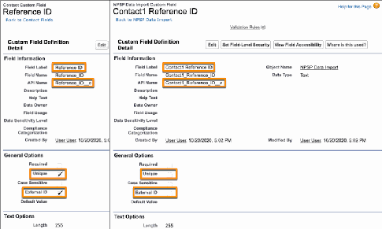

In these articles, we'll tell you how to set up the Batch Data Import feature, give you a sample use case,

and show you how to process a batch data import, both manually and automatically using a scheduled

job. These are the articles about using the Batch Data Import feature:

•

Create a Batch

•

Create NPSP Data Import Records Connected to a Batch

•

Process an NPSP Data Import Batch

•

Schedule a Batch

If this is your first time using NPSP Data Import Batches, take a moment to run through the instructions

in Configure NPSP Data Importer.

Sample Use Case

Each time you run the NPSP Data Importer, all unprocessed records are evaluated using the default

configuration settings. So, if you have records that require different matching or other configurations,

you have to reset the configuration options each time and ensure only the appropriate records are

ready to be imported.

Sample Use Case

Each time you run the NPSP Data Importer, all unprocessed records are evaluated using the default

configuration settings. So, if you have records that require different matching or other configurations, you

have to reset the configuration options each time and ensure only the appropriate records are ready to

be imported.

The NPSP Data Import tab works well if you're importing a CSV file with records from the same source

that require the same Contact and Donation matching, and you want to process all those records right

away.

But now, imagine you have an event for which you're importing spreadsheets of signups on a regular

basis. You want to match these records by first name, last name, and email address. You also have a

different integration for which you're frequently importing opportunities that match against a specific

Contact Unique ID field and you want to be sure that they always match existing Opportunities (so you're

not creating duplicate records). On top of all that, it would be so helpful to automatically process those

records without having to reset the configuration. It is very time consuming to have to adjust the default

configuration options and process the records each time you import new records for these two very

different scenarios.

With the NPSP Data Import Batch object, you can create a batch for importing the signup spreadsheets

with the configuration options set to match against the first name, last name, and email fields on a

Contact. Then, you can create another batch for your Opportunities with the configuration options set to

match against the Contact Unique ID field and Single Match Donation Matching rule, and set up the

batch to process automatically using a scheduled job. Then, when you want to import records, you just

have to select the right batch record for that row in your spreadsheet, and the configuration options are

automatically set to the right values when that batch is processed.

336

Create a Batch

First, you need to define the configuration that will be used on only a selected set of records. To illustrate

an example, we will create a batch for the upcoming event (that we mentioned earlier).

Note You only need to complete this configuration task if your org uses the Lightning Experience

user interface.

To create a new batch in NPSP:

11.. Click the App Launcher ( ).

22.. Click NPSP Data Import Batches.

33.. Click New.

44.. Fill in the required fields and any configuration options you want to apply specifically to this batch.

When you select this batch in the NPSP Data Importer, the configuration options are updated to show

the values you select here.

337

338

••

Batch Name—(1) The name must be unique in your org. Be sure to use a descriptive name, since

you will be searching for and selecting it when you perform your data import. (Tip: If you're using a

scheduled job, you may want to name your batches "Company name - date" so that it's easier to find

the right batch.)

••

Batch Description—(2) An optional description of the batch.

••

Batch Process Size—(3) The number of NPSP Data Import records you want Salesforce to process in

each batch. The default is 50 records.

••

Process Using Scheduled Job—(4) When checked, the batch will be processed each day based on

the schedule outlined for the scheduled job. See Schedule a Batch for more details.

••

Contact Matching Rule—(5) Specifies how to match Contacts in records against existing Contacts.

The rules specify which set of Contact fields to use to find matches. For example: First Name, Last

Name, and Email or First Name, Last Name, and Phone. (Keep in mind that the phone number

format has to be an exact match. For example, if all of the phone numbers in your database are

formatted as 123-345-4567, then you must use that format, not 123.345.4567 or 1233454567.)

NPSP Data Import

••

Contact Custom Unique ID—(6) This field can be any custom text or numeric field that uniquely

identifies a Contact, and is used for matching Contacts in addition to the method specified in

Contact Matching Rule. This option is useful if your external data source has a unique identifier for

each Contact record. For example, you could add a custom field on Contact, such as MyOldID, and

matching fields for Contacts in the NPSP Data Import object (Contact1_MyOldID,

Contact2_MyOldID).

••

Account Custom Unique ID—(7) This field can be any custom text or numeric field that uniquely

identifies an Account, and is used for matching Accounts in addition to matching by Account Name.

This option is useful if your external data source had a unique identifier for each Account record. For

example, you could add a custom field on Account, such as MyOldID, and matching fields for

Accounts in the NPSP Data Import object (Account1_MyOldID, Account2_MyOldID).

••

Donation Matching Rule—(8) Specifies the set of Donation fields to use for matching against

existing Opportunities and/or Payments. If no fields are selected, the Donation Date and Donation

Amount fields are used. The Donation fields specified must map to either Opportunity fields or

Payment fields (with the exception of Donation Amount, which maps to both Opportunity.Amount

and Payment.Payment Amount, and Donation Date which maps to Opportunity.CloseDate and

Payment.Scheduled Date).

••

Donation Matching Behavior—(9) Defines how the Data Importer should handle matching

Opportunities and Payments. Must be one of the following values:

•• - Do Not Match—No matching is attempted; new records are created.

•• - No Match—Only import a record if it doesn't match an existing record.

•• - Single Match—Only import a record if it matches a single existing record.

•• - Single Match or Create—Import a record if it matches a single existing record; create a new record

if no single match found.

•• - Best Match—Only import a record when it matches at least one existing record, and update the

best matched record.

•• - Best Match or Create—Import a record if it matches an existing record; create a new record if no

match found.

Important If you choose No Match, Single Match, or Best Match and the Data Importer can't

339

match against an existing Opportunity or Payment, the status of the Data Import will show

"Failed." However, any associated Account or Contact from the Data Import will still be created.

You can evaluate the Opportunity or Payment that failed and rerun the Data Importer.

••

Number of Days from Donation Date—(10) Specifies the number of days to consider (from the

Donation date) when looking for a matching Opportunity or Payment. The Data Importer will use

the matching Opportunity or Payment that falls within the number of days specified AND is closest

to the Donation Date.

••

Calculate Donation Rollups with Batch—(11) When checked, NPSP calculates donor statistics when

donations are processed as part of an NPSP Data Import Batch. If unchecked (the default), donor

statistics are only calculated during the default nightly Scheduled Job. Note that selecting this

checkbox may slow down processing of this batch.

••

Donation Matching Implementing Class—(12) The full developer name of an Apex class that

implements the BDI_IMatchDonations interface, in case you are working with a developer who

would like to alter this behavior. When left empty, the NPSP default implementation is used.

••

Post Process Implementing Class—(13) The full developer name of an Apex class that implements

the BDI_IPostProcess interface, in case you are working with a developer who would like to alter this

behavior. For more information, see Additional Automation Using Custom Apex Code.

55.. Click Save.

340

341

Next step: Create NPSP Data Import Records Connected to a Batch.

Create NPSP Data Import Records Connected to a Batch

After you create a batch, upload your data import file to create the data import records for the batch.

Note Special thanks to community member Eric Grenfell-Muir for helping to improve this article.

For our example, we'll use a spreadsheet of people who signed up for the upcoming event.

11.. Create your data import file (csv).

22.. Make sure in your data import file, you have a column called NPSP Data Import Batch. For each

row in your spreadsheet that you want to include in that batch, enter the batch's Salesforce ID, or you

can enter the batch name if you're using an Import tool that supports matching a record by its name,

such as the Data Import Wizard.

33.. Upload the CSV into the NPSP Data Import object by following the instructions in the Upload Data

from the Template and Process Your Import articles. If you're using the Data Import Wizard, select

Salesforce.com ID in the Which NPSP Data Import Batch field in your file do you want to match

against to set the NPSP Data Import Batch lookup field?

If you need more information on creating your CSV file and importing records, see Transfer Your Data to

the Template, Upload Data from the Template, Process Your Import.

If your batch setup is complete, see Process an NPSP Data Import Batch.

Process an NPSP Data Import Batch

Learn how to process a batch using NPSP Data Importer and what the different batch statuses mean.

Process Batch

Now that you have records associated with your batch, you can process them so that they're imported

into your organization. This is the step that will bring the data from your spreadsheet into NPSP.

A Word About Batch Status

In addition to viewing the status of each record within a batch, you can view the status of the entire

batch in the Batch Status field.

Process Batch

Now that you have records associated with your batch, you can process them so that they're imported

into your organization. This is the step that will bring the data from your spreadsheet into NPSP.

342

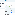

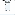

Note You can do a dry run of your batch to check for potential duplicates or errors before

processing. Keep in mind that when you validate a batch record using dry run, the batch record itself

won't be updated with Success and Failure counts. Those values are only updated upon actual

import of records. For more information on performing a dry run, see Do a Dry Run.

Keep in mind that when you process a batch, it only processes records for that particular batch. It doesn't

process records for any other Data Import Batch.

11.. In the App Launcher, click NPSP Data Import Batches.

22.. Find your batch and click the Batch Name.

33.. Click Process Batch.

44.. Confirm Configuration Settings. You can click Edit if you need to update the settings.

Note If you edit settings while the Batch is selected and save, it updates the default configuration

options for that batch.

55.. Click Begin Data Import Process.

66.. Wait until the confirmation page shows that the import completed successfully.

343

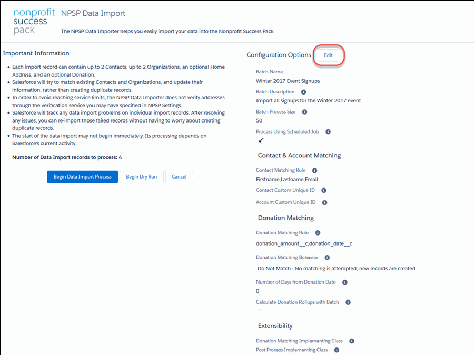

77.. Close the page to return to the NPSP Data Import Batches tab. Review your imported records on the

related list on the batch record.

After the records for this batch are processed, the Last Processed On field is updated with the date and

time. The Records Successfully Processed and Records Failed fields are also updated accordingly. Each

time the batch is processed, these fields are overwritten with the new date/time and record counts. If

you set up and activated a batch number format, all Opportunities and Payments associated with this

batch will include the batch number in the Batch Number field. Learn more in Configure Batch Numbers

for Donations.

Tip Enable field history on the Last Processed On, Records Successfully Processed, and Records Failed

fields, so that you have a history of batch results (since these values are overwritten each time a batch

runs.) You can enable field history in the Object Manager in Setup.

344

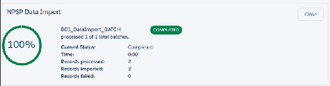

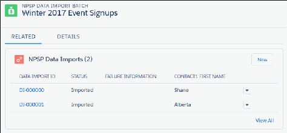

If you'd like to run this batch on a recurring basis, see Schedule a Batch.

A Word About Batch Status

In addition to viewing the status of each record within a batch, you can view the status of the entire

batch in the Batch Status field.

345

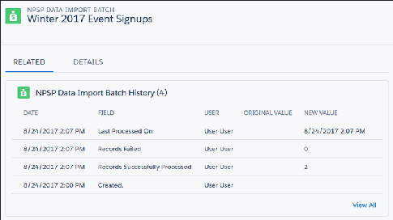

The Batch Status is based on the Import Status of the records within the batch. The values in Batch

Status are:

Open

NPSP Data Importer hasn't processed the records and sent the information to the target objects.

Completed

NPSP Data Importer has processed all of the records in the batch.

Failed - Needs Review

One or more records in the batch failed to process.

You can add your own values to the Batch Status picklist. For example, if batches need to be reviewed

before processing, you may want values like Ready for Review or Ready to Process. NPSP will overwrite

any custom values to Completed or Failed - Needs Review when the batch is processed.

Schedule a Batch

Now that you'll be regularly uploading files, you don't want to worry about manually processing them.

This is really useful for cases like the upcoming event signup example, where you have signups coming in

at different times, and you want to regularly upload the new signups.

You can automatically process an NPSP Data Import Batch using a scheduled job. The batch will be

processed each day based on the schedule outlined for the scheduled job. After the batch processes, the

date and time as well as the results of the batch process, are recorded on the NPSP Data Import Batch

record.

Note It's important to keep in mind that all batches that are scheduled will run at the same time (as

part of one batch job)

11.. In the App Launcher, click NPSP Data Import Batches.

22.. Find your batch and click on the Batch Name.

33.. On the detail page, click Edit.

44.. Select the Process Using Scheduled Job checkbox.

346

55.. Click Save. The batch will be processed based on the scheduled job time for the NPSP 09 - Data

Import Batch Processing job. To find out what time that job will run, go to Setup and search for

Scheduled Jobs. For information on changing the scheduled job time, see Edit or Reschedule NPSP

Scheduled Jobs.

After the job runs and the records for this batch are processed, the Last Processed On field is updated

with the date and time. The Records Successfully Processed and Records Failed fields are also updated

accordingly.

347

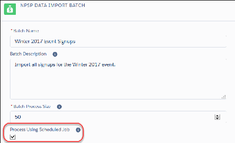

Recommendations:

•

If you'd like to be notified of the results of the processed batch, create a workflow rule or process with

an email template based on an update to the Last Run field. That way, you can easily identify and fix

any failures.

•

If you want a quick way to isolate records that failed for that processed batch, clone the "Failed Data

Imports" list view on the NPSP Data Import object and add a filter for NPSP Data Import Batch equal

to Batch Name.

Additional Automation Using Custom Apex Code

Find out more about additional automation.

Important This feature requires Apex coding and should only be used by a developer.

Post Processing

When you're importing data records, you may have some post processing that would be easier to do

with code because you can process higher volumes and perform more complex procedures.

Sample Code

This sample code shows a simple post-processing scenario where a "Spouse" relationship is

automatically created between Contact1 and Contact2 (assuming the contacts are newly-created).

Post Processing

When you're importing data records, you may have some post processing that would be easier to do with

348

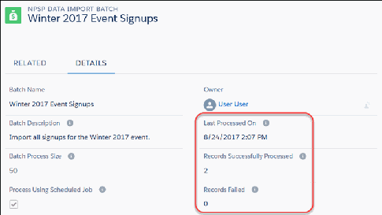

code because you can process higher volumes and perform more complex procedures.

NPSP includes an interface that you can customize to perform post-processing functionality on your data

import records. The interface, BDI_IPostProcess , includes one method called process . To take

advantage of this functionality, you'll need to write an Apex class that implements the interface and its

method. You then specify the Apex class in the Post Process Implementing Class field in either the NPSP

Data Import configuration options or in the NPSP Data Import Batch configuration options.

After NPSP processes the number of records you specify as the batch size (in configuration options),

NPSP will call your class and perform any post processing specified in the class.

Sample Code

This sample code shows a simple post-processing scenario where a "Spouse" relationship is automatically

created between Contact1 and Contact2 (assuming the contacts are newly-created).

This is a working example, just to give you an idea of what is possible. We encourage you to write a post

processing class that performs more complex tasks.

global with sharing class MyPostProcess implements npsp.BDI_IPostProcess {

global void process(npsp.BDI_DataImportService bdi) {

List<npe4__Relationship__c> listRel = new List<npe4__Relationship__c>();

for (npsp__DataImport__c di : bdi.listDI) {

// create a relationship if both c1 and c2 are specified

// and they are newly created contacts

if (di.npsp__Contact1Imported__c != null && di.npsp__Contact2Importe

d__c != null &&

di.npsp__Contact1ImportStatus__c == label.npsp__bdiCreated && di.n

psp__Contact2ImportStatus__c == label.npsp__bdiCreated) {

listRel.add(new npe4__Relationship__c(

npe4__Contact__c = di.npsp__Contact1Imported__c,

npe4__RelatedContact__c = di.npsp__Contact2Imported__c,

349

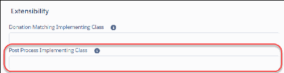