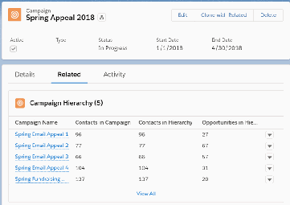
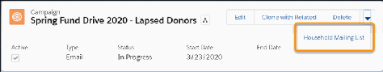
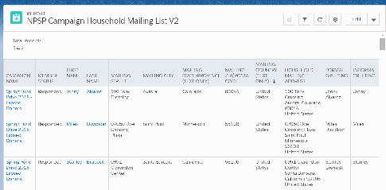
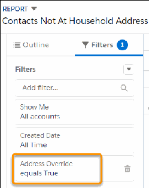
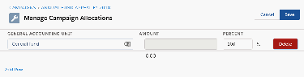

The reports and dashboards included with PMM make it easy to report on the status and progress of

individuals, segments, programs, and service deliveries so that you can track your daily work, evaluate

program performance, and report to your donors.

When you use PMM with NPSP, you can use Household Accounts and Relationships to deepen your

understanding of your constituents, not only for fundraising but also for mission delivery. For example, if

your organization provides educational assistance to at-risk youth, your development staff can use the

Household Account and Relationship objects to identify and track donor prospects, and your program

staff can use those same objects to track a student’s learning support network.

With NPSP and PMM you get visibility into:

•

Fundraising and donor tracking

•

Program management and constituent tracking

•

Mission delivery performance

For more information and to get started with PMM, see Program Management Module Documentation.

NPSP Manage Campaigns

How Campaigns work in NPSP, managing mailing list labels, and setting up GAU Allocations on

Campaigns.

What are Campaigns and How Do They Work?

Nonprofits use Campaigns to plan and track fundraising appeals, solicitations, events, advocacy

campaigns, and other outreach activities.

Create Deduplicated Mailing Lists from a Campaign

Although we live in the digital age, direct mail remains an important part of fundraising and outreach

activities. But sending materials through the mail isn't exactly cheap and you really don't want to send

the same piece of mail more than once to a given address. Donors want to see that your organization

is effective and streamlined, and doesn't waste dollars on sending unnecessary mailings.

Generate Labels for Direct Mail—For Organizations Or Contacts

Generate mailing labels for Household or Organization addresses.

Campaigns for Fundraising Implementation Guide

This guide is intended to help nonprofit administrators plan and implement Campaigns and

Campaign hierarchies to support fundraising. Learn how Campaigns can be used to track fundraising

appeals, event invitations, and key performance metrics.

Create Allocations for Campaigns

Find out more about creating allocations for campaigns.

What are Campaigns and How Do They Work?

Nonprofits use Campaigns to plan and track fundraising appeals, solicitations, events, advocacy

605

campaigns, and other outreach activities.

What is a Campaign?

The word Campaign has many possible meanings for nonprofit and higher education organizations.

For example, a capital campaign is a major fundraising effort to support construction of a new facility.

Organizations with a strong programmatic element often describe their initiatives, such as protecting a

new wilderness area, as a campaign. Marketers see a campaign as a way to reach out to constituents

to build awareness and ask for support.

How do Campaigns Work?

Campaigns have special properties in Salesforce that make them a useful tool for many different

scenarios.

Campaign Use Cases

Campaigns are such a versatile tool. It's fantastic that one object can do so much!

Considerations when using Campaigns

Here are some important things to keep in mind when setting up and using Campaigns.

Nonprofit Salesforce How-To Series Videos

Watch the Nonprofit Salesforce How-To Series videos about managing Campaigns.

Resources for Further Information

Learn more about implementing Campaigns.

What is a Campaign?

The word Campaign has many possible meanings for nonprofit and higher education organizations. For

example, a capital campaign is a major fundraising effort to support construction of a new facility.

Organizations with a strong programmatic element often describe their initiatives, such as protecting a

new wilderness area, as a campaign. Marketers see a campaign as a way to reach out to constituents to

build awareness and ask for support.

In Salesforce, you can use a Campaign to represent all of these scenarios. Nonprofit and higher

education organizations use Campaigns in these and many other creative ways. At a basic level,

Campaigns group people together in your database so that you can ask them to take some sort of action

and track the results.

Campaigns combine several sources of data in one place to make it easier to analyze the results of a call

to action. They are excellent at summarizing information related to constituents (Leads or Contacts) and

money (Opportunities). For example, a Campaign could summarize the number of people targeted in a

fundraising appeal, how many responded, and the amount of money raised. A different Campaign could

summarize the number of people invited to an event, attendance, cancellations, and a count of those

who made a donation at the event.

Let’s take a closer look at how Campaigns work and the details of some common use cases.

606

How do Campaigns Work?

Campaigns have special properties in Salesforce that make them a useful tool for many different

scenarios.

Here are four properties and why they are important.

Campaigns Group Leads and Contacts Together

You might regularly work with both Leads and Contacts as part of your constituent outreach and

Campaigns make it easy to complete the following tasks.

Campaigns Track Opportunities Too

Campaigns are excellent at summarizing information–like number of attendees or amount of money

raised—because they show the relationship between people and contributions.

Campaigns Have Hierarchy

If you have several courses within a semester, or several tactics within a fundraising goal, you may want

to group campaigns and summarize the total amount of Contacts or Opportunities.

Campaigns Can be Archived

Many organizations have a plethora of Campaigns at any given time. The Active checkbox controls

whether Campaigns appear in lookups when you add Contacts and Leads.

CCaammppaaiiggnnss GGrroouupp LLeeaaddss aanndd CCoonnttaaccttss TTooggeetthheerr

You might regularly work with both Leads and Contacts as part of your constituent outreach and

Campaigns make it easy to complete the following tasks.

•

Create lists of people. After you add people to your Campaign, you have a list that you can use for

outreach and reporting. Campaigns also avoid duplicating the same Lead or Contact, if it is already

associated with the Campaign.

•

Track the status of engagement. People are related to Campaigns through a Campaign Member

record. The Campaign Member links the Lead or Contact to the Campaign and has a field for tracking

the Campaign Member Status. You can use the Status to track who has received a mailing, appeal, or

invite, who responded to it, and so forth.

•

Track the effectiveness of your outreach or fundraising efforts. A person who starts out as a Lead

can be converted to a Contact and a related Opportunity. Salesforce Campaign functionality

summarizes the number of converted Leads and Closed Opportunities. Learn more in Why and How to

Use Leads.

•

Engage with donors and volunteers. Many organizations use a sign up form to find new volunteers,

clients or donors. An easy way to do this is with a Web-to-Lead form that is connected to a Campaign.

Salesforce campaign functionality tracks these new people and shows which outreach tactic

connected them to you.

CCaammppaaiiggnnss TTrraacckk OOppppoorrttuunniittiieess TToooo

Campaigns are excellent at summarizing information–like number of attendees or amount of money

raised—because they show the relationship between people and contributions.

607

In the Nonprofit Success Pack (NPSP), you can automatically add a donor to a Campaign when they

make a donation. Learn more in Create and Update Campaign Members Through an Opportunity.

In addition, you can:

•

Use Record Types or Opportunity Types to track different types of Opportunities, even if all of the

revenue came through the same fundraising tactic (Campaign record). Some examples of revenue

types could be Registration/Tickets, Donations at Event, Items bought, Auction items purchased, etc.

•

Compare the effectiveness of different fundraising tactics. Imagine you had a Gala and an Auction.

You can use Campaigns to compare the number and value of Opportunities and see which tactic was

more effective.

CCaammppaaiiggnnss HHaavvee HHiieerraarrcchhyy

If you have several courses within a semester, or several tactics within a fundraising goal, you may want

to group campaigns and summarize the total amount of Contacts or Opportunities.

Use Campaign Hierarchies to achieve this. Let’s look at an example of how a Campaign Hierarchy works.

Let’s say you're running a Spring Appeal that consists of four email blasts, a direct mailing to your major

donors, and a gala banquet. Create each of those as a Campaign and relate them to the Spring Appeal

2018 Campaign using the Parent Campaign field. On the parent Campaign, you can see the aggregated

amount of money you've raised as well as the money raised by the individual Campaigns. You can then

compare which tactics are the most effective in your fundraising.

CCaammppaaiiggnnss CCaann bbee AArrcchhiivveedd

Many organizations have a plethora of Campaigns at any given time. The Active checkbox controls

608

whether Campaigns appear in lookups when you add Contacts and Leads.

By unchecking the Active checkbox, you archive a Campaign. You can still use global search to find

archived Campaigns.

Campaign Use Cases

Campaigns are such a versatile tool. It's fantastic that one object can do so much!

Let's look at some common use cases.

Segmentation and Outreach

One of the primary uses of Campaigns is to create lists of people, usually for sending them email or

direct mail.

Fundraising

Fundraising Campaigns can track the effectiveness of your fundraising effort.

Event Management

Campaigns are very useful for events. Use Campaign Member Status to track the attendance status of

your invitees.

Program Registration

You can use Campaigns to track classes, workshops, and conferences with conference sessions by

using different Campaign types and leveraging the parent Campaign hierarchy.

SSeeggmmeennttaattiioonn aanndd OOuuttrreeaacchh

One of the primary uses of Campaigns is to create lists of people, usually for sending them email or

direct mail.

In the Nonprofit Success Pack (NPSP), use the Household Mailing List report to export your mailing list

with only one member per household included. No duplicate mailings!

Lists or groups you might consider building as Campaigns include Board Members, Media Contacts,

Fundraising Prospects, or People who are interested in Program Area X or Y.

For more ideas on categorizing Contacts in NPSP, see An Introduction to Categorizing Contacts in

Salesforce for Nonprofits.

FFuunnddrraaiissiinngg

Fundraising Campaigns can track the effectiveness of your fundraising effort.

You send requests for money to people and if they make a donation, you select the Campaign in the

Opportunity's Primary Campaign Source field and mark the donor as Responded. Standard Campaign

fields can be used to track the results and calculate ROI:

•

Total Contacts: The number of people in your outreach that you’re already engaged with.

609

•

Total Leads: The number of people in your outreach that are prospects.

•

Total Converted Leads: The number of people that this Campaign helped to convert.

•

Total Responses: The number of people you've marked as Responded.

•

Total Value and Number of Won Donations: The number and amount the Campaign has brought in.

You can also track how these numbers stack up across a hierarchy of Campaigns (see Campaign

Hierarchy section above). There's plenty of information available, even for the most statistic-obsessed

development team!

EEvveenntt MMaannaaggeemmeenntt

Campaigns are very useful for events. Use Campaign Member Status to track the attendance status of

your invitees.

For example, you can create statuses for Invited, RSVP - YES, RSVP - NO, Attended, Canceled, and so on.

Additionally, you can update the Campaign Member Status for Contacts and Leads as their attendance

status changes. Be sure to only mark people as Responded if they participated or attended; that way, you

get an accurate count of the people who came to the event.

You can also log the registration fees as an Opportunity with your event Campaign as the Primary

Campaign Source.

You can customize your page layout for the events with fields like an Account lookup for Location, date/

time fields for Setup Time, Start Time, End Time etc. You can even upload documents like directions,

fundraising pitches, powerpoint slides, and more right on the Campaign record.

Keep in mind that there are many integrations and third-party apps that leverage Campaigns for

additional functionality such as email marketing, marketing automation, and online donation tools

Tip Explore Volunteers for Salesforce (V4S) to see a great example of how to use Campaigns for

volunteer event management. If you want to explore many of the concepts of Campaign

management in V4S with a real world example, check out the Manage Volunteers for Nonprofits

Trailhead.

See Also:

Campaign Member Status

PPrrooggrraamm RReeggiissttrraattiioonn

You can use Campaigns to track classes, workshops, and conferences with conference sessions by using

different Campaign types and leveraging the parent Campaign hierarchy.

As a program director, you can set up a parent Campaign for the Spring Conference. The Spring

Conference has three sessions. Each of these sessions has a Campaign record, linked to the parent Spring

Conference Campaign. The people who attend the conference sessions become Campaign Members of

the particular session which they are attending. Use the Campaign Member Status field to differentiate

610

between those who were invited, those who registered, and those who actually attended.

You can add custom fields to the Campaign Member records if you need to track additional information

such as lodging information for the attendees, conference roles (presenter, attendee, sponsor, vendor,

etc), meal preferences, and more.

If there is payment associated with the conference or sessions, you can link the Opportunities to the

specific child Campaign record (for example, the session they attended), and then summarize at each

parent Campaign level.

Considerations when using Campaigns

Here are some important things to keep in mind when setting up and using Campaigns.

•

Each person can only be in a Campaign once. To show how Campaign Members change over time,

you can update their member status.

•

Each Opportunity can only have one Primary Campaign; if you need to relate an Opportunity to more

than one Campaign, consider using Campaign Influence.

•

Create a naming convention for the Campaign Name field. Campaign Name is how you commonly

find Campaigns in search, reports, and lookup fields. It’s important that similar Campaigns share the

same name format. For example: Annual Fund Spring Appeal 2018 & Annual Fund Fall Appeal 2018.

•

Campaigns have a hierarchy limit of five meaning that your hierarchy can contain a Parent Campaign

and four Campaigns under it. You should keep this in mind if you choose to group campaigns by year

and program area, because that only leaves three hierarchy levels remaining to capture tactics and

other campaign characteristics.

•

To make new Campaign records, someone with the System Administrator profile needs to check the

Marketing User checkbox on each User record.

•

Cloning campaigns doesn't clone Campaign Member Status options, or Campaign Members. To copy

members from one Campaign to another, you can create a Campaign with Campaign Members report

filtered to include the source Campaign. Then use the Add to Campaign action to add the members to

your new Campaign. Alternatively, use a third party app that can clone Campaigns and Members.

•

You can classify Campaigns using Record Type and/or the Campaign Type field. Use these fields

strategically to create an intuitive way of categorizing your Campaigns. Record Type could represent

the “big bucket” idea and Type the specific activity or channel. For example you could have a Record

Type called Appeal and Types such as: Direct Mail, Email, Phone Bank, etc. You can also create a

Campaign Subtype field using a dependent picklist if you need another level of specificity.

•

Campaigns themselves are not meant to be a marketing automation tool, but rather made to integrate

with other third party solutions.

Nonprofit Salesforce How-To Series Videos

Watch the Nonprofit Salesforce How-To Series videos about managing Campaigns.

•

Watch the Nonprofit Salesforce How-To Series video: What are Campaigns? Why Would Nonprofits

Use Them?

611

•

Watch the Nonprofit Salesforce How-To Series video: Add Donations to Campaigns

•

Watch the Nonprofit Salesforce How-To Series video: How To Add Campaign Members

•

Watch the Nonprofit Salesforce How-To Series video: How To Use Campaign Hierarchy

Resources for Further Information

Learn more about implementing Campaigns.

•

Campaigns for Fundraising Implementation Guide

•

Salesforce Campaign Implementation Guide, Winter ‘17

•

Salesforce Documentation: Add Members to Campaigns

•

Salesforce Documentation: Campaign Influence

Note Special thanks to Samantha Shain, Trish Perkins, Sara Monostra, Abby Morrow, Hua Ping Tan,

Donna Whitig, Sandy Whitten, Danielle Landaal, Bill Florio, and Ashima Saigal for their contributions

to this document.

Create Deduplicated Mailing Lists from a Campaign

Although we live in the digital age, direct mail remains an important part of fundraising and outreach

activities. But sending materials through the mail isn't exactly cheap and you really don't want to send

the same piece of mail more than once to a given address. Donors want to see that your organization is

effective and streamlined, and doesn't waste dollars on sending unnecessary mailings.

Note Watch the Nonprofit Salesforce How-To Series video: Create Deduplicated Mailing Lists from a

Campaign.

NPSP can provide a deduplicated mailing list so that each address only appears once in the export file.

Use the Household Mailing List action on your Campaigns to produce a deduplicated mailing list.

First, double check that the Household Mailing List action is available on Campaigns:

11.. Find a Campaign record.

22.. Click Household Mailing List.

Note If you don't see Household Mailing List in the action buttons, try clicking . If you still don't

see it, your administrator may need to add it to the Salesforce Mobile and Lightning Experience

Actions section of your Campaign layouts.

612

33.. NPSP runs a special report, called NPSP Campaign Household Mailing List V2, that displays only one

row per Household Account.

Note The report is V2 because it's built for Lightning Experience.

44.. Export the results to save a copy of the mailing list.

Here's an example of the report:

The Household Mailing List button appends the phrase "- Household Duplicate" to Campaign Member

Status values of members identified as duplicates. For example, "Sent" becomes "Sent- Household

Duplicate". As a result, you may need to adjust reports and automation tools that reference Status values.

Note If you installed NPSP before version 3.157 (June 2019), you must unlock the Campaign ID

filter in the Campaign Household Mailing List V2 report. This is necessary so the report URL can

populate the Campaign ID dynamically. For instructions, read Known Issues in Lightning Experience.

Generate Labels for Direct Mail—For Organizations Or Contacts

Generate mailing labels for Household or Organization addresses.

Note This functionality is only available if you are using the Household Account model in NPSP. For

more information, see What is the Household Account Model?

Overview

Learn how to produce mailing labels for organizations and Households.

Mailing Label Workflow

Familiarize yourself with the process to generate mailing labels.

613

Mail to Organizations

If your mailing is targeted at Organizations, the process is straightforward: create an Account report

filtered on Organization record type, and include the billing address fields.

Mail to Households

When you send mail to Households, you usually want to send only one piece of mail to each

Household, regardless of how many of your constituents live there.

Mail to Contacts Not At the Default Household Address

Sometimes constituents prefer to receive mail to an address that is not their default Household

address. You can make this override with NPSP.

Overview

Learn how to produce mailing labels for organizations and Households.

Do you have an event flyer or fundraising appeal to send out? Where do you want to send it—to

Organizations or to Households? And what do you do when Contacts have a preferred mailing address

that’s different from the default Household address?

This article describes how to produce mailing labels for these different groups.

Mailing Label Workflow

Familiarize yourself with the process to generate mailing labels.

Before we dive into the details, let's take a quick look at the overall workflow for generating mailing

labels:

11.. Generate the report in Salesforce, per the instructions in each section below.

22.. Export the report to a .csv file.

33.. Using the .csv file as your source, use the merge function in your word processor to generate mailing

labels.

Mail to Organizations

If your mailing is targeted at Organizations, the process is straightforward: create an Account report

filtered on Organization record type, and include the billing address fields.

You may also want to include the Primary Contact field to make sure your mailing is directed to the right

person at the organization.

614

Mail to Households

When you send mail to Households, you usually want to send only one piece of mail to each Household,

regardless of how many of your constituents live there.

Raise your hand if you and your partner, spouse, or roommates have ever received the exact same

expensive, glossy, fundraising appeal in the mail …

Built-in NPSP functionality ensures unique, non-duplicated mailing labels for each Household.

To take advantage of this functionality, use Campaigns and Campaign Members, along with the NPSP

Household Mailing List report. See Create Deduplicated Mailing Lists from a Campaign for more

information.

Mail to Contacts Not At the Default Household Address

Sometimes constituents prefer to receive mail to an address that is not their default Household address.

You can make this override with NPSP.

The Household Mailing List report discussed in Mail to Households is sufficient for the vast majority of

situations where you’re sending mail to constituents. But what about Contacts who prefer to receive their

mailings from you at an address that's not their default Household address?

If you’ve selected Address Override for these constituents on their Contact records, you can use this field

as a report filter.

11.. Create a report using the Contacts and Accounts report type.

22.. Add a filter for Address Override = True.

615

33.. Select the First Name, Last Name, Mailing Street, Mailing City, Mailing State, and Mailing Zip/Postal

Code fields.

44.. Save and run the report. The report lists any Contact with the Address Override checkbox selected.

Note If you're using both this report and the NPSP Household Mailing List report, keep an eye out

for duplicates from the two lists: when you run the NPSP Household Mailing List report, you can’t

control which unique Household Member is listed from any particular Household. This means that

the NPSP Household Mailing List report may display a Household member who is not using the

default Household address.

Campaigns for Fundraising Implementation Guide

This guide is intended to help nonprofit administrators plan and implement Campaigns and Campaign

hierarchies to support fundraising. Learn how Campaigns can be used to track fundraising appeals, event

invitations, and key performance metrics.

Campaigns for Fundraising Implementation Guide (in PDF format)

616

Audience and Prerequisites

You should have some familiarity with customizing Salesforce and with Campaigns in particular before

attempting to step through this guide. If not, we recommend that you complete the Campaign Basics

Trailhead Module before proceeding.

Create Allocations for Campaigns

Find out more about creating allocations for campaigns.

Create Allocations

When you specify allocations for a Campaign, NPSP automatically allocates the donation accordingly

for every new Opportunity assigned to the Campaign.

Modify Allocations

Change an allocation on a Campaign.

Considerations for Allocations on Campaigns

There are a few important things to remember about GAU Allocations and Campaigns.

Create Allocations

When you specify allocations for a Campaign, NPSP automatically allocates the donation accordingly for

every new Opportunity assigned to the Campaign.

Use the Manage Allocations button on a Campaign's GAU Allocations Related tab to create and manage

allocations for your Campaigns.

11.. Open the Campaign for which you want to create allocations.

22.. Click the Related tab.

33.. In the GAU Allocations related list, click Manage Allocations.

44.. Enter the name of the GAU to which you want to assign the donation.

55.. Enter either the amount or the percent of the donation you want to place in that GAU.

66.. To allocate the donation into additional GAUs, click Add Row.

77.. To delete an allocation, click Delete.

88.. Click Save when done allocating.

See Also:

•

Allocations Overview

617

Modify Allocations

Change an allocation on a Campaign.

11.. Open the Campaign that contains the allocation you want to change.

22.. Click the Related tab.

33.. In the GAU Allocations related list, click Manage Allocations.

44.. Change the allocation as necessary. You can change the name of the GAU, change the amount being

allocated, change from a dollar amount to a percentage of the donation, add additional allocations or

delete allocations.

55.. Click Save when done allocating.

See Also:

•

Allocations Overview

Considerations for Allocations on Campaigns

There are a few important things to remember about GAU Allocations and Campaigns.

•

New Opportunities assigned to a Campaign with Allocations automatically receive those Allocations.

•

Campaigns are NOT automatically allocated to the default General Accounting Unit, but if you enter

Opportunities into a Campaign and those Opportunities are for more than the Campaign's defined

Allocation, then Salesforce will allocate the unallocated amount to the default GAU. If you've enabled

default Allocations and run the Batch Create Default Allocations process, then Salesforce assigns all

unallocated amounts in Campaign Opportunities to the default GAU.

•

When the amount on an Opportunity with an associated Campaign is updated from null to a value,

Allocations are now created based on the Campaign's General Accounting Unit (GAU), instead of the

Default Allocation GAU.

•

Adding a new, modifying, or deleting an existing Allocation of a Campaign only affects new

Opportunities entered into the Campaign. It does NOT change any Opportunities you previously

entered.

•

You can define both amount and percent-based Allocations for Campaigns. Percent-based Campaign

allocations will not calculate an amount, as the amount is based on the amount of the opportunity

entered into the campaign.

•

If Campaign allocations exceed the amount of the Opportunity, Salesforce only creates percent-based

Allocations. For example, if a Campaign has two Allocations, one for $10 and one for 50% of the

donation amount, and a new Opportunity is added for $5, Salesforce creates the 50% Allocation but

not the $10 Allocation, as creating both would exceed the amount of the Opportunity.

•

An Opportunity with both a Campaign and a Recurring Donation will prioritize allocations from the

Recurring Donation.

•

Assigning a Campaign to or removing a Campaign from an existing Opportunity does NOT modify the

Opportunity's allocations.

See Also:

618