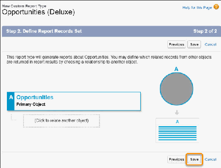
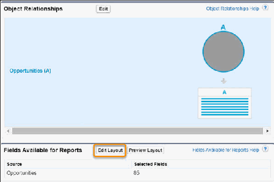
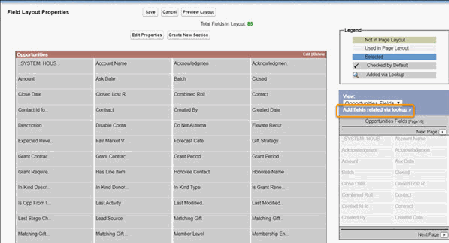
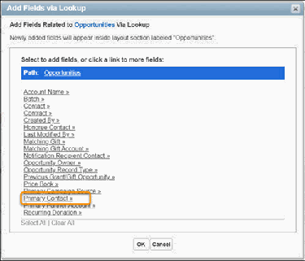
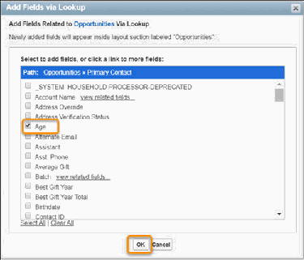
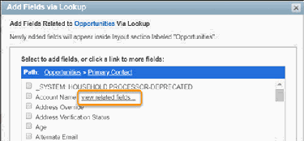
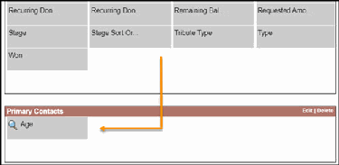
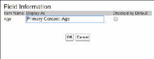
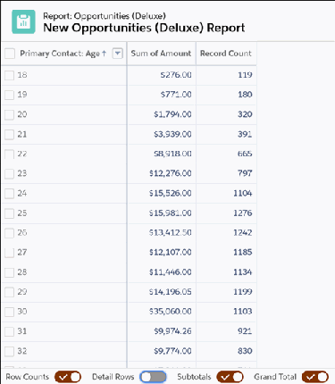

•

Allocations Overview

NPSP Reporting and Analytics

Learn how to manage and customize reports. Best practices to ensure that your reports are well designed

and reliable as well as how to leverage ready-made NPSP reports and Tableau dashboards.

Deluxe Custom Reports

Learn how to customize NPSP reports, includes an example report scenario.

NPSP Reports Workbook

This guide introduces nonprofit administrators to the NPSP reports and demonstrates how you can

customize the reports to meet your organization's needs.

Tableau with NPSP

Tableau Dashboards for Nonprofit Fundraising combine the power of NPSP and Tableau, providing

three ready-made dashboards for insights on your revenue, donors, campaigns, and more.

Deluxe Custom Reports

Learn how to customize NPSP reports, includes an example report scenario.

Overview

Learn about what deluxe custom report types are and how they can help your users.

Deluxe Custom Report Types

Create one custom report type that covered almost all use cases for a given object

Example: Analyze Donations from Wolf Rocks Amphitheatre Donors by Age

See how a nonprofit uses deluxe custom report types.

Considerations

Considerations and limitations of deluxe custom report types.

Overview

Learn about what deluxe custom report types are and how they can help your users.

Because there are so many to pick from, finding the right report type can be a challenge for users. As an

administrator, you can hide unused report types or create custom report types. But, even with these

strategies, your users still need to know which report type to choose for a given scenario.

What if you could create one custom report type that covered almost all use cases for a given object?

Let's explore a technique Evan Ponter from the nonprofit user community calls "deluxe" custom report

types.

619

Deluxe Custom Report Types

Create one custom report type that covered almost all use cases for a given object

Consider the reporting requirements for a given object in Salesforce, let's say, reports that include

Opportunities. In NPSP, there are many objects that Opportunities relate to and each requires its own

report type. For example:

•

Account

•

Primary Contact

•

Matching Gift Account

•

Notification Recipient Contact

•

Primary Campaign Source

And the list goes on.

But by creating a single "deluxe" custom report type for each object and adding fields from related

objects that your users will need to report on, you should be able to handle the vast majority of report

requests. We'll show you how in an example scenario that you can follow along with in your own org.

Note With deluxe custom report types, you can include fields from objects that the Opportunity has

a lookup to (like Primary Contact, Account/Organization, etc.). You can't include fields from objects

that have a lookup to the Opportunity object (like Payments, GAU Allocations, Partial Soft Credits,

etc.).

SSuummmmaarryy ooff SStteeppss

Creating a deluxe custom report types requires the following tasks:

11.. Create custom report type, with just one Primary Object.

22.. Using the available lookups in Edit Layout, add the fields you want from related objects.

Example: Analyze Donations from Wolf Rocks Amphitheatre Donors by Age

See how a nonprofit uses deluxe custom report types.

Juan, the solo admin for Wolf Rocks Amphitheatre, is rolling out reporting functionality for the

fundraising team. Wolf Rocks is a nonprofit organization that operates a live performance venue

supporting a variety of programs.

The fundraising team is excited to see a list of donations grouped by the age of the donor. Understanding

the number and total amount of donations for each age will help focus upcoming appeal efforts. Juan

knows that the report needs to show a list of Opportunity records and that custom fields like Age from

the Primary Contact are not included in the standard Opportunities report type. The fundraising team

has more requests for donation reports waiting for Juan and he's feeling a little overwhelmed!

620

Juan has created reports before, but he's determined to try out a new way of using them. He takes this

opportunity (pun intended) to create a single custom report type to facilitate most requests for data

involving the Opportunity object. Follow along as Juan creates his first "deluxe" custom report type.

Now, Juan can create a new report using this Opportunities (Deluxe) report type, add the summary

columns requested by the fundraising team, group by the Age field from the Primary Contact, and give

the fundraising team exactly the report they need to analyze donations by donor age.

11.. In Setup, Juan enters Report Types in the Quick Find box, then clicks Report Types.

22.. He then clicks New Custom Report Type.

33.. Juan sets these values:

••

Primary Object: Opportunities

••

Report Type Label: Opportunities (Deluxe)

••

Report Type Name: Opportunities_Deluxe

••

Description: Every row represents an Opportunity record. Includes fields from the Contact object.

••

Store in Category: Opportunities

••

Deployment Status: Deployed

44.. Juan clicks Next.

55.. For Define Report Records Set, Juan sees that this report type will generate reports about

Opportunities. Perfect! Since he doesn't need to include other objects in the definition for this custom

report type, Juan clicks Save.

621

66.. Next, Juan scrolls to the bottom of the newly-created custom report type and clicks Edit Layout to add

fields.

622

77.. Juan clicks Add related fields via lookup, so that he can select fields from related objects.

623

88.. Juan clicks Primary Contact, then selects Age. Age is a custom field in Juan's organization.

624

99.. He clicks OK.

1100.. (Optional) You can include fields from related records, such as the Primary Contact's Account record,

giving you even more flexibility. To access related fields, click View Related Fields next to the related

record.

1111.. Juan keeps the custom report type layout organized by grouping fields into relevant sections—one for

each object referenced. He creates a section labeled Primary Contacts and drags the Age field into

it.

Note Sections are displayed as folder groupings in the report builder. Organize fields in a way that

helps your organization understand which object the field came from or what kind of data it

represents.

1122.. (Optional) Adjust how fields appear in reports by clicking a field, then clicking Edit Properties. You can

change the Display As, for example, from Primary Contact: Age to Donor Age. You can also select

Checked by Default so that the field displays as a column when you create new reports using this

report type.

625

1133.. Click OK to finish.

1144.. With the desired fields added to the layout, Juan clicks Save.

The fundraising team is loving this report type! Now, anytime they need a report that shows Opportunity

records with related record details, they use the Opportunities (Deluxe) report type. No more fumbling

with various report types to find one that includes the fields they need.

626

Juan uses this same approach for every report requested by his organization. If the “Deluxe” report type

already exists for an object, he adjusts it to include additional relevant fields. For objects that don’t have

a “Deluxe” custom report type yet, he creates it and adds the desired fields.

Nice work!

Considerations

Considerations and limitations of deluxe custom report types.

While deluxe custom report types work for most scenarios, there are a few limitations you should be

aware of:

•

A custom report type layout can include a maximum of 1000 fields.

•

A custom report type can reference a maximum of 60 unique objects.

•

The “Show Me” ownership filter in the report builder references the Owner field of the primary object

specified in the report type.

•

On deluxe custom report types you can include fields from objects that the primary object has a

lookup to (for example, for Opportunities: Primary Contact, Account/Organization, etc.). You can't

include fields from objects that have a lookup to the primary object records (for example, for

Opportunities: Payments, GAU Allocations, Partial Soft Credits, etc.).

NPSP Reports Workbook

This guide introduces nonprofit administrators to the NPSP reports and demonstrates how you can

customize the reports to meet your organization's needs.

Reports provide answers to questions. A well-designed report can answer frequently asked questions,

such as:

•

Who donated last year but hasn't yet this year?

•

Who are our top 25 donors?

•

Which members are due for renewal next quarter?

To get started, review Audience and Prerequisites, the Nonprofit Salesforce How-To Series video, and

download the Reports Workbook PDF file.

Audience and Prerequisites

You should have some familiarity with the Nonprofit Success Pack, Salesforce, and Salesforce reports

before attempting to step through this guide. If you haven't already done so, we recommend that you

complete the Nonprofit Fundraising Trail and the Reports & Dashboards Trailhead Module before

proceeding.

627