npe4__Type__c = 'Spouse',

npe4__Status__c = 'Current'));

}

}

if (listRel.size() > 0) {

database.insert(listRel);

}

}

}

}

Import More Than Two Contacts to a Household at Once

Here's how to import more than two contacts to the same household at once.

Salesforce automatically creates a Household Account for each Contact record you create. If you have

more than two people in the same Household, use NPSP Data Import to import the records. Here's how

to adjust your import template to accommodate this.

For each new Contact in the Household, add a new row containing Contact1 and include the new

Contact in the Contact2 column. Salesforce will add that new Contact (in the Contact2 column) to

Contact1's Household Account. You can repeat this process for any additional Contacts in the

Household.

For example, let's say you want to import Jane Wilcox (Contact1), her husband, and her two kids. Add

Jane Wilcox's Salesforce ID in the Contact1 Imported column for each Contact you want to import into

her Household.

Ongoing NPSP Administration

Learn about advanced mapping, general administration, gift entry templates, recurring donations, and

how to troubleshoot NPSP.

Advanced NPSP Mapping

Advanced Mapping is the logic that powers the NPSP Data Importer tool. Advanced Mapping is

already set up to handle typical import, Gift Entry, and Elevate donation form scenarios involving

constituent and donation data. If you want to add a custom field to a Gift Entry or Elevate form, or

import data into a custom field that hasn't yet been mapped, you'll need to customize Advanced

Mapping.

350

NPSP Constituent Engagement

Use Engagement Plans and NPSP Levels to support donor prospecting, stewardship, and moves

management, and track your constituents' level of engagement with your organization.

General NPSP Administration

Read more about the general NPSP administration tasks.

NPSP Gift Entry Templates

Find out more about NPSP gift entry templates.

NPSP Recurring Donation Administration

Learn how to customize Recurring Donation forms, automatic functionality, mapping to Opportunities,

how to use the API, and more.

NPSP Troubleshooting

Troubleshoot challenges with NPSP features, view common errors, interpret health check issues, and

learn about account models.

Advanced NPSP Mapping

Advanced Mapping is the logic that powers the NPSP Data Importer tool. Advanced Mapping is already

set up to handle typical import, Gift Entry, and Elevate donation form scenarios involving constituent and

donation data. If you want to add a custom field to a Gift Entry or Elevate form, or import data into a

custom field that hasn't yet been mapped, you'll need to customize Advanced Mapping.

Advanced Mapping Overview

Advanced Mapping gives you the flexibility to send data to most Salesforce objects related to Contacts,

Accounts, and Opportunities.

Understand Field Mappings

This article explains Field Mappings, a key component of Advanced Mapping, which is the logic used

to process Gift Entry, Elevate, and imported data

Understand Object Groups

This article explains Object Groups, a key component of Advanced Mapping, which is the logic used to

process Gift Entry, Elevate, and imported data.

Customize Advanced Mapping

Customize Advanced Mapping for data import if you want to map data into an object or field that

hasn't yet been mapped.

Connect a New Object in Advanced Mapping

Advanced Mapping comes with Contacts, Accounts, Opportunities, and other objects already

mapped. You can connect additional objects that are directly related to Contacts, Accounts, or

Opportunities.

Advanced Mapping Recipes

This article complements the existing documentation to set up Advanced Mapping, and includes

instructions for creating Affiliation, Engagement Plan, Relationship, and Soft Credit records for

common scenarios during data import.

Standard NPSP Data Import Fields

351

This article includes reference information about the fields in the NPSP Data Import object, the

mapping to target NPSP objects, and information about columns in the NPSP Data Importer

Templates.

Advanced Mappings for Elevate

NPSP includes field mappings that allow transactions to flow from Elevate into NPSP.

Advanced Mapping Overview

Advanced Mapping gives you the flexibility to send data to most Salesforce objects related to Contacts,

Accounts, and Opportunities.

Advanced Mapping is the logic that powers the NPSP Data Importer tool. Advanced Mapping gets your

data to the right place, whether you use a Gift Entry form, an Elevate donation form, or import a

spreadsheet.

Advanced Mapping is already set up to handle typical import, Gift Entry, and Elevate donation form

scenarios involving constituent and donation data. For most organizations, very little or no customization

of Advanced Mapping is needed.

If you want to add a custom field to a Gift Entry or Elevate form, or import data into a custom field that

hasn’t yet been mapped, you’ll need to customize Advanced Mapping.

Note Making customizations to Advanced Mapping has the biggest payoff when you plan to use the

customized mappings repeatedly. If you’re doing a complex, one-time import of custom data,

consider a strategy that doesn’t involve the NPSP Data Importer tool, such as Data Loader. For more

information on Data Loader, see the Data Loader Guide. To review how the NPSP Data Importer tool

works, see How NPSP Data Importer Processes Data.

See Also:

•

Enable and Convert to Advanced Mapping

•

Customize Advanced Mapping

•

Extend NPSP Data Importer with Advanced Mapping Trailhead module

Understand Field Mappings

This article explains Field Mappings, a key component of Advanced Mapping, which is the logic used to

process Gift Entry, Elevate, and imported data

Field Mappings are a key component of Advanced Mapping. Field Mappings connect fields on the NPSP

Data Import object—where you initially bring data into Salesforce—to fields on the target object—Account,

Contact, Opportunity, or other objects.

For example, let’s look at data for Billing City on the Account object.

When you gather Billing City data from a Gift Entry or Elevate form, or import it using an import tool, the

352

data is first stored in a field called Account1 City on the NPSP Data Import object. Ultimately, that data

needs to get to the Billing City field on the Account object. A Field Mapping record connects those two

fields.

The Field Mapping record within Advanced Mapping looks like this:

Advanced Mapping comes with the Field Mappings that cover typical data entry and import scenarios.

For most organizations, no additional customization is needed.

However, if you want to import data into a custom field, or include a custom field on a Gift Entry or

Elevate form, create a Field Mapping record and complete some other necessary customizations. For

more information, see Customize Advanced Mapping.

Understand Object Groups

This article explains Object Groups, a key component of Advanced Mapping, which is the logic used to

process Gift Entry, Elevate, and imported data.

An Object Group is a container for a collection of Field Mappings. In addition to holding Field Mappings,

Object Groups tell the NPSP Data Importer tool what types of records (e.g. Accounts, Contacts,

Opportunities, etc.) to create or update. The object type is specified in the Object Name field:

Object Groups also tell the NPSP Data Importer tool how to relate records to each other. For example,

GAU Allocation 1 and GAU Allocation 2 are both a child of the Opportunity Object Group:

These Object Groups allow you to include data for an Opportunity, along with data for two different GAU

Allocations for that Opportunity, all in the same row of your import spreadsheet.

Advanced Mapping comes with several Object Groups already configured. If you have a previously

unmapped custom object with fields you want to include in your data import or Gift Entry form, create a

new Object Group then complete some additional customizations.

For more information, see Connect a New Object in Advanced Mapping.

Customize Advanced Mapping

Customize Advanced Mapping for data import if you want to map data into an object or field that hasn't

yet been mapped.

Note Special thanks to Sarah Amin, TJ Warfield, and Ryan Berens for helping to improve this article.

When to Customize Advanced Mapping

353

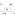

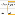

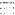

Most organizations can use the pre-configured Advanced Mapping settings without additional

customization. Customize Advanced Mapping if you want to map data into an object or field that

hasn't yet been mapped.

High-Level Steps to Customize Advanced Mapping

To customize Advanced Mapping, create the necessary objects and fields and connect them using

Field Mappings. Follow along with this example scenario to see how a typical nonprofit customizes

Advanced Mapping.

Confirm the Target Object and Fields

The first step in customizing Advanced Mapping is to make sure you have a place for your custom data

to land.

Create Staging Fields on the NPSP Data Import Object

To import data, create a matching field on the NPSP Data Import object for any field you created on

another object.

Connect Staging and Target Fields

Molly is ready for the final step—connecting the Favorite Literary Genre field on Contact with the two

Favorite Literary Genre fields on the NPSP Data Import object.

Edit or Delete a Custom Object Group

Object Groups are collections of field mappings that tell the NPSP Data Import tool what types of

records to create or update. Edit or delete custom object groups in NPSP Settings.

Edit or Delete a Field Mapping

Field Mappings relate fields on the NPSP Data Import object to fields on the target object for data

import. Edit or delete Field Mappings in NPSP Settings.

Objects Available for Advanced Mapping

View the list of objects and fields already included in Advanced Mapping.

When to Customize Advanced Mapping

Most organizations can use the pre-configured Advanced Mapping settings without additional

customization. Customize Advanced Mapping if you want to map data into an object or field that hasn't

yet been mapped.

Most organizations can use the pre-configured Advanced Mapping settings without additional

customization. Customize Advanced Mapping if you want to map data into an object or field that hasn’t

yet been mapped.

For example, maybe you want to track your constituents’ favorite literary genre for a monthly book club

and capture that information on their Contact records. Or you want to include a custom field for

Preferred Thank You Gift on your Gift Entry form. In these situations, customize Advanced Mapping to

include your custom fields in the import or data entry process.

Brand-new to Advanced Mapping? Here are some handy resources:

•

Understand Field Mappings

•

Understand Object Groups

354

•

Extend NPSP Data Importer with Advanced Mapping Trailhead module

High-Level Steps to Customize Advanced Mapping

To customize Advanced Mapping, create the necessary objects and fields and connect them using Field

Mappings. Follow along with this example scenario to see how a typical nonprofit customizes Advanced

Mapping.

Here are the high-level steps to customize Advanced Mapping:

11.. Confirm the target object and fields. Is the data going into a custom field or object? If these objects

or fields haven't yet been created, complete this step.

22.. Create staging fields on the NPSP Data Import object that correspond to fields on the target object.

For example, if you’re importing data into a custom field on Opportunity called "Thank You Gift", you’ll

need a "Thank You Gift" field on NPSP Data Import.

33.. Connect a new object in Advanced Mapping (applies only in certain circumstances.) This step

applies only if you have a new custom object. See Connect a New Object in Advanced Mapping for

more information.

44.. Connect staging and target fields with Field Mappings.

To see how customizing Advanced Mapping works in a typical nonprofit, let’s walk through the steps with

Molly, a Salesforce admin at Read Now. Read Now is a grassroots organization dedicated to promoting

adult literacy.

Read Now keeps track of their donors' favorite literary genres to use in marketing campaigns. Along with

basic contact information, they include a question about favorite literary genre on their online donor

profile forms.

The donor profile form collects information about the primary Contact in a Household, as well as

optional secondary Contact information. Molly plans to include the Favorite Literary Genre field for both

the primary and secondary household members.

Let’s follow along with Molly as she sets up Advanced Mapping to include this custom information.

Confirm the Target Object and Fields

The first step in customizing Advanced Mapping is to make sure you have a place for your custom data to

land.

The first step in customizing Advanced Mapping is to make sure you have a place for your data to land. Is

the data going into a custom object? Into custom fields? Do those objects or fields exist? If not, you need

to create them.

Note If you need a refresher on creating custom objects and fields, see Trailhead modules Custom

355

Objects: Quick Look and Custom Fields: Quick Look.

To store Read Now's custom donor information, Molly creates a picklist field on Contact named Favorite

Literary Genre.

Now she's ready to create corresponding staging fields on the NPSP Data Import object.

Create Staging Fields on the NPSP Data Import Object

To import data, create a matching field on the NPSP Data Import object for any field you created on

another object.

CCrreeaattee FFiieellddss oonn NNPPSSPP DDaattaa IImmppoorrtt

Since Molly created a picklist field on Contact, she creates a matching field of the same data type on the

NPSP Data Import object. She makes sure both fields have the same picklist values, and the same field-

level security.

Note You can reduce the maintenance of keeping picklists in sync across objects by using Global

Picklist Values. See Create a Global Picklist Value Set for more information.

The NPSP Data Import object contains fields that correspond to many different objects (Account,

Contact, Opportunity, and more). To easily distinguish which object a field is mapped to, the Advanced

Mapping field naming convention begins with the Object Group name. Molly follows the naming

convention and names the new field Contact1 Favorite Literary Genre.

The Contact1 Object Group represents the primary Contact in a Household. To include the secondary

Contact in a Household on the same donor profile form, Molly creates another picklist field with the

same picklist values and field-level security, and names it Contact2 Favorite Literary Genre.

Note For more information on Object Groups, see Understand Object Groups.

In Connect Staging and Target Fields with Field Mappings, you'll see how to connect these two fields to

the Favorite Literary Genre field on Contact.

SSppeecciiaall FFiieelldd CCoonnssiiddeerraattiioonnss

When your target field is a Master/Detail or checkbox field, there are special considerations for creating

the corresponding staging field on the NPSP Data Import object.

For a target Master/Detail field, create the corresponding staging field on NPSP Data Import as either a

lookup or an 18 character text field to hold the Salesforce ID.

For a target checkbox field, create a picklist field on NPSP Data Import. Add the values of True and False

to the picklist. True corresponds to a checked state, False corresponds to not checked.

356

Connect Staging and Target Fields

Molly is ready for the final step—connecting the Favorite Literary Genre field on Contact with the two

Favorite Literary Genre fields on the NPSP Data Import object.

This step requires creating two Field Mapping records. Let's follow along:

11.. Click the NPSP Settings tab. If you don't see the tab, find it in the App Launcher ( ).

22.. Click System Tools | Advanced Mapping.

33.. Click Configure Advanced Mapping.

44.. In the Contact1 row, click , then select View Field Mappings.

55.. Click Create New Field Mapping.

66.. In the new Field Mapping dialog, select Contact1 Favorite Literary Genre

(Contact1_Favorite_Literary_Genre__c) as the Source.

77.. Select Favorite Literary Genre (Favorite_Literary_Genre__c) as the Target.

88.. Save your work.

Molly has created her first Field Mapping record, which connects the NPSP Data Import field Contact1

Favorite Literary Genre with the Favorite Literary Genre field on the Contact object.

Now, Molly repeats the steps to connect Contact2 Favorite Literary Genre to Favorite Literary Genre on

Contact. This mapping connects the information for the secondary Contact in the Household. This time,

she chooses View Field Mappings from the Contact2 row, and selects Contact2 Favorite Literary Genre as

the source. She connects it to the same target field on Contact, Favorite Literary Genre.

And voila! Molly completed the steps to map her custom field. Now she can include it on Read Now’s

donor profile form for both the primary and secondary Household members.

Edit or Delete a Custom Object Group

Object Groups are collections of field mappings that tell the NPSP Data Import tool what types of

records to create or update. Edit or delete custom object groups in NPSP Settings.

11.. Click the NPSP Settings tab. If you don't see the tab, find it in the App Launcher ( ).

22.. Click System Tools | Advanced Mapping.

33.. Click Configure Advanced Mapping.

44.. In the row for the custom Object Group to edit, click and select Edit. To delete a custom Object

Group, click and select Delete.

357

55.. Make your changes, then save your work.

Edit or Delete a Field Mapping

Field Mappings relate fields on the NPSP Data Import object to fields on the target object for data

import. Edit or delete Field Mappings in NPSP Settings.

To edit or delete a Field Mapping for a standard or custom Object Group:

11.. Click the NPSP Settings tab. If you don't see the tab, find it in the App Launcher ( ).

22.. Click System Tools | Advanced Mapping.

33.. Click Configure Advanced Mapping.

44.. In the row for the Object Group with Field Mappings to edit or delete, click and select View Field

Mappings.

55.. In the row for the Field Mapping to edit, click and select Edit. To delete a Field Mapping, click

and select Delete.

66.. Make your changes, then save your work.

Objects Available for Advanced Mapping

View the list of objects and fields already included in Advanced Mapping.

For a list of Object and Fields already included in Advanced Mapping see Standard NPSP Data Import

Fields. These are the Salesforce objects available for Advanced Mapping. Is there another object you'd

like to map? Please add an Idea on the IdeaExchange to request it.

Connect a New Object in Advanced Mapping

Advanced Mapping comes with Contacts, Accounts, Opportunities, and other objects already mapped.

You can connect additional objects that are directly related to Contacts, Accounts, or Opportunities.

Note Instructions in this article pertain to connecting a previously unmapped object. If you only

need to connect a new field, see Customize Advanced Mapping.

Advanced Mapping comes with Contacts, Accounts, Opportunities, and other objects already mapped.

You can connect additional objects that are directly related to Contacts, Accounts, or Opportunities.

Follow along to see how to connect a new object in Advanced Mapping.

We’ll use the example of Molly at Read Now, an organization dedicated to adult literacy. Molly created a

custom object in Salesforce to store constituent responses to Read Now’s annual literature survey. This

Survey object is a child of the Contact object, so that Molly can link survey responses to constituent

358

records.

Follow along as Molly connects her custom Survey object in Advanced Mapping.

Create Fields on the NPSP Data Import Object

To map a new object, Molly first creates two fields on the NPSP Data Import object. She uses the

Advanced Mapping naming convention of [Object Group Name] Import Status. She plans to name her

new Object Group Survey 1, so she uses that as the prefix for her field names.

11.. Molly creates a text field on the NPSP Data Import object to store Survey 1 Import Status:

Important The Import Status field must have a length of 255.

22.. Molly then creates a lookup relationship field called Survey 1 Imported. This field will store a link to

the record that NPSP Data Importer created or updated. She relates the field to her custom Survey

object.

Note If you need a refresher on creating custom objects and fields, see Trailhead modules Custom

Objects: Quick Look and Custom Fields: Quick Look.

Now, Molly is ready to create the Object Group.

Create an Object Group

Follow along with Molly as she creates an Object Group for her custom Survey object:

11.. Click the NPSP Settings tab. If you don't see the tab, find it in the App Launcher ( ).

22.. Click System Tools | Advanced Mapping.

33.. Click Configure Advanced Mapping.

44.. Click Create New Object Group.

55.. Fill in the fields as follows:

••

Group Name: Survey 1 Group. Choose any unique name for the new Object Group.The standard

naming convention is [Target Object] Group.

••

Object Name: Survey (Survey__c). Indicates the target object where the records ultimately end up.

••

Is Child/Parent: Child. Describes how the new Object Group is related to the Object Group in the Of

this Object Group field. In this example, Survey 1 Group is a child of Contact 1.

359

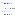

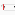

••

Of this Object Group: Contact 1. The Object Group that the new Object Group is related to.

••

Through this field: Survey 1 Survey Participant (Survey_1_Survey_Participant__c). Indicates the

field on the child object that connects the Object Groups.

••

Link to Record: Survey 1 Imported (Survey_1_Imported__c). Stores a link to the record that was

created or updated.

••

Import Status: Survey 1 Import Status (Survey_1_Import_Status__c). Indicates whether NPSP

Data Importer successfully processed the record.

66.. Save your work.

Advanced Mapping Recipes

This article complements the existing documentation to set up Advanced Mapping, and includes

instructions for creating Affiliation, Engagement Plan, Relationship, and Soft Credit records for common

scenarios during data import.

Overview

This article illustrates some of the great ways community members are using the flexible Advanced

Mapping feature to import and create records for affiliation, engagement plan, relationship, and soft

credit data.

Affiliation Recipes

Review how NPSP Data Importer processes Contacts and different types of Accounts before diving into

recipes for Affiliations.

Engagement Plan Recipes

Configure Advanced Mapping to import Engagement Plan Template data and attach it to a Contact.

Relationship Recipes

Configure Advanced Mapping to import data about how Contacts are related to each other and create

Relationship records between two related Contacts.

Soft Credit Recipes

Configure Advanced Mapping to import soft credit data and create soft credits for Contacts and

Accounts.

Overview

This article illustrates some of the great ways community members are using the flexible Advanced

Mapping feature to import and create records for affiliation, engagement plan, relationship, and soft

credit data.

This article complements the existing documentation to set up Advanced Mapping. If you're unfamiliar

with that process, please read Customize Advanced Mapping first and reference it as you work through

specific recipes below.

Note Some of the recipes say to use the in Field Mapping. The spyglass icon allows you to search

360

for any field on the NPSP Data Import object whether or not it's been mapped in another Object

Group.

We'll add to this article as we hear about more great ways community members are using the flexible

Advanced Mapping feature. Have you created a mapping you think would be helpful to others in the

community? Please post in the SFDO Open Source Contributors group on the Hub and tag the

#Advanced Mapping topic. We'd love to add your recipe!

Affiliation Recipes

Review how NPSP Data Importer processes Contacts and different types of Accounts before diving into

recipes for Affiliations.

Before diving into recipes for Affiliation records between Contact1 or Contact2 with an Organization

Account, it's worth reviewing how NPSP Data Importer processes Contacts and different types of

Accounts. When you use a single row of your CSV file to import Contact1, Contact2, Account1, and

Account2, NPSP Data Import will:

11.. Place Contact1 and Contact2 in the same Household Account.

22.. Find or create Account1 as an Organization Account.

33.. Create a Primary Affiliation for Contact1 to the Account1 Organization Account.

44.. Find or create Account2 as an Organization Account.

55.. Create a Primary Affiliation for Contact2 to the Account2 Organization Account.

Add Same Organization Affiliation for Contact1 and Contact2

If you have two people who live in the same household who are connected to the same family

foundation (or even work at the same organization), you may want both Contacts to be connected to

the same Organization Account through an Affiliation record.

Set Contact1 as the Primary Contact for the Account1 Organization

To make sure Contact1 is set as the Primary Contact on Account1's Organization Account record, add a

Field Mapping to Account1's Object Group.

AAdddd SSaammee OOrrggaanniizzaattiioonn AAffiffilliiaattiioonn ffoorr CCoonnttaacctt11 aanndd CCoonnttaacctt22

If you have two people who live in the same household who are connected to the same family

foundation (or even work at the same organization), you may want both Contacts to be connected to the

same Organization Account through an Affiliation record.

If you have two people who live in the same household who are connected to the same family

foundation (or even work at the same organization), you may want both Contacts to be connected to the

same Organization Account through an Affiliation record.

No additional mapping is necessary to create an Affiliation to the same Organization Account for

361

Contact1 and Contact2! To create this Affiliation record, simply enter the same information for the

Organization Account in the Account1 and Account2 information in your CSV.

NPSP Data Importer will find the Organization Account that was found or created when Account1 was

processed and create an Affiliation record for Contact2.

SSeett CCoonnttaacctt11 aass tthhee PPrriimmaarryy CCoonnttaacctt ffoorr tthhee AAccccoouunntt11 OOrrggaanniizzaattiioonn

To make sure Contact1 is set as the Primary Contact on Account1's Organization Account record, add a

Field Mapping to Account1's Object Group.

To make sure Contact1 is set as the Primary Contact on Account1's Organization Account record, add a

Field Mapping to Account1's Object Group by following these steps:

11.. Click View Field Mappings for the Account1 Object Group.

22.. Click Create New Field Mapping:

aa.. Click to search for and select Contact1 Imported (npsp__Contact1Imported__c), and

map it to Primary Contact (npe01__One2OneContact__c).

Engagement Plan Recipes

Configure Advanced Mapping to import Engagement Plan Template data and attach it to a Contact.

Attach an Engagement Plan Template to Contact1

If your org has an Engagement Plan Template to associate with a Contact, configure Advanced

Mapping to import this data and create an Engagement Plan Template attachment on the Contact

record.

AAttttaacchh aann EEnnggaaggeemmeenntt PPllaann TTeemmppllaattee ttoo CCoonnttaacctt11

If your org has an Engagement Plan Template to associate with a Contact, configure Advanced Mapping

to import this data and create an Engagement Plan Template attachment on the Contact record.

To link an Engagement Plan Template to Contact1, follow the steps below. Because Engagement Plan

Template is a lookup field, you'll need to include the 15 or 18 digit Salesforce ID for the Engagement

Plan template in your import file.

11.. Prepare Salesforce for the Engagement Plan 1 Object Group, and create these fields on the NPSP Data

Import object:

aa.. Engagement Plan 1 Imported (lookup)

bb.. Engagement Plan 1 Import Status (text)

22.. Add at least one additional field to map on the NPSP Data Import object, such as:

362

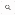

aa.. Engagement Plan 1 Template (lookup)

33.. In NPSP Settings, create a new Object Group for Engagement Plan 1 with the following information:

aa.. Group Name: Engagement Plan 1

bb.. Object Name: Engagement Plan

cc.. Is Child/Parent: Child

dd.. Of This Mapping Group: Contact 1

ee.. Through This Field: Contact

ff.. Link to Field: Engagement Plan 1 Imported

gg.. Import Status: Engagement Plan 1 Import Status

44.. Add Field Mappings for the Engagement Plan 1 Object Group:

aa.. Select Engagement Plan 1 Template (Engagement_Plan_1_Template __c), and map it to

Engagement Plan Template (npsp__Engagement_Plan_Template__c).

Relationship Recipes

Configure Advanced Mapping to import data about how Contacts are related to each other and create

Relationship records between two related Contacts.

Important By default, the NPSP Data Importer links Contact1 and Contact2 together by putting

them in the same Household Account.

Add a Relationship Between Contact1 and Contact2

If your org has data about how Contacts are related to each other, for example, as coworkers, siblings,

or other relationship types, configure Advanced Mapping to import this data and create Relationship

records between two related Contacts.

AAdddd aa RReellaattiioonnsshhiipp BBeettwweeeenn CCoonnttaacctt11 aanndd CCoonnttaacctt22

If your org has data about how Contacts are related to each other, for example, as coworkers, siblings, or

other relationship types, configure Advanced Mapping to import this data and create Relationship

records between two related Contacts.

11.. Create fields on the NPSP Data Import object:

aa.. Relationship 1 Imported (lookup to Relationship)

bb.. Relationship 1 Import Status (text (255))

363

cc.. Relationship 1 Type (text (255))

22.. In NPSP Settings, create a new Object Group for Relationship 1 with the following information:

aa.. Group Name: Relationship 1

bb.. Object Name: Relationship (npe4__Relationship__c)

cc.. Is Child/Parent: Child

dd.. Of This Mapping Group: Contact 1

ee.. Through This Field: Contact (npe4__Contact__c)

ff.. Link to Field: Relationship 1 Imported (Relationship_1_Imported__c)

gg.. Import Status: Relationship 1 Import Status (Relationship_1_Import_Status__c)

33.. Add Field Mappings for the Relationship 1 Object Group:

aa.. Click View Field Mappings for the Relationship 1 Object Group.

bb.. Click Create New Field Mapping.

cc.. Click next to the Source (NPSP Data Import Object) field. Enter and select Contact2

Imported (npsp__Contact2Imported__c).

dd.. Click next to the Target (Relationship 1 Object) field. Enter and select Related Contact

(npe4__RelatedContact__c).

ee.. Save your changes.

ff.. Repeat these steps to map the Relationship 1 Type (Relationship_1_Type__c) field to the Type

(npe4__Type__c) field.

Soft Credit Recipes

Configure Advanced Mapping to import soft credit data and create soft credits for Contacts and

Accounts.

Add an Account Soft Credit for Account 2

If your org has soft credit data for an account, configure Advanced Mapping to import this data and

create a Soft Credit record for the account.

Add a Partial Soft Credit for Contact1

If your org has soft credit data for a Contact, configure Advanced Mapping to import this data and

create a Soft Credit record for the Contact.

364

AAdddd aann AAccccoouunntt SSoofftt CCrreeddiitt ffoorr AAccccoouunntt 22

If your org has soft credit data for an account, configure Advanced Mapping to import this data and

create a Soft Credit record for the account.

To add an Account Soft Credit for Account2, follow the steps below. During the import, you'll map a text

field for Role on the NPSP Data Import object to a picklist field on the target Account Soft Credit object.

Make sure the text you enter in your import file exactly matches one of the active values in your Account

Soft Credit Role picklist.

11.. Prepare Salesforce for the Account2 Soft Credit Object Group, and create these fields on the NPSP

Data Import object:

aa.. Account2 Soft Credit Imported (lookup)

bb.. Account2 Soft Credit Import Status (text)

22.. Add at least one additional field to map on the NPSP Data Import object, such as:

aa.. Account2 Soft Credit Amount (currency)

bb.. Account2 Soft Credit Role (text)

33.. In NPSP Settings, create a new Object Group for Account2 Soft Credit with the following information:

aa.. Group Name: Account2 Soft Credit

bb.. Object Name: Account Soft Credit

cc.. Is Child/Parent: Child

dd.. Of This Mapping Group: Account 2

ee.. Through This Field: Account

ff.. Link to Field: Account2 Soft Credit Imported

gg.. Import Status: Account2 Soft Credit Import Status

44.. Add Field Mappings for the Account2 Soft Credit Object Group:

aa.. Select Account2 Soft Credit Amount (Account2_Soft_Credit_Amount __c), and map it

to Amount (npsp__Amount__c).

bb.. Select Account2 Soft Credit Role (Account2_Soft_Credit_Role __c), and map it to

Role (npsp__Role__c).

cc.. Click the to search for and select Donation Imported (npsp__DonationImported__c),

and map it to Opportunity (npsp__Opportunity__c).

365

AAdddd aa PPaarrttiiaall SSoofftt CCrreeddiitt ffoorr CCoonnttaacctt11

If your org has soft credit data for a Contact, configure Advanced Mapping to import this data and create

a Soft Credit record for the Contact.

To add a Partial Soft Credit for Contact1, follow the steps below. During the import, you'll map a text field

for Role on the NPSP Data Import object to a picklist field on the target Partial Soft Credit object. Make

sure the text you enter in your import file exactly matches one of the active values in your Partial Soft

Credit Role picklist.

11.. Prepare Salesforce for the Partial Soft Credit 1 Object Group, and create these fields on the NPSP Data

Import object:

aa.. Partial Soft Credit 1 Imported (lookup)

bb.. Partial Soft Credit 1 Import Status (text)

22.. Add at least one additional field to map on the NPSP Data Import object, such as:

aa.. Partial Soft Credit 1 Amount (currency)

bb.. Partial Soft Credit 1 Role (text)

33.. In NPSP Settings, create a new Object Group for Partial Soft Credit 1 with the following information:

aa.. Group Name: Partial Soft Credit 1

bb.. Object Name: Partial Soft Credit

cc.. Is Child/Parent: Child

dd.. Of This Mapping Group: Contact 1

ee.. Through This Field: Contact

ff.. Link to Field: Partial Soft Credit 1 Imported

gg.. Import Status: Partial Soft Credit 1 Import Status

44.. Add Field Mappings for the Partial Soft Credit 1 Object Group:

aa.. Select Partial Soft Credit 1 Amount (Partial_Soft_Credit_1 _Amount __c), and map

it to Amount (npsp__Amount__c).

bb.. Select Partial Soft Credit 1 Role (Partial_Soft_Credit_1_Role __c), and map it to

Role (npsp__Role_Name__c).

cc.. Click the to search for and select Contact1 Imported (npsp__Contact1Imported__c),

and map it to Contact (npsp__Contact__c).

366

dd.. Click the to search for and select Donation Imported (npsp__DonationImported__c),

and map it to Opportunity (npsp__Opportunity__c).

Standard NPSP Data Import Fields

This article includes reference information about the fields in the NPSP Data Import object, the mapping

to target NPSP objects, and information about columns in the NPSP Data Importer Templates.

This article includes reference information about the fields in the NPSP Data Import object, the mapping

to target NPSP objects, and information about columns in the NPSP Data Importer Templates, especially

requirements for date fields.

The NPSP Data Import object contains Contact, Account, Address, Opportunity, Payment, and other

fields for import, Gift Entry, or Salesforce.org Elevate. An NPSP Data Import object can contain up to two

Contacts and two Accounts for each record. For data import, the majority of the fields are optional, and

the NPSP Data Importer will use smart default values for fields that contain no data.

In addition to the field mapping described in this article, Elevate includes Advanced Mapping specific to

payment processing. Learn more in Advanced Mappings for Elevate.

Important Make sure your dates are in the format supported by your data import tool.

•

If you're using the Salesforce Data Import Wizard for your import, use dates in your locale format.

In the US, this means MM/DD/YY. For example: 12/31/14.

•

If you're using the external Salesforce (Apex) Data Loader tool for your import, use the YYYY-MM-

DD date format. This format is not the native Excel date format, and you'll need to reformat all of

the columns that contain dates. See this Help and Training article for more information.

Contact Fields

The Contact fields define information about the primary Contact. Salesforce automatically creates a

Household Account for each new Contact1 that you enter.

Household Fields

The Household fields define information about Contact1 and Contact2's Household Account record.

Account Fields

The Account1 and Account2 fields are used to match or create Organizational Accounts, and to create

an affiliation between the appropriate Contact and Organizational Account.

Home Address Fields

If any of the Home Address fields are specified, Salesforce creates an Address object for the

Household, and copies the address to each Contact's Mailing Address fields, and the Household

Account's Billing Address fields.

Donation Information Fields

If any of the Donation Information fields are specified, Salesforce creates an Opportunity and

associates it with either Contact1 (and the Contact's Household), or Account1.

367

Opportunity Contact Role Fields

The Opportunity Contact Role fields define soft credit Opportunity Contact Role information for

Account1 Organization donations.

Recurring Donation Information Fields

When Recurring Donation Information fields are specified, Salesforce creates a Recurring Donation

associated with either Contact1 (and the Contact's Household), or Account1.

Campaign Fields

The Campaign fields define a Campaign associated with a Recurring Donation, Opportunity, and/or

Contact. Set a Campaign Member Status to create Campaign Member records for Contact1 and

Contact2.

GAU Allocation Fields

The GAU Allocation fields define GAU Allocation information for the donation. Define up to two GAU

Allocations for each donation in your import file.

System Fields

The System fields capture information about the import including import statuses and information

about the NPSP Data Import record.

Contact Fields

The Contact fields define information about the primary Contact. Salesforce automatically creates a

Household Account for each new Contact1 that you enter.

These are the Contact1 fields in the NPSP Data Import object.

Field Label Description Required or Default Behavior

Contact1 Salutation The salutation for the Optional.

Contact, such as Mr., Mrs.,

Dr., and so on.

Contact1 First Name The Contact's first name. Optional.

Contact1 Last Name The Contact's last name. Required, if you are including any other fields

from Contact1.

Contact1 Birthdate The Contact's birthdate. Optional. Use the correct date format

supported by your import tool.

Contact1 Title The Contact's title. Optional.

Contact1 Personal The Contact's personal or Optional, but matching to existing Contacts

Email home email. by Email requires at least one of the Email

fields to be provided in order to find a match.

Contact1 Work Email The Contact's work email. Optional, but matching to existing Contacts

by Email requires at least one of the Email

fields to be provided in order to find a match.

368

Field Label Description Required or Default Behavior

Contact1 Alternate An additional email for the Optional, but matching to existing Contacts

Email Contact. by Email requires at least one of the Email

fields to be provided in order to find a match.

Contact1 Preferred Specifies which of the three Optional.

Email Email fields is the preferred

one to use for

communication with the

Contact. If specified, it must

match one of the picklist

values: Personal, Work, or

Alternate.

Contact1 Home Phone The Contact's home phone. Optional.

Contact1 Work Phone The Contact's work phone. Optional.

Contact1 Mobile The Contact's mobile phone. Optional.

Phone

Contact1 Other Phone The Contact's other phone. Optional.

Contact1 Preferred Specifies which of the four Optional.

Phone Phone fields is the preferred

one to use for calling the

Contact. If specified, it must

match one of the picklist

values: Home, Work, Mobile,

or Other.

Contact1 Imported The Contact's Salesforce ID Optional. If not populated with an ID prior to

to match against. import, NPSP will automatically populate after

dry run or processing.

The same fields exist for Contact2, and you use them the same way to add or update a secondary

member of the household.

Household Fields

The Household fields define information about Contact1 and Contact2's Household Account record.

These are the fields in the NPSP Data Import object that map to a Household Account record. We

provided the Household Phone field as an example to follow if you want to set up additional custom

fields for the Household. To create additional fields, follow the directions in Customize Advanced

Mapping.

369

Field Label Description Required or Default Behavior

Household Phone The Household's phone Optional.

number

Household Account The Household account's Optional. If not populated with an ID prior to

Imported Salesforce ID to match import, NPSP will automatically populate after

against. dry run or processing.

Account Fields

The Account1 and Account2 fields are used to match or create Organizational Accounts, and to create an

affiliation between the appropriate Contact and Organizational Account.

The Account1 and Account2 fields are used to match or create Organizational Accounts, and to create an

affiliation between the appropriate Contact and Organizational Account. The organization for Account1

will be entered into the Primary Affiliation field for Contact1, and NPSP will create an Affiliation record

representing this connection. Likewise, Account2 will be entered as the Primary Affiliation for Contact2.

The Account1 and Account2 address fields are used to update the Organizational Account, not the

Contact (Household) Address.

Important The Account fields in the template are used to create optional Organizational Accounts

with which the related Contacts are affiliated. Don't enter Household information in the

template's Account fields, because the Account fields are for Organizational Account

information only.

These are the Account1 fields in the NPSP Data Import object.

Field Label Description Required or Default Behavior

Account1 Name The Account's name. Required, if you are including any other fields

from Account1.

Account1 Street The Account's billing street. Optional.

Account1 City The Account's billing city. Optional.

Account1 State/ The Account's billing state or Optional.

Province province.

Account1 Zip/Postal The Account's billing Zip/ Optional.

Code postal code.

Account1 Country The Account's billing country. Optional.

Account1 Phone The Account's phone. Optional.

Account1 Website The Account's website. Optional.

370

Field Label Description Required or Default Behavior

Account1 Imported The Account's Salesforce ID Optional. If not populated with an ID prior to

to match against. import, NPSP will automatically populate after

dry run or processing.

The same fields exist for Account2, and you use them the same way.

Home Address Fields

If any of the Home Address fields are specified, Salesforce creates an Address object for the Household,

and copies the address to each Contact's Mailing Address fields, and the Household Account's Billing

Address fields.

These are the Home Address fields in the NPSP Data Import object.

Field Label Description Required or Default Behavior

Home Street The household's street Optional.

Home City The household's city Optional.

Home State/Province The household's state or Optional.

province

Home Zip/Postal Code The household's Zip/postal Optional.

code

Home Country The household's country Optional.

Home Address The Address's Salesforce ID Optional. If not populated with an ID prior to

Imported to match against. import, NPSP will automatically populate after

dry run or processing.

Donation Information Fields

If any of the Donation Information fields are specified, Salesforce creates an Opportunity and associates

it with either Contact1 (and the Contact's Household), or Account1.

These are the Donation Information fields in the NPSP Data Import object.

Field Label Description Required or Default Behavior

Donation Donor "Contact1" if an individual Optional. Will be treated as "Contact1" if left

donation, or "Account1" if an empty.

organizational donation.

Donation Amount The donation amount. Required, if you are including any other fields

371

Field Label Description Required or Default Behavior

for Donation Information.

Donation Date The date you received the Optional. Will use the current date if left

donation. empty. Use the date format supported by your

import tool.

Donation Honoree Contact information, such as Optional.

Information email, address, or phone the

donor provided for the

tribute honoree.

Donation Honoree The honoree name as Optional.

Name provided by the donor.

Donation Name A unique name to identify Optional. Will be automatically generated by

the donation. the NPSP if left empty.

Donation Notification A personalized message for Optional.

Message the notification recipient.

Donation Notification Indicates how the Optional. Must match values in corresponding

Preference notification recipient should picklist.

be notified. For example, by

email or phone.

Donation Notification The email address for the Optional.

Recipient Email person receiving the

notification.

Donation Notification Contact information, such as Optional.

Recipient Info address or phone the donor

provided for the notification

recipient.

Donation Notification The name of the person to Optional.

Recipient Name notify of this tribute gift.

Donation Record Type The name of an Opportunity Optional. Will use the Salesforce User's

Name Record Type to use for the default Opportunity Record Type if left empty.

donation.

Donation Tribute Type Indicates whether the Optional. Must match values in corresponding

donation is in honor or in picklist.

memory of an individual.

Donation Type The type of donation. Optional. Must match values in corresponding

picklist.

Donation Stage The stage of the donation Optional. Must match values in corresponding

372

Field Label Description Required or Default Behavior

opportunity. picklist. Will use an active Closed Won Stage if

left empty, meaning that the donation has

been completed.

Donation Description A description of the Optional.

donation.

Donation Member The member level Optional. Must match values in corresponding

Level corresponding to the picklist.

donation.

Donation Membership The origin of the donor's Optional. Must match values in corresponding

Origin membership. picklist.

Donation Membership The start date of the Optional. Use the correct date format

Start Date membership if the donation supported by your import tool.

is for membership.

Donation Membership The end date of the Optional. Use the correct date format

End Date membership if the donation supported by your import tool.

is for membership.

Payment Method The method of payment Optional. If Payments are enabled, will copy

used for the donation. this value to the Opportunity's Payment

object. Must match values in corresponding

picklist.

Payment Check/ The check or payment Optional. If Payments are enabled, will copy

Reference Number number for the donation. this value to the Opportunity's Payment

object.

Payment Paid Indicates the Payment was Optional. Use the correct syntax for your

paid. import tool.

Donation Imported The Donation (Opportunity's) Optional. If not populated with an ID prior to

Salesforce ID to match import, NPSP will automatically populate after

against. dry run or processing.

Donation Possible A comma separated list of Automatically populated by NPSP.

Matches Salesforce IDs of

Opportunities that matched

the Data Import record's

Donation Matching fields.

Payment Imported The Payment's Salesforce ID Optional. If not populated with an ID prior to

to match against. import, NPSP will automatically populate after

dry run or processing.

373

Field Label Description Required or Default Behavior

Payment Possible A comma separated list of Optional.

Matches Salesforce IDs of Payments

that matched the Data

Import record's Donation

Matching fields.

Donation Elevate The external, unique ID of Populated by Salesforce.org Elevate

Recurring ID the Recurring Donation in integration.

Elevate that this donation

Opportunity is linked to.

Payment Authorization Authorization token for a Populated by Salesforce.org Elevate

Token transaction. integration.

Payment Authorized The date and time the Populated by Salesforce.org Elevate

Date transaction was authorized. integration.

Payment Authorized The exact date and time Populated by Salesforce.org Elevate

UTC Timestamp (down to the millisecond) integration.

from the payment gateway

that this transaction was

successfully authorized.

Payment Card The expiration month of the Populated by Salesforce.org Elevate

Expiration Month card used for this integration.

transaction.

Payment Card The expiration year of the Populated by Salesforce.org Elevate

Expiration Year card used for this integration.

transaction.

Payment Card Last 4 The last four digits of the Populated by Salesforce.org Elevate

card used for this integration.

transaction.

Payment Card Network The card network of the card Populated by Salesforce.org Elevate

used for this transaction. integration.

Payment Declined Provides detail about why a Populated by Salesforce.org Elevate

Reason transaction was declined. integration.

Payment Donor Cover The amount the donor paid Populated by Salesforce.org Elevate

Amount in addition to their donation integration.

amount, often to help cover

transaction fees or to add a

tip to their donation.

Payment Elevate The date and time the Populated by Salesforce.org Elevate

374

Field Label Description Required or Default Behavior

Created Date transaction was created. integration.

Payment Elevate The exact date and time Populated by Salesforce.org Elevate

Created UTC (down to the millisecond) integration.

Timestamp from Elevate that the

transaction was created.

Payment Elevate ID The unique ID for this Populated by Salesforce.org Elevate

transaction from Elevate. integration.

Payment Elevate For refunds only. Shows the Populated by Salesforce.org Elevate

Original Payment ID ID of the original payment integration.

transaction from Elevate.

Payment Gateway ID The ID of the payment Populated by Salesforce.org Elevate

gateway that processed this integration.

transaction.

Payment Gateway The unique ID for this Populated by Salesforce.org Elevate

Payment ID transaction from the integration.

payment gateway.

Payment Origin ID The ID for the system where Populated by Salesforce.org Elevate

the transaction was initiated. integration.

Payment Origin Name The name of the system Populated by Salesforce.org Elevate

where the transaction was integration.

initiated.

Payment Origin Type The type of system used to Populated by Salesforce.org Elevate

initiate the transaction. integration.

Available values include

Engagement Hub, Giving

Page, Payments API,

Salesforce.

Payment Status The status of the transaction Populated by Salesforce.org Elevate

from Elevate. integration.

Payment Type Indicates the type of Populated by Salesforce.org Elevate

transaction. integration.

Payment Elevate The amount the donor paid Populated by Salesforce.org Elevate

Transaction Fee in addition to their donation integration.

amount, often to help cover

transaction fees or to add a

tip to their donation.

375

Field Label Description Required or Default Behavior

Payment Gateway The transaction fee charged Populated by Salesforce.org Elevate

Transaction Fee by Elevate. integration.

Payment Total The transaction fee charged Populated by Salesforce.org Elevate

Transaction Fees by your payment gateway. integration.

UTM Source Google Analytics parameter Populated by Salesforce.org Elevate

for tracking the referring integration.

source. For example, website

or newsletter.

UTM Medium Google Analytics parameter Populated by Salesforce.org Elevate

for tracking how the URL was integration.

shared. For example, email

or banner_ad.

UTM Campaign Google Analytics parameter Populated by Salesforce.org Elevate

for tracking the name or integration.

solicitation code of the

outreach effort. For example,

spring_2021_fundraiser.

UTM Content Google Analytics parameter Populated by Salesforce.org Elevate

for differentiating similar integration.

content or links within a

solicitation.

UTM Keyword Terms Google Analytics parameter Populated by Salesforce.org Elevate

for tracking paid search integration.

terms.

Opportunity Contact Role Fields

The Opportunity Contact Role fields define soft credit Opportunity Contact Role information for

Account1 Organization donations.

The Opportunity Contact Role fields define soft credit Opportunity Contact Role information for

Account1 Organization donations. You're able to define an Opportunity Contact Role for Contact1 and a

separate role for Contact2 for each Account1 Organization donation in your import file. Opportunity

Contact Role 1 fields are for Contact1 and Opportunity Contact Role 2 fields are for Contact2.

Note You must use Advanced Mapping instead of Help Text mapping to use these fields. See

Advanced Mapping Overview for more information.

These are the Opportunity Contact Role 1 fields in the NPSP Data Import object.

376

Important Opportunity Contact Role fields should only be used for Organization donations

connected to Account1. For individual donations from Contact1, rely on the NPSP automation for

assigning the primary donor and Household Member soft credit Opportunity Contact Roles. For

more information, see Create Automated Soft Credits for Household Members.

Field Label Description Required or Default Behavior

Opportunity Contact The role you'd like to assign Must match one of your existing Opportunity

Role 1: Role to Contact1 for this Contact Roles.

donation.

Opportunity Contact The Salesforce ID for the Optional. If not populated with an ID prior to

Role 1: Imported Opportunity Contact Role. import, NPSP will automatically populate after

processing.

The same fields exist for Opportunity Contact Role 2, and you use them the same way to add or update a

role for Contact 2.

Recurring Donation Information Fields

When Recurring Donation Information fields are specified, Salesforce creates a Recurring Donation

associated with either Contact1 (and the Contact's Household), or Account1.

When Recurring Donation Information fields are specified, Salesforce creates a Recurring Donation

associated with either Contact1 (and the Contact's Household), or Account1.

If you specify both Donation Information and Recurring Donation Information fields, Salesforce relates

the Opportunity to the Recurring Donation as its first installment.

These are the Donation Information fields in the NPSP Data Import object.

Field Label Description Required or Default Behavior

Recurring Donation Amount The amount for each installment Required.

Opportunity.

Recurring Donation Date The initial inception date for this Optional. NPSP uses the current

Established Recurring Donation. The default date if this is left blank.

is the current date.

Recurring Donation Day of Sets the specific day of the Required when the Installment

Month month for future installment Period is Monthly.

Opportunities when the

Installment Period is Monthly. If

you select 29 or 30, the

installment date will be the last

day of the month for months

377

Field Label Description Required or Default Behavior

that don't have that many days.

Recurring Donation Effective The date that new or updated Optional. NPSP uses the current

Date schedule information (Amount, date if this is left blank.

Day of Month, etc.) for this

Recurring Donation takes effect.

The default is the current date.

Recurring Donation Elevate The external, unique ID of the Populated by Salesforce.org

Recurring ID related Recurring Donation in Elevate integration.

Elevate.

Recurring Donation End Date The date on which this Recurring Optional.

Donation was closed.

Recurring Donation Import The status given when NPSP

Automatically populated by

Status Data Importer tries to create the

NPSP Gift Entry.

Recurring Donation.

If using Data Importer, and

providing a Donation Import

value, manually set the Recurring

Donation Import Status to

Matched or User-Selected

Match.

Recurring Donation Imported The Salesforce ID for the Optional. If not populated with

Recurring Donation. an ID prior to import, NPSP

automatically populates after dry

run or processing.

Recurring Donation Installment The Installment Frequency along Optional. If left blank, NPSP sets

Frequency with Installment Period defines the value to 1 on the target

the installment schedule of this Recurring Donation record.

Recurring Donation. For

example, if Installment Period is

Monthly and Installment

Frequency is 3, the schedule is

defined as "every 3 months".

Recurring Donation Installment The Installment Period along Required.

Period with Installment Frequency

defines the installment schedule

of this Recurring Donation. For

example, if Installment Period is

Monthly and Installment

Frequency is 3, the schedule is

378

Field Label Description Required or Default Behavior

defined as "every 3 months".

Recurring Donation Name Leave blank if you have a Required, unless you have a

Recurring Donation Name Recurring Donation Name

Format selected in NPSP Format selected in NPSP

Settings. Otherwise, enter your Settings.

own name.

Recurring Donation Payment The form of payment for this Optional.

Method Recurring Donation. NPSP

automatically copies the

selected value to each related

Payment record.

Recurring Donation Planned Number of installments you Required when Recurring Type is

Installments expect to receive. Only used Fixed.

when Recurring Type is Fixed.

Recurring Donation Recurring Open indicates an ongoing Optional. If left blank, NPSP sets

Type Recurring Donation. Fixed the value to Open on the target

indicates a Recurring Donation Recurring Donation record.

that has a specific number of

installments. For Fixed, you must

also populate the Number of

Planned Installments field.

Recurring Donation Status Indicates if this Recurring Optional. If left blank, NPSP sets

Donation is actively in use, the value to Active on the target

temporarily suspended, or Recurring Donation record.

closed.

Recurring Donation Status The reason this Recurring Required when the Status is

Reason Donation has its current Status Closed or Paused.

value.

Campaign Fields

The Campaign fields define a Campaign associated with a Recurring Donation, Opportunity, and/or

Contact. Set a Campaign Member Status to create Campaign Member records for Contact1 and

Contact2.

Field Label Description Required or Default Behavior

Campaign Name For associating a Campaign Optional. If specified, NPSP tries to match to

with a Recurring Donation, an existing Campaign by name. If no match is

379

Field Label Description Required or Default Behavior

Opportunity, and/ or found, NPSP creates a new Campaign.

Contact.

Campaign Member For setting a Campaign Optional. If specified along with a Campaign

Status Member Status. Name or Donation Campaign Source, NPSP

creates a Campaign Member for Contact1

and Contact2.

Donation Campaign The Salesforce ID of a

Optional. If specified, will match an existing

Source Campaign to associate the

Campaign by Campaign ID.

Donation with.

If both the Donation Campaign Name and

Donation Campaign Source are

specified, NPSP will use the ID from the

Donation Campaign Source.

GAU Allocation Fields

The GAU Allocation fields define GAU Allocation information for the donation. Define up to two GAU

Allocations for each donation in your import file.

Note You must use Advanced Mapping instead of Help Text mapping to use these fields. See

Advanced Mapping Overview for more information.

These are the GAU Allocation 1 fields in the NPSP Data Import object.

Field Label Description Required or Default Behavior

GAU Allocation 1: GAU The Salesforce ID for the Required if you want to designate a GAU

GAU. Allocation for the donation. If you're using the

Data Import Wizard you must indicate it's a

Salesforce ID on the Import screen. For more

information, see Upload Data from the

Template.

GAU Allocation 1: The monetary amount for You must enter either an amount or a percent

Amount this allocation. (but not both) for the GAU Allocation.

GAU Allocation 1: The percent of the donation You must enter either an amount or a percent

Percent total for this allocation. (but not both) for the GAU Allocation.

GAU Allocation 1: The Salesforce ID for the Optional. If not populated with an ID prior to

Imported GAU Allocation. import, NPSP will automatically populate after

processing.

380

The same fields exist for GAU Allocation 2, and you use them the same way to add or update a

secondary GAU Allocation on the donation.

System Fields

The System fields capture information about the import including import statuses and information about

the NPSP Data Import record.

The System fields capture information about the import including import statuses and information about

the NPSP Data Import record. Unless noted otherwise in the table below, the possible statuses for each

target object (Account, Contact, Opportunity, etc.) are:

Field Label Description Required or Default Behavior

Account1 or Account2 Indicates if an Account was Automatically populated by NPSP.

Import Status created or matched an

existing Account.

ApexJobId Automatically populated by NPSP.

The ApexJobID of the Batch

Job that processed the

record.

Contact1 or Contact2 Indicates if a Contact was Automatically populated by NPSP.

Import Status created or matched an

existing Contact.

Contact1 Consent The text of the Elevate Giving Populated by Salesforce.org Elevate

Message Page consent message. integration.

Created By The Salesforce User who Automatically populated by NPSP.

created the NPSP Data

Import record.

Data Import ID The auto-numbered name of Automatically populated by NPSP.

the NPSP Data Import

record.

Donation Campaign Indicates if a Campaign in Automatically populated by NPSP.

Import Status the Donation Campaign

Source or Donation

Campaign Name field

matched against an existing

Campaign or if a new

Campaign was created.

Donation Import Indicates if an Opportunity

Automatically populated by NPSP Gift Entry.

Status was created or matched an

existing Opportunity. If you

381

Field Label Description Required or Default Behavior

see the Best Match Used

If using Data Importer, and providing a

status, we used the best

Donation Import value, manually set the

match that falls within the

Donation Import Status to Matched or User-

Number of Days from

Selected Match.

Donation Date specified

AND is closest to the

Donation Date.

Elevate Custom Custom metadata from Populated by Salesforce.org Elevate

Metadata Elevate Giving Pages. integration.

Formatted as JSON.

Failure Information Description of what caused Automatically populated by NPSP.

the NPSP Data Import record

to fail to be imported.

GAU Allocation 1 or Indicates if a GAU Allocation Automatically populated by NPSP.

GAU Allocation 2: was created or matched an

Import Status existing GAU Allocation.

Home Address Import Indicates if a Household Automatically populated by NPSP.

Status Address was created or

matched an existing Address.

Imported Date The date and time the NPSP Automatically populated by NPSP.

Data Import record was

successfully imported.

Last Modified By Salesforce User who last Automatically populated by NPSP.

updated the NPSP Data

Import record.

NPSP Data Import Lookup to the NPSP Data Optional or automatically populated by NPSP.

Batch Import Batch this record

belongs to. If you'd like to

add files in your CSV to an

NPSP Data Import Batch,

include the batch's

Salesforce ID in this column.

Opportunity Contact Indicates if an Opportunity Automatically populated by NPSP.

Role 1 or Opportunity Contact Role was created or

Contact Role 2: matched an existing

ImportStatus Opportunity Contact Role.

Owner Salesforce User is the Owner Automatically populated by NPSP.

the NPSP Data Import

382

Field Label Description Required or Default Behavior

record.

Payment ACH Consent The Elevate Giving Page Populated by Salesforce.org Elevate

Message consent message the donor integration.

agreed to.

Payment Import Status Indicates if a Payment was Automatically populated by NPSP.

created or matched an

existing Payment. If you see

the Best Match Used status,

we used the best match that

falls within the Number of

Days from Donation Date

specified AND is closest to

the Donation Date.

Status Automatically populated by NPSP.

Indicates the result of the

Dry Run or Data Import

processing. Possible statuses

are:

•

Imported—The NPSP Data

Import record was

successfully processed in

Salesforce.

•

Failed—The NPSP Data

Import record was not

imported.

•

Dry Run — Validated—Dry

Run was successful and

the record is ready to be

imported into the

appropriate objects.

•

Dry Run — Error—Dry Run

was unsuccessful and the

NPSP Data Import record

will not be processed until

errors are resolved.

•

Any System errors which

caused an issue with this

import.

•

Matched: The imported record matched an existing Salesforce record.

383

•

Created: A new record was created because matching is disabled OR there were no matching records

in Salesforce.

•

Best Match Used: More than one existing record in Salesforce matched the imported record.

•

Matched by Id: Either the Salesforce ID for the record was included in the import file and used to

match an existing Salesforce record or Dry Run found the record ID.

•

Match None: Only used during Dry Run. There are no records in Salesforce that match the value listed

in the field. A new record will be created when the import is processed.

•

Any System errors which caused an issue with this import.

Advanced Mappings for Elevate

NPSP includes field mappings that allow transactions to flow from Elevate into NPSP.

NPSP includes these field mappings that allow transactions to flow from Elevate into NPSP.

Note Do not change any of the field mappings that come as default with the package, as this could

cause issues with your payment processing.

Source Field - NPSP Data Target Field - Payments object Description

Import object

The external, unique ID of the

Donation Elevate Recurring ID Elevate Recurring ID

Recurring Donation in Elevate

that this donation Opportunity is

(npsp__Donation_Elevate_Recur (npsp__CommitmentId__c)

linked to.

ring_ID__c)

The date and time the

Payment Authorized Date Authorized Date

transaction was authorized.

(npsp__Payment_Authorized_D (npsp__Authorized_Date__c)

ate__c)

The exact date and time (down

Payment Authorized UTC Authorized UTC Timestamp

to the millisecond) from the

Timestamp

payment gateway that this

(npsp__Authorized_UTC_Timest

transaction was successfully

(npsp__Payment_Authorized_ amp__c)

authorized.

UTC_Timestamp__c)

The expiration month of the card

Payment Card Expiration Month Card Expiration Month

used for this transaction.

(npsp__Payment_Card_Expiratio (npsp__Card_Expiration_Month

n_Month__c) __c)

The expiration year of the card

Payment Card Expiration_Year Card Expiration Year

used for this transaction.

384

Source Field - NPSP Data Target Field - Payments object Description

Import object

(npsp__Payment_Card_Expiratio (npsp__Card_Expiration_Year__c

n_Year__c) )

The last four digits of the card

Payment Card Last 4 Card Last 4

used for this transaction.

(npsp__Payment_Card_Last_4_ (npsp__Card_Last_4__c)

_c)

The card network of the card

Payment Card Network Card Network

used for this transaction.

(npsp__Payment_Card_Network (npsp__Card_Network__c)

__c)

The date and time the

Payment Elevate Created Date Elevate Payment Created Date

transaction was created.

(npsp__Payment_Elevate_Create (npsp__Elevate_Payment_Create

d_Date__c) d_ Date__c)

The exact date and time (down

Payment Elevate Created UTC Elevate Payment Created UTC

to the millisecond) from Elevate

Timestamp Timestamp

that the transaction was created.

(npsp__Payment_Elevate_Create (npsp__Elevate_Payment_Create

d_ UTC_Timestamp__c) d_ UTC_Timestamp__c)

The unique ID for this

Payment Elevate ID Elevate Payment ID

transaction from Elevate.

(npsp__Payment_Elevate_ID__c (npsp__Elevate_Payment_ID__c

) )

For refunds only. Shows the ID of

Payment Elevate Original Elevate Original Payment ID

the original payment transaction

Payment ID

from Elevate.

(npsp__Elevate_Original_Payme

(npsp__Payment_Elevate_Origin nt_ID__c)

al_ Payment_ID__c)

The ID of the payment gateway

Payment Gateway ID Gateway ID

that processed this transaction.

(npsp__Payment_Gateway_ID__ (npsp__Gateway_ID__c)

c)

385

Source Field - NPSP Data Target Field - Payments object Description

Import object

The unique ID for this

Payment Gateway Payment ID Gateway Payment ID

transaction from the payment

gateway.

(npsp__Payment_Gateway_Pay (npsp__Gateway_Payment_ID__

ment_ID__c) c)

The ID for the system where the

Payment Origin ID Origin ID

transaction was initiated.

(npsp__Payment_Origin_ID__c) (npsp__Origin_ID__c)

The name of the system where

Payment Origin Name Origin Name

the transaction was initiated.

(npsp__Payment_Origin_Name_ (npsp__Origin_Name__c)

_c)

The type of system used to

Payment Origin Type Origin Type

initiate the transaction. Available

values include Engagement Hub,

(npsp__Payment_Origin_Type__ (npsp__Origin_Type__c)

Giving Page, Payments API,

c)

Salesforce.

Indicates the type of transaction.

Payment Type Type

(npsp__Payment_Type__c) (npsp__Type__c)

NPSP Constituent Engagement

Use Engagement Plans and NPSP Levels to support donor prospecting, stewardship, and moves

management, and track your constituents' level of engagement with your organization.

Create and Manage Engagement Plans

Use Engagement Plans to automatically create a series of predefined tasks to support donor

prospecting, stewardship, and moves management.

Create and Manage Levels

NPSP Levels give you a way to track a constituent's level of commitment and engagement based on

criteria such as total gifts or number of hours volunteered. Create and manage NPSP Levels based on

your organization's practices.

Create and Manage Engagement Plans

Use Engagement Plans to automatically create a series of predefined tasks to support donor prospecting,

stewardship, and moves management.

386

Note Watch the Nonprofit Salesforce How-To Series videos about Engagement Plans and Levels with

Engagement Plans.

Note Administrators: If this feature isn't configured in your org, or something seems to be missing,

see the Feature Configuration Overview for a list of major features in NPSP and how to configure

them.

Overview

An Engagement Plan is a set of tasks (literally a "plan") that helps you engage with your constituents.

The most common example of an Engagement Plan is one that helps you track engagement activities

for Major Gifts. Major donors (that is donors who are giving extremely large amounts of money to your

organization) typically require a deeper level of engagement than your average donor.

Plan Ahead

Engagement Plans work best when the organization has a well-defined process with buy-in from

individuals who will participate in the execution of the plan. Depending on the plan, this could be an

extensive series of actions involving individuals from across the organization.

Create an Engagement Plan Template

The Engagement Plan Template defines the set of tasks for the process.

Edit Tasks on an Engagement Plan Template

If you need to make adjustments to the Engagement Plan Template, visit the Template record and

click Edit.

Assign an Engagement Plan to a Record

Associate an Engagement Plan to a record.

Execute the Engagement Plan

With the tasks assigned, your team is ready to execute the carefully crafted process this Engagement

Plan supports. Tasks will show up on your team members' Home Page task lists and in reports. As they

complete tasks, users should update the Task to a status of Completed.

Delete an Engagement Plan

When you delete an Engagement Plan, the underlying tasks still exist, but task automation is not

enforced for dependent tasks (dependent tasks won't be updated or assigned based on parent task

completion). You can restore the Engagement Plan from the Recycle Bin, and task automation will

resume.

Overview

An Engagement Plan is a set of tasks (literally a "plan") that helps you engage with your constituents. The

most common example of an Engagement Plan is one that helps you track engagement activities for

Major Gifts. Major donors (that is donors who are giving extremely large amounts of money to your

organization) typically require a deeper level of engagement than your average donor.

For example, an Engagement Plan with a major donor might include calling that donor to schedule a

lunch, then having the lunch with the donor, then sending a follow-up email to the donor, and so on.

You'd set up each of these activities as a task on the Engagement Plan, to be completed by a scheduled

387

date.

Engagement plans can be kicked-off manually by a development officer or automatically when used in

conjunction with Levels. If used with Levels, the Engagement Plan starts when a donor reaches a certain

Level, such as Platinum Donor. For more information, see Create and Manage Levels.

There are many other use cases for Engagement Plans, including volunteer management, grant-making,

client management, and sponsor management. This documentation will showcase a real-world scenario

for Major Gifts, but the instructions are applicable for any use case.

See Also:

•

Moves Management with Nonprofit Success Pack

Plan Ahead

Engagement Plans work best when the organization has a well-defined process with buy-in from

individuals who will participate in the execution of the plan. Depending on the plan, this could be an

extensive series of actions involving individuals from across the organization.

We recommend answering these questions before you start creating Engagement Plans in Salesforce:

•

What result do you want to achieve?

•

What series of actions will produce the result?

Once you have a plan with a defined set of tasks and the team involved has given the thumbs up, you're

ready to get started. But before you do, we wanted to give you an idea of what a plan might look like.

We'll use a Major Donor Stewardship Plan as an example.

•

Desired Result: Donor renews gift the following year at the same or higher level.

•

Series of Actions:

11..

Acknowledgements:

•• - Day 1: Send Personal Email Acknowledgement

•• - 7 days later: Phone Call Acknowledgement from Development Director

22..

Acknowledgments:

•• - Day 1: Send Personal Email Acknowledgment

•• - 7 days later: Phone Call Acknowledgment from Development Director

33..

Day 1: Add Donor to Honor Wall

44..

Day 10: Handwritten Acknowledgment from the Executive Director

55..

Day 60: Invitation from the Program manager to learn more or see the program in action

66..

Day 180: Meeting Invitation extended from the Executive Director

77..

Day 270: Development Director begins solicitation

88..

Day 300: E.D. and Dev. Director make an Ask

There might be further interactions happening outside this plan, such as invitations to exclusive events

and spontaneous conversations, but we wanted to illustrate a thoughtful process that was determined to

create the best chance of keeping that donor engaged year-to-year.

388

Create an Engagement Plan Template

The Engagement Plan Template defines the set of tasks for the process.

To apply the process to a particular record, you must assign the Engagement Plan template to the record.

11.. Click the Engagement Plan Templates tab.

22.. Click New to create a new Engagement Plan Template.

33.. Give the Template a meaningful name, such as "Major Gift Follow Up".

44.. Optionally configure additional settings:

Automatically Update Child Task Due Date (1)

If selected, dependent tasks will start based on their parent task completion. In our example,

we want this option selected because we don't want the follow-up call (dependent task) to

happen until after the email (parent task) has been sent. If the major gift officer is delayed in

sending the email, the follow up call will happen seven days later (not seven days after the task

is created).

Default Assignee (2)

If a Task doesn't have a named Assignee, this setting determines who is assigned the Task by

default (Salesforce requires that all Tasks be assigned to a user). You can select either the User

Creating Engagement Plan or the Owner of the Record that the Engagement Plan is associated

with.

Skip Weekends (3)

If checked, due dates are automatically adjusted for weekends. For example, a Task completed

on a Friday has a follow up Task two days later. Instead of having a due date of Sunday, that

Task would be due the following Tuesday.

Reschedule To (3)

This is used only in conjunction with Skip Weekends. This would be typically be set to Monday,

but if your organization is closed on Mondays, you could select a different day.

Description (4)

A meaningful description of the Template's use case.

389

55.. Click Add Task to create the first task in the Engagement Plan.

Some important details to remember:

Days After

For Task 1 in the process and other tasks that are not dependent, this field value pushes the

due date out from the day of creation. For dependent tasks, it pushes the due date out from

the due date of the parent task. For both types of tasks, the Days After setting respects the

Skip Weekends setting (as described above).

Send Email

Enables the standard task notification email that is sent to the assigned user the moment the

task is created.

Reminder

Enables the standard task reminder setting, which shows a pop-up reminder to the assigned

user on the due date of the task

Reminder Time

Set the time for the reminder to pop up.

Note The reminder time is stored as a number representing "minutes after midnight." For

example, a reminder time of "600" translates to 10 am.

66.. Click Add Task to add another top-level task. Click Add Dependent Task to add a task that is

dependent on the previously added task.

77.. When finished, click Save at the top of the page.

390

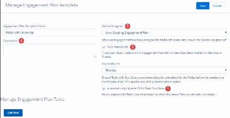

Edit Tasks on an Engagement Plan Template

If you need to make adjustments to the Engagement Plan Template, visit the Template record and click

Edit.

Important Changes to the Template are not reflected in Engagement Plans created from the

Template that are already assigned to records.

Assign an Engagement Plan to a Record

Associate an Engagement Plan to a record.

11.. Navigate to the record where you'd like to create an Engagement Plan. For our example, it's a $50,000

donation that came in that should follow the Major Donor plan.

22.. Click New Engagement Plan on the Engagement Plan related list.

33.. The associated record (for our example, the Opportunity) should automatically be populated.

Note You can only associate an Engagement Plan to a single record. If you try to connect an

Engagement Plan to multiple records at the same time, such as Opportunity and Contact, you'll

get an error message.

44.. Click Save. Notice the Tasks from the Template now appear on the Engagement Plan record with the

appropriate due dates and assignments. All of which are attached to the associated Opportunity

391

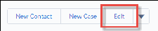

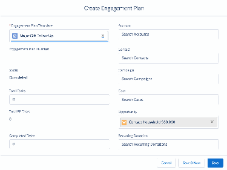

record, so that your team can begin the stewardship plan.

You also see the Engagement Plan listed on the associated record's Engagement Plan related list.

Execute the Engagement Plan

With the tasks assigned, your team is ready to execute the carefully crafted process this Engagement Plan

supports. Tasks will show up on your team members' Home Page task lists and in reports. As they

complete tasks, users should update the Task to a status of Completed.

To learn more about how Activity and Task records work, see Activities in Salesforce Help & Training.

Dependent Tasks: When you complete a Task with a dependent Task, the dependent Task's status is

automatically updated from Waiting on Dependent Task to Not Started.

Engagement Plan: As soon as you complete a single Task, the Status on the Engagement Plan updates

from Not Started to In Progress. When the last Task is completed, the Status on the Engagement Plan is

updated to Complete.

392

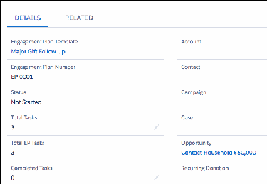

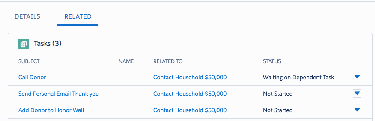

Delete an Engagement Plan

When you delete an Engagement Plan, the underlying tasks still exist, but task automation is not

enforced for dependent tasks (dependent tasks won't be updated or assigned based on parent task

completion). You can restore the Engagement Plan from the Recycle Bin, and task automation will

resume.

11.. Navigate to the record that the Engagement Plan is assigned to.

22.. Scroll to the Engagement Plan related list.

33.. In the row for the Engagement Plan, click , then click Delete.

The Engagement Plan is sent to the Recycle Bin. You can manually delete the tasks if you don't need

them or if the Engagement Plan was assigned by mistake.

Note Special thanks to Melissa Barber, who also contributed to this documentation.

Create and Manage Levels

NPSP Levels give you a way to track a constituent's level of commitment and engagement based on

criteria such as total gifts or number of hours volunteered. Create and manage NPSP Levels based on

your organization's practices.

Note Watch the Nonprofit Salesforce How-To Series videos about Levels and Levels With

Engagement Plans.

Note Administrators: If this feature isn't configured in your org, or something seems to be missing,

see the Feature Configuration Overview for a list of major features in NPSP and how to configure

them.

Overview

NPSP Levels give you a way to track a constituent's level of commitment and engagement based on

criteria such as total gifts or number of hours volunteered.

Create a Level Structure

Create Level records to set up a Level structure to track constituent engagement.

Manually Recalculate Levels

Due to the processing involved, Level values are not applied instantly to Contacts, Accounts, and other

objects for which Levels have been configured to display. Instead, Level values are updated as part of a

nightly batch process.

Overview

NPSP Levels give you a way to track a constituent's level of commitment and engagement based on

criteria such as total gifts or number of hours volunteered.

393

For example, you could define Levels for donors based on the total gifts they've donated over time. A

donor who's donated $0 to $100 dollars would be at the Bronze Level, $101 - $1000 at the Silver Level,

$1001 - $10,000 at the Gold Level, and so on.

This information is important for helping to recognize milestones and determine how to continue

building on and fostering the relationship.

In addition, Levels work with Engagement Plans so nonprofits are able to outline what, who, how, and

how often to communicate with the constituent and keep them moving up the ladder of engagement.

Here's an example of a Level structure for Accounts:

Note Don't let the field names scare you! NPSP provides drop-downs to choose from when you

define and edit your Levels.

Once the Level structure is in place, a nightly batch job updates the Level values on records for any

objects you've configured to display Level data.

For more information on configuring level data to display on Accounts, Contacts, or other objects, see

Configure Levels.

Create a Level Structure

Create Level records to set up a Level structure to track constituent engagement.

11.. Click the Levels tab. (If you don't see it, click , then search for Levels.)

22.. Click New.

394

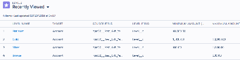

Level Name (1)—The Name that will appear in the Level field on the Account, Contact, or other object

you choose. You must type in a name before you can enter any other fields.

Note If you select the Target object before entering a name, you won't see values in any of the

other drop-down fields. To fix this issue, clear all of the fields and enter the Level Name. You'll

then be able to select a Target object and other values.

Target (2)—The object that this Level applies to. Select Account, Contact, or another object for which

Level values have been configured to display.

Note By default, the available Target values are Account and Contact. See Configure Levels for

information on configuring Levels for other objects.

Source Field (3)—The field that will be totaled across all records to determine what Level the Contact

or Account is in. For our example, we selected Total Gifts (a currency field), however, you can select

any currency or number field.

Level Field (4)—The custom field where you want the Level stored. Check with your administrator if

you're not sure what to select here.

Previous Level Field (5)—This field is optional. It stores the previous Level value if the Level changes.

Check with your administrator if you're not sure what to select here.

Minimum and Maximum Amount (6)—This defines the range of this Level. You can leave Minimum

blank to cover all up to (but not including) the Maximum Amount. Likewise, you can leave Maximum

Amount blank to cover all amounts over (and including) the Minimum Amount (such as your very top

level). Remember, Amount is not necessarily currency.

Engagement Plan Template (7)—If you want to have a series of Task Activities that are automatically

generated when a Contact or Account reach a certain Level, this is where you would select that

395

Engagement Plan. See Create and Manage Engagement Plans for information on configuring and

using Engagement Plans.

Make sure Active is checked and give your Level an appropriate Description (8).

33.. If this is the first Level you're creating, click Save & New. This will automatically clone the existing Level

and adjust the Maximum and Minimum values. Just give the new Level a name. You can very quickly

set up a series of Levels this way. Click Save on the final Level.

Manually Recalculate Levels

Due to the processing involved, Level values are not applied instantly to Contacts, Accounts, and other

objects for which Levels have been configured to display. Instead, Level values are updated as part of a

nightly batch process.

To manually update Level values for all records, see Run Level Assignment Batch.

Note Since NPSP automatically calculates Level values on Accounts, Contacts, and other objects, it's

important that you never directly update a Level field value on those objects.

General NPSP Administration

Read more about the general NPSP administration tasks.

Change My Account Model

The default account model for Nonprofit Success Pack is the Household Account model, which is the

account model we strongly recommend. Only experienced Salesforce Administrators should consider

changing an organization's account model.

Customize Labels

A Custom Label is text that can be accessed by an app, such as Nonprofit Success Pack, for a variety of

purposes. The advantage of a Custom Label is that the text can be translated into any language that

Salesforce supports.

Create and Update Campaign Members Through an Opportunity

Configure NPSP to automatically add a Contact to a Campaign when you enter a donation.

Delete Deprecated Items from Your NPSP Org

Nonprofit Success Pack has changed over the years. As we improve the product, there are inevitably

deprecated items that are no longer required and as part of our cleanup efforts, we mark items for

deletion so that you can safely remove them from your org if you'd like to. Keep in mind that you don't

have to remove them—these deprecated items won't have any impact on your org.

Disable NPSP Contact Role Automation

There may be instances where you need to disable the NPSP automation that creates Opportunity

Contact Roles on selected Opportunities. You may wish to do this so you can create or update Contact

Roles yourself, using your own business logic.

Edit or Reschedule NPSP Scheduled Jobs

396

Find out more about editing or rescheduling NPSP scheduled jobs.

Keep Up With NPSP and Salesforce Releases

Stay informed about Salesforce.org product updates and release schedule.

Manually Process Batch Jobs

NPSP includes scheduled batch jobs that are designed to calculate rollups and keep your data clean.

Run any of these jobs manually if you need to perform these tasks before the next scheduled run of

the batch job.

NPSP Data Management Best Practices

Improve data quality and learn data management best practices with these documentation articles

and videos.

Phone and Email Workflow Rules

This article provides more information about the phone and email workflow rules that come with the

Nonprofit Success Pack.

Run a Health Check in Your Org

Health Check looks through your org for both data and configuration inconsistencies or errors and

reports back the type of error along with a description.

Shield Platform Encryption Compatibility with NPSP

Find out more about Shield Platform Encryption compatibility.

Change My Account Model

The default account model for Nonprofit Success Pack is the Household Account model, which is the

account model we strongly recommend. Only experienced Salesforce Administrators should consider

changing an organization's account model.

Important If you have existing Contact information in Salesforce that you entered using one of the

older account models, develop a migration plan before switching over to the Household Account

model. For more information about our account model migration tool, see Convert to the Nonprofit

Success Pack Household Account Model.

To change your account model:

11.. From App Launcher ( ), find and select NPSP Settings.

22.. Click People | Account Model.

33.. Click Edit, and make your selection.

44.. Click Save.

Customize Labels

A Custom Label is text that can be accessed by an app, such as Nonprofit Success Pack, for a variety of

397

purposes. The advantage of a Custom Label is that the text can be translated into any language that

Salesforce supports.

Note Watch the Nonprofit Salesforce How-To Series video about Customizing Labels.

Overview

A Custom Label is text that can be accessed by an app, such as Nonprofit Success Pack, for a variety of

purposes. NPSP uses Custom Labels for error messages or to set a Stage value for Open Recurring

Donations. The advantage of a Custom Label is that the text can be translated into any language that

Salesforce supports, even English.

Setup—Before You Begin

Before you can translate your custom labels or override labels in NPSP packages, you need to enable

the Translation Workbench.

Edit Code Custom Labels

Text found in NPSP custom interfaces, such as NPSP Settings and Manage Household, are stored in

Custom Labels.

Edit Standard Labels and Objects

You can edit most standard tab, field, and object labels to make them better fit in your organization.

Override NPSP Field Labels

NPSP comes with many custom fields, button, and related lists. You may need to edit the labels for

these items to meet your needs. For example, you may want to change the Alternate Email field on the

Contact to Other Email.

Overview

A Custom Label is text that can be accessed by an app, such as Nonprofit Success Pack, for a variety of

purposes. NPSP uses Custom Labels for error messages or to set a Stage value for Open Recurring

Donations. The advantage of a Custom Label is that the text can be translated into any language that

Salesforce supports, even English.

The NPSP packages also contain custom field labels that you may need to edit to make them fit in your

organization.

Note If you edit NPSP labels, they won't match what is documented for NPSP.

Although you can't directly edit custom labels, you can work around this using the Translation

Workbench. The Translation Workbench is a tool that you can use to enable different languages. By

enabling “English” as a language in the Translation Workbench, you can then “translate” custom labels

into English and use those translated versions in place of the out-of-box labels.

Setup—Before You Begin

Before you can translate your custom labels or override labels in NPSP packages, you need to enable the

398

Translation Workbench.

11.. Click , then click Setup.

22.. From Setup, enter Translation in the Quick Find box, then select Translation Language Settings.

33.. Click Enable.

Now that the Workbench is enabled, activate the English language so that you can customize your NPSP

labels.

11.. Click Edit next to English.

22.. Check the Active box.

33.. Select the users that will customize the labels and move them to the Selected List.

44.. Click Save.

Edit Code Custom Labels

Text found in NPSP custom interfaces, such as NPSP Settings and Manage Household, are stored in

Custom Labels.

This is different than the labels on field names, which we'll cover next. There are also Custom Labels

which control how NPSP functions. For example, you may want to change the out-of-box Stage for open

Recurring Donations from Pledged to Not Received.

11.. Click , then click Setup.

22.. From Setup, enter Custom Labels in the Quick Find box, then select Custom Labels under the User

Interface menu.

33.. Find the label you want to change and click on the Label Name.

44.. Click New Local Translations/Overrides.

55.. Select English from the Language menu and enter the label you want to use.

66.. Click Save.

Go to the page that contains the custom label and confirm that your translated value shows up. You may

need to refresh the page to see your updates. For our example, we'll go to the Opportunity to see the

updated Stage for the Recurring Donation.

Edit Standard Labels and Objects

You can edit most standard tab, field, and object labels to make them better fit in your organization.

11.. Click , then click Setup.

22.. From Setup, enter Rename Tab , then select Rename Tabs and Labels.

33.. Click Edit next to the object.

44.. Leave the object name labels as they are and click Next.

55.. Update the field labels, then click Save.

For more information on renaming standard tabs and labels, see Rename Object, Tab, and Field Labels in

399

Salesforce Help.

Override NPSP Field Labels

NPSP comes with many custom fields, button, and related lists. You may need to edit the labels for these

items to meet your needs. For example, you may want to change the Alternate Email field on the Contact

to Other Email.

11.. Locate the package where the field originated.

aa.. Click , then click Setup.

bb.. Click the Object Manager tab.

cc.. Click on the name of the object that includes the field. For example, if you were looking for the

Alternate Email field, you would click Contact.

dd.. Click Fields & Relationships.

ee.. Find the field and click on the Field Label.

ff.. In the Package Information section, you'll see the Installed Package name.

22.. From Setup, enter Override in the Quick Find box, then select Override under the Translation

Workbench menu.

33.. Choose the Package that contains your field. (If you don't have this, refer back to step 1.)

44.. Select English as the language.

55.. Select Custom Field for the Setup Component.

Note You will most likely be changing field labels, but there are other components you may want

to rename, such as buttons and links.

66.. Select the appropriate object. This is the object where you see the field.

77.. Select Field Label for the Aspect. Note that you can also edit Related List labels.

88.. Find the field whose label you want to edit and double-click the Field Label Override field.

99.. Enter a new label and click Save.

When you view the appropriate record, you'll see the new label.

Create and Update Campaign Members Through an Opportunity

Configure NPSP to automatically add a Contact to a Campaign when you enter a donation.

Note Watch the Nonprofit Salesforce How-To Series video about Automatic Campaign Member

Management.

Note This article assumes you're familiar with how Campaigns work in Salesforce. If you're not

already familiar with Salesforce Campaigns, see What are Campaigns and How Do They Work? Also

see the Campaigns documentation.

Campaign Members and Opportunities Overview

Nonprofit Success Pack includes many automatic campaign actions triggered by opportunities. For

example, campaign member statuses are automatically updated when a related opportunity is closed.

400

Setup—Before You Begin

To automatically create Campaign Members through an Opportunity, you need to ensure that your org

is set up to do so.

Create Campaign Members Through an Opportunity

When you specify a Contact as the Opportunity's Primary Contact, NPSP automatically adds that

Contact as a Campaign Member to the Opportunity's related Campaign.

Update Campaign Member Status Through an Opportunity

You can automatically update Campaign Member Status, right from the Opportunity object as well.

Opportunity Stages, Campaign Member Statuses, and Actions on the Campaign

The Opportunity's Stage and the value in the Opportunity's Primary Contact Campaign Member Status

field determine the behavior of the Campaign Member record. If the Contact is not already a Member

of the Campaign, Salesforce creates a new Campaign Member record. Otherwise, Salesforce updates

the existing Campaign Member record for the Contact.

Campaign Members and Opportunities Overview

Nonprofit Success Pack includes many automatic campaign actions triggered by opportunities. For

example, campaign member statuses are automatically updated when a related opportunity is closed.

Let's say you want to make an appeal to a bunch of Campaign contacts. Your organization makes the

appeal and the donations come in. Wouldn't it be nice to be able to enter those Opportunity donations

in Salesforce and have the contacts' Campaign Member Statuses updated automatically, on the

Campaign? The Nonprofit Success Pack does that for you, and much more, with actions triggered by the

Opportunity Stage, Primary Contact, Primary Campaign Source, and Primary Contact Campaign Member

Status fields on the Opportunity object. Great!

Campaigns are related to Opportunities through the Primary Campaign Source field on the Opportunity:

401

The Primary Contact Campaign Member Status field lets you specify the Member Status for that Contact

on that related Campaign. Here's what it looks like on the Campaign's Campaign Members related list:

Setup—Before You Begin

To automatically create Campaign Members through an Opportunity, you need to ensure that your org is

set up to do so.

There are three settings in NPSP Settings that control this feature:

•

Automatic Campaign Member Management

•

Campaign Member Responded Status

•

Campaign Member Non Responded Status

To access or change these settings:

11.. Click the NPSP Settings tab. If you don't see the tab, find it in the App Launcher ( ).

402

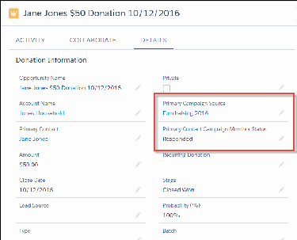

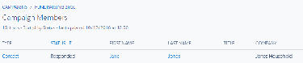

22.. Click Donations, then click Campaign Members.

33.. Select Automatic Campaign Member Management.

44.. Optionally, enter a Campaign Member Responded Status. The value entered is used as the default for

ALL Campaign Members that are automatically added or updated through Automatic Campaign

Member Management. If you leave this field blank, Salesforce uses the first status marked as

"Responded" in your list of Campaign Member Statuses. If you enter a value that doesn't already exist

in your list of Statuses, it will be added to the list.

55.. Optionally, enter a Campaign Member Non Responded Status. The value entered is used as the

default for ALL Campaign Members that are automatically added or updated through Automatic

Campaign Member Management. If you leave this field blank, Salesforce uses the first status that is

NOT marked as "Responded" in your list of Campaign Member Statuses. If you enter a value that

doesn't already exist in your list of Statuses, it will be added to the list.

Note If you require different statuses for different Campaigns, we recommend that you leave this

field blank and carefully curate the Campaign Member Statuses for each of your Campaigns. To

manage Campaign Members Statuses, navigate to your Campaign and click the Campaign

Members Statuses related list.

66.. Click Save.

Create Campaign Members Through an Opportunity

When you specify a Contact as the Opportunity's Primary Contact, NPSP automatically adds that Contact

as a Campaign Member to the Opportunity's related Campaign.

11.. Enter your new Opportunity donation, and specify a Primary Contact.

22.. Specify the Campaign to which you want to add this contact.

33.. (Optional) Set the Primary Contact Campaign Member Status if you want to set their status in the

Campaign as well. See below for more details.

Update Campaign Member Status Through an Opportunity

You can automatically update Campaign Member Status, right from the Opportunity object as well.

11.. Locate an existing Opportunity donation with a Primary Contact.

22.. Set the Primary Contact Campaign Member Status. See below for more details.

Opportunity Stages, Campaign Member Statuses, and Actions on the

Campaign

The Opportunity's Stage and the value in the Opportunity's Primary Contact Campaign Member Status

field determine the behavior of the Campaign Member record. If the Contact is not already a Member of

the Campaign, Salesforce creates a new Campaign Member record. Otherwise, Salesforce updates the

existing Campaign Member record for the Contact.

Closing an open Opportunity with a blank Primary Contact Campaign Member Status field will also

403

update the member's status. For example, if the Opportunity Stage is an Open value and the Primary

Contact Campaign Member Status field is blank, then Salesforce will assign the first non-Responded

value to the Campaign Member. If you later update the Opportunity to a Closed/Won stage, then

Salesforce will automatically update the Campaign Member to the first Responded value.

You can use omit in the Primary Contact Campaign Member Status field to leave the Contact's current

Campaign Member Status is unchanged.

The following table shows Campaign Member actions as they relate to Opportunity stage types and

Primary Contact Campaign Member Status values:

Opportunity Stage Type Opportunity Primary Campaign Member Action

Contact Campaign

Member Status Value

Closed/Won blank Contact's Campaign Member Status updated

with Campaign's first Responded value.

Open blank Contact's Campaign Member Status updated

with Campaign's first non-Responded value.

Any omit Contact's current Campaign Member Status is

left unchanged. If the Contact is not already a

Member of the Campaign, no Campaign

Member record is created.

Any Any text value

If the Campaign Member Status does not

already exist, Salesforce creates it. Contact's

Member Status is updated to this value.

Note You can edit the Campaign Member

Status to a Responded value by going to

the Campaign record, clicking the

Advanced Setup button (in Salesforce

Classic only), and editing the status to

check Responded. The Campaign

Member records will update to match.

Delete Deprecated Items from Your NPSP Org

Nonprofit Success Pack has changed over the years. As we improve the product, there are inevitably

deprecated items that are no longer required and as part of our cleanup efforts, we mark items for

deletion so that you can safely remove them from your org if you'd like to. Keep in mind that you don't

have to remove them—these deprecated items won't have any impact on your org.

We strongly recommend you delete the metadata in an upgraded Sandbox org and test your daily

404

processes before deleting in an upgraded production org.

These items can include:

•

Custom Fields in Objects or Settings

•

Custom Settings

•

Reports

•

Static Resources

•

Tabs

•

Visualforce Pages

Important You will only be able to delete packaged fields that have been marked for deletion by

Salesforce.org.

Remove Custom Fields in Objects

Learn how to remove custom fields in objects.

Remove Custom Fields in Custom Settings

Learn how to delete custom fields in custom settings.

Remove Custom Settings

Learn how to remove custom settings.

Remove Custom Tabs

Learn how to remove custom tabs.

Remove Lightning Components

Remove any deprecated Lightning Components from your org.

Remove Static Resources

Learn how to remove static resources.

Remove Visualforce Pages

Learn how to delete visualforce pages.

Items That Are Safe to Remove

The following items are safe to remove. The list is organized by type.

Remove Custom Fields in Objects

Learn how to remove custom fields in objects.

11.. In Setup, click the Object Manager tab, then click the object whose fields you want to remove.

22.. Click Fields & Relationships.

33.. Next to the field you want to remove, click , then click Delete. Note that you'll only see a Delete link

next to fields that are safe to delete.

Remove Custom Fields in Custom Settings

Learn how to delete custom fields in custom settings.

405

11.. In Setup, enter Custom Settings in the Quick Find box, then click Custom Settings.

22.. Click the name of the Custom Setting that has fields you want to remove.

33.. Click Del next to the field.

Remove Custom Settings

Learn how to remove custom settings.

11.. In Setup, enter Custom Settings in the Quick Find box, then click Custom Settings.

Note You may have a large number of custom settings. If so, we recommend sorting by the

Namespace column so that you can easily find the right settings to remove.

22.. Click Delete next to the Custom Setting you want to remove.

Remove Custom Tabs

Learn how to remove custom tabs.

11.. In Setup, enter Tabs in the Quick Find box, then click Tabs.

22.. Click Del next to the tab you want to remove.

Remove Lightning Components

Remove any deprecated Lightning Components from your org.

11.. In Setup, enter Lightning Components in Quick Find, then click Lightning Components.

22.. Click Del next to the component you want to remove.

Remove Static Resources

Learn how to remove static resources.

11.. In Setup, enter Static in the Quick Find box, then click Static Resources.

22.. Click Del next to the Static Resource you want to remove.

Remove Visualforce Pages

Learn how to delete visualforce pages.

11.. In Setup, enter Visualforce Pages in the Quick Find box, then click Visualforce Pages.

22.. Click Del next to the page you want to remove.

406

Items That Are Safe to Remove

The following items are safe to remove. The list is organized by type.

Type Name Namespace

Custom Setting DEPRECATED-RD Error Queue npe03

Custom Setting Fields Recurring Donations Settings Field: npe03

DEPRECATED-Disable Sched of Nightly Job

Custom Setting Fields Recurring Donations Settings npe03

Field:DEPRECATED-Nightly Update ID

Custom Setting Fields Recurring Donations Settings npe03

Field:DEPRECATED-Has Package Update

Custom Setting Fields Recurring Donations Settings npe03

Field:DEPRECATED-Package Update URL

Custom Setting Fields Recurring Donations Settings npe03

Field:DEPRECATED-Max Package Version

Custom Setting Fields Recurring Donations Settings npe03

Field:DEPRECATED-Last Update Check

Custom Tab Recurring Donations Settings npe03

Lightning Component utilCustomErrors npsp

Static Resource ArborJS.resource npe4

Static Resource AToolTip.resource npe4

Visualforce Page RecurringDonationsSettings npe03

Visualforce Page RecurringDonations_AddDonationsBTN npe03

Disable NPSP Contact Role Automation

There may be instances where you need to disable the NPSP automation that creates Opportunity

Contact Roles on selected Opportunities. You may wish to do this so you can create or update Contact

Roles yourself, using your own business logic.

Common use cases include:

•

Data migration

•

ETL operations

•

Custom code execution

•

Custom integration

407

•

Opportunity records where the Primary Contact needs to be updated several times. For example, on

long term family foundation gifts, corporate gifts, or grants.

NPSP includes a checkbox field called Disable Contact Role Automation on the Opportunity object.

When you select the field on a given record, it disables several aspects of NPSP Opportunity Contact Role

automation. After you have finished making your own Contact Role updates, you may wish to deselect

the field to return automation functionality to that record.

Note Because Disable Contact Role Automation disables important NPSP functionality, you may not

want to put the field on any page layouts. Misunderstanding how the field works could result in

incorrect or duplicate Contact Roles. If you do need to put the field on a page layout, you can

control access to it through a permission set.

Disable Contact Role Automation disables NPSP's automatic creation of Opportunity Contact Roles when

there are changes to the:

•

Opportunity Primary Contact field

•

Opportunity Notification Recipient Contact field

•

Honoree Contact field

•

Household members on the related Opportunity Account

•

Related Opportunity Contact Role on Relationship records

•

Related Opportunity Contact Role on Affiliation records

Disable Contact Role Automation does not disable automation related to Partial Soft Credits, Matching

Gifts, automation from other installed packages, or your own customizations.

Understand Rollup Implications

Although Disable Contact Role Automation disables NPSP's automatic creation of Opportunity Contact

Roles, Opportunity (Donation) rollups are not disabled. There are different implications depending on

what kind of rollups your organization uses.

Customizable Rollups will rollup data to the Contact selected in the Opportunity Primary Contact field

even if no Opportunity Contact Role is present. Legacy and User Defined rollups work only on

Opportunity Contact Roles.

NPSP Batch Jobs

The following batch operations in NPSP Settings are not affected by the Disable Contact Role

Automation field. These operations will modify Opportunity Contact Roles on Opportunities regardless

of whether the Disable Contact Role Automation field is selected.

•

Remove Duplicate Primary OCRs

408

Edit or Reschedule NPSP Scheduled Jobs

Find out more about editing or rescheduling NPSP scheduled jobs.

View Scheduled Jobs

Nonprofit Success Pack (NPSP) updates summary fields on records overnight based on a number of

Scheduled Jobs that you can review and reschedule.

Change Scheduled Jobs User

If your listed Submitted By user is not an active Salesforce user, Administrators will receive an email

with error messages when NPSP runs scheduled jobs, and nightly rollups and other records won't be

updated correctly. Here's how to resolve this issue so that batches roll up correctly each night.

Schedule or Reschedule Nightly Jobs

NPSP automatically runs the default batch jobs overnight in order to pose the least disruption to your

organization. If you do not like the scheduled Start Times assigned, you can delete the existing

Scheduled Job and create a new Scheduled Job at your preferred time.

Change a Job Batch Size

You can change the batch size for some NPSP jobs.

Default Batch Job Names and Apex Classes

Learn what the NPSP jobs and apex classes are used for.

View Scheduled Jobs

Nonprofit Success Pack (NPSP) updates summary fields on records overnight based on a number of

Scheduled Jobs that you can review and reschedule.

You can view these jobs in Setup. Simply enter Scheduled Jobs in the Quick Find box, then select

Scheduled Jobs.

Change Scheduled Jobs User

If your listed Submitted By user is not an active Salesforce user, Administrators will receive an email with

error messages when NPSP runs scheduled jobs, and nightly rollups and other records won't be updated

correctly. Here's how to resolve this issue so that batches roll up correctly each night.

11.. Click Del to the left of any Job Name that has an inactive Submitted By user.

22.. Click the NPSP Settings tab. If you don't see the tab, find it in the App Launcher ( ).

33.. Click Bulk Data Processes | Batch Process Settings (doing this actually recreates all the default jobs),

and make sure Don't Auto Schedule Default NPSP Jobs is not selected.

Note If you don't see the NPSP Settings tab in your org, you can find it in the App Launcher.

44.. Return to the Scheduled Jobs page in Setup and confirm that the default Scheduled Jobs appear,

marked as submitted by you or another Active user.

55.. Go back to the NPSP Settings tab, Bulk Data Processes, and run the following batches to have NPSP

409

make updates as expected:

••

Rollup Donations Batch

••

Rollup Allocations Batch

••

Recurring Donations Batch

••

Level Assignment Batch

Schedule or Reschedule Nightly Jobs

NPSP automatically runs the default batch jobs overnight in order to pose the least disruption to your

organization. If you do not like the scheduled Start Times assigned, you can delete the existing

Scheduled Job and create a new Scheduled Job at your preferred time.

Note One job, NPSP 00 - Error Processing, is scheduled to run hourly. This is intentional and does

not use unnecessary resources in your organization. You should not delete/reschedule this job. If

deleted, you can go to the NPSP Settings tab to automatically recreate it as documented above.

Some NPSP jobs aren't automatically scheduled, but are available to be scheduled. For a list of these

jobs, see Schedule NPSP Batch Jobs.

To schedule a job or reschedule jobs to a preferred time:

11.. If you're rescheduling an existing scheduled job, you must delete the scheduled job first. If you're

scheduling a job for the first time, skip this step.

aa.. From Setup, enter Scheduled Jobs in the Quick Find box, then select Scheduled Jobs.

bb.. Click Del to the left of the Scheduled Job you wish to reschedule.

22.. From Setup, enter Apex Classes in the Quick Find box, then select Apex Classes.

33.. Click Schedule Apex and fill out the fields:

Job Name

Use the Job Name found in Default Batch Job Names and Apex Classes.

Apex Class

Click the Lookup icon and select the corresponding Apex Class.

Frequency

To run each night, select Weekly and then the days of the week. For example, to run each

weekday night and not run on weekends, select Monday, Tuesday, Wednesday, Thursday and

Friday.

Start Date

Select the day you would like to start; ideally today.

End Date

Select a date many years in the future. For example, change the year to 2036.

410

Preferred Start Time

Select your preferred time from the drop down menu.

44.. When you're finished, click Save.

55.. Return to the Scheduled Jobs listing (search Scheduled Jobs in Setup) and confirm that your jobs are

ready to go at the time you want.

Change a Job Batch Size

You can change the batch size for some NPSP jobs.

Some examples of why you might update the batch size include:

•

If a job is taking too long, increase the batch size in increments of 25 or 50 and assess the impact.

•

If you're hitting governor limit errors for a particular job, decrease the batch size.

Batch Sizes are set in NPSP Settings. Simply go to the appropriate location (as listed in the table below)

and update the Batch Size field.

Batch Job Where to Change It

Level Assignment Batch NPSP Settings | Bulk Data Processes | Batch Process Settings

Recurring Donations NPSP Settings | Recurring Donations | Recurring Donations

Batch

Rollups Donations NPSP Settings | Bulk Data Processes | Batch Process Settings

Batches

Default Batch Job Names and Apex Classes

Learn what the NPSP jobs and apex classes are used for.

Job Name Apex Class Notes

NPSP 00 - Error Processing ERR_AsyncErrors_SCHED

NPSP 01 - Opportunity RLLP_OppAccRollup_BATCH For legacy NPSP and User

Account Rollups Defined Rollups

NPSP 01A - Customizable CRLP_Account_BATCH For Customizable Rollups

Rollups - Account Hard only

Credit

NPSP 01B - Customizable CRLP_AccountSkew_BATCH For Customizable Rollups

Rollups - Account Hard only

Credit Skew

411

Job Name Apex Class Notes

NPSP 02 - Opportunity RLLP_OppContactRollup_BATCH For legacy NPSP and User

Contact Rollups Defined Rollups

NPSP 02A - Customizable CRLP_Contact_BATCH For Customizable Rollups

Rollups - Contact Hard only

Credit

NPSP 02B - Customizable CRLP_ContactSkew_BATCH For Customizable Rollups

Rollups - Contact Hard only

Credit Skew

NPSP 03 - Opportunity RLLP_OppHouseholdRollup_BATCH For legacy NPSP and User

Household Rollups Defined Rollups

NPSP 03A - Customizable CRLP_Account_SoftCredit_BATCH For Customizable Rollups

Rollups - Account-level only

Contact Soft Credit

NPSP 03B - Customizable CRLP_Account_AccSoftCredit_BATCH For Customizable Rollups

Rollups - Account Soft only

Credit

NPSP 03C - Customizable CRLP_AccountSkew_SoftCredit_BATCH For Customizable Rollups

Rollups - Account-level only

Contact Soft Credit Skew

NPSP 03D - Customizable CRLP_AccountSkew_AccSoftCredit_BATCH For Customizable Rollups

Rollups - Account Soft only

Credit Skew

NPSP 04 - Opportunity Soft RLLP_OppSoftCreditRollup_BATCH For legacy NPSP and User

Credit Rollups Defined Rollups

NPSP 04A - Customizable CRLP_Contact_SoftCredit_BATCH For Customizable Rollups

Rollups - Contact Soft only

Credit

NPSP 04B - Customizable CRLP_ContactSkew_SoftCredit_BATCH For Customizable Rollups

Rollups - Contact Soft only

Credit Skew

NPSP 05 - GAU Allocation ALLO_Rollup_SCHED For legacy NPSP and User

Rollups Defined Rollups

NPSP 05 - Customizable CRLP_GAU_BATCH For Customizable Rollups

Rollups - General only

Accounting Units

NPSP 06 - Enhanced RD2_OpportunityEvaluation_BATCH For Enhanced Recurring

412

Job Name Apex Class Notes

Recurring Donations Donations only

Updates

NPSP 06 - Recurring RD_RecurringDonations_BATCH For legacy Recurring

Donation Updates Donations only

NPSP 06A - Customizable CRLP_RD_BATCH For Customizable Rollups

Rollups - Recurring only

Donations

NPSP 06B - Customizable CRLP_RDSkew_BATCH For Customizable Rollups

Rollups - Recurring only

Donations Skew

NPSP 07 - Seasonal Address ADDR_Seasonal_SCHED

Updates

NPSP 08 - Level Assignment LVL_LevelAssign_SCHED

Updates

NPSP 09 - Data Import BDI_DataImportBatch_SCHED

Batch Processing

A note about Skew jobs . . .

You may notice that some of the Customizable Rollups jobs contain the term Skew. Skew jobs are used

when there are many records related to a single record, for instance, many Allocations related to a single

General Accounting Unit. Without skew jobs, GAU rollup calculations might fail when there were too

many associated donations. Customizable Rollups use skew jobs to process these skewed records

separately so that rollup jobs can complete successfully.

Schedule NPSP Batch Jobs

Some batch jobs can be scheduled. You can manually schedule them using the Apex class, but they

aren't scheduled by default.

SScchheedduullee NNPPSSPP BBaattcchh JJoobbss

Some batch jobs can be scheduled. You can manually schedule them using the Apex class, but they

aren't scheduled by default.

For instructions on how to schedule jobs, see Schedule or Reschedule Nightly Jobs.

•

OPP_OpportunityNaming_BATCH

Keep Up With NPSP and Salesforce Releases

Stay informed about Salesforce.org product updates and release schedule.

413

As an admin, keeping up with releases is an important part of the job. Staying up-to-date on frequent

product releases means anticipating when your orgs will get updated, staying informed about what’s

included in each release, and forming a strategy for testing and implementing new features.

To stay informed about updates to the Salesforce.org products you use, we recommend joining the

Nonprofit Release Readiness group in the Trailblazer community.

For detailed information on how to keep up with releases, see:

•

Keep Up With Salesforce.org Releases

•

Keep Up With Salesforce.com Releases

Manually Process Batch Jobs

NPSP includes scheduled batch jobs that are designed to calculate rollups and keep your data clean. Run

any of these jobs manually if you need to perform these tasks before the next scheduled run of the batch

job.

Run Rollup Donations Batch

The Rollup Donations Batch recalculates all Account and Contact hard credit and soft credit rollups,

and all Recurring Donation rollups. Rollups are calculated in batch jobs as part of the nightly build. If

you need the rollups updated sooner, manually run the batch process that recalculates them.

Run Rollup Allocations Batch

Manually run the Rollup Allocations Batch to recalculate Allocation rollup data for all General

Accounting Units.

Batch Create Default Allocations

Use the Batch Create Default Allocations process to create default Allocations for all existing

Opportunities, except Opportunities excluded in the GAU Allocations Rollup Settings.

Create Missing Payments

If you have Opportunities that are missing Payment records (for example, if you've previously disabled

Payments), run a batch process to create the Payment records.

Refresh Household Data

Keep Household names up-to-date by refreshing Household Names after Household Name formatting

changes, and by recalculating the value in the All Household Members Deceased field on Household

Accounts.

Refresh Opportunity Names

Refresh the names of all preexisting, matching Opportunities once you've specified your custom

Opportunity naming convention.

Refresh Opportunity Primary Contact

To ensure that the Primary Contact is in sync with the Opportunity Contact Role marked Primary for all

Opportunities, refresh all Opportunity Primary Contacts.

Run Recurring Donations Batch

The Recurring Donations Batch process runs every night to create any additional Opportunities needed

for Recurring Donations. We recommend running this batch process manually if you change your

414

Recurring Donation settings.

Run Level Assignment Batch

Run the Level Assignment Batch to recalculate Levels for Accounts and Contacts.

Remove Duplicate Primary Opportunity Contact Roles

Opportunities with more than one Opportunity Contact Role marked as primary can cause problems

with Opportunity rollups. Run the Remove Duplicate Primary OCRs batch process to remove duplicate

Primary Opportunity Contact Roles.

Run Rollup Donations Batch

The Rollup Donations Batch recalculates all Account and Contact hard credit and soft credit rollups, and

all Recurring Donation rollups. Rollups are calculated in batch jobs as part of the nightly build. If you

need the rollups updated sooner, manually run the batch process that recalculates them.

The Rollup Donations Batch recalculates all Account and Contact hard credit and soft credit rollups, and

all Recurring Donation rollups. Rollups are calculated in batch jobs as part of the nightly build.

If you need the rollups updated sooner, you can manually run the batch process that recalculates them:

11.. Click the NPSP Settings tab. If you don't see the tab, find it in the App Launcher ( ).

22.. Click Bulk Data Processes | Rollup Donations Batch.

33.. Click Run Batch. The process may take some time, but it's safe to leave the page and come back later

to check the results.

Run Rollup Allocations Batch

Manually run the Rollup Allocations Batch to recalculate Allocation rollup data for all General Accounting

Units.

To recalculate Allocation rollup data for all General Accounting Units:

11.. Click the NPSP Settings tab. If you don't see the tab, find it in the App Launcher ( ).

22.. Click Bulk Data Processes | Rollup Allocations Batch.

33.. Click Run Batch.

Batch Create Default Allocations

Use the Batch Create Default Allocations process to create default Allocations for all existing

Opportunities, except Opportunities excluded in the GAU Allocations Rollup Settings.

Use the Batch Create Default Allocations process to create default Allocations for all existing

Opportunities (except Opportunities excluded in the GAU Allocations Rollup Settings.)

415

First, verify that you've enabled Default Allocations and selected a default General Accounting Unit:

11.. Click the NPSP Settings tab. If you don't see the tab, find it in the App Launcher ( ).

22.. Click Donations | GAU Allocations.

33.. Verify that Default Allocations Enabled is selected, and that one of your General Accounting Units has

been selected as default:

Once you've verified the Default Allocation Settings, you can batch create default Allocations:

11.. Click the NPSP Settings tab. If you don't see the tab, find it in the App Launcher ( ).

22.. Click Bulk Data Processes | Batch Create Default Allocations.

33.. Click Run Batch.

Create Missing Payments

If you have Opportunities that are missing Payment records (for example, if you've previously disabled

Payments), run a batch process to create the Payment records.

If you have Opportunities that are missing Payment records (for example, if you've previously disabled

Payments), you can run a batch process to create the Payment records.

First, confirm that Automatic Payment Creation is enabled:

11.. Click the NPSP Settings tab. If you don't see the tab, find it in the App Launcher ( ).

22.. Click Donations | Payments.

33.. Confirm that the Automatic Payment Creation field is selected.

Run the bulk Payment creation process:

11.. Click the NPSP Settings tab. If you don't see the tab, find it in the App Launcher ( ).

22.. Click Bulk Data Processes | Create Missing Payments.

33.. Follow the recommendations to disable certain processes before running the Create Missing Payments

process.

44.. Once you've completed the preliminary steps, click Create Missing Payments .

Refresh Household Data

Keep Household names up-to-date by refreshing Household Names after Household Name formatting

416

changes, and by recalculating the value in the All Household Members Deceased field on Household

Accounts.

RReeffrreesshh HHoouusseehhoolldd NNaammeess

If you've made changes to Household Name formatting, you can refresh all existing Household names

and greetings to update them to the new format.

For more information on refreshing Household Names, see Refresh All Household Names.

RReeccaallccuullaattee DDeecceeaasseedd HHoouusseehhoolldd AAccccoouunnttss

This utility recalculates the value in the All Household Members Deceased field on Household Accounts.

Run this utility to ensure that the value correctly reflects the status of the Deceased field on related

Contacts.

Refresh Opportunity Names

Refresh the names of all preexisting, matching Opportunities once you've specified your custom

Opportunity naming convention.

When you create a custom Opportunity Name, NPSP only uses that naming convention for matching

Opportunities you create after that. But you can refresh the names of all preexisting, matching

Opportunities, once you've specified your settings.

For information on refreshing Opportunity names, see Refresh all Opportunity Names.

Refresh Opportunity Primary Contact

To ensure that the Primary Contact is in sync with the Opportunity Contact Role marked Primary for all

Opportunities, refresh all Opportunity Primary Contacts.

If you have any Opportunities where there's a mismatch in value between the Primary Contact field and

the Opportunity Contact Role marked Primary, it can cause your rollups to be inaccurate.

To ensure that the Primary Contact is in sync with the Opportunity Contact Role marked Primary for all

Opportunities:

11.. Click the NPSP Settings tab. If you don't see the tab, find it in the App Launcher ( ).

22.. Click Bulk Data Processes | Refresh Opportunity Primary Contact.

33.. Follow the recommendations to disable certain processes and back up your data before running the

Refresh All Opportunity Primary Contacts process.

44.. Click Refresh All Opportunity Primary Contacts.

417

Run Recurring Donations Batch

The Recurring Donations Batch process runs every night to create any additional Opportunities needed

for Recurring Donations. We recommend running this batch process manually if you change your

Recurring Donation settings.

The Recurring Donations Batch process runs every night to create any additional Opportunities needed

for Recurring Donations. We recommend running this batch process manually if you change your

Recurring Donation settings.

11.. Click the NPSP Settings tab. If you don't see the tab, find it in the App Launcher ( ).

22.. Click Bulk Data Processes | Recurring Donations Batch.

33.. Click Run Batch.

Note You can reduce the size of the Recurring Donations batch by excluding closed Recurring

Donations. Turn on the Exclude Closed Recurring Donations setting in Custom Settings. Go to

Configure Recurring Donations for the steps to enable this setting.

Run Level Assignment Batch

Run the Level Assignment Batch to recalculate Levels for Accounts and Contacts.

To update all your records with the correct Levels:

11.. Click the NPSP Settings tab. If you don't see the tab, find it in the App Launcher ( ).

22.. Click Bulk Data Process | Level Assignment Batch.

33.. Click Run Batch.

Note The Level Assignment Batch only recalculates Levels for Accounts or Contacts that were

updated since the last time the batch was run. There are a few exceptions:

•

If a Level record is updated (for example, you change the Level name or threshold), the job will

recalculate all related Levels.

•

If a Level references any formula fields, the job will always recalculate that Level.

Note The default batch size for the Level Assignment Batch is 200. You can change the batch size as

needed:

11.. Click the NPSP Settings tab. If you don't see the tab, find it in the App Launcher ( ).

22.. Click Bulk Data Processes | Batch Process Setting.

33.. Click Edit.

418

44.. Update the value in the Level Assignment Batch Size field.

55.. Click Save.

Remove Duplicate Primary Opportunity Contact Roles

Opportunities with more than one Opportunity Contact Role marked as primary can cause problems

with Opportunity rollups. Run the Remove Duplicate Primary OCRs batch process to remove duplicate

Primary Opportunity Contact Roles.

If you have an Opportunity with more than one Opportunity Contact Role marked as primary, it can

cause problems with Opportunity rollups. Duplicate Primary Opportunity Contact Roles result from

entering a Primary Contact Role for an Opportunity that already has one, either manually or via a data

import tool such as the Salesforce Data Loader.

To remove duplicate Primary Opportunity Contact Roles:

11.. Click the NPSP Settings tab. If you don't see the tab, find it in the App Launcher ( ).

22.. Click Bulk Data Processes | Remove Duplicate Primary OCRs.

33.. Follow all recommended steps before starting the batch process.

44.. Click Run Batch.

Note You can also manually detect and remove duplicate Primary Opportunity Contact Roles. See

Opportunity Contact Roles (aka Duplicate Primary Opportunity Contact Roles) for more

information.

NPSP Data Management Best Practices

Improve data quality and learn data management best practices with these documentation articles and

videos.

Introduction

Data management is central to any organization's success with Salesforce. Making sure your data is

accurate and actionable can help take your organization to the next level.

Build a Data Management Strategy

Having a clear data strategy is the first step in taking control of your data. A strategy helps your team

align on how data will be collected, reviewed, and used to drive your organization's goals.

Improve Data Quality with Data Entry Tools

The Gift Entry tool in Nonprofit Success Pack (NPSP) provides a standardized way to enter gifts, which

419

helps with both efficiency and data quality. Discover how it helps using these resources.

Improve Data Quality with Data Import Tools

Bring existing data into Salesforce to include existing records in your tracking and reporting.

Best Practices for Maintaining Clean Data

Clean data will help your team develop trust in your Salesforce instance, create actionable reports, and

track progress toward goals. These best practices will help you keep your data clean.

Go Further with Data Management

Use these resources to get additional guidance, connect with Salesforce experts, and blaze your trail

with data management.

Introduction

Data management is central to any organization's success with Salesforce. Making sure your data is

accurate and actionable can help take your organization to the next level.

In this guide, we share a mix of resources—from documentation to videos and everything in between—all

designed by Salesforce experts to help you take control of your data.

Build a Data Management Strategy

Having a clear data strategy is the first step in taking control of your data. A strategy helps your team align

on how data will be collected, reviewed, and used to drive your organization's goals.

These resources help you build your data strategy and avoid common challenges.

Data Quality —Complete this Trailhead module to explore how you can assess the quality of your data

and develop data standards defined in a typical management plan.

5 Ways to Simplify Nonprofit Data Management —Think about what data you already collect and what

data you should collect.

When to Archive Data and Not Migrate It —Decide what data should be archived.

Improve Data Quality with Data Entry Tools

The Gift Entry tool in Nonprofit Success Pack (NPSP) provides a standardized way to enter gifts, which

helps with both efficiency and data quality. Discover how it helps using these resources.

Enter Gifts in Gift Entry —Review this documentation for information on how to enter gifts into NPSP

using Gift Entry.

Watch the Nonprofit Salesforce How-To Series video: Create Gift Entry Batches —Imagine you have a

stack of checks to enter into NPSP. You can create a Gift Entry batch to help streamline your gift entry

process and group them together. This video shows you how.

420

Watch the Nonprofit Salesforce How-To Series video: Enter Gifts Into Gift Entry Batches —Now imagine

you need to enter the stack of checks into the batch. Learn how to add gifts using Gift Entry batches in

this video.

Improve Data Quality with Data Import Tools

Bring existing data into Salesforce to include existing records in your tracking and reporting.

Salesforce for Nonprofits Data Import Tool Overview —Check out the many tools you can use to import

existing data into Salesforce and NPSP.

Get Your Data Into NPSP —Learn how to get your data into Salesforce using the three basic tools: NPSP

Data Importer, Gift Entry, and Data Loader.

NNPPSSPP DDaattaa IImmppoorrtteerr

NPSP Data Importer —Imagine you have a spreadsheet of gifts from new and existing donors to enter

into Salesforce. By using NPSP Data Importer—a tool included in NPSP—you can import the spreadsheet

using a single file. NPSP Data Importer does the hard work of creating new records or matching and

updating existing contacts and accounts. In this Trailhead project, we show you how with step-by-step

instructions.

Extend NPSP Data Importer with Advanced Mapping —Your spreadsheet of donors and gifts also has

information about donors' language preferences, which is a custom field on the contact record for your

organization. NPSP Data Importer's advanced mapping settings enable you to import this information.

This Trailhead project teaches you how to import custom fields using NPSP Data Importer.

SSaalleessffoorrccee PPllaattffoorrmm,, AAppppEExxcchhaannggee,, aanndd OOtthheerr DDaattaa IImmppoorrtt TToooollss

Use the Data Import Wizard —The Data Import Wizard is a browser-based tool included in Salesforce. It's

convenient when you need to import or update records of objects not supported by NPSP Data Importer.

For example, you could use the Data Import Wizard to create program and service records for Program

Management Module and later import workshop attendance records. Even better, you can find the Data

Import Wizard in Setup and there's nothing to install. This Trailhead unit gives you the basics.

Watch the Salesforce for Nonprofits How-To Series video: How to Import Tasks or Events into Current

Records —Data Loader is a powerful tool for bulk importing, updating, exporting, and deleting data for

any Salesforce object. For example, you can use the Data Loader to import a spreadsheet of tasks to

assign for an upcoming fundraising event. You can also use Data Loader to archive stale campaign

member records as part of your data management strategy. Watch this video to see how to use Data

Loader to import tasks and events into an existing event.

Salesforce AppExchange —Check out the AppExchange if you want a data import tool with more bells

and whistles such as a graphical user interface, automatic backups, and data transformation scenarios.

421

Best Practices for Maintaining Clean Data

Clean data will help your team develop trust in your Salesforce instance, create actionable reports, and

track progress toward goals. These best practices will help you keep your data clean.

Take Control of Duplicates —Watch this video and learn how to use duplicate rules to remove, manage,

and avoid duplicate data.

Duplicate Management —This Trailhead module offers a full overview of how to resolve and prevent

duplicate data in Salesforce.

Prevent Duplicates in Nonprofit Success Pack —If your organization has a Premier Success Plan, you can

request an individual expert coaching session to get personal guidance on how to prevent duplicates.

Go Further with Data Management

Use these resources to get additional guidance, connect with Salesforce experts, and blaze your trail with

data management.

Ask an Expert —Get answers to your data management questions in a live session with an NPSP expert

when you have the Premier Success Plan.

Explore Success Events —Check out the full list of upcoming and recorded NPSP Customer Success

online events.

Trailblazer Community: Salesforce.org Customer Hub —Connect with nonprofits, Salesforce experts,

and other Trailblazers like you in the Trailblazer Community. The community is a great place to ask

questions, get answers, and share your experiences.

Phone and Email Workflow Rules

This article provides more information about the phone and email workflow rules that come with the

Nonprofit Success Pack.

Overview

In Salesforce, a workflow rule causes certain actions to happen, when certain criteria are met. For

example, the Contact.EmailChanged_Work workflow rules tells Salesforce to fill in the Work Email field

with the value in the standard email field, every time you change or enter a standard email for a new

or existing Contact. The Nonprofit Success Pack comes with a number of workflow rules, which you

can adjust or disable to your liking.

Where to Find Workflow Rules

Find NPSP email workflow rules in Setup.

Email and Phone Fields and Workflow Rules for NPSP

If your organization uses the custom NPSP phone and email fields, these workflow rules enforce your

organization's business rules and help you to maintain consistent data.

422

Workflow Rule Considerations

Things to keep in mind when using NPSP email and phone workflow rules.

Overview

In Salesforce, a workflow rule causes certain actions to happen, when certain criteria are met. For

example, the Contact.EmailChanged_Work workflow rules tells Salesforce to fill in the Work Email field

with the value in the standard email field, every time you change or enter a standard email for a new or

existing Contact. The Nonprofit Success Pack comes with a number of workflow rules, which you can

adjust or disable to your liking.

Where to Find Workflow Rules

Find NPSP email workflow rules in Setup.

11.. Click , then click Setup.

22.. From Setup, enter Workflow Rules in the Quick Find box, then select Workflow Rules.

33.. Read the "What is Workflow" page if you haven't ever done that before!

44.. Click Continue. You will see a list of all workflow rules in your Salesforce org.

55.. Click on the rule name to see the rule detail and related workflow actions.

For more information about workflow rules, see Workflow and Create a Workflow Rule in the Salesforce

Help & Training.

Email and Phone Fields and Workflow Rules for NPSP

If your organization uses the custom NPSP phone and email fields, these workflow rules enforce your

organization's business rules and help you to maintain consistent data.

NPSP Custom Fields Used in Workflow Rules

Learn about the NPSP fields that are used in workflow rules.

Email Workflow Rules

Learn about the NPSP workflow rules for managing email addresses.

Phone Workflow Rules

Learn about the NPSP workflow rules for managing phone numbers.

NNPPSSPP CCuussttoomm FFiieellddss UUsseedd iinn WWoorrkkflflooww RRuulleess

Learn about the NPSP fields that are used in workflow rules.

•

Preferred Phone - Picklist field used to identify the phone number preferred by this Contact; home,

work, mobile or other. The standard Phone field is updated with the preferred phone number.

•

Home Phone - Phone number field for the Contact's home phone number.

•

Work Phone - Phone number field for the Contact's work phone number.

•

Mobile Phone - Phone number field for the Contact's mobile phone number.

423

•

Other Phone - Phone number field for an additional phone number for the Contact.

•

Preferred Email - Picklist field used to identify the email address preferred by this Contact; personal,

work, or alternate.

•

Personal Email - Email field for the Contact's personal email address.

•

Work Email - Email field for the Contact's work email address.

•

Alternate Email - Email field for an additional email address for this Contact.

EEmmaaiill WWoorrkkflflooww RRuulleess

Learn about the NPSP workflow rules for managing email addresses.

Workflow Rule Description When Run/Evaluated

Contact.EmailChanged_Alternat If the standard Email field is When a contact is created, and

e newly entered or changed AND every time it's edited.

the Preferred Email picklist is set

to Alternate THEN Salesforce will

fill in the Alternate Email field

with the email address entered

in the standard Email field.

Contact.EmailChanged_Personal If the standard Email field is When a contact is created, and

newly entered or changed AND every time it's edited.

the Preferred Email picklist is set

to Personal or Home THEN

Salesforce will fill in the Personal

Email field with the email

address entered in the standard

Email field

Contact.EmailChanged_Work If the standard Email field is When a contact is created, and

newly entered or changed AND every time it's edited.

the Preferred Email picklist is set

to Work THEN Salesforce will fill

in the Work Email field with the

email address entered in the

standard Email field.

Contact.Preferred_Email__c This workflow OVERWRITES the When a contact is created, and

existing value in the standard every time it's edited.

Email field based on the

Preferred Email field value, and

on which custom email fields are

populated.

Email only: Paste to Work If there is a value in the standard Evaluate the rule when a contact

Email field AND no values in any is created, and any time it's

424

Workflow Rule Description When Run/Evaluated

NPSP email fields (Personal, edited to subsequently meet the

Work or Alternate) AND there is criteria.

no value selected in the

Preferred Email picklist, this

Workflow updates two fields:

Work Email is updated with the

email address in the standard

Email field and Preferred Email is

set to Work.

PPhhoonnee WWoorrkkflflooww RRuulleess

Learn about the NPSP workflow rules for managing phone numbers.

Workflow Rule Description When Run/Evaluated

Contact.PhoneChanged_Home If the standard Phone field is When a contact is created, and

newly entered or changed AND every time it's edited.

the Preferred Phone picklist is

set to Home THEN Salesforce will

fill in the Home Phone field with

the phone number entered in

the standard Phone field.

Contact.PhoneChanged_Mobile If the standard Phone field is When a contact is created, and

newly entered or changed AND every time it's edited.

the Preferred Phone picklist is

set to Mobile THEN Salesforce

will fill in the Mobile Phone field

with the phone number entered

in the standard Phone field.

Contact.PhoneChanged_Other If the standard Phone field is When a contact is created, and

newly entered or changed AND every time it's edited.

the Preferred Phone picklist is

set to Other THEN Salesforce will

fill in the Other Phone field with

the phone number entered in

the standard Phone field.

Contact.PhoneChanged_Work If the standard Phone field is When a contact is created, and

newly entered or changed AND every time it's edited.

the Preferred Phone picklist is

set to Work THEN Salesforce will

fill in the Work Phone field with

425

Workflow Rule Description When Run/Evaluated

the phone number entered in

the standard Phone field.

Contact.Preferred_Phone__c This workflow OVERWRITES the When a contact is created, and

existing value in the standard every time it's edited.

Phone field based on the

Preferred Phone field value.

Phone only: Paste to Work If there is a value in the standard Evaluate the rule when a contact

Phone field AND no values in is created, and any time it's

any of the NPSP phone fields edited to subsequently meet the

(Home, Work, Mobile or Other) criteria.

AND there is no value selected in

the Preferred Phone picklist,

Salesforce updates two fields:

Work Phone is updated with the

phone number in the standard

Phone field and Preferred Phone

is set to Work.

Workflow Rule Considerations

Things to keep in mind when using NPSP email and phone workflow rules.

•

If you are setting the standard Email field via import or a third party app, the NPSP Email only: Paste

to Work workflow keeps the standard Email field in sync with the NPSP custom fields.

•

If you are using only the standard Email and Phone fields and removed the NPSP custom fields from

your page layouts (i.e., they are not in use), it does no harm to leave the workflow rules activated. You

can simply ignore them. In fact, it may help to keep them active in case you change your process in

the future and/or your third party email marketing tool interfaces with these fields.

Run a Health Check in Your Org

Health Check looks through your org for both data and configuration inconsistencies or errors and

reports back the type of error along with a description.

To run Health Check:

11.. Click the App Launcher ( ), then click Nonprofit Success Pack (NPSP).

22.. In the navigation bar, click NPSP Settings.

33.. On the NPSP Settings page, click System Tools, then click Health Check.

44.. Click Run Health Check.

426

Note You have the option to Disable Record Data Health Checks when you run Health Check. If

selected, Health Check only checks your NPSP configuration settings for problems. Select this

option if your organization has a large volume of records and Health Check is having problems

completing.

For troubleshooting help, check out this list of Common Health Check Errors.

Shield Platform Encryption Compatibility with NPSP

Find out more about Shield Platform Encryption compatibility.

What is Shield Platform Encryption?

Shield Platform Encryption is an add-on feature for Salesforce that allows you to encrypt your data at

rest, rather than just during transmission over a network. It allows you to protect data in some

standard fields, certain types of custom fields, files and attachments that are stored on the platform,

and search indexes.

Enabling Shield Platform Encryption in NPSP

Shield Platform Encryption is compatible with NPSP, with some known limitations.

Known Limitations: Fields

We tested encryption of fields that are part of NPSP or are referenced by NPSP code and found that

some of them can't be encrypted.

Known Limitations: Functionality

Certain NPSP functions won't work as expected if you enable encryption in these scenarios.

Resources

Here are some resources for you to peruse.

What is Shield Platform Encryption?

Shield Platform Encryption is an add-on feature for Salesforce that allows you to encrypt your data at

rest, rather than just during transmission over a network. It allows you to protect data in some standard

fields, certain types of custom fields, files and attachments that are stored on the platform, and search

indexes.

Standard encryption is included with your Salesforce licenses. Shield Platform Encryption requires an

additional fee. The encryption type for standard encryption is 128-bit Advanced Encryption Standard,

while Shield is 256-bit. Standard encryption provides an encrypted text field type, while Shield Platform

Encryption can be applied to many different types of fields, files, attachments, and search indexes.

Note Shield Platform Encryption isn’t for everyone. Consider the industry your organization works in,

your regulatory requirements, contractual obligations, and internal policies before deciding to

enable Shield Platform Encryption.

427

Enabling Shield Platform Encryption in NPSP

Shield Platform Encryption is compatible with NPSP, with some known limitations.

The types of limitations are:

•

Installation—Install NPSP before you enable Shield Platform Encryption on the Opportunity Name

field. If encryption is enabled on Opportunity Name, the NPSP installer will fail. You can remove

encryption on Opportunity Name, and then run the installer successfully.

•

Fields—You can’t encrypt certain fields due to the way they are used in NPSP, particularly with SOQL

queries and formulas.

•

Functionality—Some fields that you can encrypt may cause some unexpected behavior if you enable

encryption. See Known Limitations: Functionality for more information.

Known Limitations: Fields

We tested encryption of fields that are part of NPSP or are referenced by NPSP code and found that

some of them can't be encrypted.

You can encrypt standard or custom fields, with some limitations. Read General Shield Platform

Encryption Considerations for more information.

You can't encrypt the following NPSP fields:

Object Field

Account Membership Join Date

Account Membership End Date

Address Verification Status

Affiliation End Date

NPSP Data Import Account1 Import Status

NPSP Data Import Account1 Name

NPSP Data Import Account1 Website

NPSP Data Import ApexJobId

NPSP Data Import Contact1 First Name

NPSP Data Import Contact1 Last Name

NPSP Data Import Contact1 Import Status

NPSP Data Import Contact1 Title

NPSP Data Import Home City

428

Object Field

Opportunity Name

Known Limitations: Functionality

Certain NPSP functions won't work as expected if you enable encryption in these scenarios.

•

When you use an encrypted field as a matching field in the Data Import Wizard, NPSP Data Import

fails (for example, Email or Phone).

•

If you use an Opportunity source field that is encrypted in a User Defined Rollup, the rollup will fail.

•

While using NPSP Legacy Rollups, if you encrypt Membership Start Date, you can’t save Opportunities

with data in this field and the nightly Contact and Account rollups fail. Encryption on Membership

Start Date does work with Customizable Rollups, however. Learn more in Rollups Overview.

•

If you encrypt the Role Name field on the Partial Soft Credit object, the nightly Soft Credit rollups fail.

•

The Individual Account model is not supported with encryption enabled on the Account Name field.

We recommend that you migrate to the Household Account model if you want to encrypt Account

Name. Learn more in What is the Household Account Model?

•

Encryption of fields in the NPSP Data Import object is not supported. Be aware that if you encrypt

fields on the Account or Contact object, and import data with NPSP Data Import, only the Account or

Contact fields are encrypted—not copies of that data stored in the NPSP Data Import object.

•

NPSP Data Import can't perform Custom Unique Id matching on Accounts and Contacts with an

encrypted field.

•

The Merge Contacts list button on Contact list views doesn't work if you encrypt Contact Name.

•

If you turn Probabilistic Encryption on for the Contact Name field, you will be unable to install NPSP or

receive push upgrades. Switch the Encryption Type to Deterministic to resolve the issue.

Resources

Here are some resources for you to peruse.

•

Shield Platform Encryption Trailhead

•

Tradeoffs and Limitations of Shield Platform Encryption

•

Platform Encryption Best Practices

•

Strengthen Your Data’s Security with Shield Platform Encryption

•

Shield Platform Encryption White Paper

•

General Shield Platform Encryption Considerations

NPSP Gift Entry Templates

Find out more about NPSP gift entry templates.

Default Gift Entry Template

Find out more about the gift entry template.

429

Create or Edit a Gift Entry Template

Learn how to create or customize Gift Entry templates to fit your donation management needs.

Default Gift Entry Template

Find out more about the gift entry template.

What Is the Default Template?

When you enable Gift Entry, NPSP creates a form template called Default Gift Entry Template. This

template includes recommended fields for a basic gift, and is used by default when a user creates a

single gift from the Gift Entry tab or the New Gift action on Accounts and Contacts.

Save a Backup of the Default Template

While you can edit the Default Gift Entry Template, we discourage it because you can't easily restore it

to its original form. We recommend cloning the default template prior to making changes so that you

have a backup record with the defaults.

Edit the Default Template

After creating a backup, you can change the Default Gift Entry Template.

Default Template Fields

In case you need to reset your default template to the Default Gift Entry Template provided with Gift

Entry, here are the default fields and settings.

What Is the Default Template?

When you enable Gift Entry, NPSP creates a form template called Default Gift Entry Template. This

template includes recommended fields for a basic gift, and is used by default when a user creates a

single gift from the Gift Entry tab or the New Gift action on Accounts and Contacts.

It also provides a basis for new templates you create, as most of its fields are required for recording gifts.

Save a Backup of the Default Template

While you can edit the Default Gift Entry Template, we discourage it because you can't easily restore it to

its original form. We recommend cloning the default template prior to making changes so that you have

a backup record with the defaults.

To clone a template:

11.. Navigate to the Gift Entry tab.

22.. In the row for the template, click the action menu, and then click Clone.

33.. Name your cloned template something like Backup of Default Template.

44.. Click Save & Close.

430

Edit the Default Template

After creating a backup, you can change the Default Gift Entry Template.

Note The Default Gift Entry Template is the only supported template for the New Single Gift button

and the New Gift actions at this time. You can't remove buttons from the NPSP Gift Entry page.

To edit the default template:

11.. In the Templates sub-tab, click the action menu in the Default Gift Entry Template row, and then click

Edit.

22.. Go to the Form Fields or Batch Header subtabs and update as necessary. See Add or Remove Form

Fields and Configure Batch Header for more information about these areas of the Template Builder.

33.. Click Save & Close when you're done.

Default Template Fields

In case you need to reset your default template to the Default Gift Entry Template provided with Gift

Entry, here are the default fields and settings.

Batch Header Fields

Field Required

Batch Name X

Batch Description

Expected Count of Gifts

Expected Total Batch Amount

Require Expected Totals Match

Form Fields

Section Field Field Label Required

Donor Information Data Import: Donation Donor Type X

Donor

Donor Information Data Import: Account1 Existing Donor

Imported Organization Account

Donor Information Data Import: Contact1 Existing Donor Contact

Imported

Add or Edit Account 1: Account Organization Account

Organization Account Name Name

Add or Edit Account 1: Billing Street Organization Account

431

Section Field Field Label Required

Organization Account Street

Add or Edit Account 1: Billing City Organization Account

Organization Account City

Add or Edit Account 1: Billing State/ Organization Account

Organization Account Province State/Province

Add or Edit Account 1: Billing Zip/ Organization Account

Organization Account Postal Code Zip/Postal Code

Add or Edit Account 1: Billing Organization Account

Organization Account Country Country

Add or Edit Contact Contact 1: First Name Contact First Name

Add or Edit Contact Contact 1: Last Name Contact Last Name

Add or Edit Contact Contact 1: Personal Contact Personal Email

Email

Add or Edit Contact Contact 1: Preferred Contact Preferred Email

Email

Add or Edit Contact Address: Mailing Street Contact Street

Add or Edit Contact Address: Mailing City Contact City

Add or Edit Contact Address: Mailing State/ Contact State/Province

Province

Add or Edit Contact Address: Mailing Zip/ Contact Zip/Postal

Postal Code Code

Add or Edit Contact Address: Mailing Contact Country

Country

Donation Information Opportunity: Close Date Donation Date X

Donation Information Opportunity: Amount Donation Amount X

Donation Information Opportunity: Campaign Primary Campaign

ID Source

Donation Information Payment: Payment Payment Method

Method

Donation Information Payment: Check/ Check/Reference

Reference Number Number

Donation Information GAU Allocations (field n/a

bundle)

432

Create or Edit a Gift Entry Template

Learn how to create or customize Gift Entry templates to fit your donation management needs.

Overview of Gift Entry Templates

Create different Gift Entry Templates for different types of gifts. You can enter gifts in batches, rather

than one at a time, to use multiple gift entry templates at once and streamline your workflow.

Template Info

Use the Template Info tab to name name the template and provide a description. The Template Name

must be unique.

Form Fields and Field Bundles

In the Form Fields tab, define the template's sections and fields. The sidebar contains all possible

fields and field bundles you can add to the form.

Batch Settings

If you're creating a template for gifts entered one at a time, you can skip this step.

Overview of Gift Entry Templates

Create different Gift Entry Templates for different types of gifts. You can enter gifts in batches, rather than

one at a time, to use multiple gift entry templates at once and streamline your workflow.

Entering stacks of checks from individual donors? Tailor a template to include only essential fields such

as Contact and Check information. And set default values for fields, such as Check as the Payment Type.

Perhaps you're a major gift officer who's running a capital campaign. Instead of manually entering

complex gift information in an Opportunity, Payment, and GAU Allocation, create a template with fields

from those related objects. Then you can use that template to accurately and efficiently enter gifts one at

a time directly from the Account or Contact record.

The fields your users need for gift batches, such as a stack of checks from individual donors, are probably

different than the fields needed to enter individual gifts for a Contact or Organization Account. Use Gift

Entry Templates to handle these different use cases.

To create a new Gift Entry Template:

11.. Click the Gift Entry tab.

22.. Click the Templates subtab.

33.. Click Create Template.

Note Currently, the New Single Gift button and the New Gift actions can be used only in the Default

Gift Entry Template. You can't remove buttons from the NPSP Gift Entry page.

When creating or editing Gift Entry Templates, set the details of these tabs.

•

Template Info: Name your template and add a description.

433

•

Form Fields: Add and customize donation-related fields and groups of fields you want to include in the

Gift Entry form.

•

Batch Settings: If this template is for entering batches of gifts, set up the columns to include in the

batch gift table and customize the fields for your Batch Header.

Template Info

Use the Template Info tab to name name the template and provide a description. The Template Name

must be unique.

Then click the Form Fields tab or the Next: Form Fields button.

Form Fields and Field Bundles

In the Form Fields tab, define the template's sections and fields. The sidebar contains all possible fields

and field bundles you can add to the form.

The main screen, titled Configure Form Fields, contains the placement of the fields on the template.

When you create a template, the form is pre-populated with recommended fields, but you can change

them.

Field bundles are collections of fields that serve a shared purpose and generally have special layouts or

automation. The available field bundles are:

•

Donation Donor: Includes fields for selecting whether Account1 or Contact1 is the main donor.

•

GAU Allocations: Includes fields for entering multiple GAU Allocations for a gift.

•

Soft Credits: Includes fields for assigning Soft Credits.

The other field groups in the sidebar correspond to the Object Groups in Advanced Mapping. You can't

add some NPSP fields to Gift Entry templates. See the full list of suppressed fields on GitHub. If you need

to add custom fields or adjust existing Field Mappings, see Customize Advanced Mapping.

Here's some information about the Object Groups:

Account 1

Fields for Organization Accounts. Do not use these fields for Household Accounts. This

organization can be the donor or have an Affiliation with Contact 1.

Contact 1

Fields for the primary Contact in a Household Account. This Contact can be the donor or have an

Affiliation with the organization in Account 1. If you create a new Contact with Gift Entry, NPSP

automatically creates a Household Account for the Contact.

Account 2

Fields for Organization Accounts. Do not use these fields for Household Accounts. This

434

organization can have an Affiliation with Contact 2.

Contact 2

Fields for the secondary Contact in Contact 1's Household Account. This Contact could also have

an Affiliation with the organization in Account 2.

Address

Address fields associated with Contact 1's Household Account. NPSP automation can populate

this address in Contact 1's Household and all Contacts within the same Household.

Household

Fields for Contact 1's Household Account.

Opportunity

Fields for creating or updating Opportunities.

Payment

Fields for Payment details.

GAU Allocation 1 or 2

Use when entering a single GAU Allocation and you have custom fields on GAU Allocations. If

you don't have custom fields, use the GAU Allocations Field Bundle. Don't include the GAU

Allocations Field Bundle and GAU Allocation 1 or 2 fields in the same template.

Add or Remove Form Fields

Follow these steps to add or remove form fields.

Define Form Sections

Forms start with a single section, but you can add more.

Set Field Details

You can customize the appearance and configuration of your form's fields in many ways.

AAdddd oorr RReemmoovvee FFoorrmm FFiieellddss

Follow these steps to add or remove form fields.

11.. In the sidebar, click the Object Group name (1) to expand the fields in that group. For example, click

Account1 to see all of the available fields for Account1.

22.. In the main screen, click the section where you want to add the field. The selected section is

highlighted in blue, with a white checkmark in the corner (2).

33.. In the sidebar, select the field (3) to add it to the bottom of the selected section.

435

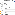

To remove a field from the form, either deselect it in the sidebar or click the trash button to the right of

the field (in the section).

Warning Do not remove a field that's in use by a batch that hasn't been fully processed.

DDeefifinnee FFoorrmm SSeeccttiioonnss

Forms start with a single section, but you can add more.

Simply click Add Section to add additional sections. Configure a section by clicking the gear button

within that section.

In Section Settings, you can rename the section, set it to be expanded or collapsed by default, or delete

it entirely.

Deleting a section from the form removes all of its fields. If any of those fields are required in all

templates (such as Donation Donor), you must re-add them before you can save the template.

You can also move sections within the form by clicking the up or down arrows in the section header.

SSeett FFiieelldd DDeettaaiillss

You can customize the appearance and configuration of your form's fields in many ways.

11.. Update a field's label by changing its Field Label value. The default labels include the Object Group

and the field label, which don't always translate into user-friendly field names. We highly recommend

updating them! Having a friendly user interface is key to good user adoption.

22.. Set a default value that the field has upon loading the form.

33.. Select the Required box to make sure that users fill out that field on the form.

44.. Move fields up or down within their section by clicking the up or down arrows.

When you're done configuring fields, click the Batch Header tab or the Next: Batch Header button to

add batch-specific information. If you don't need to configure a batch header, click Save & Close to

finish.

Batch Settings

If you're creating a template for gifts entered one at a time, you can skip this step.

Configure Batch Table Columns

The batch table appears at the bottom of the page when you enter gifts as a batch instead of one at a

time. If you have many fields on your form and all of these fields are included in your batch table, the

columns will be collapsed down to an unreadable width.

Configure Batch Header

This tab allows you to add information about a batch of gifts.

436

CCoonnfifigguurree BBaattcchh TTaabbllee CCoolluummnnss

The batch table appears at the bottom of the page when you enter gifts as a batch instead of one at a

time. If you have many fields on your form and all of these fields are included in your batch table, the

columns will be collapsed down to an unreadable width.

A new template includes the recommended fields, and the fields included in your form are available to

add. To add form fields to your batch table, move fields from Available Fields to Visible Fields and vice

versa to remove fields from the table. Use the up and down arrows to reorder the Visible Fields.

Note Status and Failure Information are required for batch processing and can't be removed from

the batch table.

CCoonnfifigguurree BBaattcchh HHeeaaddeerr

This tab allows you to add information about a batch of gifts.

The batch header fields included in NPSP are:

•

Batch Name

•

Batch Description

•

Expected Count of Gifts

•

Expected Total Batch Amount

•

Require Expected Totals Match

Add additional fields in the NPSP Data Import Batches object. See Create Custom Fields in Salesforce

help documentation for more information.

This tab is similar to the Form Fields tab. Select or deselect a field in the sidebar to add or remove it from

the fields list on the right. You can override the field label, set a default value, make it required, or change

its display order.

When you're done, click Save & Close.

SEE ALSO:

•

Enter Gifts in Gift Entry

NPSP Recurring Donation Administration

Learn how to customize Recurring Donation forms, automatic functionality, mapping to Opportunities,

how to use the API, and more.

Add Custom Fields to the Recurring Donation Entry Form

NPSP provides an entry form for Recurring Donations. Add your custom Recurring Donation fields to

the entry form.

437

Automate Recurring Donation Status Changes

Automate Recurring Donation Status changes when donors miss installment payments.

Automatic Recurring Donations Naming

NPSP provides an automatic naming convention for Recurring Donations. Learn how to customize it.

Change the Number of Installments Displayed in the Upcoming Installments Component

To adjust the number of installments shown in Upcoming Installments, edit the record page and

adjust the component settings.

Import Recurring Donations and Installment Opportunities

Learn how to bring existing recurring gift data into NPSP.

Map Custom Recurring Donation Status Values to a State

When you create custom picklist values for Recurring Donation Status, map them to a State so that

NPSP can process records with those custom Status values.

Map Recurring Donation Fields to Custom Opportunity Fields

Learn how to map fields from Recurring Donation records to Opportunity records, so that NPSP copies

the data to each new installment Opportunity.

Improve Recurring Donations Batch Processing Speed

Reduce batch processing time by excluding closed Recurring Donations.

Recurring Donations Installments API

Write Apex to query information about Recurring Donation Installments using the Installments API.

Recurring Donations Pause API

Write Apex code to pause a Recurring Donation programmatically using the Pause API.

Recurring Donations Schedules API

Write Apex to access information about the Recurring Donation Schedule object using the Schedules

API.

Add Custom Fields to the Recurring Donation Entry Form

NPSP provides an entry form for Recurring Donations. Add your custom Recurring Donation fields to the

entry form.

NPSP overrides the standard New and Edit buttons for Recurring Donations with a custom entry form.

The custom entry form helps users enter Recurring Donations correctly. For example, the available fields

on the entry form change based on whether the Recurring Type is Open or Fixed.

When you add custom fields to the Recurring Donations page layout, they're visible on record detail

pages but not editable in the entry form. If you want users to edit your custom fields, you must add them

to the entry form.

Let's say that your fundraising team wants to record notes about Recurring Donations as they enter or

edit them. To fulfill the request, you create a text field entitled Stewardship Notes and add it to the entry

form.

To add a custom field to the Recurring Donation entry form:

438

11.. In Setup, go to Object Manager | Recurring Donation.

22.. Click Field Sets.

33.. Click Recurring Donations Entry Form Custom Fields.

44.. Click and drag a custom field from the list of available fields to the section labeled In The Field Set. In

our example, we place Stewardship Notes in the field set.

55.. Click Save.

Your custom field appears in the Custom Fields section of the Recurring Donations entry form.

Note You can only add your own custom fields to the entry form, not fields included in NPSP.

Automate Recurring Donation Status Changes

Automate Recurring Donation Status changes when donors miss installment payments.

Sometimes donors miss their Recurring Donation installment payments, or stop donating entirely. Track

these events on Recurring Donations so you and your staff know when there's a lapse in giving.

In NPSP Settings, configure the Recurring Donation Status to change automatically when donations

aren't received as expected. Let's follow an example scenario and walk through how to make these

configuration changes.

Your development director decides that recurring gifts should:

•

Be marked as lapsed if the donor doesn't make their scheduled donation for 20 days.

•

Automatically close if a donor doesn't make their scheduled donation for 45 days.

In NPSP Settings:

11.. Click Recurring Donations | Status Automation.

22.. Click Edit.

33.. Enter 20 in Number of Days for Lapsed.

44.. Enter 45 in Number of Days for Closed.

55.. Save these settings.

Now you may be wondering, exactly when do these status updates occur? How does NPSP define a

missed installment payment? Let's look at a specific gift for an example. Let's say we have a monthly

donation started on June 1st, but the donor doesn't make their scheduled July payment.

Salesforce begins counting Number of Days for Lapsed and Number of Days for Closed on the day after

439

the expected installment date (July 2nd in our example). So the Recurring Donation is marked Lapsed 20

days later, on July 22nd, and marked Closed 45 days later, on August 16th.

There certainly are a lot of dates to keep track of here! To help you check your understanding of these

settings, we've provided a table of additional examples.

Number of Days for Number of Days for Lapsed Status Date Closed Status Date

Lapsed Closed

10 20 July 12th July 22nd

30 45 August 1st August 16th

60 90 August 31st September 30th

Each example represents a monthly donation initiated on June 1st.

Automatic Recurring Donations Naming

NPSP provides an automatic naming convention for Recurring Donations. Learn how to customize it.

By default, NPSP names your Recurring Donations automatically. Here's how it works:

11.. Go to the Recurring Donations tab and click New.

22.. Fill out the required fields (Amount, Donor Type, Recurring Period, etc.).

33.. Click Save.

Once you save the record, NPSP creates the Recurring Donation Name using this format:

[DonorName] [Amount] - Recurring

[DonorName] is Contact Name when the Donor Type is Contact, or the Account Name when the Donor

Type is Account and the Account is an Organizational Account. Let's look at some examples.

•

If you enter a new $100 Recurring Donation for Barbara Levy, the name becomes:

- Barbara Levy $100 - Recurring

•

If you enter a new $500 Recurring Donation for Universal Containers, the name becomes:

- Universal Containers $500 - Recurring

Change Automatic Naming Format

A system administrator can change the default naming format in NPSP Settings. Here's how:

11.. Click the NPSP Settings tab. If you don't see the tab, find it in the App Launcher ( ).

22.. Click Recurring Donations | Recurring Donations.

440

33.. Find Recurring Donation Name Format and select your desired format.

44.. Click Save.

Disable Automatic Naming

If you have your own naming convention that you'd rather use, you can disable Automatic Recurring

Donation Naming. When you disable naming, users will see the Recurring Donation Name field in the

record entry and edit screens.

11.. Go to NPSP Settings | Recurring Donations | Recurring Donations.

22.. Find Recurring Donation Name Format and select Disable Auto Naming.

33.. Click Save.

Change the Number of Installments Displayed in the Upcoming

Installments Component

To adjust the number of installments shown in Upcoming Installments, edit the record page and adjust

the component settings.

11.. On a Recurring Donation record, click the gear icon then click Edit Page.

22.. Click the Upcoming Installments component, then update Number of installments to display. 12 is

the default value.

33.. Click Save.

Note Upcoming Installments is a calculated display of installment Opportunities based on the field

data on the Recurring Donation. If you change field data on an upcoming Opportunity, those

changes won't be reflected in the Upcoming Installments visualization.

441

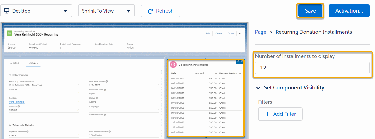

Import Recurring Donations and Installment Opportunities

Learn how to bring existing recurring gift data into NPSP.

You should be familiar with editing spreadsheets and using a data import tool such as Data Loader.

If you're using Elevate for your online donations, see Import Recurring Donations Overview.

Setup—Before You Begin

11.. Confirm that you've upgraded to Enhanced Recurring Donations. See Which Version of Recurring

Donations Am I Using?

22.. Confirm that you've enabled Automatic Recurring Donation Naming. Alternatively, you can plan to

include Recurring Donations Names in your import spreadsheet.

33.. Confirm that you've mapped Recurring Donation Fields to Opportunity Fields.

Import Records

Note The field values in the Recurring Donation entry form are slightly different than what's stored

in the database. For example, there is no Donor Type field on the Recurring Donation object. Review

the Recurring Donation object schema before you build your import spreadsheet.

11.. Prepare your Recurring Donation spreadsheet for import.

aa.. If you don't want NPSP to create a future, open Opportunity for your Recurring Donations, include

Disable First Installment = TRUE for all rows in your spreadsheet.

22.. Import your Recurring Donation records. It's a good idea to import just a few records the first time so

you can confirm that your data and field mapping is correct.

33.. Prepare your Opportunity spreadsheet for import. Here are some important considerations:

aa.. You only need to import past Opportunity records. NPSP automation takes care of future

installment Opportunities.

bb.. Decide if you want NPSP to create a default GAU when you import your Opportunity records. Check

the Default Allocations Enabled setting in NPSP Settings.

44.. Import your Opportunity records. It's a good idea to import just a few records the first time so you can

confirm that your data and field mapping is correct.

After You Import

11.. In NPSP Settings | Bulk Data Processes, run the Recurring Donations Batch to update Recurring

442

Donation rollup fields.

Map Custom Recurring Donation Status Values to a State

When you create custom picklist values for Recurring Donation Status, map them to a State so that NPSP

can process records with those custom Status values.

Note Your user profile must have access to the RD2_StatusMappingSettings_CTRL apex class

to use Status to State mapping.

State describes NPSP Recurring Donation processing behaviors. The following States are available:

•

Active: The donor is actively donating. NPSP creates installment Opportunities as defined by the

Recurring Donation schedule.

•

Lapsed: The donor isn't making donations as expected, but NPSP still creates installment

Opportunities as defined by the Recurring Donation schedule.

•

Closed: The donor stopped making donations for this Recurring Donation. NPSP doesn't create any

new installment Opportunities.

Here's how this works in practice. Let's say you create a Status called Expired Card to track when a

donor's credit card has expired. You don't want to immediately close out the Recurring Donation because

you want to ask the donor if they have updated card information first. In this example, the State behavior

you want NPSP to use is Lapsed. There's going to be a lapse in the donor's giving until you can obtain

new card information.

Important If you don't map your custom Status, you won't be able to create or update Recurring

Donations that use those custom Statuses.

To map a custom Status value to a State:

11.. Click the NPSP Settings tab. If you don't see the tab, find it in the App Launcher ( ).

22.. Click Recurring Donations | Status to State Mapping.

33.. Click Edit.

44.. Assign a State to each of your custom Status values.

55.. Click Save.

Note Recurring Donations includes standard Status values that are already mapped to their

corresponding State: Active, Lapsed, and Closed. These standard Status values are required for

Recurring Donations, so don't remove them from your org!

443

Map Recurring Donation Fields to Custom Opportunity Fields

Learn how to map fields from Recurring Donation records to Opportunity records, so that NPSP copies

the data to each new installment Opportunity.

Default Field Mapping

When NPSP creates installment Opportunity records for a Recurring Donation, it copies the values of

several fields from the Recurring Donation onto the Opportunity records. This is a big time saver, as it

means you don't have to manually enter values for all those fields on each Opportunity record

Custom Field Mapping

Use Recurring Donation Custom Field Mapping to copy custom fields from Recurring Donations to

installment Opportunities whenever you create a new Recurring Donation. This ensures that details

from the Recurring Donation record appear on the Opportunity records for easy reference.

Default Field Mapping

When NPSP creates installment Opportunity records for a Recurring Donation, it copies the values of

several fields from the Recurring Donation onto the Opportunity records. This is a big time saver, as it

means you don't have to manually enter values for all those fields on each Opportunity record

The following table describes how NPSP maps fields from the Recurring Donation to its installment

Opportunity records when the Recurring Donation is first created.

Recurring Donation Field Opportunity Field Explanation

Created By Created By NPSP copies the value of the

Created By field from the

Recurring Donation to the

Opportunity.

Owner Owner NPSP copies the value of the

Owner field from the Recurring

Donation to the Opportunity.

Account Account Name NPSP copies the Account from

the Recurring Donation to the

Account Name field on the

Opportunity.

Contact Primary Contact NPSP copies the value of the

Contact field on the Recurring

Donation to the Primary Contact

field on the Opportunity.

Next Donation Date Close Date NPSP copies the Next Donation

Date from the Recurring

Donation to the Close Date on

444

Recurring Donation Field Opportunity Field Explanation

the Opportunity.

Amount Amount NPSP copies the Amount from

the Recurring Donation to the

Amount on the Opportunity.

Campaign Primary Campaign Source NPSP copies the Campaign from

the Recurring Donation to the

Primary Campaign Source on the

Opportunity.

CurrencyISOCode CurrencyISOCode NPSP copies the

CurrencyISOCode from the

Recurring Donation to the

CurrencyISOCode on the

Opportunity.

The default Stage for Opportunities in a Recurring Donation is Pledged. This default can be changed by

altering the Recurring Donation Stage Name Custom Label. For more information, see Customize Labels.

Custom Field Mapping

Use Recurring Donation Custom Field Mapping to copy custom fields from Recurring Donations to

installment Opportunities whenever you create a new Recurring Donation. This ensures that details from

the Recurring Donation record appear on the Opportunity records for easy reference.

Mapping requires that you have two fields (one on the Recurring Donation and one on the Opportunity)

of a matching data type in order to create a mapping between them. A matching data type means that

you can only map a Date field to a Date field, a Text field to a Text field, and so on.

Note Large Text Area fields are not supported for custom field mapping.

Let's look at a field mapping example.

Say that your organization sometimes receives Recurring Donations "in honor of" a person of the donor's

choosing. There's already an Honoree Contact field on the Opportunity object for tracking that, but if we

create an Honoree field on the Recurring Donation, we can map them together. That way you only need

to enter the Honoree on the Recurring Donation, and the field data gets copied to all related

Opportunities.

Here's how.

11.. First, make sure you've created the custom fields you want to map. In this example, we created a

lookup field (to Contact) on the Recurring Donation object called Honoree.

22.. Click the NPSP Settings tab.

445

Note If you don't see the NPSP Settings tab in your org, you can find it in the App Launcher.

33.. Click Recurring Donations | Recurring Donation Custom Field Mappings.

44.. Click New Custom Field Mapping.

55.. In Recurring Donation Field, select the custom field you created on the Recurring Donation object.

66.. In Opportunity Field, select the corresponding field on the Opportunity object.

77.. Click Create Custom Field Mapping.

The new field mapping appears in the mapped fields list.

If you need to delete a mapping, click Del under Action in the mapped fields list. When you delete a field

mapping, the data that had already been copied to the Opportunity records remains unchanged.

Improve Recurring Donations Batch Processing Speed

Reduce batch processing time by excluding closed Recurring Donations.

To decrease the number of donations included in the Recurring Donations batch job, turn on the

Exclude Closed Recurring Donations setting. This excludes closed Recurring Donations from the

Recurring Donation Opportunity batch job. To turn on the setting:

11.. Go to Setup.

22.. In the Quick Find box, enter Custom Settings, then click Custom Settings.

33.. Next to Recurring Donations Settings, click Manage.

44.. Click Edit.

55.. To turn on the setting, select Exclude Closed Recurring Donations.

66.. Save your settings.

Note Learn more about running the Recurring Donations batch job in Manually Process Batch Jobs.

Recurring Donations Installments API

Write Apex to query information about Recurring Donation Installments using the Installments API.

The Recurring Donations Installments API is intended to meet the needs of customers and partners who

require visibility into planned installments beyond the Next Year and Current Year totals provided out of

the box. The Installments API provides access to installments calculated by active and paused schedules.

Paused installments are omitted from the returned list of installments.

446

In addition to the Installments API, we provide a Schedules API which returns all Schedules associated

with a Recurring Donation, including current, past, and paused schedules.

The Installments API only queries installments calculated by NPSP, not actual Opportunity records,

either Open or Closed.

Call Format

•

Global Class implementing the API: Callable_API

•

Global Method: call()

•

Parameters: Map<String, Object>

Name Datatype Required Description

StartDate date Yes Default is Date.today()

EndDate date No Default is one year of

installment data.

RecordIds string Yes Recurring Donation Ids.

JSON Response Format

The JSON response format shows Installment information listed by Recurring Donation Id.

Name Datatype Required Description

scheduleId string Yes The Schedule record

this installment relates

to. NOTE: The Schedule

object is protected. Use

the Schedules API to

access Schedule object

info.

recurringDonationId string Yes The Recurring Donation

record this installment

relates to.

paymentMethod string No Payment method for

this installment. For

example, Check, Credit

Card, ACH, etc.

installmentAmount integer Yes The amount for this

installment, based on

the Recurring Donation

447

Name Datatype Required Description

schedule.

currencyCode string Yes The currency ISO code

for this installment. For

example, USD.

closeDate date Yes The close date for this

installment.

campaignId string No The Campaign record

this installment relates

to.

Code Sample and JSON Response

In this example, we want to find the next 90 days of installment information for all active Recurring

Donations.

Code Sample

Map <String, Object> callMap = new Map<String, Object>();

Set<Id> Ids = new Map<Id, npe03__Recurring_Donation__c>([SELECT Id FROM npe0

3__Recurring_Donation__c WHERE npsp__Status__c='Active']).keySet();

callMap.put('StartDate', Date.today());

callMap.put('EndDate', Date.today().addDays(90));

callMap.put('RecordIds', Ids);

npsp.Callable_API apiTest = new npsp.Callable_API();

String jsonResponse = String.valueOf(apiTest.call('rd2.queryinstallments', cal

lMap));

JSON Response

{

"a092D000003Vp8pQAC": [

{

"scheduleId": "a0n2D000001B1mFQAS",

"recurringDonationId": "a092D000003Vp8pQAC",

"paymentMethod": "Check",

"installmentAmount": 100,

448

"currencyCode": "USD",

"closeDate": "2020-12-04",

"campaignId": null

},

{

"scheduleId": "a0n2D000001B1mFQAS",

"recurringDonationId": "a092D000003Vp8pQAC",

"paymentMethod": "Check",

"installmentAmount": 100,

"currencyCode": "USD",

"closeDate": "2021-01-04",

"campaignId": null

},

{

"scheduleId": "a0n2D000001B1mFQAS",

"recurringDonationId": "a092D000003Vp8pQAC",

"paymentMethod": "Check",

"installmentAmount": 100,

"currencyCode": "USD",

"closeDate": "2021-02-04",

"campaignId": null

},

],

"a092D000003V4ngQAC": [

{

"scheduleId": "a0n2D000001B0AnQAK",

"recurringDonationId": "a092D000003V4ngQAC",

"paymentMethod": "Check",

"installmentAmount": 100,

"currencyCode": "USD",

"closeDate": "2020-12-01",

"campaignId": null

},

{

"scheduleId": "a0n2D000001B0AnQAK",

"recurringDonationId": "a092D000003V4ngQAC",

"paymentMethod": "Check",

"installmentAmount": 100,

"currencyCode": "USD",

"closeDate": "2021-01-01",

"campaignId": null

},

{

"scheduleId": "a0n2D000001B0AnQAK",

449

"recurringDonationId": "a092D000003V4ngQAC",

"paymentMethod": "Check",

"installmentAmount": 100,

"currencyCode": "USD",

"closeDate": "2021-02-01",

"campaignId": null

}

]

}

Recurring Donations Pause API

Write Apex code to pause a Recurring Donation programmatically using the Pause API.

With their recurring giving, your loyal donors provide your organization with a consistent source of

funding. But life happens and a donor might request to temporarily suspend their giving due to travel,

job loss, or unexpected expenses.

While CRM users can Pause a Recurring Donation through the user interface, NPSP also provides an API

for pausing and unpausing Recurring Donations programmatically.

Call Format

•

Global Class implementing the API: Callable_API

•

Global Method: call()

•

Parameters: Map<String, Object>

Name Data Type Required

PauseData Map<Id, PauseDataObject> Yes

Note You can process up to 200 records in a single API call. If you have more records to process, use

a batch or queueable job.

PauseDataObject JSON Format

Construct the JSON request format with PauseDataObject mapped by Recurring Donation ID.

To pause a Recurring Donation, set the startDate and endDate, but set unPause to either false or null.

Name Data Type Required Description

startDate Date No The pause start date

450

Name Data Type Required Description

endDate Date No The pause end date

statusReason String No The pause reason.

Values should match

the Status Reason

picklist.

unPause Boolean No Use true to unpause a

Recurring Donation.

To unpause a Recurring Donation, only unPause needs to set to true. startDate and endDate should be

null.

JSON Response Format

The JSON response format shows pause information mapped by Recurring Donation ID.

Name Data Type Required Description

startDate Date No The pause start date

endDate Date No The pause end date

statusReason String No The pause reason

unPause Boolean No True means an unPause

was requested.

isSuccess Boolean Yes True means a successful

request.

Error String Yes A successful request

returns 'OK'. A failed

request returns an error

message.

Code Sample and JSON Response

Code Sample

// NOTE: Replace the "rd_id_n" in the set below with real recurring donation r

ecord ids

Map<Id,Object> rdPauseData = new Map<Id,Object>{

'rd_id_1' => new PauseData(

Date.Parse('04/01/2021'), Date.Parse('06/01/2021'), 'Vacation'

451

),

'rd_id_2' => new PauseData(

Date.Parse('07/01/2021'), Date.Parse('10/01/2021'), 'Job Change'

),

'rd_id_3' => new PauseData(true), /* Unpause an Rd */

'rd_id_4' => new PauseData(

Date.Parse('10/01/2021'), Date.Parse('05/01/2021'), 'Invalid Dates Tes

t: end date before start date'

),

'rd_id_5' => new PauseData(

Date.Parse('01/01/2025'), Date.Parse('05/01/2025'), 'valid Dates Test'

),

'rd_id_6' => new PauseData(

Date.Parse('01/01/2019'), Date.Parse('03/01/2019'), 'Invalid Dates Tes

t: start date in the past'

),

'rd_id_7' => new PauseData(

Date.Parse('10/01/2021'), Date.Parse('10/01/2025'), 'Invalid Dates Tes

t: start and end date is more than 12 months'

),

'003C00342992343' => new PauseData(

Date.Parse('10/01/2021'), Date.Parse('05/01/2021'), 'Invalid RdId Tes

t: Id not valid'

)

};

Map<String, Object> params = new Map<String, Object> { 'PauseData' => rdPauseD

ata };

try {

// Convert Pause Data to Maps

for (Id key : rdPauseData.keySet()) {

String JSONPauseData = JSON.serialize(rdPauseData.get(key));

rdPauseData.put(key, (Map<String, Object>)JSON.deserializeUntyped(JSON

PauseData));

}

Map<String, Object> params = new Map<String, Object> { 'PauseData' => rdPa

useData };

// Convert Pause Data to Maps

for (Id key : rdPauseData.keySet()) {

String JSONPauseData = JSON.serialize(rdPauseData.get(key));

452

rdPauseData.put(key, (Map<String, Object>)JSON.deserializeUntyped(JS

ONPauseData));

}

Map<String, Object> params = new Map<String, Object> { 'PauseData' => rdPauseD

ata };

npsp.Callable_API apiTest = new npsp.Callable_API();

String jsonResponse = String.valueOf(apiTest.call('rd2.pause', params));

Map<Id, PauseData> result =

(Map<Id, PauseData>)JSON.deserialize(jsonResponse, Map<Id, PauseDat

a>.class);

} catch(Exception ex) {

System.debug('- Error Caught ' + ex.getMessage());

}

/**

* Object structure that is passed to the api call with the RD data to pause

* and is returned as the call response.

*/

private class PauseData {

// Values passed TO the api:

public Date startDate;

public Date EndDate;

public String statusReason;

public Boolean unPause;

// Values returned by the api:

public Boolean isSuccess;

public String error;

// Constructor to define required values to pass to the api.

public PauseData(Date startDate, Date endDate, String reason) {

this.startDate = startDate;

this.endDate = endDate;

this.statusReason = reason;

this.unPause = false;

}

// Constructor to unpause an Rd

public PauseData(Boolean unPause) {

this.unPause = unPause;

}

}

453

JSON Response

{

"a092D000003Vp8pQAC":

{

"startDate" : 2021-06-14

"endDate" : 2021-12-16

"statusReason" : "vacation"

"unPause" : false

"isSuccess" : true

"error" : "OK"

},

"a092D000003V4nHQAC":

{

"unPause" : true

"isSuccess" : true

"error" : "OK"

},

"a092D000003V4ngQAC":

{

"startDate" : 2021-06-14

"endDate" : 2021-01-12

"statusReason" : "vacation"

"unPause" : false

"isSuccess" : false

"error" : "The pause End Date must be greater than the Start Date."

},

"a092D000003V4nIQAC":

{

"startDate" : 2021-06-14

"endDate" : 2021-12-16

"unPause" : true

"isSuccess" : false

"error" : "UnPause requests cannot include Start Date or End Date."

},

"a092D000003V4nJQAC":

{

"startDate" : 2021-06-14

"endDate" : 2025-12-16

"unPause" : true

"isSuccess" : false

"error" : "You can't pause Recurring Donations for more than a year. The

pause End Date must be less than one year after the Start Date."

},

454

}

Recurring Donations Schedules API

Write Apex to access information about the Recurring Donation Schedule object using the Schedules

API.

The Recurring Donations Schedules API is intended to meet the needs of customers and partners who

require visibility into the protected Recurring Donation Schedule object. The Schedules API returns all

Schedules associated with a Recurring Donation, including current, past, and paused schedules.

In addition to the Schedules API, we provide an Installments API which returns the projected

installments generated from the schedules associated with the Recurring Donation.

Call Format

•

Global Class implementing the API: npsp.Callable_API

•

Global Method: npsp.call()

•

Parameters: Map<String, Object>

Name Datatype Required Description

RecordIds string Yes Recurring Donation Id.

JSON Response Format

The JSON response format shows Schedule information listed by Recurring Donation Id.

Name Datatype Required Description

statusReason string No Additional details for

the Schedule. For

example, a paused

reason for a paused

schedule.

startDate Date Yes The Schedule start date.

scheduleId string Yes The Id of this Schedule

record.

recurringDonationId string Yes The Recurring Donation

record this Schedule

relates to.

455

Name Datatype Required Description

paymentMethod string No Payment method for

this Schedule. For

example, Check, Credit

Card, ACH, etc.

lastModifiedDate date Yes The date this Schedule

was last modified.

isPause boolean Yes Identifies a paused

Schedule. Pauses are

implemented with a

Schedule which runs in

parallel with other

Schedules. Installments

which fall between

startDate and endDate

inclusive of a paused

Schedule are skipped.

isCurrent boolean Yes Identifies a Schedule as

currently running where

startDate <= today and

endDate is null or >=

today.

isActive boolean Yes Identifies a Schedule as

currently running or is a

future Schedule where:

endDate is null or >=

today. All Schedules

where isActive == true

are considered in the

creation of upcoming

installments.

installmentPeriod string Yes Defines the installment

schedule along with

Installment Frequency.

For example, if

Installment Period is

Monthly and

Installment Frequency

is 3, the schedule would

be defined as "every 3

months".

456

Name Datatype Required Description

installmentFrequency integer Yes Defines the installment

schedule along with

Installment Period. For

example, if Installment

Period is Monthly and

Installment Frequency

is 3, the schedule would

be defined as "every 3

months".

installmentAmount integer Yes The amount for each

installment

Opportunity.

endDate date No The Schedule end date.

dayOfMonth string No Sets the specific day of

the month for future

installment

Opportunities when the

Installment Period is

Monthly.

currencyCode string Yes The currency ISO code

for this Schedule. For

example, USD.

createdDate date Yes The date this Schedule

record was created.

campaignId string No The Campaign record

this Schedule relates to.

Code Sample and JSON Response

In this example, we want to know Schedule information for two specific Recurring Donations.

Code Sample

Map <String, Object> callMap = new Map<String, Object>();

callMap.put('RecordIds', new Set<Id>{'a092D000003Vp8pQAC','a092D000003V4ngQA

C'});

npsp.Callable_API apiTest = new npsp.Callable_API();

457

String jsonResponse = String.valueOf(apiTest.call('rd2.queryschedules', callMa

p));

JSON Reponse

{

"a092D000003Vp8pQAC": [

{

"statusReason": null,

"startDate": "2020-11-04",

"scheduleId": "a0n2D000001B1mFQAS",

"recurringDonationId": "a092D000003Vp8pQAC",

"paymentMethod": "Check",

"lastModifiedDate": "2020-11-04T21:06:00.000Z",

"isPause": false,

"isCurrent": true,

"isActive": true,

"installmentPeriod": "Monthly",

"installmentFrequency": 1,

"installmentAmount": 100,

"endDate": null,

"dayOfMonth": "4",

"currencyCode": "USD",

"createdDate": "2020-11-04T21:06:00.000Z",

"campaignId": null

}

],

"a092D000003V4ngQAC": [

{

"statusReason": null,

"startDate": "2017-11-01",

"scheduleId": "a0n2D000001B0AnQAK",

"recurringDonationId": "a092D000003V4ngQAC",

"paymentMethod": "Check",

"lastModifiedDate": "2020-11-04T17:42:56.000Z",

"isPause": false,

"isCurrent": true,

"isActive": true,

"installmentPeriod": "Monthly",

"installmentFrequency": 1,

"installmentAmount": 100,

"endDate": null,

"dayOfMonth": "1",

"currencyCode": "USD",

458

"createdDate": "2020-11-03T00:09:31.000Z",

"campaignId": null

}

]

}

NPSP Troubleshooting

Troubleshoot challenges with NPSP features, view common errors, interpret health check issues, and

learn about account models.

View NPSP Errors

Use the error log in NPSP settings to learn more about issues in your org.

Common Health Check Errors

Learn about errors you can encounter when you run a health check on your NPSP org.

Which Account Model Am I Using?

This article explains how to identify your Account Model, and which fields to analyze when

troubleshooting Household Account record issues.

View NPSP Errors

Use the error log in NPSP settings to learn more about issues in your org.

From the NPSP Settings tab, click System Tools | Error Log.A variety of information is provided for

notification and debugging purposes when working with errors. The error log contains these fields:

Note If you don't see the NPSP Settings tab in your org, you can find it in the App Launcher.

•

DateTime - The date and time that the error occurred.

•

Error Type - The type of exception (error) that occurred.

•

Full Message - The error message provided by the system.

•

Object Type - Type of object on which the error occurred, if known.

•

Record URL - A link to the record that caused the error, if available.

•

Stack Trace - Stack trace for the thrown error, if available at runtime.

459

Note NPSP errors will only be stored if Error Handling is enabled in System Tools | Error

Notifications. See Configure Error Handling for more information.

Common Health Check Errors

Learn about errors you can encounter when you run a health check on your NPSP org.

For instructions on how to run an NPSP health check, see Run a Health Check in Your Org.

Note Watch the Nonprofit Salesforce How-To Series video about Health Check.

Opportunity Contact Roles (aka Duplicate Primary Opportunity Contact Roles)

Learn how to fix duplicate Opportunity Contact Roles that are set as primary.

Account Data (aka Orphaned One-to-One Accounts)

Learn how to fix one-to-one Accounts that don't have related Contacts.

Account Model Data (aka Incorrect Account Model Data)

Learn how to fix inconsistent or inaccurate account model types after migrating to the household

account model.

Account Model Data (aka Mixed Account Models)

Learn how to fix a mix of household and one-to-one account types.

Recurring Donations

Learn how to fix Opportunity stages for recurring donations.

Household Object Data (aka Orphaned Household Object Data)

Learn how to fix NPSP 2 Households that don't have any related Contacts.

Opportunity Contact Roles (aka Duplicate Primary Opportunity Contact

Roles)

Learn how to fix duplicate Opportunity Contact Roles that are set as primary.

Error Text: There were X opportunities found that had more than one Opportunity Contact Role marked

as Primary. Having multiple OpportunityContactRoles marked Primary can cause Opportunity rollups,

such as Total Gifts, to be incorrectly calculated. View these Opportunities by running the Opportunities

460

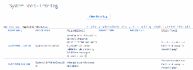

with Primary Contact Roles report in the NPSP Health Check reports folder, and looking at the records

with 2 or more Primary Contact Roles.

Reason: There are one or more opportunities that have two or more related Opportunity Contact Roles

marked as primary. This can happen if someone enters a Primary Contact Role for an opportunity that

already has one, either manually or via data import tool such as the Salesforce Data Loader. This can

cause issues with reports and other data, as Opportunity rollups may be miscalculated.

Steps to Fix: Find out which opportunities are affected by running the Opportunities with Primary

Contact Roles report. Then, ensure that each Opportunity only has one Contact Role marked as Primary.

11.. Click the Reports tab.

22.. In the left menu, click All Folders.

33.. Click NPSP Health Check.

44.. Click the Opportunities with Primary Contact Roles report. Opportunities with more than one

contact role will appear at the top.

Note The report is limited to Opportunities with a Close Date in the last 90 days, so you may need

to adjust the date filter.

55.. In the report, click the Opportunity Name of an opportunity you need to fix.

66.. Go to the Contact Roles related list. You should see a listing of all the roles marked as Primary:

77.. Edit or delete each role until you're left with a single Contact Role marked as primary.

88.. Repeat this process for all affected opportunities. If you have a large amount of opportunities,

consider using the Data Importer.

461

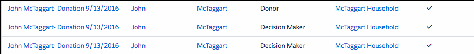

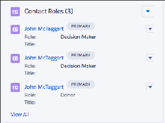

Account Data (aka Orphaned One-to-One Accounts)

Learn how to fix one-to-one Accounts that don't have related Contacts.

Error Text: There are X One-to-One Accounts who have no Contacts. Consider deleting these unused

One-to-One Accounts to save space.

Reason: There are one or more One-to-One Accounts (the _SYSTEM: AccountType field value is One-to-

One Individual) that have no related Contacts or a blank Primary Contact field. This can happen after

migrating from one Account Model to another or if all Contacts get deleted from a particular Account but

the Account itself isn't deleted.

Steps to Fix: Ensure that all One-to-One Individual Accounts have related Contacts.

11.. To identify the Accounts causing the error, run a report with this criteria:

••

_SYSTEM: AccountType equal to One-to-One Individual

••

Number of Household Members set to 0

22.. For each Account listed, either add Contacts or delete the Account (if it's no longer used).

Account Model Data (aka Incorrect Account Model Data)

Learn how to fix inconsistent or inaccurate account model types after migrating to the household

account model.

Error Text: X Account records using the Household Account [or One-to-One Individual] record type do

not have their System fields correctly set. For Household Accounts, make sure

npe01__SYSTEM_AccountType__c is 'Household Account'. For One-to-One Accounts, make sure

npe01__SYSTEM_AccountType__c is 'One-to-One Individual'. Also make sure for both,

npe01__SYSTEMISINDIVIDUAL__c is true.

Reason: This can often happen after an upgrade to Nonprofit Success Pack or a migration between

Account Model types. If you're migrating to the Household Account Model from the One-to-One or vice

versa, you may get this error if the npe01__SYSTEM_AccountType__c does not match the proper record

type. Additionally, you may have inadvertently changed some of these (particularly if they are exposed on

your page layouts). This can impact how NPSP deals with your data, as it may not be sure which Account

record is which.

Steps to Fix: Find out which Accounts are affected by running the Individual Accounts by Account Type

report. Then, update the affected Accounts' _SYSTEM: AccountType field.

11.. Click the Reports tab.

22.. In the left menu, click All Folders.

33.. Click NPSP Health Check.

44.. Click Individual Accounts by Account Type. This report shows the individual Accounts by _SYSTEM:

AccountType.

462

55.. To view a detailed list of Accounts, click , then select the Details checkbox. Click Apply.

66.. Click on the name of an Account you need to fix. This takes you to the Account details.

77.. Click Edit.

88.. Change the value in the _SYSTEM: AccountType field to match the Record Type selected as the

Account Model in NPSP Settings.

Note If you don't see the _SYSTEM: AccountType field, you may need to add it to your Account

page layout.

99.. Click Save.

1100.. Repeat these steps for each Account whose _SYSTEM: AccountType needs to change.

Account Model Data (aka Mixed Account Models)

Learn how to fix a mix of household and one-to-one account types.

Error Text: The Account Model is set to Household Account, but Health Check has found that you're

using a mixture of Account types. All of your Accounts should use the same Account Model. View all of

your Accounts and their types by running the Individual Accounts by Account Type report in the NPSP

Health Check reports folder.

Reason: This error is caused by Accounts in Salesforce having more than one individual _SYSTEM:

AccountType—typically a mix of Household Accounts and One-to-One Individual Accounts. This occurs

when you:

•

Change from the Household Account Model to the One-to-One Individual Model in NPSP Settings

without fully migrating existing Account/Contact records. Changing the Account Model in NPSP

Settings only affects records created after you make the change; it doesn't update your existing

records.

•

Migrate to Nonprofit Success Pack and convert to the Household Account model, but do not verify and

delete the One-to-One Account records.

Steps to Fix: Find out which Accounts have different Account Models using the Individual Accounts by

Account Type report. Then, update the affected Accounts' _SYSTEM: AccountType field.

11.. Click the Reports tab.

22.. In the left menu, click All Folders.

33.. Click NPSP Health Check.

44.. Click Individual Accounts by Account Type.

463

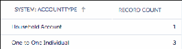

55.. Click , then select the Details checkbox. This will show the names of the Accounts.

66.. Click the name of Account that you need to fix. This takes you to the Account details.

77.. Click Edit.

88.. Change the value in the _SYSTEM: AccountType field to match the Record Type selected as the

Account Model in NPSP Settings.

Note If you don't see the _SYSTEM: AccountType field, you may need to add it to your Account

page layout.

99.. Click Save.

1100.. Repeat these steps for each Account whose _SYSTEM: AccountType needs to change. (You may need

to use a data import tool to fix this issue if there are too many records to fix manually.)

Important If you migrated from one Account Model to another and want to delete any of the

leftover Accounts, ensure that all data has been moved over and everything has been related and

re-parented properly.

Recurring Donations

Learn how to fix Opportunity stages for recurring donations.

Error Text: The Opportunity stage Pledged does not exist or is not active. Add this Opportunity Stage

value in Salesforce Setup.

Reason: This error is caused by a Custom Label containing the value ‘Pledged', but there isn't a matching

Opportunity Stage. When installing NPSP for the first time, you may see this error.

Steps to Fix: Create the Pledged stage. To do this:

11.. Click , then click Setup.

22.. Click the Object Manager tab.

33.. In the list of objects, click Opportunity.

44.. Click Fields & Relationships.

55.. Click the Stage field. You may need to toggle through multiple pages of fields to find the Stage field.

66.. In the Opportunity Stages Picklist Values list, click New.

77.. In the Stage Name field, enter Pledged.

88.. Make sure the Type is set to Open.

99.. Set a Probability and Forecast Category, then click Save.

If your process doesn't call for a Pledged stage, you can change the Custom Label to match whatever

you'd like the Recurring Donation stage to be set to. To do this:

464

11.. Click , then click Setup.

22.. In Setup, enter Custom Labels in the Quick Find box, then select Custom Labels under the User

Interface menu.

33.. Click RecurringDonationStageName.

44.. Click New Local Translations/Overrides.

55.. Select English for the Language.

66.. Type the value you'd like to use in the Translation Text box.

77.. Click Save.

Household Object Data (aka Orphaned Household Object Data)

Learn how to fix NPSP 2 Households that don't have any related Contacts.

Error Text: There are X Household objects who have no Contacts. Consider deleting these unused

Household objects to save space. If you have completed a conversion to the Household Account model

and no longer need the data on the Household object records they can be deleted. View these

Household objects by running the Empty Household Objects report in the NPSP Health Check reports

folder.

Reason: This error is caused by having Household Objects (only used in One-to-One and Individual

Bucket models) that have no Contacts in them. This error can happen for many reasons:

•

Deleting a Contact or changing the Household relationships manually.

•

Converting to the Household Account model may leave you with empty Households since your

Contacts will move to their new Household Accounts.

Accordingly, we recommend that you set the Household Object Rules setting to ‘No Contacts' in NPSP

Settings (under People | Households).

Steps to Fix:

11.. Click the Reports tab.

22.. In the left menu, click All Folders.

33.. Click NPSP Health Check.

44.. Click Empty Household Objects.

55.. Manually delete each record listed in this report. If there are too many to delete manually, consider

using a data import tool.

Which Account Model Am I Using?

This article explains how to identify your Account Model, and which fields to analyze when

troubleshooting Household Account record issues.

Identify Your Account Model

Open NPSP Settings to learn what account model you're using.

Troubleshoot Account Model Fields

465

When you change the account model in NPSP Settings, you determine the Account Model for new

Accounts going forward. Existing Accounts created using a different Account Model aren't

automatically updated. If your org updated the Account Model but did not convert the existing

Accounts, troubleshoot and update the Account Record Type, _SYSTEM:AccountType, and

_SYSTEM:IsIndividual fields on individual Account records

Identify Your Account Model

Open NPSP Settings to learn what account model you're using.

11.. Click the NPSP Settings tab. If you don't see the tab, find it in the App Launcher ( ).

22.. In NPSP Settings, click People | Account Model. Your Account Model is shown in the Account Model

field.

Note Changing the Account Model in NPSP Settings does not update existing Accounts. It only sets

the Account Model for Account records created from that point forward. See Change My Account

Model for more information.

Note If you're on an earlier version of Nonprofit Success Pack, such as Nonprofit Starter Pack, look

for your Account Model on the Contacts Settings tab.

466

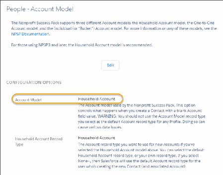

